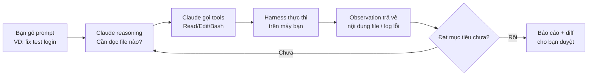
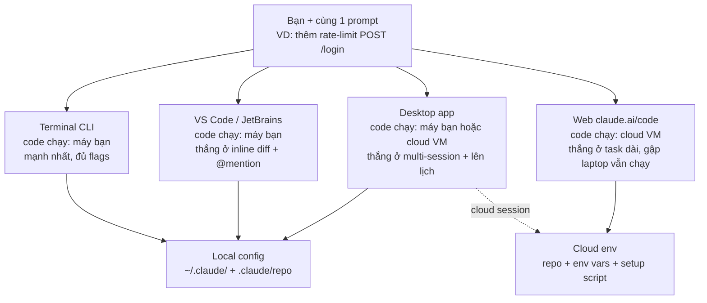

# 00 — Tổng quan Claude Code: Tư duy agent, không phải chatbot

> **Bài này cho ai:** dev mới nghe tên Claude Code muốn có bức tranh toàn cảnh trước khi đi sâu từng cấu hình.
> **Cần gì trước:** đã cài và đăng nhập Claude Code (làm theo [01-cai-dat-va-xac-thuc.md](./01-cai-dat-va-xac-thuc.md)); chưa cần biết gì thêm.
> **Đọc xong bạn làm được:**
> - Kể lại được vòng lặp agent và 4 nhóm tool cho đồng nghiệp trong 2 phút.
> - Viết được 1 prompt giao việc cho agent (có phạm vi + lệnh verify), phân biệt với prompt kiểu chatbot.
> - Giải thích được vì sao CLAUDE.md phình làm bạn tốn token và chỉ ra cách cắt giảm.
> - Chạy xong session đầu tiên trong repo thật: `claude` → `/init` → 1 task nhỏ → `/cost`, và biết bản đồ toàn bộ khóa học để đi tiếp bài nào.
> **Thời gian:** ~25 phút đọc + ~30 phút làm walkthrough mục 8

> **Cách đọc file này (để không bị ngợp):** mỗi khái niệm mới đều có 3 dòng: **Định nghĩa 1 câu**
> → **Ví dụ đời thường** → **Ví dụ kỹ thuật copy-paste được**. Cuối mỗi mục có khối **Kiểm tra nhanh:**
> gộp hết câu "làm xong thấy gì" của mục đó.

## Thuật ngữ dùng trong bài này

Đọc bảng này trước khi vào mục 1 — mọi thuật ngữ Anh trong bài đều được giải thích ở đây.

| Thuật ngữ | Hiểu nôm na là gì | Ví dụ thấy ngay | Khi nào dùng |
|---|---|---|---|
| Claude Code | Thợ code tới tận nhà, tự đọc/sửa/chạy giúp bạn | Gõ `claude` trong repo, giao `fix 2 tests đỏ trong apps/api` | Khi muốn giao cả task, không chỉ hỏi đáp |
| Vòng lặp agent (agentic loop) | Vòng nấu-ăn-nếm-thử: làm → xem kết quả → sửa tiếp | Turn 1 `Read(login.ts)` → Turn 2 `Edit` → Turn 3 `Bash(pnpm test)` | Mọi task; hiểu để biết khi nào nên dừng/chia nhỏ |
| Tool (Read/Edit/Bash...) | Bộ đồ nghề của Claude | `Read` = đọc file, `Edit` = sửa đúng chuỗi, `Bash` = chạy `pnpm test` | Đọc log thấy tool nào chạy để đoán lỗi |
| Harness | Người giám sát cầm chìa khóa nhà, quyết Claude được chạm gì | Enforce permissions, chạy hooks, chặn `rm -rf` dù model muốn | Khi thắc mắc "sao Claude không được chạy lệnh X?" |
| Bề mặt sử dụng (surface) | Cửa vào nhà: cửa chính, cửa sổ, camera từ xa | Typo 2 phút → CLI; refactor 1 giờ → Web cloud | Chọn trước mỗi task để đỡ lag/tốn tiền |
| Token/context | Tiền điện tính theo chữ nạp vào mỗi vòng | CLAUDE.md 150 dòng ≈ 2.500 tokens × 10 turns = 25k tokens | Khi thấy `/cost` cao, quay lại dọn CLAUDE.md |
| CLAUDE.md | Tờ dặn dò dán trên tủ lạnh, đọc mỗi ngày | `ALWAYS chạy pnpm --filter @acme/api test sau khi sửa` | Quy ước team dùng mọi session |
| Skill | Công thức nấu ăn lấy ra khi cần | `/deploy` checklist 20 bước, chỉ load khi gõ `/deploy` | Việc lặp >3 lần, không muốn nhét vào CLAUDE.md |
| Subagent | Đệ tử chạy việc ồn, chỉ báo kết quả gọn | Explorer đọc 50 file, trả về 10 dòng tóm tắt | Nghiên cứu rộng, việc chạy song song |
| Hook | Luật tự động như aptomat nhảy khi quá tải | Sau mỗi Edit tự chạy `eslint` | Rule quan trọng hay bị quên |
| MCP | Phích cắm ra thiết bị ngoài | `mcp__github__create_pr` mở PR, `mcp__postgres__query` query DB | Cần dữ liệu/hành động ngoài repo |

## Mục lục

Mục [Khái niệm mở đầu](#khái-niệm-mở-đầu) gói gọn 3 khái niệm nền trong 2 phút — đọc trước nếu bạn mới hoàn toàn.

1. [Claude Code là gì?](#1-claude-code-là-gì)
2. [Vòng lặp agent hoạt động ra sao, vì sao phải hiểu?](#2-vòng-lặp-agent-hoạt-động-ra-sao-vì-sao-phải-hiểu)
3. [Các nhóm tool toàn tập](#3-các-nhóm-tool-toàn-tập)
4. [Vì sao CLAUDE.md phình làm bạn tốn tiền?](#4-vì-sao-claudemd-phình-làm-bạn-tốn-tiền)
5. [Claude Code làm được gì (thực tế)](#5-claude-code-làm-được-gì-thực-tế)
6. [Các bề mặt sử dụng — chọn cái nào?](#6-các-bề-mặt-sử-dụng--chọn-cái-nào)
7. [Bản đồ mở rộng: CLAUDE.md / Skills / Subagents / Hooks / MCP / Plugins](#7-bản-đồ-mở-rộng-claudemd--skills--subagents--hooks--mcp--plugins)
8. [Đi từng bước cho người mới (từ 0 tới task đầu tiên)](#8-đi-từng-bước-cho-người-mới-từ-0-tới-task-đầu-tiên)
9. [Hiểu nhầm thường gặp](#9-hiểu-nhầm-thường-gặp)
10. [Bẫy thường gặp + cách fix](#10-bẫy-thường-gặp--cách-fix)
11. [Bài tập thực hành](#11-bài-tập-thực-hành)
12. [Đi tiếp tới đâu? (link chéo)](#12-đi-tiếp-tới-đâu-link-chéo)

## Khái niệm mở đầu

Mục này trả lời 3 câu nền trong 2 phút — Claude Code là gì, vòng lặp agent là gì, tool là gì — để bạn nhớ cả bài.

- **Claude Code là gì?** 1 câu: công cụ lập trình chạy trong terminal, tự đọc/sửa/chạy code giúp bạn.
  - Ví dụ đời thường: như thợ sửa điện nước tới tận nhà — không chỉ gọi điện chỉ cách (chatbot), mà tự mở tủ điện, đo, thay dây, bật thử.
  - Ví dụ kỹ thuật copy-paste: mở terminal trong repo rồi gõ `claude`, sau đó gõ `Đọc README và tóm tắt cách chạy dev, không sửa gì`.
- **Vòng lặp agent (agentic loop) là gì?** 1 câu: vòng lặp "nghĩ → làm → xem kết quả → nghĩ tiếp" cho tới khi xong việc.
  - Ví dụ đời thường: như nấu ăn nếm thử — nêm → nếm → thấy mặn → thêm nước → nếm lại.
  - Ví dụ kỹ thuật copy-paste: bạn giao `Fix test login đang đỏ trong apps/api`, Claude tự `Read` file → `Edit` → `Bash(pnpm test)` → thấy còn đỏ → sửa tiếp.
- **Tool là gì?** 1 câu: cái tay để Claude chạm vào máy bạn (đọc file, sửa file, chạy lệnh, lên mạng).
  - Ví dụ đời thường: như bộ đồ nghề — tua-vít (Read), kìm (Edit), máy khoan (Bash).
  - Ví dụ kỹ thuật copy-paste: trong session gõ `liệt kê tất cả tools mày đang có + 1 câu mô tả mỗi tool` để thấy danh sách tay nghề của Claude.

---

## 1. Claude Code là gì?

Mục này trả lời câu: Claude Code khác gì một chatbot kiểu claude.ai chat, và vì sao gọi Claude Code là agent?

**Claude Code** là coding agent của Anthropic: một CLI (và IDE/Desktop/Web app) chạy model Claude
với quyền truy cập trực tiếp filesystem + terminal. Khác chatbot ở chỗ:

| Chatbot (claude.ai chat) | Claude Code (vòng lặp agent) |
|---|---|
| Bạn paste code vào, chatbot trả lời text | Claude tự đọc file, sửa file, chạy lệnh, xem kết quả, lặp lại tới khi xong |
| 1 lượt request → 1 response | 1 task → N vòng: reasoning → tool_use → observation → reasoning tiếp |
| Không làm gì ngoài text | Có tools: Read, Edit, Write, Glob, Grep, Bash, WebSearch, WebFetch, Task (spawn subagent), MCP tools |
| Bạn là người làm việc nặng (copy/paste/chạy) | Agent làm việc nặng, bạn review + quyết định |

Vòng lặp agent cốt lõi (giống nhau trên mọi bề mặt sử dụng — terminal, IDE, desktop, web):

```text
Bạn prompt → Claude reasoning → gọi tools (đọc/sửa/chạy) → đọc kết quả trả về
→ reasoning tiếp → ... → khi đạt mục tiêu thì dừng, báo cáo + diff
```



Giải thích từng bước ngay dưới sơ đồ:

- **A — Bạn gõ prompt:** giao mục tiêu + phạm vi + cách kiểm tra xong. Ví dụ: `Fix 2 tests đỏ trong apps/api, chỉ sửa source, chạy focused test xác nhận`.
- **B — Claude reasoning:** model nghĩ thầm "cần đọc file nào trước, lệnh gì kiểm chứng?". Bạn không thấy bước này trừ khi bật verbose.
- **C — Claude gọi tools:** model sinh lệnh gọi tool, ví dụ `Read(login.ts)` + `Grep(customerId)`. Có thể gọi nhiều tools song song.
- **D — Harness thực thi:** CLI binary trên máy bạn mới là thứ chạm disk/terminal, kiểm tra quyền, chạy hooks. Model không chạm disk trực tiếp.
- **E — Observation trả về:** kết quả (nội dung file, stdout/stderr) được nhét lại vào context cho vòng sau.
- **F/G — Kiểm tra dừng:** model tự đánh giá xong chưa. Chưa thì quay lại B. Rồi thì in báo cáo + diff.

### 1.1. Vì sao "agent" khác "autocomplete"?

Copilot/Tab-completion đoán **dòng tiếp theo** trong file bạn đang mở. Claude Code giải
**task đóng**: "fix failing tests", "thêm OAuth", "migrate table". Nó phải tự:

1. Khám phá repo (tìm file liên quan mà bạn không chỉ).
2. Lập kế hoạch nhiều bước.
3. Thực thi từng bước bằng tools.
4. Tự kiểm chứng (chạy test, đọc lỗi, sửa lại).

> Tư duy đúng: đừng prompt như hỏi Google ("làm sao fix lỗi X?"). Hãy giao việc như giao
> cho junior dev giỏi: cho mục tiêu + tiêu chí xong + quyền hạn, rồi để agent tự tìm đường.

Ví dụ prompt tệ vs tốt:

```text
# TỆ — hỏi như chatbot:
"lỗi TypeError: Cannot read properties of undefined nghĩa là gì?"

# TỐT — giao task như agent:
"Trong apps/api, endpoint POST /orders crash khi payload thiếu customerId.
Tìm root cause, fix, thêm regression test, chạy pnpm --filter @acme/api test.
Đừng sửa gì ngoài scope này."
```

**Kiểm tra nhanh:**

- Bạn hình dung được 1 task = nhiều vòng lặp, không phải 1 câu trả lời (chưa cần chạy gì).
- Đọc được sơ đồ từ trái sang phải, kể lại được 6 bước cho đồng nghiệp trong 1 phút.
- Phân biệt được prompt chatbot (hỏi nghĩa lỗi) với prompt agent (giao việc có phạm vi + lệnh kiểm tra). Thử copy prompt TỐT vào repo thật: Claude phải tự tìm file thay vì hỏi lại bạn "file nào?".

---

## 2. Vòng lặp agent hoạt động ra sao, vì sao phải hiểu?

Mục này trả lời câu: bên trong 1 vòng lặp có những pha nào, một task thật tốn bao nhiêu turn, và khi nào vòng lặp hỏng?

### 2.1. Giải phẫu 1 vòng lặp

Mỗi vòng lặp gồm 4 pha:

```text
┌─────────────────────────────────────────────────┐
│ 1. REASONING (model nghĩ)                        │
│    "Cần đọc file nào? Lệnh gì xác nhận giả thiết?"│
├─────────────────────────────────────────────────┤
│ 2. TOOL_USE (model gọi 1..n tools song song)      │
│    Read(auth.ts) + Grep("customerId") + Bash(...) │
├─────────────────────────────────────────────────┤
│ 3. OBSERVATION (harness trả kết quả về)           │
│    file content / stdout / stderr / exit code     │
├─────────────────────────────────────────────────┤
│ 4. ĐIỀU KIỆN DỪNG? (model tự đánh giá)            │
│    Chưa xong → quay lại (1). Xong → báo cáo.      │
└─────────────────────────────────────────────────┘
```

Điểm mấu chốt: **harness Claude Code không phải model**. Model chỉ sinh text + tool calls.
Harness (CLI binary) mới là thứ thực thi Read/Edit/Bash trên máy bạn, áp permission checks,
chạy hooks, rồi nhét kết quả lại vào context cho vòng tiếp theo.

Vì sao tách vậy? Để:

- Permission/hook enforce được **kể cả khi model muốn lách** (model không chạm disk trực tiếp).
- Cùng 1 model hành xử nhất quán trên terminal/IDE/cloud (chỉ đổi harness backend).
- Gắn được determinism (hooks, sandbox) vào vòng lặp xác suất (LLM).

### 2.2. Ví dụ trace 1 task thật

Task: *"Thêm rate-limit cho POST /login"*.

```text
Turn 1: reasoning "tìm code login" → Glob(apps/api/**/login*) + Grep("POST.*login")
Turn 2: observation trả 3 files → reasoning "đọc route + middleware" → Read(route.ts) + Read(middleware.ts)
Turn 3: reasoning "chưa có limiter, check lib sẵn có" → Read(package.json) + Grep("rate-limit")
Turn 4: reasoning "dùng express-rate-limit, viết plan" → (plan mode) trình plan cho bạn duyệt
Turn 5: (duyệt xong) Edit(route.ts) + Edit(route.test.ts)
Turn 6: Bash(pnpm test) → FAIL (import sai) → reasoning đọc lỗi → Edit fix
Turn 7: Bash(pnpm test) → PASS → báo cáo diff + lệnh đã chạy
```

Tổng 7 turns, ~5 tool calls song song mỗi turn. Bạn chỉ gõ 1 prompt + 1 lần duyệt.

### 2.3. Khi nào vòng lặp thất bại? (3 nguyên nhân gốc)

| Nguyên nhân | Dấu hiệu | Thuộc về |
|---|---|---|
| Thiếu context (không tìm ra file đúng) | Đọc lung tung, sửa sai chỗ | Fix bằng CLAUDE.md + skills (bài 03, 05) |
| Thiếu verification (tự tin sai) | Báo "xong" nhưng test fail | Fix bằng hooks + reviewer subagent (bài 07, 06) |
| Loop quá dài (context đầy rác) | Càng sửa càng nát sau turn 15+ | Fix bằng /clear, /compact, subagent cô lập (bài 04, 06) |

> Quy tắc vàng: task >15 turns không tiến triển → dừng, `/clear`, chia nhỏ task, giao lại.
> Đừng "argue" với agent — rewind + re-prompt rẻ hơn (chi tiết bài 11).

### 2.4. Vòng lặp agent so với workflow script

```text
Agentic loop  = model tự quyết định bước tiếp theo (linh hoạt, tốn token, đôi khi lạc).
Workflow      = script/skeleton cố định bước (vd skill /ship: merge→test→review→changelog),
                model chỉ điền nội dung từng bước (ổn định, rẻ, hợp việc lặp lại).
```

Kinh nghiệm: việc mới/lạ → để agent tự explore. Việc lặp >3 lần → đóng thành skill/workflow
để lần sau chạy deterministic (bài 05).

**Kiểm tra nhanh:**

- Trace xong 1 task thật: bạn đếm được 7 turns, thấy pattern lặp lại Read → Edit → Bash → đọc lỗi → sửa. Sau task, hỏi Claude `liệt kê từng turn mày đã làm` và đối chiếu, số turns phải khớp logic này.
- Trả lời được câu "việc mới lạ dùng gì, việc lặp >3 lần dùng gì?" đúng theo kinh nghiệm ở trên; cách đóng thành skill xem chi tiết ở bài 05.

---

## 3. Các nhóm tool toàn tập

Mục này trả lời câu: Claude Code v2.1.x có những nhóm tool nào, mỗi nhóm làm gì và khi nào thì chạy?

### 3.1. Nhóm 1 — Filesystem & tìm kiếm (local, nhanh, rẻ)

| Tool | Việc | Ví dụ gọi |
|---|---|---|
| `Read` | Đọc file (có line numbers) | `Read apps/api/src/routes/login.ts` |
| `Edit` | Sửa string chính xác trong file | Thay `oldString` → `newString` |
| `Write` | Tạo/ghi đè file | Sinh file mới, test mới |
| `Glob` | Tìm file theo pattern | `**/*.test.ts`, `apps/**/login*` |
| `Grep` | Tìm nội dung regex cross-file | `Grep "customerId" --type ts` |
| `NotebookEdit` | Sửa Jupyter notebook cells | Sửa `.ipynb` |

Cơ chế sâu: `Read` trả về nội dung + line numbers để `Edit` neo chính xác. `Glob` rẻ hơn
`Grep` (chỉ match tên file, không đọc nội dung). Dạy Claude: **Glob trước, Grep sau, Read cuối**
để đỡ ngốn context. File >300 dòng → Claude nên đọc theo offset/limit, không đọc cả cục.

### 3.2. Nhóm 2 — Thực thi (quyền lực nhất, nguy hiểm nhất)

| Tool | Việc | Guardrail |
|---|---|---|
| `Bash` | Chạy shell command | Permission rules + PreToolUse hooks (bài 07, 10) |
| `BashOutput` | Đọc output của background shell | Theo dõi task dài |

`Bash` là cửa ngõ ra mọi thứ: `git`, `pnpm`, `docker`, `psql`, `curl`. Vì vậy mọi policy
quyền đều xoay quanh nó. Sai lầm phổ biến: allow `Bash` kiểu `Bash(*)` = đưa chìa khóa nhà.
Đúng: allow theo prefix hẹp (`Bash(pnpm test:*)`, `Bash(git diff:*)`) — chi tiết bài 10.

### 3.3. Nhóm 3 — Suy luận mở rộng (mở rộng context)

| Tool | Việc | Khi dùng |
|---|---|---|
| `Task` | Spawn subagent (context riêng) | Research ồn, việc song song (bài 06) |
| `TodoWrite` | Lập checklist task nhiều bước | Task >3 bước để khỏi quên |
| `WebSearch` / `WebFetch` | Tìm/đọc web | Tra docs, GitHub issues (provider-dependent, bài 10) |
| `AskUserQuestion` | Hỏi bạn (multiple choice) | Khi có 2+ hướng đi, hỏi thay vì đoán |

### 3.4. Nhóm 4 — MCP tools (động, từ server ngoài)

Tên dạng `mcp__<server>__<tool>`, ví dụ `mcp__github__create_pr`, `mcp__postgres__query`.
Discover động lúc startup; gọi như tool built-in nhưng chạy qua MCP server (bài 08).
Càng nhiều MCP tools visible → model càng dễ chọn nhầm → giữ 3–6 servers thực dùng.

### 3.5. Ví dụ copy-paste: xem agent đang có tools gì

```bash
# Trong session, hỏi trực tiếp (Claude tự liệt kê tools khả dụng):
# > "liệt kê tất cả tools mày đang có + 1 câu mô tả mỗi tool"

# Ngoài session: kiểm tra MCP tools đang expose:
claude mcp list
```

```bash
# Test Glob vs Grep — tự cảm nhận chi phí:
# Trong session prompt:
# > "Dùng Glob tìm mọi file tên *login* trong apps/, rồi mới Grep 'rateLimit' trong số đó.
# >  Giải thích vì sao thứ tự này rẻ hơn Grep toàn repo trước."
```

```bash
# Test BashOutput với task nền:
# > "Chạy pnpm build ở background, báo tao khi xong"
# Claude sẽ dùng Bash (run_in_background) + BashOutput để poll.
# Kill nếu kẹt: Ctrl+X Ctrl+K hai lần trong 3 giây.
```

**Kiểm tra nhanh:**

- Trong session, Claude trả về danh sách Read/Edit/Write/Glob/Grep/Bash... mỗi cái 1 dòng. Ngoài session, `claude mcp list` in ra tên servers (ví dụ `github`, `postgres`) hoặc báo `No MCP servers configured` nếu chưa cài — cả hai đều là thành công.
- Claude làm đúng thứ tự Glob trước (tìm tên file, rẻ) rồi Grep sau (đọc nội dung, đắt), và giải thích được "tìm tên file rẻ hơn đọc nội dung cả repo".
- Với task nền, bạn thấy Claude báo `Task running in background`, rồi dùng `BashOutput` để đọc log. Nếu kẹt, bấm Ctrl+X Ctrl+K 2 lần trong 3 giây để kill — thấy báo `Background tasks killed`.

---

## 4. Vì sao CLAUDE.md phình làm bạn tốn tiền?

Mục này trả lời câu: tiền của bạn đi đâu trong mỗi session, và thứ gì trong repo đang nuốt token?

### 4.1. Vì sao phải quan tâm?

Mỗi turn loop nạp lại **toàn bộ context** (CLAUDE.md + history + tool results) + sinh tokens mới.
Task 20 turns với CLAUDE.md 500 dòng = trả tiền cho 500 dòng đó 20 lần. Đó là lý do file
này nhấn mạnh "giữ CLAUDE.md <200 dòng" ở mọi bài.

### 4.2. Bảng chi phí context của từng thứ

| Feature | Load khi nào | Chi phí | Chiến lược |
|---|---|---|---|
| CLAUDE.md | Đầu session, giữ suốt (nạp lại mỗi turn + mỗi lần compact) | **Cao** | <200 dòng, chỉ pitfalls + rationale + conventions khác default |
| System prompt + tools defs | Luôn luôn | Cố định (không điều khiển được) | Bỏ qua |
| Skills | Start chỉ ~100 tokens (tên+desc); full body khi trigger | **Thấp tới khi dùng** | Tách checklist dài thành skill thay vì nhét CLAUDE.md |
| MCP servers | Lazy khi tool được gọi | Thấp, nhưng >10 tools visible giảm accuracy | 3–6 servers, prune định kỳ |
| Subagents | Mỗi lần spawn ~20k overhead (số liệu cộng đồng) | **Đắt**, multi-agent 3–4x single-thread | Chỉ khi xứng đáng (research ồn/song song) |
| Hooks (`command`) | Tại event, chạy ngoài model | **0 model tokens** | Rule quan trọng → nâng thành hook |
| Image/PDF attach | Khi paste | Cao (vision tokens) | Chỉ attach ảnh cần thiết |

> Hệ quả: CLAUDE.md phình = trả tiền mọi turn. Skill để không = rẻ. Subagent spawn bừa = đắt gấp 3–4x.
> Hooks là thứ duy nhất "miễn phí token + bắt buộc thực thi" — rule nào quan trọng thì nâng thành hook.

### 4.3. Ví dụ tính tiền nhẩm (copy-paste được)

```text
Giả định (làm tròn để nhẩm nhanh):
- CLAUDE.md 150 dòng ≈ 2.500 tokens.
- 1 task 10 turns → CLAUDE.md tốn 10 × 2.500 = 25.000 tokens input.
- Nếu CLAUDE.md phình 600 dòng (≈10.000 tokens) → 10 × 10.000 = 100.000 tokens.
- Chênh lệch 75.000 tokens/task × 20 tasks/tuần = 1,5M tokens/tuần vứt qua cửa sổ.

Kết luận: 1 giờ dọn CLAUDE.md (bài 03) tiết kiệm nhiều hơn 1 tuần tối ưu prompt.
Kiểm chứng thực tế: /cost (session hiện tại), /usage (breakdown theo category),
/context (grid visualize ai ngốn context).
```

```bash
# Trong session, sau 1 task dài, chạy tuần tự:
# > /context     # xem ai ngốn context nhất
# > /usage       # breakdown skills/subagents/plugins/MCP
# > /cost        # tiền session này
# Rồi hỏi: "đề xuất 3 thứ cắt giảm context mà không mất chất lượng"
```

### 4.4. Checklist tiết kiệm token (dán vào team wiki)

- [ ] CLAUDE.md <200 dòng (check: `wc -l CLAUDE.md .claude/CLAUDE.md ~/.claude/CLAUDE.md`).
- [ ] Checklist dài → skill (lazy-load), không nhét CLAUDE.md.
- [ ] MCP ≤6 servers, tools visible ≤10.
- [ ] Research rộng → subagent Explorer (trả summary 10 dòng, không đổ 50 files vào main).
- [ ] Task mới → `/clear` trước khi bắt đầu (đừng nối task mới vào context cũ).
- [ ] Context >80% → `/compact [focus]` hoặc `/clear` + tóm tắt tay.
- [ ] Rule bị miss 2 lần → nâng thành hook (0 token, enforce thật).

**Kiểm tra nhanh:**

- Bạn nhẩm được file 600 dòng tốn gấp 4 lần file 150 dòng. Chạy `/cost` sau 1 task, thấy con số tokens và tự hỏi "CLAUDE.md mình bao nhiêu dòng?" (`wc -l CLAUDE.md`).
- `/context` hiện grid % context (ví dụ `CLAUDE.md 18%, history 45%...`), `/cost` hiện số tokens + tiền ước tính. Claude đề xuất được 3 thứ cắt giảm cụ thể, ví dụ "chuyển deploy checklist thành skill".

---

## 5. Claude Code làm được gì (thực tế)

Mục này trả lời câu: mang agent đi làm việc thật thì được những việc gì?

- **Build feature / fix bug đa file**: mô tả ý định, Claude tự tìm file liên quan, sửa, chạy test.
- **Việc nhàm chán**: viết test cho code chưa có test, fix lint toàn repo, resolve merge conflict,
  upgrade dependency, viết release notes.
- **Git/GitHub**: stage, commit message, tạo branch, mở PR, đọc PR comments (`/pr_comments`).
- **Kết nối công cụ ngoài qua MCP**: đọc Google Drive, Jira, Slack, DB, browser (Playwright).
- **Tự động hóa**: hooks (chạy eslint sau mỗi edit), routines (`/schedule` chạy định kỳ),
  CI/CD (GitHub Actions), Agent SDK (build agent riêng).

### 5.1. 3 ví dụ end-to-end (copy-paste prompt mẫu)

```text
# Ví dụ 1 — Fix bug đa file (10 phút):
"Trong packages/auth, test `pnpm --filter @acme/auth test` đang fail 2 cases.
Tìm root cause, fix source (không sửa test để cho pass ảo), chạy lại focused test,
rồi báo cáo: file nào đổi, vì sao, còn rủi ro gì."
```

```text
# Ví dụ 2 — Việc nhàm chán (viết test thiếu):
"Trong apps/api/src/routes/, file nào chưa có test tương ứng thì viết test mới
theo mẫu của login.test.ts. Chạy pnpm --filter @acme/api test sau mỗi file.
Dừng lại báo cáo sau 5 files đầu để tao review trước khi làm tiếp."
```

```text
# Ví dụ 3 — Git/GitHub:
"Review git diff hiện tại, stage từng hunk hợp lý, viết commit message theo
conventional commits (feat/fix/test), push branch feat/x và mở PR với mô tả +
checklist test đã chạy. Không merge."
```

**Kiểm tra nhanh:**

- Ví dụ 1: Claude tự tìm 2 test đỏ, sửa source (không sửa test), chạy lại và báo `2 passed`. Bạn thấy diff chỉ trong `packages/auth/src`, không lan sang package khác.
- Ví dụ 2: sau 5 files đầu Claude dừng, báo danh sách 5 file test mới + kết quả `pnpm test` pass. Bạn review trước khi cho làm tiếp, tránh Claude viết 50 file sai mẫu.
- Ví dụ 3: bạn thấy branch `feat/x` mới, PR mở với mô tả + checklist test, không bị merge. Kiểm tra bằng `git log --oneline -3` và link PR.

---

## 6. Các bề mặt sử dụng — chọn cái nào?

Mục này trả lời câu: terminal, IDE, desktop, web, mobile, CI — cửa vào nào hợp với task trước mặt?

| Surface | Code chạy ở đâu | Dùng local config? | Khi nào dùng |
|---|---|---|---|
| **Terminal CLI** (`claude`) | Máy bạn | Có | Mặc định, mạnh nhất, hỗ trợ mọi provider |
| **VS Code / JetBrains extension** | Máy bạn | Có | Cần inline diff, @-mention, plan review trong editor |
| **Desktop app** | Máy bạn hoặc cloud VM | Local: có / Cloud: không | Muốn review diff trực quan, multi-session side-by-side, lên lịch task |
| **Web** (`claude.ai/code`) | Anthropic cloud VM | Không (chỉ repo) | Task dài, không cần local setup, chạy song song, check từ điện thoại |
| **Mobile (iOS/Android) + Remote Control** | Máy bạn (qua remote) / cloud | Tùy loại session | Monitor session từ điện thoại, `/mobile` hiện QR |
| **Slack, CI/CD** | Cloud/CI runner | Tùy cấu hình | Team workflow, auto-fix PR |

> Hành vi agent **giống nhau mọi nơi** — chỉ khác nơi code chạy và config nào được dùng.



Giải thích từng nhánh:

- **Terminal CLI:** gõ `claude` trong repo. Code chạy trên máy bạn, dùng hết config local. Dùng mặc định hàng ngày.
- **IDE:** cũng chạy trên máy bạn, dùng chung config với CLI. Thắng khi cần nhìn diff từng hunk, `@` đúng file/selection, duyệt plan bằng UI.
- **Desktop:** 2 chế độ. Local thì như CLI. Cloud thì như Web. Thắng khi mở 2-3 sessions cạnh nhau, review trực quan, tạo `/schedule` bằng UI.
- **Web:** code chạy trên máy ảo của Anthropic, chỉ thấy repo + cloud env. Thắng khi task 30 phút–2 giờ, không cần giữ máy mở.
- **Local config vs Cloud env:** local dùng `~/.claude/` + `.claude/` + biến môi trường máy bạn. Cloud chỉ dùng thứ đã commit + env vars đặt trên web. Chi tiết bài 02.

So sánh nhanh Web vs Remote vs CLI vs Desktop:

| Tiêu chí | Web | Remote Control | Terminal CLI | Desktop |
|---|---|---|---|---|
| Chạy trên | Cloud VM | Máy bạn | Máy bạn | Máy bạn hoặc cloud |
| Chat từ | Browser/mobile app | claude.ai/mobile | Terminal | Desktop UI |
| Cần GitHub | Có | Không | Không | Chỉ với cloud session |
| Chạy tiếp khi disconnect | Có | Khi terminal còn mở | Không | Tùy loại session |
| Dùng MCP/hook local | Không (cấu hình lại env) | Có | Có | Local: có / Cloud: không |

Chi tiết từng surface + CLI flags + cloud setup: xem bài 02.

**Kiểm tra nhanh:** bạn chỉ vào sơ đồ và trả lời được "task fix typo 2 phút dùng gì? task refactor 1 giờ dùng gì?" — đáp án: typo → Terminal, refactor dài → Web. Xem thêm bài 02.

---

## 7. Bản đồ mở rộng: CLAUDE.md / Skills / Subagents / Hooks / MCP / Plugins

Mục này trả lời câu: cần thêm quy tắc hoặc tính năng vào Claude Code thì 6 thứ này khác nhau ở đâu, chọn cái nào?

Đây là lớp mở rộng trên vòng lặp agent. Học thuộc bảng này:

| Feature | Nó là gì | Khi nào dùng | Ví dụ |
|---|---|---|---|
| **CLAUDE.md** | Context nạp mỗi session | Quy ước "luôn luôn làm X" | "Dùng pnpm, không dùng npm. Chạy test trước khi commit." |
| **Skill** | Kiến thức + workflow tái dùng, gọi bằng `/ten` hoặc Claude tự load | Việc lặp lại, tài liệu tham khảo | `/deploy` chạy checklist deploy; skill API style-guide |
| **Subagent** | Worker chạy context riêng, trả về tóm tắt | Task ồn ào, task song song, chuyên gia hẹp | Research đọc 50 file nhưng chỉ trả về 10 dòng kết luận |
| **Agent teams** | Nhiều session phối hợp (lead + teammates) | Nghiên cứu song song, review đa góc | Reviewers check security + perf + tests cùng lúc |
| **Code intelligence** | Language-server: jump-to-def, type errors live | Ngôn ngữ typed, repo lớn grep chậm | Nhảy tới definition thay vì đọc cả file |
| **MCP** | Kết nối dịch vụ ngoài | Dữ liệu/hành động ngoài repo | Query DB, post Slack, điều khiển browser |
| **Hook** | Script chạy khi tới lifecycle event | Việc **phải** chạy mỗi lần, không được quên | Chạy ESLint sau mỗi lần edit file |
| **Plugin / Marketplace** | Đóng gói skills+hooks+subagents+MCP thành 1 unit cài được | Tái dùng cross-repo, share cho team | Plugin `security-review` cài 1 phát cho mọi repo |

Quy tắc chọn nhanh:

- Fact cần **mọi session** → `CLAUDE.md` (bài 03).
- Quy tắc cho **1 subtree** → `.claude/rules/` (có `paths` frontmatter) (bài 03).
- Kiến thức/workflow **tái dùng, load khi cần** → Skill (bài 05).
- Việc **cô lập context** → Subagent (bài 06).
- Hệ thống ngoài / tool custom → MCP (bài 08).
- Hành động **deterministic theo event** → Hook (bài 07).
- Phân phối cho team/nhiều repo → Plugin (bài 09).

### Chi phí context của từng thứ (quy hoạch token)

Bảng đầy đủ (kèm chiến lược cắt giảm) nằm ở mục 4.2 — đọc lại đó khi cần chọn cách tiết kiệm token.
Tóm tắt ở đây chỉ để bạn quyết nhanh: giữ CLAUDE.md <200 dòng, skill load khi dùng nên rẻ,
MCP để ≤6 servers với ≤10 tools visible, subagent mỗi lần spawn ~20k overhead (số liệu cộng đồng),
hooks chạy ngoài model nên tốn **0 model tokens**.

---

## 8. Đi từng bước cho người mới (từ 0 tới task đầu tiên)

Mục này trả lời câu: 30 phút đầu với 1 repo thật gồm những bước nào và mỗi bước xong thấy gì?

> Yêu cầu: đã cài xong (nếu chưa, xem bài 01). Dưới đây là 30 phút đầu chuẩn.

**Bước 1 — Mở session trong repo thật (2 phút):**

```bash
cd /path/to/repo-cua-ban
claude
# Lần đầu: Claude hỏi onboarding (theme, permissions) → chọn defaults.
```

```text
Trong session gõ:
/init
# Claude quét repo, sinh CLAUDE.md nháp. Đọc file sinh ra, xóa 50% câu chung chung.
# Chỉ giữ lệnh verified + rules khác default (chi tiết bài 03).
```

```text
Prompt mẫu:
"Đọc README + package.json, tóm tắt: project này là gì, chạy dev bằng lệnh nào,
test bằng lệnh nào. Không sửa gì, chỉ trả lời."
# Mục đích: kiểm tra Claude đọc đúng repo, bạn học cách Claude explore.
```

```text
"Chạy linter của repo, fix 3 lỗi đầu tiên, chạy lại lint để xác nhận.
Chỉ sửa files liên quan, không đụng config."
# Quan sát: Claude đọc file → sửa → chạy lệnh → đọc output → sửa tiếp (vòng lặp agent).
```

```text
/cost     # xem tốn bao nhiêu
/export session-01.txt   # lưu lại nếu cần
# Rồi /clear nếu làm task mới, hoặc gõ exit để thoát.
```

Checklist bạn đã hiểu bài 00 khi:

- [ ] Giải thích được vòng lặp agent cho đồng nghiệp trong 2 phút.
- [ ] Kể được 4 nhóm tools + ví dụ mỗi nhóm.
- [ ] Biết vì sao CLAUDE.md phình gây tốn tiền.
- [ ] Chạy xong 5 bước walkthrough trên và có 1 task pass thật.

**Kiểm tra nhanh:**

- Bước 1: terminal mở session `claude`, thấy prompt `>` và câu chào. Lần đầu thấy màn hình onboarding (chọn theme, permissions) — cứ chọn defaults, bấm Enter.
- Bước 2: file `CLAUDE.md` xuất hiện ở repo root (`ls CLAUDE.md` thấy file). Mở ra thấy các mục Commands/Architecture/Rules nháp — bạn xóa bớt câu chung chung, giữ lại lệnh đã chạy thử.
- Bước 3: Claude trả lời 3 dòng (là gì + lệnh dev + lệnh test) mà không sửa file nào. Chạy `git status` thấy cây sạch — chứng tỏ task read-only thật.
- Bước 4: linter chạy lần 2 báo `0 errors` (hoặc giảm đúng 3 lỗi), `git diff` chỉ hiện files liên quan, không thấy sửa `eslint.config.*` hay `package.json`.
- Bước 5: `/cost` hiện tokens + tiền session, `/export` tạo file `session-01.txt` (`ls session-01.txt` thấy file). `/clear` xóa history nhưng giữ CLAUDE.md — gõ task mới không bị lẫn context cũ.

---

## 9. Hiểu nhầm thường gặp

Mục này trả lời câu: những lầm tưởng nào khiến bạn dùng sai Claude Code, và cách kiểm tra từng cái là gì?

| Hiểu nhầm | Sự thật | Ví dụ sửa |
|---|---|---|
| Claude Code = chatbot hỏi đáp thông minh hơn | Là agent có tay (tools) tự làm nhiều bước, bạn chỉ duyệt | Đừng hỏi `lỗi X nghĩa là gì?`, hãy giao `tìm root cause lỗi X trong apps/api, fix + chạy test xác nhận` |
| Càng nhiều CLAUDE.md càng tốt | Mỗi dòng tốn tiền N lần (mỗi turn nạp lại). >200 dòng là rác | `wc -l CLAUDE.md` >200 → cắt layout/dependency list, chuyển checklist thành skill |
| Subagent/MCP càng nhiều càng mạnh | Mỗi subagent ~20k overhead, mỗi MCP tool làm model dễ chọn nhầm | Giữ 3–6 MCP servers, trần 3–5 subagents song song; task 1 bước làm trực tiếp |
| Agent báo xong là xong | Model tự tin sai nếu thiếu verify | Mọi task code phải có lệnh verify chạy thật: `pnpm test`, `pnpm lint`, `pnpm build` |
| Surface nào cũng như nhau | Khác nơi chạy + config đi kèm; cloud mất MCP/hook local | Local mất điện là dừng; cloud cần setup script + env vars riêng (bài 02) |
| Loop càng dài càng gần xong | Sau turn 15+ context đầy rác, càng sửa càng nát | Quy tắc vàng: >15 turns không tiến triển → `/clear`, chia nhỏ, giao lại |

---

## 10. Bẫy thường gặp + cách fix

Mục này trả lời câu: những lỗi khiến task rơi vào vòng lặp thất bại là gì, vì sao xảy ra và fix ra sao?

| Bẫy | Vì sao xảy ra | Fix |
|---|---|---|
| Prompt như chatbot, agent làm sai scope | Không cho tiêu chí xong + ranh giới | Prompt luôn có: mục tiêu + files scope + lệnh verify + "đừng đụng X" |
| Giao task 50 bước 1 lúc, càng về sau càng nát | Context đầy, model quên đầu bài | Chia phase, mỗi phase 1 gate review; dùng TodoWrite |
| CLAUDE.md 500 dòng copy wiki | Nghĩ "càng nhiều càng tốt" | Cắt <200 dòng, checklist dài → skill, rule hay miss → hook |
| Spawn 10 subagents song song rồi cháy tiền | Không biết overhead 20k/spawn | Trần 3–5 concurrent; task 1 bước làm trực tiếp |
| MCP cài 15 servers "cho chắc" | Nghĩ thừa còn hơn thiếu | Giữ 3–6, prune cái 2 tuần không gọi; check `/usage` |
| Tin agent báo "xong" mà không verify | Thiếu gate | Mọi task code phải có lệnh verify chạy thật (test/lint/build) |
| Sửa 10 turns vẫn sai, càng sửa càng nát | Sunk-cost, không rewind | Quy tắc 2 lần: sai 2 lần → rewind + re-prompt sạch (bài 11) |
| Dùng `--dangerously-skip-permissions` trên máy dev | Tiện tay copy từ CI | Chỉ dùng trong sandbox/CI; máy dev dùng `auto` + rules hẹp (bài 10) |

---

## 11. Bài tập thực hành

Mục này trả lời câu: làm 4 bài nào để biến lý thuyết mục 1–8 thành thao tác tay?

**Bài 1 (15 phút) — Trace vòng lặp agent:**
Giao 1 task nhỏ, sau khi xong hỏi Claude: *"liệt kê từng turn mày đã làm: reasoning gì,
tool gì, observation gì"*. So sánh với sơ đồ mục 2.1. Ghi lại số turns + số tool calls.

**Bài 2 (15 phút) — Đo token economics:**
Chạy `/context` + `/usage` + `/cost` sau 1 task dài. Tìm top-1 thứ ngốn context nhất.
Đề xuất 1 thay đổi (cắt CLAUDE.md / tách skill / bớt MCP) và đo lại ở task sau.

**Bài 3 (20 phút) — Phân loại extension:**
Lấy 5 nhu cầu thật của team bạn, điền vào bảng: mỗi nhu cầu thuộc CLAUDE.md / Skill /
Subagent / Hook / MCP / Plugin? Giải thích 1 câu mỗi ô. Đối chiếu với bảng mục 7.

**Bài 4 (20 phút) — Walkthrough chuẩn:**
Làm đủ 5 bước mục 8 trên 1 repo thật. Lưu output `/export` lại. Liệt kê 3 điều bạn
hiểu sai trước khi đọc bài này.

---

## 12. Đi tiếp tới đâu? (link chéo)

Mục này trả lời câu: sau bài tổng quan, bài nào tiếp theo tùy việc bạn đang mắc?

- **[Bài 01 — Cài đặt + xác thực + `claude doctor`](./01-cai-dat-va-xac-thuc.md)**: nếu bạn chưa cài được hoặc setup báo đỏ.
- **[Bài 02 — Từng bề mặt dùng sao cho đúng](./02-cac-be-mat-terminal-ide-web-desktop.md)**: CLI flags, IDE inline diff, cloud env, mobile.
- **[Bài 03 — CLAUDE.md + memory + rules](./03-claude-md-memory-rules.md)**: file quan trọng nhất, quyết định 50% chất lượng agent.
- **[Bài 04 — Slash commands toàn tập](./04-slash-commands-toan-tap.md)**: tra cứu `/clear /compact /model /review /batch...`.
- **[Bài 05 — Skills](./05-skills-custom-commands.md)**: đóng gói việc lặp lại thành `/deploy /review-pr...`.
- **[Bài 06 — Subagents & agent teams](./06-subagents-agent-teams-parallel.md)**: khi nào spawn worker, orchestration patterns, cost math.
- **[Bài 07 — Hooks](./07-hooks-tu-dong-hoa.md)**: biến rule hay bị quên thành luật enforce thật.
- **[Bài 08 — MCP](./08-mcp-ket-noi-cong-cu-ngoai.md)**: nối GitHub/DB/browser/Slack vào agent.
- **[Bài 09 — Plugins](./09-plugins-marketplaces.md)**: đóng gói cho team/nhiều repo.
- **[Bài 10 — Permissions & availability](./10-permissions-modes-availability.md)**: allow/ask/deny + khác biệt plan/provider.
- **[Bài 11 — Worktrees & checkpoints](./11-git-worktrees-checkpoints.md)**: song song không giẫm chân + undo cả conversation.
- **[Bài 12 — SDK & CI/CD](./12-agent-sdk-ci-cd-automation.md)**: đưa agent vào pipeline, routines định kỳ.
