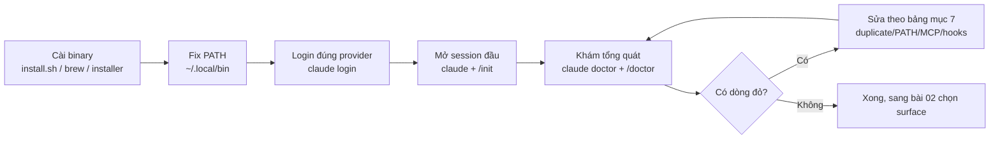

# 01 — Cài Đặt, Xác Thực & Kiểm Tra Sức Khỏe

> Bài 01 của series. Đọc xong bạn cài được Claude Code trên mọi OS, login đúng provider,
> chạy `claude doctor` hiểu từng dòng output, và fix được 90% lỗi setup.
> Thời gian: ~30 phút + 15 phút làm theo.
>
> **Cách đọc:** mỗi khái niệm có 3 dòng (Định nghĩa → Ví dụ đời thường → Ví dụ copy-paste).
> Mỗi code block có dòng **Kỳ vọng / Verify** để biết làm xong thấy gì.

## Mục lục

1. [Vì sao cài đặt v2.1.x khác trước?](#1-vì-sao-cài-đặt-v21x-khác-trước--why)
2. [Cài đặt từng OS](#2-cài-đặt-từng-os-step-by-step)
3. [WSL deep-dive](#3-wsl-deep-dive-windows-nhưng-chạy-linux)
4. [Version matrix](#4-version-matrix--chọn-bản-nào)
5. [Đăng nhập / đổi tài khoản / providers](#5-đăng-nhập--đổi-tài-khoản--providers)
6. [Session đầu tiên trong 1 repo](#6-session-đầu-tiên-trong-1-repo-walkthrough)
7. [claude doctor + /doctor deep-dive](#7-claude-doctor-và-doctor--bác-sĩ-của-mọi-lỗi-setup)
8. [Update & biến môi trường](#8-update--biến-môi-trường-hữu-ích)
9. [Bảng thuật ngữ](#9-bảng-thuật-ngữ)
10. [Hiểu nhầm thường gặp](#10-hiểu-nhầm-thường-gặp)
11. [Checklist + pitfalls + bài tập](#11-checklist-pitfalls-bài-tập)
12. [Link chéo](#12-link-chéo)

### Khái niệm mở đầu

- **Native binary là gì?** 1 câu: file chạy độc lập, không cần cài Node đúng version.
  - Ví dụ đời thường: như mua quạt cây cắm điện là chạy, không cần mua thêm pin + sạc riêng.
  - Ví dụ copy-paste: `curl -fsSL https://claude.ai/install.sh | bash` rồi `claude --version` thấy `2.1.x`.
- **Provider là gì?** 1 câu: nơi lấy tiền + model để Claude chạy (subscription claude.ai, API key, AWS Bedrock...).
  - Ví dụ đời thường: như nhà mạng — cùng điện thoại nhưng dùng Viettel hay Vina thì gói cước + vùng phủ khác nhau.
  - Ví dụ copy-paste: có subscription → `claude login`; chỉ có API key CI → `export ANTHROPIC_API_KEY=sk-ant-...`.
- **`claude doctor` là gì?** 1 câu: bác sĩ khám tổng quát, chỉ chỗ đỏ và cách chữa.
  - Ví dụ đời thường: như khám sức khỏe định kỳ in phiếu kết quả có dấu ✓/!.
  - Ví dụ copy-paste: gõ `claude doctor`, thấy `[✓] Auth` là login ok, `[!] MCP` là cần `/mcp reconnect`.



Giải thích từng bước:

- **A — Cài binary:** chọn 1 đường duy nhất (native khuyến nghị), tránh cài song song npm + native.
- **B — Fix PATH:** shell phải thấy `claude`. Kiểm tra `which -a claude` chỉ ra 1 dòng.
- **C — Login:** subscription thì OAuth browser; CI không browser thì API key. Sai provider là mất feature (bài 10).
- **D — Session đầu:** `claude` trong repo thật, chạy `/init → /memory → /mcp → /permissions`.
- **E/F/G — Khám + chữa:** `claude doctor` chỉ đọc (không sửa), `/doctor` có thể hỏi rồi sửa. Có đỏ thì sửa rồi khám lại tới khi hết đỏ.

---

## 1. Vì sao cài đặt v2.1.x khác trước? (why)

Trước 2025: `npm i -g @anthropic-ai/claude-code` là đường chính. Vấn đề: phụ thuộc Node,
xung đột version Node giữa máy, update chậm, khó sandbox native.

Từ 2025–2026: **native binary** là đường chính (`curl .../install.sh | bash`, Homebrew cask,
Windows installer). Lợi ích:

- Không cần Node global đúng version (binary bundle runtime riêng).
- Update qua `claude update` atomic (không dở dang như npm giữa chừng).
- `claude doctor` phát hiện được duplicate install (còn cả npm + native song song).
- Sandbox/OS integration (keychain, notifications, file trust) làm native tốt hơn.

> Hệ quả thực tế: nếu máy bạn còn cả 2 bản (`which -a claude` ra 2 dòng), mọi lệnh version
> check đều rối. Gỡ 1 bản, giữ native. Chi tiết mục 9.

---

## 2. Cài đặt từng OS (step-by-step)

### 2.1. macOS

**Cách A — Native binary (khuyến nghị):**

```bash
# Cài
curl -fsSL https://claude.ai/install.sh | bash

# Đảm bảo PATH (installer thường tự thêm, kiểm tra tay cho chắc)
echo 'export PATH="$HOME/.local/bin:$PATH"' >> ~/.zshrc
source ~/.zshrc

# Kiểm tra
claude --version
which -a claude
```

**Cách B — Homebrew:**

```bash
brew install --cask claude-code

# Kiểm tra
claude --version
brew list --cask | grep -i claude
```

**Cách C — IDE extension (làm thêm, không thay CLI):**

```bash
# VS Code: mở Extensions (Cmd+Shift+X) → tìm "Claude Code" → Install.
# JetBrains: Settings → Plugins → tìm "Claude Code" → Install.
# IDE và CLI dùng chung config (~/.claude/, .claude/ repo) nên không setup 2 lần.
```

Verify macOS:

```bash
claude --version        # kỳ vọng: 2.1.x
claude doctor           # kỳ vọng: không báo đỏ (xem mục 7 để đọc output mẫu)
ls ~/.claude/           # phải có settings.json sau lần chạy đầu
```

> **Kỳ vọng / Verify:** `claude --version` in `2.1.x`; `claude doctor` toàn `[✓]`, không `[✗]`; `ls ~/.claude/` thấy `settings.json`. Nếu `command not found` → PATH thiếu `~/.local/bin`, làm lại bước export PATH + restart shell.

### 2.2. Linux (Ubuntu/Debian/Fedora/Arch)

```bash
# 1. Cài dependencies tối thiểu (Ubuntu/Debian)
sudo apt update && sudo apt install -y curl git gh

# 2. Cài native binary
curl -fsSL https://claude.ai/install.sh | bash

# 3. PATH cho bash
echo 'export PATH="$HOME/.local/bin:$PATH"' >> ~/.bashrc
source ~/.bashrc

# 4. Kiểm tra
claude --version
claude doctor
```

> **Kỳ vọng / Verify:** `claude --version` ra `2.1.x`, `claude doctor` không đỏ. `which -a claude` chỉ 1 dòng (`~/.local/bin/claude`). Nếu ra 2 dòng (còn bản npm) → gỡ 1 bản theo mục 9.

Fedora:

```bash
sudo dnf install -y curl git gh
curl -fsSL https://claude.ai/install.sh | bash
echo 'export PATH="$HOME/.local/bin:$PATH"' >> ~/.bashrc
source ~/.bashrc
claude --version
```

Arch:

```bash
sudo pacman -S --needed curl git github-cli
curl -fsSL https://claude.ai/install.sh | bash
echo 'export PATH="$HOME/.local/bin:$PATH"' >> ~/.bashrc
source ~/.bashrc
claude --version
```

### 2.3. Windows

| Cách | Khi nào | Lệnh |
|---|---|---|
| Native Windows installer | Dùng PowerShell/CMD thuần | Tải installer từ `claude.ai/download`, chạy, mở lại terminal, `claude --version` |
| WSL2 (khuyến nghị cho dev) | Repo cần symlink, shell script, docker Linux | Xem mục 3 — cài Ubuntu trên WSL rồi cài native binary trong đó |
| IDE extension | Chỉ review diff, không cần terminal mạnh | Cài extension trong VS Code Windows, trỏ working dir vào project |

```powershell
# PowerShell — kiểm tra sau cài:
claude --version
claude doctor
```

> **Kỳ vọng / Verify:** cả 2 lệnh đều chạy, `claude doctor` không đỏ. Dev Windows mà dùng hooks/shell scripts → nên sang WSL (mục 3) thay vì cố PowerShell.

> Khuyến nghị cho dev Windows: code trong WSL (`\\wsl$\Ubuntu\home\...`), mở VS Code bằng
> `code .` từ trong WSL. Mọi lệnh `claude` chạy trong WSL để hooks/shell scripts Linux hoạt động.

### 2.4. IDE extensions (VS Code / JetBrains)

- **VS Code**: cài extension "Claude Code" → có inline diff, @-mention file, plan review, history.
- **JetBrains**: extension tương đương (IntelliJ/PyCharm/WebStorm...).
- IDE và CLI dùng chung config (`~/.claude/`, `.claude/` của repo) — xem bài 02 để dùng đúng.

```text
Verify IDE:
1. Mở repo trong VS Code → sidebar Claude Code hiện.
2. Gõ /ide trong session terminal → thấy "VS Code connected".
3. Thử @-mention 1 file trong input → Claude đọc đúng file.
```

> **Kỳ vọng / Verify:** sidebar Claude hiện trong VS Code; `/ide` báo `VS Code connected` (không phải `not connected`); `@-mention` 1 file thì Claude trích đúng nội dung file đó. Thiếu bước nào → cài lại extension rồi chạy `/ide` trong đúng session của repo đó.

### 2.5. Điều kiện tài khoản

- Hầu hết surfaces cần **Claude subscription** (Pro/Max/Team/Enterprise) hoặc **Anthropic Console API key**.
- Terminal CLI + VS Code còn hỗ trợ **third-party providers** (Bedrock, Google Agent Platform, Microsoft Foundry...).
- Web/Mobile/Desktop-cloud/Slack/Routines/Remote Control/Chrome extension... **bắt buộc** sign-in `claude.ai`
  (xem bảng phân biệt theo provider ở bài 10).

---

## 3. WSL deep-dive (Windows nhưng chạy Linux)

### 3.1. Vì sao dev Windows nên dùng WSL?

Hooks là shell scripts (`.sh`), MCP servers spawn `npx`, Git worktrees dùng symlink —
tất cả chạy mượt trên Linux, gãy ngẫu nhiên trên PowerShell/CMD. WSL cho bạn kernel Linux
thật trong Windows, nên toàn bộ series này (đặc biệt bài 07 hooks, bài 11 worktrees) viết
cho Linux/macOS shell và chạy 1:1 trong WSL.

### 3.2. Cài WSL + Claude step-by-step (copy-paste)

```powershell
# PowerShell (Admin) — bật WSL + cài Ubuntu:
wsl --install -d Ubuntu
# Restart máy khi được yêu cầu.
```

```bash
# Trong Ubuntu (WSL) — cài từ đầu:
sudo apt update && sudo apt upgrade -y
sudo apt install -y curl git gh build-essential

# Git config (làm 1 lần):
git config --global user.name "Your Name"
git config --global user.email "you@example.com"

# Cài Claude native binary:
curl -fsSL https://claude.ai/install.sh | bash
echo 'export PATH="$HOME/.local/bin:$PATH"' >> ~/.bashrc
source ~/.bashrc

# Verify:
claude --version
claude doctor
gh auth login   # cần cho /web-setup + cloud sessions (bài 02)
```

### 3.3. Mở project + VS Code từ WSL

```bash
# Clone repo VÀO trong WSL (đừng để ở /mnt/c/... — chậm 5-10x):
mkdir -p ~/code && cd ~/code
git clone git@github.com:<org>/<repo>.git
cd <repo>

# Mở VS Code nối vào WSL:
code .

# Mở Claude trong WSL:
claude
```

### 3.4. Pitfalls WSL hay gặp

| Triệu chứng | Nguyên nhân | Fix |
|---|---|---|
| Repo trong `/mnt/c` chạy `pnpm test` chậm rì | I/O qua 9P bridge | Clone lại vào `~/code` trong WSL |
| `gh auth login` báo không mở được browser | WSL không có browser GUI | Chọn `Login with a web browser` → copy code → paste vào browser Windows |
| Hook `.sh` báo `permission denied` | File từ Windows mất +x | `chmod +x .claude/hooks/*.sh` trong WSL |
| Line ending CRLF làm hook gãy | Git checkout CRLF trên Windows | `git config --global core.autocrlf input` trong WSL |

---

## 4. Version matrix — chọn bản nào?

```bash
# Xem version hiện tại + channel:
claude --version
/status    # trong session: version, model, account
```

> **Kỳ vọng / Verify:** `claude --version` ra số (vd `2.1.215`); `/status` trong session hiện đúng model + account. Nếu `/cd` báo `Unknown command` → version <2.1.169 → `claude update`.

| Kênh / cách cài | Lệnh | Khi dùng | Lưu ý |
|---|---|---|---|
| Native stable | `curl -fsSL https://claude.ai/install.sh \| bash` | Mặc định mọi người | Update bằng `claude update` |
| Homebrew cask (macOS) | `brew install --cask claude-code` | Máy đã quản lý bằng brew | Update bằng `brew upgrade --cask claude-code` |
| npm legacy | `npm i -g @anthropic-ai/claude-code` | Chỉ khi cần pin version cũ/CI đặc biệt | Dễ xung đột với native → `claude doctor` báo duplicate |
| IDE extension | Via marketplace | Kèm CLI, không thay CLI | Version extension ≠ version CLI, check cả 2 |

Version floor đáng nhớ (v2.1.x):

| Feature cần | Version tối thiểu | Check |
|---|---|---|
| `/cd` giữ prompt cache | ≥ 2.1.169 | `Unknown command: /cd` → update |
| `/goal` completion condition | ≥ 2.1.139 | Không thấy `/goal` → update |
| `/verify` (build+chạy app thật) | ≥ 2.1.145 | Không thấy → update |
| `/effort` (low→max) | ≥ 2.1.205 | Không thấy → update |
| `/mcp` text-mode non-interactive | ≥ 2.1.205 | `/mcp` trong `-p` gãy → update |
| CLAUDE.md audit trong `/doctor` | ≥ 2.1.206 | `/doctor` không có mục audit → update |
| `/verify` + `/code-review` chỉ chạy khi gọi tay | ≥ 2.1.215 | Tự trigger tốn token → update |

```bash
# Update + pin khi cần:
claude update            # lên stable mới nhất
claude --version         # xác nhận sau update
# Homebrew:
brew upgrade --cask claude-code
```

> **Kỳ vọng / Verify:** sau update `claude --version` tăng số. Nếu `claude update` báo đã mới nhất mà vẫn thiếu lệnh → kiểm tra provider (mục 5), không phải version.

---

## 5. Đăng nhập / đổi tài khoản / providers

```bash
claude login     # đăng nhập (mở browser OAuth)
claude logout    # đăng xuất
```

> **Kỳ vọng / Verify:** `claude login` mở browser, xong báo `Logged in as you@example.com`. `/status` trong session hiện đúng account. Vòng lặp OAuth không dứt → `claude logout` rồi login lại, đổi browser.

Trong session: `/login` (đổi account / re-auth), `/logout`, `/status` (xem version, model, account),
`/exit` thoát REPL.

### 5.1. Chọn provider nào? (bảng quyết định)

| Bạn có gì | Chọn | Lệnh/env | Mất gì? |
|---|---|---|---|
| Subscription Pro/Max/Team (phổ biến) | Sign-in `claude.ai` | `claude login` → OAuth browser | Không mất gì, full features |
| Anthropic Console API key (pay-as-you-go) | API key | `export ANTHROPIC_API_KEY=sk-ant-...` | Mất Web/Routines/Remote/Slack (bài 10) |
| AWS Bedrock | Bedrock provider | Cấu hình AWS creds + model ARN | Mất web search, fast mode, 1 số slash (bài 10) |
| Google Agent Platform / Vertex | GCP provider | GCP creds | Tùy feature (bảng bài 10) |
| Microsoft Foundry | Foundry provider | Azure creds | Mất GitHub CI integration |

```bash
# Ví dụ API-key provider (CI runner không có browser):
export ANTHROPIC_API_KEY="sk-ant-..."
claude -p "summarize git diff" --output-format text

# Ví dụ đổi account giữa 2 subscription (cá nhân ↔ công ty):
# Trong session:
/login
# → chọn account → tiếp tục. Kiểm tra:
/status
```

> **Kỳ vọng / Verify:** CI chạy `claude -p` in tóm tắt diff ra stdout, exit 0. Đổi account xong `/status` hiện account mới. API key mất Web/Routines/Remote — đó là bình thường, không phải bug (bài 10).

> Chi tiết full availability theo plan/provider: bài 10. Gặp "lệnh không tồn tại" → check
> provider + version trước khi kết luận bug.

---

## 6. Session đầu tiên trong 1 repo (walkthrough)

```bash
cd /path/to/repo
claude            # mở session
```

> **Kỳ vọng / Verify:** prompt `>` hiện trong đúng repo (`pwd` ra repo bạn). Gõ `/status` thấy working dir đúng. Sai folder → `exit` rồi `cd` lại, không dùng session nhầm chỗ.

Rồi trong session chạy tuần tự (lần đầu duy nhất):

```
/init        → sinh CLAUDE.md nháp từ codebase (set CLAUDE_CODE_NEW_INIT=1 để có flow interactive hỏi cả skills/hooks/memory)
/memory      → tinh chỉnh memory files, bật/tắt auto-memory
/mcp         → setup server cần thiết (GitHub, DB...), xem bài 08
/permissions → đặt approval rules (xem bài 10), alias /allowed-tools
```

> `/init` cho project có sẵn (Claude tự phân tích conventions). Project mới thì dùng template trong
> `templates/CLAUDE.md` của repo này rồi sửa (chi tiết bài 03).

### Walkthrough 15 phút cho repo chưa có gì

```bash
# Bước 1: vào repo + mở session
cd ~/code/my-project
claude
```

```text
# Bước 2 (trong session): sinh CLAUDE.md
/init
# Đọc file sinh ra. Xóa câu chung chung ("project uses TypeScript"),
# giữ lệnh verified + rules khác default. Xem bài 03 để cắt <200 dòng.
```

```text
# Bước 3: memory
/memory
# Xem entries nào đang load (personal + project). Tắt auto-memory nếu team chưa muốn drift.
```

```text
# Bước 4: MCP tối thiểu
/mcp
# Thêm GitHub server trước (impact cao nhất). Test: "liệt kê 5 PRs mở gần nhất của repo này".
# Chi tiết từng server: bài 08.
```

```text
# Bước 5: permissions
/permissions
# Đặt: allow (Read, Glob, Grep), ask (Edit, Write, Bash git/pnpm),
# deny (Bash rm -rf, Write ngoài repo, push main). Chi tiết bài 10.
```

```text
# Bước 6: task end-to-end đầu tiên
"Chạy linter, fix 3 lỗi đầu, chạy lại để xác nhận. Báo cáo files đổi."
# Xong: /cost để xem tốn bao nhiêu, /export để lưu nếu cần.
```

---

## 7. `claude doctor` và `/doctor` — bác sĩ của mọi lỗi setup

```bash
claude doctor     # ngoài terminal: in read-only diagnostics, không mở session
```

> **Kỳ vọng / Verify:** in ra 8–10 dòng `[✓]/[!]` như mẫu mục 7.1. Không sửa gì — chỉ đọc. Muốn sửa thì vào session gõ `/doctor`.

Trong session: `/doctor` (alias `/checkup`) — skill chẩn đoán + **có thể sửa** (luôn hỏi trước khi đổi):

- Sức khỏe cài đặt: duplicate install, lỗi `PATH`, settings file parse lỗi, version mới trên release channel.
- Context cost audit: skills/MCP servers/plugins **cài mà không dùng** vs chi phí context; hooks chạy chậm.
- CLAUDE.md audit (≥v2.1.206): dedupe `CLAUDE.md` local vs checked-in; cắt nội dung Claude tự suy ra được
  (directory layout, dependency list, architecture overview) — giữ lại pitfalls, rationale, conventions khác default;
  migrate guidance always-loaded còn lại thành skills + nested `CLAUDE.md` load-on-demand.
- Đề xuất: đặt auto mode làm default, pre-approve các read-only commands hay bị deny.

Khi báo lỗi cho người khác/Anthropic: dùng `/bug` (gửi conversation cho Anthropic), `/status`, `/doctor`.

### 7.1. Output mẫu `claude doctor` (đọc từng dòng)

```text
$ claude doctor
[✓] Version: 2.1.2xx (native, stable channel, up to date)
[✓] Install: single native binary at ~/.local/bin/claude (no npm duplicate)
[✓] PATH: ~/.local/bin in PATH (zsh)
[✓] Auth: signed in as you@example.com (Pro) — token valid
[✓] Settings: ~/.claude/settings.json valid JSONC, .claude/settings.json valid
[!] CLAUDE.md: ./CLAUDE.md 342 lines — over budget, run /doctor for trim suggestions
[!] MCP: 2/4 servers connected (postgres: disconnected — token expired)
[!] Hooks: PostToolUse lint-on-write avg 8.2s — consider faster linter scope
[✓] Git: repo clean, gh CLI authenticated as <user>
```

> **Kỳ vọng / Verify:** bạn đọc được dòng nào ok (`[✓]` bỏ qua), dòng nào cần làm (`[!]`). Ví dụ trên: cần trim CLAUDE.md xuống <200 dòng, reconnect postgres, thu hẹp hook lint chỉ file vừa sửa.

Cách đọc:

| Dòng | Ý nghĩa | Hành động |
|---|---|---|
| Version/install/PATH | Binary có đúng 1 + PATH thấy nó? | `[✗]` → gỡ bản thừa, fix PATH, restart shell |
| Auth | Login còn hạn? đúng account? | Hết hạn → `/login`; sai account → `/login` đổi |
| Settings | JSON parse được? | Lỗi → mở file được chỉ, sửa dấu phẩy ngoặc |
| CLAUDE.md lines | Quá 200 dòng? | Chạy `/doctor` → trim theo gợi ý (bài 03) |
| MCP disconnected | Token/URL/OAuth? | `/mcp reconnect <name>` (bài 08) |
| Hooks slow | Hook nào >2s? | Thu hẹp scope lint (chỉ file vừa edit, không `lint .`) |

### 7.2. Ví dụ `/doctor` fix mẫu (copy-paste flow)

```text
# Trong session:
/doctor

# Output kỳ vọng (rút gọn):
# 1. Duplicate install: found /opt/homebrew/bin/claude + ~/.local/bin/claude → remove one? [y/N]
#    → gõ y, cho nó gỡ bản brew (giữ native).
# 2. CLAUDE.md 342 → 178 lines: đề xuất xóa mục "directory layout" (Claude tự suy ra được),
#    chuyển deploy checklist → skill /deploy. Duyệt từng hunk.
# 3. MCP postgres disconnected → /mcp reconnect postgres (nhập lại password qua env).
# 4. Đề xuất: pre-approve `Bash(pnpm test:*)` để đỡ bị hỏi mỗi lần test.
```

---

## 8. Update & biến môi trường hữu ích

```bash
claude update     # lên bản mới nhất
```

> **Kỳ vọng / Verify:** báo `Updated to 2.1.x` hoặc `Already up to date`. Xong chạy `claude --version` xác nhận số mới.

```bash
# Load CLAUDE.md từ --add-dir paths (mặc định không load)
export CLAUDE_CODE_ADDITIONAL_DIRECTORIES_CLAUDE_MD=1
# Minimal mode: tắt MCP tools, attachments, hooks, CLAUDE.md, skills (debug)
export CLAUDE_CODE_SIMPLE=1
# Interactive init flow đầy đủ
export CLAUDE_CODE_NEW_INIT=1
```

> **Kỳ vọng / Verify:** `echo $CLAUDE_CODE_SIMPLE` ra `1` sau export. Chạy `CLAUDE_CODE_SIMPLE=1 claude -p "đọc package.json"` mà chạy được, còn normal gãy → lỗi nằm ở MCP/hook/skill.

### 8.1. Khi nào dùng từng biến? (why)

| Biến | Khi nào bật | Ví dụ |
|---|---|---|
| `CLAUDE_CODE_ADDITIONAL_DIRECTORIES_CLAUDE_MD=1` | Dùng `--add-dir ../shared` và muốn CLAUDE.md của folder đó cũng load | Monorepo/shared libs |
| `CLAUDE_CODE_SIMPLE=1` | Debug "có phải MCP/hook/skill phá không?" — tắt hết, test lại | Hook không chạy / MCP crash / lỗi lạ sau update |
| `CLAUDE_CODE_NEW_INIT=1` | Muốn `/init` hỏi interactive (skills/hooks/memory) thay vì sinh file 1 phát | Repo mới, team setup chuẩn từ đầu |

```bash
# Ví dụ debug minimal (copy-paste):
CLAUDE_CODE_SIMPLE=1 claude -p "đọc package.json và tóm tắt scripts"
# Nếu simple chạy được mà normal không → lỗi nằm ở MCP/hook/skill → claude doctor + /doctor.

# Ví dụ init interactive:
CLAUDE_CODE_NEW_INIT=1 claude
# Trong session: /init → trả lời từng câu hỏi (memory? skills? hooks?) → file chuẩn team.
```

---

## 9. Bảng thuật ngữ

| Thuật ngữ | Là gì (hiểu nôm na) | Ví dụ cụ thể | Khi nào dùng |
|---|---|---|---|
| Native binary | Quạt cây cắm điện là chạy, không cần pin riêng | `curl .../install.sh \| bash` rồi `claude --version` ra `2.1.x` | Cài mặc định cho mọi OS |
| PATH | Danh sách đường mà terminal đi tìm lệnh | `~/.local/bin` phải có trong `echo $PATH` | Khi gặp `command not found: claude` |
| Duplicate install | Nhà có 2 chìa khóa, không biết ổ nào đúng | `which -a claude` ra 2 dòng (brew + native) | Khi version check rối, `claude doctor` báo duplicate |
| Provider | Nhà mạng cung cấp model + tính tiền | Subscription → `claude login`; CI → `ANTHROPIC_API_KEY` | Chọn trước khi thắc mắc "sao thiếu lệnh?" |
| claude doctor | Phiếu khám sức khỏe chỉ đọc, không chích thuốc | `claude doctor` in `[✓] Auth`, `[!] MCP` | Chạy đầu tiên khi lỗi lạ |
| /doctor | Bác sĩ vừa khám vừa hỏi có cho mổ không | `/doctor` hỏi `remove duplicate? [y/N]` | Khi muốn sửa luôn duplicate/trim CLAUDE.md |
| WSL | Phòng Linux nằm trong nhà Windows | `wsl --install -d Ubuntu` rồi cài Claude trong Ubuntu | Dev Windows cần hooks/symlink/docker Linux |
| gh CLI | Chìa khóa ra GitHub từ terminal | `gh auth login` rồi `gh auth status` thấy `Logged in` | Trước `/web-setup` + cloud sessions |

## 10. Hiểu nhầm thường gặp

| Hiểu nhầm | Sự thật | Cách kiểm tra |
|---|---|---|
| Cài bằng npm cũng như native | npm phụ thuộc Node global, dễ xung đột, `doctor` báo duplicate; native bundle runtime riêng, update atomic | `which -a claude` ra 2 dòng → gỡ npm, giữ native: `npm uninstall -g @anthropic-ai/claude-code` |
| Login rồi là full feature | API key/Bedrock/Vertex bị cắt Web/Routines/fast mode... theo bảng bài 10 | Thiếu lệnh → check `/status` + provider trước khi kết luận bug |
| `claude doctor` sẽ tự sửa | Ngoài terminal nó chỉ đọc (read-only). Muốn sửa phải vào session gõ `/doctor` | Cần fix duplicate/trim → vào session `/doctor`, duyệt từng hunk `y/N` |
| Repo để đâu cũng nhanh như nhau | Repo trong `/mnt/c` qua bridge chậm 5–10x, hook mất +x, CRLF gãy | Clone vào `~/code` trong WSL, `chmod +x .claude/hooks/*.sh`, `core.autocrlf input` |
| Update là xong mọi lỗi lệnh | Lệnh còn bị chặn bởi provider + version floor (`/cd` ≥2.1.169, `/effort` ≥2.1.205...) | `claude --version` + `/status` + gõ `/` xem list thực tế ở máy bạn |

---

## 11. Checklist, pitfalls, bài tập

### 11.1. Checklist sau cài đặt (copy-paste)

- [ ] `claude --version` ≥ 2.1.x, `claude doctor` không báo đỏ.
- [ ] `which -a claude` chỉ ra 1 binary (không duplicate npm + native).
- [ ] Đã `/init` + `/memory` cho repo chính.
- [ ] Đã `/permissions` đặt allow/ask/deny (đặc biệt `Bash`, `Write` ngoài repo).
- [ ] Đã `/mcp` thêm 3–6 servers thực dùng (đừng quá 10 tools visible).
- [ ] Đã test 1 task nhỏ end-to-end: prompt → edit → test → commit.
- [ ] Đã đọc bài 02 (chọn surface) và bài 03 (viết CLAUDE.md tốt).

### 11.2. Lỗi cài đặt hay gặp (bản đầy đủ hơn FAQ rút gọn)

| Triệu chứng | Nguyên nhân likely | Fix (copy-paste) |
|---|---|---|
| `Unknown command: /cd` | Version < 2.1.169 | `claude update` rồi `/status` xác nhận |
| `command not found: claude` sau cài | PATH chưa có `~/.local/bin` | `export PATH="$HOME/.local/bin:$PATH"` + restart shell |
| 2 bản Claude xung đột | Còn cả npm + native | `npm uninstall -g @anthropic-ai/claude-code`, giữ native, `claude doctor` xác nhận |
| Hook không chạy | Sai matcher case-sensitive / sai event / folder chưa trust | `/hooks` kiểm tra, xem bài 07 |
| MCP server disconnected | Token hết hạn / URL sai / chưa OAuth | `/mcp reconnect <name>` (bài 08) |
| Settings parse error | JSON/JSONC sai dấu phẩy | `claude doctor` chỉ file lỗi, mở sửa tay |
| `gh` chưa login → `/web-setup` gãy | Thiếu GitHub CLI auth | `gh auth login` trước |
| WSL chậm khi repo ở `/mnt/c` | I/O bridge | Clone lại vào `~/code` trong WSL |
| `/login` vòng lặp OAuth | Browser/session cũ | `claude logout` → `claude login` lại, thử browser khác |

### 11.3. Bài tập thực hành

**Bài 1 (10 phút) — Verify cài đặt:**
Chạy `claude --version`, `which -a claude`, `claude doctor`. Chụp output, giải thích từng
dòng `[✓]/[!]` cho đồng nghiệp. Fix hết `[!]` trước khi sang bài 2.

**Bài 2 (15 phút) — Multi-OS check:**
Nếu team có cả macOS + Linux + WSL, lập bảng: mỗi OS cài bằng cách nào, PATH nào,
verify bằng lệnh nào. Ghi vào team wiki (dùng bảng version matrix mục 4 làm khung).

**Bài 3 (20 phút) — Session đầu chuẩn:**
Trên 1 repo thật, chạy đủ `/init → /memory → /mcp → /permissions` + 1 task end-to-end
nhỏ. Lưu output `/cost` + `/export`. Liệt kê 3 rules bạn đã đặt trong `/permissions`.

**Bài 4 (15 phút) — Debug drill:**
Bật `CLAUDE_CODE_SIMPLE=1` chạy 1 prompt, so với chạy normal. Viết 3 dòng kết luận:
"MCP/hook/skill có gây khác biệt không?" Thử `CLAUDE_CODE_NEW_INIT=1 /init` trên repo test.

---

## 12. Link chéo

- **Bài 00 — Tổng quan**: nếu chưa hiểu agentic loop/token economics, quay lại đọc trước.
- **Bài 02 — Surfaces**: chọn terminal/IDE/desktop/web/mobile + CLI flags + cloud env setup.
- **Bài 03 — CLAUDE.md**: file `/init` vừa sinh cần cắt <200 dòng — sang bài 03 làm ngay.
- **Bài 04 — Slash commands**: tra cứu `/memory /mcp /permissions /doctor /status...`.
- **Bài 07 — Hooks**: khi `/doctor` báo hook chậm/không chạy.
- **Bài 08 — MCP**: setup từng server GitHub/Playwright/Postgres/Notion chi tiết.
- **Bài 10 — Permissions & availability**: rules allow/ask/deny + khác biệt plan/provider.
- **FAQ (03-FAQ/)**: lỗi lạ không có trong bảng mục 9 → tra FAQ trước khi hỏi.
