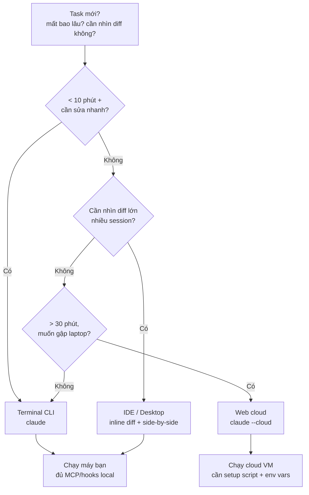

# 02 — Các Bề Mặt Sử Dụng: Terminal, IDE, Desktop, Web, Mobile

> Bài 02 của series. Đọc xong bạn chọn đúng surface cho từng task, thuộc CLI flags hay dùng,
> setup được cloud environment, và hiểu config nào đi theo surface nào.
> Thời gian: ~30 phút.
>
> **Cách đọc:** mỗi khái niệm có Định nghĩa 1 câu → Ví dụ đời thường → Ví dụ copy-paste.
> Mỗi code block có **Kỳ vọng / Verify** để biết làm xong thấy gì.

## Mục lục

1. [Vì sao nhiều surface? (why)](#1-vì-sao-nhiều-surface-why)
2. [Terminal CLI deep-dive + full flags reference](#2-terminal-cli--sức-mạnh-gốc)
3. [IDE (VS Code / JetBrains)](#3-ide-vs-code--jetbrains)
4. [Desktop app](#4-desktop-app)
5. [Web (claude.ai/code) + cloud env setup chi tiết](#5-web-claudeaicode--research-preview)
6. [Mobile + Remote Control + Slack](#6-mobile--remote-control--slack)
7. [Walkthrough: chọn surface theo task](#7-walkthrough-chọn-surface-theo-task)
8. [Lưu ý config theo surface + pitfalls + bài tập](#8-lưu-ý-config-theo-surface)
9. [Bảng thuật ngữ](#9-bảng-thuật-ngữ)
10. [Hiểu nhầm thường gặp](#10-hiểu-nhầm-thường-gặp)
11. [Link chéo](#11-link-chéo)

### Khái niệm mở đầu

- **Surface là gì?** 1 câu: cửa để bạn vào cùng 1 căn nhà (agentic loop), khác nhau chỗ code chạy ở đâu.
  - Ví dụ đời thường: như vào nhà bằng cửa chính (terminal), cửa sổ (IDE inline), camera từ xa (web cloud).
  - Ví dụ copy-paste: fix typo 2 phút → `claude` local; refactor 1 giờ → `claude --cloud "refactor auth, mở PR"`.
- **Local vs Cloud là gì?** 1 câu: local chạy trên máy bạn (dùng hết config), cloud chạy trên máy ảo Anthropic (chỉ thấy repo).
  - Ví dụ đời thường: như nấu ở bếp nhà (đủ gia vị local) vs bếp chung cư cho thuê (chỉ có đồ bạn mang tới).
  - Ví dụ copy-paste: local đọc được `~/.claude/`; cloud phải đặt lại `DATABASE_URL` trong Settings → Environments.
- **CLI flag là gì?** 1 câu: công tắc khi khởi động, khóa cách Claude được chạy trong session đó.
  - Ví dụ đời thường: như nút điều hòa — bật `plan` là chỉ xem không sờ, bật `dontAsk` là tự chạy không hỏi.
  - Ví dụ copy-paste: `claude --permission-mode plan "đọc login.ts, không sửa gì"` để review an toàn tuyệt đối.

---

## 1. Vì sao nhiều surface? (why)

Cùng 1 agentic loop (bài 00), nhưng **code chạy ở đâu** và **config nào được dùng** khác nhau:

```
Terminal/IDE/Desktop-local/Remote → code chạy TRÊN MÁY BẠN, dùng ~/.claude/ + .claude/ repo.
Web/Desktop-cloud                → code chạy TRÊN CLOUD VM, chỉ dùng repo + cloud env vars.
```

Vì sao Anthropic tách? Task 5 phút (fix typo) cần latency thấp → local. Task 2 giờ
(migrate DB, refactor 50 files) cần máy chạy tiếp khi bạn gập laptop → cloud. Không có
surface nào thắng mọi trường hợp — bài này dạy bạn chọn.



Giải thích từng bước:

- **Q → S1:** task nhỏ dưới 10 phút thì đừng boot cloud VM, mở terminal là nhanh nhất.
- **S2:** review 20 files, mở 2-3 sessions song song → IDE/Desktop thắng vì nhìn hunk trực quan.
- **S3:** task dài muốn gập laptop, check từ điện thoại → Web cloud thắng vì VM chạy tiếp khi disconnect.
- **LC vs CC:** local dùng `~/.claude/` + hooks/MCP máy bạn; cloud chỉ dùng thứ đã commit + env đặt trên web — phải setup trước (mục 5.2).

> **Kỳ vọng / Verify:** bạn nhìn diagram và xếp được 3 task mẫu (typo → CLI, review 25 files → Desktop/IDE, migrate 1 giờ → Web) đúng như mục 7.2.

---

## 2. Terminal CLI — sức mạnh gốc

### 2.1. Lệnh khởi động hay dùng

```bash
claude                     # mở session interactive
claude "fix failing tests" # 1-shot prompt (mở session với prompt sẵn)
claude -p "summarize diff" # print mode (non-interactive, dùng cho CI/scripts, bài 12)
claude --continue          # tiếp tục session gần nhất
claude --resume <id>       # resume theo id/name (hoặc mở picker nếu không truyền id)
claude --agent explore     # chạy cả session dưới 1 subagent persona (bài 06)
claude --add-dir ../shared # cho phép truy cập thêm thư mục ngoài CWD
claude --cloud             # ném session lên cloud (cần GitHub + setup /web-setup)
claude --dangerously-skip-permissions  # bypass (chỉ CI sandbox, KHÔNG dùng máy dev)
```

> **Kỳ vọng / Verify:** `claude` mở REPL với prompt `>`; `claude -p "summarize diff"` in kết quả rồi thoát (không kẹt REPL); `claude --continue` mở lại session gần nhất. `--dangerously-skip-permissions` chỉ thử trong sandbox, không thử trên máy dev.

### 2.2. Full CLI flags reference (v2.1.x, copy-paste được)

> Không phải mọi flag tồn tại trên mọi version/provider — check `claude --help` trên máy bạn
> làm chuẩn cuối. Bảng dưới tổng hợp từ docs + thực tế.

**Session & resume:**

```bash
claude --continue                    # tiếp tục session gần nhất
claude --resume abc123               # resume theo session id
claude --resume "my-feature"         # resume theo name (đã /rename trước đó)
claude --fork <id>                   # fork session (thử what-if, giữ mạch chính)
```

> **Kỳ vọng / Verify:** `--resume` không id hiện picker chọn session; có id/name thì mở đúng session cũ với history còn nguyên. `/rename my-feature` trước thì `--resume "my-feature"` mới tìm thấy.

**Prompt & output (non-interactive, CI/scripts):**

```bash
claude -p "review diff và in findings JSON" \
  --output-format json \             # text | json | stream-json
  --permission-mode dontAsk \        # khóa guardrails cho CI (bài 10, 12)
  --allowedTools "Read, Grep, Glob, Bash"

claude -p "summarize" --input-format text < diff.txt
claude --init-only                    # chỉ chạy Setup hooks, không mở session (CI warmup)
```

> **Kỳ vọng / Verify:** lệnh in JSON ra stdout (parse được bằng `jq`), exit 0 trong CI. `--init-only` chạy xong thoát ngay, không mở REPL — dùng để warmup trước khi chạy job thật (bài 12).

**Model & effort:**

```bash
claude --model opus                   # opus | sonnet | haiku (đổi giữa session bằng /model)
claude --effort high                  # low | medium | high | xhigh | max | auto (≥2.1.205)
claude --agent explore                # chạy persona subagent cho cả session
claude --agents '{"reviewer":{"prompt":"...","tools":["Read","Grep"]}}'  # inline JSON agent
```

> **Kỳ vọng / Verify:** `/model` trong session hiện đúng model đã chọn; `--effort` không báo `Unknown option` (nếu báo → version <2.1.205 → `claude update`). `--agent explore` chạy ở chế độ read-only explore.

**Dirs & sandbox:**

```bash
claude --add-dir ../shared --add-dir /tmp/contracts   # thêm dirs ngoài CWD
claude --sandbox                                       # bật OS sandbox (giới hạn FS/network)
claude --sandbox-network                               # chi tiết network policy
```

> **Kỳ vọng / Verify:** trong session Claude đọc được file trong `../shared` (thử `Đọc 1 file trong ../shared`). Không có `--add-dir` thì nó báo `outside working directory`. Muốn load CLAUDE.md của dir thêm → export `CLAUDE_CODE_ADDITIONAL_DIRECTORIES_CLAUDE_MD=1` (bài 01).

**MCP & skills gating:**

```bash
claude --mcp-config ./custom-mcp.json  # dùng MCP config riêng (thay vì .mcp.json default)
claude --disable-slash-commands "deploy,ship"  # tắt slash commands nhạy cảm trong session này
```

**Permissions:**

```bash
claude --permission-mode plan          # default | acceptEdits | plan | auto | dontAsk | bypassPermissions
claude --allowedTools "Read, Grep, Glob"      # allowlist hẹp cho task đọc
claude --disallowedTools "Bash, Write"        # cấm hẳn trong session này
claude --dangerously-skip-permissions  # = bypass — CHỈ CI sandbox
```

> **Kỳ vọng / Verify:** `--permission-mode plan` thì Claude chỉ đọc + trình plan, không sửa file (thử giao sửa, nó phải hỏi trước). `Shift+Tab` trong REPL xoay vòng modes, statusline hiện mode hiện tại.

**Cloud:**

```bash
claude --cloud "migrate table X, mở PR"  # tạo cloud session từ terminal
claude --cloud --model opus              # cloud + chọn model
```

### 2.3. Ví dụ thực tế (3 flows copy-paste)

```bash
# Flow 1 — Task đọc hiểu nhanh, không cho sửa gì (an toàn tuyệt đối):
claude --permission-mode plan "đọc apps/api/src/routes/login.ts và giải thích flow auth, không sửa gì"
```

> **Kỳ vọng / Verify:** Claude chỉ trả lời giải thích, `git status` sạch (không file nào đổi). Nếu nó đòi sửa → mode chưa đúng, bấm `Shift+Tab` về `plan`.

```bash
# Flow 2 — Làm việc với shared lib ngoài repo (monorepo tách folder):
claude --add-dir ../shared-contracts
# Trong session:
# > "Đọc types trong ../shared-contracts, đối chiếu với apps/api usage, báo mismatch."
# Cần load CLAUDE.md của add-dir: export CLAUDE_CODE_ADDITIONAL_DIRECTORIES_CLAUDE_MD=1 (bài 01).
```

> **Kỳ vọng / Verify:** Claude liệt kê được types trong `../shared-contracts` và chỉ ra mismatch (nếu có). Không `--add-dir` thì nó báo không thấy đường dẫn — đó là tín hiệu thiếu flag.

```bash
# Flow 3 — CI one-shot review (không mở REPL):
claude -p "review git diff main...HEAD, in tối đa 10 findings dạng checklist" \
  --output-format text \
  --permission-mode dontAsk \
  --allowedTools "Read, Grep, Glob, Bash"
# Chi tiết print-mode + guardrails: bài 12.
```

> **Kỳ vọng / Verify:** in ra tối đa 10 findings dạng checklist, exit 0, không mở REPL. Dùng trong CI (bài 12) với guardrails khóa sẵn.

### 2.4. Phím tắt sống còn trong REPL

**Shift+Tab**: xoay vòng permission modes `default → acceptEdits → plan → auto → bypassPermissions`.
**Double-Esc** (prompt rỗng): mở rewind menu (checkpointing) — khôi phục cả code + conversation (bài 11).
**Ctrl+X Ctrl+K ×2 trong 3s**: kill toàn bộ background subagents (khi fan-out lỗi).
**Ctrl+R**: search history. **Ctrl+C**: interrupt turn hiện tại (Stop hook không lửa khi interrupt).

Flags quan trọng khác: `--mcp-config`, `--disable-slash-commands`, `--permission-mode`,
`--model`, `--agents '{...}'` (định nghĩa agent inline JSON).

---

## 3. IDE (VS Code / JetBrains)

Điểm cộng duy nhất đáng tiền so với terminal:

- Inline diffs ngay trong editor (review từng hunk, accept/reject granular).
- `@`-mention file/selection chính xác (không cần gõ path dài).
- Plan review UI: duyệt plan trước khi cho code (đẹp hơn text terminal).
- Conversation history panel (tìm lại session cũ nhanh).

Cấu hình dùng chung với CLI nên không cần setup 2 lần. `/ide` xem integrations + status.

### 3.1. Walkthrough IDE 10 phút

```text
Bước 1: Cài extension "Claude Code" trong VS Code → reload.
Bước 2: Mở repo → sidebar Claude xuất hiện → bấm "Connect".
Bước 3: Trong terminal của VS Code, gõ `claude`, rồi gõ `/ide` → phải thấy "VS Code connected".
Bước 4: Bôi đen 1 hàm → gõ @ → chọn selection → prompt "giải thích hàm này + đề xuất 2 edge cases thiếu test".
Bước 5: Giao task sửa nhỏ → review inline diff từng hunk → Accept.
```

> **Kỳ vọng / Verify:** sau Bước 3, `/ide` in `VS Code connected` (không phải `not connected`). Sau Bước 4, Claude trích đúng hàm bạn bôi đen (không nhầm file). Sau Bước 5, diff hiện từng hunk có nút Accept/Reject.

### 3.2. Khi nào IDE thắng terminal? (bảng)

| Task | Thắng | Vì sao |
|---|---|---|
| Review diff 20 files | IDE | Inline hunk nhanh hơn đọc `git diff` text |
| Sửa hàm đang mở, cần context selection chính xác | IDE | @-selection không nhầm file |
| Duyệt plan kiến trúc | IDE | Plan UI có tree + checkboxes |
| Chạy task dài, nhiều lệnh Bash | Terminal | Terminal scroll + copy tốt hơn, ít lag |
| Spawn nhiều subagents | Terminal | `/agents` tab + kill switch tiện hơn |

---

## 4. Desktop app

- Chạy local hoặc cloud session; review diff trực quan; multi-session side-by-side.
- Schedule recurring tasks (`/schedule` routines — bài 12); kick off cloud sessions.
- Gateway routing có thể cấu hình qua managed settings (Team/Enterprise — bài 10).

### 4.1. 3 việc desktop làm tốt nhất

```text
1. Multi-session side-by-side: mở 2-3 sessions (feat A, feat B, review) cạnh nhau,
   kéo-thả diff qua lại. Terminal phải tmux chia pane cực hơn.
2. Review diff lớn trực quan: hunk folding, syntax highlight, accept từng phần.
3. Lên lịch routines: tạo /schedule từ UI (morning digest, weekly audit) mà không cần nhớ cú pháp.
```

> **Kỳ vọng / Verify:** mở được 2 sessions cạnh nhau (mỗi panel 1 task khác nhau, không lẫn context). Review 1 PR thấy hunk folding + nút accept từng phần. Tạo 1 `/schedule` từ UI xong thấy nó hiện trong danh sách routines.

---

## 5. Web (`claude.ai/code`) — research preview

> Khả dụng: Pro/Max/Team, Enterprise seat đủ điều kiện (bắt buộc sign-in claude.ai, bài 10).

### 5.1. Luồng chuẩn

1. Connect GitHub repo → Claude clone vào isolated VM.
2. Submit task (mode dropdown: **Accept edits** = tự sửa + push branch; **Plan** = đề xuất, chờ duyệt).
   Cloud session KHÔNG có Manual/Bypass permissions.
3. Review PR, comment, Claude address; bật auto-fix PR nếu muốn.
4. Teleport session về terminal khi cần (`/teleport` ngược lại: resume remote session từ claude.ai).

### 5.2. Cloud environment setup chi tiết (làm 1 lần, dùng mãi)

Setup nhanh từ terminal (cần GitHub CLI `gh`):

```bash
# Bước 1: đảm bảo gh login
gh auth login
gh auth status   # phải thấy Logged in

# Bước 2: trong session Claude CLI
/web-setup
# → sync gh token, tạo cloud environment.
# Mặc định: Trusted network, CHƯA có setup script → phải edit tay bên dưới.
```

> **Kỳ vọng / Verify:** `gh auth status` báo `Logged in as <user>`; `/web-setup` báo `Cloud environment created`. Nếu `gh` chưa login → `/web-setup` gãy ngay — làm lại `gh auth login` trước.

**Bước 3 — Edit environment (trên web `claude.ai/code → Settings → Environments`):**

```text
1. Network access levels:
   - Off: thuần offline (an toàn nhất, nhưng không npm install/fetch).
   - Trusted: cho phép domains phổ biến (npm, pypi, github...). Khuyến nghị default.
   - Custom: allowlist domains team bạn (internal registry...).

2. Environment variables (KHÔNG commit secrets vào repo, đặt ở đây):
   - DATABASE_URL, INTERNAL_API_TOKEN, NPM_TOKEN...
   - Lưu ý: MCP local/hook local KHÔNG theo lên cloud → cấu hình lại MCP trong env này.

3. Setup script (chạy mỗi lần VM boot — QUAN TRỌNG NHẤT):
```

```bash
#!/bin/bash
# Ví dụ setup script cho Node monorepo (paste vào cloud environment):
set -eux
node --version
corepack enable
pnpm install --frozen-lockfile
pnpm build
echo "CLOUD_ENV_READY=1"
```

```bash
# Ví dụ setup script cho Python:
set -eux
python3 --version
pip install -r requirements.txt
pytest --collect-only -q
echo "CLOUD_ENV_READY=1"
```

**Bước 4 — Verify env hoạt động:**

```bash
# Từ terminal tạo cloud session test:
claude --cloud "đọc README và tóm tắt project, không sửa gì"
# Trên web: xem session chạy, check logs setup script pass.
# Nếu setup script fail → sửa script → relaunch.
```

Rồi edit environment: network access levels, env vars, setup script. Cài mobile app để monitor.

Từ terminal tạo cloud session / task định kỳ:

```bash
claude --cloud "migrate table X, mở PR"
# + /schedule cho routines: morning digest, CI failure analysis overnight, weekly dep audit (bài 12)
```

### 5.3. Teleport (chuyển session qua lại)

```text
# Terminal → Cloud: (đang trong local session)
/teleport
# → session tiếp tục trên cloud VM (code + conversation theo).

# Cloud → Terminal: (trên web, copy session id; về terminal)
claude --resume <session-id>
# Hoặc trong CLI session: /teleport (ngược lại: resume remote session từ claude.ai).
```

> **Kỳ vọng / Verify:** sau `/teleport`, trên web thấy đúng session với conversation còn nguyên (không trắng). Về terminal, `claude --resume <id>` mở lại đúng session đó. Nếu mất add-dir paths → gộp files vào repo trước (pitfall mục 8.2).

---

## 6. Mobile + Remote Control + Slack

- `/mobile` hiện QR để pair điện thoại; sessions persist cross-device.
- Remote Control: chat từ claude.ai/mobile nhưng code chạy **trên máy bạn** (dùng local config).
- Slack: chạy Claude trong channel (cần subscription + admin enable tùy plan — bài 10).

```text
# Pair mobile (trong CLI session):
/mobile
# → QR hiện → quét bằng Claude mobile app → sessions sync.
# Dùng khi: ra ngoài vẫn muốn approve/deny, xem progress task dài.

# Remote control flow:
# 1. Trên máy dev: mở `claude` session, để terminal mở.
# 2. Trên điện thoại: mở claude.ai → thấy session máy dev → chat tiếp.
# 3. Code vẫn chạy trên máy dev (local config, MCP local OK).
# Khác Web: Web chạy trên cloud VM, Remote chạy trên máy bạn.
```

> **Kỳ vọng / Verify:** sau `/mobile`, QR hiện và quét xong thấy sessions sync trên điện thoại. Remote: chat từ điện thoại mà `pwd`/`git status` vẫn là máy dev (không phải cloud VM). Đóng terminal máy dev → remote mất (khác cloud vẫn chạy).

---

## 7. Walkthrough: chọn surface theo task

### 7.1. Cheat table

| Task | Chọn | Lệnh mở đầu |
|---|---|---|
| Code hàng ngày | Terminal hoặc IDE | `claude` |
| Review diff lớn, nhiều session | Desktop | Mở desktop, 1 window/session |
| Task dài 30'+, không cần máy mở | Web (`--cloud`) | `claude --cloud "..."` |
| Ra ngoài vẫn muốn theo dõi | Mobile/Remote | `/mobile` pair trước khi đi |
| Việc lặp lại theo lịch | Routines `/schedule` + Desktop/Web | `/schedule` (bài 12) |
| Team automation | CI/CD + Agent SDK | `claude -p` jobs (bài 12) |

### 7.2. 3 ví dụ chọn surface (why)

```text
Ví dụ 1 — "Fix typo README" (2 phút):
→ Terminal. Lý do: local latency thấp, không đáng boot cloud VM + setup script.

Ví dụ 2 — "Refactor auth module, 40 files, chạy 1 giờ" (dài, không cần canh):
→ Web (--cloud). Lý do: gập laptop vẫn chạy, check từ điện thoại, xong báo PR.
   Nhớ setup script đã pass (mục 5.2) trước khi ném task dài.

Ví dụ 3 — "Review PR 25 files của teammate" (cần mắt):
→ Desktop hoặc IDE. Lý do: inline diff + side-by-side nhanh hơn đọc git diff text.
```

---

## 8. Lưu ý config theo surface

- Local (CLI/IDE/Desktop-local/Remote): dùng `~/.claude/` + `.claude/` repo + env máy bạn.
- Cloud (Web/Desktop-cloud): chỉ repo (+ cloud environment vars/setup script). Đừng ngạc nhiên khi
  MCP local/hook local "biến mất" trên cloud — phải cấu hình lại trong environment.

### 8.1. Bảng config đi theo surface nào

| Config | Local (CLI/IDE/Remote) | Cloud (Web) | Ghi chú |
|---|---|---|---|
| `~/.claude/` (personal) | Có | Không | Skills/agents personal không lên cloud |
| `.claude/` repo (team) | Có | Có | Commit để cloud thấy |
| `.mcp.json` project | Có | Có (nếu commit) | Secrets qua env, không commit (bài 08) |
| MCP servers local stdio | Có | Không (cấu hình lại) | Playwright local ≠ cloud browser |
| Hooks `.claude/hooks/*.sh` | Có | Có nếu commit + trust | Test lại trên cloud (path khác) |
| Env vars máy bạn | Có | Không (dùng cloud env vars) | `DATABASE_URL` local ≠ cloud |
| `--add-dir` dirs | Có | Không | Cloud chỉ thấy repo đã connect |

### 8.2. Pitfalls + cách fix

| Pitfall | Vì sao | Fix |
|---|---|---|
| Cloud báo "MCP server not found" dù local chạy tốt | MCP local stdio không theo lên cloud | Cấu hình MCP http/sse trong cloud env (bài 08) |
| Cloud setup script fail → session chết | `pnpm install` thiếu lockfile/env | Test setup script local trong docker sạch trước |
| `--dangerously-skip-permissions` trên máy dev | Copy từ CI example | Chỉ CI sandbox; máy dev dùng `auto` + rules (bài 10) |
| Remote control mất khi terminal đóng | Remote chạy trên máy bạn, không persist như cloud | Task dài + cần gập máy → dùng `--cloud`, không dùng remote |
| IDE báo "not connected" | Extension chưa link CLI session | Chạy `/ide` trong đúng session CLI của repo đó |
| Teleport mất context | Add-dir dirs không theo | Gộp files cần vào repo trước khi teleport |

### 8.3. Bài tập thực hành

**Bài 1 (10 phút) — Flags drill:**
Chạy `claude --help`, đối chiếu với bảng mục 2.2. Thử `--permission-mode plan`,
`--add-dir`, `--output-format json` mỗi cái 1 lần. Ghi lại cái nào máy bạn không hỗ trợ
→ check version/provider (bài 01, 10).

**Bài 2 (20 phút) — Cloud env setup:**
Làm đủ mục 5.2 (`gh auth login` → `/web-setup` → setup script → `claude --cloud` test).
Chụp log setup script pass. Liệt kê 3 env vars bạn phải đặt lại trên cloud.

**Bài 3 (15 phút) — Surface matrix của team:**
Lấy 5 tasks thật tuần qua, điền: task nào hợp surface nào + vì sao (dùng bảng 7.1).
Thử làm 1 task bằng surface khác thường dùng, so sánh thời gian.

---

## 9. Bảng thuật ngữ

| Thuật ngữ | Là gì (hiểu nôm na) | Ví dụ cụ thể | Khi nào dùng |
|---|---|---|---|
| Surface | Cửa vào cùng 1 căn nhà (agentic loop), khác chỗ code chạy | Fix typo → Terminal `claude`; refactor 1 giờ → `claude --cloud "..."` | Đầu mỗi task: chọn cửa trước khi làm |
| Terminal CLI (`claude`) | Cửa chính: gõ lệnh trực tiếp trên máy bạn | `claude --permission-mode plan "đọc login.ts, không sửa gì"` | Mặc định hàng ngày, task Bash nhiều, scripts/CI |
| CLI flag | Nút điều hòa lúc khởi động: khóa cách chạy session đó | `--add-dir ../shared`, `--model opus`, `--output-format json` | Muốn khóa mode/scope/model cho cả session |
| IDE extension | Cửa sổ nhìn trực tiếp code: inline diff + @-mention | Bôi đen hàm → `@` → `giải thích + đề xuất 2 edge cases` | Review diff lớn, cần trỏ đúng file/selection |
| Desktop app | Phòng khách rộng: nhiều session cạnh nhau + lên lịch | Mở 3 sessions feat A/B/review side-by-side | Multi-session, review trực quan, tạo `/schedule` bằng UI |
| Web (`claude.ai/code`) | Camera từ xa: code chạy trên máy ảo Anthropic | `claude --cloud "migrate table X, mở PR"` rồi gập laptop | Task 30'+, không cần giữ máy mở, check từ điện thoại |
| Cloud environment | Bếp cho thuê: setup script + env vars + network level | `setup script: pnpm install --frozen-lockfile && pnpm build`, `DATABASE_URL` đặt trên web | Trước mọi cloud session dài (làm 1 lần, dùng mãi) |
| Remote Control | Điều khiển từ xa: chat từ điện thoại, code vẫn chạy máy bạn | Máy dev mở `claude`, điện thoại chat tiếp qua claude.ai | Ra ngoài vẫn muốn approve/deny, máy dev vẫn mở |
| Teleport | Chuyển nhà giữ nguyên đồ: mang session qua máy/VM khác | Local đang làm dở → `/teleport` → tiếp tục trên cloud | Đổi máy giữa chừng, local hết pin/muốn giao cloud chạy tiếp |

## 10. Hiểu nhầm thường gặp

| Hiểu nhầm | Sự thật | Ví dụ sửa |
|---|---|---|
| Surface nào cũng như nhau, thích đâu mở đó | Khác nơi chạy + config đi kèm: local dùng `~/.claude/` + MCP/hook máy bạn; cloud chỉ thấy repo + cloud env | Local chạy tốt mà cloud báo "MCP not found" là bình thường → cấu hình lại MCP http/sse trên cloud env (mục 5.2, 8.1) |
| Web cloud là "bản yếu" của CLI | Cloud thắng task dài (gập laptop vẫn chạy, VM cô lập); CLI thắng latency + MCP local | Typo 2 phút → CLI; migrate 1 giờ → Web. Đừng boot VM cho việc 2 phút |
| Remote Control = Web | Remote chạy trên máy bạn (tắt terminal là mất); Web chạy trên cloud VM (disconnect vẫn chạy) | Cần gập máy → `--cloud`; chỉ ra ngoài 1 lúc, máy vẫn mở → Remote |
| `--dangerously-skip-permissions` cho nhanh | = bypass toàn bộ gate, chỉ an toàn trong CI sandbox | Máy dev dùng `auto` + rules hẹp (bài 10); copy flag CI về máy dev là mở cửa cho prompt-injection |
| IDE thay được CLI | IDE thắng nhìn diff, thua chạy Bash dài + multi-session | Task nhiều lệnh Bash/subagents → về terminal; review 20 files → sang IDE |

## 11. Link chéo

- **Bài 00 — Tổng quan**: agentic loop giống nhau mọi surface, khác nơi chạy + config.
- **Bài 01 — Cài đặt**: `gh auth login`, `claude doctor`, version floor cho `/cd /goal`.
- **Bài 03 — CLAUDE.md**: config nào commit để cloud thấy, cái nào để local.
- **Bài 04 — Slash commands**: `/ide /mobile /teleport /remote-env /add-dir /web-setup /schedule`.
- **Bài 06 — Subagents**: agent view dispatch + worktrees cho parallel sessions.
- **Bài 10 — Permissions**: modes theo surface (cloud không có Manual/Bypass).
- **Bài 11 — Worktrees & checkpoints**: parallel sessions sạch.
- **Bài 12 — SDK/CI/CD**: `claude -p` non-interactive + routines `/schedule`.
