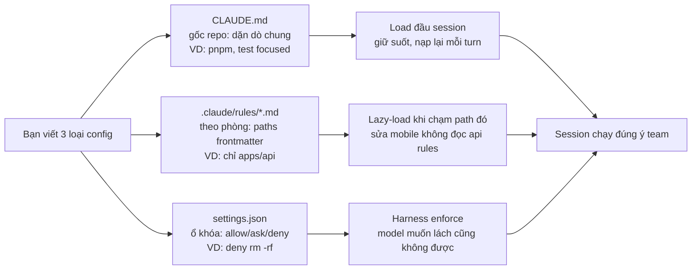

# 03 — CLAUDE.md, Memory & Rules (File Quan Trọng Nhất)

> Bài 03 của series — file quyết định 50% chất lượng agent. Đọc xong bạn viết được
> CLAUDE.md <200 dòng, tách rules theo path, dùng import đúng cách, và tương thích AGENTS.md.
> Thời gian: ~35 phút.

## Mục lục

1. [Vì sao CLAUDE.md là file quan trọng nhất? (why)](#1-vì-sao-claudemd-là-file-quan-trọng-nhất-why)
2. [CLAUDE.md là gì và đặt ở đâu](#2-claudemd-là-gì-và-đặt-ở-đâu)
3. [3 CLAUDE.md mẫu hoàn chỉnh](#3-3-claudemd-mẫu-hoàn-chỉnh-copy-paste)
4. [Rules patterns + paths frontmatter](#4-rules-patterns--paths-frontmatter)
5. [AGENTS.md portability](#5-agentsmd-portability--viết-1-lần-chạy-mọi-agent)
6. [Import & tách nhỏ](#6-import--tách-nhỏ-đừng-phình-file)
7. [Auto-memory + /memory deep-dive](#7-auto-memory-claude-tự-học--memory)
8. [Walkthrough step-by-step](#8-walkthrough-step-by-step-viết-claudemd-từ-0)
9. [Bảng thuật ngữ](#9-bảng-thuật-ngữ)
10. [Hiểu nhầm thường gặp](#10-hiểu-nhầm-thường-gặp)
11. [Anti-patterns + pitfalls + bài tập](#11-anti-patterns--pitfalls--bài-tập)
12. [Link chéo](#12-link-chéo)

### Khái niệm mở đầu (đọc 2 phút, nhớ cả bài)

- **CLAUDE.md là gì?** 1 câu: tờ dặn dò dán trên tủ lạnh, Claude đọc đầu mỗi session và nhớ suốt.
  - Ví dụ đời thường: như nội quy nhà dán cửa — ai vào cũng đọc: "đi giày để ngoài, mèo ăn lúc 7h".
  - Ví dụ copy-paste: tạo `./CLAUDE.md` với 1 dòng `ALWAYS chạy pnpm --filter @acme/api test sau khi sửa apps/api/`, mở session mới hỏi `rules mày đang nhớ là gì?`.
- **`.claude/rules/*.md` là gì?** 1 câu: nội quy từng phòng, chỉ áp dụng khi bước vào phòng đó.
  - Ví dụ đời thường: như bảng "phòng bếp: rửa tay trước khi nấu" — không vào bếp thì không cần đọc.
  - Ví dụ copy-paste: tạo `.claude/rules/api.md` với frontmatter `paths: ["apps/api/**"]` + dòng `Mọi route mới phải có zod schema + test 401/422`.
- **`settings.json` là gì?** 1 câu: ổ khóa cửa — quyết định cái gì được chạy luôn, cái gì phải hỏi, cái gì cấm.
  - Ví dụ đời thường: như remote cổng chung cư: shipper quen (Read) cho lên, khách lạ (Edit) gọi hỏi, trộm (rm -rf) cấm.
  - Ví dụ copy-paste: trong `.claude/settings.json` đặt `"permissions": { "allow": ["Bash(pnpm test:*)"], "deny": ["Bash(rm -rf:*)"] }`, kiểm tra bằng `/permissions`.



Giải thích từng bước:

- **A — Bạn viết 3 loại:** đừng nhét tất cả vào 1 file. Dặn chung → CLAUDE.md; dặn từng phòng → rules; khóa cửa → settings.json.
- **B — CLAUDE.md gốc repo:** nằm ở `./CLAUDE.md`, commit git. Load vô điều kiện mỗi session. Giữ <200 dòng.
- **C — rules theo path:** nằm ở `.claude/rules/*.md`, có `paths: [...]`. Chỉ load khi task chạm path đó → rẻ token.
- **D — settings.json:** nằm ở `.claude/settings.json` (team) + `.claude/settings.local.json` (personal). Harness đọc để cho/hỏi/cấm tools.
- **E/F/G — 3 cơ chế load khác nhau:** CLAUDE.md = luôn nhớ; rules = nhớ khi cần; settings = luật cấm (0 token, enforce thật).
- **H — Kết quả:** session nào cũng đúng lệnh test, đúng style từng folder, không chạy lệnh cấm.

---

## 1. Vì sao CLAUDE.md là file quan trọng nhất? (why)

Mọi session Claude Code đều nạp CLAUDE.md **đầu tiên, giữ suốt, nạp lại mỗi turn**.
Nó là "bộ nhớ dài hạn" duy nhất bạn kiểm soát được. Skill/subagent/hook đều load có điều kiện;
CLAUDE.md load **vô điều kiện**. Vì vậy:

- Viết tốt → mọi task sau tự đúng (lệnh test đúng, style đúng, không đụng generated).
- Viết tệ (500 dòng wiki) → mọi task sau đều trả tiền cho rác + agent vẫn sai chỗ quan trọng.

Cơ chế sâu: CLAUDE.md được inject vào system prompt đầu session. Mỗi lần compact context,
nó được nạp lại. Mỗi subagent **mặc định cũng đọc** project CLAUDE.md (trừ agent `Explore`/`Plan`
skip để giữ context nhỏ — bài 06). Nghĩa là 1 dòng sai trong CLAUDE.md nhân bản ra mọi worker.

> Quy tắc 200 dòng không phải thẩm mỹ — là token economics (bài 00 mục 4). 150 dòng ≈ 2.500 tokens
> × N turns. Cắt 1 dòng thừa tiết kiệm N lần.

---

## 2. CLAUDE.md là gì và đặt ở đâu

Markdown Claude đọc **đầu mỗi session**, giữ suốt session. Chứa: project là gì, build/test/lint
lệnh nào, kiến trúc, code style, rules "luôn/không bao giờ".

Thứ tự load (merge từ ngoài vào trong):

```
~/.claude/CLAUDE.md          (personal, mọi project)
→ ./CLAUDE.md hoặc ./.claude/CLAUDE.md  (project, commit git cho team)
→ /etc/claude-code/CLAUDE.md   (system, nếu có)
/etc/claude-code/CLAUDE.md   (system, nếu có)
→ nested CLAUDE.md ở subdirs (lazy-load khi làm việc trong đó)
→ --add-dir dirs (CHỈ khi CLAUDE_CODE_ADDITIONAL_DIRECTORIES_CLAUDE_MD=1)
```

Xem thực tế đang load gì: `/memory`. Sửa: `/memory` (edit files, bật/tắt auto-memory, xem entries).

### 2.1. Thứ tự thắng khi xung đột (precedence)

```
system < personal (~/.claude/) < project (./CLAUDE.md) < nested (subdirs) < rules (paths-scoped)
```

- Nested và rules thắng vì **cụ thể hơn** (gần code đang sửa hơn).
- `/doctor` (≥2.1.206) phát hiện dedupe local vs checked-in: cùng 1 rule viết 2 nơi → giữ 1.
- Quy tắc team: personal chỉ để preferences cá nhân (editor, ngôn ngữ trả lời); mọi thứ team
  dùng chung phải vào project CLAUDE.md + commit.

```bash
# Kiểm tra đang load gì (copy-paste):
# Trong session:
/memory
# → liệt kê từng file + entries. Nếu thấy rule trùng 2 files → xóa 1.

# Đếm dòng (budget check):
wc -l CLAUDE.md .claude/CLAUDE.md ~/.claude/CLAUDE.md 2>/dev/null
# Mục tiêu: project file <200 dòng.
```

> **Kỳ vọng / Verify:** `/memory` liệt kê được từng file đang load (personal/project/nested). `wc -l` in số dòng mỗi file — project file phải <200. Thấy rule trùng 2 nơi → xóa 1 rồi chạy `/doctor` xác nhận hết báo dedupe.

### 2.2. Phân biệt rõ: CLAUDE.md vs .claude/rules vs settings.json (đọc kỹ — hay nhầm nhất)

| Loại | Nằm ở đâu | Ví dụ nội dung 1 dòng | Khi nào dùng |
|---|---|---|---|
| **CLAUDE.md (gốc repo)** | `./CLAUDE.md` hoặc `./.claude/CLAUDE.md`, commit git | `ALWAYS chạy pnpm --filter @acme/api test sau khi sửa apps/api/` | Dặn chung mọi task: lệnh build/test/lint, kiến trúc, style toàn repo. Load luôn → giữ <200 dòng |
| **`.claude/rules/*.md` (theo path)** | `.claude/rules/api.md`, `.claude/rules/db.md`..., commit git, có `paths:` frontmatter | `paths: ["apps/api/**"]` + `Mọi route mới phải có zod schema + test 401/422` | Dặn riêng từng phòng: chỉ load khi task chạm path đó. Sửa mobile không tốn token đọc api rules |
| **`settings.json` (ổ khóa quyền)** | `.claude/settings.json` (team, commit) + `.claude/settings.local.json` (personal, không commit) + `~/.claude/settings.json` | `"deny": ["Bash(rm -rf:*)", "Write(.env*)"]` | Khóa allow/ask/deny cho tools. Harness enforce (model muốn lách cũng không được). Xem bằng `/permissions` |

```bash
# Tạo 3 loại trong 1 phút (copy-paste khung):
ls CLAUDE.md .claude/rules/ .claude/settings.json 2>/dev/null
# Kỳ vọng: thấy cả 3. Thiếu cái nào → tạo theo mẫu mục 3 (CLAUDE.md),
# mục 4 (rules), bài 10 (settings.json).
```

> **Kỳ vọng / Verify:** `ls` thấy cả 3 paths. Mở `/memory` thấy CLAUDE.md + rules entries; mở `/permissions` thấy allow/ask/deny từ settings.json; mở `/rules` thấy list rules theo path. Ba lệnh ba góc nhìn khác nhau — không thay thế nhau.

---

## 3. 3 CLAUDE.md mẫu hoàn chỉnh (copy-paste)

> Mỗi mẫu <100 dòng, verified-commands, rules check được. Thay `<...>` bằng project bạn.

### 3.1. Mẫu A — Web app (Next.js + Postgres + pnpm)

```markdown
# Project: Acme Shop Web — Next.js 15 storefront + API routes

## Tech Stack
- Next.js 15 (App Router), TypeScript strict, Tailwind, Prisma + Postgres 16
- Auth: NextAuth v5 (credentials + Google). Tests: Vitest + Playwright

## Commands (VERIFIED 2026-09 — chạy lại nếu đổi toolchain)
- Dev: `pnpm dev` (web :3000, cần `.env.local` từ 1Password "Acme dev")
- DB migrate: `pnpm prisma migrate dev`
- Test focused: `pnpm vitest run apps/web/src/app/login/`
- Test full: `pnpm test` (không chạy khi chỉ sửa 1 file — dùng focused)
- Lint: `pnpm eslint apps/web/src --max-warnings 0`
- Full check trước PR: `pnpm lint && pnpm test && pnpm build`

## Architecture
- `apps/web/src/app/` routes (server components mặc định; "use client" chỉ khi cần interactivity)
- `apps/web/src/server/` owns DB access; client components KHÔNG import prisma trực tiếp
- `packages/ui/` design system; `packages/contracts/` zod schemas dùng chung client/server

## Code Style (cụ thể, check được)
- API errors shape `{ code, message, requestId }`, HTTP status đúng (400/401/403/404/422/500)
- Server actions validate bằng zod schema từ `packages/contracts/`, không validate tay
- File >300 dòng thì tách; component >150 dòng thì tách
- Không `any`; ép kiểu phải có comment `// why: ...`

## Rules
- ALWAYS chạy focused test sau khi sửa; paste output vào báo cáo
- ALWAYS `pnpm prisma migrate dev --name <ten>` khi đổi schema, KHÔNG sửa SQL tay
- NEVER commit trực tiếp main, NEVER sửa `src/generated/` và `prisma/migrations/*/migration.sql` đã merge
- DB seed chỉ từ `prisma/seed.ts`, không insert tay rồi quên seed
```

### 3.2. Mẫu B — Monorepo (pnpm workspaces + packages)

```markdown
# Project: Acme Platform — pnpm monorepo (apps/api, apps/worker, packages/*)

## Tech Stack
- Node 22, pnpm 9 workspaces, TypeScript project references
- apps/api (Fastify), apps/worker (BullMQ), packages/domain (pure, không phụ thuộc framework)

## Commands (VERIFIED)
- Dev all: `pnpm dev` (turbo pipeline)
- Test focused (QUAN TRỌNG — không chạy root test khi sửa 1 package):
  - `pnpm --filter @acme/auth test`
  - `pnpm --filter @acme/api test src/routes/login.test.ts`
- Full check: `pnpm lint && pnpm test && pnpm build`
- Thay đổi cross-package: `pnpm --filter @acme/api... test` (test dependents)

## Architecture
- `packages/domain/` KHÔNG import từ `apps/*` hay framework (fastify, prisma). Vi phạm → tách lại
- `apps/api/` owns HTTP transport; logic nghiệp vụ nằm ở `packages/domain/`
- Routes ở `apps/api/src/routes/`, types ở `packages/contracts/`, tests cạnh source `*.test.ts`

## Code Style
- Conventional commits: `feat|fix|test|chore(scope): mô tả`
- Public function phải có JSDoc 1 dòng + example nếu nontrivial
- Error shape `{ code, message, requestId }` xuyên suốt apps

## Rules
- ALWAYS chạy `--filter` focused trước, chỉ chạy full khi PR
- NEVER import chéo `apps/*` vào `packages/domain/` (check bằng `pnpm deps:check`)
- NEVER bump major dep mà không mở PR riêng + changelog entry
- Migration DB nằm ở `db/migrations/`, 1 migration/PR, đặt tên `YYYYMMDD_<mo-ta>.sql`
```

### 3.3. Mẫu C — Mobile (React Native / Expo)

```markdown
# Project: Acme Go — Expo React Native app (iOS + Android)

## Tech Stack
- Expo SDK 52, React Native 0.76, TypeScript strict, Zustand + React Query
- E2E: Maestro (`maestro test flows/`), unit: Jest

## Commands (VERIFIED)
- Dev: `pnpm start` (Expo Go) hoặc `pnpm ios` / `pnpm android`
- Unit focused: `pnpm jest src/screens/Login/`
- E2E 1 flow: `maestro test flows/login.yaml`
- Lint: `pnpm eslint src --max-warnings 0`
- Full check: `pnpm lint && pnpm jest && maestro test flows/`

## Architecture
- `src/screens/` (1 folder/screen: `index.tsx`, `hooks.ts`, `*.test.tsx`)
- `src/api/` owns network (React Query hooks); screens KHÔNG fetch trực tiếp
- `src/store/` Zustand slices; `src/components/` presentational only

## Code Style
- Screens không chứa fetch logic — chuyển vào `src/api/` hooks
- Mọi user-visible string qua `src/i18n/` (vi + en), không hardcode tiếng Việt trong JSX
- Không `any`; navigation params typed qua `src/navigation/types.ts`

## Rules
- ALWAYS chạy Jest focused sau sửa; E2E chỉ chạy khi PR (chậm)
- NEVER commit khi `maestro test flows/login.yaml` fail
- NEVER thêm native module mà không ghi vào đây + update `app.json` plugin list
- Ảnh/assets mới phải qua `pnpm assets:optimize` trước khi commit
```

---

## 4. Rules patterns + paths frontmatter

Project lớn: tách thành `.claude/rules/*.md` với `paths` frontmatter (rule chỉ load khi chạm path đó):

```markdown
---
paths: ["apps/mobile/**", "*.swift"]
---
- UI dùng SwiftUI, không UIKit trừ khi cần perf...
```

### 4.1. 5 patterns rules hay dùng (copy-paste khung)

```markdown
---
paths: ["apps/api/**"]
---
# API rules (chỉ load khi sửa apps/api/)
- Mọi route mới phải có: zod schema + test happy + test 401/422 + log requestId.
- Không trả stack trace ra client (log server, trả { code, message, requestId }).
```

```markdown
---
paths: ["db/migrations/**", "*.sql"]
---
# DB rules
- 1 migration/PR. Tên `YYYYMMDD_<mo-ta>.sql`. Không sửa migration đã merge (viết migration mới).
- Mọi ALTER TABLE production phải có rollback note trong header file.
```

```markdown
---
paths: ["*.test.ts", "*.spec.ts"]
---
# Test rules
- Test đặt cạnh source, không gom vào tests/ trung tâm.
- Mock ở boundary (DB/HTTP), không mock logic đang test.
```

```markdown
---
paths: [".github/workflows/**"]
---
# CI rules
- Workflow mới phải có `timeout-minutes`, không chạy `latest` floating cho action critical (pin SHA).
- Secrets chỉ qua `secrets.*`, không hardcode, không echo ra log.
```

```markdown
---
paths: ["packages/domain/**"]
---
# Domain purity (monorepo)
- File trong đây KHÔNG import fastify/express/prisma/react. Import vi phạm → build fail (`pnpm deps:check`).
```

### 4.2. So sánh CLAUDE.md vs rules vs skill (khi nào dùng gì)

| Nhu cầu | Đặt ở | Vì sao |
|---|---|---|
| Lệnh build/test кислорода mọi task | CLAUDE.md root | Load luôn, dùng mọi session |
| Quy ước chỉ đúng trong `apps/api/` | `.claude/rules/api.md` (paths) | Đỡ pollute task sửa mobile |
| Checklist deploy 20 bước | Skill `/deploy` | Lazy-load khi deploy, không tốn token hàng ngày |
| Rule "không push main" bị ignore hoài | Hook PreToolUse | Advisory → law (bài 07) |
| Quy ước team dùng cả Cursor/Windsurf | `AGENTS.md` + CLAUDE.md trỏ sang | Portability (mục 5) |

- Xem/quản lý: `/rules`. Cross-tool portability: giữ rules chung ở `AGENTS.md`, CLAUDE.md ngắn trỏ sang.

---

## 5. AGENTS.md portability — viết 1 lần, chạy mọi agent

**AGENTS.md** là chuẩn mở (OpenAI khởi xướng, nhiều agent tools đọc: Cursor, Copilot, Codex, Windsurf...).
Claude Code đọc CLAUDE.md; các tool khác đọc AGENTS.md. Team dùng nhiều tools → giữ 1 source of truth.

### 5.1. Pattern khuyến nghị (3 options)

```text
Option 1 — AGENTS.md là chính, CLAUDE.md trỏ sang (khuyến nghị team multi-tool):
  AGENTS.md         ← rules chung (commands, style, architecture)
  CLAUDE.md         ← 10 dòng: "đọc AGENTS.md + thêm notes riêng Claude (hooks, skills...)"
  .claude/rules/    ← path-scoped, Claude-specific

Option 2 — CLAUDE.md là chính (team thuần Claude):
  CLAUDE.md         ← tất cả
  AGENTS.md         ← symlink hoặc 5 dòng trỏ sang CLAUDE.md

Option 3 — Song sinh (tránh):
  2 files copy nhau → drift sau 2 tuần → ĐỪNG.
```

### 5.2. Ví dụ copy-paste (Option 1)

```markdown
# File: AGENTS.md (repo root, commit)
# Project conventions (tool-agnostic — mọi agent đọc)

## Commands
- Dev: `pnpm dev` · Test focused: `pnpm --filter @acme/api test` · Lint: `pnpm lint`

## Style
- TypeScript strict, no `any` without `// why:` comment
- API errors `{ code, message, requestId }`

## Boundaries
- `packages/domain/` must not import frameworks
- Never commit to main; migrations in `db/migrations/`, one per PR
```

> **Kỳ vọng / Verify:** file `AGENTS.md` ở repo root, tool khác (Cursor/Copilot) mở repo cũng đọc được. Không copy nguyên sang CLAUDE.md — CLAUDE.md chỉ trỏ sang (mẫu dưới).

```markdown
# File: CLAUDE.md (repo root, commit — ngắn!)
# Claude-specific pointer + extras

@AGENTS.md

## Claude-only notes
- Skills: dùng `/deploy` khi deploy, `/review-pr` khi review (xem .claude/skills/)
- Test reports: paste focused-test output vào báo cáo cuối task
- Chi tiết path-scoped: xem `.claude/rules/` (`/rules` để browse)
```

```bash
# Verify cả 2 tools đọc được (copy-paste):
wc -l AGENTS.md CLAUDE.md   # AGENTS.md chi tiết, CLAUDE.md <30 dòng là đẹp
# Hỏi Claude: "liệt kê rules mày load từ AGENTS.md + CLAUDE.md + .claude/rules/"
```

> **Kỳ vọng / Verify:** `wc -l` cho thấy AGENTS.md dài (chi tiết), CLAUDE.md <30 dòng (chỉ trỏ + notes riêng). Hỏi Claude liệt kê rules → nó kể được cả 3 nguồn, không báo "không thấy file".

---

## 6. Import & tách nhỏ (đừng phình file)

```markdown
@import path/to/architecture.md
@docs/conventions.md
```

> **Kỳ vọng / Verify:** `@path` là trỏ (lazy-load khi cần), không phải copy. Sửa `docs/architecture.md` 1 nơi, mọi session sau thấy ngay. Hỏi Claude `rules mày load từ import nào?` → nó kể được tên file đã import.

- Dùng `@path` để import file khác (Claude đọc lazy khi cần). Khác với copy-paste: source 1 nơi,
  sửa 1 nơi.
- Ngưỡng: CLAUDE.md root >100 dòng → bắt đầu tách. >200 dòng → bắt buộc tách (budget).

```markdown
# Ví dụ CLAUDE.md dùng import (root ngắn, chi tiết lazy):
# Project: Acme — xem chi tiết khi cần

## Commands (luôn giữ inline — dùng mọi task)
- Dev: `pnpm dev` · Test: `pnpm --filter @acme/api test` · Lint: `pnpm lint`

@docs/architecture.md
@docs/api-conventions.md
@docs/db-migrations.md
```

> **Kỳ vọng / Verify:** root CLAUDE.md <60 dòng (chỉ commands + rules nóng). Chi tiết nằm ở `docs/*.md`. `wc -l CLAUDE.md` phải <60 sau khi tách.

```bash
# Cấu trúc file khuyến nghị cho repo vừa (copy-paste khung):
# CLAUDE.md (root, <60 dòng: commands + rules nóng nhất)
# docs/architecture.md (sơ đồ module, boundaries)
# docs/api-conventions.md (error shape, validation, auth)
# docs/db-migrations.md (quy trình migration)
# .claude/rules/<domain>.md (path-scoped, có paths frontmatter)
```

---

## 7. Auto-memory (Claude tự học) + `/memory`

Claude tự save learnings (build commands, debugging insights) cross-session — bạn không cần viết tay.
Dùng `/memory` để xem entries, xóa cái sai, tắt auto-memory nếu team không muốn drift.
Định kỳ chạy `/doctor`: nó dedupe local vs checked-in CLAUDE.md và đề xuất migrate guidance
always-loaded còn lại thành skills + nested `CLAUDE.md` load-on-demand.

### 7.1. `/memory` deep-dive (3 tabs cần biết)

```text
Tab 1 — Files: liệt kê CLAUDE.md files đang load (personal/project/nested/add-dir).
       Dùng để: phát hiện trùng lặp, biết rule nào từ file nào.
Tab 2 — Entries: từng learning Claude tự save (vd "repo dùng pnpm, không dùng npm").
       Dùng để: xóa entries sai (Claude học nhầm 1 lần rồi áp dụng mãi).
Tab 3 — Settings: bật/tắt auto-memory, chọn scope (personal/project).
```

```text
# Flow dọn memory định kỳ (2 tuần/lần, 10 phút):
/memory
# 1. Tab Entries → xóa learnings sai/lỗi thời (đổi toolchain mà memory còn lệnh cũ).
# 2. Tab Files → nếu project CLAUDE.md >200 dòng → /doctor để trim.
# 3. Nếu team drift (mỗi máy memory khác nhau) → tắt auto-memory project-scope,
#    giữ rules trong committed CLAUDE.md + rules/ làm source of truth.
```

### 7.2. Khi nào TẮT auto-memory?

| Tình huống | Quyết định |
|---|---|
| Solo dev, 1 repo | Bật — học preferences nhanh |
| Team 3+ người, 1 repo | Tắt project-scope, giữ personal — tránh drift chéo |
| Repo có committed CLAUDE.md chuẩn | Tắt — committed file là truth, memory chỉ gây nhiễu |
| Sau khi đổi toolchain (npm→pnpm) | Xóa entries cũ + bật lại — không để memory cũ đầu độc |

---

## 8. Walkthrough step-by-step: viết CLAUDE.md từ 0

> 20 phút, làm 1 lần cho mỗi repo. Yêu cầu: repo đã `git init`, có package.json/pyproject.

**Bước 1 — Sinh nháp (3 phút):**

```bash
cd /path/to/repo
# Interactive flow (hỏi skills/hooks/memory):
CLAUDE_CODE_NEW_INIT=1 claude
# Trong session:
/init
```

**Bước 2 — Cắt 50% (5 phút):**
Đọc file sinh ra, xóa mọi dòng thuộc 3 loại:

- [ ] Directory layout ("repo có apps/, packages/...") — Claude tự `ls` được.
- [ ] Dependency list copy từ package.json — Claude tự `Read` được.
- [ ] Architecture overview dài không có rationale — giữ boundaries + pitfalls, xóa mô tả.

**Bước 3 — Thêm verified commands (5 phút):**

```bash
# Chạy THẬT từng lệnh trên máy, chỉ ghi lệnh pass:
pnpm dev          # có chạy được? port nào?
pnpm --filter @acme/api test   # focused test lệnh nào?
pnpm lint         # lint lệnh nào?
# Ghi đúng lệnh đã pass + ghi chú (cần .env? cần DB chạy?) vào CLAUDE.md.
```

**Bước 4 — Viết 5 rules ALWAYS/NEVER (5 phút):**
Mỗi rule phải cụ thể + check được. Mẫu:

```markdown
- ALWAYS chạy `pnpm --filter @acme/api test` sau khi sửa apps/api/
- NEVER commit trực tiếp main (luôn branch feat/* + PR)
- NEVER sửa `src/generated/` (sinh tự động từ prisma)
- DB change → bắt buộc migration trong `db/migrations/`, 1 migration/PR
- File >300 dòng → tách trước khi thêm code mới
```

**Bước 5 — Verify (2 phút):**

```bash
wc -l CLAUDE.md   # phải <200, lý tưởng <100
# Trong session mới:
/memory    # xác nhận file load
# Giao task nhỏ, xem Claude có dùng đúng lệnh/rules không.
```

---

## 9. Bảng thuật ngữ

| Thuật ngữ | Là gì (hiểu nôm na) | Ví dụ cụ thể | Khi nào dùng |
|---|---|---|---|
| CLAUDE.md (gốc repo) | Tờ dặn dò dán tủ lạnh, đọc mỗi session | `./CLAUDE.md`: `ALWAYS chạy pnpm --filter @acme/api test sau khi sửa` | Dặn chung team, mọi task. Giữ <200 dòng, commit git |
| Nested CLAUDE.md | Giấy note dán từng phòng | `apps/mobile/CLAUDE.md` chỉ đọc khi sửa mobile | Repo lớn, mỗi subtree 1 conventions riêng |
| `.claude/rules/*.md` | Nội quy từng phòng, có chìa khóa paths | `paths: ["apps/api/**"]` + `route mới phải có zod + test 401` | Quy ước chỉ đúng 1 folder. Xem bằng `/rules` |
| `settings.json` | Ổ khóa cửa: allow/ask/deny | `"deny": ["Bash(rm -rf:*)"]` trong `.claude/settings.json` | Khóa quyền tools. Xem merged bằng `/permissions` |
| Import `@path` | Trỏ tới tờ khác thay vì photo copy | `@docs/architecture.md` trong CLAUDE.md root | Root >100 dòng → tách, giữ root <60 dòng |
| AGENTS.md | Nội quy chung cho mọi hãng agent | `AGENTS.md` chi tiết + `CLAUDE.md` 10 dòng trỏ sang | Team dùng nhiều tools (Claude + Cursor + Copilot) |
| Auto-memory | Claude tự ghi nhớ sau mỗi task | Entry `repo dùng pnpm, không dùng npm` tự save | Solo dev bật; team có file chuẩn thì tắt project-scope |
| `/memory` | Sổ xem/sửa trí nhớ | `/memory` → tab Entries xóa learning sai | Dọn 2 tuần/lần, sau đổi toolchain |

## 10. Hiểu nhầm thường gặp

| Hiểu nhầm | Sự thật | Ví dụ sửa |
|---|---|---|
| CLAUDE.md càng dài càng tốt | Mỗi dòng tốn tiền N lần (mỗi turn nạp lại). 600 dòng ≈ 10k tokens × 10 turns = 100k tokens | `wc -l CLAUDE.md` >200 → cắt layout/dependency list, chuyển checklist thành skill (mục 8 Bước 2) |
| Nhét mọi thứ vào CLAUDE.md root cho chắc | Rules path-scoped vào `rules/`, checklist dài thành skill, luật cấm thành hook/settings | API rules chỉ đúng `apps/api/` → `.claude/rules/api.md`; deploy 20 bước → skill `/deploy`; "không push main" hay bị lờ → hook |
| `rules/` và `settings.json` là một | Rules = dặn dò (advisory, tốn token khi load); settings = ổ khóa (enforce, 0 token) | "Route phải có test" → rules; "cấm rm -rf" → settings deny + hook |
| AGENTS.md + CLAUDE.md copy nhau cho chắc | Drift sau 2 tuần thành 2 sự thật mâu thuẫn | Chọn Option 1: AGENTS.md chính, CLAUDE.md `@AGENTS.md` + 10 dòng riêng (mục 5.2) |
| Auto-memory bật là xong, khỏi viết file | Memory mỗi máy drift khác nhau; committed file mới là truth team | Team 3+ người → tắt project-scope memory, giữ rules trong git (bảng mục 7.2) |
| Ghi "Write clean code" là đủ | Vague = rác; phải cụ thể + check được | Viết `API errors dùng {code,message,requestId}` thay vì `clean code` |

## 11. Anti-patterns + pitfalls

### 11.1. Anti-patterns (lỗi phổ biến người Việt hay mắc)

| Sai | Đúng | Vì sao |
|---|---|---|
| CLAUDE.md 500 dòng copy wiki | <200 dòng, front-load rule hay sai nhất lên đầu | Token × turns; Claude skim đầu file kỹ hơn cuối |
| Ghi "chạy test" chung chung | Ghi lệnh focused test chính xác | "Chạy test" → Claude chạy full 10 phút hoặc sai package |
| Ghi conventions của framework mặc định | Chỉ ghi cái **khác** default + lý do | Default Claude đã biết; ghi thừa tốn token |
| Nhét deployment checklist dài vào CLAUDE.md | Tách thành skill `/deploy` (load khi cần) | Checklist 20 bước × mọi turn = lãng phí |
| Rule bị ignore hoài vẫn để trong CLAUDE.md | Nâng thành **hook** (Pre/PostToolUse) — xem bài 07 | Advisory bị quên; law enforce được |
| Viết "Write clean code" | Viết "API errors dùng `{code,message,requestId}`" | Vague = rác; cụ thể + check được = vàng |
| 2 files AGENTS.md + CLAUDE.md copy nhau | 1 source of truth + file kia trỏ sang | Drift sau 2 tuần, 2 truths mâu thuẫn |

### 11.2. Checklist CLAUDE.md khỏe (paste vào PR review)

- [ ] <200 dòng (`wc -l`).
- [ ] Mọi command đã chạy thử (verified, có ngày verify nếu toolchain hay đổi).
- [ ] Mọi rule bắt đầu bằng ALWAYS/NEVER + cụ thể + check được.
- [ ] Không có directory layout/dependency list copy (Claude tự suy ra được).
- [ ] Rules path-scoped đã tách ra `.claude/rules/` (có `paths`).
- [ ] Checklist dài đã tách thành skill.
- [ ] Rule hay bị miss đã nâng thành hook.
- [ ] `/doctor` không báo dedupe/trim.

### 11.3. Bài tập thực hành

**Bài 1 (15 phút):** Chạy `/init` (hoặc `CLAUDE_CODE_NEW_INIT=1 /init`), đọc file sinh ra, xóa 50%
theo checklist bước 2 (mục 8). Đếm dòng trước/sau.

**Bài 2 (10 phút):** Thêm 3 verified commands (dev/test/lint) đã chạy thử trên máy. Mỗi lệnh ghi
kèm ghi chú (cần .env? cần DB?).

**Bài 3 (10 phút):** Viết 5 rules ALWAYS/NEVER cụ thể của team bạn. Test: giao task nhỏ, xem
Claude có tuân thủ cả 5 không. Rule nào bị miss → viết lại cụ thể hơn.

**Bài 4 (15 phút):** Chạy `/doctor`, làm theo mục CLAUDE.md trim. Tách 1 mục dài thành
`.claude/rules/` hoặc skill. Verify `wc -l` giảm mà task vẫn pass.

**Bài 5 (15 phút, nâng cao):** Setup AGENTS.md portability theo mẫu mục 5 (Option 1). Mở repo
bằng 1 tool khác (Cursor/Copilot) kiểm tra nó đọc được AGENTS.md không.

---

## 12. Link chéo

- **Bài 00 — Tổng quan**: token economics (vì sao <200 dòng), bảng chọn CLAUDE.md/skill/hook.
- **Bài 01 — Cài đặt**: `/init`, `/memory`, `CLAUDE_CODE_NEW_INIT=1`, `..._ADDITIONAL_DIRECTORIES_CLAUDE_MD`.
- **Bài 02 — Surfaces**: config nào lên cloud, cái nào ở local.
- **Bài 04 — Slash commands**: `/memory`, `/rules`, `/doctor`, `/compact` khi context đầy.
- **Bài 05 — Skills**: tách checklist dài thành skill lazy-load.
- **Bài 06 — Subagents**: subagent đọc CLAUDE.md nào; Explore/Plan skip để tiết kiệm.
- **Bài 07 — Hooks**: nâng rule hay miss thành law enforce thật.
- **Bài 10 — Permissions**: rules allow/ask/deny khác memory rules thế nào.
