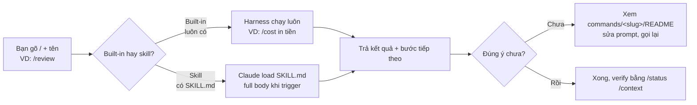

# 04 — Slash commands toàn tập (built-in và skill đi kèm)

> **Bài này cho ai:** dev cần tra nhanh 1 lệnh `/...` của Claude Code — người mới muốn thuộc vài lệnh đầu, người đã dùng muốn biết lệnh cần tìm nằm ở nhóm nào.
> **Cần gì trước:** đã cài và đăng nhập Claude Code ([01-cai-dat-va-xac-thuc.md](./01-cai-dat-va-xac-thuc.md)), mở được 1 session. Không cần đọc các bài khác trong folder.
> **Đọc xong bạn làm được:**
> - Gõ `/` phân biệt được lệnh built-in với skill và chỉ ra file chi tiết của lệnh đó.
> - Thuộc công thức 5 lệnh chạy một lần mỗi repo + 5 lệnh dùng hằng ngày.
> - Tra 78 lệnh theo 4 nhóm, biết lệnh đang vắng ở máy bạn là do version hay do provider.
> - Chạy được 12 prompt mẫu (mỗi nhóm 3) và tự kiểm tra kết quả trong 30 giây.
> **Thời gian:** ~40 phút

## Thuật ngữ dùng trong bài này

| Thuật ngữ | Hiểu nôm na là gì | Ví dụ thấy ngay |
|---|---|---|
| Slash command | Nút preset có tên, gõ `/tên` là Claude làm đúng 1 việc đã đóng gói — dùng mọi session, thay vì gõ prompt dài mỗi lần | `/cost` xem tiền, `/clear` reset não, `/review` soi code |
| Built-in | Nút cứng của máy, xe nào cũng có — luôn có sẵn, không cần cài gì thêm | `/clear`, `/model`, `/compact`, `/doctor` |
| Bundled skill (skill) | Miếng dán thêm, ai cần thì gắn; việc nào lặp hơn 3 lần thì viết thành skill | `/deploy` team tự viết ở `.claude/skills/deploy/SKILL.md` |
| `commands/<slug>/README.md` | Tờ hướng dẫn chi tiết từng nút — mở ra trước khi quên cú pháp hay gặp lỗi lệnh | `/clear` → `commands/session-context/clear/README.md` |
| Version floor (bản tối thiểu) | Đời máy tối thiểu để có nút mới; không thấy lệnh thì check version trước khi kết luận lệnh bị mất | `/cd` ≥2.1.169, `/effort` ≥2.1.205, `/goal` ≥2.1.139 |

## Mục lục

1. [Slash command là gì?](#1-slash-command-là-gì)
2. [Nhóm 1 — Session & Context (18)](#2-nhóm-1--session--context-18)
3. [Nhóm 2 — Model & Mode + Code (22)](#3-nhóm-2--model--mode--code-22)
4. [Nhóm 3 — Tri thức & Hệ thống (18)](#4-nhóm-3--tri-thức--hệ-thống-18)
5. [Nhóm 4 — Auth/Remote/Settings (20)](#5-nhóm-4--authremotesettings-20)
6. [Công thức 5 lệnh mỗi repo và 5 lệnh hằng ngày](#6-công-thức-5-lệnh-mỗi-repo-và-5-lệnh-hằng-ngày)
7. [Hiểu nhầm thường gặp](#7-hiểu-nhầm-thường-gặp)
8. [Bài tập thực hành](#8-bài-tập-thực-hành)
9. [Lưu ý version/provider](#9-lưu-ý-versionprovider)
10. [Link chéo](#10-link-chéo)

## 1. Slash command là gì?

Mục tiêu section này: trả lời 3 câu nền trong 2 phút — slash command là gì, built-in khác skill ở đâu, 4 nhóm lệnh được chia thế nào — để bạn mở bảng tra ở các mục sau mà không bị ngợp.

- **Slash command là gì?** 1 câu: phím tắt có tên, gõ `/tên` là Claude làm đúng 1 việc đã đóng gói.
  - Ví dụ đời thường: như nút preset máy giặt — thay vì nhớ "đồ trắng 40 độ + vắt 800", chỉ bấm nút `Giặt trắng`.
  - Ví dụ copy-paste: trong session gõ `/cost` là xem tiền session này; gõ `/clear` là reset não bắt task mới.
- **Built-in với skill (bundled) khác nhau ở đâu?** 1 câu: built-in là nút cứng của máy (luôn có), skill là miếng dán thêm (cài mới có, gọi như lệnh).
  - Ví dụ đời thường: như còi xe (built-in, xe nào cũng có) vs giá đỡ điện thoại dán thêm (skill, ai cần thì gắn).
  - Ví dụ copy-paste: `/clear`, `/model` là built-in (máy nào cũng có); `/deploy` của team bạn là skill (nằm ở `.claude/skills/deploy/SKILL.md`, gõ `/deploy` mới chạy).
- **4 nhóm slash là gì?** 1 câu: 4 ngăn tủ đựng 78 nút cho gọn — session, code, tri thức, cài đặt.
  - Ví dụ đời thường: như siêu thị chia quầy rau/thịt/đồ khô/gia vị — cần gì tới đúng quầy.
  - Cụ thể từng ngăn chứa gì, lệnh nào hay dùng và dùng khi nào: xem bảng ngay dưới.

| Nhóm | Ngăn tủ nào | Lệnh hay dùng | Dùng khi nào |
|---|---|---|---|
| 1 — Session & Context | Não của session: mở, dọn, nén, xem tiền | `/clear` task mới, `/compact` khi 75%, `/cost` xem tiền | Đầu/cuối mỗi task, khi context đầy |
| 2 — Model & Mode + Code | Cách "suy" của Claude + soi code | `/model opus` việc khó, `/plan` duyệt trước, `/review` + `/verify` sau code | Đổi model/effort, review/verify, chia batch |
| 3 — Tri thức & Hệ thống | Trí nhớ + đồ nghề ngoài | `/memory` sửa CLAUDE.md, `/mcp` nối DB, `/hooks` xem sự kiện, `/doctor` khám tổng | Setup repo, nối tools, lỗi lạ |
| 4 — Auth/Remote/Settings | Tài khoản + cửa ra vào | `/login` đổi account, `/add-dir` thêm folder, `/ide` nối VS Code | Đổi account, thêm dir, pair mobile/IDE |



Giải thích từng bước ngay dưới sơ đồ:

- **A — Bạn gõ `/`:** trong session gõ `/` hiện dropdown lệnh khả dụng **ở máy bạn** (khác plan/provider/version hiện khác nhau). Gõ tiếp tên, ví dụ `/review`.
- **B — Phân loại:** built-in (`/clear`, `/cost`, `/model`...) luôn có; skill (`/deploy`, `/review-pr` team tự viết) chỉ có khi đã cài ở `.claude/skills/` hoặc plugin.
- **C — Built-in chạy luôn:** harness thực thi ngay (đọc context, đổi model, in tiền...). Không tốn lượt load skill.
- **D — Skill load khi trigger:** startup chỉ tốn ~100 tokens (tên + description); full body chỉ load khi bạn gọi hoặc ngữ cảnh khớp (chi tiết [05-skills-custom-commands.md](./05-skills-custom-commands.md)).
- **E — Kết quả + bước tiếp:** lệnh chỉ-đọc thì không sửa file; lệnh ghi/chạy thì liệt kê file sẽ chạm trước (chuẩn từng file trong `commands/`).
- **F/G/H — Verify:** chưa đúng → mở `commands/<nhóm>/<slug>/README.md` xem prompt mẫu + lỗi hay gặp, gọi lại. Rồi thì `/status` hoặc `/context` xác nhận.

### Cách đọc bảng tra

Mỗi khái niệm ở mục 1 theo khung 3 dòng: **Nôm na 1 câu** → **Ví dụ đời thường** → **Ví dụ kỹ thuật copy-paste được**. 4 bảng tra ở mục 2–5 mỗi dòng là 1 lệnh: `/lệnh` — mô tả 1 dòng — cột **Bản tối thiểu** (để `—` nếu mọi bản Claude Code đều có) — link file chi tiết. Chi tiết từng lệnh nằm ở `commands/<nhóm>/<slug>/README.md` (mỗi file ~60 dòng: nôm na → khi nào dùng → cách gọi → prompt thật + verify → lỗi hay gặp).

- Tổng 78 folders, chia 4 nhóm: Session & Context (18) · Model & Mode + Code (22) · Tri thức & Hệ thống (18) · Auth/Remote/Settings (20).
- Nhóm 2 gộp folder `model-mode/` + phần lớn `code-repo/`; riêng `/pr_comments` và `/run-skill-generator` nằm ở `code-repo/` nhưng xếp vào nhóm 3 cho đúng việc dùng.
- Nếu link nào 404 ở máy bạn (lệnh vắng mặt) → làm theo mục 9 [Lưu ý version/provider](#9-lưu-ý-versionprovider).

**Kiểm tra nhanh:** gõ `/` trong session thấy dropdown lệnh; gọi `/clear` và (nếu đã cài) `/deploy` phân biệt được built-in với skill; mở được file chi tiết của 1 lệnh, ví dụ `/clear` → [commands/session-context/clear/README.md](./commands/session-context/clear/README.md).

## 2. Nhóm 1 — Session & Context (18)

Mục tiêu nhóm này: giữ não của session sạch và nhìn được đang tốn bao nhiêu — 18 lệnh mở, dọn, nén và xem tiền, dùng nhiều nhất trong tuần đầu.

| Lệnh | Mô tả 1 dòng | Bản tối thiểu | Chi tiết |
|---|---|---|---|
| `/branch` | Tách branch session để thử what-if không mất mạch chính | — | [./commands/session-context/branch/README.md](./commands/session-context/branch/README.md) |
| `/clear` | Xóa context bắt đầu task mới (giữ CLAUDE.md), thói quen #1 | — | [./commands/session-context/clear/README.md](./commands/session-context/clear/README.md) |
| `/compact` | Nén context khi ~70-80%, kèm focus giữ cái quan trọng | — | [./commands/session-context/compact/README.md](./commands/session-context/compact/README.md) |
| `/context` | Xem trực quan ai ngốn context (dạng lưới grid) | — | [./commands/session-context/context/README.md](./commands/session-context/context/README.md) |
| `/copy` | Copy nội dung/đoạn hội thoại ra clipboard hoặc file | — | [./commands/session-context/copy/README.md](./commands/session-context/copy/README.md) |
| `/cost` | Xem token usage + billing của session hiện tại | — | [./commands/session-context/cost/README.md](./commands/session-context/cost/README.md) |
| `/export` | Export hội thoại ra file text để lưu/share | — | [./commands/session-context/export/README.md](./commands/session-context/export/README.md) |
| `/fork` | Fork session hiện tại thành session song song | — | [./commands/session-context/fork/README.md](./commands/session-context/fork/README.md) |
| `/help` | Xem help + nhóm lệnh khả dụng | — | [./commands/session-context/help/README.md](./commands/session-context/help/README.md) |
| `/rename` | Đặt tên gợi nhớ cho session hiện tại | — | [./commands/session-context/rename/README.md](./commands/session-context/rename/README.md) |
| `/resume` | Tiếp tục session cũ theo tên/id (`--continue` ngoài CLI) | — | [./commands/session-context/resume/README.md](./commands/session-context/resume/README.md) |
| `/rewind` | Khôi phục code + conversation về checkpoint (kèm menu Double-Esc) | — | [./commands/session-context/rewind/README.md](./commands/session-context/rewind/README.md) |
| `/tasks` | Xem background work/subagents đang chạy hoặc đã xong | — | [./commands/session-context/tasks/README.md](./commands/session-context/tasks/README.md) |
| `/todos` | Xem quản lý todo list của task nhiều bước | — | [./commands/session-context/todos/README.md](./commands/session-context/todos/README.md) |
| `/usage` | Breakdown limit theo category (skills, subagents, per-MCP-server) | — | [./commands/session-context/usage/README.md](./commands/session-context/usage/README.md) |
| `/restart` | Khởi động lại CLI giữ nguyên session | — | [./commands/session-context/restart/README.md](./commands/session-context/restart/README.md) |
| `/background` | Đẩy session thành agent nền, rảnh tay làm việc khác | — | [./commands/session-context/background/README.md](./commands/session-context/background/README.md) |
| `/recap` | Tóm tắt context khi quay lại session sau break | — | [./commands/session-context/recap/README.md](./commands/session-context/recap/README.md) |

### Prompt thật Nhóm 1 — 3 tình huống hay gặp nhất

```text
# Tình huống 1 — Task mới sau khi fix CSS 45 phút (context đầy chuyện cũ):
/clear
Hãy đọc docs/payment-spec.md và triển khai POST /api/payments theo spec.
```

```text
# Tình huống 2 — Context ~75%, vẫn muốn giữ mạch (đừng để tới 95% mới nén):
/compact tập trung vào auth refactor, giữ quyết định về error shape {code,message,requestId}
```

```text
# Tình huống 3 — Cuối ngày, xem hôm nay tốn bao nhiêu + ai ngốn nhất:
/context
/usage
/cost
"đề xuất 3 thứ cắt giảm context mà không mất chất lượng"
```

**Kiểm tra nhanh:**

- Tình huống 1: `/clear` xóa history (giữ CLAUDE.md), task mới không lẫn chuyện CSS cũ; `/context` hiện % thấp sau clear; Claude triển khai đúng spec mới. Chi tiết: [clear](./commands/session-context/clear/README.md).
- Tình huống 2: context % giảm (ví dụ 75% → 30%); hỏi lại "error shape mình chốt là gì?" phải trả lời đúng. Chi tiết: [compact](./commands/session-context/compact/README.md).
- Tình huống 3: `/context` hiện lưới % (ví dụ `CLAUDE.md 18%, history 45%...`), `/usage` tách skills/subagents/MCP, `/cost` hiện tokens + tiền; Claude đề xuất được 3 thứ cụ thể (ví dụ "chuyển deploy checklist thành skill").

## 3. Nhóm 2 — Model & Mode + Code (22)

Mục tiêu nhóm này: đổi cách "suy" của Claude và kiểm chứng đầu ra — 22 lệnh đổi model/effort, duyệt plan, review và chạy thật code.

| Lệnh | Mô tả 1 dòng | Bản tối thiểu | Chi tiết |
|---|---|---|---|
| `/model` | Đổi model giữa session (opus khó, haiku rẻ) | — | [./commands/model-mode/model/README.md](./commands/model-mode/model/README.md) |
| `/effort` | Đặt độ kỹ low/medium/high/xhigh/max/auto | ≥2.1.205 | [./commands/model-mode/effort/README.md](./commands/model-mode/effort/README.md) |
| `/fast` | Bật fast mode cho Opus khi cần tốc độ (~2.5× nhanh, tính thêm tiền) — cần bật extra-usage trước | — | [./commands/model-mode/fast/README.md](./commands/model-mode/fast/README.md) |
| `/extra-usage` | Bật quota extra để dùng fast mode | — | [./commands/model-mode/extra-usage/README.md](./commands/model-mode/extra-usage/README.md) |
| `/plan` | Vào plan mode read-only, duyệt plan trước khi code | — | [./commands/model-mode/plan/README.md](./commands/model-mode/plan/README.md) |
| `/goal` | Đặt điều kiện hoàn thành, Claude tự loop tới khi đạt | ≥2.1.139 | [./commands/model-mode/goal/README.md](./commands/model-mode/goal/README.md) |
| `/permissions` | Quản lý allow/ask/deny rules cho tools | — | [./commands/model-mode/permissions/README.md](./commands/model-mode/permissions/README.md) |
| `/init` | Sinh CLAUDE.md nháp cho repo mới | — | [./commands/code-repo/init/README.md](./commands/code-repo/init/README.md) |
| `/diff` | Mở interactive diff viewer duyệt hunk trước commit (panel sống cạnh chat) | panel ≥2.1.260 | [./commands/code-repo/diff/README.md](./commands/code-repo/diff/README.md) |
| `/design-sync` | Kéo design từ Figma (và tương đương) về sinh/cập nhật code UI: màu, spacing, typography | version-gated — xem mục 9 | [./commands/code-repo/design-sync/README.md](./commands/code-repo/design-sync/README.md) |
| `/review` | Review nhanh diff hiện tại (nhẹ hơn code-review) | — | [./commands/code-repo/review/README.md](./commands/code-repo/review/README.md) |
| `/code-review` | Review sâu theo PR/branch range (từ 2.1.215 chỉ chạy khi gọi tay) | — | [./commands/code-repo/code-review/README.md](./commands/code-repo/code-review/README.md) |
| `/ultrareview` | Deep multi-agent review trong cloud sandbox | — | [./commands/code-repo/ultrareview/README.md](./commands/code-repo/ultrareview/README.md) |
| `/verify` | Build + chạy app thật để quan sát hành vi | ≥2.1.145 | [./commands/code-repo/verify/README.md](./commands/code-repo/verify/README.md) |
| `/batch` | Chia change lớn thành 5-30 worktree-isolated subagents, mỗi đứa 1 PR | — | [./commands/code-repo/batch/README.md](./commands/code-repo/batch/README.md) |
| `/loop` | Lặp task theo schedule (kết hợp /schedule routines) | — | [./commands/code-repo/loop/README.md](./commands/code-repo/loop/README.md) |
| `/btw` | Hỏi nhanh dùng full context nhưng không thêm vào history | — | [./commands/code-repo/btw/README.md](./commands/code-repo/btw/README.md) |
| `/security-review` | Quét bảo mật on-demand trên branch hiện tại | — | [./commands/code-repo/security-review/README.md](./commands/code-repo/security-review/README.md) |
| `/run` | Mở app thật và lái nó để thấy change chạy được | — | [./commands/code-repo/run/README.md](./commands/code-repo/run/README.md) |
| `/radio` | Kênh hỏi-đáp realtime với Claude (gõ hoặc nói) không phá mạch code chính | version-gated — xem mục 9 | [./commands/code-repo/radio/README.md](./commands/code-repo/radio/README.md) |
| `/subtask` | Giao việc phụ cho subagent, báo về ngay trong session | ≥2.1.212 | [./commands/code-repo/subtask/README.md](./commands/code-repo/subtask/README.md) |
| `/fewer-permission-prompts` | Quét transcripts, đề xuất allowlist read-only cho đỡ hỏi | — | [./commands/code-repo/fewer-permission-prompts/README.md](./commands/code-repo/fewer-permission-prompts/README.md) |

### Prompt thật Nhóm 2 — 3 tình huống hay gặp nhất

```text
# Tình huống 1 — Task khó, muốn model giỏi nhất + suy kỹ nhất (≥2.1.205):
/model opus
/effort max
"Fix 2 tests đỏ trong apps/api, tìm root cause, không sửa test cho pass ảo.
Chạy pnpm --filter @acme/api test xác nhận."
```

```text
# Tình huống 2 — Việc nguy hiểm, muốn duyệt plan trước khi cho sờ code:
/plan
"Thêm rate-limit cho POST /login: tìm files liên quan, đề xuất giải pháp + files sẽ sửa.
Chưa sửa gì, chờ tao duyệt."
```

```text
# Tình huống 3 — Vừa refactor xong, muốn 2 mắt soi (nhanh + sâu):
/review src/auth/login.ts
# rồi:
/code-review --focus security,tests
# rồi build + chạy app thật:
/verify
```

**Kiểm tra nhanh:**

- Tình huống 1: `/model` báo đã đổi sang opus, `/effort` báo `max`; Claude sửa source (không sửa test), chạy focused test báo `2 passed`; đổi model giữa session không mất history.
- Tình huống 2: Claude chỉ đọc + trình plan (files sẽ sửa, giải pháp, rủi ro), `git status` sạch (không file nào đổi); duyệt xong mới cho code. Chi tiết: [plan](./commands/model-mode/plan/README.md).
- Tình huống 3: `/review` (cùng agent, nhanh) chỉ ra lỗi nông; `/code-review` (mắt mới, sâu) chỉ thêm lỗi security/thiếu test; `/verify` build + chạy app thật, quan sát hành vi (không chỉ đọc code). Từ ≥2.1.215 cả hai chỉ chạy khi gọi tay — không tự trigger tốn token.

## 4. Nhóm 3 — Tri thức & Hệ thống (18)

Mục tiêu nhóm này: cấu hình "trí nhớ và đồ nghề" của Claude Code và chẩn đoán khi có lỗi — 18 lệnh cho memory, rules, MCP, plugin, subagent, doctor/debug.

| Lệnh | Mô tả 1 dòng | Bản tối thiểu | Chi tiết |
|---|---|---|---|
| `/memory` | Sửa CLAUDE.md entries + bật/tắt auto-memory | — | [./commands/knowledge-system/memory/README.md](./commands/knowledge-system/memory/README.md) |
| `/rules` | Quản lý `.claude/rules/` theo path | — | [./commands/knowledge-system/rules/README.md](./commands/knowledge-system/rules/README.md) |
| `/agents` | Panel Running + Library quản lý subagents | — | [./commands/knowledge-system/agents/README.md](./commands/knowledge-system/agents/README.md) |
| `/mcp` | Quản lý MCP connections/OAuth, reconnect/enable/disable | text-mode ≥2.1.205 | [./commands/knowledge-system/mcp/README.md](./commands/knowledge-system/mcp/README.md) |
| `/plugin` | Plugin manager: Discover/Browse/Manage plugins | — | [./commands/knowledge-system/plugin/README.md](./commands/knowledge-system/plugin/README.md) |
| `/hooks` | Xem hooks cho tool events (Pre/PostToolUse, Stop...) | — | [./commands/knowledge-system/hooks/README.md](./commands/knowledge-system/hooks/README.md) |
| `/doctor` | Chẩn đoán setup, version, trim CLAUDE.md | trim ≥2.1.206 | [./commands/knowledge-system/doctor/README.md](./commands/knowledge-system/doctor/README.md) |
| `/debug` | Troubleshoot session/tools khi có lỗi lạ | — | [./commands/knowledge-system/debug/README.md](./commands/knowledge-system/debug/README.md) |
| `/bug` | Report bug về Claude Code cho Anthropic | — | [./commands/knowledge-system/bug/README.md](./commands/knowledge-system/bug/README.md) |
| `/pr_comments` | Liệt kê PR comments để address từng cái | — | [./commands/code-repo/pr_comments/README.md](./commands/code-repo/pr_comments/README.md) |
| `/claude-api` | Hướng dẫn gọi Claude API / migrate sang API usage | — | [./commands/knowledge-system/claude-api/README.md](./commands/knowledge-system/claude-api/README.md) |
| `/simplify` | Rút gọn code/context thừa theo gợi ý | — | [./commands/knowledge-system/simplify/README.md](./commands/knowledge-system/simplify/README.md) |
| `/insights` | Báo cáo thói quen coding, streaks, model prefs | — | [./commands/knowledge-system/insights/README.md](./commands/knowledge-system/insights/README.md) |
| `/stats` | Thống kê coding dạng HTML report cuối tuần | — | [./commands/knowledge-system/stats/README.md](./commands/knowledge-system/stats/README.md) |
| `/run-skill-generator` | Ghi recipe cách chạy app thành skill tái dùng | — | [./commands/code-repo/run-skill-generator/README.md](./commands/code-repo/run-skill-generator/README.md) |
| `/skill-doctor` | Báo cáo skill nào ngốn context, skill nào chết lâm sàng | ≥2.1.252 | [./commands/knowledge-system/skill-doctor/README.md](./commands/knowledge-system/skill-doctor/README.md) |
| `/mcp-serve` | Biến Claude Code thành MCP server cho app khác gọi | — | [./commands/knowledge-system/mcp-serve/README.md](./commands/knowledge-system/mcp-serve/README.md) |
| `/plugin-validate` | Audit plugin/mod trước khi cài | — | [./commands/knowledge-system/plugin-validate/README.md](./commands/knowledge-system/plugin-validate/README.md) |

### Prompt thật Nhóm 3 — 3 tình huống hay gặp nhất

```text
# Tình huống 1 — Repo mới, sinh memory + dọn ngay (đừng để 500 dòng):
/init
# Đọc file sinh ra, xóa 50% câu chung chung, rồi:
/memory
# Xem entries nào load, xóa learning sai, tắt auto-memory project-scope nếu team 3+ người.
```

```text
# Tình huống 2 — MCP Postgres mất kết nối (token hết hạn):
/mcp
# → thấy postgres: disconnected → chọn reconnect, nhập lại password qua env.
# Test: "query 5 rows mới nhất của bảng orders, chỉ đọc không ghi."
```

```text
# Tình huống 3 — Setup lạ, không biết lỗi ở đâu (khám tổng quát):
/doctor
# /doctor: chẩn đoán + hỏi trước khi sửa (dedupe, trim CLAUDE.md, duplicate install).
# Xong nếu còn lỗi lạ về tools/session, gọi tiếp:
/debug
# /debug: troubleshoot session/tools khi lỗi lạ.
```

**Kiểm tra nhanh:**

- Tình huống 1: `CLAUDE.md` xuất hiện ở root (`ls CLAUDE.md` thấy file), `wc -l CLAUDE.md` <200 sau khi cắt; `/memory` liệt kê files + entries đang load. Chi tiết: [init](./commands/code-repo/init/README.md), [memory](./commands/knowledge-system/memory/README.md).
- Tình huống 2: `/mcp` hiện `postgres: connected` sau reconnect; query test trả 5 rows, không báo lỗi auth; secrets qua env, không hardcode vào `.mcp.json` (chi tiết [08-mcp-ket-noi-cong-cu-ngoai.md](./08-mcp-ket-noi-cong-cu-ngoai.md)).
- Tình huống 3: `/doctor` hỏi từng fix `remove duplicate? [y/N]`, duyệt hunk trim CLAUDE.md 342 → ~178 dòng; `/debug` chỉ ra nguyên nhân (hook/MCP/version) thay vì đoán mò.

## 5. Nhóm 4 — Auth/Remote/Settings (20)

Mục tiêu nhóm này: quản lý tài khoản và "cửa ra vào" của session — 20 lệnh login, đổi thư mục làm việc, kết nối IDE/mobile, chỉnh giao diện.

| Lệnh | Mô tả 1 dòng | Bản tối thiểu | Chi tiết |
|---|---|---|---|
| `/login` | Đăng nhập tài khoản Claude (Pro/Max/API) | — | [./commands/auth-settings/login/README.md](./commands/auth-settings/login/README.md) |
| `/logout` | Đăng xuất, xóa credentials local | — | [./commands/auth-settings/logout/README.md](./commands/auth-settings/logout/README.md) |
| `/exit` | Thoát session hiện tại (giữ history để resume) | — | [./commands/auth-settings/exit/README.md](./commands/auth-settings/exit/README.md) |
| `/teleport` | Chuyển session sang máy/IDE khác giữ nguyên context | — | [./commands/auth-settings/teleport/README.md](./commands/auth-settings/teleport/README.md) |
| `/mobile` | Pair/setup điều khiển session từ mobile | — | [./commands/auth-settings/mobile/README.md](./commands/auth-settings/mobile/README.md) |
| `/remote-env` | Quản lý biến môi trường cho remote/cloud session | — | [./commands/auth-settings/remote-env/README.md](./commands/auth-settings/remote-env/README.md) |
| `/cd` | Đổi working dir giữ prompt cache | ≥2.1.169 | [./commands/auth-settings/cd/README.md](./commands/auth-settings/cd/README.md) |
| `/add-dir` | Thêm thư mục ngoài vào context (cross-repo) | — | [./commands/auth-settings/add-dir/README.md](./commands/auth-settings/add-dir/README.md) |
| `/config` | Mở settings/config (alias /settings) | — | [./commands/auth-settings/config/README.md](./commands/auth-settings/config/README.md) |
| `/status` | Xem version/model/account hiện tại | — | [./commands/auth-settings/status/README.md](./commands/auth-settings/status/README.md) |
| `/ide` | Kết nối/quản lý IDE integration (VS Code/JetBrains) | — | [./commands/auth-settings/ide/README.md](./commands/auth-settings/ide/README.md) |
| `/theme` | Đổi theme/giao diện terminal | — | [./commands/auth-settings/theme/README.md](./commands/auth-settings/theme/README.md) |
| `/keybindings` | Xem/sửa phím tắt trong session | — | [./commands/auth-settings/keybindings/README.md](./commands/auth-settings/keybindings/README.md) |
| `/vim` | Bật/tắt vim keybindings cho input | — | [./commands/auth-settings/vim/README.md](./commands/auth-settings/vim/README.md) |
| `/statusline` | Cấu hình dòng statusline hiển thị dưới prompt | — | [./commands/auth-settings/statusline/README.md](./commands/auth-settings/statusline/README.md) |
| `/terminal-setup` | Setup terminal (font, truecolor, keycodes) cho Claude Code | — | [./commands/auth-settings/terminal-setup/README.md](./commands/auth-settings/terminal-setup/README.md) |
| `/sandbox` | Quản lý sandbox cô lập lệnh nguy hiểm | — | [./commands/auth-settings/sandbox/README.md](./commands/auth-settings/sandbox/README.md) |
| `/voice` | Nói thay vì gõ (giữ Space để nói, thả để gửi) | — | [./commands/auth-settings/voice/README.md](./commands/auth-settings/voice/README.md) |
| `/setup-bedrock` | Wizard cắm Claude Code vào AWS Bedrock | — | [./commands/auth-settings/setup-bedrock/README.md](./commands/auth-settings/setup-bedrock/README.md) |
| `/setup-vertex` | Wizard cắm Claude Code vào Google Vertex AI | — | [./commands/auth-settings/setup-vertex/README.md](./commands/auth-settings/setup-vertex/README.md) |

### Prompt thật Nhóm 4 — 3 tình huống hay gặp nhất

```text
# Tình huống 1 — Đổi account cá nhân ↔ công ty (re-auth):
/login
# → chọn account mới → kiểm tra:
/status
# Phải thấy account mới + model + version đúng.
```

```text
# Tình huống 2 — Làm việc với repo khác ngoài CWD (monorepo tách folder):
/add-dir ../shared-contracts
# Rồi: "Đọc types trong ../shared-contracts, đối chiếu apps/api usage, báo mismatch."
# Muốn load CLAUDE.md của dir thêm: export CLAUDE_CODE_ADDITIONAL_DIRECTORIES_CLAUDE_MD=1 (xem 01-cai-dat-va-xac-thuc.md).
```

```text
# Tình huống 3 — Ra ngoài vẫn muốn theo dõi session + IDE chưa nối:
/ide
# Phải thấy "VS Code connected". Rồi pair điện thoại:
/mobile
# → QR hiện → quét bằng app → sessions sync.
```

**Kiểm tra nhanh:**

- Tình huống 1: `/status` hiện đúng account mới (không còn account cũ); vòng lặp OAuth không dứt → `claude logout` rồi login lại, đổi browser.
- Tình huống 2: Claude đọc được file ngoài CWD (không báo `outside working directory`); không `/add-dir` thì báo không thấy đường dẫn — đó là tín hiệu thiếu lệnh, không phải bug.
- Tình huống 3: `/ide` báo connected (không phải `not connected`); `/mobile` hiện QR, quét xong chat từ điện thoại mà code vẫn chạy máy dev (Remote), khác cloud VM.

---

## 6. Công thức 5 lệnh mỗi repo và 5 lệnh hằng ngày

Mục tiêu: thuộc 10 lệnh này là dùng được khoảng 90% Claude Code — 5 lệnh cài đặt chạy mỗi repo đúng 1 lần, 5 lệnh gọi lặp đi lặp lại mỗi ngày.

### 5 lệnh chạy 1 lần mỗi repo

```text
 /init → /memory → /mcp → (nhờ Claude tạo subagents cần thiết) → /permissions
```

- Bước 1 `/init` — sinh CLAUDE.md nháp, đọc rồi cắt 50% (chi tiết [./commands/code-repo/init/README.md](./commands/code-repo/init/README.md)).
- Bước 2 `/memory` — xem entries, bật/tắt auto-memory, xóa learnings sai ([./commands/knowledge-system/memory/README.md](./commands/knowledge-system/memory/README.md)).
- Bước 3 `/mcp` — thêm GitHub (+ DB nếu có), test "liệt kê 5 PRs mở gần nhất" ([./commands/knowledge-system/mcp/README.md](./commands/knowledge-system/mcp/README.md)).
- Bước 4 tạo subagents — prompt "tạo 2 subagents: explorer (read-only) và tester (chạy pnpm test)", duyệt bằng `/agents` ([./commands/knowledge-system/agents/README.md](./commands/knowledge-system/agents/README.md)).
- Bước 5 `/permissions` — đặt allow/ask/deny, test 1 task nhỏ end-to-end ([./commands/model-mode/permissions/README.md](./commands/model-mode/permissions/README.md)).

```text
# Chạy đủ 5 bước trong 1 session mới (copy-paste thứ tự):
/init
/memory
/mcp
# Prompt tạo subagents: "tạo 2 subagents: explorer (read-only) và tester (chạy pnpm test)"
/agents
/permissions
# Cuối: giao 1 task nhỏ end-to-end "chạy linter, fix 3 lỗi đầu, chạy lại xác nhận"
```

### 5 lệnh dùng hằng ngày

`/clear` `/compact` `/model` `/review` `/cost`

Nhịp gọi để không phải nhớ: `/clear` đầu task → `/review` sau khi code → `/cost` xem tiền → `/compact` khi context chạm ~75% → `/model` khi đổi loại việc (việc khó lên model giỏi, việc lặp xuống model rẻ). Mô tả chi tiết và file hướng dẫn từng lệnh nằm trong 4 bảng ở [mục 2](#2-nhóm-1--session--context-18) → [mục 5](#5-nhóm-4--authremotesettings-20), không lặp lại ở đây.

**Kiểm tra nhanh:** sau khi chạy đủ 5 bước mỗi repo: `ls CLAUDE.md` thấy file <200 dòng, `/memory` liệt kê entries, `/mcp` hiện GitHub connected (test `liệt kê 5 PRs mở gần nhất` trả kết quả), `/agents` thấy 2 subagents, `/permissions` hiện allow/ask/deny đã đặt, task cuối pass với diff đúng scope. Trong 1 buổi làm việc dùng đủ 5 lệnh hằng ngày, không lệnh nào báo `Unknown command`.

## 7. Hiểu nhầm thường gặp

Mục tiêu: 6 lầm tưởng khiến bạn bỏ lệnh hay chạy sai — đối chiếu bảng này trước khi kết luận "Claude Code hỏng".

| Hiểu nhầm | Sự thật | Ví dụ sửa |
|---|---|---|
| 78 lệnh phải thuộc hết mới dùng được | Thuộc 10 lệnh ở [mục 6](#6-công-thức-5-lệnh-mỗi-repo-và-5-lệnh-hằng-ngày) (5 lệnh mỗi repo + 5 lệnh hằng ngày) là đủ 90% | Dán công thức 10 lệnh ở mục 6 lên team wiki; còn lại tra index khi cần |
| `/review` khen là code xong | `/review` là cùng agent tự chấm (mù cùng chỗ). Muốn mắt mới phải `/code-review`, muốn chắc phải `/verify` chạy thật | Sau refactor: `/review` → `/code-review --focus security,tests` → `/verify` build + chạy app |
| `/clear` xóa hết kể cả CLAUDE.md | `/clear` chỉ xóa conversation, giữ CLAUDE.md + memory files. Muốn quên hẳn thì không `/resume` session đó | Clear xong task mới không lẫn chuyện cũ, nhưng rules CLAUDE.md vẫn còn — đó là đúng |
| Không thấy lệnh = bug | 90% là version floor hoặc provider cắt feature (Bedrock/Vertex mất fast mode, web search, vài skills) | Checklist: `/status` → `claude --version` → đối chiếu floor → đối chiếu provider ([10-permissions-modes-availability.md](./10-permissions-modes-availability.md)) → gõ `/` xem list thực tế |
| `/verify` + `/code-review` tự chạy sau mỗi task | Từ ≥2.1.215 cả hai chỉ chạy khi gọi tay (đỡ tốn token) | Muốn review/verify thì gọi tường minh, đừng chờ tự trigger |
| Skill `user-invocable: false` là hỏng | Là cố ý: chỉ Claude tự gọi khi ngữ cảnh khớp, user gõ không thấy | Muốn gọi tay thì để `user-invocable: true` (mặc định); `false` cho skill nền (chi tiết [05-skills-custom-commands.md](./05-skills-custom-commands.md)) |

## 8. Bài tập thực hành

Mục tiêu: biến bảng tra thành thao tác tay — 4 bài tổng cộng ~50 phút.

**Bài 1 (10 phút) — Dropdown drill:**
Trong session gõ `/`, chụp list lệnh ở máy bạn. Đối chiếu với 4 bảng index: lệnh nào có trong bài mà máy bạn không có? Check version floor + provider (mục 9) và ghi lý do.

**Bài 2 (15 phút) — Công thức 5 lệnh:**
Trên 1 repo thật, chạy đủ `/init → /memory → /mcp → /agents → /permissions` + 1 task end-to-end nhỏ. Lưu output `/cost` + `/export`. Liệt kê 3 rules bạn đã đặt trong `/permissions`.

**Bài 3 (15 phút) — Review 3 tầng:**
Lấy 1 diff thật, chạy `/review` rồi `/code-review --focus security,tests` rồi `/verify`. So sánh 3 outputs: cái nào bắt được gì? Ghi 3 dòng kết luận "tầng nào đáng tiền nhất cho team bạn?".

**Bài 4 (10 phút) — Context drill:**
Giao 1 task dài tới ~70% context, chạy `/context` → `/compact [focus]` → hỏi lại quyết định quan trọng còn nhớ không. Ghi % trước/sau + có mất gì không.

## 9. Lưu ý version/provider

Mục tiêu: khi gõ `/tên` mà không thấy lệnh, mục này giúp phân biệt nhanh 3 lý do — version chưa đủ, provider đã cắt, hay lệnh đã bị gỡ — thay vì kết luận lung tung.

Bước đầu tiên luôn là vậy: không thấy lệnh nào → check `/status` + plan/provider trước khi kết luận lệnh không tồn tại.

### Lý do 1 — version chưa đủ (version floor)

Bảng dưới đây gom lại cột "Bản tối thiểu" của 4 bảng ở mục 2–5 và vài mốc nằm rải rác trong bài — mở đúng đây khi 1 lệnh đột ngột vắng mặt.

| Lệnh | Bản tối thiểu | Ghi chú |
|---|---|---|
| `/goal` | ≥2.1.139 | Điều kiện hoàn thành, Claude tự loop tới khi đạt |
| `/verify` | ≥2.1.145 | Build + chạy app thật để quan sát hành vi |
| `/cd` | ≥2.1.169 | Đổi working dir trong session, giữ prompt cache |
| `/effort` | ≥2.1.205 | Đặt độ kỹ suy luận low → max |
| `/mcp` (text-mode) | ≥2.1.205 | Quản lý MCP bằng prompt thay vì panel |
| Trim CLAUDE.md trong `/doctor` | ≥2.1.206 | Duyệt hunk cắt CLAUDE.md dài |
| `/subtask` | ≥2.1.212 | Giao việc phụ cho subagent |
| `/verify` + `/code-review` | ≥2.1.215 | Từ bản này không auto-trigger nữa, phải gọi tay |
| `/skill-doctor` | ≥2.1.252 | Skill tốn context, skill ít dùng |
| `/diff` (panel sống) | ≥2.1.260 | Cần terminal ≥110 cột + đang ở git repo |

### Lý do 2 — provider đã cắt

- Provider cắt feature: `/design-sync`, `/radio` và một số bundled skills vắng mặt trên Bedrock/AWS Platform/GCP Agent Platform — gõ `/` để xem list thực tế ở máy bạn.
- Bedrock/Vertex còn mất cả fast mode, web search, vài skills (xem [mục 7](#7-hiểu-nhầm-thường-gặp)).

### Lý do 3 — lệnh đã bị gỡ

- `/ultraplan` đã bị gỡ tháng 8/2026 (w32) — thay bằng plan mode (`/plan`) hoặc Claude Code trên web. File này không còn hướng dẫn lệnh đó.

### Checklist khi "lệnh không tồn tại"

`/status` → `claude --version` → đối chiếu version floor → đối chiếu provider → gõ `/` xem list thực tế.

```bash
# Checklist copy-paste khi lệnh vắng mặt:
/status            # xem model/account hiện tại
claude --version   # xem version, đối chiếu floor ở trên
# Rồi trong session gõ / (xem dropdown thực tế ở máy bạn)
```

**Kiểm tra nhanh:** `/status` hiện model + account; `claude --version` ra số ≥ floor của lệnh cần (ví dụ `/effort` cần ≥2.1.205). Gõ `/` thấy/không thấy lệnh — nếu không thấy mà version đủ → do provider cắt ([10-permissions-modes-availability.md](./10-permissions-modes-availability.md)), không phải bug.

---

## 10. Link chéo

Mục tiêu: mở đúng bài tiếp theo khi mục này trả lời chưa đủ chỗ.

- **[00 — Tổng quan](./00-tong-quan-claude-code.md)**: token economics (vì sao `/compact` khi 70-80%, `/clear` task mới).
- **[01 — Cài đặt](./01-cai-dat-va-xac-thuc.md)**: `claude doctor` ngoài terminal vs `/doctor` trong session; version floor.
- **[02 — Các bề mặt](./02-cac-be-mat-terminal-ide-web-desktop.md)**: `/ide /mobile /teleport /add-dir /web-setup /schedule` theo surface nào.
- **[03 — CLAUDE.md](./03-claude-md-memory-rules.md)**: `/init /memory /rules /doctor` (trim), `@AGENTS.md` portability.
- **[05 — Skills](./05-skills-custom-commands.md)**: `user-invocable`, `disable-model-invocation`, `fork` — khi nào skill thành slash.
- **[06 — Subagents](./06-subagents-agent-teams-parallel.md)**: `/agents /subtask /tasks /background /batch` — spawn và quản lý workers.
- **[10 — Permissions](./10-permissions-modes-availability.md)**: `/permissions` allow/ask/deny + availability theo plan/provider.
- **Tra cứu chi tiết**: mỗi lệnh 1 file ở `commands/<nhóm>/<slug>/README.md` (ví dụ [plan](./commands/model-mode/plan/README.md), [compact](./commands/session-context/compact/README.md), [mcp](./commands/knowledge-system/mcp/README.md)).
