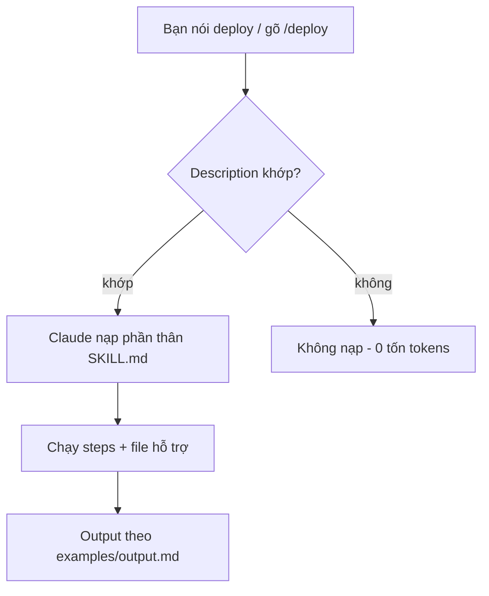

# 05 — Skills và custom commands cho quy trình lặp lại

> **Bài này cho ai:** bạn có việc lặp lại hằng tháng (deploy, review PR, thêm bảng, ship) và muốn gói lại thành 1 lệnh, thay vì dán prompt dài mỗi lần.
> **Cần gì trước:** đã cài và đăng nhập Claude Code ([01-cai-dat-va-xac-thuc.md](./01-cai-dat-va-xac-thuc.md)); nên đọc [04-slash-commands-toan-tap.md](./04-slash-commands-toan-tap.md) trước để phân biệt skill với lệnh built-in.
> **Đọc xong bạn làm được:**
> - Viết được 1 `SKILL.md` mới từ 0 theo 5 bước, và chọn đúng chế độ tự kích hoạt hay chỉ gọi tay.
> - Cài 3 mẫu hoàn chỉnh (`review-pr`, `add-table`, `ship`) vào repo thật, chạy được ngay.
> - Dùng được 2 kỹ thuật nâng cao: chèn kết quả lệnh thật vào prompt, và chạy skill trong worker riêng.
> - Tránh được 7 bẫy thường gặp, trả lời được 5 hiểu nhầm, và biết khi nào không nên viết skill.
> **Thời gian:** ~40 phút

## Thuật ngữ dùng trong bài này

Đọc bảng này trước khi vào mục 1 — mọi thuật ngữ Anh trong bài đều được giải thích ở đây.

| Thuật ngữ | Hiểu nôm na là gì | Ví dụ thấy ngay |
|---|---|---|
| Skill | Công thức nấu ăn cất sẵn trong repo, cần là lấy ra — không phải gõ lại prompt dài mỗi lần | `.claude/skills/deploy/SKILL.md`, gõ `/deploy staging` |
| `SKILL.md` | File duy nhất bắt buộc của 1 skill: khối cấu hình trên đầu + các bước thực hiện | frontmatter `name`/`description`, rồi mục `## Steps` |
| Frontmatter | Khối cấu hình đóng khung bằng `---` đặt ngay đầu file | `disable-model-invocation: true` |
| Custom command (lệnh tự viết) | Lệnh bạn tự thêm vào `/...`, gõ là chạy | `/ship`, `/review-pr` |
| Trigger (kích hoạt) | Lúc Claude tự nhận "việc này đúng skill kia" và mở skill ra | bạn nói "deploy" là skill deploy tự nạp |
| File hỗ trợ (support file) | Đồ nghề kèm theo skill: mẫu, script, ví dụ output | `templates/migration.sql`, `scripts/smoke.sh` |
| Fork | Chạy việc trong worker riêng, bộ nhớ riêng, không dính lịch sử chat chính | `context: fork` cho skill research |
| Bundled skill | Skill đi sẵn với Claude Code, không cần viết | `/code-review`, `/verify`, `/skill-doctor` |

## Mục lục

1. [Skill là gì và vì sao đáng viết](#1-skill-là-gì-và-vì-sao-đáng-viết)
2. [Giải phẫu SKILL.md](#2-giải-phẫu-skillmd)
3. [3 SKILL.md mẫu hoàn chỉnh](#3-3-skillmd-mẫu-hoàn-chỉnh-copy-paste)
4. [Kỹ thuật nâng cao](#4-kỹ-thuật-nâng-cao)
5. [Đi từng bước tạo skill từ 0 (5 bước)](#5-đi-từng-bước-tạo-skill-từ-0-5-bước)
6. [Bundled skills có sẵn](#6-bundled-skills-có-sẵn-dùng-ngay-khỏi-viết)
7. [Hiểu nhầm và bẫy thường gặp](#7-hiểu-nhầm-và-bẫy-thường-gặp)
8. [Bài tập thực hành](#8-bài-tập-thực-hành)
9. [Link chéo](#9-link-chéo)

---

## 1. Skill là gì và vì sao đáng viết

Mục tiêu section này: trả lời 2 câu — skill là gì (kèm bản copy-paste chạy được ngay), và vì sao với quy trình lặp lại thì skill rẻ hơn nhiều so với việc bạn dán lại checklist mỗi lần.

**Nôm na 1 câu:** Skill là *công thức nấu ăn dán trên tủ lạnh* — thay vì mỗi lần nấu lại gọi điện hỏi mẹ (paste checklist dài), bạn dán sẵn 1 tờ, ai vào bếp cũng nấu đúng vị.

**Ví dụ đời thường:** như preset máy giặt. Thay vì mỗi lần giặt phải nhớ "đồ trắng 40 độ + vắt 800 + 2 lần xả", bạn lưu preset `Giặt trắng`; lần sau chỉ bấm 1 nút — gõ `/deploy` hoặc nói "deploy" là Claude tự nạp skill.

**Ví dụ kỹ thuật copy-paste (khung tối thiểu chạy được):**

```bash
mkdir -p .claude/skills/deploy
cat > .claude/skills/deploy/SKILL.md <<'EOF'
---
name: deploy
description: Deploy staging/prod với checklist migrate + smoke test. Dùng khi user nói deploy/release/ship.
---
# Deploy
Nhận `$ARGUMENTS` (vd `/deploy staging`).
1. `git status --short` phải sạch.
2. Chạy `${CLAUDE_SKILL_DIR}/scripts/migrate.sh --dry-run $ARGUMENTS`
EOF
```

> **Ai dùng lúc nào:** dev/team có quy trình lặp lại ≥3 lần/tháng (deploy, review PR, thêm table, ship). Việc 1 lần thì prompt thường rẻ hơn.



**Giải thích từng bước:**
1. **Bạn nói từ khóa:** "deploy", "review PR", "thêm bảng" — tiếng tự nhiên, không cần nhớ cú pháp.
2. **So khớp description:** Claude so ngữ cảnh với `description` (câu đầu là trường hợp dùng chính). Khớp → nạp; không khớp → bỏ qua (rẻ).
3. **Nạp phần thân:** chỉ lúc này mới tốn tokens (các bước + tài liệu tham khảo). Khởi động trước đó chỉ ~100 tokens/skill.
4. **Chạy steps + file hỗ trợ:** checklist + templates/scripts/examples đã trỏ từ SKILL.md.
5. **Output chuẩn:** theo `examples/output.md` nên team đọc báo cáo nào cũng cùng định dạng.

Skill = **cách làm đóng gói**: 1 file `SKILL.md` (frontmatter YAML + markdown hướng dẫn) + file hỗ trợ tùy chọn (templates, examples, scripts, tài liệu tham khảo). Claude nạp skill khi liên quan, hoặc bạn gọi `/ten-skill`.

- Không tự chạy, không kết nối ra ngoài (khác MCP/hook/subagent).
- Khởi động chỉ tốn ~100 tokens (tên + description); phần thân chỉ nạp khi được gọi → rẻ.
- Theo **Agent Skills open standard** (Anthropic 12/2025): ~40 tool hỗ trợ (Codex CLI, Gemini CLI, Copilot...) — viết 1 lần, chạy nhiều nơi.

Ba vị trí đặt skill:

```text
~/.claude/skills/<ten>/SKILL.md        personal, mọi project
.claude/skills/<ten>/SKILL.md          project, commit git cho team
<plugin>/skills/<ten>/SKILL.md          theo plugin (namespaced /plugin:skill)
```

Lệnh `.claude/commands/*.md` kiểu cũ vẫn chạy, nhưng bạn nên chuyển sang skill để được kích hoạt theo ngữ cảnh.

### 1.1. Vì sao skill là nâng cấp lớn nhất?

Trước skill: mỗi lần deploy/review/migrate bạn paste lại checklist dài vào prompt (tốn tokens, dễ quên bước). Sau skill: checklist sống trong repo, Claude **tự nạp khi ngữ cảnh khớp** (vd bạn nói "deploy" → skill deploy tự nạp), hoặc bạn gọi `/deploy` tường minh.

So sánh với các thứ khác (đọc thêm [00 — Tổng quan](./00-tong-quan-claude-code.md)):

| Thứ | Tính chất | Khi nào skill thắng? |
|---|---|---|
| CLAUDE.md | Nạp luôn | Checklist chỉ cần lúc deploy → skill rẻ hơn |
| Hook | Ép thực thi cứng, không lệch | Skill dạy "làm thế nào", hook bắt "phải làm" — dùng cả 2 |
| Subagent | Worker cô lập | Skill chứa kiến thức để worker dùng; subagent là người dùng kiến thức |
| MCP | Kết nối ngoài | Skill chứa *cách dùng* MCP (schema, format) — cặp bài trùng |

**Kiểm tra nhanh:**

- Trong session mới gõ `/deploy` → skill hiện trong dropdown; gõ `/skills` → thấy `deploy` kèm description bạn vừa viết.
- Gõ 1 câu chẳng liên quan (vd "giải thích closure là gì") → skill không mở ra, không tốn tokens cho phần thân.
- Nói được với đồng nghiệp vì sao khởi động chỉ tốn ~100 tokens/skill mà phần thân vẫn đầy đủ khi cần.

---

## 2. Giải phẫu SKILL.md

Mục tiêu section này: mở 1 file `SKILL.md` ra là biết từng dòng cấu hình quyết định điều gì, và tự chọn được field nào cần cho skill của bạn.

```markdown
---
name: deploy              # plugin skill: segment cuối của /plugin:name; skill thường: label hiển thị (command lấy từ tên thư mục)
description: Deploy staging/prod với checklist migrate + smoke test. Dùng khi user nói deploy/release/ship.
user-invocable: false     # false = CHỈ Claude tự gọi khi ngữ cảnh khớp, user gõ /deploy không thấy (mặc định true)
disable-model-invocation: true   # true = chỉ chạy khi gõ tay /deploy (quy trình muốn kiểm soát)
argument-hint: <staging|prod>    # gợi ý hiện trong /skills menu + autocomplete
arguments: staging prod          # danh sách args hợp lệ (validate trước khi chạy)
allowed-tools: Bash, Read        # pre-approve tools trong lượt gọi skill (hết lượt tự thu hồi)
context: fork                     # fork = chạy trong subagent cô lập (không thấy history)
background: false                # false = chờ fork xong trong turn; bỏ qua = fork chạy background mặc định (từ v2.1.218)
agent: Explore                    # (kèm fork) chọn agent type thực thi
model: sonnet                     # ép model cho skill
paths: ["apps/api/**", "db/migrations/**"]  # glob giới hạn kích hoạt: chỉ tự kích hoạt khi task chạm các path này
---

# Deploy

Nhận `$ARGUMENTS` (vd `/deploy staging`).

## Steps
1. `git status --short` phải sạch, nếu không dừng và báo.
2. Chạy migration dry-run: `${CLAUDE_SKILL_DIR}/scripts/migrate.sh --dry-run $ARGUMENTS`
3. Deploy: `...`
4. Smoke test endpoints trong `references/endpoints.md`.
5. Ghi kết quả theo `examples/output.md`.

Tham khảo: `references/endpoints.md`, script `${CLAUDE_SKILL_DIR}/scripts/migrate.sh`.
Repo root: `${CLAUDE_PROJECT_DIR}`.
```

Biến dùng được trong content + `allowed-tools`: `${CLAUDE_SKILL_DIR}`, `${CLAUDE_PROJECT_DIR}`.
Nhận args: `$0`/`$1` (positional) hoặc `$ARGUMENTS[0]` — breaking từ v2.1.19 thay `$ARGUMENTS.0` cũ
(vd `/deploy staging` → `$0` = `staging`). `argument-hint` + `arguments` hiện gợi ý trong menu `/skills`.

Frontmatter đầy đủ: `name`, `description` (khuyến nghị — câu đầu là trường hợp dùng chính; danh sách hiển thị cắt ~1536 ký tự;
tổng mô tả mọi skill chiếm ~1% context — giữ mỗi description 1-2 câu, chi tiết dồn vào phần thân),
`when_to_use`, `user-invocable`, `disable-model-invocation`, `argument-hint`, `arguments`, `paths`,
`allowed-tools`, `context: fork`, `background: false`, `agent:`, `model:`,
`disableBundledSkills` (settings-level, tắt skills đi kèm theo máy), `skillOverrides` (settings-level, tắt tự kích hoạt cho skill của người khác), `hooks` (plugin skill: bỏ qua).

### 2.1. Từng field frontmatter (khi nào dùng)

Đọc bảng này khi chưa biết phải khai báo gì cho skill mới:

| Field | Ý nghĩa | Ví dụ |
|---|---|---|
| `name` | Tên skill (hiện trong list) | `review-pr` |
| `description` | **Quan trọng nhất** — câu đầu = khi nào kích hoạt. Claude so khớp ngữ cảnh qua đây | `"Review PR tìm bug + security. Dùng khi user nói review/pr..."` |
| `disable-model-invocation` | `true` = chỉ gọi tay `/ten` | Deploy/ship (muốn kiểm soát tay) |
| `user-invocable` | `false` = chỉ Claude tự gọi, user không gọi tay được | Skill nội bộ model dùng (ngược với disable-model-invocation) |
| `argument-hint` / `arguments` | Gợi ý + danh sách args hợp lệ, nhận qua `$0`/`$1`/`$ARGUMENTS[0]` (v2.1.19+, thay `$ARGUMENTS.0`) | `/deploy <staging\|prod>` |
| `paths` | Glob giới hạn kích hoạt (chỉ kích hoạt khi task chạm path) | `["apps/api/**"]` cho skill API |
| `allowed-tools` | Cho phép sẵn tools trong lượt gọi skill | `Bash, Read` cho skill deploy |
| `context: fork` | Chạy trong worker riêng (subagent cô lập) | Skill research ồn |
| `agent:` | (kèm fork) agent type thực thi | `Explore` cho read-only |
| `model:` | Ép model | `haiku` cho skill rẻ, `opus` cho review sâu |
| `when_to_use` | Bổ sung điều kiện kích hoạt | `"khi diff >10 files"` |
| `skillOverrides` | Tắt tự kích hoạt skill người khác (settings-level) | Team tắt skill ồn của plugin ngoài |
| `disableBundledSkills` | Tắt skills bundled theo máy (settings-level) | Máy share, chỉ giữ skills team |
| `background` | `false` = chờ fork xong trong turn (mặc định fork chạy background từ v2.1.218) | Skill research muốn kết quả ngay |

### 2.2. Ma trận ai được gọi: `disable-model-invocation` × `user-invocable`

Chốt nhanh 2 field này trước khi commit — chúng quyết định skill của bạn có gọi được hay không:

|  | `user-invocable: true` (mặc định) | `user-invocable: false` |
|---|---|---|
| `disable-model-invocation: false` (mặc định) | Cả 2 được gọi (tự kích hoạt + gọi tay) — mặc định mọi skill | Chỉ Claude gọi (skill nội bộ, user gõ `/ten` không thấy) |
| `disable-model-invocation: true` | Chỉ user gọi tay `/ten` (ship/deploy) | Không ai gọi được (khóa hẳn — chỉ mở khi sửa frontmatter) |

### 2.3. Arguments: cách viết đổi từ v2.1.19

- Trước v2.1.19: `$ARGUMENTS.0` (dot-index). Từ v2.1.19: `$ARGUMENTS[0]` + `$0`/`$1` positional.
- `argument-hint: <staging|prod>` hiện trong menu `/skills` + autocomplete; `arguments:` danh sách cho phép để kiểm tra trước khi chạy.
- Skill cũ dùng `$ARGUMENTS.0` → sửa thành `$0` hoặc `$ARGUMENTS[0]`, test lại 3 inputs (mục 5 bước 5).

Cấu trúc folder skill chuẩn (copy-paste khung):

```text
.claude/skills/review-pr/
  SKILL.md                  # bắt buộc: frontmatter + steps
  references/checklist.md   # tài liệu tham khảo (NHỚ trỏ từ SKILL.md)
  examples/output.md        # output mẫu (Claude bắt chước format)
  scripts/*.sh              # scripts máy làm tốt hơn (migrate, smoke test)
  templates/*.md            # templates (PR body, báo cáo...)
```

**Kiểm tra nhanh:**

- Dán khối frontmatter mẫu vào 1 skill thật, bỏ `context: fork` đi, gõ `/ten-skill` → chạy được mà không lỗi cú pháp.
- Đổi `$ARGUMENTS.0` còn lại trong skill cũ sang `$0`, chạy lại với 3 inputs khác nhau (`/deploy staging`, `/deploy prod`, `/deploy`) — cả 3 không báo thiếu biến.
- Gõ `/skills` → thấy `argument-hint` hiện ra đúng như khai báo.

---

## 3. 3 SKILL.md mẫu hoàn chỉnh (copy-paste)

Mục tiêu section này: có 3 skill chạy được ngay — 1 skill tự kích hoạt bằng model mạnh, 1 skill có script kèm, 1 skill chỉ gọi tay.

### 3.1. Mẫu 1 — `review-pr` (tự kích hoạt, dùng Opus)

```markdown
---
name: review-pr
description: Review pull request tìm bug, security, test thiếu. Dùng khi user nói review PR, review diff, review code, hoặc mở PR mới.
model: opus
allowed-tools: Read, Grep, Glob, Bash
---

# Review PR

Nhận `$ARGUMENTS` (PR number, branch, hoặc để trống = diff hiện tại).

## Steps

1. Xác định phạm vi:
   - Nếu `$ARGUMENTS` là số (vd `123`): `gh pr diff 123`
   - Nếu là branch: `git diff main...$ARGUMENTS`
   - Nếu trống: `git diff main...HEAD`
2. Đọc từng file đổi (dùng Read, không đoán qua diff 1 dòng).
3. Check theo `references/checklist.md` (bug, security, test, perf, style).
4. Chạy focused tests liên quan (nếu repo có test): ghi pass/fail vào báo cáo.
5. Xuất báo cáo theo `examples/output.md`. Tối đa 10 findings, xếp theo severity.

## Rules
- Chỉ đánh dấu lỗi thực sự, không thổi phồng ("nên dùng pattern X đẹp hơn" không phải finding).
- Mỗi finding: `[SEVERITY] file:line — mô tả — gợi ý fix cụ thể`.
- Không sửa code trong skill này (chỉ đọc). Muốn cho phép tự sửa: nói rõ ở prompt.
```

```markdown
# File: .claude/skills/review-pr/references/checklist.md
# (tạo kèm — NHỚ trỏ từ SKILL.md như trên)

## Bug
- [ ] Null/undefined paths (payload thiếu field?)
- [ ] Off-by-one, race condition, unhandled promise rejection
- [ ] Migration thiếu rollback / seed thiếu

## Security
- [ ] Injection (SQL/command), XSS, authZ thiếu, secret hardcode, SSRF

## Test
- [ ] Mỗi logic mới có test? Edge cases (empty, null, large, unicode)?
- [ ] Mock ở boundary, không mock logic đang test

## Perf
- [ ] N+1 query, đọc file trong loop, bundle size tăng vô lý
```

```markdown
# File: .claude/skills/review-pr/examples/output.md

## Review: PR #123 — thêm rate-limit login

### Findings
- [HIGH] apps/api/src/routes/login.ts:42 — limiter áp dụng sau auth check, brute-force vẫn qua. Fix: `app.use("/login", limiter)` trước route.
- [MED] apps/api/src/routes/login.test.ts:15 — thiếu test 429 case. Thêm: gửi 6 requests, expect 429 ở request 6.
- [LOW] apps/api/src/middleware/limiter.ts:8 — magic number `max: 5`. Đưa vào config/env.

### Tests
- `pnpm --filter @acme/api test src/routes/login.test.ts` → PASS (12/12)

### Verdict
- [ ] Approve · [x] Approve with nits · [ ] Request changes
```

### 3.2. Mẫu 2 — `add-table` (quy trình migrate DB)

```markdown
---
name: add-table
description: Thêm table/column mới với migration + model + seed. Dùng khi user nói thêm bảng, thêm cột, migrate DB, schema change.
allowed-tools: Read, Write, Edit, Bash
---

# Add Table

Nhận `$ARGUMENTS` (vd `/add-table users add column last_login_at timestamptz`).

## Steps

1. Đọc schema hiện tại: `ls db/migrations/ | tail -5` + Read migration mới nhất (học naming).
2. Tạo migration mới: tên `YYYYMMDD_<mo-ta>.sql` (giờ UTC, vd `20260915_add_last_login_at.sql`).
   Template trong `templates/migration.sql`. 1 migration/PR.
3. Viết SQL: `ALTER TABLE`/`CREATE TABLE` + rollback note trong header comment.
4. Update model (Prisma/Drizzle/SQLAlchemy — xem `references/orm.md` cho đúng ORM repo).
5. Update seed (`prisma/seed.ts`) nếu table mới cần data mẫu.
6. Chạy: migration local → focused test → ghi kết quả theo `examples/output.md`.

## Rules
- NEVER sửa migration đã merge (viết migration mới).
- ALWAYS chạy migration local pass trước khi báo xong.
- Magic default (now(), uuid) phải ghi rõ trong migration header.

## Dynamic context
- Branch hiện tại: !`git branch --show-current`
- Migrations gần nhất: !`ls -t db/migrations/ | head -5`
```

```sql
-- File: .claude/skills/add-table/templates/migration.sql
-- Migration: <YYYYMMDD>_<mo-ta>
-- Rollback: <mô tả cách rollback, vd DROP COLUMN ...>
-- Author: <tên> — Verified local: <lệnh đã chạy>

ALTER TABLE <table> ADD COLUMN <col> <type> <constraints>;
```

### 3.3. Mẫu 3 — `ship` (chỉ gọi tay, nhiều cổng kiểm tra)

```markdown
---
name: ship
description: Ship code an toàn: merge base, test, review diff, bump version, changelog, commit, push, mở PR.
disable-model-invocation: true
allowed-tools: Read, Bash
---

# Ship (chỉ chạy khi gõ tay /ship — không tự kích hoạt)

Nhận `$ARGUMENTS` (vd `/ship feat/login` hoặc trống = branch hiện tại: !`git branch --show-current`).

## Gates (dừng ngay khi gate fail, báo user, không cố đi tiếp)

1. **Clean tree**: `git status --short` phải trống. Có changes → dừng, liệt kê files chưa commit.
2. **Sync base**: `git fetch origin && git rebase origin/main`. Conflict → dừng, hướng dẫn resolve.
3. **Test**: chạy focused test (lệnh từ CLAUDE.md). Fail → dừng, in failures.
4. **Review**: đọc `git diff main...HEAD`, self-review theo `references/ship-checklist.md`.
5. **Version**: bump version (package.json/pyproject) + ghi CHANGELOG entry (template `templates/changelog.md`).
6. **Commit + push + PR**: conventional commits message, push branch, `gh pr create --fill`. KHÔNG merge.

## Output
- Ghi theo `examples/output.md`: branch, commits, tests (pass/fail + lệnh), PR URL.
```

Cài cả 3 skills một lần:

```bash
# Cài 3 skills trên (copy-paste):
mkdir -p .claude/skills/{review-pr,add-table,ship}/{references,examples,templates,scripts}
# Rồi tạo từng SKILL.md + files kèm theo nội dung trên.
```

**Kiểm tra nhanh:**

- Trong session gõ `/review-pr`, `/add-table`, `/ship` → cả 3 hiện trong dropdown (gõ `/skills` để soát lại).
- `/ship` phải **không** tự chạy khi bạn nói "ship code lên nhé" — chỉ gõ tay `/ship` mới chạy (đúng `disable-model-invocation: true`).
- Chạy `/review-pr` trên 1 diff thật → báo cáo ra đúng định dạng `examples/output.md`, tối đa 10 findings, mỗi finding có `file:line`.

---

## 4. Kỹ thuật nâng cao

Mục tiêu section này: 4 kỹ thuật khiến skill của bạn sống được — chèn dữ liệu thật, chạy tách worker, nối file hỗ trợ, và giới hạn quyền.

### 4.1. Chèn kết quả lệnh thật vào prompt

Dòng `` !`command` `` trong SKILL.md — Claude chạy shell trước, thay output thật vào prompt:

```markdown
# Ví dụ trong SKILL.md:
Branch hiện tại: !`git branch --show-current`
Diff stat: !`git diff --stat main...HEAD`
Migrations gần nhất: !`ls -t db/migrations/ | head -5`
Endpoint list: !`cat docs/endpoints.md 2>/dev/null | head -30`
```

- Dùng khi: thông tin thay đổi mỗi lần gọi (branch, diff, migrations mới).
- Không dùng khi: command chậm (>2s) hoặc cần secrets (output inject vào context, log được).

### 4.2. Fork skill (`context: fork`)

> **Lưu ý version:** từ v2.1.218 fork skill chạy **background mặc định** (không block turn). Muốn chờ kết quả
> trong turn: thêm `background: false` vào frontmatter. Kill/check: `/tasks` + `Ctrl+X Ctrl+K ×2`.

```markdown
---
name: deep-research
description: Nghiên cứu codebase rộng, trả tóm tắt. Dùng khi user nói research/tìm hiểu module X.
context: fork
agent: Explore
model: sonnet
---
# Skill chạy trong worker riêng (không thấy lịch sử luồng chính).
# Lưu ý agent Explore/Plan bỏ qua CLAUDE.md + git status để giữ context nhỏ.
# Ngược lại: subagent tự viết có thể nạp sẵn skill làm tài liệu tham khảo (skills: [...] trong agent frontmatter).
```

| Khi nào fork? | Khi nào KHÔNG? |
|---|---|
| Research ồn (đọc 50 files, trả 10 dòng) | Task cần full history (sửa tiếp việc đang làm) |
| Muốn cô lập thất bại (research sai không làm bẩn main) | Task 1-2 bước (chi phí fork không đáng) |

### 4.3. File hỗ trợ (templates/examples/scripts/references)

- **Quy tắc**: nhớ **trỏ từ SKILL.md** kẻo Claude không nạp (SKILL.md là mục lục, các file còn lại chỉ nạp khi cần).
- `${CLAUDE_SKILL_DIR}` = folder skill; `${CLAUDE_PROJECT_DIR}` = repo root. Dùng trong content + allowed-tools/scripts.

```bash
# Ví dụ script trong skill (máy làm tốt hơn người):
# .claude/skills/deploy/scripts/smoke.sh
#!/bin/bash
set -euo pipefail
ENV="${1:-staging}"
BASE_URL="$(grep -E "^${ENV}_URL" .env.deploy | cut -d= -f2)"
curl -fsS "$BASE_URL/health" | jq -e '.status == "ok"'
echo "SMOKE PASS: $ENV ($BASE_URL)"
```

### 4.4. Quyền & giới hạn

- **Quyền**: `allowed-tools` chỉ nới trong lượt gọi; baseline vẫn theo permission settings ([10 — Permissions](./10-permissions-modes-availability.md)).
- Plugin subagents không hỗ trợ `hooks`/`mcpServers`/`permissionMode` (copy ra `.claude/agents/` nếu cần).
- Plugin skill có `hooks` frontmatter sẽ bị bỏ qua — đừng trông vào đó.

### 4.5. Tìm skill trong monorepo, ngân sách cho mô tả, menu `/skills`

- **Tìm skill lồng trong monorepo**: `.claude/skills/` ở repo root + các thư mục cha tới repo root đều được quét;
  `.claude/skills/` nằm sâu trong monorepo chỉ nạp khi task chạm path đó (kèm `paths` glob ở mục 2).
- **Ngân sách ~1% context cho mô tả**: khởi động chỉ nạp `name` + `description` của mọi skill (~100 tokens/skill);
  tổng mô tả giữ ~1% context — mô tả dài hoặc nhiều skill là bạn mất chỗ cho phần cài đặt. Giữ 1-2 câu, chi tiết vào phần thân/file hỗ trợ.
- **Menu `/skills` + ghi đè**: gõ `/skills` xem danh sách, `argument-hint` hiện gợi ý args; `skillOverrides`
  (tắt tự kích hoạt skill của người khác) và `disableBundledSkills` (tắt skills đi kèm theo máy) đặt ở settings-level.

**Kiểm tra nhanh:**

- Thêm 1 dòng `` Hiển thị: !`git branch --show-current` `` vào skill, chạy `/ten-skill` → Claude nhắc đúng tên branch hiện tại của bạn.
- Gõ `/tasks` sau 1 fork skill → thấy task nền; tắt bằng `Ctrl+X Ctrl+K ×2` → biến mất. Đổi `background: false` thì chạy xong ngay trong turn.
- Chạy tay `bash .claude/skills/deploy/scripts/smoke.sh staging` (repo có `.env.deploy` với `${ENV}_URL`) → ra `SMOKE PASS: staging (...)` — script dùng độc lập vẫn được.

---

## 5. Đi từng bước tạo skill từ 0 (5 bước)

Mục tiêu section này: 40 phút từ "chưa có skill nào" tới 1 skill tự viết, test 3 lần, sẵn sàng commit cho team.

**Bước 1 — Đặt tên + description (5 phút):**
Tên = động từ + đối tượng (`deploy`, `review-pr`, `add-table`). Description mở đầu bằng **khi nào dùng**.

```bash
mkdir -p .claude/skills/my-skill
cat > .claude/skills/my-skill/SKILL.md <<'EOF'
---
name: my-skill
description: Làm X cho Y. Dùng khi user nói <từ khóa 1>, <từ khóa 2>.
---
# My Skill
...
EOF
```

**Bước 2 — Viết steps checklist (10 phút):**
Mỗi step có lệnh/check cụ thể + output mẫu. Dùng 3 mẫu mục 3 làm khung.

**Bước 3 — Chọn tự kích hoạt hay chỉ gọi tay (2 phút):**
Mặc định để Claude tự kích hoạt; chỉ thêm `disable-model-invocation: true` với quy trình muốn gọi tay
(deploy/ship — muốn kiểm soát thời điểm).

**Bước 4 — Thêm example + script (10 phút):**
Thêm 1 example input/output + 1 script nếu có bước máy làm tốt hơn người (smoke test, migrate dry-run).

**Bước 5 — Test 3 lần (10 phút):**
Gọi `/ten-skill` 3 lần với inputs khác nhau, sửa chỗ Claude hay hỏi lại thành nội dung rõ ràng.
Chỗ nào Claude hỏi 2 lần giống nhau → viết vào SKILL.md.

Ví dụ team: `/issues` (biến ý tưởng thành issue chuẩn), `/plan` (sinh kế hoạch triển khai),
`/review` (review nhiều lớp), `/ship` (merge base → test → review diff → bump version → changelog → commit → push → PR).

Mẫu copy-paste: xem `templates/.claude/skills/deploy/SKILL.md` trong repo này.

**Kiểm tra nhanh:**

- Skill mới hiện trong `/skills`, và `/ten-skill` chạy trọn vẹn 3 lần với 3 inputs khác nhau không lần nào hỏi lại câu đã viết trong file.
- Gõ đúng từ khóa trong description (bước 1) → skill tự mở ra; gõ từ khóa lạ → không mở.
- `git status` chỉ có file skill mới + file hỗ trợ, không lọt file nào ngoài phạm vi.

---

## 6. Bundled skills có sẵn (dùng ngay, khỏi viết)

Mục tiêu section này: biết có sẵn những skill nào của Claude Code để khỏi viết lại, và cách tắt skill ế.

> Tắt skills đi kèm theo máy: `disableBundledSkills` ở settings. Xem/gọi: menu `/skills`
> (hiện `argument-hint`, gọi tay hoặc để Claude tự kích hoạt theo `description` + `paths`).

`/doctor` (khám setup), `/code-review` + `/ultrareview` (review), `/batch` (chia việc lớn),
`/debug` (tìm root cause), `/loop` (lặp), `/claude-api [migrate|managed-agents-onboard]` (tham khảo Claude API
Python/TS/Java/Go/Ruby/C#/PHP/cURL; tự nạp khi code import anthropic SDK; `migrate` nâng model version),
`/verify` (build+chạy app thật để xác nhận), `/simplify`, `/insights`...

**Kiểm tra nhanh:** gõ `/doctor`, `/batch`, `/verify` trong session → hiện dropdown; gõ `/skills` → thấy danh sách bundled kèm description, và `disableBundledSkills` trong settings tắt được 1 skill bất kỳ (restart session là mất).

---

## 7. Hiểu nhầm và bẫy thường gặp

Mục tiêu section này: 5 lầm tưởng + 7 bẫy khiến skill không bao giờ chạy hoặc làm nổ context — đối chiếu trước khi kết luận "skill hỏng".

### 7.1. Hiểu nhầm thường gặp

| Hiểu nhầm | Sự thật | Ai cần nhớ |
|---|---|---|
| "Skill tự chạy như cron" | Skill bị động — phải gọi tay `/ten` hoặc Claude tự kích hoạt khi ngữ cảnh khớp. Muốn chạy lịch → Routines `/schedule` (bài 12). | Người mới |
| "Nhét hết 300 dòng vào SKILL.md cho chắc" | SKILL.md là mục lục (<100 dòng); checklist/template/script ra file riêng + trỏ từ SKILL.md, nếu không Claude không nạp hết. | Người viết skill |
| "`allowed-tools: Bash` là cho phép mọi lệnh" | Chỉ nới trong lượt gọi skill, baseline vẫn theo permission settings (bài 10). Muốn chặn thật → hook + deny rules. | Team lead |
| "Skill thay MCP/hook được" | Skill dạy *cách làm*, MCP cho *tay vươn ra*, hook là *luật bắt tuân thủ*. Thiếu hook là rule vẫn bị quên. | Mọi dev |
| "Description viết dài cho chi tiết" | Tổng mô tả mọi skill chiếm ~1% context. Description 1-2 câu mở đầu bằng "Dùng khi...", chi tiết dồn vào phần thân. | Người viết skill |

### 7.2. Bẫy thường gặp + cách fix

| Bẫy | Vì sao | Cách fix |
|---|---|---|
| Description mơ hồ → skill không bao giờ kích hoạt | Claude so khớp qua description | Mở đầu bằng "Dùng khi user nói X, Y, Z" + từ khóa thật |
| SKILL.md 300 dòng, nhét hết vào 1 file | Không tách file hỗ trợ | Steps chính <100 dòng; checklist/template/script ra file riêng + trỏ từ SKILL.md |
| Quên trỏ file hỗ trợ → Claude không nạp | Chỉ nạp khi được nhắc tên | Mọi file kèm phải được nhắc tên trong SKILL.md |
| `disable-model-invocation: true` cho skill nên tự kích hoạt | Hiểu nhầm "kiểm soát" | Chỉ gọi tay cho deploy/ship; còn lại để tự kích hoạt |
| `allowed-tools` quá rộng (`Bash` không giới hạn phạm vi) | Copy mẫu không sửa | Giới hạn hẹp (`Bash(pnpm test:*)`), baseline vẫn theo settings |
| Test 1 lần rồi chia sẻ cho team | Skill giòn với input lạ | Test 3 inputs khác nhau trước khi commit |
| Nhét secrets vào skill | Tiện tay | Secrets qua env (bài 08), không vào SKILL.md |

### 7.3. Checklist skill khỏe

- [ ] Tên = động từ + đối tượng, description mở đầu bằng khi nào dùng.
- [ ] Steps <100 dòng, mỗi step có lệnh/check cụ thể.
- [ ] Có 1 example output mẫu.
- [ ] File hỗ trợ được trỏ từ SKILL.md.
- [ ] Test 3 lần với inputs khác nhau.
- [ ] `disable-model-invocation` đúng (tự kích hoạt hay gọi tay).
- [ ] Không secrets trong skill.

**Kiểm tra nhanh:** đối chiếu 7 dòng checklist với skill bạn vừa viết — dòng nào chưa tick được thì quay lại mục tương ứng (2.1, 3, 4.3). Skill "ế" (viết xong không ai gọi) vẫn chiếm chỗ trong `/skills` — dọn bằng `/skill-doctor` (cần ≥2.1.252).

---

## 8. Bài tập thực hành

Mục tiêu section này: biến 3 mẫu trong bài thành skill thật của team bạn, rồi đo xem có đáng không.

**Bài 1 (20 phút):** Cài mẫu `review-pr` (mục 3.1) vào 1 repo thật. Chạy `/review-pr` lên diff
hiện tại. So sánh findings với review tay của bạn — skill bỏ sót gì? Bổ sung checklist.

**Bài 2 (20 phút):** Viết skill `add-table` cho ORM team bạn (Prisma/Drizzle/SQLAlchemy).
Test bằng cách thêm 1 column thật lên DB dev. Kiểm tra migration + rollback note.

**Bài 3 (20 phút):** Viết skill `ship` chỉ gọi tay cho repo bạn (dùng mẫu 3.3). Chạy `/ship`
lên branch test. Ghi lại gate nào fail đầu tiên — có đúng là dừng thay vì cố đi tiếp?

**Bài 4 (15 phút, nâng cao):** Thêm chèn dữ liệu thật (`` !`git branch --show-current` ``)
vào 1 skill có sẵn. Thêm `context: fork` vào 1 skill nghiên cứu, so sánh context luồng chính trước/sau.

**Kiểm tra nhanh:** sau 4 bài bạn có ≥2 skill mới trong `/skills`; bài 1 cho ra ít nhất 1 mục checklist bổ sung mà review tay bắt được còn skill bỏ sót; bài 3 dừng đúng ở gate fail đầu tiên thay vì chạy xuyên.

---

## 9. Link chéo

Mục tiêu: mở đúng bài tiếp theo khi mục này trả lời chưa đủ chỗ.

- **[00 — Tổng quan](./00-tong-quan-claude-code.md)**: skill vs CLAUDE.md/hook/subagent/MCP (bảng chọn + cách tính token).
- **[03 — CLAUDE.md](./03-claude-md-memory-rules.md)**: tách checklist dài khỏi CLAUDE.md thành skill; AGENTS.md dùng chéo công cụ.
- **[04 — Slash commands](./04-slash-commands-toan-tap.md)**: custom commands đã gộp vào skills; `$ARGUMENTS`; `/skills`.
- **[06 — Subagents](./06-subagents-agent-teams-parallel.md)**: fork skill, subagent nạp sẵn skill, Explore/Plan bỏ qua CLAUDE.md.
- **[07 — Hooks](./07-hooks-tu-dong-hoa.md)**: skill = lời khuyên, hook = luật; quy tắc bị quên 2 lần → nâng thành hook.
- **[08 — MCP](./08-mcp-ket-noi-cong-cu-ngoai.md)**: skill chứa *cách dùng* MCP (schema, format); cặp skill+MCP.
- **[09 — Plugins](./09-plugins-marketplaces.md)**: đóng gói skills thành plugin để chia sẻ cho team (namespaced `/plugin:skill`).
- **[10 — Permissions](./10-permissions-modes-availability.md)**: `allowed-tools` vs permission settings baseline.
- **[12 — SDK/CI](./12-agent-sdk-ci-cd-automation.md)**: routines `/schedule` + skill tái dùng cho jobs định kỳ.
