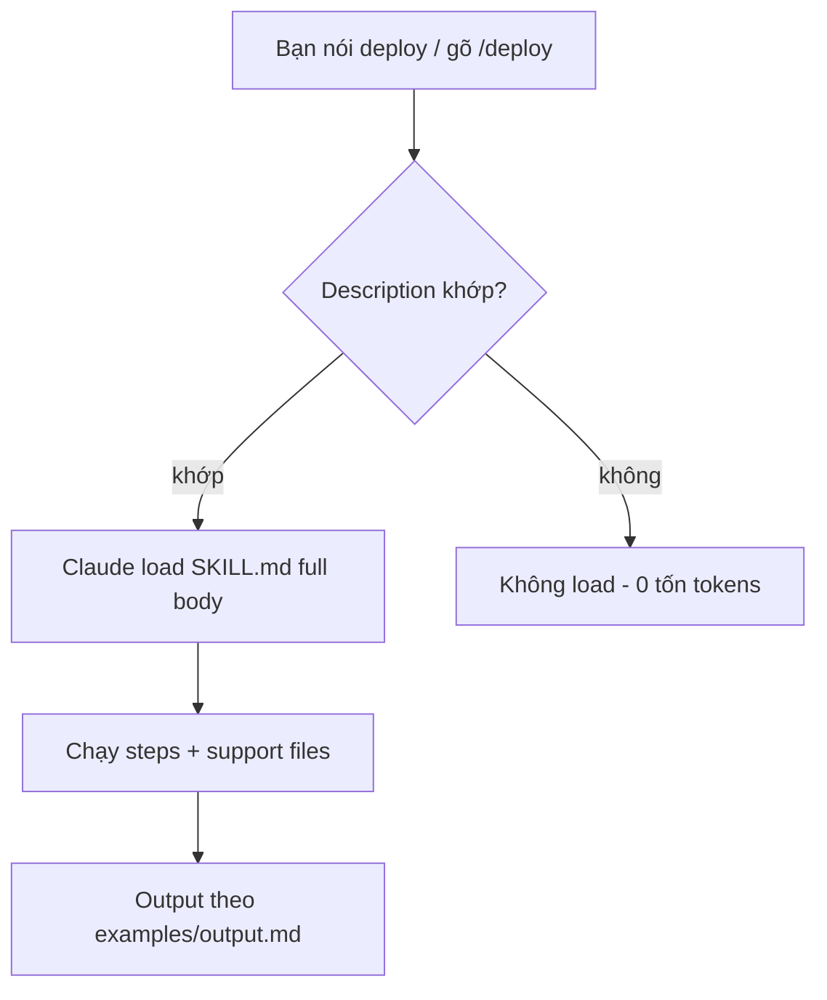

# 05 — Skills & Custom Commands (Nâng Cấp Lớn Nhất Cho Workflow Lặp Lại)

> Bài 05 của series. Đọc xong bạn viết được SKILL.md chuẩn, có 3 mẫu hoàn chỉnh
> (review-pr, add-table, ship), và dùng được fork/dynamic-injection patterns.
> Thời gian: ~40 phút.

## Mục lục

1. [Skill là gì — why, không chỉ what](#1-skill-là-gì-định-nghĩa-sạch)
2. [Giải phẫu SKILL.md](#2-giải-phẫu-skillmd)
3. [3 SKILL.md mẫu hoàn chỉnh](#3-3-skillmd-mẫu-hoàn-chỉnh-copy-paste)
4. [Patterns nâng cao](#4-patterns-nâng-cao-fork-dynamic-injection-support-files)
5. [Walkthrough tạo skill từ 0](#5-walkthrough-tạo-skill-từ-0-5-bước)
6. [Bundled skills + pitfalls + bài tập](#6-bundled-skills-có-sẵn-dùng-ngay-khỏi-viết)
7. [Link chéo](#7-link-chéo)

---

## 1. Skill là gì (định nghĩa sạch)

**Nôm na 1 câu:** Skill là *công thức nấu ăn dán trên tủ lạnh* — thay vì mỗi lần nấu lại gọi điện hỏi mẹ (paste checklist dài), bạn dán sẵn 1 tờ, ai vào bếp cũng nấu đúng vị.

**Analogie đời thường:** như preset máy giặt: thay vì mỗi lần giặt phải nhớ "đồ trắng 40 độ + vắt 800 + 2 lần xả", bạn lưu preset `Giặt trắng`. Lần sau chỉ bấm 1 nút (gõ `/deploy` hoặc nói "deploy" là Claude tự load).

**Ví dụ kỹ thuật copy-paste (khung tối thiểu chạy được):**

```bash
mkdir -p .claude/skills/deploy
cat > .claude/skills/deploy/SKILL.md <<'EOF'
---
name: deploy
description: Deploy staging/prod với checklist migrate + smoke test. Dùng khi user nói deploy/release/ship.
---
# Deploy
Nhận `$ARGUMENTS` (vd `/deploy staging`).
1. `git status --short` phải sạch.
2. Chạy `${CLAUDE_SKILL_DIR}/scripts/migrate.sh --dry-run $ARGUMENTS`
EOF
# Verify: mở session gõ `/deploy` → phải hiện trong dropdown.
# Kỳ vọng: startup chỉ tốn ~100 tokens (tên + description); body full chỉ load khi trigger.
```

> **Ai dùng lúc nào:** dev/team có workflow lặp lại ≥3 lần/tháng (deploy, review PR, thêm table, ship). Việc 1 lần thì prompt thường rẻ hơn.



**Giải thích từng bước:**
1. **Bạn nói từ khóa:** "deploy", "review PR", "thêm bảng" — tiếng tự nhiên, không cần nhớ cú pháp.
2. **Match description:** Claude so ngữ cảnh với `description` (câu đầu là use-case chính). Khớp → load; không khớp → bỏ qua (rẻ).
3. **Load full body:** chỉ lúc này mới tốn tokens (steps + references). Startup trước đó chỉ ~100 tokens/skill.
4. **Chạy steps + support files:** checklist + templates/scripts/examples đã trỏ từ SKILL.md.
5. **Output chuẩn:** theo `examples/output.md` nên team đọc report nào cũng cùng format.

Skill = **know-how đóng gói**: 1 file `SKILL.md` (frontmatter YAML + markdown hướng dẫn) + file hỗ trợ
tùy chọn (templates, examples, scripts, reference docs). Claude load khi liên quan, hoặc bạn gọi `/ten-skill`.

- Không tự chạy, không kết nối ra ngoài (khác MCP/hook/subagent).
- Startup chỉ tốn ~100 tokens (tên + description); full body chỉ load khi trigger → rẻ.
- Theo **Agent Skills open standard** (Anthropic 12/2025): ~40 tools hỗ trợ (Codex CLI, Gemini CLI, Copilot...) — viết 1 lần, chạy nhiều nơi.

Vị trí:

```
~/.claude/skills/<ten>/SKILL.md        personal, mọi project
.claude/skills/<ten>/SKILL.md          project, commit git cho team
<plugin>/skills/<ten>/SKILL.md          theo plugin (namespaced /plugin:skill)
```

`.claude/commands/*.md` cũ vẫn chạy nhưng nên migrate sang skills.

### 1.1. Vì sao skill là nâng cấp lớn nhất? (why)

Trước skill: mỗi lần deploy/review/migrate bạn paste lại checklist dài vào prompt (tốn tokens,
dễ quên bước). Sau skill: checklist sống trong repo, Claude **tự load khi ngữ cảnh khớp**
(vd bạn nói "deploy" → skill deploy load), hoặc bạn gọi `/deploy` tường minh.

So sánh với các thứ khác (bài 00):

| Thứ | Tính chất | Khi nào skill thắng? |
|---|---|---|
| CLAUDE.md | Load luôn | Checklist chỉ cần lúc deploy → skill rẻ hơn |
| Hook | Enforce deterministic | Skill dạy "làm thế nào", hook bắt "phải làm" — dùng cả 2 |
| Subagent | Worker cô lập | Skill là knowledge worker dùng; subagent là người dùng knowledge |
| MCP | Kết nối ngoài | Skill chứa *cách dùng* MCP (schema, format) — cặp bài trùng |

---

## 2. Giải phẫu SKILL.md

```markdown
---
name: deploy              # plugin skill: segment cuối của /plugin:name; skill thường: label hiển thị (command lấy từ tên thư mục)
description: Deploy staging/prod với checklist migrate + smoke test. Dùng khi user nói deploy/release/ship.
user-invocable: false     # false = CHỈ Claude tự gọi khi ngữ cảnh khớp, user gõ /deploy không thấy (mặc định true)
disable-model-invocation: true   # true = chỉ chạy khi gõ tay /deploy (workflow muốn kiểm soát)
argument-hint: <staging|prod>    # gợi ý hiện trong /skills menu + autocomplete
arguments: staging prod          # danh sách args hợp lệ (validate trước khi chạy)
allowed-tools: Bash, Read        # pre-approve tools trong lượt gọi skill (hết lượt tự thu hồi)
context: fork                     # fork = chạy trong subagent cô lập (không thấy history)
background: false                # false = chờ fork xong trong turn; bỏ qua = fork chạy background mặc định (từ v2.1.218)
agent: Explore                    # (kèm fork) chọn agent type thực thi
model: sonnet                     # ép model cho skill
paths: ["apps/api/**", "db/migrations/**"]  # glob giới hạn kích hoạt: chỉ auto-trigger khi task chạm các path này
---

# Deploy

Nhận `$ARGUMENTS` (vd `/deploy staging`).

## Steps
1. `git status --short` phải sạch, nếu không dừng và báo.
2. Chạy migration dry-run: `${CLAUDE_SKILL_DIR}/scripts/migrate.sh --dry-run $ARGUMENTS`
3. Deploy: `...` 4. Smoke test endpoints trong `references/endpoints.md`.
5. Ghi kết quả theo `examples/output.md`.

Tham khảo: `references/endpoints.md`, script `${CLAUDE_SKILL_DIR}/scripts/migrate.sh`.
Repo root: `${CLAUDE_PROJECT_DIR}`.
```

Biến dùng được trong content + `allowed-tools`: `${CLAUDE_SKILL_DIR}`, `${CLAUDE_PROJECT_DIR}`.
Nhận args: `$0`/`$1` (positional) hoặc `$ARGUMENTS[0]` — breaking từ v2.1.19 thay `$ARGUMENTS.0` cũ
(vd `/deploy staging` → `$0` = `staging`). `argument-hint` + `arguments` hiện gợi ý trong `/skills` menu.

Frontmatter đầy đủ: `name`, `description` (khuyến nghị — câu đầu là use-case chính; listing truncate ~1536 ký tự;
tổng budget descriptions ~1% context — giữ mỗi description 1-2 câu, chi tiết dồn vào body),
`when_to_use`, `user-invocable`, `disable-model-invocation`, `argument-hint`, `arguments`, `paths`,
`allowed-tools`, `context: fork`, `background: false`, `agent:`, `model:`,
`disableBundledSkills` (settings-level, tắt skills bundled theo máy), `skillOverrides` (settings-level, tắt auto cho skill của người khác), `hooks` (plugin skill: bỏ qua).

### 2.1. Từng field frontmatter (khi nào dùng)

| Field | Ý nghĩa | Ví dụ |
|---|---|---|
| `name` | Tên skill (hiện trong list) | `review-pr` |
| `description` | **Quan trọng nhất** — câu đầu = khi nào trigger. Claude match ngữ cảnh qua đây | `"Review PR tìm bug + security. Dùng khi user nói review/pr..."` |
| `disable-model-invocation` | `true` = chỉ gọi tay `/ten` | Deploy/ship (muốn kiểm soát tay) |
| `user-invocable` | `false` = chỉ Claude tự gọi, user không gọi tay được | Skill nội bộ model dùng (ngược với disable-model-invocation) |
| `argument-hint` / `arguments` | Gợi ý + whitelist args, nhận qua `$0`/`$1`/`$ARGUMENTS[0]` (v2.1.19+, thay `$ARGUMENTS.0`) | `/deploy <staging\|prod>` |
| `paths` | Glob giới hạn kích hoạt (chỉ trigger khi task chạm path) | `["apps/api/**"]` cho skill API |
| `allowed-tools` | Pre-approve tools trong lượt gọi | `Bash, Read` cho skill deploy |
| `context: fork` | Chạy trong subagent cô lập | Skill research ồn |
| `agent:` | (kèm fork) agent type thực thi | `Explore` cho read-only |
| `model:` | Ép model | `haiku` cho skill rẻ, `opus` cho review sâu |
| `when_to_use` | Bổ sung trigger conditions | `"khi diff >10 files"` |
| `skillOverrides` | Tắt auto skill người khác (settings-level) | Team tắt skill ồn của plugin ngoài |
| `disableBundledSkills` | Tắt skills bundled theo máy (settings-level) | Máy share, chỉ giữ skills team |
| `background` | `false` = chờ fork xong trong turn (mặc định fork chạy background từ v2.1.218) | Skill research muốn kết quả ngay |

### 2.2. Ma trận ai được gọi: `disable-model-invocation` × `user-invocable`

|  | `user-invocable: true` (mặc định) | `user-invocable: false` |
|---|---|---|
| `disable-model-invocation: false` (mặc định) | Cả 2 được gọi (auto + tay) — mặc định mọi skill | Chỉ Claude gọi (skill nội bộ, user gõ `/ten` không thấy) |
| `disable-model-invocation: true` | Chỉ user gọi tay `/ten` (ship/deploy) | Không ai gọi được (khóa hẳn — chỉ mở khi sửa frontmatter) |

### 2.3. Arguments mới (breaking v2.1.19)

- Trước v2.1.19: `$ARGUMENTS.0` (dot-index). Từ v2.1.19: `$ARGUMENTS[0]` + `$0`/`$1` positional.
- `argument-hint: <staging|prod>` hiện trong `/skills` menu + autocomplete; `arguments:` whitelist để validate.
- Skill cũ dùng `$ARGUMENTS.0` → sửa thành `$0` hoặc `$ARGUMENTS[0]`, test lại 3 inputs (mục 5 bước 5).

```bash
# Cấu trúc folder skill chuẩn (copy-paste khung):
.claude/skills/review-pr/
  SKILL.md                  # bắt buộc: frontmatter + steps
  references/checklist.md   # tài liệu tham khảo (NHỚ trỏ từ SKILL.md)
  examples/output.md        # output mẫu (Claude bắt chước format)
  scripts/*.sh              # scripts máy làm tốt hơn (migrate, smoke test)
  templates/*.md            # templates (PR body, report...)
```

---

## 3. 3 SKILL.md mẫu hoàn chỉnh (copy-paste)

### 3.1. Mẫu 1 — `review-pr` (auto-trigger, dùng Opus)

```markdown
---
name: review-pr
description: Review pull request tìm bug, security, test thiếu. Dùng khi user nói review PR, review diff, review code, hoặc mở PR mới.
model: opus
allowed-tools: Read, Grep, Glob, Bash
---

# Review PR

Nhận `$ARGUMENTS` (PR number, branch, hoặc để trống = diff hiện tại).

## Steps

1. Xác định scope:
   - Nếu `$ARGUMENTS` là số (vd `123`): `gh pr diff 123`
   - Nếu là branch: `git diff main...$ARGUMENTS`
   - Nếu trống: `git diff main...HEAD`
2. Đọc từng file đổi (dùng Read, không đoán qua diff 1 dòng).
3. Check theo `references/checklist.md` (bug, security, test, perf, style).
4. Chạy focused tests liên quan (nếu repo có test): ghi pass/fail vào report.
5. Xuất report theo `examples/output.md`. Tối đa 10 findings, xếp theo severity.

## Rules
- Chỉ flag lỗi thực sự, không over-engineer ("nên dùng pattern X đẹp hơn" không phải finding).
- Mỗi finding: `[SEVERITY] file:line — mô tả — gợi ý fix cụ thể`.
- Không sửa code trong skill này (read-only review). Muốn auto-fix: nói rõ ở prompt.
```

```markdown
# File: .claude/skills/review-pr/references/checklist.md
# (tạo kèm — NHỚ trỏ từ SKILL.md như trên)

## Bug
- [ ] Null/undefined paths (payload thiếu field?)
- [ ] Off-by-one, race condition, unhandled promise rejection
- [ ] Migration thiếu rollback / seed thiếu

## Security
- [ ] Injection (SQL/command), XSS, authZ thiếu, secret hardcode, SSRF

## Test
- [ ] Mỗi logic mới có test? Edge cases (empty, null, large, unicode)?
- [ ] Mock ở boundary, không mock logic đang test

## Perf
- [ ] N+1 query, đọc file trong loop, bundle size tăng vô lý
```

```markdown
# File: .claude/skills/review-pr/examples/output.md

## Review: PR #123 — thêm rate-limit login

### Findings
- [HIGH] apps/api/src/routes/login.ts:42 — limiter áp dụng sau auth check, brute-force vẫn qua. Fix: `app.use("/login", limiter)` trước route.
- [MED] apps/api/src/routes/login.test.ts:15 — thiếu test 429 case. Thêm: gửi 6 requests, expect 429 ở request 6.
- [LOW] apps/api/src/middleware/limiter.ts:8 — magic number `max: 5`. Đưa vào config/env.

### Tests
- `pnpm --filter @acme/api test src/routes/login.test.ts` → PASS (12/12)

### Verdict
- [ ] Approve · [x] Approve with nits · [ ] Request changes
```

### 3.2. Mẫu 2 — `add-table` (DB migration workflow)

```markdown
---
name: add-table
description: Thêm table/column mới với migration + model + seed. Dùng khi user nói thêm bảng, thêm cột, migrate DB, schema change.
allowed-tools: Read, Write, Edit, Bash
---

# Add Table

Nhận `$ARGUMENTS` (vd `/add-table users add column last_login_at timestamptz`).

## Steps

1. Đọc schema hiện tại: `ls db/migrations/ | tail -5` + Read migration mới nhất (học naming).
2. Tạo migration mới: tên `YYYYMMDD_<mo-ta>.sql` (giờ UTC, vd `20260915_add_last_login_at.sql`).
   Template trong `templates/migration.sql`. 1 migration/PR.
3. Viết SQL: `ALTER TABLE`/`CREATE TABLE` + rollback note trong header comment.
4. Update model (Prisma/Drizzle/SQLAlchemy — xem `references/orm.md` cho đúng ORM repo).
5. Update seed (`prisma/seed.ts`) nếu table mới cần data mẫu.
6. Chạy: migration local → focused test → ghi kết quả theo `examples/output.md`.

## Rules
- NEVER sửa migration đã merge (viết migration mới).
- ALWAYS chạy migration local pass trước khi báo xong.
- Magic default (now(), uuid) phải ghi rõ trong migration header.

## Dynamic context
- Branch hiện tại: !`git branch --show-current`
- Migrations gần nhất: !`ls -t db/migrations/ | head -5`
```

```markdown
# File: .claude/skills/add-table/templates/migration.sql
-- Migration: <YYYYMMDD>_<mo-ta>
-- Rollback: <mô tả cách rollback, vd DROP COLUMN ...>
-- Author: <tên> — Verified local: <lệnh đã chạy>

ALTER TABLE <table> ADD COLUMN <col> <type> <constraints>;
```

### 3.3. Mẫu 3 — `ship` (manual-only, multi-gate workflow)

```markdown
---
name: ship
description: Ship code an toàn: merge base, test, review diff, bump version, changelog, commit, push, mở PR.
disable-model-invocation: true
allowed-tools: Read, Bash
---

# Ship (chỉ chạy khi gõ tay /ship — không auto-trigger)

Nhận `$ARGUMENTS` (vd `/ship feat/login` hoặc trống = branch hiện tại: !`git branch --show-current`).

## Gates (dừng ngay khi gate fail, báo user, không cố đi tiếp)

1. **Clean tree**: `git status --short` phải trống. Có changes → dừng, liệt kê files chưa commit.
2. **Sync base**: `git fetch origin && git rebase origin/main`. Conflict → dừng, hướng dẫn resolve.
3. **Test**: chạy focused test (lệnh từ CLAUDE.md). Fail → dừng, in failures.
4. **Review**: đọc `git diff main...HEAD`, self-review theo `references/ship-checklist.md`.
5. **Version**: bump version (package.json/pyproject) + ghi CHANGELOG entry (template `templates/changelog.md`).
6. **Commit + push + PR**: conventional commits message, push branch, `gh pr create --fill`. KHÔNG merge.

## Output
- Ghi theo `examples/output.md`: branch, commits, tests (pass/fail + lệnh), PR URL.
```

```bash
# Cài 3 skills trên (copy-paste):
mkdir -p .claude/skills/{review-pr,add-table,ship}/{references,examples,templates,scripts}
# Rồi tạo từng SKILL.md + files kèm theo nội dung trên.
# Verify:
# Trong session: gõ "/review-pr", "/add-table", "/ship" → phải hiện trong dropdown.
```

---

## 4. Patterns nâng cao (fork, dynamic injection, support files)

### 4.1. Dynamic context injection (`!`command``)

Dòng `` !`command` `` trong SKILL.md — Claude chạy shell trước, thay output thật vào prompt:

```markdown
# Ví dụ trong SKILL.md:
Branch hiện tại: !`git branch --show-current`
Diff stat: !`git diff --stat main...HEAD`
Migrations gần nhất: !`ls -t db/migrations/ | head -5`
Endpoint list: !`cat docs/endpoints.md 2>/dev/null | head -30`
```

- Dùng khi: thông tin thay đổi mỗi lần gọi (branch, diff, migrations mới).
- Không dùng khi: command chậm (>2s) hoặc cần secrets (output inject vào context, log được).

### 4.2. Fork skill (`context: fork`)

> Từ v2.1.218 fork skill chạy **background mặc định** (không block turn). Muốn chờ kết quả
> trong turn: thêm `background: false` vào frontmatter. Kill/check: `/tasks` + `Ctrl+X Ctrl+K ×2`.

```markdown
---
name: deep-research
description: Research codebase rộng, trả summary. Dùng khi user nói research/tìm hiểu module X.
context: fork
agent: Explore
model: sonnet
---
# Skill chạy trong subagent cô lập (không thấy history main).
# Lưu ý agent Explore/Plan skip CLAUDE.md + git status để giữ context nhỏ.
# Ngược lại: custom subagent có thể preload skills làm reference (skills: [...] trong agent frontmatter).
```

| Khi nào fork? | Khi nào KHÔNG? |
|---|---|
| Research ồn (đọc 50 files, trả 10 dòng) | Task cần full history (sửa tiếp việc đang làm) |
| Muốn cô lập thất bại (research sai không pollute main) | Task 1-2 bước (overhead fork không đáng) |

### 4.3. Support files (templates/examples/scripts/references)

- **Quy tắc**: nhớ **trỏ từ SKILL.md** kẻo Claude không load (SKILL.md là index, files khác lazy).
- `${CLAUDE_SKILL_DIR}` = folder skill; `${CLAUDE_PROJECT_DIR}` = repo root. Dùng trong content + allowed-tools/scripts.

```bash
# Ví dụ script trong skill (máy làm tốt hơn người):
# .claude/skills/deploy/scripts/smoke.sh
#!/bin/bash
set -euo pipefail
ENV="${1:-staging}"
BASE_URL="$(grep -E "^${ENV}_URL" .env.deploy | cut -d= -f2)"
curl -fsS "$BASE_URL/health" | jq -e '.status == "ok"'
echo "SMOKE PASS: $ENV ($BASE_URL)"
```

### 4.4. Quyền & giới hạn

- **Quyền**: `allowed-tools` chỉ nới trong lượt gọi; baseline vẫn theo permission settings (bài 10).
- Plugin subagents không hỗ trợ `hooks`/`mcpServers`/`permissionMode` (copy ra `.claude/agents/` nếu cần).
- Plugin skill có `hooks` frontmatter sẽ bị bỏ qua — đừng trông vào đó.

### 4.5. Nested discovery, budget descriptions, `/skills` menu

- **Nested discovery (monorepo)**: `.claude/skills/` ở repo root + parent dirs tới repo root đều được quét;
  nested `.claude/skills/` sâu trong monorepo load on-demand khi task chạm path đó (kèm `paths` glob ở mục 2).
- **Budget 1% context cho descriptions**: startup chỉ load `name` + `description` mọi skill (~100 tokens/skill);
  tổng descriptions giữ ~1% context — description dài/nhiều skill = mất chỗ implement. Giữ 1-2 câu, chi tiết vào body/support files.
- **`/skills` menu + overrides**: gõ `/skills` xem list, `argument-hint` hiện gợi ý args; `skillOverrides`
  (tắt auto skill người khác) và `disableBundledSkills` (tắt skills bundled theo máy) đặt ở settings-level.

---

## 5. Walkthrough tạo skill từ 0 (5 bước)

**Bước 1 — Đặt tên + description (5 phút):**
Tên = động từ + đối tượng (`deploy`, `review-pr`, `add-table`). Description mở đầu bằng **khi nào dùng**.

```bash
mkdir -p .claude/skills/my-skill
cat > .claude/skills/my-skill/SKILL.md <<'EOF'
---
name: my-skill
description: Làm X cho Y. Dùng khi user nói <từ khóa 1>, <từ khóa 2>.
---
# My Skill
...
EOF
```

**Bước 2 — Viết steps checklist (10 phút):**
Mỗi step có lệnh/check cụ thể + output mẫu. Dùng 3 mẫu mục 3 làm khung.

**Bước 3 — Quyết định auto vs manual (2 phút):**
Mặc định cho Claude tự trigger; chỉ `disable-model-invocation: true` với workflow muốn gọi tay
(deploy/ship — muốn kiểm soát thời điểm).

**Bước 4 — Thêm example + script (10 phút):**
Thêm 1 example input/output + 1 script nếu có bước máy làm tốt hơn người (smoke test, migrate dry-run).

**Bước 5 — Test 3 lần (10 phút):**
Gọi `/ten-skill` 3 lần với inputs khác nhau, sửa chỗ Claude hay hỏi lại thành nội dung explicit.
Chỗ nào Claude hỏi 2 lần giống nhau → viết vào SKILL.md.

Ví dụ team: `/issues` (biến ý tưởng thành issue chuẩn), `/plan` (sinh implementation plan),
`/review` (multi-layer review), `/ship` (merge base → test → review diff → bump version → changelog → commit → push → PR).

Mẫu copy-paste: xem `templates/.claude/skills/deploy/SKILL.md` trong repo này.

**Bài 4 (15 phút, nâng cao):** Thêm dynamic injection (`` !`git branch --show-current` ``)
vào 1 skill có sẵn. Thêm `context: fork` vào 1 skill research, so sánh context main trước/sau.

---

## 6.5. Hiểu nhầm thường gặp

| Hiểu nhầm | Sự thật | Ai cần nhớ |
|---|---|---|
| "Skill tự chạy như cron" | Skill bị động — phải gọi tay `/ten` hoặc Claude auto-trigger khi ngữ cảnh khớp. Muốn chạy lịch → Routines `/schedule` (bài 12). | Người mới |
| "Nhét hết 300 dòng vào SKILL.md cho chắc" | SKILL.md là index (<100 dòng); checklist/template/script ra files riêng + trỏ từ SKILL.md, không là Claude không load hết. | Người viết skill |
| "`allowed-tools: Bash` là cho phép mọi lệnh" | Chỉ nới trong lượt gọi skill, baseline vẫn theo permission settings (bài 10). Muốn chặn thật → hook + deny rules. | Team lead |
| "Skill thay MCP/hook được" | Skill dạy *cách làm*, MCP cho *tay vươn ra*, hook là *luật bắt tuân thủ*. Thiếu hook là rule vẫn bị quên. | Mọi dev |
| "Description viết dài cho chi tiết" | Tổng budget descriptions ~1% context. Description 1-2 câu mở đầu bằng "Dùng khi...", chi tiết dồn vào body. | Người viết skill |

---

## 6. Bundled skills có sẵn (dùng ngay, khỏi viết)

> Tắt skills bundled theo máy: `disableBundledSkills` ở settings. Xem/gọi: `/skills` menu
> (hiện `argument-hint`, trigger tay hoặc để Claude auto-trigger theo `description` + `paths`).

`/doctor` (khám setup), `/code-review` + `/ultrareview` (review), `/batch` (chia việc lớn),
`/debug` (tìm root cause), `/loop` (lặp), `/claude-api [migrate|managed-agents-onboard]` (ref Claude API
Python/TS/Java/Go/Ruby/C#/PHP/cURL; auto-load khi code import anthropic SDK; `migrate` nâng model version),
`/verify` (build+chạy app thật để xác nhận), `/simplify`, `/insights`...

### 6.1. Pitfalls + cách fix

| Pitfall | Vì sao | Fix |
|---|---|---|
| Description vague → skill không bao giờ trigger | Claude match qua description | Mở đầu bằng "Dùng khi user nói X, Y, Z" + từ khóa thật |
| SKILL.md 300 dòng, nhét hết vào 1 file | Không tách support files | Steps chính <100 dòng; checklist/template/script ra files riêng + trỏ từ SKILL.md |
| Quên trỏ support files → Claude không load | Lazy-load theo reference | Mọi file kèm phải được nhắc tên trong SKILL.md |
| `disable-model-invocation: true` cho skill nên auto | Hiểu nhầm "kiểm soát" | Chỉ manual cho deploy/ship; còn lại để auto |
| `allowed-tools` quá rộng (`Bash` không scope) | Copy mẫu không sửa | Scope hẹp (`Bash(pnpm test:*)`), baseline vẫn theo settings |
| Test 1 lần rồi share team | Skill giòn với input lạ | Test 3 inputs khác nhau trước khi commit |
| Nhét secrets vào skill | Tiện tay | Secrets qua env (bài 08), không vào SKILL.md |

### 6.2. Checklist skill khỏe

- [ ] Tên = động từ + đối tượng, description mở đầu bằng khi nào dùng.
- [ ] Steps <100 dòng, mỗi step có lệnh/check cụ thể.
- [ ] Có 1 example output mẫu.
- [ ] Support files được trỏ từ SKILL.md.
- [ ] Test 3 lần với inputs khác nhau.
- [ ] `disable-model-invocation` đúng (auto vs manual).
- [ ] Không secrets trong skill.

### 6.3. Bài tập thực hành

**Bài 1 (20 phút):** Cài mẫu `review-pr` (mục 3.1) vào 1 repo thật. Chạy `/review-pr` lên diff
hiện tại. So sánh findings với review tay của bạn — skill miss gì? Bổ sung checklist.

**Bài 2 (20 phút):** Viết skill `add-table` cho ORM team bạn (Prisma/Drizzle/SQLAlchemy).
Test bằng cách thêm 1 column thật lên DB dev. Verify migration + rollback note.

**Bài 3 (20 phút):** Viết skill `ship` manual-only cho repo bạn (dùng mẫu 3.3). Chạy `/ship`
lên branch test. Ghi lại gate nào fail đầu tiên — có đúng là dừng thay vì cố đi tiếp?

**Bài 4 (15 phút, nâng cao):** Thêm dynamic injection (`` !`git branch --show-current` ``)
vào 1 skill có sẵn. Thêm `context: fork` vào 1 skill research, so sánh context main trước/sau.

---

## 7. Link chéo

- **Bài 00 — Tổng quan**: skill vs CLAUDE.md/hook/subagent/MCP (bảng chọn + token economics).
- **Bài 03 — CLAUDE.md**: tách checklist dài khỏi CLAUDE.md thành skill; AGENTS.md portability.
- **Bài 04 — Slash commands**: custom commands đã merge vào skills; `$ARGUMENTS`; `/skills`.
- **Bài 06 — Subagents**: fork skill, subagent preload skills, Explore/Plan skip CLAUDE.md.
- **Bài 07 — Hooks**: skill = advisory, hook = law; rule miss 2 lần → nâng thành hook.
- **Bài 08 — MCP**: skill chứa *cách dùng* MCP (schema, format); cặp skill+MCP.
- **Bài 09 — Plugins**: đóng gói skills thành plugin share team (namespaced `/plugin:skill`).
- **Bài 10 — Permissions**: `allowed-tools` vs permission settings baseline.
- **Bài 12 — SDK/CI**: routines `/schedule` + skill tái dùng cho jobs định kỳ.
