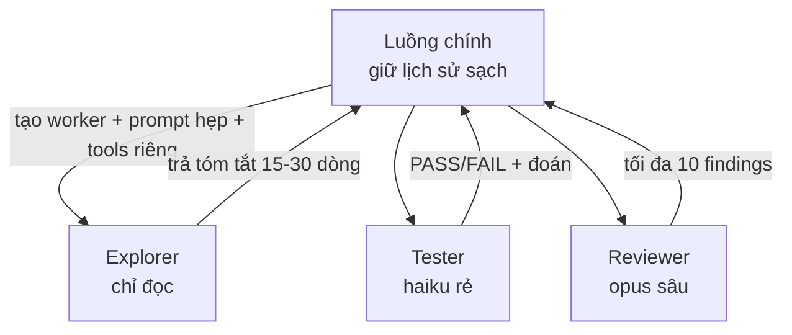

# 06 — Subagents, agent teams và chạy song song

> **Bài này cho ai:** bạn đang giao việc cho Claude mà context nhanh đầy, muốn tách bớt việc ồn sang worker riêng và biết lúc nào thì đừng tách.
> **Cần gì trước:** đã cài và đăng nhập Claude Code ([01-cai-dat-va-xac-thuc.md](./01-cai-dat-va-xac-thuc.md)); nên đọc [05-skills-custom-commands.md](./05-skills-custom-commands.md) để phân biệt skill với subagent.
> **Đọc xong bạn làm được:**
> - Chọn đúng 1 trong 4 cách chạy song song theo bảng quyết định 30 giây, thay vì tạo worker rồi mới thấy tốn tiền.
> - Cài 4 agent file mẫu (`explorer`, `planner`, `security-reviewer`, `tester`) và gọi được ngay trong session.
> - Tính được chi phí 1 lần tạo worker trước khi chia việc, biết trần an toàn là 3–5 worker cùng lúc.
> - Kể được 4 mẫu điều phối (song song, chuỗi, phản biện, cô lập) và 5 hiểu nhầm hay mắc.
> **Thời gian:** ~40 phút đọc + ~45 phút làm walkthrough mục 6

## Thuật ngữ dùng trong bài này

Đọc bảng này trước khi vào mục 1 — mọi thuật ngữ Anh trong bài đều được giải thích ở đây.

| Thuật ngữ | Hiểu nôm na là gì | Ví dụ thấy ngay |
|---|---|---|
| Subagent (worker) | Trợ lý con có bộ nhớ riêng, làm xong chỉ trả tóm tắt 10–30 dòng | Explorer đọc 50 file, luồng chính chỉ nhận danh sách file |
| Context window | Bộ nhớ tạm của model, hết chỗ là model dở | `/context` thấy lịch sử chiếm 45% |
| Chi phí tạo worker | Số tokens nạp sẵn mỗi lần mở worker (system prompt + quy tắc + tool) | ~20k tokens — **số ước tính cộng đồng**, không phải số chính thức |
| Orchestration (điều phối) | Sắp thứ tự ai làm gì, ai kiểm tra ai | explorer → planner → tester |
| Agent teams | Nhiều agent cùng 1 màn hình, có lead giao việc (experimental, tắt mặc định) | Bật bằng `CLAUDE_CODE_EXPERIMENTAL_AGENT_TEAMS=1` |
| Agent view (`/agents`) | Màn hình danh sách session — bạn tự giao việc rồi vào xem sau | 3 session song song 3 feature, mở tab Running để check |
| Fork | Chạy việc trong bộ nhớ riêng, không dính lịch sử chat chính | fork skill chạy nền từ v2.1.218; fork mode cho subagent hưởng nguyên context luồng chính từ ≥2.1.232 (tắt bằng `CLAUDE_CODE_FORK_SUBAGENT=0`) |
| Worktree | Mỗi session 1 bản sao repo riêng để không giẫm chân nhau | `/batch` tự tạo worktree |
| `/batch` | Chạy nền 1 loạt việc theo plan, có kiểm tra chéo giữa các worker | Migrate 50 files → 10 PRs |
| `/btw` | Hỏi nhanh giữa task bằng nguyên context, không thêm tool | "test flaky là gì, mình có cần lo không?" |
| Explore / Plan | 2 agent có sẵn của Claude Code: 1 người chỉ đọc, 1 người chỉ lên kế hoạch | Khi chạy qua 2 agent này thì CLAUDE.md project bị bỏ qua |

## Mục lục

1. [Vì sao cần subagent?](#1-vì-sao-cần-subagent)
2. [So sánh 4 cách song song (chọn sai là tốn tiền)](#2-so-sánh-4-cách-song-song-chọn-sai-là-tốn-tiền)
3. [4 file agent mẫu hoàn chỉnh (copy-paste)](#3-4-file-agent-mẫu-hoàn-chỉnh-copy-paste)
4. [Giới hạn worker được làm gì](#4-giới-hạn-worker-được-làm-gì)
5. [Mẫu điều phối và cách tính chi phí](#5-mẫu-điều-phối-và-cách-tính-chi-phí)
6. [Đi từng bước trong 45 phút](#6-đi-từng-bước-trong-45-phút)
7. [Khi nào KHÔNG dùng subagent](#7-khi-nào-không-dùng-subagent)
8. [Bài tập thực hành](#8-bài-tập-thực-hành)
9. [Link chéo](#9-link-chéo)

---

## 1. Vì sao cần subagent?

Mục tiêu section này: trả lời 1 câu — việc nào nên giao worker riêng, và vì sao giao vậy thì luồng chính mới sạch để bạn ra quyết định.

**Nôm na 1 câu:** Subagent là *đệ tử đi chợ hộ* — việc đọc nhiều ồn nhiều (50 files, 2000 dòng log) thì sai đệ đi, bạn ở nhà chỉ nhận tờ giấy tóm tắt 10 dòng.

**Ví dụ đời thường:** như thuê 3 thực tập sinh mỗi đứa đọc 1 chồng hồ sơ rồi báo cáo 15 dòng/đứa. Bạn không đọc 3 chồng hồ sơ, chỉ đọc 45 dòng tổng hợp — luồng chính sạch để quyết định.

**Ví dụ kỹ thuật copy-paste (gọi nhanh không cần file):**

```text
"dùng subagent explorer tìm mọi file liên quan tới POST /login rate-limit, trả tóm tắt ≤30 dòng"
```

> **Ai dùng lúc nào:** khi task phụ đọc nhiều / ồn nhiều / không cần nhớ lâu (nghiên cứu module, review với ngữ cảnh mới, chạy test, đọc log CI). Task 1-2 bước thì làm trực tiếp, đỡ chi phí tạo worker ~20k tokens.



**Giải thích từng bước:**
1. **Bạn tạo worker:** kèm system prompt riêng + danh sách tool riêng + quyền riêng (mỗi subagent có context window riêng).
2. **Worker chạy cô lập:** đọc ồn bao nhiêu cũng không làm bẩn luồng chính. Việc dễ giao cho Haiku (tester), việc khó giao cho Opus (reviewer).
3. **Trả tóm tắt:** transcript ồn ở lại bên worker, luồng chính chỉ nhận tóm tắt → còn chỗ để triển khai. Chi phí tạo worker ~20k tokens/lần (ước tính cộng đồng) nên task dưới 10k tokens thì đừng tạo.

**Lợi ích:** giữ context (không làm bẩn luồng chính), ép đúng giới hạn (chỉ dùng tool được phép), tái dùng sang project khác
(mức cá nhân `~/.claude/agents/`), chuyên môn hóa (prompt hẹp), tiết kiệm chi phí (việc dễ giao Haiku).
**Chi phí:** ~20k tokens mỗi lần tạo worker (ước tính cộng đồng); nhiều worker tốn 3–4 lần so với làm một luồng (số liệu cộng đồng).
→ Chỉ tạo khi xứng đáng, trần thực tế **3–5 worker chạy song song**.

### 1.1. Cơ chế sâu: vì sao tốn ~20k khi tạo worker?

Tạo worker = mở conversation mới với: system prompt agent + CLAUDE.md project (trừ Explore/Plan) +
skills nạp sẵn + định nghĩa tool. Tất cả nạp trước khi agent đọc dòng code đầu tiên. Vì vậy task 1 bước
("đọc file X") tạo worker = trả 20k để làm việc 2k. Task research 50 files = trả 20k để
tiết kiệm 100k trong luồng chính → lời.

**Kiểm tra nhanh:**

- Chạy prompt mẫu ở trên: luồng chính nhận tóm tắt ≤30 dòng, ra đúng 3 mục in ra (files sẽ sửa + files chỉ đọc tham khảo + rủi ro); mở `/agents` tab Running thấy worker vừa chạy.
- Transcript 20–50 file đọc nằm bên worker — luồng chính không bị làm bẩn, `/context` của luồng chính không phình theo.
- Trả lời được vì sao task "đọc 1 file" (2k tokens) mà tạo worker lại thành 22k, còn task research 50 files thì ngược lại.

---

## 2. So sánh 4 cách song song (chọn sai là tốn tiền)

Mục tiêu section này: chọn đúng công cụ trước khi làm — vì 4 cách dưới đây trông giống nhau nhưng cách trả tiền khác nhau hoàn toàn.

| Cách | Ai điều phối? | Khi nào | Ví dụ |
|---|---|---|---|
| **Subagents** | Claude tự chia và gom kết quả trong 1 conversation | Đẩy nghiên cứu/kiểm chứng sang worker, giữ luồng chính sạch | "Nghiên cứu module auth, trả tóm tắt" |
| **Agent view** | Bạn giao việc, check lại sau | Gửi việc cho nhiều session, attach khi cần | 3 sessions song song 3 features |
| **Agent teams** (experimental, tắt mặc định — bật bằng `CLAUDE_CODE_EXPERIMENTAL_AGENT_TEAMS=1`, ≥2.1.32) | Lead agent lập kế hoạch, giao việc, giám sát đồng đội | Feature mới, debug đa giả thuyết, review song song | Lead + 3 teammates (security/perf/tests) |
| **Quy trình động** (`/batch`...) | Script giữ plan, bung N worker + kiểm tra chéo | Việc lớn chia nhỏ có kiểm chứng | Migrate 50 files → 10 PRs |

4 cách đó khác vài thứ hay bị nhầm:

- `Bash` tool = 1 lệnh shell chạy không chặn (không phải agent).
- Worker tạo ra từ fork = kế thừa toàn bộ conversation (đó là cách tạo, không phải bề mặt riêng).
- Routine = session theo lịch trên cloud.
- **Worktree**: mỗi session 1 git checkout riêng → song song không giẫm file (`/batch`/agent view tự tạo — [11 — Worktrees](./11-git-worktrees-checkpoints.md)).

### 2.1. Bảng quyết định 30 giây

```text
Task ồn nhưng cần gom về 1 quyết định? → Subagents (Claude tự chia).
Muốn tự tay giao + check từng đứa? → Agent view (/agents tab Running).
Task lớn, chia nhỏ có kiểm tra chéo? → /batch.
Muốn nhiều góc nhìn độc lập cùng lúc? → Agent teams.
Chỉ là "làm theo chuẩn X"? → Skill, đừng tạo worker (bài 05).
Hỏi nhanh giữa task? → /btw (bài 04).
```

**Kiểm tra nhanh:** bóc 3 việc bạn định làm hôm nay ra, dán vào bảng này và chọn được 1 đáp án cho mỗi việc — trong đó đáp án "Skill, đừng tạo worker" và "Hỏi nhanh bằng /btw" là 2 chỗ bạn hay tốn tiền oan nhất.

---

## 3. 4 file agent mẫu hoàn chỉnh (copy-paste)

Mục tiêu section này: có 4 agent chạy được ngay — 1 người đọc, 1 người viết plan, 1 người soi bảo mật, 1 người chạy test.

> Đặt vào `.claude/agents/<ten>.md` (project) hoặc `~/.claude/agents/` (personal, mọi repo).
> Gọi: tự động (qua `description` khớp task) hoặc gọi tường minh: `"dùng subagent X làm Y"`.

### 3.1. Agent 1 — Explorer (nghiên cứu chỉ đọc)

```markdown
---
name: explorer
description: Nghiên cứu codebase chỉ đọc, trả tóm tắt gọn. Dùng chủ động khi cần tìm files liên quan, hiểu module, map dependencies trước khi sửa.
tools: Read, Grep, Glob, Bash
disallowedTools: Write, Edit, NotebookEdit
model: sonnet
permissionMode: plan
maxTurns: 25
effort: medium
---

Bạn là explorer. Chỉ đọc, KHÔNG sửa.

Nhiệm vụ: với yêu cầu của user, tìm TẤT CẢ files liên quan và trả tóm tắt.

Quy trình:
1. Bắt đầu bằng Glob (tên file) → Grep (nội dung) → Read (top 5-10 files liên quan nhất).
2. Không đọc cả file 1000 dòng — dùng offset/limit, đọc phần liên quan.
3. Ghi lại: mỗi file 1 dòng (path + vai trò + có cần sửa không).

Output (bắt buộc, tối đa 30 dòng):
- **Files sẽ sửa**: path + 1 câu vì sao
- **Files chỉ đọc tham khảo**: path + 1 câu
- **Không liên quan**: bỏ qua, đừng liệt kê
- **Rủi ro**: chỗ nào dễ vỡ nếu sửa

Cấm: lan man lịch sử, dán cả file vào báo cáo, đề xuất refactor ngoài phạm vi.
```

```text
# Gọi mẫu:
"dùng subagent explorer tìm mọi file liên quan tới POST /login rate-limit, trả tóm tắt đúng định dạng của nó"
```

### 3.2. Agent 2 — Planner (viết plan, không đụng source)

```markdown
---
name: planner
description: Viết implementation plan chi tiết (goals/files/steps/verify). Dùng khi task multi-file cần duyệt trước khi code.
tools: Read, Grep, Glob, Write
disallowedTools: Edit, NotebookEdit
model: sonnet
permissionMode: plan
maxTurns: 20
effort: high
---

Bạn là planner. Viết plan, KHÔNG sửa source (chỉ được Write vào plans/).

Quy trình:
1. Đọc code liên quan (Glob → Grep → Read như explorer).
2. Viết plan vào `plans/<YYYYMMDD>-<ten-task>.md` theo khung:
   - Goals (đo được) / Non-goals (nói rõ không làm gì)
   - Files (sửa file nào, thêm file nào, mỗi file làm gì)
   - Steps (từng bước + lệnh kiểm chứng sau mỗi bước)
   - Risks (chỗ dễ vỡ + rollback)
3. Trình plan, chờ duyệt. Không tự implement.

Output: path plan file + tóm tắt 10 dòng để luồng chính duyệt nhanh.
```

```text
# Gọi mẫu:
"dùng subagent planner viết plan migrate auth từ JWT sang session, ghi vào plans/, không code"
```

### 3.3. Agent 3 — Security reviewer (chỉ đọc + git diff)

```markdown
---
name: security-reviewer
description: Review code tìm lỗ hổng bảo mật. Dùng chủ động khi có diff chạm auth/input/crypto/payment.
tools: Read, Grep, Glob, Bash
disallowedTools: Write, Edit
model: opus
permissionMode: plan
maxTurns: 20
skills: secure-coding-guide
memory: project
effort: high
---

Bạn là security reviewer. Chỉ đọc, không sửa.
1. `git diff main...HEAD` → liệt kê thay đổi.
2. Check theo: injection, authZ, secrets, crypto, SSRF...
3. Trả về: [SEVERITY] file:line — mô tả — gợi ý fix. Không lan man.

Quy trình chi tiết:
1. `git diff main...HEAD --stat` → phạm vi. Diff >20 files → báo quá lớn, review theo lô.
2. Đọc từng file đổi + file test kèm (có test cho path mới?).
3. Check OWASP-flavored: injection (SQL/command/LDAP), broken access control,
   secrets hardcode, crypto yếu, SSRF, mass assignment, rate-limit thiếu.
4. Calibration: so với 3 diffs lịch sử repo (nếu có) để bớt dễ dãi/khắt khe.

Output: tối đa 10 findings `[CRITICAL|HIGH|MED|LOW] file:line — mô tả — fix`.
Không finding = nói rõ "đã check X, Y, Z — không thấy issue" (đừng im lặng).
```

### 3.4. Agent 4 — Tester (chạy test, báo pass/fail)

```markdown
---
name: tester
description: Chạy tests liên quan, báo pass/fail + đoán nguyên nhân gốc. Dùng sau mỗi thay đổi để kiểm chứng.
tools: Read, Bash
disallowedTools: Write, Edit
model: haiku
maxTurns: 15
effort: low
---

Bạn là tester. Chạy test, báo cáo, không sửa source.

Quy trình:
1. Đọc CLAUDE.md lấy lệnh test focused (vd `pnpm --filter @acme/api test <path>`).
2. Chạy focused trước, full chỉ khi được yêu cầu rõ.
3. Test flaky (pass/fail ngẫu nhiên) → ghi "FLAKY" + dừng đoán, không argue.
4. Fail → báo: lệnh chạy, failures (tối đa 10 dòng log quan trọng), đoán nguyên nhân 1 dòng.

Output:
- `PASS (n/n)` hoặc `FAIL (x/y)` + failures gọn
- Đoán nguyên nhân gốc 1 dòng (ghi rõ là đoán, không chắc chắn)
- Lệnh đã chạy (để luồng chính reproduce)
```

```bash
# Cài 4 agents (copy-paste):
mkdir -p .claude/agents
# Tạo explorer.md, planner.md, security-reviewer.md, tester.md với nội dung trên.
```

> **Lưu ý:** mô tả cộng dồn của 4 agent mà vượt 15.000 tokens sẽ bị cảnh báo lúc khởi động. Giữ `description` ngắn, chi tiết dồn vào body.

**Kiểm tra nhanh:**

- Gõ `/agents` → tab Library thấy đủ 4 agent vừa tạo, mỗi agent có đúng model khai báo (explorer/planner sonnet, security-reviewer opus, tester haiku).
- Gọi `"dùng subagent explorer tìm ..."` → output tối đa 30 dòng, ra đúng khung 4 mục đã khai báo (`Files sẽ sửa / Files chỉ đọc tham khảo / Không liên quan — bỏ qua / Rủi ro`).
- Thử gậy explorer sửa file (vd "sửa luôn giúp anh") → explorer từ chối hoặc không làm được (`disallowedTools` + `permissionMode: plan`).

---

## 4. Giới hạn worker được làm gì

Mục tiêu section này: 5 công tắc khiến worker của bạn không thể làm hỏng việc ngoài phạm vi, kể cả khi prompt dụ nó.

- **Danh sách tool cho phép** (`tools:`) là then chốt: ngoài list không gọi được dù prompt bảo gì.
- **Permission modes** theo từng agent; **skill nạp sẵn** (`skills:`); **hooks riêng** trong frontmatter
  (`PreToolUse`/`PostToolUse`/`Stop`→`SubagentStop`... chỉ chạy khi agent đó active; project-level cần trust workspace dialog).
- **Conditional rules**: `PreToolUse` hook kiểm tra trước khi tool chạy (cho 1 số thao tác, chặn thao tác khác).
- **SubagentStart/Stop** hooks ở `settings.json` (matcher = tên agent; tên có `:` là regex → anchor `^...$`).
- Lưu ý: plugin agents bị bỏ qua `hooks`/`mcpServers`/`permissionMode` (copy ra ngoài nếu cần).

### 4.1. Ví dụ cấu hình quyền thật

```markdown
# Explorer khóa Write (dù prompt dụ "sửa luôn giúp anh" cũng không sửa được):
tools: Read, Grep, Glob, Bash
disallowedTools: Write, Edit, NotebookEdit
permissionMode: plan   # dự phòng: plan mode đã read-only

# Tester chỉ được Bash test-runner + Read (không Grep lung tung):
tools: Read, Bash
# + PreToolUse hook: chỉ cho Bash matching "pnpm *test*|pytest*|go test*",
#   block "rm|push|deploy" (xem bài 07 mẫu conditional hook).

# Reviewer nạp sẵn skill secure-coding-guide:
skills: secure-coding-guide
# → agent có knowledge chuẩn team mà không cần paste vào prompt mỗi lần.
```

```bash
# Chạy cả session dưới 1 persona (hữu ích khi debug/test persona mới):
claude --agent explorer "tìm mọi file liên quan tới billing"
claude --agent tester "chạy tests cho packages/auth"

# Agent khai ngay trong lệnh, không cần tạo file (test nhanh):
claude --agents '{"quick-review":{"prompt":"Bạn là reviewer, chỉ đọc không sửa.","tools":["Read","Grep"]}}'
```

**Kiểm tra nhanh:** chạy `claude --agent explorer "tìm mọi file liên quan tới billing"` → session chỉ dùng Read/Grep/Glob/Bash, không có lệnh ghi file nào trong transcript; chạy `claude --agents '{...}'` thì không cần tạo file mà vẫn chạy được.

---

## 5. Mẫu điều phối và cách tính chi phí

Mục tiêu section này: xếp đúng thế cho từng loại việc, và tính ra con số trước khi chia việc cho nhiều worker.

### 5.1. 4 công thức ghép việc thực chiến

Bám đúng 4 người ở mục 3, đổi prompt cho khớp việc là dùng được ngay:

1. **Explorer** (`Read, Grep, Glob` only): "chỉ liệt kê file sẽ sửa/đọc để làm thay đổi" (chống báo cáo lan man).
2. **Planner** (`Read, Write` giới hạn ở `plans/` qua hook): viết markdown plan goals/files/steps, không đụng source.
3. **Reviewer** (`Bash` chỉ đọc git qua hook + `Read`): chấm diff theo độ đúng, độ phủ test, style, bảo mật; làm chuẩn bằng 3 diffs lịch sử repo để bớt dễ dãi.
4. **Tester** (`Bash` test-runner + `Read`): chạy tests liên quan, báo pass/fail + đoán nguyên nhân 1 dòng; test flaky thì ghi "flaky" và dừng đoán.

Ghép 4 người trên thành 4 mẫu điều phối (nghiên cứu song song, chuỗi, phản biện, cô lập) — xem 5.2 ngay dưới.

Nâng cao: worker nền/tương tác (`/agents` tab Running; dừng bằng Ctrl+X Ctrl+K ×2),
quét output, worker tạo worker — giới hạn cấp (depth) mặc định **3**, trần tối đa **5 cấp** (w24/2026);
dùng tiết chế vì token cộng dồn, hạ về 1 bằng `CLAUDE_CODE_MAX_SUBAGENT_SPAWN_DEPTH=1`; ngoài ra có giới hạn số worker chạy song song.
Skill khai `context: fork` chạy **background mặc định** (từ v2.1.218; `background: false` trong SKILL.md để chờ trong turn — [05 — Skills](./05-skills-custom-commands.md)).
TEXT output forward: `--forward-subagent-text` (kèm env) để hiện text của worker trực tiếp ở luồng chính.
Xem `/agents`, worktrees ([11 — Worktrees](./11-git-worktrees-checkpoints.md)), `/batch`, `/background`, `/subtask`.

### 5.2. Các mẫu điều phối (khi nào xếp thế nào)

```text
Mẫu A — Nghiên cứu song song (nhanh nhất cho task mới):
luồng chính: "tạo 3 explorers song song: (1) auth flow, (2) DB schema, (3) API routes. Mỗi explorer trả 15 dòng."
→ gom 3 bản tóm tắt → viết plan → triển khai.
Chi phí: 3 × 20k chi phí tạo worker + research. Lời khi research >60k tokens nếu làm trực tiếp.

Mẫu B — Chuỗi (chắc nhất cho task khó):
explorer → planner → (duyệt) → implementer → tester → reviewer
→ mỗi chặng kiểm tra 1 lần. Chậm nhưng ít sai nhất.

Mẫu C — Review phản biện (chất nhất cho PR quan trọng):
implementer (viết code) || reviewer ngữ cảnh mới (review diff + plan, không biết implementer nghĩ gì)
→ reviewer không mang định kiến → bắt được lỗi implementer tự mù.
Dùng /code-review, hoặc prompt tự viết: diff + plan + định nghĩa rõ "finding" là gì;
reviewer quá khắt thì dặn "chỉ đánh dấu lỗi thực sự, đừng thổi phồng".

Mẫu D — Cô lập (sạch nhất cho task ồn):
"đọc toàn bộ logs CI 2000 dòng + tóm tắt 10 dòng" → subagent.
luồng chính chỉ nhận 10 dòng, không bao giờ thấy 2000 dòng gốc.
```

### 5.3. Cách tính chi phí trước khi chia việc

```text
Công thức nhẩm:
  chi_phi_tao ≈ 20k tokens (system + CLAUDE.md + skills + tools defs)
  chi_phi_viec ≈ tokens research/thực thi của agent đó
  tong         ≈ N × (20k + chi_phi_viec) + chi_phi_gom (luồng chính đọc N bản tóm tắt)

Ví dụ 1 — 3 explorers song song:
  3 × (20k + 15k research) + 5k gom = ~110k tokens.
  Làm một luồng, đọc 50 files trực tiếp: ~120k tokens nằm trong luồng chính (phình 120k).
  → Song song đắt tương đương nhưng luồng chính sạch (chỉ 5k tóm tắt) → còn chỗ triển khai.

Ví dụ 2 — Task 1 bước ("đọc file X"):
  tạo worker: 20k + 2k = 22k. Trực tiếp: 2k.
  → Tạo worker đắt 11 lần. ĐỪNG tạo worker.

Ví dụ 3 — /batch 10 subagents migrate:
  10 × (20k + 30k) = 500k. Đắt 3-4 lần so một luồng nhưng 10 PRs song song trong 1 giờ
  vs một luồng 10 giờ. → Đắt tiền, rẻ thời gian. Đáng khi deadline dí.

Quy tắc:
- N ≤ 3-5 worker chạy cùng lúc (trần thực tế, quá là luồng chính không gom nổi + bill nổ).
- Task <10k tokens → làm trực tiếp, đừng tạo worker.
- Luôn giao việc dễ cho Haiku (tester → haiku, reviewer → opus).
```

```bash
# Kiểm tra bill sau khi chia việc (copy-paste):
# Trong session:
/usage    # breakdown: các worker ngốn bao nhiêu?
/cost     # tổng session
# Hỏi: "phân tích cost vừa rồi: lần tạo worker nào đáng, lần nào phí?"
```

> **Lưu ý số liệu:** ~20k tokens/lần tạo worker và tỉ lệ 3–4x là **ước tính cộng đồng**, không phải số chính thức của Anthropic. Đối chiếu actual bằng `/usage` sau mỗi lần chia việc.

**Kiểm tra nhanh:**

- Chạy `/usage` sau 1 lần tạo 3 worker → thấy phần của subagents; `/cost` ra tổng session; hỏi Claude "phân tích cost vừa rồi" và đọc được lần nào đáng, lần nào phí.
- Áp công thức vào 1 task thật trước khi chia: task ước <10k tokens → bạn tự kết luận "làm trực tiếp"; task research >60k → chọn tạo worker.
- Biết trần của mình: quá 5 worker cùng lúc thì dừng thêm, vì luồng chính không gom nổi tóm tắt.

---

## 6. Đi từng bước trong 45 phút

Mục tiêu section này: cài 4 agent và chạy 3 tình huống (đơn, song song, chuỗi) để mắt thấy tay làm.

**Bước 1 — Tạo 4 agents (10 phút):**
Copy mục 3 vào `.claude/agents/`. Chạy `/agents` → Library phải thấy 4.

**Bước 2 — Test explorer (10 phút):**

```text
"dùng subagent explorer tìm mọi file liên quan tới [module bạn đang làm], trả tóm tắt"
```

**Bước 3 — Chạy nghiên cứu song song (10 phút):**

```text
"tạo 2 explorers song song: 1 explorer map auth flow, 1 explorer map DB schema. Gom lại cho mình."
```

**Bước 4 — Chạy chuỗi + reviewer (15 phút):**

```text
"dùng planner viết plan cho [task], rồi dùng security-reviewer review plan đó"
# Duyệt plan. Rồi: "implement theo plan, xong dùng tester chạy focused tests"
```

**Kiểm tra nhanh:**

- Bước 2: tóm tắt ≤30 dòng, có đủ "files sẽ sửa + files tham khảo", không lan man — chưa đúng thì sửa agent file lặp tới khi 3 lần liên tiếp ra đúng định dạng.
- Bước 3: mở `/agents` tab Running thấy 2 worker chạy song song; kill test bằng `Ctrl+X Ctrl+K ×2` là 2 đứa biến mất.
- Bước 4: plan được duyệt trước khi code; sau khi triển khai, tester báo `PASS (n/n)` hoặc `FAIL` kèm lệnh chạy để bạn chạy lại.

---

## 7. Khi nào KHÔNG dùng subagent

Mục tiêu section này: 3 tình huống bạn đang trả tiền oan, 6 bẫy hay gặp và 5 hiểu nhầm — đọc trước mỗi lần định tạo worker.

- Việc chỉ là "làm theo chuẩn X" → viết **skill**, đừng tạo worker chỉ để đọc guidance ([05 — Skills](./05-skills-custom-commands.md)).
- Task 1 bước, ít file → làm trực tiếp rẻ hơn chi phí tạo worker 20k.
- Muốn hỏi nhanh giữa task → `/btw` (đủ context, không tool, không làm bẩn lịch sử).

| Tình huống | Chọn | Vì sao |
|---|---|---|
| "Deploy theo checklist" | Skill `/deploy` | Knowledge, không cần worker riêng |
| "Đọc file X giải thích" | Trực tiếp | 2k tokens, tạo worker phí 20k |
| "Hỏi nhanh giữa task" | `/btw` | Đủ context, không tool, không lưu lịch sử |
| "Research 50 files" | Explorer subagent | Ồn, cần cô lập |
| "Review PR quan trọng" | Reviewer ngữ cảnh mới | Không định kiến người viết |
| "Migrate 50 files" | `/batch` | Chia nhỏ + kiểm tra chéo |

### 7.1. Bẫy thường gặp + cách fix

| Bẫy | Vì sao | Cách fix |
|---|---|---|
| Tạo 10 agent một lần → bill nổ | Không tính chi phí khởi tạo | Trần 3-5, tính chi phí trước (mục 5.3) |
| Mô tả dài → cảnh báo 15k lúc khởi động | Chi tiết dồn sai chỗ | Mô tả 1-2 câu, chi tiết vào phần thân |
| Reviewer quá khắt (đánh dấu mọi thứ) | Không định nghĩa "finding" là gì | Dặn "chỉ đánh dấu lỗi thực sự, đừng thổi phồng" + làm chuẩn bằng 3 diffs cũ |
| Agent sửa lung tung ngoài phạm vi | Danh sách tool quá rộng | `disallowedTools: Write, Edit` cho agent chỉ đọc |
| Worker tạo worker không điểm dừng | Không giới hạn cấp | Dặn "không tạo tiếp, tự làm"; trần cấp mặc định 3, tối đa 5 cấp (w24/2026), hạ về 1 bằng `CLAUDE_CODE_MAX_SUBAGENT_SPAWN_DEPTH=1`; dừng bằng Ctrl+X Ctrl+K |
| Plugin agent hooks không chạy | Bị bỏ qua theo thiết kế | Copy ra `.claude/agents/` nếu cần hooks |

### 7.2. Hiểu nhầm thường gặp

| Hiểu nhầm | Sự thật | Ai cần nhớ |
|---|---|---|
| "Subagent nhớ mọi thứ luồng chính biết" | Mỗi subagent có context riêng khi tạo; từ ≥2.1.232 fork mode bật mặc định nên subagent hưởng nguyên context luồng chính (tắt bằng `CLAUDE_CODE_FORK_SUBAGENT=0`), còn skill `context: fork` vẫn cô lập hẳn lịch sử chat. Muốn subagent biết gì vẫn nên ghi rõ trong prompt giao việc. | Người mới giao việc |
| "Càng nhiều agent càng nhanh" | Chi phí tạo worker ~20k/lần (ước tính cộng đồng), nhiều worker tốn 3–4 lần so với làm một luồng. Trần 3–5 worker, quá là luồng chính gom không nổi + bill nổ. | Mọi dev |
| "Agent Teams bật mặc định" | Experimental, tắt mặc định — bật bằng `CLAUDE_CODE_EXPERIMENTAL_AGENT_TEAMS=1` (≥2.1.32). | Người thử teams |
| "Bash tool là 1 agent" | Bash = 1 lệnh shell chạy không chặn, không phải agent. Worker tạo từ fork = cách tạo kế thừa toàn bộ conversation. | Người mới |
| "Việc gì cũng nên tạo worker" | "Làm theo chuẩn X" → Skill; hỏi nhanh → `/btw`; đọc 1 file → trực tiếp. Chỉ tạo khi ồn và cần cô lập. | Mọi dev |

**Kiểm tra nhanh:** với 6 tình huống trong bảng quyết định, bạn chọn được tool mà không cần nhìn đáp án; và chỉ ra được 2 trong 3 việc dưới đây không cần worker ("đọc 1 file", "hỏi nhanh giữa task", "deploy theo checklist").

---

## 8. Bài tập thực hành

Mục tiêu section này: chạy đủ 4 mẫu, đo bằng `/cost`, và tự trả lời được "lần nào tạo worker là lời".

**Bài 1 (20 phút):** Cài 4 agents mục 3. Test explorer + tester lên repo thật. Đo `/cost`
so với làm trực tiếp — khi nào tạo worker lời?

**Bài 2 (20 phút):** Chạy mẫu B (chuỗi) cho 1 task multi-file: explorer → planner → implement
→ tester. Ghi lại output từng chặng. So với làm 1 phát không theo chuỗi.

**Bài 3 (15 phút):** Chạy mẫu C (phản biện): implementer viết, reviewer ngữ cảnh mới review.
Đếm findings reviewer bắt được mà implementer tự miss. Sửa prompt reviewer tới khi độ chính xác cao.

**Bài 4 (15 phút, cost):** Tạo 3 explorers song song, ghi `/usage` + `/cost`. Tính theo công thức mục 5.3:
có đáng không? Thử lại với 1 explorer — chênh bao nhiêu?

**Kiểm tra nhanh:** bài 1 có con số `/cost` 2 chiều (trực tiếp vs tạo worker); bài 2 ghi được output từng chặng và chỉ ra chặng nào chậm nhất; bài 4 ra được 1 câu kết luận "task nào của team mình nên tạo worker, task nào không" kèm con số.

---

## 9. Link chéo

Mục tiêu section này: mở đúng bài tiếp theo khi mục này trả lời chưa đủ chỗ.

- **[00 — Tổng quan](./00-tong-quan-claude-code.md)**: chi phí tạo worker 20k, nhiều worker tốn 3-4 lần, trần 3-5.
- **[04 — Slash commands](./04-slash-commands-toan-tap.md)**: `/agents /tasks /batch /btw`, foreground/background, cách dừng worker.
- **[05 — Skills](./05-skills-custom-commands.md)**: fork skill, subagent nạp sẵn skill, Explore/Plan bỏ qua CLAUDE.md.
- **[07 — Hooks](./07-hooks-tu-dong-hoa.md)**: SubagentStart/Stop hooks, PreToolUse conditional rules, frontmatter hooks.
- **[10 — Permissions](./10-permissions-modes-availability.md)**: permissionMode per-agent, allowlist tools.
- **[11 — Worktrees](./11-git-worktrees-checkpoints.md)**: mỗi session 1 checkout riêng, `/batch` chạy trong worktree riêng.
- **[12 — SDK/CI](./12-agent-sdk-ci-cd-automation.md)**: tự viết quy trình điều phối bằng Agent SDK, `canUseTool` callbacks.
