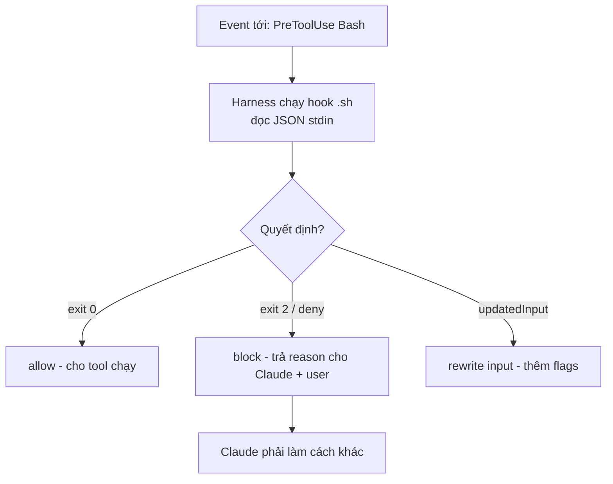

# 07 — Hooks: tự động hóa tất định (luật, không phải gợi ý)

> **Bài này cho ai:** dev đã dùng CLAUDE.md/skills mà rule vẫn bị Claude quên, muốn nâng rule thành luật chạy thật.
> **Cần gì trước:** đã cài và đăng nhập ([bài 01](./01-cai-dat-va-xac-thuc.md)); nên đọc [bài 03 — CLAUDE.md](./03-claude-md-memory-rules.md) để phân biệt "gợi ý" với "luật".
> **Đọc xong bạn làm được:**
> - Giải thích được vì sao hook chạy 0 token model, không bị prompt-injection, và chặn được cả khi bật `--dangerously-skip-permissions`.
> - Copy được full `settings.json` mẫu cho team và 5 hooks hoàn chỉnh vào repo của bạn.
> - Chọn đúng event + matcher + type cho rule của mình, tra nhanh được bảng events.
> - Debug được khi hook không chạy bằng flowchart 7 bước.
> **Thời gian:** ~45 phút

## Thuật ngữ dùng trong bài này

Đọc bảng này trước khi vào mục 1 — mọi thuật ngữ Anh trong bài đều được giải thích ở đây.

| Thuật ngữ | Hiểu nôm na là gì | Ví dụ thấy ngay |
|---|---|---|
| Hook | Aptomat tự nhảy: harness tự chạy lệnh cho bạn, không hỏi model có muốn không | Sau mỗi `Edit` tự chạy `eslint` |
| Event | Tín hiệu báo 1 việc vừa xảy ra, ví dụ trước hoặc sau khi tool chạy | `PreToolUse`, `PostToolUse`, `SessionStart`, `Stop` |
| Matcher | Chuỗi lọc "hook này áp cho tool nào" (nhiều tool nối bằng `\|`) | `Bash`, `Edit\|Write` |
| Harness | CLI Claude Code trên máy bạn: thứ đọc/ghi file, chạy lệnh, chạy hook | Chạy `.claude/hooks/lint-on-write.sh` |
| Exit code | Số lệnh trả về khi kết thúc: 0 = cho qua, 2 = chặn | `exit 2` kèm `permissionDecision: deny` |
| stdin/stdout | Ống dẫn JSON đưa vào hook và kết quả trả ra | `INPUT="$(cat)"` |
| Tất định (deterministic) | Cùng input luôn cho cùng kết quả, không hên xui | Regex match `git push.*main` là deny mọi lần |
| Type của hook | Kiểu hook: `command` (shell), `http`, `mcp_tool`, `prompt`, `agent` | 95% việc dùng `command` |
| Advisory vs law | Gợi ý thì Claude có thể quên; luật thì bắt buộc chạy | CLAUDE.md = gợi ý, hook = luật |

## Mục lục

1. [Hook là gì và vì sao luật thắng gợi ý](#1-hook-là-gì-và-vì-sao-luật-thắng-gợi-ý)
2. [Các event của hook (thuộc lòng nhóm chính)](#2-các-event-của-hook-thuộc-lòng-nhóm-chính)
3. [Cấu hình settings.json và cơ chế stdin/stdout](#3-cấu-hình-settingsjson-và-cơ-chế-stdinstdout)
4. [Full settings.json mẫu cho team (copy-paste)](#4-full-settingsjson-mẫu-cho-team-copy-paste)
5. [5 hooks hoàn chỉnh (copy-paste)](#5-5-hooks-hoàn-chỉnh-copy-paste)
6. [Walkthrough cài hook đầu tiên + debug khi hook không chạy](#6-walkthrough-cài-hook-đầu-tiên--debug-khi-hook-không-chạy)
7. [Bẫy thường gặp và bài tập](#7-bẫy-thường-gặp-và-bài-tập)
8. [Đi tiếp — link chéo](#8-đi-tiếp--link-chéo)

---

## 1. Hook là gì và vì sao luật thắng gợi ý

Mục này trả lời câu: hook thực sự là gì, và vì sao rule quan trọng nên là hook thay vì một dòng chữ trong CLAUDE.md?

**Nôm na 1 câu:** Hook là *khóa cửa tự động* — tới giờ là khóa, không cần hỏi chủ nhà (model) có muốn khóa không.

**Analogie đời thường:** như cảm biến đèn cầu thang: có người đi qua (event `PreToolUse`) là đèn sáng (chạy shell check), không cần ai bấm công tắc. CLAUDE.md giống tờ giấy "nhớ tắt đèn" dán tường — có thể quên; hook là cảm biến — quên cũng vẫn sáng.

**Ví dụ kỹ thuật copy-paste (block push main tối thiểu):**

```bash
mkdir -p .claude/hooks
cat > .claude/hooks/block-main-push.sh <<'EOS'
#!/bin/bash
set -euo pipefail
INPUT="$(cat)"
CMD="$(echo "$INPUT" | jq -r '.input.command // empty')"
if echo "$CMD" | grep -Eq 'git[[:space:]]+push.*(main|master)'; then
  echo '{"permissionDecision":"deny","reason":"BLOCKED: không push trực tiếp main. Mở PR."}'
  exit 2
fi
exit 0
EOS
chmod +x .claude/hooks/block-main-push.sh
# Verify: echo '{"input":{"command":"git push origin main"}}' | .claude/hooks/block-main-push.sh; echo "exit=$?"
```

> **Ai dùng lúc nào:** rule bị Claude miss ≥2 lần → nâng thành hook. Cả bài gói gọn trong 1 công thức: **CLAUDE.md/skills = gợi ý (advisory, Claude có thể quên) — hook = luật (law, chạy chắc)**. Mọi team đều cần ít nhất hook block-push-main + lint-on-write.



**Giải thích từng bước:**

1. **Event tới:** ví dụ Claude định chạy `git push origin main` → harness pause trước khi chạy (`PreToolUse` là điểm duy nhất block được).
2. **Harness chạy shell:** gửi event JSON qua STDIN (`{"tool":"Bash","input":{"command":"..."}}`), không qua LLM → 0 model tokens, không bị prompt-injection thuyết phục.
3. **Hook quyết định:** exit 0 = cho qua; exit 2 + `permissionDecision: deny` = block; `updatedInput` = sửa lệnh (ví dụ thêm `--dry-run`).
4. **Claude nhận reason:** thấy "BLOCKED: ..." thì đổi hướng (mở PR thay vì push thẳng). Hook chạy trước cả `bypassPermissions` nên chắc chắn nhất hệ sinh thái.

Shell command (hoặc http/mcp_tool/prompt/agent) Claude Code **tự chạy khi tới lifecycle event** — không qua LLM quyết định → **tất định, 0 model tokens, Claude không override được**. Dùng để: format sau edit, block lệnh nguy hiểm, gửi notification, inject context đầu session, enforce rules.

### 1.1. Vì sao hooks miễn phí mà vẫn chắc chắn?

Hooks chạy **ngoài model** (harness chạy shell, không gọi LLM — trừ type `prompt`/`agent`). Vì vậy: không tốn model tokens, không bị prompt-injection thuyết phục, chạy trước cả `bypassPermissions`. Đó là lý do duy nhất trong hệ sinh thái có tính chất này (xem [bài 00](./00-tong-quan-claude-code.md)).

```text
So sánh enforce:
- CLAUDE.md "NEVER push main" → Claude đọc, gật gù, đôi khi vẫn push (quên/misread).
- PreToolUse hook match `git push.*main` → block 100%, kể cả --dangerously-skip-permissions.
→ Cái nào cần chắc chắn? Hook. Cái nào cần linh hoạt? CLAUDE.md/skill.
```

**Kiểm tra nhanh:**

- Chạy lệnh Verify trong block đầu mục 1: lệnh chứa `git push origin main` → trả JSON deny + `exit=2`; đổi sang `git push origin feat/x` → `exit=0` (cho qua).
- Nói được 3 khác biệt: hook 0 token model, không bị prompt-injection thuyết phục, chặn cả khi bật `--dangerously-skip-permissions` — thứ mà CLAUDE.md không làm được.

---

## 2. Các event của hook (thuộc lòng nhóm chính)

Mục này trả lời câu: có những event nào để bám vào, và rule của bạn nên treo vào event nào?

| Event | Khi lửa | Dùng cho |
|---|---|---|
| `SessionStart` | Session bắt đầu/resume | Inject context (branch, ticket, env check) |
| `Setup` | `claude --init-only`, hoặc `--init`/`--maintenance` trong `-p` (chuẩn bị CI/scripts) | CI warmup (bài 12) |
| `UserPromptSubmit` | User submit prompt, trước khi Claude xử lý | Block/redirect prompt nguy hiểm, log |
| `UserPromptExpansion` | Command user gõ expand thành prompt (có thể block) | Validate slash command args |
| `PreToolUse` | Trước tool call (**block được**) — chạy trước mọi permission check, kể cả `dontAsk`/`bypass` | Guard rails (branch-protect, migration-guard) |
| `PermissionRequest` | Tool call cần quyết định permission (trong `-p` plain: dùng `PreToolUse` thay vì event này) | Custom permission UI (interactive) |
| `PermissionDenied` | Auto mode deny (có thể `retry: true` để model thử lại) | Gợi ý lệnh đúng khi bị deny |
| `PostToolUse` / `PostToolUseFailure` | Sau tool call thành công/thất bại | Lint-on-write, format, log |
| `PostToolBatch` | Sau cả batch parallel tool calls, trước model call kế | Tổng hợp batch (ví dụ check tổng files đổi) |
| `Notification` | Khi Claude gửi notification | Ping Slack/osascript khi cần bạn |
| `MessageDisplay` | Khi assistant text hiển thị | Filter/redact output (hiếm) |
| `SubagentStart`/`SubagentStop` | Subagent spawn/finish (matcher = tên agent type) | Log cost, inject context cho agent |
| `TaskCreated`/`TaskCompleted` | Task lifecycle (`TaskCreate`) | Tracking, ledger |
| `Stop` / `StopFailure` | Claude xong response / turn kết thúc do API error (Stop **không** lửa khi user interrupt) | Cost ledger, gate (block turn-end tới khi pass, tối đa 8 blocks) |
| `TeammateIdle` | Agent-team teammate sắp idle | Giao việc tiếp cho teammate (teams) |
| `InstructionsLoaded` | 1 file CLAUDE.md/rules vừa load (đầu session + lazy-load) | Validate/audit memory load |
| `PreCompact`/`PostCompact`, `ConfigChange`, `PreToolUse`... | Compaction/config (matcher: `manual/auto`, source settings...) | Backup context trước compact |

Types: `command` (shell, phổ biến), `http` (POST event JSON tới URL), `mcp_tool` (gọi tool của MCP server đã connect),
`prompt` (LLM 1-turn, default Haiku, quyết định cần judgment), `agent` (experimental: subagent verify multi-turn, ~60s/50 turns).

### 2.1. Chọn type nào cho hook?

| Type | Khi nào | Ví dụ |
|---|---|---|
| `command` | 95% cases — deterministic, nhanh, 0 token | Lint, block push, guard migrations |
| `prompt` | Cần judgment ngôn ngữ (không regex được) | "Commit message có leak secret không?" |
| `agent` | Verify cần đọc code multi-turn (experimental) | Review diff trước khi cho push |
| `http` | Đẩy event ra hệ ngoài | Log sang ticketing/monitoring |
| `mcp_tool` | Hành động qua MCP đã connect | PostToolUse → tạo ticket Linear |

**Kiểm tra nhanh:**

- Mở `/hooks` trong session, đối chiếu bảng trên: rule bạn đang cần treo vào event nào, và event đó chạy trước hay sau tool?
- Với 95% việc của team bạn, type phải là `command` — chỉ chọn `prompt` khi regex không diễn đạt được, chọn `agent` khi verify phải đọc code nhiều turn.

---

## 3. Cấu hình settings.json và cơ chế stdin/stdout

Mục này trả lời câu: hook sống ở file nào, thứ tự ưu tiên ra sao, và harness "nói chuyện" với hook bằng gì?

### 3.1. Thứ tự ưu tiên các file settings

```text
managed policy (org) > .claude/settings.local.json (personal, không commit)
> .claude/settings.json (team, commit) > ~/.claude/settings.json (personal global)
```

- Xem merged result ở `/permissions`, đừng đoán (bài 10).
- Frontmatter hooks của project subagents cần trust workspace dialog; `-p` session không tính trusted.

### 3.2. Hợp đồng stdin/stdout giữa harness và hook

```text
1. Harness gửi event JSON qua STDIN của hook command.
   Vd PreToolUse: {"tool":"Bash","input":{"command":"git push origin main"},"cwd":"..."}
2. Hook đọc stdin (jq/python), quyết định.
3. Hook trả về:
   - Exit 0 + (optional) JSON {"permissionDecision":"allow"} → cho qua.
   - Exit 2 / JSON {"permissionDecision":"deny","reason":"..."} → block, reason hiện cho Claude + user.
   - JSON {"updatedInput":{...}} → rewrite input (vd thêm flags). 2 hook cùng rewrite → finish cuối thắng (tránh overlap).
   - Stop gate: JSON {"decision":"block","reason":"tests fail"} → Claude phải fix tiếp (tối đa 8 blocks liên tiếp).
```

```bash
# Khung hook bash chuẩn (mọi hook command đều từ đây mà ra):
#!/bin/bash
set -euo pipefail
INPUT="$(cat)"  # đọc JSON stdin
CMD="$(echo "$INPUT" | jq -r '.input.command // empty')"
# ... logic ...
# Cho qua:
exit 0
# Block:
# echo '{"permissionDecision":"deny","reason":"..."}'
# exit 2
```

- Hook nhận JSON qua **stdin**, trả về pass/block (exit code / JSON `permissionDecision: allow|deny`, `updatedInput`...).
- Matcher **case-sensitive**, match tên tool (`Edit`, `Write`, `Bash`...). Nhiều hooks cùng event chạy **song song**;
  2 hook cùng rewrite `updatedInput` → thằng finish cuối thắng (non-deterministic — tránh overlap).
- Xem: `/hooks`. Debug: check event đúng chưa (Pre vs Post), matcher đúng case chưa, folder đã trust chưa
  (frontmatter hooks project-level cần trust dialog; `-p` session không tính là trusted).
- Bảo mật: hook deny thắng cả `bypassPermissions`/`--dangerously-skip-permissions`; ngược lại hook allow
  KHÔNG nới được deny rules hay `ask` của org — hooks chỉ siết, không nới.

**Kiểm tra nhanh:**

- Gõ `/permissions` để xem kết quả merge settings — đừng đoán file nào thắng.
- Tự hỏi lại được hợp đồng 3 phía: harness đưa JSON qua stdin → hook trả exit 0 (qua) / exit 2 + `permissionDecision: deny` (chặn) / `updatedInput` (sửa lệnh).

---

## 4. Full settings.json mẫu cho team (copy-paste)

Mục này trả lời câu: 1 file settings.json đầy đủ cho team dùng trông ra sao, và cách gắn hook vào đó thế nào?

```json
{
  "$schema": "https://claude.ai/code/settings-schema.json",
  "permissions": {
    "allow": ["Read", "Glob", "Grep", "Bash(pnpm test:*)", "Bash(git diff:*)", "Bash(git status:*)"],
    "ask": ["Edit", "Write", "Bash(pnpm:*)", "Bash(git push:*)"],
    "deny": ["Bash(rm -rf:*)", "Bash(git push origin main:*)", "Write(.env*)"]
  },
  "hooks": {
    "SessionStart": [
      {
        "matcher": "",
        "type": "command",
        "command": "${CLAUDE_PROJECT_DIR}/.claude/hooks/session-context.sh"
      }
    ],
    "PreToolUse": [
      {
        "matcher": "Bash",
        "type": "command",
        "command": "${CLAUDE_PROJECT_DIR}/.claude/hooks/block-main-push.sh"
      },
      {
        "matcher": "Write",
        "type": "command",
        "command": "${CLAUDE_PROJECT_DIR}/.claude/hooks/guard-migrations.sh"
      }
    ],
    "PostToolUse": [
      {
        "matcher": "Edit|Write",
        "type": "command",
        "command": "${CLAUDE_PROJECT_DIR}/.claude/hooks/lint-on-write.sh"
      }
    ],
    "Stop": [
      {
        "type": "command",
        "command": "${CLAUDE_PROJECT_DIR}/.claude/hooks/cost-ledger.sh"
      }
    ],
    "Notification": [
      {
        "type": "command",
        "command": "${CLAUDE_PROJECT_DIR}/.claude/hooks/notify.sh"
      }
    ],
    "SubagentStop": [
      {
        "matcher": "explorer|tester",
        "type": "command",
        "command": "${CLAUDE_PROJECT_DIR}/.claude/hooks/log-subagent.sh"
      }
    ]
  }
}
```

```json
// Ví dụ PreToolUse conditional (chỉ cho test-runner Bash qua, block Bash nguy hiểm):
// Đặt trong agent frontmatter hoặc settings hooks với command script kiểm tra prefix.
{
  "hooks": {
    "PreToolUse": [
      { "matcher": "Bash", "type": "command",
        "command": "${CLAUDE_PROJECT_DIR}/.claude/hooks/allow-test-only.sh" }
    ]
  }
}
```

**Kiểm tra nhanh:**

- Dán file trên vào `.claude/settings.json` của repo sạch, mở session mới rồi gõ `/hooks` → phải thấy 6 event types (`SessionStart`, `PreToolUse`, `PostToolUse`, `Stop`, `Notification`, `SubagentStop`) với đúng matcher.
- JSON parse lỗi thì mở `/doctor` — nó chỉ đúng file lỗi; sửa xong mở session mới (hooks load lúc start).

---

## 5. 5 hooks hoàn chỉnh (copy-paste)

Mục này trả lời câu: 5 hook thật, sẵn sàng bỏ vào `.claude/hooks/` là những hook nào?

> Đặt vào `.claude/hooks/`, `chmod +x`, cấu hình trong settings.json mục 4.

**Hook 1 — lint-on-write (PostToolUse Edit|Write)** — format/lint file vừa sửa, lỗi trả lại cho agent fix ngay:

```bash
#!/bin/bash
# .claude/hooks/lint-on-write.sh
set -euo pipefail
INPUT="$(cat)"
# Lấy file paths từ event (CLAUDE_FILE_PATHS hoặc parse JSON):
FILES="$(echo "$INPUT" | jq -r '.input.file_path // .input.path // empty')"
[ -z "$FILES" ] && exit 0
# Chỉ lint files JS/TS (thu hẹp scope cho nhanh — đừng lint cả repo):
echo "$FILES" | tr ' ' '\n' | grep -E '\.(ts|tsx|js|jsx)$' | while read -r f; do
  [ -f "$f" ] || continue
  npx prettier --write "$f" >/dev/null 2>&1 || true
  npx eslint "$f" --max-warnings 0
done
# eslint fail → exit nonzero → PostToolUseFailure → Claude thấy lỗi, fix ngay.
```

**Hook 2 — branch-protect (PreToolUse Bash)** — block `push main`, force-push, xóa branch:

```bash
#!/bin/bash
# .claude/hooks/block-main-push.sh — match theo INTENT, không substring "main"
set -euo pipefail
INPUT="$(cat)"
CMD="$(echo "$INPUT" | jq -r '.input.command // empty')"
# Block push tới main/master (mọi remote, mọi cú pháp):
if echo "$CMD" | grep -Eq 'git[[:space:]]+push([^&|;]*[[:space:]]|^)(origin[[:space:]]+)?(HEAD:)?(main|master)([[:space:]]|$)'; then
  echo '{"permissionDecision":"deny","reason":"BLOCKED: không push trực tiếp main/master. Mở PR từ branch feat/*."}'
  exit 2
fi
# Block force-push mọi dạng:
if echo "$CMD" | grep -Eq '\-\-force($|[[:space:]])|-f([[:space:]]|$)|--force-with-lease'; then
  # Cho phép force-push lên branch feat/* của mình? Team quyết — mẫu này block hết cho an toàn:
  echo '{"permissionDecision":"deny","reason":"BLOCKED: force-push bị cấm. Dùng rebase thường hoặc hỏi lead."}'
  exit 2
fi
# Block xóa branch remote:
if echo "$CMD" | grep -Eq 'git[[:space:]]+push[[:space:]]+[^ ]*[[:space:]]+--delete|git[[:space:]]+push[[:space:]]+[^ ]*[[:space:]]+:heads/'; then
  echo '{"permissionDecision":"deny","reason":"BLOCKED: xóa branch remote cần xác nhận tay."}'
  exit 2
fi
exit 0
# Test với: git push -f, git push --force, git push --force-with-lease, git push origin HEAD:main.
```

**Hook 3 — guard-migrations (PreToolUse Write)** — block sửa migration đã merge:

```bash
#!/bin/bash
# .claude/hooks/guard-migrations.sh
set -euo pipefail
INPUT="$(cat)"
FILE="$(echo "$INPUT" | jq -r '.input.file_path // .input.path // empty')"
# Chỉ guard folder migrations:
case "$FILE" in
  *db/migrations/*|*prisma/migrations/*) ;;
  *) exit 0 ;;
esac
# File đã commit (đã merge) → deny, bắt viết migration mới:
if git ls-files --error-unmatch "$FILE" >/dev/null 2>&1; then
  COMMITTED="$(git log --oneline -1 -- "$FILE" 2>/dev/null || true)"
  if [ -n "$COMMITTED" ]; then
    echo "{\"permissionDecision\":\"deny\",\"reason\":\"BLOCKED: $FILE đã merge ($COMMITTED). Viết migration MỚI, không sửa file này.\"}"
    exit 2
  fi
fi
exit 0
```

**Hook 4 — cost-ledger (Stop)** — đọc token usage từ logs, quy ra $, append daily ledger:

```bash
#!/bin/bash
# .claude/hooks/cost-ledger.sh
set -euo pipefail
INPUT="$(cat)"
DATE="$(date +%F)"
LEDGER="${CLAUDE_PROJECT_DIR:-.}/.claude/cost-ledger.csv"
mkdir -p "$(dirname "$LEDGER")"
[ -f "$LEDGER" ] || echo "date,tokens_in,tokens_out,note" > "$LEDGER"
# Lấy usage từ event (keys tùy version — fallback unknown):
IN="$(echo "$INPUT" | jq -r '.usage.input_tokens // "?"')"
OUT="$(echo "$INPUT" | jq -r '.usage.output_tokens // "?"')"
echo "$DATE,$IN,$OUT,stop-event" >> "$LEDGER"
# Quá cap (vd 1M tokens/ngày) → ping Slack (nếu có webhook):
# [ "$SLACK_WEBHOOK" ] && curl -fsS -X POST "$SLACK_WEBHOOK" -d "{\"text\":\"Cost alert $DATE: in=$IN out=$OUT\"}" >/dev/null
exit 0
```

**Hook 5 — session-context inject (SessionStart)** — in branch, ticket, env check vào context:

```bash
#!/bin/bash
# .claude/hooks/session-context.sh
set -euo pipefail
BRANCH="$(git branch --show-current 2>/dev/null || echo '?')"
STATUS="$(git status --short 2>/dev/null | head -5 || true)"
# Output JSON additionalContext (harness nhét vào session):
jq -n --arg branch "$BRANCH" --arg status "$STATUS" \
  '{additionalContext: ("Branch: \($branch)\nGit status (top5):\n\($status)\nNhắc: chạy focused test sau sửa, không push main.")}'
exit 0
```

```bash
# Cài + test (copy-paste):
chmod +x .claude/hooks/*.sh
# Trong session:
/hooks
# Test branch-protect: gõ prompt "chạy git push origin main giúp anh"
```

Ngoài 5 hook trên, bạn còn: prompt-hook kiểm tra câu chữ cần judgment (ví dụ "commit message có leak secret?"),
agent-hook verify cần đọc code (experimental, production ưu tiên command hooks),
`SessionStart` inject context (branch hiện tại, ticket liên quan), `Stop` gate (script check, block turn-end
tới khi pass — tối đa 8 blocks liên tiếp rồi Claude override để thoát).

**Kiểm tra nhanh:**

- Sau `chmod +x`, gõ `/hooks` trong session mới → phải thấy đủ 6 event types với đúng matcher (SessionStart, PreToolUse ×2, PostToolUse, Stop, Notification, SubagentStop).
- Prompt "chạy git push origin main giúp anh" → hook deny, Claude báo BLOCKED. Nếu vẫn push được → chạy debug mục 6.2.
- Sửa 1 file `.ts` cố ý sai lint → Claude thấy lỗi eslint và tự fix ngay (hook 1).

---

## 6. Walkthrough cài hook đầu tiên + debug khi hook không chạy

Mục này trả lời câu: cài hook đầu tiên mất mấy bước, và khi hook im lặng thì lần theo đâu?

### 6.1. Walkthrough: thêm hook đầu tiên (10 phút)

```text
Bước 1: mkdir -p .claude/hooks, copy hook 2 (block-main-push.sh) vào.
Bước 2: chmod +x .claude/hooks/block-main-push.sh
Bước 3: Thêm vào .claude/settings.json (mục 4, phần PreToolUse Bash).
Bước 4: /hooks → xác nhận hiện. Mở session MỚI (hooks load lúc start).
Bước 5: Test: prompt "chạy git push origin main" → phải bị BLOCKED.
Bước 6: Test lọt: "git push -f", "git push --force-with-lease", "git push origin HEAD:main"
        → cả 4 phải block. Cái nào lọt → sửa regex.
```

### 6.2. Debug flowchart: hook không chạy thì đi từng bước

```text
Hook không chạy?
├─ 1. /hooks có hiện hook? ── Không → settings.json sai path/JSON parse lỗi
│                              → claude doctor (chỉ file lỗi), sửa JSON, mở session mới.
├─ 2. Event đúng? (Pre vs Post) ── Sai → vd muốn block phải PreToolUse, không phải Post.
├─ 3. Matcher đúng case? ── "edit" ≠ "Edit", "write" ≠ "Write", "bash" ≠ "Bash".
├─ 4. Folder đã trust? ── frontmatter hooks project-level cần trust dialog.
│                         -p session không trusted → bị skip (log ghi rõ).
├─ 5. Script +x + shebang? ── chmod +x, test chạy tay: echo '<json>' | ./hook.sh
├─ 6. Nhiều hooks overlap? ── 2 hook cùng rewrite updatedInput → finish cuối thắng.
│                              Tách matcher, đừng overlap.
└─ 7. Muốn nới (allow) nhưng vẫn deny? ── hook allow KHÔNG nới được deny/org ask.
                                          Hooks chỉ siết, không nới (bài 10).
```

```bash
# Debug tay (copy-paste):
echo '{"tool":"Bash","input":{"command":"git push origin main"}}' | .claude/hooks/block-main-push.sh; echo "exit=$?"

echo '{"tool":"Bash","input":{"command":"git push origin feat/x"}}' | .claude/hooks/block-main-push.sh; echo "exit=$?"
```

### 6.3. Nhờ Claude viết hook cho bạn

```text
"Viết hook chạy eslint sau mỗi lần edit file .ts" / "Viết hook block writes vào thư mục migrations"
```

Claude sửa `.claude/settings.json` trực tiếp; bạn `/hooks` duyệt lại. Đối xử hooks như production code
(chạy với quyền của bạn, đọc FS + network + ghi disk).

**Kiểm tra nhanh:**

- Chạy 2 lệnh debug tay ở mục 6.2: lệnh `git push origin main` → JSON deny + `exit=2`; lệnh `git push origin feat/x` → `exit=0`. Cái nào sai là regex sai (deny quá tay hoặc lọt) → sửa regex.
- Bước nào trong 7 nhánh flowchart bắt được lỗi khi bạn cố ý cấu hình sai 1 hook (ví dụ matcher gõ `edit` thường) — ghi lại bước đó.

---

## 7. Bẫy thường gặp và bài tập

Mục này trả lời câu: team hay vấp gì khi dùng hooks, và làm 5 bài nào để tay thuộc?

### 7.1. Hiểu nhầm thường gặp

| Hiểu nhầm | Sự thật | Ai cần nhớ |
|---|---|---|
| "Hook tốn nhiều tokens như gọi LLM" | `command` hooks chạy shell ngoài model → 0 model tokens. Chỉ `prompt`/`agent` hooks mới tốn (Haiku 1-turn / subagent multi-turn). | Mọi dev lo bill |
| "Hook allow nới được deny" | Không — hook allow KHÔNG thắng deny rules hay `ask` của org. Hooks chỉ siết, không nới (sửa deny gốc). | Người debug permissions |
| "Rules settings.json đủ chặn, khỏi hook" | Rules prefix-match, lọt `HEAD:main`, `-f` chen giữa, binary khác (`python3 -c rm`). Chặn chắc → hook match theo intent. | Team lead security |
| "Matcher không phân biệt hoa thường" | Có phân biệt: `Edit` ≠ `edit`, `Bash` ≠ `bash`. Sai case là hook im lặng không chạy. | Người mới viết hook |
| "Hook thay được OS sandbox" | Hook là shell vẫn bypass được qua binary lạ. Việc critical → hook + sandbox + deny rules (bài 10). | Người làm prod |

### 7.2. Bẫy khi cấu hình + cách fix

| Bẫy | Vì sao | Fix |
|---|---|---|
| Hook `.sh` báo permission denied | Quên `chmod +x`, file từ Windows mất +x | `chmod +x .claude/hooks/*.sh` |
| Hook chạy local nhưng không chạy cloud | Hook file chưa commit / path khác | Commit `.claude/hooks/` + dùng `${CLAUDE_PROJECT_DIR}` |
| Lint hook chậm 8s mỗi edit | Lint cả repo thay vì file vừa sửa | Scope hẹp: chỉ file từ stdin, chỉ ext liên quan |
| 2 hooks cùng rewrite → non-deterministic | Overlap matcher | Mỗi rewrite 1 owner; còn lại chỉ read/block |
| Stop gate block mãi không thoát | Script luôn fail | Tối đa 8 blocks rồi override — nhưng fix script gốc, đừng trông vào override |
| Prompt-hook tốn token bất ngờ | `prompt` type gọi Haiku mỗi lần | Chỉ dùng prompt khi regex không làm được |

> Bẫy "tin hook thay OS sandbox" đã gộp vào bảng hiểu nhầm 7.1 (nội dung y hệt, chỉ 1 chỗ).

### 7.3. Bài tập thực hành

**Bài 1 (15 phút):** Cài hook 2 (branch-protect). Test 4 lệnh push (mục 5). Ghi lại cái nào lọt.

**Bài 2 (15 phút):** Cài hook 1 (lint-on-write). Sửa 1 file `.ts` cố ý sai lint, xem Claude tự fix.
Đo thời gian hook chạy — >2s thì thu hẹp scope.

**Bài 3 (15 phút):** Cài hook 5 (session-context). Mở session mới, kiểm tra context có branch không.

**Bài 4 (20 phút):** Viết 1 prompt-hook ("commit message có leak secret?"). So sánh token cost
vs command-hook tương đương. Khi nào đáng dùng prompt?

**Bài 5 (15 phút):** Chạy debug flowchart mục 6.2 cho 1 hook cố ý cấu hình sai (sai matcher case).
Ghi lại bước nào bắt được lỗi.

---

## 8. Đi tiếp — link chéo

Mục này trả lời câu: đọc bài nào tiếp theo tùy việc bạn đang mắc?

- **[Bài 00 — Tổng quan Claude Code](./00-tong-quan-claude-code.md)**: hooks 0 token + tất định; rule miss 2 lần → nâng thành hook.
- **[Bài 03 — CLAUDE.md](./03-claude-md-memory-rules.md)**: advisory vs law; migrate rules hay miss sang hooks.
- **[Bài 04 — Slash commands toàn tập](./04-slash-commands-toan-tap.md)**: `/hooks` xem hooks, `/doctor` audit hooks chậm.
- **[Bài 05 — Skills](./05-skills-custom-commands.md)**: skill dạy "làm thế nào", hook bắt "phải làm".
- **[Bài 06 — Subagents & agent teams](./06-subagents-agent-teams-parallel.md)**: SubagentStart/Stop hooks, frontmatter hooks, conditional rules.
- **[Bài 10 — Permissions & availability](./10-permissions-modes-availability.md)**: hook deny thắng bypass; hook allow không nới deny/org.
- **[Bài 12 — SDK & CI/CD](./12-agent-sdk-ci-cd-automation.md)**: Setup hook cho CI warmup; PreToolUse cho `-p` automate permissions.
