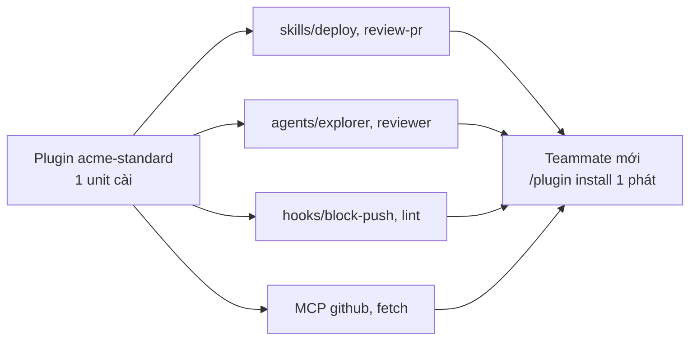

# 09 — Plugins và marketplaces: đóng gói cho team

> **Bài này cho ai:** dev đang giữ `.claude/` trong 1 repo và muốn chia sẻ skills, hooks, agents, MCP cho nhiều repo hoặc cả team.
> **Cần gì trước:** đã cài và đăng nhập Claude Code ([01-cai-dat-va-xac-thuc.md](./01-cai-dat-va-xac-thuc.md)); nên lướt [05 — Skills](./05-skills-custom-commands.md) và [07 — Hooks](./07-hooks-tu-dong-hoa.md) để biết plugin đóng gói những gì.
> **Đọc xong bạn làm được:**
> - Dùng được `/plugin` (Discover / Browse / Manage) và bộ lệnh `claude plugin ...` để tìm, cài, đánh giá, xem chi tiết plugin trước khi tin.
> - Quyết định được khi nào cần viết plugin, khi nào chỉ commit `.claude/` là đủ.
> - Tự viết 1 plugin từ zero (`plugin.json` + `skills/` + `agents/` + `hooks/` + `.mcp.json`) rồi publish lên marketplace riêng cho team.
> - Review plugin của người khác bằng checklist trust, test sandbox trước khi cho chạy trên máy thật.
> **Thời gian:** ~35 phút

## Thuật ngữ dùng trong bài này

Đọc bảng này trước khi vào mục 1 — mọi thuật ngữ Anh trong bài đều được giải thích ở đây.

| Thuật ngữ | Hiểu nôm na là gì | Ví dụ thấy ngay |
|---|---|---|
| Plugin | Bộ đóng gói trọn gói: skills + agents + hooks + MCP (+ LSP) — cài 1 lần là cả team có giống nhau | `/plugin` → Install from path `./acme-standard` |
| Marketplace | Cái kệ chứa nhiều plugin — chợ mà plugin đứng bán, liệt kê trong `marketplace.json` | Thêm repo `git@github.com:acme/claude-plugins.git` rồi browse |
| `plugin.json` (manifest) | Tờ khai hàng của plugin: tên, version, skills/hooks/MCP nào sẽ được nạp vào session | `.claude-plugin/plugin.json` |
| Namespaced | Skill của plugin gọi theo mẫu `tên-plugin:tên-skill` để 2 plugin cùng tên không đè nhau | `/acme-standard:deploy` |
| `${CLAUDE_PLUGIN_DIR}` | Biến trỏ tới folder plugin đang cài, thay vì hardcode path của máy bạn | `"command": "${CLAUDE_PLUGIN_DIR}/hooks/lint-on-write.sh"` |
| Trust / sandbox | Không tin ngay: đọc code trước, rồi test trong repo rẽ bằng | Tạo `/tmp/test-repo` rồi mới cài plugin lạ |
| Mods | Plugin sửa giao diện Claude Code — yêu cầu tin cậy cao hơn plugin thường, chỉ cài bản đã audit | Chi tiết ở [16 — Mods, bảo mật & validate](./16-mods-bao-mat-validate.md) |

## Mục lục

1. [Plugin là gì, vì sao team cần?](#1-plugin-là-gì-vì-sao-team-cần)
2. [Dùng plugin manager](#2-dùng-plugin-manager)
3. [Khi nào build plugin, khi nào không cần?](#3-khi-nào-build-plugin-khi-nào-không-cần)
4. [Viết plugin từ zero (plugin.json + cấu trúc folder)](#4-viết-plugin-từ-zero-pluginjson--cấu-trúc-folder)
5. [Publish + marketplace (share cho team/org/công khai)](#5-publish--marketplace-share-cho-teamorgcông-khai)
6. [Quyền và trust: checklist review trước khi cài](#6-quyền-và-trust-checklist-review-trước-khi-cài)
7. [Chạy thử trong sandbox trước khi tin](#7-chạy-thử-trong-sandbox-trước-khi-tin)
8. [Hai ví dụ plugin để bắt chước cấu trúc](#8-hai-ví-dụ-plugin-để-bắt-chước-cấu-trúc)
9. [Walkthrough nhờ Claude build plugin từ dotfiles](#9-walkthrough-nhờ-claude-build-plugin-từ-dotfiles-có-sẵn)
10. [Bẫy thường gặp và hiểu nhầm](#10-bẫy-thường-gặp-và-hiểu-nhầm)
11. [Bài tập thực hành](#11-bài-tập-thực-hành)
12. [FAQ plugins](#12-faq-plugins)
13. [Link chéo](#13-link-chéo)

---

## 1. Plugin là gì, vì sao team cần?

Mục tiêu: trả lời 2 câu trong 3 phút — plugin đóng gói những gì, và vì sao team nhiều repo cần plugin thay vì commit `.claude/`.

**Nôm na 1 câu:** Plugin là *combo cơm trưa văn phòng* — thay vì mỗi người tự đi chợ mua skills/hooks/agents/MCP lẻ tẻ, bếp nấu sẵn 1 khay (1 lệnh cài) ai cũng ăn giống nhau.

**Analogie đời thường:** như bộ đồ nghề sửa xe: lẻ thì tua-vít chỗ này, cờ-lê chỗ kia; plugin là vali đồ nghề đóng sẵn — thợ mới vào chỉ xách 1 vali (`/plugin install acme-standard`) là có đủ `/acme:deploy`, `/acme:review`, hooks guard, agents.

**Ví dụ kỹ thuật copy-paste (nhìn cấu trúc là hiểu):**

```text
acme-standard/
  .claude-plugin/plugin.json   # manifest: khai skills/agents/hooks/mcpServers
  skills/deploy/SKILL.md       # → /acme-standard:deploy (namespaced)
  agents/explorer.md           # subagent kèm
  hooks/block-main-push.sh     # guard kèm, dùng ${CLAUDE_PLUGIN_DIR}
  .mcp.json                    # MCP kèm, dùng ${VAR} không secrets
```

> **Ai dùng lúc nào:** team ≥3 repos hoặc onboarding ≥1 người/tháng (đây là ngưỡng build plugin — nói 1 lần ở đây, mục 3.2 chỉ trỏ lại). Dưới ngưỡng → commit `.claude/skills/` thẳng rẻ hơn.



**Giải thích từng bước:**
1. **1 unit đóng gói:** plugin.json liệt kê 4 loại tài sản (skills + agents + hooks + MCP/LSP). Version riêng, repo riêng.
2. **Namespaced:** skills gọi `/plugin:skill` nên 2 plugins cùng tên skill không đè nhau.
3. **1 phát đồng bộ:** teammate mới cài 1 lần, 5 repos đều có cùng workflow. Update bump version 1 nơi, cả team `/plugin → Update`.
4. **Trust:** hooks chạy shell trên máy bạn nên phải review plugin.json + `.sh` trước (checklist mục 6.1) — như kiểm đồ ăn trước khi ăn.

1 unit cài được, bundle: **skills + hooks + subagents + MCP servers (+ LSP/code-intelligence servers)**
→ thay vì mỗi teammate setup tay 4 thứ, cài 1 phát đồng bộ.

- Skills của plugin **namespaced**: `/my-plugin:review` → nhiều plugin cùng tồn tại.
- Thêm `.claude-plugin/plugin.json` vào folder skill → nó load như plugin tên `@skills-dir`
  (trong project `.claude/skills/` cần accept workspace trust dialog trước).

**Kiểm tra nhanh:** install plugin từ path local (`/plugin` → Install from path `./acme-standard`) rồi mở session mới: gõ `/` thấy lệnh `/acme-standard:deploy`; `/hooks` và `/mcp` cũng thấy hooks/MCP của plugin đã load.

### 1.1. Vì sao cần plugin?

`.claude/` commit theo repo giải quyết 1 repo. Team 10 repos + onboarding người mới mỗi tháng →
mỗi repo setup lại skills/hooks/agents/MCP = drift. Plugin giải quyết cross-repo:

```text
Không plugin:  teammate mới → clone 5 repos → mỗi repo /mcp setup tay + copy hooks + hỏi "skill deploy ở đâu?"
Có plugin:     teammate mới → /plugin install acme-standard → 5 repos đều có /acme:deploy, /acme:review, hooks guard, agents.
Update:        bump plugin version 1 nơi → cả team sync (thay vì sửa 5 repos).
```

---

## 2. Dùng plugin manager

Mục tiêu: chạy được pipeline "tìm → đọc → cài → kiểm tra → gỡ" trong 10 phút, và biết 3 lệnh CLI làm cùng việc khi bạn không mở session.

```text
/plugin   → Discover / Browse / Manage
```

Màn hình Browse/Discover hiện trước: commands, agents, skills, hooks, MCP/LSP servers của plugin —
đọc kỹ trước khi cài (nhất là hooks: nó sẽ chạy code trên máy bạn).

### 2.1. Walkthrough dùng plugin (10 phút)

```text
Bước 1: Trong session gõ /plugin → tab Discover (marketplaces đã add) / Browse (installed).
Bước 2: Chọn plugin (vd security-review) → đọc: skills nào? hooks nào? MCP nào? agents nào?
        → ĐẶC BIỆT đọc hooks (nó chạy shell trên máy bạn) + MCP (nó gọi ra ngoài).
Bước 3: Install → mở session MỚI (plugin load lúc start).
Bước 4: Gõ "/" → thấy /security-review:xxx namespaced. Test 1 skill.
Bước 5: /hooks + /mcp → xác nhận hooks/MCP của plugin đã load.
Bước 6: Không hợp → /plugin → Manage → Disable (test 1 tuần) → Uninstall.
```

```bash
# Aliases (tùy bản):
/plugin    # manager chính
/plugins   # alias
# Trong manager: Discover (tìm mới) / Browse (duyệt installed) / Manage (enable/disable/remove).
```

### 2.2. Lệnh CLI cho plugin (chạy ngoài session)

```bash
# Cùng việc như /plugin, nhưng gõ được ngay trong terminal:
claude plugin eval                  # đánh giá plugin trước khi tin — cần ≥2.1.269
claude plugin install --marketplace # cài plugin từ marketplace — cần ≥2.1.292
claude plugin details               # chi tiết plugin, gồm ước tính token cost
```

> Gõ `claude plugin --help` để xem cách gọi đúng ở bản của bạn — version khác nhau thì lệnh hiện khác nhau.
> Muốn audit sâu hơn (hooks/calls của mod trước khi cài): `claude plugin validate <mod>` — file chi tiết ở [commands/plugin-validate](./commands/knowledge-system/plugin-validate/README.md).

**Kiểm tra nhanh:** chạy đủ Bước 1–6 của walkthrough → plugin nằm trong `/plugin` → Manage (enabled), lệnh namespaced xuất hiện khi gõ `/`, `/hooks` + `/mcp` không còn trống, và gỡ được bằng Disable → Uninstall.

---

## 3. Khi nào build plugin, khi nào không cần?

Mục tiêu: chọn đúng mức đóng gói — tránh làm plugin cho 1 skill lẹt đẹt, cũng tránh commit `.claude/` tới lúc drift mới cuống.

### 3.1. Chọn theo tình huống

| Tình huống | Chọn | Ví dụ |
|---|---|---|
| 1–2 skills nội bộ, 1 repo | `.claude/skills/` commit thẳng | Skill deploy của 1 project |
| Bộ setup chuẩn (skills+hooks+agents+MCP) dùng nhiều repo | Plugin | `acme-standard` cho 10 repos |
| Share công khai / cross-org | Plugin + marketplace | Plugin open-source review chuẩn |
| Chỉ personal, không share | `~/.claude/skills/` | Preferences cá nhân |

Ví dụ plugin hay gặp: `security-review` (skill review + subagent + hook guard), code-intelligence
plugins cho typed languages (symbol navigation + error detection sau edit), frontend-polish
(vd Impeccable: `/audit /polish /distill /critique...` chống "AI slop").

### 3.2. So sánh với giải pháp nhẹ hơn (khi nào KHÔNG cần plugin?)

| Nhu cầu | Giải pháp nhẹ hơn plugin | Vì sao |
|---|---|---|
| 1 repo, 2 skills | `.claude/skills/` commit thẳng | Plugin overhead (repo riêng, version, publish) không đáng |
| Preferences cá nhân | `~/.claude/skills/` | Không share, không cần đóng gói |
| Việc chạy theo lịch | Routines `/schedule` (bài 12) | Plugin không chạy định kỳ |
| Hành động deterministic | Hooks trong repo (bài 07) | Plugin bundle hooks được, nhưng hook repo đơn giản hơn nếu chỉ 1 repo |
| Quy trình CI | `claude -p` jobs (bài 12) | Plugin sống trong session, CI cần non-interactive |

> Ngưỡng build plugin đã gộp ở mục 1 (đừng tính lại): tới ngưỡng mới làm plugin, dưới ngưỡng
> → `.claude/` commit thẳng rẻ hơn. Bảng trên trả lời câu phụ: nếu đã quyết KHÔNG làm plugin thì chọn cách nào.

---

## 4. Viết plugin từ zero (plugin.json + cấu trúc folder)

Mục tiêu: có 1 plugin chạy được ở máy bạn trong 10 phút — đủ folder, đủ manifest, gọi đúng namespaced.

### 4.1. Cấu trúc folder chuẩn

```text
acme-standard/                  # repo plugin (git riêng, version riêng)
  .claude-plugin/
    plugin.json                 # BẮT BUỘC: manifest
    marketplace.json            # (optional) nếu publish marketplace
  skills/
    deploy/SKILL.md             # → /acme-standard:deploy (namespaced)
    review-pr/SKILL.md
  agents/
    explorer.md                 # subagents kèm
    security-reviewer.md
  hooks/
    block-main-push.sh          # scripts hooks
    lint-on-write.sh
  .mcp.json                     # MCP servers kèm (dùng env placeholders!)
  README.md                     # install + usage + trust notes
```

### 4.2. `plugin.json` mẫu hoàn chỉnh (copy-paste)

```json
{
  "name": "acme-standard",
  "version": "1.0.0",
  "description": "Standard workflow cho team Acme: deploy, review-pr, guards, agents.",
  "author": "Acme Platform Team <platform@acme.example>",
  "license": "MIT",
  "skills": ["skills/deploy", "skills/review-pr"],
  "agents": ["agents/explorer.md", "agents/security-reviewer.md"],
  "hooks": {
    "PreToolUse": [
      { "matcher": "Bash", "type": "command", "command": "${CLAUDE_PLUGIN_DIR}/hooks/block-main-push.sh" }
    ],
    "PostToolUse": [
      { "matcher": "Edit|Write", "type": "command", "command": "${CLAUDE_PLUGIN_DIR}/hooks/lint-on-write.sh" }
    ]
  },
  "mcpServers": {
    "github": { "command": "npx", "args": ["@anthropic/mcp-github@latest"] },
    "fetch": { "command": "npx", "args": ["@modelcontextprotocol/server-fetch@latest"] }
  },
  "lspServers": {
    "typescript": { "command": "typescript-language-server", "args": ["--stdio"] }
  }
}
```

> `${CLAUDE_PLUGIN_DIR}` = folder plugin (tương tự `${CLAUDE_SKILL_DIR}` cho skill).
> Đừng hardcode path tuyệt đối — plugin cài ở máy khác path khác.

### 4.3. Từng thành phần (viết thế nào cho đúng)

```markdown
# skills/deploy/SKILL.md — như skill thường (bài 05), nhưng nhớ namespaced:
# Gọi: /acme-standard:deploy (không phải /deploy).
# description vẫn quyết định auto-trigger — viết đầy đủ từ khóa.

# agents/explorer.md — như agent thường (bài 06), nhưng BỊ BỎ QUA:
# hooks/mcpServers/permissionMode trong frontmatter (copy ra .claude/agents/ nếu cần).

# hooks/*.sh — như hook thường (bài 07), dùng ${CLAUDE_PLUGIN_DIR} cho path.
# .mcp.json — env placeholders ${VAR}, KHÔNG secrets (bài 08).
```

```bash
# Khung khởi tạo plugin từ zero (copy-paste):
mkdir -p acme-standard/{.claude-plugin,skills/{deploy,review-pr},agents,hooks}
cat > acme-standard/.claude-plugin/plugin.json <<'EOF'
{
  "name": "acme-standard",
  "version": "0.1.0",
  "description": "Standard workflow team Acme.",
  "skills": ["skills/deploy", "skills/review-pr"]
}
EOF
# Rồi copy SKILL.md từ bài 05 vào skills/*/, hooks từ bài 07 vào hooks/.
```

**Kiểm tra nhanh:** khung tạo xong → `/plugin` → Manage → Install from path `./acme-standard` cài được; mở session mới, gõ `/` thấy lệnh namespaced (ví dụ `/acme-standard:deploy`), `/hooks` thấy hook bạn vừa copy.

---

## 5. Publish + marketplace (share cho team/org/công khai)

Mục tiêu: chọn đúng 1 trong 3 cách share và có flow update không làm gãy workflow giữa sprint.

### 5.1. 3 cấp share (chọn theo nhu cầu)

| Cấp | Cách | Khi nào |
|---|---|---|
| **Path local** | `/plugin install ./acme-standard` | Dev/test plugin đang viết |
| **Git URL** | `/plugin install git@github.com:acme/claude-plugins.git` | Team nội bộ (private repo) |
| **Marketplace** | Add marketplace URL → Discover → Install | Org nhiều plugins / công khai |

```bash
# Team nội bộ (phổ biến nhất) — 1 repo plugins, mỗi folder 1 plugin:
# github.com/acme/claude-plugins/
#   acme-standard/.claude-plugin/plugin.json
#   security-review/.claude-plugin/plugin.json
# Teammate cài:
# /plugin → Add marketplace → git@github.com:acme/claude-plugins.git → Install acme-standard
```

```json
// .claude-plugin/marketplace.json (repo marketplace, liệt kê plugins):
{
  "name": "acme-marketplace",
  "plugins": [
    { "name": "acme-standard", "path": "./acme-standard", "version": "1.0.0" },
    { "name": "security-review", "path": "./security-review", "version": "2.1.0" }
  ]
}
```

> Từ bản ≥2.1.292 bạn cài thẳng từ terminal, không cần mở manager:
> `claude plugin install --marketplace` (xem thêm mục 2.2).

### 5.2. Versioning + update flow

```text
1. Bump version trong plugin.json (semver: breaking → major).
2. CHANGELOG entry: skills nào thêm/sửa? hooks nào đổi hành vi? (hooks đổi = highlight đỏ).
3. Tag git (vd acme-standard-v1.1.0).
4. Thông báo team: /plugin → Manage → Update. Teammate mở session mới để load bản mới.
5. Breaking hooks change → pin version cũ cho repos chưa sẵn sàng (đừng force update).
```

---

## 6. Quyền và trust: checklist review trước khi cài

Mục tiêu: có cửa chắn "không tin ai cho tới khi đọc code" — vì hooks của plugin chạy shell ngay trên máy bạn.

- Plugin subagents **bị bỏ qua** `hooks`/`mcpServers`/`permissionMode` → cần thì copy agent ra
  `.claude/agents/` hoặc `~/.claude/agents/`.
- Hooks của plugin chạy trên máy bạn → chỉ cài nguồn tin cậy, review `plugin.json` + scripts.
- Org có thể quản lý qua managed/server policy settings (Team/Enterprise — [bài 10](./10-permissions-modes-availability.md)).
- **Mods khác 1 bậc:** Mods là plugin sửa giao diện Claude Code, yêu cầu tin cậy cao hơn plugin
  thường — chỉ cài bản đã audit (chi tiết [bài 16](./16-mods-bao-mat-validate.md)).

Trước khi cài, 3 lệnh nên chạy (mục 2.2): `claude plugin eval` (cần ≥2.1.269) để đánh giá plugin,
`claude plugin validate <mod>` để soi hooks/calls, `claude plugin details` để xem ước tính token cost
— plugin tốn context mọi turn, nặng thì cân nhắc tách nhỏ.

### 6.1. Checklist review plugin trước khi cài (copy-paste)

- [ ] Đọc `plugin.json`: skills/agents/hooks/MCP/LSP nào sẽ load?
- [ ] Đọc từng hook `.sh`: có `rm -rf`? có `curl | bash`? có exfiltrate (`curl` gửi file đi)?
- [ ] MCP servers: có server lạ gọi URL ngoài? Credentials qua env?
- [ ] Skills: có `allowed-tools` quá rộng? Có dặn làm việc nguy hiểm (deploy prod auto)?
- [ ] Nguồn: marketplace chính thức / org private / cá nhân lạ? (lạ → sandbox test trước)
- [ ] Version pinned? (tránh auto-update breaking giữa sprint)

---

## 7. Chạy thử trong sandbox trước khi tin

Mục tiêu: chứng minh plugin không phá máy trước khi đưa vào repo thật — 6 bước, khoảng 10 phút.

```bash
# 1. Clone plugin vào /tmp, đọc plugin.json + từng hook .sh (checklist mục 6.1).
# 2. Cài từ path local vào repo THỬ (không phải repo thật):
cd /tmp/test-repo && git init && echo test > a.txt
# Trong session: /plugin → Install from path /path/to/plugin
# 3. Test từng skill namespaced: /<plugin>:<skill> với input vô hại.
# 4. Test hooks: prompt yêu cầu việc hook phải block → xác nhận deny.
# 5. /usage + /cost: plugin có phình context? disable skill ồn nếu cần.
# 6. Ổn mới cài vào repo thật + pin version.
```

---

## 8. Hai ví dụ plugin để bắt chước cấu trúc

Mục tiêu: mở 2 cấu trúc thật làm khuôn, sửa tên + nội dung là ra plugin của bạn.

**Ví dụ 1 — `security-review` (skill + subagent + hook guard):**

```text
security-review/
  .claude-plugin/plugin.json        # name, version, skills, hooks, agents
  skills/review/SKILL.md            # → /security-review:review (checklist OWASP)
  skills/review/references/owasp.md # checklist injection/authZ/secrets/crypto/SSRF
  agents/security-reviewer.md       # persona reviewer (copy mẫu bài 06 agent 3)
  hooks/guard-crypto.sh             # PreToolUse Write: block crypto tự chế (dùng lib chuẩn)
  README.md                         # install + trust notes (hooks làm gì, MCP nào)
```

**Ví dụ 2 — `frontend-polish` (chống "AI slop"):**

```text
frontend-polish/
  .claude-plugin/plugin.json
  skills/audit/SKILL.md             # → /frontend-polish:audit (quét UI smells)
  skills/polish/SKILL.md            # → /frontend-polish:polish (fix từng smell)
  skills/distill/SKILL.md           # rút design tokens từ UI mẫu
  skills/critique/SKILL.md          # adversarial review UI (như bài 06 pattern C)
  references/design-tokens.md       # spacing/type/color chuẩn team
```

---

## 9. Walkthrough nhờ Claude build plugin từ dotfiles có sẵn

Mục tiêu: biến bộ `.claude/` đã chạy ổn 2 tuần thành plugin có version, có checklist release — 25 phút.

```text
Bước 1: Chuẩn bị dotfiles trong 1 repo (skills + hooks + agents đã chạy ổn 2 tuần).
Bước 2: Prompt Claude (trong repo đó):
  "Đóng gói .claude/skills/deploy, .claude/skills/review-pr, .claude/hooks/block-main-push.sh,
   .claude/agents/explorer.md thành plugin acme-standard: viết plugin.json (dùng
   ${CLAUDE_PLUGIN_DIR}), README + trust notes, bỏ secrets khỏi .mcp.json (dùng ${VAR})."
Bước 3: Claude tạo folder acme-standard/ → bạn review plugin.json + hooks (checklist mục 6.1).
Bước 4: Test sandbox (mục 7) → publish git URL (mục 5.1) → teammate install thử.
Bước 5: Ghi CHANGELOG entry đầu tiên (version 0.1.0) + pin version cho repos production.
```

**Kiểm tra nhanh:** bạn có 1 plugin chạy được + 1 teammate verify install từ git URL.
Từ đây mọi update theo flow mục 5.2 (bump → CHANGELOG → tag → team update cuối sprint).

### 9.1. Checklist plugin production-ready (trước khi announce team)

- [ ] plugin.json version + skills/agents/hooks/MCP đầy đủ, paths dùng `${CLAUDE_PLUGIN_DIR}`.
- [ ] Mọi hook `.sh` đã review (checklist mục 6.1) + test sandbox (mục 7) pass.
- [ ] `.mcp.json` không secrets (grep `sk-|password|token` trống), dùng `${VAR}`.
- [ ] README có install (path/git/marketplace) + trust notes + version pinning.
- [ ] 1 teammate cài từ git URL thành công trên máy khác.
- [ ] CHANGELOG entry + git tag (`<plugin>-vX.Y.Z`).
- [ ] Lịch update: cuối sprint, không giữa sprint (trừ security fix).

---

## 10. Bẫy thường gặp và hiểu nhầm

Mục tiêu: nhận ra 11 lỗi người dùng plugin hay gặp nhất và cách fix ngay tại chỗ.

### 10.1. Pitfalls + fix

| Pitfall | Vì sao | Fix |
|---|---|---|
| Cài plugin lạ, hook xóa file | Không review hooks | Checklist mục 6.1; test trong container/sandbox trước |
| 2 plugins cùng tên skill → gọi nhầm | Không namespaced rõ | Luôn gọi `/plugin:skill` đầy đủ, không gọi tắt |
| Plugin agent hooks không chạy | Bị bỏ qua theo thiết kế | Copy agent ra `.claude/agents/` |
| Update plugin giữa sprint gãy workflow | Breaking change | Pin version, update cuối sprint, đọc CHANGELOG hooks |
| `.claude/skills/` cần trust dialog | Workspace chưa trust | Accept trust dialog 1 lần; CI `-p` không trusted → test riêng |
| Plugin phình (20 skills) → context nặng | Bundle quá nhiều | Tách plugin nhỏ theo domain (frontend/backend/security) |

### 10.2. Hiểu nhầm thường gặp

| Hiểu nhầm | Sự thật | Ai cần nhớ |
|---|---|---|
| "Plugin = marketplace" | Plugin là 1 món ăn; marketplace là cái kệ/chợ chứa nhiều món (`marketplace.json` liệt kê). | Người mới |
| "Update plugin tự động" | Không — vào Manage → Update tay + mở session mới. Sợ breaking thì pin version. | Mọi dev |
| "Plugin 1 skill cũng nên đóng gói" | Không đáng — overhead repo riêng/version/publish. 1-2 skills thì commit `.claude/skills/` thẳng. Ngưỡng: ≥3 repos dùng chung. | Team lead |
| "Agent plugin chạy hooks bình thường" | Bị bỏ qua `hooks/mcpServers/permissionMode` theo thiết kế — cần thì copy ra `.claude/agents/`. | Người viết plugin |
| "Cài plugin là tin luôn" | Hooks chạy shell + MCP gọi ra ngoài — phải qua checklist mục 6.1 + test sandbox (mục 7) trước khi tin. | Mọi người |

---

## 11. Bài tập thực hành

Mục tiêu: đi từ "xem cho biết" tới "có plugin team đang dùng" trong ~90 phút.

**Bài 1 (15 phút):** `/plugin` → Browse 3 plugins có sẵn. Điền bảng: mỗi plugin có skills/hooks/MCP/agents gì? Cái nào bạn sẽ cài?

**Bài 2 (25 phút):** Build plugin `my-standard` từ zero (mục 4): 1 skill (copy từ bài 05) + 1 hook (bài 07) + plugin.json. Install từ path local, test namespaced command.

**Bài 3 (20 phút):** Thêm agents + MCP vào plugin bài 2. Review trust checklist (mục 6.1) như thể bạn là người ngoài. Sửa chỗ nào đáng ngờ.

**Bài 4 (15 phút):** Publish lên git repo test (private). Teammate (hoặc máy thứ 2) install từ git URL. Verify version + update flow.

**Bài 5 (15 phút):** Lấy 1 plugin đã cài, tách nó thành 2 plugins nhỏ theo domain (vd frontend/backend).
So sánh context load (`/context`) trước/sau — có nhẹ hơn?

---

## 12. FAQ plugins

Mục tiêu: tra nhanh 8 câu hỏi lặp đi lặp lại trong review/PR mà không phải lội lại toàn bài.

| Câu hỏi | Trả lời |
|---|---|
| Plugin vs marketplace khác gì? | Plugin = 1 unit cài được; marketplace = kệ chứa nhiều plugins (repo + marketplace.json) |
| Update plugin có tự động? | Không — bạn vào Manage → Update tay, mở session mới để load. Pin version nếu sợ breaking |
| Skill plugin gọi thế nào? | Namespaced `/plugin:skill` (vd `/acme-standard:deploy`). Gõ `/` để thấy full list |
| Hooks plugin chạy khi nào? | Như hooks thường (bài 07), load lúc session start. Review trước khi cài — nó chạy shell máy bạn |
| Agent plugin sao hooks không chạy? | Thiết kế bỏ qua `hooks/mcpServers/permissionMode` — copy agent ra `.claude/agents/` nếu cần |
| `.claude/skills/` báo trust dialog? | Lần đầu cần accept workspace trust. CI `-p` không trusted → test riêng |
| Viết plugin 1 skill có đáng? | Không — 1-2 skills thì commit `.claude/skills/` thẳng. Plugin đáng khi bundle skills+hooks+agents+MCP cross-repo |
| Secrets trong plugin? | Cấm — MCP dùng `${VAR}` placeholders, secrets ở env máy/cloud (bài 08) |

---

## 13. Link chéo

Mục tiêu: mở đúng bài tiếp theo khi mục này trả lời chưa đủ chỗ.

- **[00 — Tổng quan](./00-tong-quan-claude-code.md)**: bản đồ mở rộng CLAUDE.md / skills / subagents / hooks / MCP / plugins.
- **[03 — CLAUDE.md](./03-claude-md-memory-rules.md)**: plugin vs committed `.claude/` 1 repo; trust dialog.
- **[04 — Slash commands](./04-slash-commands-toan-tap.md)**: `/plugin` manager (Discover/Browse/Manage) trong bảng 78 lệnh.
- **[05 — Skills](./05-skills-custom-commands.md)**: SKILL.md anatomy; namespaced `/plugin:skill`; `@skills-dir` trick.
- **[06 — Subagents](./06-subagents-agent-teams-parallel.md)**: plugin agents bị bỏ qua hooks/mcpServers/permissionMode.
- **[07 — Hooks](./07-hooks-tu-dong-hoa.md)**: review hooks trước khi cài; `${CLAUDE_PLUGIN_DIR}` paths.
- **[08 — MCP](./08-mcp-ket-noi-cong-cu-ngoai.md)**: bundle MCP servers (env placeholders, không secrets).
- **[10 — Permissions](./10-permissions-modes-availability.md)**: managed/server policy cho org; sandbox test plugin lạ.
- **[12 — SDK & CI](./12-agent-sdk-ci-cd-automation.md)**: `claude -p` jobs và routines `/schedule` thay plugin khi cần chạy nền.
- **[16 — Mods, bảo mật & validate](./16-mods-bao-mat-validate.md)**: audit plugin/mod (`claude plugin validate`, `claude plugin eval` ≥2.1.269) trước khi cài.
