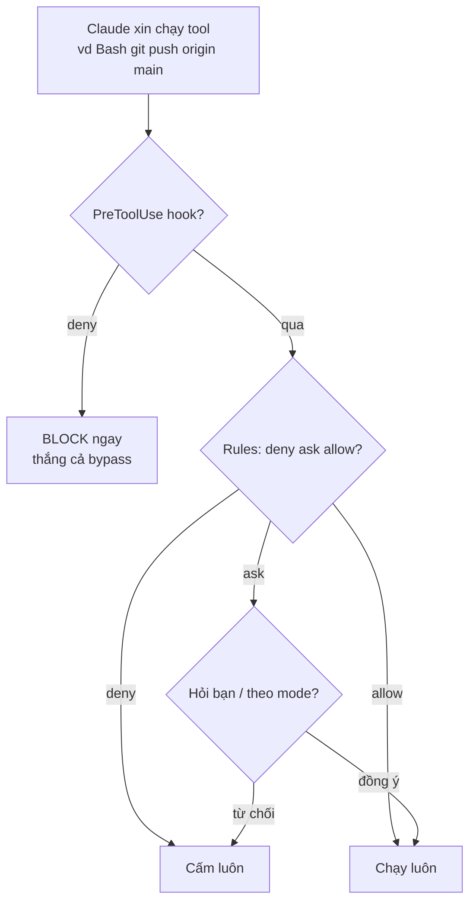

# 10 — Permissions, modes và tính khả dụng theo plan/provider

> **Bài này cho ai:** dev viết `settings.json` cho team, hay gặp "lệnh không tồn tại", hoặc muốn biết lúc nào được phép tự chạy lệnh mà không hỏi.
> **Cần gì trước:** đã cài và đăng nhập Claude Code ([01-cai-dat-va-xac-thuc.md](./01-cai-dat-va-xac-thuc.md)); nên đọc [07 — Hooks](./07-hooks-tu-dong-hoa.md) trước vì mục 1 có so sánh hook với rule.
> **Đọc xong bạn làm được:**
> - Viết được `settings.json` 3 cấp (team / personal / org managed) copy-paste, biết thứ tự thắng khi 2 scope đè nhau.
> - Đọc được rule matcher hiểu đúng: prefix-match lọt ở đâu, việc critical vì sao phải nâng thành hook.
> - Chọn đúng permission mode cho từng task (`default` / `acceptEdits` / `plan` / `auto` / `bypassPermissions`).
> - Tra được bảng tính khả dụng khi "lệnh không tồn tại": lỗi do version, do provider hay do plan.
> **Thời gian:** ~35 phút

## Thuật ngữ dùng trong bài này

Đọc bảng này trước khi vào mục 1 — mọi thuật ngữ Anh trong bài đều được giải thích ở đây.

| Thuật ngữ | Hiểu nôm na là gì | Ví dụ thấy ngay |
|---|---|---|
| Permission (quyền) | Cửa chắn giữa model và máy bạn: model xin → harness đối chiếu luật → cho hỏi hay cấm | `Read` thì đi qua, `rm -rf` thì dừng |
| `allow` / `ask` / `deny` | 3 mức quyết định: cho chạy hỏi lại hay cấm luôn | `Bash(pnpm test:*)` allow, `Write(.env*)` deny |
| Scope (3 cấp settings) | 3 tầng luật chồng lên nhau: team → personal (local) → org managed | `.claude/settings.json` commit, `.claude/settings.local.json` không commit |
| Matcher (prefix) | Cách rule khớp lệnh: khớp đầu chuỗi + tên tool, không phải regex đầy đủ | `Bash(git diff:*)` chỉ bắt `git diff...` |
| Permission mode | Mức "mẹ đang bận hay rảnh để hỏi" — xoay bằng Shift+Tab | `plan` read-only, `bypassPermissions` chỉ cho CI |
| `PreToolUse` hook | Chốt chặn chạy trước khi tool chạy, thắng cả rule lẫn bypass | `block-main-push.sh` chặn push thẳng lên main |
| Availability (tính khả dụng) | Feature có ở plan/provider nào — không phải lệnh nào cũng có mọi nơi | Bedrock không có fast mode → "lệnh không tồn tại" |
| Auto mode | Chế độ tự tiến xa, có classifier duyệt quyền thay bạn | Task dài có test gate → bật `auto` |
| Mod | Mã JS/TS chạy ngay trong CLI, mở rộng được cả giao diện | Chi tiết và cách audit ở [bài 16](./16-mods-bao-mat-validate.md) |

## Mục lục

1. [Permissions là gì, vì sao cần?](#1-permissions-là-gì-vì-sao-cần)
2. [Rule matcher hoạt động thế nào (prefix, không phải regex shell)](#2-rule-matcher-hoạt-động-thế-nào-prefix-không-phải-regex-shell)
3. [Thứ tự thắng và bộ pattern khuyến nghị](#3-thứ-tự-thắng-và-bộ-pattern-khuyến-nghị)
4. [Settings.json mẫu 3 cấp (copy-paste)](#4-settingsjson-mẫu-3-cấp-copy-paste)
5. [Permission modes (Shift+Tab để xoay)](#5-permission-modes-shifttab-để-xoay)
6. [Tính khả dụng: không phải feature nào cũng có ở mọi nơi](#6-tính-khả-dụng-không-phải-feature-nào-cũng-có-ở-mọi-nơi)
7. [Walkthrough setup permissions chuẩn (15 phút)](#7-walkthrough-setup-permissions-chuẩn-15-phút)
8. [Bẫy thường gặp và hiểu nhầm](#8-bẫy-thường-gặp-và-hiểu-nhầm)
9. [Bài tập thực hành](#9-bài-tập-thực-hành)
10. [Gặp "lệnh không tồn tại" thì tra đâu?](#10-gặp-lệnh-không-tồn-tại-thì-tra-đâu)
11. [FAQ permissions](#11-faq-permissions)
12. [Mod-override và an toàn khi chạy mod](#12-mod-override-và-an-toàn-khi-chạy-mod)
13. [Link chéo](#13-link-chéo)

---

## 1. Permissions là gì, vì sao cần?

Mục tiêu: trả lời 1 câu nền rồi đọc được sơ đồ "lệnh bị chặn ở tầng nào" — để bạn biết mỗi khi Claude không được chạy lệnh X thì ai chặn.

**Nôm na 1 câu:** Permissions là *bảo vệ cổng chung cư* — chủ (bạn) dặn trước: shipper quen (Read, git diff) cho lên thẳng; khách lạ (Edit, push) phải gọi hỏi; trộm (rm -rf, push main) cấm cửa luôn.

**Analogie đời thường:** như dạy con cầm dao: dao nhựa (Read/Glob/Grep) chơi tự do; dao bếp (Edit/Write/docker) phải hỏi mẹ; dao chặt xương + ổ điện (sudo, rm -rf, đọc .env) cấm tuyệt đối. Modes (Shift+Tab) là mức "mẹ đang bận hay đang rảnh để hỏi".

**Ví dụ kỹ thuật copy-paste (rule hẹp tốt vs rộng xấu):**

```json
// settings.json — hẹp (tốt): chỉ cho test/lint chạy luôn, còn lại hỏi
{ "permissions": {
  "allow": ["Read", "Bash(pnpm test:*)", "Bash(git diff:*)"],
  "ask": ["Edit", "Write", "Bash(pnpm:*)", "Bash(git push:*)"],
  "deny": ["Bash(rm -rf:*)", "Bash(git push origin main:*)", "Write(.env*)"]
} }
```

> **Ai dùng lúc nào:** mọi dev từ ngày 1 (kể cả solo) — vì prompt-injection từ issue text độc có thể dụ agent chạy lệnh xóa/exfiltrate nếu không có gate.



**Giải thích từng bước:**
1. **Hook trước:** `PreToolUse` deny thắng TẤT CẢ (kể cả `--dangerously-skip-permissions`). Đây là chốt chặn cuối cho việc critical.
2. **Rules:** `deny > ask > allow` trong cùng scope; `managed (org) > local > team settings > defaults` giữa các scope.
3. **Ask theo mode:** `default` hỏi nhiều; `acceptEdits` tự sửa file; `plan` read-only; `auto` tự tiến xa; `bypass` chỉ CI sandbox. Cloud chỉ Accept/Plan(/Auto).
4. **Hook allow không nới:** thiết kế chỉ siết — muốn nới phải sửa deny gốc, đừng thêm hook allow.

Agent có quyền chạy shell + sửa file = sức mạnh + rủi ro. Permissions là harness gate giữa
model và máy bạn: model xin → harness đối chiếu rules → cho/hỏi/cấm. Không có gate này,
1 prompt-injection (issue text độc) có thể khiến agent chạy `rm -rf` hay exfiltrate `.env`.

- Read-only thường chạy không hỏi; **edit file + shell** tuân permission mode + rules.
- Quản lý: `/permissions` (alias `/allowed-tools`) — xem rules theo scope, thêm/xóa, quản lý working dirs,
  review auto-mode denials gần đây.
- File: `.claude/settings.json` (team, commit) vs `.claude/settings.local.json` (personal, không commit),
  cộng managed policy (org) — xem merged result ở `/permissions`, đừng đoán.
- Rules **không phải shell security parser**: command tương đương qua binary khác có thể lọt —
  việc thật sự critical thì dùng **hook + OS sandbox**, đừng chỉ trông vào rules.
- Hooks `PreToolUse` deny thắng cả `bypassPermissions`; hook allow không nới được deny/`ask` của org.

### 1.1. 3 loại quyết định

| Quyết định | Ý nghĩa | Khi dùng |
|---|---|---|
| `allow` | Chạy luôn, không hỏi | Read-only + lệnh an toàn lặp lại (`git diff`, `pnpm test` focused) |
| `ask` | Hỏi bạn mỗi lần (hoặc theo mode) | Edit, Write, push, deploy — muốn mắt người |
| `deny` | Cấm luôn (hook allow cũng không nới được) | `rm -rf`, push main, đọc `.env`, writes ngoài repo |

**Kiểm tra nhanh:** dán file settings ở trên vào session → `/permissions` hiện 3 tabs Allow/Ask/Deny đã merge; lệnh `git diff --stat` chạy luôn không hỏi; prompt "sửa file help" thì hỏi; lệnh đọc `.env` bị block ngay.

---

## 2. Rule matcher hoạt động thế nào (prefix, không phải regex shell)

Mục tiêu: đọc 1 dòng rule và dự đoán đúng lệnh nào bị bắt, lệnh nào lọt — vì sai ở đây là lọt hoặc chặn oan.

Rules match theo **prefix + tool name**, KHÔNG phải regex shell đầy đủ (trừ hooks tự viết).

```text
Rule examples (trong settings.json permissions):
  "Read"                    → mọi Read (rộng)
  "Bash(pnpm test:*)"       → Bash command bắt đầu bằng "pnpm test" (hẹp, tốt)
  "Bash(git diff:*)"        → chỉ git diff*
  "Write(.env*)"            → Write path bắt đầu .env (deny đọc secrets)
  "Bash(rm -rf:*)"          → deny prefix nguy hiểm
```

### 2.1. Prefix matching — cái bẫy lớn nhất

```text
Rule "Bash(git push origin main:*)" match:
  ✓ "git push origin main"
  ✓ "git push origin main --tags" (prefix khớp)
  ✗ "git push origin HEAD:main" (không bắt đầu bằng chuỗi đó → LỌT!)
  ✗ "git push -f origin main" (flag chen giữa → LỌT!)

→ Bài học: rules là allowlist tiện lợi, KHÔNG phải security boundary.
   Chặn push main CHẮC CHẮN → PreToolUse hook match theo intent (bài 07 hook 2).
```

### 2.2. Lọt qua binary khác (vì sao rules không đủ cho việc critical)

```text
Deny "Bash(rm:*)" nhưng agent chạy:
  - "python3 -c 'import shutil; shutil.rmtree(...)'" → LỌT (không phải Bash rm)
  - "/bin/rm -rf ..." → có thể LỌT tùy matcher normalize
  - "git clean -fdx" → xóa files mà không match rm!

→ Việc critical (prod data, secrets, deploy): hook + sandbox + deny, không chỉ rules.
```

### 2.3. Deny-bypass đã fix ở v2.1.288/289 (đừng dựa vào bản cũ)

> Nếu bạn ở bản <2.1.288: update trước khi tin deny rules. Kiểm tra:
> `claude --version` + `npm view @anthropic-ai/claude-code dist-tags`
> (lúc viết bài này bản fix nằm ở 2.1.288/289, bản mới nhất tra ở
> [WRITING-STYLE — Phần B](../WRITING-STYLE.md#phần-b--dữ-kiện-chuẩn-làm-tròn-thời-gian-07102026) —
> ví dụ v2.1.292 ngày 06/10/2026 — `latest` thường chứa fix trước `stable`).

Các kiểu lách đã vá (compound/env-prefix/bare-assign/symlink/nested-mod):

```text
1. Compound &&/||/|/; — chỉ check prefix allow:
   allow "Bash(git status:*)" + deny "Bash(rm:*)" nhưng chạy
   "git status && rm -rf /tmp/x" → bản cũ chỉ check prefix "git status" → LỌT.
   Fix 2.1.288/289: tách từng segment compound rồi đối chiếu từng cái.
2. Env-prefix: 'TZ="$HOME" rm -rf ...' / 'FOO=bar rm ...' → matcher cũ thấy "TZ=..." không phải "rm" → LỌT.
3. Bare assignment: 'FOO=bar' đứng riêng / đầu lệnh để đánh lừa parser.
4. Symlink: '/tmp/link-to-rm' (symlink → /bin/rm) → resolve realpath trước khi match.
5. Nested mod approval: mod con xin approve lồng trong mod cha → chỉ giữ trên managed machines.
```

Quy tắc phòng thủ (áp dụng cả khi đã update):

- **Deny interpreter, không chỉ deny binary**: thêm `Bash(bash -c:*)`, `Bash(sh -c:*)`,
  `Bash(python3 -c:*)`, `Bash(node -e:*)` vào deny khi việc critical — kẻ lách đổi interpreter chứ không đổi lệnh.
- **Nghi ngờ cả allow rules**: allow prefix rộng (`Bash(git:*)`, `Bash(npm:*)`) là mặt lách compound/env-prefix.
  Giữ allow hẹp (`Bash(git diff:*)`), còn lại `ask`.
- **Negative test từ changelog**: sau mỗi update đọc changelog, viết 1 prompt cố lách deny cũ
  (compound, env-prefix, symlink) lên môi trường test + hook `bash-guard.sh` (templates) — phải BLOCK mới đạt.

---

## 3. Thứ tự thắng và bộ pattern khuyến nghị

Mục tiêu: biết luật nào đè luật nào khi 2 file settings xung đột, và có dải allow/ask/deny dùng được ngay.

### 3.1. Thứ tự thắng (precedence)

```text
deny > ask > allow  (trong cùng scope)
managed (org) > settings.local (personal) > settings.json (team) > defaults
```

- `deny` ở bất kỳ scope nào cũng thắng `allow` nơi khác (an toàn mặc định).
- Hook `PreToolUse` deny thắng TẤT CẢ kể cả `bypassPermissions`.
- Hook allow KHÔNG thắng được `deny` rules hay `ask` của org (hooks chỉ siết, không nới).

```bash
# Xem merged result (đừng đoán — xem thật):
# Trong session:
/permissions
# → tabs: Allow / Ask / Deny theo scope (team/local/managed) + working dirs + recent auto-denials.
```

### 3.2. Patterns allow/ask/deny khuyến nghị

```text
ALLOW (chạy luôn — an toàn + lặp lại):
  Read, Glob, Grep
  Bash(git diff:*)  Bash(git status:*)  Bash(git log:*)
  Bash(pnpm test:*)  Bash(pnpm lint:*)  (focused, không phải pnpm publish!)

ASK (hỏi — có side effects):
  Edit, Write
  Bash(pnpm:*)  (rộng hơn test/lint — hỏi vì có install/publish)
  Bash(git push:*)  Bash(git commit:*)
  Bash(docker:*)  Bash(kubectl:*)

DENY (cấm — nguy hiểm/không bao giờ trong agent):
  Bash(rm -rf:*)  Bash(sudo:*)  Bash(chmod 777:*)
  Bash(git push origin main:*)  Bash(git push origin master:*)
  Write(.env*)  Read(.env*)  Write(*credentials*)  Write(*secret*)
  Bash(curl *|sh:*)  (pipe-to-shell)
```

---

## 4. Settings.json mẫu 3 cấp (copy-paste)

Mục tiêu: có 3 file settings chạy thật cho team, cá nhân và org — mỗi cấp 1 file, không trộn lẫn.

### 4.1. Cấp 1 — Team (`.claude/settings.json`, COMMIT)

```json
{
  "$schema": "https://claude.ai/code/settings-schema.json",
  "permissions": {
    "allow": [
      "Read", "Glob", "Grep",
      "Bash(git diff:*)", "Bash(git status:*)", "Bash(git log:*)",
      "Bash(pnpm test:*)", "Bash(pnpm lint:*)"
    ],
    "ask": ["Edit", "Write", "Bash(pnpm:*)", "Bash(git push:*)", "Bash(git commit:*)", "Bash(docker:*)"],
    "deny": [
      "Bash(rm -rf:*)", "Bash(sudo:*)",
      "Bash(git push origin main:*)", "Bash(git push origin master:*)",
      "Write(.env*)", "Read(.env*)"
    ]
  },
  "hooks": {
    "PreToolUse": [
      { "matcher": "Bash", "type": "command",
        "command": "${CLAUDE_PROJECT_DIR}/.claude/hooks/block-main-push.sh" }
    ],
    "PostToolUse": [
      { "matcher": "Edit|Write", "type": "command",
        "command": "${CLAUDE_PROJECT_DIR}/.claude/hooks/lint-on-write.sh" }
    ]
  }
}
```

### 4.2. Cấp 2 — Personal (`.claude/settings.local.json`, KHÔNG commit)

```json
{
  "permissions": {
    "allow": [
      "Bash(gh pr view:*)",
      "Bash(gh issue view:*)",
      "Bash(pnpm --filter @acme/api test:*)"
    ],
    "ask": [],
    "deny": []
  }
}
```

> Personal chỉ NỚI cái team chưa cover cho workflow riêng bạn. Đừng deny trong personal
> để lách team allow — deny personal thắng nhưng gây confusion khi debug chung.

### 4.3. Cấp 3 — Org managed (Team/Enterprise admin)

```text
Admin console → Settings → Managed policy (JSON tương tự, thêm):
- enforce deny: Write(*prod*), Bash(kubectl delete:*), WebFetch(intranet-blocklist)
- enforce ask: mọi Bash ngoài allowlist team
- gateway routing (Desktop), SSO/SCIM, audit logs, ZDR (Zero Data Retention)
Chi tiết: docs org admin + bảng mục 6 (Analytics/server settings chỉ Team/Ent).
```

```bash
# Xem kết quả merge của cả 3 cấp (chạy trong session):
/permissions
```

**Kiểm tra nhanh:** team rules hiện, personal rules merge vào, managed có deny nào đè lên không. Đổi working dirs thử: `/add-dir ../shared` (cần trust), `/cd ~/code/other` (giữ cache).

---

## 5. Permission modes (Shift+Tab để xoay)

Mục tiêu: chọn đúng mode trong 5 giây thay vì mặc `bypassPermissions` cho mọi việc.

```text
default → acceptEdits → plan → auto → bypassPermissions
```

| Mode | Hành vi | Khi dùng | Ví dụ |
|---|---|---|---|
| `default` | Hỏi khi cần | Mặc định hàng ngày | Code thường |
| `acceptEdits` | Tự sửa file, push branch (cloud default) | Tin task, muốn nhanh | Refactor đã duyệt plan |
| `plan` | **Read-only**: outline thay đổi, chờ duyệt mới được code | Mọi task multi-file/kiến trúc (phản xạ) | Task mới, chưa rõ scope |
| `auto` | Tự tiến xa, ít hỏi (classifier duyệt quyền — chạy server-side từ w34/2026 — + deny rules lưng) | Task dài có verification gate | Overnight migrate + test gate |
| `bypassPermissions` (`--dangerously-skip-permissions`) | Bỏ hỏi | **Chỉ CI sandbox** — không dùng máy dev | CI runner ephemeral (bài 12) |

> **Auto mode:** ra mắt từ w13/2026; từ **w34/2026 classifier duyệt quyền (thay bạn) chạy server-side** —
> số liệu và mốc thời gian theo [WRITING-STYLE — Phần B](../WRITING-STYLE.md#phần-b--dữ-kiện-chuẩn-làm-tròn-thời-gian-07102026).

Cloud sessions (Web): chỉ Accept edits / Plan (/Auto tùy bản) — không Manual/Bypass.

### 5.1. Chọn mode theo task (cheat)

```text
Task mới, chưa hiểu scope → plan (đọc + outline, không sửa).
Task đã duyệt plan, implement → acceptEdits (đỡ bị hỏi mỗi file).
Task dài 1 giờ, có test gate → auto (tự chạy, deny lưng bảo vệ).
CI ephemeral → bypassPermissions + sandbox + allowlist hẹp (bài 12).
Máy dev hàng ngày → default (cân bằng).
```

```bash
# Đổi mode (3 cách):
# 1. Shift+Tab trong REPL (xoay vòng).
# 2. Lệnh khởi động: claude --permission-mode plan
# 3. Per-agent frontmatter: permissionMode: plan (bài 06).
```

---

## 6. Tính khả dụng: không phải feature nào cũng có ở mọi nơi

Mục tiêu: trước khi kết luận "bug", đã lọc được 3 nguyên nhân — version, provider, plan — bằng đúng bảng tra.

**Chạy local (CLI + IDE + Agent SDK + subagents/hooks/skills/CLAUDE.md/plugins/MCP/checkpoints/sandbox/workflows/OTel...)**: có trên **mọi provider**.

**Bắt buộc Claude subscription (claude.ai sign-in)**: Web, Mobile, Slack, Desktop app full,
Routines (`/schedule`), Ultraplan/Ultrareview (ultraplan **đã bị gỡ w32/2026**, 03–07/8/2026 —
thay bằng plan mode hoặc Claude Code trên web), Code Review (Team/Enterprise), Remote Control,
Chrome extension, Computer use (Pro/Max), Artifacts (Pro/Max/Team/Enterprise tùy admin), Voice dictation.

### 6.1. Khác nhau theo provider (full table)

| Khả năng | Sub | Console | Bedrock | AWS Plat | GCP | Foundry |
|---|---|---|---|---|---|---|
| Local full (CLI/IDE/SDK/hooks/skills/MCP/...) | ✓ | ✓ | ✓ | ✓ | ✓ | ✓ |
| Web search | ✓ | ✓ | ✗ | ✓ | tùy | ✓ (hosted on Anthropic) |
| Fast mode | ✓ | ✓ | ✗ | ✗ | ✗ | ✗ |
| Auto mode | ✓ | ✓ | tùy note | ✓ | tùy | tùy |
| Advisor / Channels | ✓ | ✓ | ✗ | ✗ | ✗ | ✗ |
| `/loop` scheduled | ✓ | ✓ | tùy | tùy | tùy | tùy |
| GH Actions / GitLab CI | ✓ | ✓ | ✓ | ✓ | ✓ | ✗ |
| Analytics/server settings | Team/Ent | Team/Ent | ✗ | ✗ | ✗ | ✗ |
| `/design-sync`, `/radio` | ✓ | ✓ | ✗ | ✗ | ✗ | ✓* |
| Web/Mobile/Slack/Routines/Remote | ✓ (sign-in) | ✗ | ✗ | ✗ | ✗ | ✗ |

Vắng trên Bedrock/AWS/GCP thêm: `/design-sync`, `/radio`. Trên Foundry: CI/CD GitHub thiếu.
Chi tiết: docs `feature-availability`. Gặp "lệnh không tồn tại" → check provider + version trước khi kết luận bug.

### 6.2. Theo plan (sign-in claude.ai)

| Feature | Pro | Max | Team | Enterprise |
|---|---|---|---|---|
| Web / Routines / Remote / Computer use / Dispatch | ✓ | ✓ | ✓/admin | ✓/admin |
| Code Review | ✗ | ✗ | ✓ | ✓ |
| Ultraplan/Ultrareview | ✓* | ✓ | ✓ | ✓ |
| Artifacts | ✓ | ✓ | ✓ | admin-enabled |
| Analytics dashboard | ✗ | ✗ | ✓ | ✓ (+ API) |
| Server-managed settings / SSO | ✗ | ✗ | ✓ | ✓ (+SCIM/Compliance/ZDR) |
| Slack integration | ✓* | ✓* | admin-enabled | admin-enabled |

> `*` = cần admin enable hoặc giới hạn theo bản. Check docs plan hiện hành trước khi hứa với team.
> Dòng Ultraplan/Ultrareview: **`/ultraplan` đã bị gỡ w32/2026 (03–07/8/2026)**, thay bằng plan mode
> hoặc Claude Code trên web — giữ dòng trong bảng để tra tài liệu cũ còn nhắc tới.

---

## 7. Walkthrough setup permissions chuẩn (15 phút)

Mục tiêu: đi từ `/permissions` trống tới bộ rule 3 cấp đã commit và đã test 3 tình huống.

```text
Bước 1: /permissions → xem hiện tại (trống hay đã có? scope nào?).
Bước 2: Copy settings team (mục 4.1) vào .claude/settings.json. Commit.
Bước 3: Thêm personal nới (mục 4.2) vào .claude/settings.local.json. KHÔNG commit.
```

**Kiểm tra nhanh:** chạy 3 test trong session —
(1) prompt "đọc file .env giúp anh" phải hỏi hoặc block;
(2) "git diff --stat" chạy luôn không hỏi;
(3) "git push origin main" bị hook block kể cả đang ở acceptEdits.
Rồi `/permissions` → review auto-denials: cái nào deny oan thì pre-approve lệnh read-only đó.

---

## 8. Bẫy thường gặp và hiểu nhầm

Mục tiêu: nhận ra 15 lỗi Permissions hay gặp nhất (10 bẫy + 5 hiểu nhầm) và fix ngay tại chỗ.

### 8.1. Pitfalls + fix

| Pitfall | Vì sao | Fix |
|---|---|---|
| Allow `Bash(*)` cho tiện | Đưa chìa khóa nhà | Scope hẹp (`Bash(pnpm test:*)`), còn lại ask |
| Tưởng rules chặn được mọi cách xóa | Rules prefix-only, lọt binary khác | Critical → hook + sandbox (bài 07) |
| Tin deny bản cũ (<2.1.288) | Compound/env-prefix/symlink lọt | Update ≥2.1.289 (`npm view dist-tags` + `claude --version`); negative test mục 2.3 |
| Chỉ deny `rm`, quên interpreter | Lách qua `bash -c`/`python3 -c` | Deny thêm `Bash(bash -c:*)`, `Bash(python3 -c:*)`... |
| Tin mod Pro/Max không managed là an toàn | Mod có thể tự approve qua ask/PreToolUse-user/deny | Mitigations: safe-mode, `disableAllHooks`, `--bare` (mục 12) |
| Hook allow không nới được deny | Thiết kế (chỉ siết) | Sửa deny rule gốc, đừng thêm hook allow |
| `bypassPermissions` trên máy dev | Copy từ CI example | Chỉ CI sandbox; máy dev dùng auto + rules |
| Cloud thiếu Manual/Bypass mà ngạc nhiên | Cloud policy | Cloud chỉ Accept/Plan(/Auto) — thiết kế an toàn |
| "Lệnh không tồn tại" → kết luận bug | Quên check provider/plan | Tra bảng mục 6 + `/status` trước |
| Deny oan lệnh read-only lặp lại | Chưa pre-approve | `/permissions` → review denials → allow read-only đó |

### 8.2. Hiểu nhầm thường gặp

| Hiểu nhầm | Sự thật | Ai cần nhớ |
|---|---|---|
| "Deny trong settings là chặn tuyệt đối" | Vẫn lọt qua interpreter khác (`python3 -c`), symlink, compound `&&` ở bản cũ. Việc critical cần hook + sandbox, không chỉ rules. | Mọi dev |
| "`bypassPermissions` cho nhanh trên máy dev" | Chỉ CI ephemeral sandbox. Máy dev dùng `default/auto` + rules hẹp, không là 1 prompt độc xóa sạch. | Người thích tốc độ |
| "Hook allow mở được deny của org" | Không — hooks chỉ siết. Org `ask`/deny luôn thắng hook allow. | Người debug org policy |
| "Cloud modes giống local" | Cloud (Web) chỉ Accept edits / Plan (/Auto tùy bản) — không Manual/Bypass. Ngạc nhiên là do chưa đọc mục 5. | Người dùng Web/cloud |
| "Provider nào features cũng như nhau" | Bedrock mất web search/fast mode/`/design-sync`/`/radio`; Foundry mất GH CI; Code Review chỉ Team/Ent. "Lệnh không tồn tại" → tra bảng mục 6 trước. | Team multi-provider |

---

## 9. Bài tập thực hành

Mục tiêu: tự tay chứng minh rule lọt thế nào, và biết đúng thứ mình thiếu khi tra bảng khả dụng.

**Bài 1 (15 phút):** Setup 2 files settings (mục 4.1 + 4.2). Test 4 prompts: read-only (cho qua),
edit (hỏi), push main (block), đọc .env (block). Ghi kết quả.

**Bài 2 (15 phút):** Thử 5 modes (Shift+Tab) trên cùng 1 task nhỏ. Ghi khác biệt số lần hỏi + `/cost`.

**Bài 3 (15 phút):** Viết 1 rule matcher cố ý sai (prefix lọt `HEAD:main`). Chứng minh lọt bằng
hook test script (bài 07 mục 6.2). Sửa bằng hook intent-match.

**Bài 4 (15 phút):** Tra bảng mục 6: team bạn (plan + provider gì) thiếu features nào? Lập bảng
"có/không" cho 10 features team quan tâm. Ghi workaround cho cái thiếu.

---

## 10. Gặp "lệnh không tồn tại" thì tra đâu?

Mục tiêu: có 6 bước tra cố định, đi đúng thứ tự từ cheap (version) tới nặng (báo bug) — đừng phán vội.

```text
"Lệnh X không tồn tại / không chạy?"
├─ 1. /status → version bao nhiêu? (đối chiếu version floor bài 01: /cd ≥.169, /goal ≥.139...)
│     → thiếu → claude update.
├─ 2. Provider gì? (Subscription / Console / Bedrock / AWS / GCP / Foundry)
│     → tra bảng mục 6.1: Bedrock mất web search/fast mode//design-sync//radio; Foundry mất GH CI...
├─ 3. Plan gì? (Pro/Max/Team/Ent — mục 6.2: Code Review chỉ Team/Ent, Analytics chỉ Team/Ent...)
├─ 4. Surface gì? (Cloud chỉ Accept/Plan, không Manual/Bypass — mục 5)
├─ 5. Gõ "/" xem list thực tế — có thể lệnh đổi tên theo bản (vd /allowed-tools ≡ /permissions).
└─ 6. Vẫn không có → 03-FAQ/ hoặc /bug báo Anthropic (kèm /status + version).
```

---

## 11. FAQ permissions

Mục tiêu: trả lời nhanh 6 câu hay bị hỏi trong review mà không phải mở lại toàn bài.

| Câu hỏi | Trả lời |
|---|---|
| Rules có chặn được mọi lệnh nguy hiểm? | Không — prefix-match, lọt binary khác (mục 2). Critical → hook + sandbox |
| Hook allow có nới deny được? | Không — hooks chỉ siết. Sửa deny rule gốc |
| `bypassPermissions` bao giờ dùng? | Chỉ CI sandbox ephemeral. Máy dev → `default/auto` + rules hẹp |
| Cloud sao không có Bypass? | Thiết kế an toàn — cloud chỉ Accept/Plan(/Auto tùy bản) |
| Deny oan lệnh read-only? | `/permissions` → recent auto-denials → pre-approve lệnh đó |
| Personal vs team settings xung đột? | Deny thắng allow; managed đè cả 2. Xem merged ở `/permissions`, đừng đoán |

---

## 12. Mod-override và an toàn khi chạy mod

Mục tiêu: hiểu vì sao deny không phải chốt cuối khi máy bạn có mod, và 4 mitigation để chạy mod lạ mà không phải bỏ precautions.

> Trên máy Pro/Max **không** managed policy: mod (in-process JS/TS, bài 16) có thể approve
> request của chính nó qua `ask` / `PreToolUse`-user / `deny` passthrough — tức deny rules
> không còn là chốt cuối với mod độc. Đây là thiết kế extensibility, không phải bug deny-bypass mục 2.3.
> **Mods** (plugin sửa giao diện Claude Code) còn có yêu cầu tin cậy cao hơn plugin thường —
> chỉ cài bản đã audit.

Mitigations (chọn 1+ khi chạy mod lạ — chi tiết bài 16):

- **safe-mode**: chỉ cho mod calls đọc (`$.fs.read`, `$.model.complete`), chặn `run/spawn/write/fetch`.
- **`disableAllHooks`**: tắt hooks mod đăng ký khi nghi prompt.submit/ui.render giả mạo.
- **`--bare`**: chạy CLI trần không load mod/plugin lạ để review code mod trước (`plugin-validate`).
- Review bằng `claude plugin validate <mod>` trước khi cài: đỏ ở `hooks:` + `calls:` (đọc env + ghi file + gọi mạng + chạy shell cùng lúc) → không cài.
  Kèm 2 lệnh hỗ trợ: `claude plugin eval` (cần ≥2.1.269) — đánh giá plugin trước khi tin;
  `claude plugin details` — xem chi tiết kèm ước tính token cost (mod nặng thì tốn context mọi turn).

---

## 13. Link chéo

Mục tiêu: mở đúng bài tiếp theo khi mục này trả lời chưa đủ chỗ.

- **[00 — Tổng quan](./00-tong-quan-claude-code.md)**: harness ≠ model — permission do harness enforce, không phải model tự vâng.
- **[01 — Cài đặt](./01-cai-dat-va-xac-thuc.md)**: providers login (`claude login`, API key, Bedrock/GCP/Foundry).
- **[02 — Các bề mặt](./02-cac-be-mat-terminal-ide-web-desktop.md)**: modes theo surface; cloud không Manual/Bypass.
- **[04 — Slash commands](./04-slash-commands-toan-tap.md)**: `/permissions`, Shift+Tab modes, `/sandbox`.
- **[06 — Subagents](./06-subagents-agent-teams-parallel.md)**: permissionMode per-agent, tools allowlist.
- **[07 — Hooks](./07-hooks-tu-dong-hoa.md)**: PreToolUse deny thắng bypass; allow không nới deny/org.
- **[09 — Plugins](./09-plugins-marketplaces.md)**: managed policy cho org; review plugin permissions.
- **[11 — Worktrees](./11-git-worktrees-checkpoints.md)**: worktrees + permissions (mỗi worktree trust riêng?).
- **[12 — SDK/CI](./12-agent-sdk-ci-cd-automation.md)**: `bypassPermissions` chỉ CI sandbox + allowlist hẹp.
- **[16 — Mods, bảo mật & validate](./16-mods-bao-mat-validate.md)**: audit mod trước khi cài, `claude plugin validate` / `claude plugin eval`.
- **Tra lệnh chi tiết**: [commands/model-mode/permissions/README.md](./commands/model-mode/permissions/README.md) và [commands/auth-settings/sandbox/README.md](./commands/auth-settings/sandbox/README.md).
