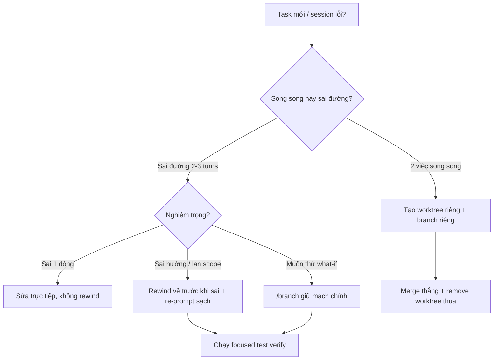

# 11 — Git Worktrees, Checkpoints & Parallel Sessions Sạch

> Bài 11 của series. Đọc xong bạn chạy được worktree workflows, rewind đúng lúc,
> và phối hợp parallel sessions không giẫm chân. Thời gian: ~30 phút.

## Mục lục

1. [Vì sao worktrees + checkpoints? (why)](#1-vì-sao-worktrees--checkpoints-why)
2. [Worktrees deep-dive](#2-worktrees--song-song-không-giẫm-chân)
3. [Worktree workflows (3 patterns)](#3-worktree-workflows-3-patterns-copy-paste)
4. [Checkpoints deep-dive](#4-checkpoints--undo-cho-cả-code--conversation)
5. [Rewind scenarios (khi nào rewind vs tiếp tục)](#5-rewind-scenarios--khi-nào-rewind-vs-tiếp-tục)
6. [Kết hợp song song an toàn + pitfalls + bài tập](#6-kết-hợp-song-song-an-toàn)
7. [Link chéo](#7-link-chéo)

---

## 1. Vì sao worktrees + checkpoints? (why)

2 vấn đề song song của agent work:

```text
Vấn đề 1 — Giẫm chân: 2 sessions cùng sửa 1 working dir → conflict, đè file, test flaky.
  → Giải pháp: worktrees (mỗi session 1 checkout riêng, branch riêng).

Vấn đề 2 — Đi sai đường: agent sửa 15 turns vẫn sai, càng sửa càng nát.
  → Giải pháp: checkpoints (undo cả code + conversation về điểm trước khi nát).
```

Git là source of truth cuối (commit/PR), checkpoints là undo local nhanh, worktrees là
cách ly không gian. 3 lớp phối hợp (không thay nhau).

---

## 2. Worktrees — song song không giẫm chân

Mỗi session 1 git checkout riêng → 2 agents sửa cùng repo không conflict file.

```bash
git worktree add ../myfeature-worktrees/feat-x -b feat/x
claude --add-dir ../myfeature-worktrees/feat-x
# xong việc:
git worktree remove ../myfeature-worktrees/feat-x
```

- Agent view tự đưa mỗi dispatched session vào worktree riêng.
- `/batch` chia việc lớn thành 5–30 subagents, mỗi đứa 1 worktree + 1 PR.
- Subagents bạn spawn cũng có thể xin worktree riêng.

Quy ước team: thư mục `../<repo>-worktrees/<ten>`, branch `feat/<ten>`, dọn worktree sau merge.

### 2.1. Lệnh worktree căn bản (thuộc lòng)

```bash
# Tạo (branch mới từ HEAD hiện tại):
git worktree add ../myrepo-worktrees/feat-login -b feat/login

# Tạo từ branch remote/main mới nhất:
git fetch origin
git worktree add ../myrepo-worktrees/feat-pay -b feat/pay origin/main

# Liệt kê + kiểm tra:
git worktree list
git worktree list --porcelain

# Mở session trong worktree:
cd ../myrepo-worktrees/feat-login && claude
# Hoặc từ repo chính cho phép truy cập:
claude --add-dir ../myrepo-worktrees/feat-login

# Dọn (sau merge):
git worktree remove ../myrepo-worktrees/feat-login        # worktree sạch
git worktree remove --force ../myrepo-worktrees/feat-login # có changes chưa commit (cẩn thận!)
git worktree prune    # dọn metadata worktree đã xóa tay
```

### 2.2. Vì sao quy ước folder/branch? (why)

```
../<repo>-worktrees/<ten>  → ngoài repo chính (không pollute git status, .gitignore không cần sửa).
feat/<ten>                 → branch tách main, PR riêng từng worktree.
dọn sau merge              → worktree tồn tại = branch tồn tại = nợ. Merge xong xóa cả 2.
```

---

## 3. Worktree workflows (3 patterns copy-paste)

### Pattern A — Solo 2 features song song (phổ biến nhất)

```bash
# Setup (5 phút, 1 lần):
git fetch origin
git worktree add ../myrepo-worktrees/feat-a -b feat/a origin/main
git worktree add ../myrepo-worktrees/feat-b -b feat/b origin/main
git worktree list   # xác nhận 3 entries (main + 2 worktrees)

# Terminal 1 (feature A):
cd ../myrepo-worktrees/feat-a && claude
# > "implement login rate-limit theo plan plans/xxx.md, chạy focused test"

# Terminal 2 (feature B):
cd ../myrepo-worktrees/feat-b && claude
# > "migrate users table thêm last_login_at (skill add-table), test local"

# Xong mỗi bên: /diff → commit → push → gh pr create → merge → dọn:
git worktree remove ../myrepo-worktrees/feat-a
git branch -d feat/a
```

### Pattern B — Thử 2 phương án, giữ cái thắng (spike)

```bash
git worktree add ../myrepo-worktrees/spike-1 -b spike/option-1 origin/main
git worktree add ../myrepo-worktrees/spike-2 -b spike/option-2 origin/main

# Terminal 1: thử JWT-blacklist. Terminal 2: thử server-sessions.
# Mỗi bên implement + test + đo (perf/complexity). So sánh:

# Giữ spike-2, bỏ spike-1:
git worktree remove --force ../myrepo-worktrees/spike-1
git branch -D spike/option-1
# Đổi tên spike-2 thành feat/: git branch -m spike/option-2 feat/sessions
```

### Pattern C — Agent fan-out (`/batch` / agent view tự tạo worktrees)

```text
# Bạn không tạo tay — Claude tự tạo mỗi subagent 1 worktree + 1 PR:
# > "/batch migrate 50 files từ pages/ sang app/: mỗi subagent 5 files, 1 worktree, 1 PR, chạy focused test"

# Bạn làm: /agents (tab Running) theo dõi → review từng PR → merge → worktrees tự dọn.
# Kill khi fan-out lỗi: Ctrl+X Ctrl+K ×2 trong 3s (dừng hết background subagents).
```

```bash
# Kiểm tra batch worktrees (khi batch đang chạy):
git worktree list
# → thấy N entries batch-xxx. Đừng xóa tay khi batch đang chạy — để nó tự dọn.
```

---

## 4. Checkpoints — undo cho cả code + conversation

- **Double-Esc** (prompt rỗng) → rewind menu: khôi phục code + conversation về điểm trước đó.
- `/rewind` tương đương gõ lệnh. `/branch` để thử "what-if" mà không mất mạch chính.
- Quy tắc: **sửa 2 lần vẫn sai → đừng argue tiếp, rewind + re-prompt sạch** (rẻ hơn 10 turns cãi nhau).
- Checkpoint = undo local; **Git mới là history thật** — commit/PR vẫn là source of truth.

### 4.1. 3 lệnh + khi nào dùng

| Lệnh | Làm gì | Khi nào |
|---|---|---|
| Double-Esc (prompt rỗng) | Mở rewind menu (chọn checkpoint) | Nhanh nhất, dùng hàng ngày |
| `/rewind` | Tương đương menu bằng lệnh | Muốn gõ rõ ràng / môi trường không có Esc (mobile) |
| `/branch <ten>` | Fork conversation (thử what-if, giữ mạch chính) | Thử hướng khác mà không mất mạch đang đúng 50% |

```text
# Ví dụ /branch:
# Đang refactor đúng 50%, muốn thử 1 ý mạo hiểm:
# > /branch thu-y-mao-hiem
# → thử trong branch. Không ưng → /resume mạch chính. Ưng → tiếp tục branch.
```

### 4.2. Cơ chế sâu (checkpoint lưu gì?)

```text
Mỗi checkpoint = snapshot (file changes từ harness + conversation turns).
Rewind = restore cả 2 về điểm đó (code quay lại + turns sau điểm đó biến mất khỏi context).
Khác git checkout: git chỉ restore code; rewind restore cả "trí nhớ" agent về trước khi nát.
Khác /clear: /clear xóa hết bắt đầu mới; rewind giữ lại phần đúng trước điểm nát.
```

---

## 5. Rewind scenarios — khi nào rewind vs tiếp tục

### Scenario 1 — Agent sửa 3 turns vẫn fail cùng 1 test

```text
Dấu hiệu: cùng 1 lỗi, 3 fixes khác nhau đều fail.
Quyết định: REWIND (về trước fix 1) + re-prompt với thông tin mới.
Re-prompt mẫu: "Test X fail với [paste lỗi đầy đủ]. Lần trước thử A, B, C đều fail.
  Hãy đọc [file] lại từ đầu, đề xuất root cause KHÁC trước khi sửa."
```

### Scenario 2 — Agent refactor lan man ngoài scope (đụng 10 files khi chỉ cần 2)

```text
Dấu hiệu: git diff --stat phình, files ngoài scope xuất hiện.
Quyết định: REWIND (về trước khi lan) + giao lại scope hẹp:
  "Chỉ sửa [2 files]. KHÔNG đụng [8 files kia]. Xong chạy focused test."
```

### Scenario 3 — Prompt ban đầu thiếu thông tin (agent đoán sai hướng)

```text
Dấu hiệu: agent làm "đúng" theo prompt nhưng sai ý bạn (hiểu nhầm yêu cầu).
Quyết định: REWIND + viết lại prompt đầy đủ (mục tiêu + scope + verify + non-goals).
  Đừng "sửa dần" từ code sai hướng — rẻ hơn làm lại sạch.
```

### Scenario 4 — Chỉ sai 1 bước nhỏ, còn lại đúng

```text
Dấu hiệu: 9/10 steps đúng, 1 step sai (vd sai tên column).
Quyết định: KHÔNG rewind — sửa trực tiếp (Edit 1 dòng) hoặc bảo agent "sửa dòng X thành Y".
  Rewind ở đây phí (mất 9 steps đúng).
```

### Bảng quyết định 30 giây

| Tình huống | Rewind? | Về đâu? |
|---|---|---|
| Cùng lỗi fail 2-3 lần | Có | Trước fix 1 |
| Lan scope, diff phình | Có | Trước khi lan |
| Hiểu nhầm yêu cầu từ đầu | Có | Đầu task (+ viết lại prompt) |
| Sai 1 dòng, còn lại đúng | Không | Sửa trực tiếp |
| Muốn thử hướng khác song song | Không (dùng `/branch`) | Fork, giữ mạch chính |
| Task đã commit PR rồi | Không (dùng git) | Checkpoint là local — đã push thì git revert/PR mới |

---

## 6. Kết hợp: song song an toàn

```
main conversation (quyết định)
 ├─ worktree A + subagent explorer (research)
 ├─ worktree B + subagent implementer (thử phương án 2)
 └─ worktree C (bạn code tay phần critical)
→ so sánh → merge cái thắng → remove worktrees thua
```

Kill switch khi fan-out lỗi: `Ctrl+X Ctrl+K` 2 lần trong 3s dừng hết background subagents.
Theo dõi: `/agents` (Running/Library), `/tasks`.

### 6.1. Walkthrough kết hợp (20 phút)

```bash
# Bước 1: tạo 2 worktrees (pattern B):
git fetch origin
git worktree add ../myrepo-worktrees/opt-1 -b spike/opt-1 origin/main
git worktree add ../myrepo-worktrees/opt-2 -b spike/opt-2 origin/main

# Bước 2: main conversation giao việc:
# > "spawn explorer trong ../myrepo-worktrees/opt-1 research phương án 1, trả 15 dòng.
# >  Đồng thời tao tự thử phương án 2 ở opt-2."

# Bước 3: so sánh (test + review):
# Mỗi bên: focused test + /diff review. Chọn thắng.

# Bước 4: merge + dọn:
# PR thắng → merge → git worktree remove <thua> + git branch -D <thua>
git worktree list   # xác nhận sạch
```

### 6.2. Pitfalls + fix

| Pitfall | Vì sao | Fix |
|---|---|---|
| Quên dọn worktree → 10 worktrees tồn | Không quy ước dọn | Merge xong remove ngay; `git worktree list` cuối tuần |
| 2 sessions cùng dir (không worktree) → conflict | Lười tạo worktree | Task song song = worktree riêng, không ngoại lệ |
| Rewind sau khi đã push | Checkpoint local only | Đã push → git revert/PR mới, không rewind |
| `/branch` xong quên mạch chính tên gì | Không `/rename` trước | `/rename` mạch chính trước khi branch |
| Xóa worktree đang có session mở | Session mất CWD | Đóng session trước, hoặc `git worktree remove` báo lỗi thì `cd` ra rồi thử lại |
| Worktree + `--add-dir` nhầm (load CLAUDE.md sai) | Add-dir không load CLAUDE.md mặc định | `export CLAUDE_CODE_ADDITIONAL_DIRECTORIES_CLAUDE_MD=1` (bài 01) hoặc `cd` thẳng vào worktree |

### 6.3. Bài tập thực hành

**Bài 1 (15 phút):** Tạo 2 worktrees (pattern A). Mở 2 sessions, mỗi bên làm 1 task nhỏ.
`git worktree list` + merge + dọn. Ghi thời gian so với làm tuần tự.

**Bài 2 (15 phút):** Cố ý giao task sai hướng, để agent làm 5 turns, rồi rewind + re-prompt sạch
(scenario 3). So sánh tokens (`/cost`) rewind-sớm vs argue-tiếp.

**Bài 3 (10 phút):** Thử `/branch` what-if: branch 1 hướng, resume mạch chính, so sánh.
Khi nào branch tốt hơn rewind?

**Bài 4 (15 phút):** Chạy fan-out mini: main + 1 explorer worktree + 1 implementer worktree.
Theo dõi `/agents` + kill switch test (Ctrl+X Ctrl+K). Merge thắng, dọn thua.

### 6.4. Worktree gotchas (4 cái ai cũng vấp 1 lần)

**1. Untracked files không theo worktree:**

```bash
# Worktree mới chỉ có tracked files từ branch base. File chưa commit ở main KHÔNG sang.
# → Trước khi tạo worktree: git stash push -m "wip" hoặc commit WIP.
git stash push -m "wip-main" && git worktree add ../myrepo-worktrees/feat-x -b feat/x
# Trong worktree cần file đó? git stash pop CHỌN LỌC (đừng pop mù gây conflict).
```

**2. Dependencies phải cài lại mỗi worktree:**

```bash
# node_modules/.venv KHÔNG share giữa worktrees (mỗi checkout 1 folder riêng).
cd ../myrepo-worktrees/feat-x
pnpm install --frozen-lockfile   # Node
# hoặc: python -m venv .venv && pip install -r requirements.txt
# Mẹo: dùng pnpm store shared + Docker layer cache để đỡ tải lại nặng.
```

**3. Env files + ports đụng nhau:**

```bash
# .env thường untracked → copy tay sang worktree mới (KHÔNG commit .env!):
cp /path/to/main/.env ../myrepo-worktrees/feat-x/.env
# Ports: 2 sessions cùng chạy :3000 → đụng. Đổi PORT mỗi worktree:
PORT=3001 pnpm dev   # worktree A :3000, worktree B :3001
```

**4. Submodules + LFS:**

```bash
# Submodules không tự init trong worktree mới:
git submodule update --init --recursive
# LFS: git lfs pull (nếu repo dùng LFS).
```

### 6.5. Rewind vs git — khi nào dùng cái nào?

| Nhu cầu | Dùng | Vì sao |
|---|---|---|
| Undo code CHƯA commit + cả "trí nhớ" agent | Rewind/Double-Esc | Git không restore conversation |
| Undo code ĐÃ commit/push | `git revert` / PR mới | Checkpoint local only |
| Thử hướng khác giữ mạch chính | `/branch` | Rewind mất mạch cũ |
| Bắt đầu mới hoàn toàn | `/clear` | Rewind giữ phần đúng — không cần thì clear |
| So sánh 2 phương án song song | 2 worktrees | Rewind/branch là tuần tự, worktree là song song |
| Mất file do `rm` nhầm chưa commit | Rewind HOẶC `git checkout -- <file>` | Cả 2 được; git nhanh hơn nếu chỉ 1 file |

### 6.6. Checklist parallel sessions sạch (dán vào team wiki)

- [ ] Mỗi session 1 worktree + 1 branch `feat/*` (không share working dir).
- [ ] `/rename` mỗi session trước khi fork/branch (không lạc mạch).
- [ ] Env copy tay + ports khác nhau + deps cài riêng mỗi worktree.
- [ ] Merge xong → remove worktree + xóa branch + `git worktree prune`.
- [ ] Sai 2 lần → rewind + re-prompt (không argue 10 turns).
- [ ] Đã push → git revert/PR mới (không rewind).
- [ ] Fan-out lỗi → Ctrl+X Ctrl+K ×2 + `/agents` kiểm tra.

---

### 6.7. Thuật ngữ mới trong bài (nôm na + analogie + ví dụ + verify)

| Thuật ngữ | Nôm na 1 câu | Analogie | Ví dụ kỹ thuật thật | Cách verify |
|---|---|---|---|---|
| Git worktree | 1 repo, nhiều thư mục checkout song song, mỗi cái 1 branch. | 1 căn nhà (repo `.git`) có nhiều phòng (worktree), mỗi phòng bày đồ khác nhau mà không lẫn. | `git worktree add ../myrepo-worktrees/feat-login -b feat/login` → sinh folder `feat-login/` checkout branch mới. | `git worktree list` phải thấy 2+ entries; `git -C ../myrepo-worktrees/feat-login branch --show-current` ra `feat/login`. |
| Checkpoint / Rewind | Điểm lưu cả code + hội thoại để quay lại khi làm hỏng. | Như save-game: chết thì load lại đúng chỗ save, không chơi lại từ đầu. | Nhấn `Esc Esc` lúc prompt rỗng → chọn checkpoint trước turn 1 bị sai. | Sau rewind: `git diff --stat` gọn lại + turns sai biến mất khỏi history. |
| `/branch` (conversation branch) | Rẽ 1 bản copy hội thoại để thử hướng khác, giữ bản chính. | Như rẽ nhánh sông: nhánh mới chảy thử, sông chính vẫn còn. | `/branch thu-y-mao-hiem` → thử refactor mạo hiểm; không ưng thì `/resume` về mạch chính. | `/resume` vẫn thấy mạch chính cũ; branch mới có tên riêng. |

### 6.8. Mermaid: flow chọn worktree vs rewind vs branch



Giải thích từng bước ngay dưới mermaid:

1. **A→B:** xác định bạn cần song song (2 việc cùng lúc) hay cứu session lỗi.
2. **B→C:** song song thật → mỗi việc 1 worktree + 1 branch, không share working dir.
3. **D→E:** sai 1 dòng trong 9 steps đúng → sửa tay, rewind là phí.
4. **D→F:** sai hướng/lan scope → rewind + viết lại prompt đủ scope/verify/non-goals.
5. **D→G:** muốn thử mà không mất mạch đang đúng 50% → `/branch`, không rewind.
6. **C→H:** so sánh PR từng worktree → merge thắng, `remove + branch -D` thua.
7. **F/G→I:** sau cứu/thử → chạy focused test, `git diff --stat` gọn mới tính xong.

### 6.9. Bảng so sánh có cột Hiểu nôm na + Ví dụ

| Khái niệm | Hiểu nôm na | Ví dụ |
|---|---|---|
| Worktree | Phòng riêng để 2 người làm không giẫm chân | `git worktree add ../w/feat-a -b feat/a` rồi mở 2 terminal `claude` riêng |
| Checkpoint | Save-game của session | Double-Esc → chọn save trước khi agent sửa nát 15 turns |
| `/branch` | Photocopy hội thoại để thử bậy mà còn bản gốc | `/branch thu-y-mao-hiem`, hỏng thì về mạch chính |
| Git commit/PR | Sổ đỏ thật, checkpoints chỉ là nháp | Đã push → `git revert`, không rewind |

**Kỳ vọng thấy gì (sau lệnh worktree):**

```bash
git worktree list
```

> Kỳ vọng thấy gì: 3 dòng — 1 dòng repo chính + 2 dòng `../myrepo-worktrees/feat-a|b` kèm branch + commit hash. Nếu chỉ thấy 1 dòng là tạo worktree chưa thành công.

### 6.10. Hiểu nhầm thường gặp

| Hiểu nhầm | Sự thật | Ví dụ sửa |
|---|---|---|
| Rewind thay được git revert sau khi push | Checkpoint chỉ local; đã push phải git | Đã merge PR lỗi → mở PR `revert` mới, không Double-Esc |
| Worktree tự share `node_modules/.env` | Mỗi worktree là folder riêng, phải cài/copy lại | `pnpm install` lại + `cp ../main/.env ./.env` + đổi `PORT` |
| Xóa worktree = xóa branch | 2 thứ khác nhau, phải xóa cả 2 | `git worktree remove ...` + `git branch -d feat/a` + `git worktree prune` |
| `/branch` giống rewind | Rewind mất mạch cũ; branch giữ cả 2 | Muốn giữ mạch đúng 50% thì `/branch`, không rewind |

## 7. Link chéo

- **Bài 02 — Surfaces**: `--add-dir`, agent view dispatch, teleport giữa sessions.
- **Bài 04 — Slash commands**: `/rewind /branch /fork /resume /rename`, Double-Esc, `/agents /tasks`.
- **Bài 06 — Subagents**: `/batch` worktree-isolated, fan-out patterns, kill switch.
- **Bài 10 — Permissions**: trust/working dirs mỗi worktree; rules theo repo.
- **Bài 12 — SDK/CI**: CI checkout sạch tương đương worktree ephemeral.
