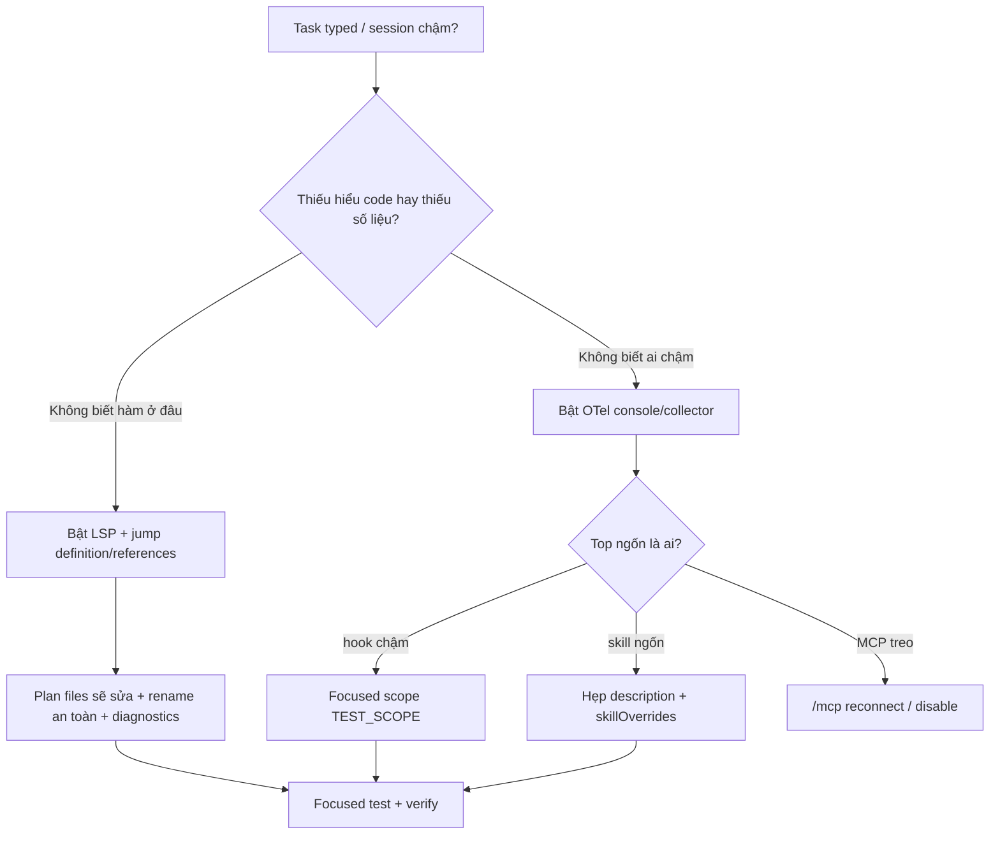

# 13 — Code intelligence (LSP) + OpenTelemetry metrics — tìm hooks chậm, skills ngốn context

> **Bài này cho ai:** dev làm typed languages (TypeScript/Python/Go/Rust...) muốn Claude hiểu code sâu hơn grep, hoặc team muốn đo session bằng metrics thay vì đoán.
> **Cần gì trước:** đã cài và đăng nhập ([bài 01](./01-cai-dat-va-xac-thuc.md)); repo bạn có type config (`tsconfig.json`/`go.mod`/`pyrightconfig.json`...) thì LSP mới có việc để làm.
> **Đọc xong bạn làm được:**
> - Cài + bật LSP cho từng ngôn ngữ, copy-paste được lệnh jump-to-definition / find references / rename / diagnostics.
> - Bật OpenTelemetry metrics (console trước, collector team sau), biết endpoint ở đâu và metric nào đáng nhìn.
> - Dùng metrics bắt hook chậm + skill ngốn context, fix xong đo lại trước/sau để có bằng chứng thay vì đoán.
> **Thời gian:** ~45 phút

## Thuật ngữ dùng trong bài này

Đọc bảng này trước khi vào mục 1 — mọi thuật ngữ Anh trong bài đều được giải thích ở đây.

| Thuật ngữ | Nôm na 1 câu | Analogie | Ví dụ kỹ thuật thật | Cách verify |
|---|---|---|---|---|
| LSP (Language Server Protocol) | Từ điển sống của code: hỏi hàm ở đâu là chỉ đúng file:dòng. | Như Google Maps cho code: gõ tên hàm → chỉ đường tới định nghĩa + ai đang gọi nó. | `npm i -g typescript typescript-language-server`, hỏi Claude `jump to definition hàm login trong src/auth.ts` | Trả về 1 `file:dòng` chính xác thay vì 20 kết quả grep; rename không sót refs. |
| Diagnostics (live type errors) | Máy soi lỗi type ngay khi gõ, chưa cần chạy test. | Như chính tả đỏ ngoằn ngoèo trong Word, sai đâu đỏ đó. | Hỏi `get live type errors file apps/api/auth.ts` sau khi sửa | Liệt kê đúng dòng lỗi mới; sửa xong hỏi lại phải hết đỏ. |
| OpenTelemetry (OTel) | Hộp đen ghi ai chậm, ai ngốn tokens mỗi turn. | Như đồng hồ điện từng phòng: phòng nào (hook/skill/MCP) tốn điện nhất nhìn là biết. | `export OTEL_TRACES_EXPORTER="console"` rồi grep `hook.*duration` | Thấy `hook test-gate p99 240s`; fix focused scope xong p99 còn ~20s. |
| Code intelligence plugin | Cầu nối LSP ↔ Claude Code: bật lên là Claude có tool jump/refs/diagnostics thay vì chỉ grep text | Như passport control trong sân bay: giữ đường bay thẳng giữa editor-style tools và Claude | `/plugin` → enable code-intelligence, rồi hỏi "jump to definition hàm login" | `/doctor` hiện mục code-intelligence: `enabled` + servers đang chạy |
| OTel collector | Cửa kho nhận mọi spans/metrics OTLP từ máy dev, gom về 1 chỗ cho team xem chung | Như nhà kho tổng của xưởng: mỗi máy bắn hàng về, kho phân loại rồi lên dashboard | `docker run -p 4317:4317 -p 4318:4318 otel/opentelemetry-collector` | Collector log có dòng spans về sau khi bạn làm 1 task nhỏ |

## Mục lục

1. [Vì sao cần code intelligence + metrics?](#1-vì-sao-cần-code-intelligence--metrics)
2. [Code intelligence plugin và LSP là gì?](#2-code-intelligence-plugin-và-lsp-là-gì)
3. [Cài LSP cho typed languages (copy-paste)](#3-cài-lsp-cho-typed-languages-copy-paste)
4. [Symbol navigation + live type errors trong workflow](#4-symbol-navigation--live-type-errors-trong-workflow)
5. [OpenTelemetry: bật thế nào, endpoint ở đâu](#5-opentelemetry-bật-thế-nào-endpoint-ở-đâu)
6. [Metrics nào hữu ích + ví dụ query](#6-metrics-nào-hữu-ích--ví-dụ-query)
7. [Dùng metrics tìm hooks chậm + skills ngốn context](#7-dùng-metrics-tìm-hooks-chậm--skills-ngốn-context)
8. [Đi từ đầu tới cuối trong 20 phút](#8-đi-từ-đầu-tới-cuối-trong-20-phút)
9. [Pitfalls + fix](#9-pitfalls--fix)
10. [Hiểu nhầm thường gặp](#10-hiểu-nhầm-thường-gặp)
11. [Bài tập](#11-bài-tập)
12. [Link chéo](#12-link-chéo)

---

## 1. Vì sao cần code intelligence + metrics?

Mục này trả lời câu: Claude đang đọc code của bạn theo cách nào, và thiếu LSP/OTel thì bạn mất gì?

Claude đọc code bằng `Read/Grep/Glob` là đọc text — không hiểu symbol nào định nghĩa ở đâu, type nào sai ở dòng nào.
Hậu quả: rename 1 hàm phải grep 20 chỗ, sửa type xong không biết còn đỏ ở đâu, subagent explore đọc 300 files vì không biết jump tới definition.

LSP (Language Server Protocol) cho Claude đúng cái IDE có: jump-to-definition, find references, live type errors.
OpenTelemetry (OTel) cho bạn đúng cái backend có: metrics/traces mỗi turn — hook nào chậm, skill nào ngốn context, MCP nào treo.

```text
Không LSP:  grep "login" → 200 kết quả → đọc 30 files → bill vọt
Có LSP:     go-to-definition(login) → 1 def + 8 refs → đọc 3 files

Không OTel: "sao session chậm?" → đoán (model dở? mạng lag?)
Có OTel:    hook test-gate p99 240s + skill deploy 45K tokens → biết chính xác kẻ ngốn
```

> Quy tắc: **typed language mà chưa bật LSP là tự handicap. Session chậm mà chưa nhìn metrics là đoán mò.**

---

## 2. Code intelligence plugin và LSP là gì?

Mục này trả lời câu: LSP bên trong hoạt động ra sao, plugin của Claude Code thêm được gì, và khi nào LSP đáng dùng thay grep?

- **LSP**: protocol chuẩn (Microsoft đề xuất, mọi editor dùng). Mỗi ngôn ngữ có 1 language server
  (`typescript-language-server`, `pyright`, `rust-analyzer`, `gopls`...). Server hiểu AST/types, trả về
  definition/references/diagnostics qua protocol JSON-RPC.
- **Code intelligence plugin trong Claude Code**: cầu nối LSP ↔ Claude. Khi bật, Claude có thêm tools
  kiểu `goToDefinition`, `findReferences`, `getDiagnostics` (tên tool tùy bản) thay vì chỉ grep text.
- **Khi nào LSP thắng grep?**

| Nhu cầu | Grep | LSP |
|---|---|---|
| Tìm chuỗi text ("TODO", log) | ✓ nhanh | Không cần |
| Hàm này định nghĩa ở đâu, ai gọi? | Grep 200 kết quả nhiễu | ✓ definition + references chính xác |
| Sửa xong còn lỗi type ở đâu? | Chạy `tsc` tay cả repo | ✓ live diagnostics theo file |
| Rename an toàn | Sửa tay từng chỗ, sót | ✓ rename symbol (server lo) |
| Repo dynamic (JS thuần, Python không types) | ✓ đủ | LSP yếu (không type info) — khỏi bật cũng được |

- **Typed languages được lợi nhất**: TypeScript, Python (có types), Go, Rust, Java. JS thuần/dynamic-heavy thì lợi ít.

---

## 3. Cài LSP cho typed languages (copy-paste)

Mục này trả lời câu: cài language server + bật plugin gồm những lệnh nào, và verify bằng cách nào?

### 3.1. Nguyên tắc: 1 ngôn ngữ = 1 server + plugin bật

```bash
# 1. Kiểm tra Claude Code có thấy code-intel không (tên mục tùy bản):
/plugin
# → tìm mục code-intelligence / lsp / language-server. Không thấy → update bản mới.

# 2. Kiểm tra trong session:
/doctor
# → mục code-intelligence: enabled/disabled + servers nào chạy
```

### 3.2. Cài server theo ngôn ngữ (máy dev cần có trước)

```bash
# TypeScript (node ≥18):
npm i -g typescript typescript-language-server
# Kiểm tra: typescript-language-server --version

# Python (typed — cần pyright hoặc pylsp):
npm i -g pyright
# hoặc: pip install python-lsp-server
# Kiểm tra: pyright --version

# Go:
go install golang.org/x/tools/gopls@latest
# Kiểm tra: gopls version

# Rust:
rustup component add rust-analyzer
# Kiểm tra: rust-analyzer --version
```

```bash
# 3. Mở repo và xác nhận server nhận project:
# TypeScript: cần tsconfig.json ở root (npx tsc --init nếu chưa có)
# Python: cần pyrightconfig.json hoặc pyproject.toml
# Go: cần go.mod · Rust: cần Cargo.toml
ls tsconfig.json pyrightconfig.json go.mod Cargo.toml 2>/dev/null
# → file nào có thì server đó mới hiểu project (không có là LSP mù)
```

### 3.3. Bật plugin trong Claude Code

```bash
# Cách 1 — trong session (nhanh, thử trước):
/plugin
# → Enable code-intelligence → chọn servers (typescript, pyright...)

# Cách 2 — settings.json team (share cả team, khuyến nghị):
# .claude/settings.json
```

```json
// .claude/settings.json — bật code-intel cho team (copy-paste khung):
{
  "codeIntelligence": {
    "enabled": true,
    "servers": ["typescript", "pyright"]
  }
}
```

```bash
# 4. Verify sau khi bật (làm 1 lần):
# Hỏi Claude: "jump to definition hàm login trong src/auth.ts"
# → phải trả về file:dòng chính xác, không phải 20 kết quả grep
# Hỏi: "file này còn lỗi type nào?" → phải liệt kê diagnostics theo dòng
```

**Kiểm tra nhanh:**

```bash
ls tsconfig.json && /plugin
# rồi hỏi: "jump to definition hàm login trong src/auth.ts"
```

- Claude trả về 1 dòng `src/auth.ts:42` (file:dòng chính xác), `/doctor` mục code-intelligence hiện `enabled`.
  Nếu trả 20 kết quả grep là LSP chưa nhận project (thiếu `tsconfig.json`).
- Hỏi tiếp "file này còn lỗi type nào?" → phải liệt kê diagnostics theo dòng, không phải bảo bạn tự chạy `tsc`.

---

## 4. Symbol navigation + live type errors trong workflow

Mục này trả lời câu: vào việc thật, bạn đổi tay grep sang LSP ở những chỗ nào?

### 4.1. Symbol navigation: explore gọn 10x

```bash
# Trước (grep mù):
# "tìm mọi chỗ gọi refreshToken" → grep → 60 kết quả (cả comment, log, test cũ)

# Sau (LSP):
# Prompt mẫu copy-paste:
"find references của refreshToken (dùng LSP), chỉ liệt kê call sites thật trong src/, bỏ test snapshot và comment."
# → 8 refs thật → đọc 3 files là đủ
```

```bash
# Prompt rename an toàn (copy-paste):
"rename symbol loginWithSSO thành loginWithOIDC (dùng LSP rename), liệt kê files đổi, không chạm test snapshot."
# → server rename đúng def + refs, không sót, không sửa nhầm chuỗi "login" trong log
```

```bash
# Prompt explore multi-file (gọn, rẻ):
"Từ handler POST /login trong apps/api, jump qua domain + db layers (LSP definition), trả về ≤10 files sẽ sửa + 1 dòng/file vì sao."
# → explorer đi theo graph thật, không đọc 300 files
```

### 4.2. Live type errors: sửa tới đâu xanh tới đó

```bash
# Sau mỗi change, hỏi thay vì chạy full tsc:
"get live type errors file apps/api/auth.ts (LSP diagnostics), chỉ lỗi mới do change vừa rồi."

# Gate trong hook Stop (khung — xem Tips 06):
# hooks/test-gate.sh gọi tsc --noEmit --pretty false cho file đổi (nhanh)
# thay vì full suite 4 phút mỗi turn-end
TEST_SCOPE=auth ./hooks/test-gate.sh
```

```text
# Workflow chuẩn typed task (5 bước):
# 1. LSP jump (def + refs) → 2. Plan (files sẽ sửa) → 3. Edit →
# 4. Diagnostics file đổi (xanh?) → 5. Focused test file đổi
# Full tsc + full suite để CI, không chạy mỗi turn local
```

---

## 5. OpenTelemetry: bật thế nào, endpoint ở đâu

Mục này trả lời câu: bật OpenTelemetry bằng cách nào, endpoint để ở đâu, và cần gì để nhận dữ liệu?

- **OTel trong Claude Code là gì?** Chuẩn observability (metrics + traces + logs). Claude Code phát ra
  spans/metrics mỗi turn: thời gian tool chạy, tokens per skill/MCP/hook, latency per hook, số subagents spawn.
- **Dùng để làm gì?** Tìm hooks chậm (hook nào p99 cao), skills ngốn context (skill nào tokens lớn),
  MCP treo (span timeout), fan-out sai (spawn lồng).
- **Cần gì?** 1 collector/backend nhận OTLP (local stdout, Jaeger, Grafana, Honeycomb...). Không có backend
  thì export ra stdout/file vẫn debug được.

### 5.1. Bật OTel (3 mức từ nhẹ tới full)

```bash
# Mức 1 — log ra stdout/file local (debug 1 session, không cần infra):
export OTEL_EXPORTER_OTLP_ENDPOINT="http://localhost:4318"
export OTEL_METRICS_EXPORTER="otlp"
export OTEL_TRACES_EXPORTER="otlp"
# Chạy Claude Code từ terminal này → spans/metrics chảy về endpoint local

# Mức 2 — file local khi chưa có collector:
export OTEL_TRACES_EXPORTER="console"
export OTEL_METRICS_EXPORTER="console"
# → in ra terminal/file, grep được ngay (xem mục 7)

# Mức 3 — team collector (share, xem chung Grafana/Jaeger):
# endpoint team cung cấp, secrets qua env (không hardcode):
export OTEL_EXPORTER_OTLP_ENDPOINT="https://otel.team.internal:4318"
export OTEL_EXPORTER_OTLP_HEADERS="authorization=Bearer ${OTEL_TOKEN}"
```

### 5.2. Config endpoint mẫu (copy-paste khung)

```yaml
# otel-collector-config.yaml — collector local team (khung tối thiểu):
receivers:
  otlp:
    protocols:
      grpc: { endpoint: "0.0.0.0:4317" }
      http: { endpoint: "0.0.0.0:4318" }
processors:
  batch: {}
exporters:
  debug: { verbosity: detailed }   # in ra log để kiểm tra trước
  # jaeger: {}  # bật khi team có Jaeger/Grafana
service:
  pipelines:
    traces: { receivers: [otlp], processors: [batch], exporters: [debug] }
    metrics: { receivers: [otlp], processors: [batch], exporters: [debug] }
```

```bash
# Chạy collector local (docker) + verify:
docker run -p 4317:4317 -p 4318:4318 -v ./otel-collector-config.yaml:/etc/otel.yaml \
  otel/opentelemetry-collector --config=/etc/otel.yaml
# → mở Claude Code session, làm 1 task nhỏ, xem collector log có spans về không
```

---

## 6. Metrics nào hữu ích + ví dụ query

Mục này trả lời câu: metric nào đáng mở ra nhìn, và đọc bằng console lẫn Grafana thế nào?

### 6.1. Bảng metrics đáng nhìn (mỗi metric trả lời câu gì)

| Metric/span | Câu hỏi | Ngưỡng cảnh báo |
|---|---|---|
| `hook.duration_ms` (per hook, p50/p99) | Hook nào chậm? | p99 >5s → focus scope hoặc cache |
| `skill.tokens_total` (per skill) | Skill nào ngốn context? | 1 skill >20K/turn → hẹp description/trigger |
| `mcp.tool_latency_ms` (per server) | MCP nào treo? | timeout liên tục → disable/tắt server |
| `subagent.spawn_count` + depth | Fan-out sai? | depth >2 (lồng) → cấm spawn lồng |
| `turn.tokens_in/out` + `turn.duration` | Turn nào phình? | tokens vọt sau 1 tool → tool đó dump quá nhiều |
| `diagnostics.count` (per file) | File nào đỏ mãn tính? | 1 file đỏ hoài → tách file, fix types gốc |

### 6.2. Ví dụ query khi có backend (Grafana/Jaeger khung)

```bash
# Không có Grafana? Grep console exporter vẫn ra (mức 2):
# Tìm hook chậm:
OTEL_TRACES_EXPORTER=console claude "làm task X" 2>&1 | grep -i "hook.*duration" | sort -k2 -n | tail -5

# Tìm skill ngốn:
OTEL_METRICS_EXPORTER=console claude "làm task X" 2>&1 | grep -i "skill.*tokens" | sort -k2 -n | tail -5
```

```text
# Khi có Grafana (team dashboard gợi ý — 3 panels đủ):
# Panel 1: hook.duration p99 by hook (bar) — hook nào cột cao nhất?
# Panel 2: skill.tokens_total by skill (timeseries) — skill nào leo dốc?
# Panel 3: subagent.spawn depth (heatmap) — có spawn lồng không?
```

---

## 7. Dùng metrics tìm hooks chậm + skills ngốn context

Mục này trả lời câu: từ metrics, bạn bắt được hook chậm, skill ngốn context và MCP treo ra sao qua 3 ca thật?

### 7.1. Ca A — hook test-gate chậm (từ 4 phút → 20 giây)

```bash
# Triệu chứng: mọi turn-end đều "treo" vài phút
# Metrics: hook test-gate p99 240s, các hook khác <2s → thủ phạm rõ

# Fix (copy-paste):
# Trước: hooks/test-gate.sh chạy full suite mỗi turn
# Sau: focused scope (env TEST_SCOPE), full suite để CI:
TEST_SCOPE=auth ./hooks/test-gate.sh
time TEST_SCOPE=auth ./hooks/test-gate.sh
# → p99 240s → 20s. Verify: metrics turn sau hook <30s
```

### 7.2. Ca B — skill deploy ngốn 45K mỗi turn

```bash
# Triệu chứng: /context 80% sau 3 turns dù task nhỏ
# Metrics: skill.tokens_total: deploy 45K, các skill khác <3K → description quá rộng, fire nhầm

# Fix:
# 1. Hẹp description skill (chỉ fire khi user nói "deploy staging/prod"):
# 2. skillOverrides tắt auto-fire ở repo không deploy (xem Tips 07):
/doctor
# → "skill deploy fires 5/10 turns (unnecessary 4)" → hẹp xong còn 1/10
# Verify: metrics skill deploy <5K/turn ở repo này
```

### 7.3. Ca C — MCP github treo (span timeout hàng loạt)

```bash
# Triệu chứng: tool github gọi mãi không về
# Metrics: mcp.tool_latency timeout 100% server github, các server khác ok → token hết hạn, không phải model dở

/mcp
# → github-mcp đỏ → reconnect hoặc disable tạm, task tiếp tục bằng Read/Grep local
# Verify: span latency về <2s hoặc server disabled, turn hết treo
```

---

## 8. Đi từ đầu tới cuối trong 20 phút

Mục này trả lời câu: gộp LSP + OTel lại, đi từ cài tới fix mất 20 phút theo những mốc nào?

### 8.1. Từng mốc phút

**Phút 0–5 (bật LSP):**

```bash
npm i -g typescript typescript-language-server
ls tsconfig.json
/plugin   # enable code-intelligence
# Hỏi thử: "jump to definition hàm login" → phải ra file:dòng chính xác
```

**Phút 5–10 (rename + diagnostics bằng LSP):**

```bash
# "find references refreshToken trong src/, bỏ comment/log"
# "get diagnostics file vừa sửa — còn lỗi type nào mới?"
# → explore 3 files thay vì 30, sửa tới đâu xanh tới đó
```

**Phút 10–15 (bật OTel console):**

```bash
export OTEL_TRACES_EXPORTER="console" OTEL_METRICS_EXPORTER="console"
# Làm 1 task nhỏ, grep hook duration + skill tokens (mục 6.2)
# → ghi lại top 1 hook chậm + top 1 skill ngốn
```

**Phút 15–20 (fix 1 cái rồi verify bằng metrics):**

```bash
# Chọn 1: hook focused scope (ca A) hoặc hẹp skill description (ca B)
# Làm lại task tương tự, so metrics trước/sau → phải giảm rõ
# Ghi 1 dòng team log: "test-gate 240s→20s (TEST_SCOPE)" hoặc "deploy 45K→5K (hẹp desc)"
```

### 8.2. Sơ đồ tổng hợp: flow LSP + OTel debug



Giải thích từng bước:

1. **A→B:** phân biệt mù code (cần LSP) hay mù số liệu (cần OTel).
2. **B→C:** cài server (`typescript-language-server/pyright/gopls`) + `/plugin` enable + có `tsconfig.json`.
3. **B→D:** bật exporter `console` (debug 1 session) hoặc OTLP collector team.
4. **C→E:** dùng `find references`, `rename symbol`, `diagnostics` thay grep mù + `tsc` full repo.
5. **D→F:** grep/console hoặc Grafana 3 panels (hook p99, skill tokens, spawn depth) để tìm top 1.
6. **F→G/H/I:** hook chậm → focused scope; skill ngốn → hẹp trigger; MCP treo → disable.
7. **→J:** làm lại task, so metrics trước/sau phải giảm rõ + test xanh.

### 8.3. Bảng so sánh 4 cách (nôm na + ví dụ)

| Cách | Hiểu nôm na | Ví dụ |
|---|---|---|
| Grep text | Tìm chữ bằng mắt thường, trúng cả comment/log | `grep -r "login"` ra 200 dòng nhiễu |
| LSP jump | Hỏi đường đi thẳng tới nhà + ai đang tới nhà đó | `find references refreshToken` chỉ ra 8 call sites thật trong `src/` |
| Console exporter | Ghi sổ tay xem ai chậm | `OTEL_TRACES_EXPORTER=console ... \| grep hook.*duration` |
| Collector + Grafana | Camera an ninh cả team cùng xem | 3 panels: hook p99, skill tokens, spawn depth |

---

## 9. Pitfalls + fix

Mục này trả lời câu: lỗi nào hay gặp khi bật LSP/OTel, và cách fix từng cái là gì?

| Pitfall | Vì sao | Fix |
|---|---|---|
| Bật LSP cho repo JS thuần không types | Server không có type info, jump sai | Chỉ bật cho typed languages; JS thuần grep đủ |
| Thiếu tsconfig/pyrightconfig/go.mod | Server mù project, diagnostics rỗng | Tạo config tối thiểu, verify jump đúng trước khi tin |
| Server chặn cả repo monorepo lớn | Index chậm, RAM phình | Scope server theo package (`apps/api`), không index cả monorepo |
| OTel exporter sai endpoint | Không có spans về, tưởng OTel hỏng | Chạy collector local trước (mục 5.2), thấy log về mới lên team backend |
| Metrics nhiều nhưng không action | Dashboard đẹp, hook vẫn chậm | Mỗi tuần fix top 1 hook + top 1 skill (mục 7), không sưu tầm metrics |
| Tin diagnostics thay test | Types xanh mà runtime sai | Diagnostics + focused test + `/verify` (3 lớp, thiếu 1 là mù 1 mắt) |
| OTel token hardcode trong config | Lộ credential collector | Token qua env (`${OTEL_TOKEN}`), config file không chứa secret |

---

## 10. Hiểu nhầm thường gặp

Mục này trả lời câu: những lầm tưởng nào khiến bạn bật sai LSP/OTel hoặc bỏ cuộc sớm?

| Hiểu nhầm | Sự thật | Ví dụ sửa |
|---|---|---|
| LSP thay được test | Diagnostics chỉ bắt lỗi type; runtime sai vẫn xanh | Luôn `diagnostics + focused test + /verify` (3 lớp) |
| Repo JS thuần cũng cần LSP | Không type info thì LSP mù, grep đủ | Chỉ bật cho TS/Python-typed/Go/Rust/Java |
| Có metrics là tự nhanh | Dashboard đẹp mà không fix top 1 thì vẫn chậm | Mỗi tuần fix top 1 hook + top 1 skill, đo lại % giảm |
| Hardcode OTel token trong config | Lộ credential; phải qua env | `authorization=Bearer ${OTEL_TOKEN}`, file config không chứa secret |

---

## 11. Bài tập

Mục này trả lời câu: tự tay luyện 3 bài, mỗi bài làm gì và đạt mức nào là xong?

**Bài 1 (20 phút — LSP):**

1. Cài 1 server đúng stack repo bạn (mục 3.2). Verify jump-to-definition đúng 3 hàm.
2. Dùng LSP find references cho 1 hàm core, so số kết quả với grep thường (kỳ vọng ít hơn 5–10x).
3. Rename 1 symbol bằng LSP, `git diff --stat` xem đổi đúng files không.

**Bài 2 (15 phút — diagnostics):**

1. Cố tình chèn 1 lỗi type, hỏi diagnostics file đó — có bắt đúng dòng không?
2. Viết hook/test-gate focused cho 1 package, `time` so với full suite.

**Bài 3 (20 phút — OTel):**

1. Bật console exporter, làm 1 task 3 turns, grep top hook chậm + top skill ngốn (mục 6.2).
2. Fix 1 cái (focused scope hoặc hẹp description), đo lại — ghi % giảm.
3. (Team) Dựng collector local (mục 5.2), đề xuất 3 panels Grafana cho team.

**Kiểm tra nhanh:**

- Explore task typed chỉ đọc ≤10 files (nhờ LSP) + chỉ ra được top hook/skill ngốn bằng metrics, không đoán.

---

## 12. Link chéo

Mục này trả lời câu: đọc bài nào tiếp theo tùy việc bạn đang mắc?

- **[Bài 04 — Slash commands toàn tập](./04-slash-commands-toan-tap.md)**: `/plugin` (bật code-intel), `/doctor` (khám servers + skills pile-up), `/mcp` (MCP treo).
- **[Bài 05 — Skills và custom commands](./05-skills-custom-commands.md)**: hẹp description skill ngốn ([Tips 07](../02-tips-thuc-chien/07-thiet-ke-skills.md) sâu hơn); skill tái dùng cho CI jobs.
- **[Bài 06 — Subagents, agent teams](./06-subagents-agent-teams-parallel.md)**: explorer đi theo LSP graph (scope hẹp + output contract).
- **[Bài 07 — Hooks](./07-hooks-tu-dong-hoa.md)**: test-gate focused, PreToolUse automate permissions; hook chậm thì OTel bắt.
- **[Bài 10 — Permissions & availability](./10-permissions-modes-availability.md)**: availability LSP/OTel theo provider; `dontAsk` vs `bypass` trong CI.
- **[Bài 12 — Agent SDK & CI/CD](./12-agent-sdk-ci-cd-automation.md)**: `settingSources: ["project"]` gọn skills CI; `claude -p` warmup + review JSON.
- **[Tips 01 — Vệ sinh context (context hygiene)](../02-tips-thuc-chien/01-context-hygiene.md)**: LSP là cách rẻ nhất giữ context sạch ở typed repos.
- **[Tips 04 — Verification](../02-tips-thuc-chien/04-verification-done-that.md)**: diagnostics ≠ test ≠ `/verify` — cần cả 3.
- **[Tips 05 — Parallel agents](../02-tips-thuc-chien/05-parallel-agents.md)**: fan-out sai thì OTel spawn depth tố cáo.
- **[Tips 06 — Hooks recipes](../02-tips-thuc-chien/06-hooks-recipes.md)**: sửa hook chặn nhầm + hook chậm (ca A).
- **[Tips 07 — Thiết kế skills](../02-tips-thuc-chien/07-thiet-ke-skills.md)**: hẹp trigger skill ngốn (ca B).
- **[Tips 10 — Debugging & phím tắt power-user](../02-tips-thuc-chien/10-debugging-power-moves.md)**: L1→L4; OTel là evidence cho L2/L3.
- Commands:
  - [commands/knowledge-system/plugin/README.md](./commands/knowledge-system/plugin/README.md) — bật code-intel plugin
  - [commands/knowledge-system/doctor/README.md](./commands/knowledge-system/doctor/README.md) — khám servers + cost
  - [commands/session-context/usage/README.md](./commands/session-context/usage/README.md) — ai ngốn (bản không OTel)
  - [commands/knowledge-system/mcp/README.md](./commands/knowledge-system/mcp/README.md) — MCP treo thì disable
