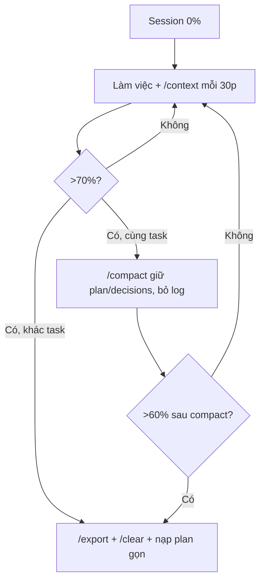

# Tips 01 — Vệ sinh context: kỹ năng quyết định 80% kết quả

> **Bài này cho ai:** dev dùng Claude Code hàng ngày nhưng hay bị "Claude dở đi" giữa session, hoặc tech lead muốn chuẩn hóa cách quản lý context cho team.
> **Cần gì trước:** đã cài và đăng nhập Claude Code ([bài 01](../01-huong-dan-su-dung/01-cai-dat-va-xac-thuc.md)); không bắt buộc đọc gì thêm.
> **Đọc xong bạn làm được:**
> - Chẩn đoán được session nào đang "bẩn" và cứu ngay bằng `/export` → `/compact`/`/clear` mà không mất quyết định.
> - Dùng đúng 5 thói quen nền: `/clear`, rewind, `/btw`, subagent, `/compact [focus]` + `/context`/`/usage`.
> - Cắt được "thuế ẩn": `CLAUDE.md` <200 dòng, skills/subagent descriptions/MCP servers về ngưỡng an toàn.
> - Có 4 recipes session sạch copy-paste + walkthrough refactor 3 ngày theo từng session.
> **Thời gian:** ~45 phút

## Thuật ngữ dùng trong bài này

Đọc bảng này trước khi vào mục 1 — mọi thuật ngữ Anh trong bài đều được giải thích ở đây.

| Thuật ngữ | Hiểu nôm na là gì | Ví dụ thấy ngay |
|---|---|---|
| Context window | Bộ nhớ tạm của model: mọi thứ bạn làm trong session đều nằm ở đó, đầy thì model dở | Session 140K tokens sau 90 phút lan man |
| Context bẩn | Context đầy rác cũ (log test, file đọc thừa) khiến model quên rule, trả lời lan man | Sửa chỗ A hỏng chỗ B |
| `/clear` | Xóa hết hội thoại, giữ file trên đĩa, nạp lại `CLAUDE.md` — token về ~0–2% | Xong bug CSS → `/clear` → mở task mới |
| `/compact [focus]` | Nén hội thoại thành tóm tắt, dặn giữ gì bỏ gì | `/compact Giữ decisions 1-5, bỏ log test cũ` |
| `/context` | Xem thanh pin context: còn bao nhiêu %, ai đang ngốn | `/context` → 72%, MCP github ngốn 18K |
| `/usage` | Breakdown token theo MCP server, theo skill, rate limits | `/usage` → server nào 0 calls 2 tuần |
| Auto-compact | Claude tự nén khi context chạm ~80–90% — hay mất ý quan trọng | Mất plan sau khi bị auto-compact |
| Rewind (Esc Esc) | Quay cả code + hội thoại về checkpoint trước khi đi sai | Claude sửa sai 2 lần → Esc Esc → re-prompt |
| `/btw` | Hỏi phụ nhanh: full context nhưng không tools, không lưu history | `/btw hàm retryWithBackoff làm gì, 3 dòng?` |
| Subagent | Agent con có context riêng + full tools, chỉ trả summary về main | Subagent đọc `src/auth/` trả 10 bullet, main nhận 1.5K tokens |
| `/doctor` | Chạy audit: skill ế, MCP nặng, hook chậm, version mới | `/doctor` mỗi tháng 1 lần |

## Mục lục

1. [Vì sao vệ sinh context quyết định 80%?](#1-vì-sao-vệ-sinh-context-quyết-định-80)
2. [Cơ chế: context window hoạt động thế nào?](#2-cơ-chế-context-window-hoạt-động-thế-nào)
3. [Năm thói quen nền (đào sâu từng cái)](#3-năm-thói-quen-nền-đào-sâu-từng-cái)
4. [Trần context: CLAUDE.md + skills + subagents + MCP + doctor](#4-trần-context-claudemd--skills--subagents--mcp--doctor)
5. [Dấu hiệu context bẩn và cách cứu](#5-dấu-hiệu-context-bẩn-và-cách-cứu)
6. [Bốn recipes session sạch (copy-paste)](#6-bốn-recipes-session-sạch-copy-paste)
7. [Walkthrough step-by-step: task refactor 3 ngày](#7-walkthrough-step-by-step-task-refactor-3-ngày)
8. [Bảng so sánh: clear vs compact vs rewind vs fork vs btw vs subagent](#8-bảng-so-sánh-clear-vs-compact-vs-rewind-vs-fork-vs-btw-vs-subagent)
9. [Checklist context sạch mỗi ngày](#9-checklist-context-sạch-mỗi-ngày)
10. [Pitfalls + cách fix](#10-pitfalls--cách-fix)
11. [Hiểu nhầm thường gặp](#11-hiểu-nhầm-thường-gặp)
12. [Bài tập cuối bài](#12-bài-tập-cuối-bài)
13. [Tham khảo chéo](#13-tham-khảo-chéo)

---

## 1. Vì sao vệ sinh context quyết định 80%?

Mục này trả lời câu: vì sao cùng một model, cùng một repo, chỉ khác cách quản lý context mà kết quả khác nhau một trời một vực?

Hầu hết "Claude dở đi" không phải do model kém, mà do **context bẩn**:

- Bạn bắt đầu bằng bug CSS 15 phút.
- Tiện hỏi luôn chuyện deploy, rồi nhờ viết SQL, rồi refactor auth.
- 90 phút sau context 140K tokens, model quên rule ở `CLAUDE.md`, sửa chỗ A hỏng chỗ B, trả lời lan man.

> Quy tắc vàng của bài này:
>
> - **Files persist, context thì không.** Cái gì quan trọng thì save ra file.
> - **1 task = 1 session sạch.** Đổi task là đổi session.
> - **Việc ồn ào đẩy sang chỗ khác** (subagent, `/btw`, file trung gian), giữ main session gọn để ra quyết định.

Ba con số cần ghim vào đầu:

| Con số | Ý nghĩa | Hành động |
|---|---|---|
| `~70–80%` | Ngưỡng bắt đầu compact / reset | Chạy `/context` kiểm tra, đừng đợi 95% |
| `~15K tokens` | Trần cộng dồn subagent descriptions lúc startup | Quá là bị warning, phải rút gọn |
| `~10 tools` | Ngưỡng MCP tools visible bắt đầu chọn sai | Prune server không dùng |

---

## 2. Cơ chế: context window hoạt động thế nào?

Mục này trả lời câu: bên trong mỗi prompt gửi đi gồm những gì, vì sao context đầy thì model dở, và vòng đời của một session sạch đi theo hướng nào?

### 2.1. Context = "RAM làm việc" của model

Mỗi prompt gửi đi gồm:

```text
[system prompt + CLAUDE.md + skills khả dụng + MCP tool defs]
+ [conversation history: user/assistant turns]
+ [tool calls + tool results (file reads, grep, bash output)]
+ [prompt mới của bạn]
→ model trả lời
```

Nghĩa là **mọi thứ bạn đã làm đều bị "thuế" mỗi turn sau**:

- Đọc 20 files để explore → 20 file contents nằm trong history.
- Paste 1 log 800 dòng → 800 dòng đó gánh theo 20 turns sau.
- Attach 3 ảnh → tokens ảnh cũng gánh theo.

### 2.2. Vì sao đầy thì dở? (3 cơ chế)

**1. Attention dilution (loãng sự chú ý).**

- Model là attention over toàn bộ tokens. 5K tokens gọn → tập trung cao.
- 150K tokens rác → rule quan trọng ở đầu `CLAUDE.md` bị "chìm", model ưu tiên cái gần nhất thay vì cái đúng nhất.
- Triệu chứng: quên convention, đổi API không xin phép, trả lời chung chung.

**2. Recency bias + lost-in-the-middle.**

- Model nhớ rõ đầu và cuối context, quên đoạn giữa.
- Quyết định kiến trúc bạn chốt ở turn 12 rất dễ bị "chôn" khi turn 40 toàn log test.
- Fix: quyết định quan trọng **ghi ra `plan.md` / `decisions.md`**, đừng tin vào trí nhớ hội thoại.

**3. Auto-compact mất kiểm soát.**

- Khi chạm ~80–90%, Claude Code tự compact (tóm tắt hội thoại để lấy chỗ).
- Auto-compact không biết cái gì quan trọng với bạn → tóm tắt mất plan, mất constraints, giữ lại chi tiết vụn.
- Fix: **compact chủ động với focus** trước khi auto-compact cướp tay lái.

### 2.3. Sơ đồ vòng đời context

```text
[Session 0%] --làm việc--> [70%: đèn vàng, /compact hoặc /clear] --> [90%: auto-compact, mất kiểm soát]
```

> Không vệ sinh: 10 turns × 100K rác = 1M input lãng phí. Vệ sinh (clear 1 lần, đọc lại 5K): 10 × 5K = 50K → rẻ hơn ~95% (xem [Tips 08](./08-tiet-kiem-cost-token.md)).

Bản chi tiết hơn (kèm thao tác cụ thể từng nhánh):



Giải thích từng bước:

1. **A→B:** bắt đầu sạch, `/context` định kỳ.
2. **B→C:** chạm 70% đèn vàng, không đợi 90%.
3. **C→D:** cùng task → compact có focus.
4. **C→E:** khác task → export decisions ra file rồi clear.
5. **F→E:** compact xong vẫn nặng → clear luôn.

### 2.4. Bảng tra nôm na + analogie + verify cho 3 thuật ngữ chính

Đọc bảng này khi gặp lại 3 thuật ngữ ở các mục sau — mỗi dòng gồm cách hình dung đời thường + ví dụ thật + cách tự kiểm chứng.

| Thuật ngữ | Nôm na 1 câu | Analogie | Ví dụ kỹ thuật thật | Cách verify |
|---|---|---|---|---|
| Context window | RAM làm việc của model, đầy thì dở. | Như bàn làm việc: bày 200 tờ thì không thấy tờ quan trọng. | Session 140K tokens sau 90 phút lan man | `/context` hiện 70%+ → `/compact` hoặc `/clear`. |
| Auto-compact | Model tự tóm tắt khi đầy 80-90%, hay mất ý quan trọng. | Như dọn bàn lúc đang họp: vứt luôn tài liệu cần. | Mất plan/decisions sau auto-compact | Compact tay có focus trước khi chạm 80%. |
| `/btw` | Hỏi phụ không lưu history, không tốn tools. | Như hỏi thầm bên lề, không ghi biên bản. | `/btw hàm retryWithBackoff làm gì, 3 dòng?` | History không dài thêm; `/context` không tăng. |

---

## 3. Năm thói quen nền (đào sâu từng cái)

Mục này trả lời câu: 5 thao tác nào giữ session sạch với ROI cao nhất, dùng đúng chỗ nào và copy-paste prompt nào cho từng cái?

### 3.1. `/clear` giữa các task không liên quan

Đây là thói quen ROI cao nhất.

**Cơ chế:** `/clear` drop toàn bộ conversation history, giữ file trên đĩa + nạp lại `CLAUDE.md` / settings / skills. Token về ~0–2%.

**Khi nào clear:**

- Xong bug nhỏ → chuyển feature lớn.
- Paste log khổng lồ xong việc → clear thay vì kéo lê.
- Chuẩn bị demo / share màn hình / gửi transcript.
- Cảm giác model "ám ảnh" chuyện cũ, trả lời lạc đề.

**Copy-paste 1 — Clear chuẩn:**

```bash
# Đang ở cuối task CSS vặt, context ~45%
/context
# → thấy toàn chuyện padding/margin, không còn cần

/clear

# Bắt đầu task mới sạch, nạp đúng spec
Hãy đọc docs/payment-spec.md và triển khai POST /api/payments theo spec.
Chỉ sửa trong src/payments/, không đụng tới CSS.
Done = pnpm test payments xanh + pnpm lint 0 error.
```

**Copy-paste 2 — Clear an toàn (không mất quyết định):**

```bash
# Task dài 2 tiếng, context 75%, có quyết định quan trọng
/export
# → lưu transcript, copy 5 quyết định vào docs/decisions.md

/clear

# Nạp lại đúng cái cần
Hãy đọc docs/decisions.md và tiếp tục implement bước 3 trong plan.md.
```

> Chi tiết lệnh xem [../01-huong-dan-su-dung/commands/session-context/clear/README.md](../01-huong-dan-su-dung/commands/session-context/clear/README.md).

### 3.2. Rewind thay vì cãi

Rule: **correct 2 lần vẫn sai → dừng cãi, rewind.**

**Cơ chế:** Double-Esc (prompt rỗng) mở rewind menu → quay cả code + conversation về checkpoint trước khi rẽ sai. Rẻ hơn 5 turns cãi nhau + 3 files sửa hỏng.

**Copy-paste 3 — Kịch bản rewind:**

```text
Turn 1: "Sửa hàm login, đừng đổi API."
→ Claude đổi API + hỏng test.

Turn 2: "Tao bảo đừng đổi API, sửa lại."
→ Claude vá thêm, test vẫn đỏ.

STOP. Không gõ turn 3. Nhấn Esc Esc → chọn checkpoint trước turn 1 → re-prompt sạch:

"Chỉ sửa src/auth/login.ts hàm validate(), giữ nguyên export.
Trước khi sửa, đọc src/auth/__tests__/login.test.ts và liệt kê 3 cases phải giữ xanh."
```

> Xem thêm [../01-huong-dan-su-dung/commands/session-context/rewind/README.md](../01-huong-dan-su-dung/commands/session-context/rewind/README.md), [../01-huong-dan-su-dung/commands/session-context/fork/README.md](../01-huong-dan-su-dung/commands/session-context/fork/README.md).

### 3.3. `/btw` cho câu hỏi phụ

`/btw` = full context, **no tools**, không thêm vào history.

Dùng khi bạn thắc mắc giữa chừng nhưng không muốn làm bẩn mạch chính.

**Ví dụ copy-paste:**

```bash
# Đang implement payments, chợt thắc mắc
/btw hàm retryWithBackoff này để làm gì, giải thích 3 dòng?

# So sánh: nếu hỏi thường (không btw), câu trả lời + tools sẽ nằm lại history 20 turns sau.
/btw tại sao repo này dùng pnpm thay vì npm?
```

**Khi nào KHÔNG dùng `/btw`:**

- Cần chạy tools (đọc file mới, grep, test) → dùng subagent hoặc hỏi thường.
- Muốn lưu quyết định → hỏi thường + ghi ra file.

> Xem [../01-huong-dan-su-dung/commands/code-repo/btw/README.md](../01-huong-dan-su-dung/commands/code-repo/btw/README.md).

### 3.4. Đẩy exploration ồn sang subagents

Subagent = fresh context + full tools, chỉ trả summary về main.

**Cơ chế:** main session chỉ nhận ~500–1500 tokens summary, thay vì 30K tokens file reads + grep raw.

**Prompt mẫu copy-paste:**

```text
Dùng subagent explore src/auth/ với phạm vi hẹp:
- Chỉ đọc files liên quan tới login + refresh token.
- Trả về: danh sách files sẽ sửa/đọc + flow hiện tại (5 bullet) + 2 phương án (pros/cons).
- Không sửa code, không chạy test nặng. Chỉ trả summary, không dump log.
```

Pattern này là xương sống của [Tips 05](./05-parallel-agents.md). Đừng spawn "QA agent chung chung" — luôn giao 1 task hẹp + output format.

### 3.5. `/compact [focus]` khi >80% + `/context` + `/usage`

- `/context`: xem grid usage — bao nhiêu %, ai ngốn (skills, subagents, MCP).
- `/compact <focus>`: nén chủ động, dặn giữ cái gì.
- `/usage`: breakdown per-MCP-server, per-skill, rate limits.

**Copy-paste:**

```bash
/context
# → thấy 72%, MCP github ngốn 18K, subagent explore ngốn 25K

/compact Tập trung vào plan refactor auth trong plan.md, giữ decisions 1-5, bỏ log test cũ và file CSS đã đọc.
/usage
# → xác nhận sau compact còn bao nhiêu, server nào nên tắt
```

> Xem [../01-huong-dan-su-dung/commands/session-context/compact/README.md](../01-huong-dan-su-dung/commands/session-context/compact/README.md), [../01-huong-dan-su-dung/commands/session-context/context/README.md](../01-huong-dan-su-dung/commands/session-context/context/README.md), [../01-huong-dan-su-dung/commands/session-context/usage/README.md](../01-huong-dan-su-dung/commands/session-context/usage/README.md).

---

## 4. Trần context: CLAUDE.md + skills + subagents + MCP + doctor

Mục này trả lời câu: không paste gì mà context vẫn nặng thì "thuế ẩn" nằm ở đâu, và cắt từng loại về ngưỡng nào?

Đây là "thuế ẩn" — bạn không paste gì mà context vẫn nặng vì config phình.

### 4.1. CLAUDE.md <200 dòng

`CLAUDE.md` được nạp **mọi turn**. 800 dòng rules = trả thuế 800 dòng × 100 turns.

Công thức:

```markdown
# CLAUDE.md chuẩn (khung copy-paste)

# Project X — 5 dòng mô tả + stack chính

## Luật hay sai nhất (5-10 dòng, front-load lên đầu)
- Luôn chạy pnpm test auth trước khi kết luận done.
- Không sửa src/generated/, không commit thẳng main.

## Lệnh hay dùng (10 dòng)
- test: pnpm --filter auth test
- lint: pnpm lint

## Chi tiết xem thêm (import, không paste)
- Kiến trúc: @docs/architecture.md
- DB: @docs/db-conventions.md
- Rules theo thư mục: .claude/rules/*.md
```

- Front-load rule hay bị sai nhất lên đầu (model nhớ đầu context nhất).
- Procedures dài → tách `.claude/rules/` hoặc skills.
- Chi tiết xem [Tips 07](./07-thiet-ke-skills.md) và [Tips 09](./09-teamwork-chuan-hoa.md).

### 4.2. Skills: đừng nhét procedure vào CLAUDE.md

- Skills chỉ tốn ~100 tokens (tên + description) lúc startup.
- Body chỉ load khi trigger → rẻ hơn nhiều so với nhét tất cả vào `CLAUDE.md`.
- Nếu skill load sai lúc → sửa `description` cho hẹp lại, thêm `when_to_use`.

**Config mẫu `settings.json` để tắt skill ồn:**

```json
{
  "skillOverrides": {
    "heavy-deploy-helper": { "enabled": false },
    "legacy-migration": { "enabled": false }
  }
}
```

### 4.3. Subagent descriptions >15K tokens → warning

- Mỗi subagent có `description` (khi nào dùng nó). Tất cả descriptions cộng dồn lúc startup.
- Quá ~15K → Claude Code warning lúc khởi động, startup chậm, chọn agent sai.
- Fix:
  - Rút gọn description còn 1–2 câu use-case + trigger keywords.
  - Chi tiết đẩy vào body (file agent), không để ở description.
  - Xóa agents 1 tháng không dùng. Gộp agents trùng vai.

**Ví dụ sửa description:**

```text
TỆ (180 tokens): "Bạn là senior QA expert với 10 năm kinh nghiệm, chuyên về unit, integration,
e2e, performance, security, accessibility, có thể review mọi ngôn ngữ, mọi framework..."

TỐT (25 tokens): "Tester cho payments. Dùng khi cần chạy pnpm test payments và báo pass/fail + log."
```

### 4.4. MCP: quá ~10 tools visible → accuracy giảm

- Mỗi MCP server khai báo tools → tất cả tool defs nằm trong context.
- Quá nhiều tools → model chọn sai tool, retry tốn thêm.
- Quy tắc:
  - Giữ ≤6 servers thực dùng. Prune server 2 tuần không dùng.
  - Ưu tiên project-scope (`.mcp.json` commit được nếu URL không secret).
  - Dùng `/mcp` để xem server nào đang bật, `/usage` để xem server nào ngốn.

```bash
/mcp
# → tắt github-mcp nếu tuần này chỉ làm local, không cần remote
/usage
# → xem per-MCP-server tokens, quyết định prune
```

### 4.5. `/doctor` định kỳ: audit context cost

```bash
/doctor
# → báo: skills nào cài mà không dùng, MCP nào nặng, hooks nào chậm, version mới
claude doctor
# → chạy ngoài terminal khi /doctor báo setup lỗi
```

Lịch đề xuất: `/doctor` mỗi tháng 1 lần (team) hoặc sau khi cài thêm 2–3 plugins/skills mới.

---

## 5. Dấu hiệu context bẩn và cách cứu

Mục này trả lời câu: nhìn thấy dấu hiệu nào là biết context đang bẩn, và cứu từng trường hợp bằng lệnh nào?

| Dấu hiệu | Chẩn đoán | Cứu ngay (copy-paste) |
|---|---|---|
| Claude đọc hàng trăm file sau chữ "investigate" | Scope quá rộng | Khoanh lại: `"Chỉ explore src/auth/login*, trả 5 files liên quan nhất"` hoặc ném sang subagent |
| Trả lời dài, lan man, quên rule đầu session | Attention dilution | `/compact Giữ rules trong CLAUDE.md + decisions 1-5, bỏ log cũ` hoặc `/clear` + paste plan |
| Sửa chỗ A hỏng chỗ B | Task quá lớn trong 1 context | Chia phase, mỗi phase 1 session fresh (xem mục 6) |
| Reviewer tự review code mình viết | Định kiến người viết | Spawn reviewer subagent fresh-context, chưa thấy reasoning của writer |
| `/context` >75% mà task mới đi nửa đường | Rác research còn nằm lại | `/export` → `/clear` → nạp lại `plan.md` gọn |
| Model hỏi lại file vừa đọc | Vừa clear/compact mất references | Paste lại đường dẫn + dặn đọc lại, đây là chi phí bình thường |
| Subagent trả dump 200 dòng log | Thiếu output contract | Dặn lại: `"Chỉ trả quyết định + evidence, không dump log"` |

### 5.1. Before/After: prompt dở vs tốt

Cùng 1 yêu cầu explore, 2 cách viết cho 2 kết quả trái ngược — dùng làm thước đo nhanh prompt của bạn.

**Before (dở):**

```text
"investigate auth"
```

**After (tốt):**

```text
"Chỉ explore src/auth/login*.ts, trả 5 files liên quan nhất + flow 5 bullet + file:line. Không đọc legacy/, không dump log."
```

**Kiểm tra nhanh:**

- Prompt Before → Claude đọc 300 files, ~30K tokens, trả lời lan man, quên rule `CLAUDE.md`.
- Prompt After → đúng 5 files + 5 bullet + file:line, main chỉ nhận ~1.5K tokens, đủ dữ liệu viết plan tiếp.
- Nếu kết quả After không đạt 3 thứ trên → scope vẫn chưa đủ hẹp, khoanh thêm module/confile.

---

## 6. Bốn recipes session sạch (copy-paste)

Mục này trả lời câu: bỏ túi sẵn 4 kịch bản session — việc lớn, ngày nhiều việc vặt, cứu session bẩn, hỏi phụ không bẩn mạch chính — thì gõ gì?

### Recipe A — Task lớn chuẩn (research → plan → implement → review)

```text
Session 1 (research, 20 phút):
"Dùng 2 explorer subagents song song: 1 cho src/auth/, 1 cho docs/*.md.
Ghi findings ra plan.md (dạng bullet, kèm file:line). Không code."

Session 2 (plan, 15 phút, có thể cùng ngày):
"Vào plan mode. Đọc plan.md + docs/architecture.md, trình plan gồm files sửa,
steps, risks, cách verify từng phase. Chờ tôi duyệt. Xong save plan.md."

Session 3..N (implement, mỗi phase 1 session fresh):
"Đọc plan.md. Chỉ làm Phase 2 (mô tả ngắn). Verify bằng <lệnh test> rồi dừng,
dán log pass/fail. Không đụng phase khác."

Session cuối (review):
"Spawn reviewer subagent fresh. Review diff với plan.md.
Trả về [SEVERITY] file:line — mô tả — gợi ý fix. Bỏ qua style."
```

### Recipe B — Ngày nhiều task vặt (1 session 1 việc)

```bash
# Sáng: bug nhỏ
Hãy fix bug X trong src/cart/. Verify bằng pnpm test cart rồi dừng.
/clear

# Trưa: viết docs
Hãy đọc src/api/ và viết docs/api.md gồm 3 endpoints chính + ví dụ curl.
/clear

# Chiều: feature mới
Hãy đọc docs/sprint-12.md và implement task P1 đầu tiên theo plan mode.
```

> Sai lầm kinh điển: 1 conversation đi từ bugfix → feature → refactor. Đừng.

### Recipe C — Cứu session đang bẩn (không mất việc)

```bash
/context
# → 78%, toàn log cũ

/export
# → lưu transcript, copy decisions vào docs/decisions.md

/compact Giữ decisions trong docs/decisions.md + plan.md phase hiện tại, bỏ toàn bộ log test và file đã đọc không liên quan.
# Nếu vẫn >60% sau compact → /clear + nạp lại plan.md gọn hơn
```

### Recipe D — Hỏi phụ không bẩn mạch chính

```bash
# Đang implement, muốn hiểu nhanh 1 hàm
/btw hàm calculateTotal trong src/cart/total.ts làm gì, 3 bullet?

# Muốn explore sâu nhưng không bẩn main → subagent
Dùng subagent đọc src/payments/*.ts và tóm tắt flow refund trong 8 bullet + file:line.
Main session chỉ nhận summary, không đọc raw files.
```

---

## 7. Walkthrough step-by-step: task refactor 3 ngày

Mục này trả lời câu: 1 task 3 ngày nên chia thành mấy session, mỗi session mở đầu bằng prompt gì?

**Bối cảnh:** file `src/auth.ts` 900 dòng, cần tách thành modules, giữ public API, test xanh.

| Ngày | Session | Prompt mở đầu (copy-paste) |
|---|---|---|
| Ngày 1 | Research (30p) | `"Dùng subagent explore src/auth.ts. Trả về: hàm chính + dependencies + 3 rủi ro khi tách. Table file:line."` + `/btw` hỏi hướng tách |
| Ngày 1 | Plan (20p, fresh) | `/clear` → plan mode: `"Đọc plan.md + outline auth.ts. Trình plan 3 modules + verify từng phase. Chờ duyệt."` → save + commit `plan.md` |
| Ngày 2 | Implement (mỗi phase 1 fresh) | `/clear` → `"Đọc plan.md. Chỉ làm Phase 1 (tách types). Chạy pnpm test auth, dán log, dừng."` (lặp cho Phase 2) |
| Ngày 3 | Review (fresh) | `"Reviewer fresh review diff vs plan.md. Finding = bug/correctness/security/test-gap. [SEVERITY] file:line — fix."` |

Kết quả: 5–6 sessions gọn (<50% context mỗi cái) thay vì 1 session 95% đầy rác 3 ngày.

---

## 8. Bảng so sánh: clear vs compact vs rewind vs fork vs btw vs subagent

Mục này trả lời câu: 6 công cụ xử lý context khác nhau mạnh/yếu ở đâu, chọn cái nào trong tình huống nào?

| Công cụ | Giữ context cũ? | Giữ code? | Tốn tokens? | Dùng khi nào? |
|---|---|---|---|---|
| `/clear` | Không (xóa 100%) | Có (file giữ) | ~0 + đọc lại vài K | Đổi task hoàn toàn |
| `/compact [focus]` | Có (dạng tóm tắt) | Có | 1 lần tóm tắt | Cùng task nhưng >60–70% |
| Rewind (Esc Esc) | Quay về checkpoint | Có thể revert code | Rẻ | Đi sai hướng, muốn quay lại |
| `/fork`, `/branch` | Copy sang nhánh mới | Có | Copy 1 lần | Thử what-if song song |
| `/btw` | Không ghi vào history | Có | 1 turn, no tools | Hỏi phụ nhanh |
| Subagent | Main chỉ nhận summary | Tùy (có thể read-only) | Overhead ~20K/con | Explore ồn, review fresh |
| Mở terminal mới | Không | Có | Đọc lại từ đầu | Muốn session ID mới hoàn toàn |

> Quy tắc ngón tay: **cùng task đầy RAM → `/compact`; khác task RAM bẩn → `/clear`; sai hướng → rewind; thử 2 hướng → `/fork`; hỏi phụ → `/btw`; explore ồn → subagent.**

### 8.1. Bảng nôm na + ví dụ cho người mới

Đọc bảng này khi muốn nhớ 3 công cụ hay dùng nhất bằng hình ảnh đời thường thay vì bảng kỹ thuật ở trên.

| Cách | Hiểu nôm na | Ví dụ |
|---|---|---|
| `/clear` | Dọn bàn trắng, giữ đồ trong tủ (file) | Xong bug CSS → `/clear` rồi đọc `payment-spec.md` làm tiếp |
| `/compact` | Gấp gọn giấy tờ, giữ giấy quan trọng | `/compact Giữ decisions 1-5, bỏ log test` |
| Subagent explore | Nhờ trợ lý đọc hộ, chỉ báo tóm tắt | Subagent đọc `src/auth/` trả 10 bullet, main chỉ nhận 1.5K tokens |

**Kiểm tra nhanh:**

```bash
/context
/compact Giữ plan.md + decisions 1-5, bỏ log test cũ.
/context
```

- Lần 1 `/context` hiện ~70%+; sau compact, lần 2 còn <40% + decisions vẫn còn.
- Nếu mất decisions → compact không focus, làm lại với focus explicit (xem mục 3.5).

---

## 9. Checklist context sạch mỗi ngày

Mục này trả lời câu: mỗi sáng/giữa ngày/cuối ngày/tuần bạn cần làm gì để context luôn sạch?

- [ ] Sáng: `/context` còn rác hôm qua → `/clear`; mở đúng branch + spec.
- [ ] Giữa task (mỗi 30–45p): `/context` 1 lần; chạm 70% → `/compact` có focus hoặc `/clear` + `plan.md`; quyết định quan trọng ghi file ngay; hỏi phụ → `/btw`, explore rộng → subagent.
- [ ] Cuối task/ngày: `/export` nếu transcript giá trị; ghi todos ra file; `/clear` để mai sạch.
- [ ] Tuần/tháng: prune MCP (`/mcp`, `/usage`); `CLAUDE.md` <200 dòng; `/doctor` audit; xóa subagents 1 tháng không gọi.

---

## 10. Pitfalls + cách fix

Mục này trả lời câu: 10 bẫy khiến người dùng mất context sạch nhiều nhất, và cách fix từng cái là gì?

| Pitfall | Vì sao dính | Fix |
|---|---|---|
| Nuôi 1 conversation 200 turns cho 5 việc | Tiện, ngại clear | 1 việc 1 session. `/clear` giữa việc, dán plan gọn |
| `investigate auth` không scope → đọc 300 files | Prompt quá rộng | Khoanh module + câu hỏi + output format, hoặc subagent phạm vi hẹp |
| Reviewer tự review bài mình → "LGTM" mù | Định kiến writer | Luôn reviewer fresh, chưa thấy reasoning |
| Compact không focus → mất decisions | Auto-compact giữ vụn, bỏ lõi | Compact tay với focus explicit, decisions đã lưu file trước |
| CLAUDE.md 600 dòng rules | Sợ model quên nên nhét hết | <200 dòng + `@import` + skills; front-load rule hay sai nhất |
| Subagent description dài như CV | Muốn agent "giỏi" | Description 1–2 câu use-case; chi tiết vào body |
| MCP cài 12 servers "cho chắc" | Sợ thiếu tool | ≤6 servers thực dùng; thiếu thì bật lại, đừng bật sẵn |
| Paste log 1000 dòng vào main | Nhanh | Paste vào file → bảo subagent tóm tắt, main chỉ nhận summary |
| Tin "should work" | Mệt, muốn xong | Đòi log/diff/test xanh (xem [Tips 04](./04-verification-done-that.md)) |
| `/clear` xong tiếc decisions | Quên save | `/export` + ghi file trước khi clear; files persist, context không |

---

## 11. Hiểu nhầm thường gặp

Mục này trả lời câu: những lầm tưởng nào khiến bạn nuôi context bẩn mãi mà không biết?

| Hiểu nhầm | Sự thật |
|---|---|
| Nuôi 1 conversation 200 turns cho tiện | Rác turn 10 gánh tới turn 200; 1 task 1 session rẻ hơn 95% |
| Compact không focus cũng được | Auto-compact giữ vụn bỏ lõi; phải compact tay + decisions đã lưu file |
| Reviewer = writer cho nhanh | Tự chấm luôn PASS mù; phải reviewer fresh chưa thấy reasoning |

---

## 12. Bài tập cuối bài

Mục này trả lời câu: làm 3 bài thực hành nào để đo và cải thiện cách bạn quản lý context?

**Bài 1 (15 phút — đo context hiện tại):**

1. Mở repo bạn hay làm nhất, chạy `/context` + `/usage` + `/doctor`.
2. Ghi ra: % đầy, top 2 kẻ ngốn nhất, 1 MCP/skill có thể tắt ngay.
3. Rút gọn `CLAUDE.md` xuống <200 dòng (chuyển procedures sang skills hoặc `.claude/rules/`).

**Bài 2 (30 phút — refactor 1 session bẩn thành 3 sạch):** lấy 1 conversation >50 turns, tách thành research → plan → implement (mỗi session 1 prompt mở đầu mới). So `/cost` + số retry trước/sau.

**Bài 3 (20 phút — subagent vs main):** cùng 1 task explore, làm 2 cách: (a) hỏi main, (b) via subagent chỉ trả summary. Đo tokens main nhận, số files đọc, summary có đủ plan không?

> Chấm điểm: nếu sau 1 tuần số lần `/clear` + `/compact` chủ động tăng gấp đôi và số lần "sửa A hỏng B" giảm một nửa → bạn đã vệ sinh context đúng.

---

## 13. Tham khảo chéo

Mục này trả lời câu: muốn đi sâu từng lệnh hoặc từng chủ đề liên quan thì mở link nào?

- Lệnh session & context:
  - [clear](../01-huong-dan-su-dung/commands/session-context/clear/README.md) · [compact](../01-huong-dan-su-dung/commands/session-context/compact/README.md) · [context](../01-huong-dan-su-dung/commands/session-context/context/README.md) · [usage](../01-huong-dan-su-dung/commands/session-context/usage/README.md) · [cost](../01-huong-dan-su-dung/commands/session-context/cost/README.md) · [doctor](../01-huong-dan-su-dung/commands/knowledge-system/doctor/README.md) · [rewind](../01-huong-dan-su-dung/commands/session-context/rewind/README.md) · [fork](../01-huong-dan-su-dung/commands/session-context/fork/README.md) · [btw](../01-huong-dan-su-dung/commands/code-repo/btw/README.md) · [mcp](../01-huong-dan-su-dung/commands/knowledge-system/mcp/README.md) · [hooks](../01-huong-dan-su-dung/commands/knowledge-system/hooks/README.md)
- Bài tips liên quan:
  - [Tips 02](./02-prompt-engineering.md) — viết prompt gọn để đỡ rác từ đầu
  - [Tips 03](./03-plan-first-workflow.md) — plan-first + 2-session flow
  - [Tips 05](./05-parallel-agents.md) — fan-out subagents đúng cách
  - [Tips 08](./08-tiet-kiem-cost-token.md) — route model + 10 chiêu tiết kiệm

> Mẹo 1 dòng: _files persist, context thì không — cái gì quan trọng thì save ra file trước khi `/clear`._
