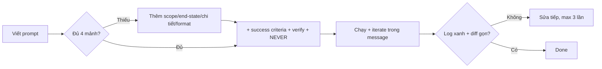

# Tips 02 — Prompt engineering: viết sao, ra vậy

> **Bài này cho ai:** dev hay gõ prompt rồi nhận output lan man, hoặc người mới (kể cả không viết code) muốn Claude Code ra kết quả đúng ngay lần đầu.
> **Cần gì trước:** đã cài và đăng nhập Claude Code ([bài 01](../01-huong-dan-su-dung/01-cai-dat-va-xac-thuc.md)); không bắt buộc đọc gì thêm.
> **Đọc xong bạn làm được:**
> - Viết prompt đủ 4 thành phần (files / end-state / chi tiết / format) kèm 3 gia vị (tiêu chí thành công / cách verify / ràng buộc phủ định).
> - Chọn đúng 1 trong 6 mẫu prompt theo task: bug, feature, refactor, research, review, data/docs.
> - Tự chấm prompt cũ theo bảng sai→sửa + checklist 10 ô trước khi bấm Enter.
> - Viết prompt cho data/docs được dù bạn không biết code.
> **Thời gian:** ~40 phút

## Thuật ngữ dùng trong bài này

Đọc bảng này trước khi vào mục 1 — mọi thuật ngữ Anh trong bài đều được giải thích ở đây.

| Thuật ngữ | Hiểu nôm na là gì | Ví dụ thấy ngay |
|---|---|---|
| Scope (files nào) | Khoanh vùng model được phép đọc/sửa — càng hẹp càng rẻ | `Chỉ đọc src/auth/login.ts + __tests__/login.test.ts` |
| End-state | Trạng thái "xong" trông thế nào, không phải đang làm gì | `Tách auth.ts thành 3 modules, giữ public API, test xanh` |
| Verify | Câu dặn model tự chạy check rồi dán kết quả, thay vì "chắc đúng" | `Chạy pnpm --filter auth test và dán log` |
| NEVER (ràng buộc phủ định) | Danh sách cấm địa model không được đụng | `Đừng đụng src/generated/, đừng commit thẳng main` |
| Plan mode | Chế độ chỉ lập plan chờ bạn duyệt, code sau | Mẫu 2: `Chờ tôi duyệt mới implement. Không code trong message này.` |
| Regression test | Test dựng lại đúng bug cũ, để lỗi không quay lại | Mẫu 1: `Thêm 1 regression test cover case này` |
| Diff (`git diff --stat`) | Bảng kê file nào đã thay đổi — dùng để xem có lệch scope không | `git diff --stat` chỉ chạm `apps/auth/**` |
| Subagent | Agent con có context riêng, nhận việc rộng rồi chỉ trả tóm tắt về main | Mẫu 4: `Dùng subagent explore src/payments/refund*` |

## Mục lục

1. [Vì sao prompt quyết định output?](#1-vì-sao-prompt-quyết-định-output)
2. [Giải phẫu prompt tốt: 4 thành phần](#2-giải-phẫu-prompt-tốt-4-thành-phần)
3. [Ba gia vị nâng chất lượng 10x](#3-ba-gia-vị-nâng-chất-lượng-10x)
4. [Sáu mẫu prompt theo task (copy-paste)](#4-sáu-mẫu-prompt-theo-task-copy-paste)
5. [Walkthrough: từ prompt tệ tới prompt tốt](#5-walkthrough-từ-prompt-tệ-tới-prompt-tốt)
6. [Bảng sai→sửa](#6-bảng-saisửa)
7. [Hướng dẫn cho người không viết code (non-coder)](#7-hướng-dẫn-cho-người-không-viết-code-non-coder)
8. [Checklist trước khi Enter](#8-checklist-trước-khi-enter)
9. [Pitfalls + fix](#9-pitfalls--fix)
10. [Bảng tra nôm na + analogie + verify cho 3 thuật ngữ chính](#10-bảng-tra-nôm-na--analogie--verify-cho-3-thuật-ngữ-chính)
11. [Sơ đồ Mermaid: từ prompt tới done](#11-sơ-đồ-mermaid-từ-prompt-tới-done)
12. [Bảng so sánh activity vs end-state (hiểu nôm na + ví dụ)](#12-bảng-so-sánh-activity-vs-end-state-hiểu-nôm-na--ví-dụ)
13. [Before/After: prompt dở vs prompt tốt](#13-beforeafter-prompt-dở-vs-prompt-tốt)
14. [Hiểu nhầm thường gặp](#14-hiểu-nhầm-thường-gặp)
15. [Bài tập](#15-bài-tập)
16. [Tham khảo chéo](#16-tham-khảo-chéo)

---

## 1. Vì sao prompt quyết định output?

Mục này trả lời câu: vì sao model giỏi mà prompt ẩu vẫn cho output lan man, và 2 phút viết prompt kỹ tiết kiệm được gì?

Claude Code không đọc được ý nghĩ. Prompt tốt = chỉ đúng files + end-state cụ thể + cách verify + ràng buộc. Bài này mổ xẻ cấu trúc 4 thành phần, 6 mẫu prompt theo task, bảng sai→sửa và hướng dẫn cho người không viết code.

### 1.1. Model giỏi + prompt ẩu = output lan man

Nguyên nhân #1 của "Claude sửa lan man, đọc 100 files, đổi API không hỏi":

- Không phải model lười, mà là bạn cho model **quyền tự do quá rộng**.
- Prompt `"investigate auth"` với repo 500 files = mời model đi lạc.
- Prompt `"fix login"` không scope = model tự đoán scope, tự đoán done, tự đoán verify.

### 1.2. Cơ chế: prompt là "hợp đồng" giới hạn search space

Mỗi prompt tốt làm 3 việc:

1. **Thu hẹp search space:** từ 500 files → 5 files. Từ "làm gì cũng được" → "chỉ làm X".
2. **Định nghĩa done có thể check:** từ "cho sạch" → "`pnpm test auth` xanh".
3. **Gài vòng lặp tự sửa:** "chạy X và iterate trong message này" → Claude tự retry thay vì trả lời "xong rồi (chắc vậy)".

### 1.3. Đắt rẻ của prompt

- Viết prompt kỹ 2 phút → tiết kiệm 20 phút sửa + rewind + retry.
- Prompt ẩu 10 giây → 5 turns cãi nhau, mỗi turn gánh thêm rác vào context.
- Plan-first ([Tips 03](./03-plan-first-workflow.md)) chính là "prompt đắt" cho task lớn: trả 1 turn plan để tránh 10 turns code sai.

---

## 2. Giải phẫu prompt tốt: 4 thành phần

Mục này trả lời câu: 1 prompt tốt gồm những mảnh nào, và viết từng mảnh ra sao để copy-paste được ngay?

Mọi prompt tốt đều có đủ 4 mảnh. Thiếu 1 mảnh là output lệch 1 hướng.

### 2.1. Thành phần 1 — Files nào (scope)

Chỉ file/thư mục liên quan. Càng cụ thể càng rẻ.

```text
TỐT: "Chỉ đọc src/auth/login.ts + src/auth/__tests__/login.test.ts"
TỐT: "Scope src/payments/*.ts, đừng đụng src/legacy/"
TỆ:  "Đọc cả repo rồi cho ý kiến"
```

Mẹo:

- Dùng `@` để nạp file vào context (IDE/CLI hỗ trợ): `@src/auth/login.ts`.
- Nếu file >1000 dòng: đừng ném nguyên. Bảo subagent tóm tắt từng phần, main chỉ nhận outline.
- Không có code (data/docs): thay "files" bằng "nguồn" — `/data/feedback-q3.csv`, `docs/sprint-12.md`.

### 2.2. Thành phần 2 — Tìm/tạo gì (end-state, không phải activity)

Mô tả **trạng thái cuối**, không mô tả hoạt động.

```text
TỆ (activity):  "Analyze this data" / "Xem giúp auth" / "Refactor cho sạch"
TỐT (end-state): "Top 5 complaints theo frequency, mỗi dòng: quote + count + segment, markdown table"
TỐT (end-state): "Tách src/auth.ts (>500 dòng) thành 3 modules, giữ public API, test xanh"
```

Công thức: **động từ + đối tượng + tiêu chuẩn chấp nhận**.

### 2.3. Thành phần 3 — Chi tiết nào (độ phân giải)

Bạn muốn sâu tới đâu? Columns nào? Quotes? Counts? Segments? Edge cases?

```text
TỐT data: "Mỗi dòng: quote nguyên văn + count + segment. Đối chiếu totals ở summary vs raw data, lệch thì fix trước khi show."
TỐT code: "Liệt kê files sẽ sửa (đường dẫn đầy đủ), hàm nào đổi signature, test nào phải giữ xanh."
TỆ: "Cho chi tiết vào" (chi tiết gì? bao nhiêu là đủ?)
```

### 2.4. Thành phần 4 — Format output nào

Không chỉ định format = nhận format ngẫu nhiên (lúc table, lúc prose dài, lúc JSON gãy).

```text
TỐT: "Output markdown table: | File | Việc | Verify |"
TỐT: "Trả về plan markdown lưu vào plan.md, gồm: steps + risks + verify từng phase."
TỐT: "Trả về JSON: {files: [...], risks: [...], verify: '...'}"
```

### 2.5. Ví dụ tổng hợp 4 thành phần

```text
TỆ:
"Analyze this data"

TỐT (copy-paste):
"Đọc /data/feedback-q3.csv. Tìm top 5 complaints theo frequency.
Mỗi dòng: quote nguyên văn + count + segment. Output markdown table.
Xong đối chiếu totals ở summary vs raw data, lệch thì fix trước khi show.
Không tạo file mới, chỉ trả lời trong chat."
```

Phân tích:

- Files: `/data/feedback-q3.csv` (1).
- End-state: top 5 complaints theo frequency (2).
- Chi tiết: quote + count + segment + đối chiếu totals (3).
- Format: markdown table, chỉ chat (4).

---

## 3. Ba gia vị nâng chất lượng 10x

Mục này trả lời câu: ngoài 4 thành phần, thêm 3 gia vị nào để model tự chạy check và không đụng cấm địa?

### 3.1. Gia vị 1 — Tiêu chí thành công (success criteria) viết rõ

Done phải check được bằng lệnh, không bằng cảm giác.

```text
TỆ:  "làm cho sạch, đảm bảo không lỗi"
TỐT: "Done = `pnpm --filter auth test` xanh + `pnpm lint` 0 error + `git diff --stat` chỉ chạm apps/auth/**"
TỐT: "Done = demo log của flow refund paste ở cuối + screenshot /verify pass"
```

Xem thêm thang verification ở [Tips 04](./04-verification-done-that.md).

### 3.2. Gia vị 2 — Cách verify (bắt model tự lặp trong message)

Thêm 1 câu này, Claude tự chạy → đọc lỗi → sửa → chạy lại, thay vì dừng ở "chắc đúng".

```text
"Sau khi sửa, chạy `pnpm --filter auth test` và dán log pass/fail. Nếu đỏ, fix tiếp trong message này tới khi xanh hoặc dừng sau 3 lần và báo blocker."
```

Biến thể cho data / docs:

```text
"Sau khi ra table, đối chiếu tổng counts với `wc -l` raw file. Lệch >1% thì kiểm tra lại trước khi show."
```

### 3.3. Gia vị 3 — Ràng buộc phủ định (NEVER / đừng)

Model cần biết **cấm địa**. Không dặn là model sẽ đụng.

```text
"Đừng đụng `src/generated/`, đừng đổi DB schema, đừng commit thẳng main, đừng thêm dependency mới."
"Chỉ sửa trong src/payments/. Không refactor file khác 'cho tiện'."
"Không tạo file mới nếu chưa hỏi. Không xóa test cũ để cho xanh."
```

Mẹo: gom ràng buộc chung vào `CLAUDE.md` (tự áp mọi turn), chỉ để ràng buộc riêng task trong prompt.

---

## 4. Sáu mẫu prompt theo task (copy-paste)

Mục này trả lời câu: gặp task bug, feature, refactor, research, review hay data/docs thì copy-paste prompt nào?

### 4.1. Mẫu 1 — BUG (fix tối thiểu + regression test)

```text
BUG: Tái hiện lỗi [mô tả + steps tái hiện + log lỗi paste kèm].

1. Tìm root cause trong <module, vd src/auth/login.ts>, giải thích 3 bullet trước khi sửa.
2. Fix tối thiểu, không refactor lan man, không đổi public API.
3. Thêm 1 regression test cover case này.
4. Chạy focused test `pnpm --filter <pkg> test <file>` và dán kết quả. Đỏ thì fix tiếp trong message này.
Ràng buộc: đừng đụng <liệt kê cấm địa>.
```

Ví dụ điền sẵn:

```text
BUG: Login bằng email có dấu + bị 500. Steps: nhập "tên@vidu.vn" → bấm login → 500.
Log: TypeError normalizeEmail ở src/auth/login.ts:42.
Tìm root cause trong src/auth/login.ts, fix tối thiểu, thêm regression test,
chạy pnpm --filter auth test login và dán log. Đừng đổi API, đừng đụng generated/.
```

### 4.2. Mẫu 2 — FEATURE (plan trước, code sau)

```text
FEATURE: Tôi muốn <mục tiêu 1 câu>.

Trước khi code:
1. Đọc <tối đa 3 file liên quan, ghi đường dẫn>.
2. Trình plan gồm: files sẽ đọc/sửa, steps theo thứ tự, risks/edge cases, cái gì KHÔNG đụng, cách verify từng phase.
3. Chờ tôi duyệt mới implement. Không code trong message này.
Output: markdown plan, lưu vào plan.md.
```

### 4.3. Mẫu 3 — REFACTOR (giữ API + gate từng bước)

```text
REFACTOR: Tách file <X, vd src/auth.ts ~900 dòng> thành modules <liệt kê, vd auth/login, auth/session, auth/types>.
- Giữ nguyên public API (export cũ vẫn import được).
- Làm từng bước nhỏ, chạy full test `pnpm test <scope>` sau mỗi bước.
- Dừng và báo ngay nếu test đỏ, không cố vá tiếp.
- Cuối cùng dán `git diff --stat` + log test xanh.
```

### 4.4. Mẫu 4 — RESEARCH (subagent + output chuẩn)

```text
RESEARCH: Dùng subagent explore <phạm vi hẹp, vd src/payments/refund*>.
- Không sửa code, chỉ đọc.
- Trả về: (1) files liên quan (đường dẫn + 1 dòng vai trò),
  (2) flow hiện tại (5-8 bullet),
  (3) 2 phương án thay đổi (pros/cons mỗi cái 3 bullet).
- Chỉ liệt kê files mày sẽ sửa/đọc nếu làm change tiếp theo. Không dump log dài.
```

### 4.5. Mẫu 5 — REVIEW (adversarial, có severity)

```text
REVIEW: Review diff này với plan trong plan.md.
- Định nghĩa finding = bug/correctness/security/test-gap thực sự. Bỏ qua style preferences.
- Trả về danh sách: [SEVERITY: HIGH/MED/LOW] file:line — mô tả 1 dòng — gợi ý fix 1 dòng.
- Cuối cùng: verdict PASS / NEEDS-FIX + 3 gaps ưu tiên cao nhất.
```

Chi tiết calibration reviewer ở [Tips 04](./04-verification-done-that.md).

### 4.6. Mẫu 6 — DATA / DOCS (người không viết code và coder đều dùng)

```text
DATA: Đọc <file csv/docs, vd /data/feedback-q3.csv>.
- Tìm <câu hỏi cụ thể, vd top 5 complaints theo frequency>.
- Mỗi kết quả kèm evidence: quote/số dòng/file:line.
- Đối chiếu chéo (totals, wc -l, summary) trước khi show. Lệch thì báo lệch.
- Output: markdown table + 3 bullet insight + 1 dòng "confidence: cao/trung/thấp vì...".
```

---

## 5. Walkthrough: từ prompt tệ tới prompt tốt

Mục này trả lời câu: sửa 1 prompt theo từng vòng thì thêm gì vào, và mỗi vòng tiết kiệm được bao nhiêu turn?

**Tình huống:** bạn muốn refactor file `auth.ts` 800 dòng. Lần 1 prompt ẩu.

**Round 0 — Prompt tệ:**

```text
"Refactor auth cho sạch"
```

→ Claude đọc 40 files, đổi luôn API, thêm dependency, test đỏ 5 chỗ. Bạn mất 45 phút rewind.

**Round 1 — Thêm scope + end-state:**

```text
"Refactor src/auth.ts (800 dòng) thành 3 modules: login, session, types. Giữ public API."
```

→ Đỡ hơn, nhưng Claude vẫn không chạy test, bạn phải nhắc "chạy test đi" thêm 2 turns.

**Round 2 — Thêm verify + ràng buộc (prompt đạt chuẩn):**

```text
"Refactor src/auth.ts (~800 dòng) thành src/auth/login.ts, session.ts, types.ts.
Giữ nguyên public API (file cũ re-export để không gãy import).
Sau mỗi bước chạy `pnpm --filter auth test` và dán log. Đỏ thì dừng và báo.
Đừng đụng src/generated/, đừng thêm dep mới, đừng commit.
Trước khi code, trình outline 5 bullet files/hàm sẽ di chuyển và chờ duyệt."
```

→ 1 turn plan + 3 turns implement sạch, test xanh, `git diff --stat` gọn. Tổng 15 phút.

Bài học: **mỗi vòng thêm 1 thành phần (scope → end-state → verify → constraints → format) là bớt 2–3 turns sửa.**

---

## 6. Bảng sai→sửa

Mục này trả lời câu: 8 lỗi prompt hay gặp gây hỏng theo hướng nào, và copy ý nào thay thế?

| Sai (prompt ẩu) | Vì sao hỏng | Sửa (copy ý này) |
|---|---|---|
| `"investigate auth"` (không scope) | Đọc 300 files, tốn 30K tokens | Khoanh module + câu hỏi cần trả lời + output format |
| Một prompt 5 việc không liên quan | Context nhiễm, việc nọ lẫn việc kia | Tách 5 prompts/sessions, mỗi cái 1 việc + `/clear` giữa |
| Không cho cách verify | "Xong rồi (chắc vậy)" | Luôn kèm check: test/lint/log/diff + dán evidence |
| Mô tả solution thay vì problem | Ép model theo hướng sai từ đầu | Mô tả problem + constraints, để Claude đề xuất solution trong plan mode |
| File >1000 dòng ném nguyên | Tràn context, model quên đầu | Tách nhỏ trước, hoặc subagent tóm tắt từng phần, main chỉ nhận outline |
| `"làm cho nhanh"` | Model cắt test, cắt verify | Đổi thành `"làm tối thiểu nhưng test phải xanh, dán log"` |
| Không ràng buộc phủ định | Sửa lan sang file cấm | Liệt kê NEVER: generated/, schema, main, dep mới |
| Không format output | Nhận prose dài khó review | Chỉ định: table / plan.md / JSON / bullet + file:line |

---

## 7. Hướng dẫn cho người không viết code (non-coder)

Mục này trả lời câu: không biết code thì chuyển 4 thành phần sang ngôn ngữ nào, và bắt đầu từ prompt nào?

Cùng công thức 4 thành phần, chỉ thay từ ngữ:

| Coder nói | Non-coder nói |
|---|---|
| Files | Nguồn: data folder, docs, sheet, email export |
| Test xanh | Đối chiếu số liệu (totals, wc -l, summary) |
| Diff | So sánh trước/sau (table cũ vs mới) |
| Lint | Checklist chính tả / format |

**Prompt khởi động cho người mới (copy-paste):**

```text
"Phỏng vấn tôi để hiểu project này, rồi tạo CLAUDE.md.
Hỏi từng câu một: project làm gì, dữ liệu ở đâu, output muốn gì,
cái gì không được đụng. Khi đủ thì sinh CLAUDE.md <100 dòng."
```

→ Bạn chỉ cần trả lời hội thoại, Claude lo cấu trúc. Sau đó mọi prompt tiếp theo tự gọn vì đã có `CLAUDE.md`.

**Ví dụ hoàn chỉnh cho người không viết code:**

```text
"Đọc thư mục /data/feedback/. Tìm 3 lý do khách phàn nàn nhiều nhất tháng này.
Mỗi lý do kèm 2 quotes nguyên văn + số lượng. Output table markdown.
Đối chiếu tổng với file summary.xlsx, lệch thì báo. Không xóa/sửa file gốc."
```

---

## 8. Checklist trước khi Enter

Mục này trả lời câu: trước khi bấm Enter, bạn tự chấm prompt theo đủ 10 ô nào?

- [ ] Có **scope** cụ thể (files/thư mục/đường dẫn)?
- [ ] Có **end-state** (xong thì trông thế nào, không phải "cố gắng")?
- [ ] Có **độ phân giải** (columns, counts, edge cases cần cover)?
- [ ] Có **format output** (table, plan.md, JSON, bullet + file:line)?
- [ ] Có **success criteria** check được bằng lệnh/số?
- [ ] Có **cách verify** + dặn iterate trong message?
- [ ] Có **ràng buộc NEVER** (cấm địa, không commit, không đổi API)?
- [ ] Task >1 file hoặc >2 steps → đã thêm **"trình plan, chờ duyệt"**?
- [ ] File >1000 dòng → đã tách hoặc giao subagent tóm tắt?
- [ ] 1 prompt 1 việc (không gộp 5 việc)?

**Kiểm tra nhanh:**

- Tick đủ 10 ô → prompt của bạn thuộc top 5%.

---

## 9. Pitfalls + fix

Mục này trả lời câu: 9 bẫy prompt nào khiến bạn tốn turns nhất, nhận ra bằng triệu chứng nào và fix ra sao?

Đọc bảng này khi prompt của bạn vừa có 1 trong 9 triệu chứng dưới đây.

| Pitfall | Triệu chứng | Fix |
|---|---|---|
| Prompt 1 dòng cho task 5 bước | Output thiếu, phải hỏi vặn 5 turns | Task lớn → plan mode + 6 mẫu ở mục 4 |
| Scope "cả repo" | Đọc hàng trăm files, chậm, tốn tiền | Khoanh ≤5 files + subagent cho phần rộng |
| Không dặn verify | "Should work" | Luôn kèm lệnh test + dán log (xem [Tips 04](./04-verification-done-that.md)) |
| Dặn solution thay vì problem | Hướng sai khó cứu | Problem + constraints trước, solution để plan mode đề xuất |
| Gộp bug + feature + refactor 1 prompt | Sửa A hỏng B | Tách sessions, `/clear` giữa (xem [Tips 01](./01-context-hygiene.md)) |
| Quên NEVER | Đụng generated/, push main | Mọi prompt code đều có 1 dòng NEVER |
| Output prose dài 100 dòng | Khó review, khó diff | Ép format: table / checklist / file:line |
| File khổng lồ ném nguyên | Quên rule, trả lời lan man | Subagent tóm tắt, main chỉ nhận outline |
| Hỏi lại cùng câu 3 lần | Model không hiểu ý | Viết lại bằng end-state + ví dụ input/output mẫu |

---

## 10. Bảng tra nôm na + analogie + verify cho 3 thuật ngữ chính

Mục này trả lời câu: scope, end-state, verify + NEVER hình dung ra sao theo cách đời thường, và tự kiểm chứng prompt đã đủ chưa bằng cách nào?

Đọc bảng này khi muốn nhớ nhanh 3 mảnh quan trọng nhất của prompt bằng hình ảnh đời thường thay vì lý thuyết.

| Thuật ngữ | Nôm na 1 câu | Analogie | Ví dụ kỹ thuật thật | Cách verify |
|---|---|---|---|---|
| Scope (files nào) | Khoanh vùng cho model, càng hẹp càng rẻ. | Như khoanh bản đồ tìm kho báu: khoanh 1 phường thay vì cả thành phố. | `Chỉ đọc src/auth/login.ts + __tests__/login.test.ts` | `git diff --stat` chỉ chạm scope; không đọc 100 files. |
| End-state | Trạng thái xong trông thế nào, không phải đang làm gì. | Như đặt món: `cơm gà xối mỡ` thay vì `nấu gì đó cho ngon`. | `Top 5 complaints, mỗi dòng quote+count+segment, markdown table` | Output có đủ 5 dòng + table, không phải prose dài. |
| Verify + NEVER | Câu bắt tự chạy check + vùng cấm không được đụng. | Như hợp đồng: nghiệm thu (verify) + điều cấm (NEVER). | `Chạy pnpm test auth và dán log. Đừng đụng generated/` | Log xanh dán kèm + `diff` không chạm cấm địa. |

---

## 11. Sơ đồ Mermaid: từ prompt tới done

Mục này trả lời câu: từ lúc gõ prompt tới lúc ra kết quả, vòng lặp đi qua những bước nào và dừng ở đâu?



Giải thích:

1. **A→B:** check 4 mảnh (files/end-state/chi tiết/format).
2. **B→C:** thiếu 1 là lệch 1 hướng → bổ sung.
3. **→D:** thêm criteria check được + verify + NEVER.
4. **D→E:** dặn iterate trong message để tự retry.
5. **E→F:** log xanh + diff gọn mới done.

---

## 12. Bảng so sánh activity vs end-state (hiểu nôm na + ví dụ)

Mục này trả lời câu: mô tả "đang làm gì" và mô tả "xong ra sao" cho 2 kết quả khác nhau ở đâu?

| Kiểu prompt | Hiểu nôm na | Ví dụ |
|---|---|---|
| Activity (tệ) | Nói đang làm gì, không nói xong ra sao | `Xem giúp auth` → đọc 40 files, đổi luôn API |
| End-state (tốt) | Nói xong nhận được gì cụ thể | `Tách auth.ts thành 3 modules, giữ API, test xanh` → 15 phút xong |

**Prompt mẫu (copy-paste):**

```text
"Refactor src/auth.ts (~800 dòng) thành login/session/types. Giữ API. Sau mỗi bước chạy pnpm --filter auth test và dán log. Đừng đụng generated/."
```

**Kiểm tra nhanh:**

- Prompt trên → 1 turn plan 5 bullet + 3 turns implement + log xanh + `diff --stat` gọn. Nếu model vẫn hỏi `test gì?` là prompt của bạn thiếu verify.

---

## 13. Before/After: prompt dở vs prompt tốt

Mục này trả lời câu: cùng 1 yêu cầu refactor, prompt dở và prompt tốt chênh nhau bao nhiêu về thời gian và độ hỏng?

**Before (dở):** `"Refactor auth cho sạch"` → Kết quả dở: đọc 40 files, đổi API, test đỏ 5 chỗ, mất 45 phút rewind.

**After (tốt):**

```text
"Refactor src/auth.ts (800 dòng) thành src/auth/login.ts, session.ts, types.ts. Giữ API (re-export). Sau mỗi bước chạy pnpm --filter auth test và dán log. Đỏ thì dừng. Đừng đụng generated/, đừng thêm dep. Trước khi code trình outline 5 bullet chờ duyệt."
```

**Kiểm tra nhanh:**

- Kết quả After: plan duyệt trước, test xanh từng bước, tổng 15 phút, không rewind.

---

## 14. Hiểu nhầm thường gặp

Mục này trả lời câu: 3 lầm tưởng nào khiến bạn viết prompt sai dù đã nắm công thức?

| Hiểu nhầm | Sự thật |
|---|---|
| Prompt 1 dòng cho task 5 bước là nhanh | Viết 2 phút tiết kiệm 20 phút sửa; task lớn phải plan mode |
| Mô tả solution chi tiết là tốt | Ép sai hướng từ đầu; mô tả problem + constraints, để plan đề xuất solution |
| `Làm cho nhanh` là tối ưu | Model cắt test/verify; phải `tối thiểu nhưng test xanh, dán log` |

---

## 15. Bài tập

Mục này trả lời câu: làm 3 bài nào để 4 thành phần + 3 gia vị thành phản xạ?

**Bài 1 (10 phút — mổ prompt cũ):**

- Lấy 3 prompts gần nhất bạn đã gõ (trong transcript hoặc trí nhớ).
- Chấm mỗi prompt theo 4 thành phần (files / end-state / chi tiết / format): thiếu mảnh nào?
- Viết lại 1 prompt tệ nhất thành bản đủ 4 mảnh + verify + NEVER.

**Bài 2 (20 phút — dùng 6 mẫu):**

- Lấy 1 bug thật + 1 feature thật trong repo.
- Viết prompt bug theo Mẫu 1, prompt feature theo Mẫu 2 (plan trước).
- Chạy thử, đếm số turns tới done. Mục tiêu: bug ≤4 turns, feature có plan duyệt trước khi code.

**Bài 3 (15 phút — cho người không viết code):**

- Dùng prompt phỏng vấn ở mục 7 để tạo/sửa `CLAUDE.md` cho project.
- Sau đó nhờ 1 đồng nghiệp không viết code dùng Mẫu 6 (data) để hỏi dữ liệu. Ghi lại: họ có cần bạn "dịch" không?

**Kiểm tra nhanh:**

- Đạt: sau 1 tuần, ≥80% prompts của bạn có scope + verify + NEVER mà không cần cố nhớ (đã thành phản xạ).

---

## 16. Tham khảo chéo

Mục này trả lời câu: muốn đi sâu từng lệnh hoặc chủ đề liên quan prompt thì mở link nào?

- Lệnh hay kèm prompt:
  - [../01-huong-dan-su-dung/commands/model-mode/plan/README.md](../01-huong-dan-su-dung/commands/model-mode/plan/README.md) — ép plan mode bằng lệnh
  - [../01-huong-dan-su-dung/commands/model-mode/goal/README.md](../01-huong-dan-su-dung/commands/model-mode/goal/README.md) — đặt completion condition
  - [../01-huong-dan-su-dung/commands/code-repo/verify/README.md](../01-huong-dan-su-dung/commands/code-repo/verify/README.md) — chạy app thật để chứng minh
  - [../01-huong-dan-su-dung/commands/code-repo/loop/README.md](../01-huong-dan-su-dung/commands/code-repo/loop/README.md) — lặp tới khi đúng
  - [../01-huong-dan-su-dung/commands/code-repo/code-review/README.md](../01-huong-dan-su-dung/commands/code-repo/code-review/README.md) — review prompt mẫu
  - [../01-huong-dan-su-dung/commands/code-repo/batch/README.md](../01-huong-dan-su-dung/commands/code-repo/batch/README.md) — lặp pattern quy mô lớn
- Bài tips liên quan:
  - [Tips 01](./01-context-hygiene.md) — scope gọn + session sạch
  - [Tips 03](./03-plan-first-workflow.md) — plan-first workflow
  - [Tips 04](./04-verification-done-that.md) — done criteria + adversarial review
  - [Tips 05](./05-parallel-agents.md) — giao việc cho subagents bằng prompt hẹp

> Mẹo 1 dòng: _mỗi prompt đều trả lời 4 câu: files nào, ra cái gì, chi tiết nào, format nào — thiếu 1 là lệch 1 hướng._
