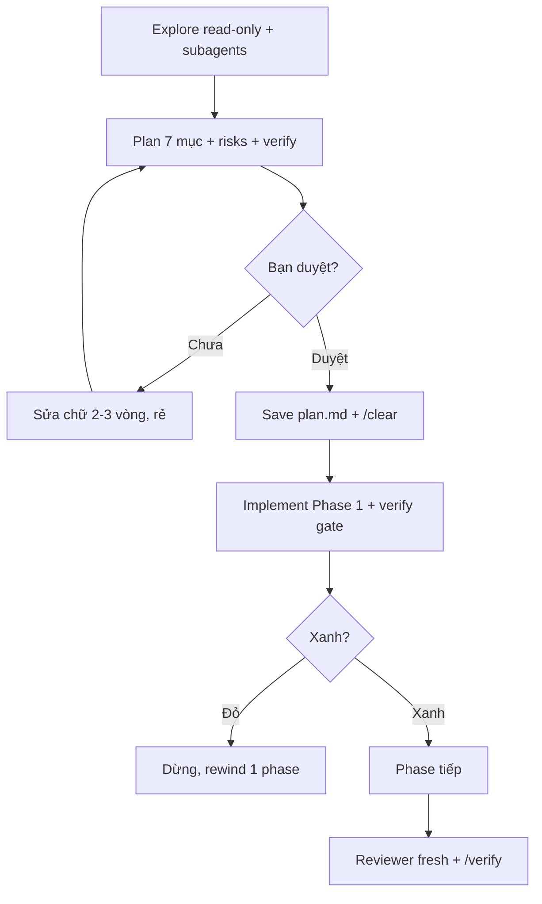

# Tips 03 — Plan trước khi code: Explore → Plan → Implement

> **Bài này cho ai:** dev hay nhảy thẳng vào code ở task phức tạp nên ra kết quả lan man/sai, hoặc tech lead chuẩn hóa flow plan → duyệt → implement cho team.
> **Cần gì trước:** đã cài và đăng nhập Claude Code ([bài 01](../01-huong-dan-su-dung/01-cai-dat-va-xac-thuc.md)); không bắt buộc đọc gì thêm — nhưng đọc [Tips 01 — Vệ sinh context](./01-context-hygiene.md) trước sẽ giúp bạn hiểu vì sao phải tách session plan và session implement.
> **Đọc xong bạn làm được:**
> - Vào plan mode bằng 3 cách (`Shift+Tab`, `/plan`, dặn bằng lời) và tự chọn được khi nào cần plan, khi nào được bỏ qua.
> - Viết plan đủ 7 mục (đọc gì / sửa gì / steps / không đụng / risks / verify / gate) theo template copy-paste.
> - Chạy flow 2 sessions: session A lập plan + lưu `plan.md`, session B `/clear` implement từng phase có gate.
> - Nhận ra 9 pitfall và 3 hiểu nhầm thường gặp của plan-first, kèm cách fix.
> **Thời gian:** ~40 phút

## Thuật ngữ dùng trong bài này

Đọc bảng này trước khi vào mục 1 — mọi thuật ngữ Anh trong bài đều được giải thích ở đây.

| Thuật ngữ | Hiểu nôm na là gì | Ví dụ thấy ngay |
|---|---|---|
| Plan mode | Chế độ chỉ đo đạc: Claude được đọc/grep/đề xuất outline, không được sửa file hay chạy lệnh đổi trạng thái | `Shift+Tab` tới khi màn hình hiện chữ `plan` |
| `/plan` | Lệnh vào plan mode ngay, khỏi xoay phím | Gõ `/plan` giữa lúc đang chat |
| `plan.md` | Bản đồ task lưu ra file — session sau mở lại là có ngay phương hướng | `plan.md` commit cùng code |
| Explore | Bước khảo sát read-only trước khi lập plan | Subagent đọc `src/payments/` trả 5 files liên quan |
| Phase | Một lát cắt việc nhỏ trong plan, có verify riêng | Phase 1: types + validator |
| Phase-gate | Cửa kiểm tra: phase xanh mới được sang phase tiếp | `pnpm --filter payments test types` xanh mới sang Phase 2 |
| Drift | Model tự thêm/bỏ việc ngoài plan, đi lệch so với bản đã duyệt | Tự thêm feature "cho tiện" giữa chừng |
| Session A / Session B | Buổi lập plan / buổi implement trên session sạch | `/clear` để mở session B |
| Rewind | Quay cả code lẫn hội thoại về checkpoint trước khi đi sai | `Esc Esc` khi plan sai hướng |
| Subagent | Agent con có context riêng, chỉ trả tóm tắt về session chính | Subagent explore trả summary ~1.5K tokens |

## Mục lục

1. [Vì sao plan-first thắng?](#1-vì-sao-plan-first-thắng)
2. [Cơ chế plan mode](#2-cơ-chế-plan-mode)
3. [Vào plan mode: 3 cách + đào sâu Shift+Tab](#3-vào-plan-mode-3-cách--đào-sâu-shifttab)
4. [Plan tốt gồm gì (checklist)](#4-plan-tốt-gồm-gì-checklist)
5. [Ví dụ: prompt plan chuẩn copy-paste](#5-ví-dụ-prompt-plan-chuẩn-copy-paste)
6. [Tách 2 sessions cho task lớn (plan-then-execute)](#6-tách-2-sessions-cho-task-lớn-plan-then-execute)
7. [Walkthrough step-by-step: feature payments 2 ngày](#7-walkthrough-step-by-step-feature-payments-2-ngày)
8. [Phase-gate chống lệch plan (drift)](#8-phase-gate-chống-lệch-plan-drift)
9. [Bảng so sánh: khi nào plan vs làm luôn](#9-bảng-so-sánh-khi-nào-plan-vs-làm-luôn)
10. [Pitfalls + fix](#10-pitfalls--fix)
11. [Hiểu nhầm thường gặp](#11-hiểu-nhầm-thường-gặp)
12. [Bài tập](#12-bài-tập)
13. [Tham khảo chéo](#13-tham-khảo-chéo)

---

## 1. Vì sao plan-first thắng?

Mục này trả lời câu: vì sao lập plan trước khi code lại rẻ hơn nhảy thẳng vào implement, và khi nào bạn không cần plan?

**Nguyên nhân số 1 của kết quả lan man/sai là nhảy thẳng vào implement ở task phức tạp.** Plan mode rẻ (chỉ tokens suy nghĩ), code sai đắt (sửa + test + rewind). Mục này đi sâu vào plan mode, checklist cho plan tốt, flow 2 sessions, phase-gate, và khi nào được bỏ qua.

### 1.1. Toán chi phí: plan rẻ, code sai đắt

| Lựa chọn | Tốn gì | Rủi ro |
|---|---|---|
| Plan 1 turn (500–2000 tokens suy nghĩ) | Vài xu, 2 phút đọc | Thấp: sai thì sửa chữ |
| Code ngay 5 files sai | 20K+ tokens + 5 turns sửa + rewind + test đỏ | Cao: lan sang file khác, gãy API |

Số liệu nội bộ team (không phải số chính thức của Anthropic): task >1 file mà không plan → 60% phải rewind ít nhất 1 lần; task có plan duyệt → rewind giảm còn ~15%.

### 1.2. Ba lợi ích ngoài "đỡ sai"

1. **Ép scope rõ:** plan bắt liệt kê files đụng/không đụng → chống lan scope từ gốc.
2. **Chia verify được:** mỗi phase có gate test → bắt lệch plan sớm (xem mục 8).
3. **Lưu được:** plan là file (`plan.md`) — session implement fresh vẫn có bản đồ, không phụ thuộc trí nhớ hội thoại ([Tips 01](./01-context-hygiene.md)).

### 1.3. Khi nào plan-first KHÔNG thắng?

Task 1 file, 1 bước, rõ ràng (đổi text, thêm log, sửa typo) → plan tốn hơn lợi. Xem mục 9 để biết khi nào được bỏ plan.

---

## 2. Cơ chế plan mode

Mục này trả lời câu: bên trong plan mode Claude được làm gì, bị chặn gì, và vòng Explore → Plan → Implement đi theo hướng nào?

### 2.1. Plan mode là gì?

Plan mode = Claude **read-only**:

- Được: đọc file, grep, glob, outline thay đổi, hỏi ngược lại, sinh plan markdown.
- Không được: `Edit` / `Write` source, chạy lệnh đổi trạng thái (migrate, deploy), commit.

> Hiểu nôm na: cho kiến trúc sư đi đo đạc, cấm thợ đụng búa.

### 2.2. Bên trong hoạt động thế nào?

1. **Permissions siết:** tool `Edit`/`Write` bị chặn hoặc yêu cầu duyệt; `Bash` chỉ cho read-only (tùy config).
2. **Output ra file:** plan thường là markdown có cấu trúc (files, steps, risks, verify) — có thể save ra `plan.md` để session sau dùng.
3. **Vòng sửa chữ rẻ (refine):** bạn chê plan → Claude sửa chữ (không sửa code) → 2–3 vòng là chốt, mỗi vòng vài trăm tokens.
4. **Thoát plan = duyệt:** bạn gõ "ok, implement" hoặc `Shift+Tab` về default → mới được code.

### 2.3. Sơ đồ Explore → Plan → Implement

```text
[Explore: đọc + subagents] --> [Plan: outline + risks + verify, chờ duyệt]
        |                                                        |
   rẻ, read-only                                          bạn duyệt / sửa chữ
        |                                                        v
        +-------------> [Implement: code + test từng phase] <----+
                           |                 |
                        gate xanh         gate đỏ → dừng, rewind phase
```

### 2.4. Bản đầy đủ hơn: sơ đồ có gate và vòng refine

Bản này thêm 2 bước mà bản ở mục 2.3 chưa hiện: vòng sửa chữ 2–3 vòng và bước review cuối.



Giải thích:

1. **A→B:** explore rẻ, plan đủ 7 checklist (đọc gì/sửa gì/steps/không đụng/risks/verify/gate).
2. **B→D:** sửa chữ từng vòng, mỗi vòng vài trăm tokens.
3. **C→E:** chốt → lưu file, session implement fresh.
4. **F→G:** mỗi phase có lệnh verify + log.
5. **G→H:** đỏ dừng ngay, không vá lén sang phase khác.

### 2.5. Bảng tra nôm na + analogie + verify cho 3 thuật ngữ chính

Đọc bảng này khi gặp lại 3 thuật ngữ ở các mục sau — mỗi dòng gồm cách hình dung đời thường + ví dụ thật + cách tự kiểm chứng.

| Thuật ngữ | Nôm na 1 câu | Analogie | Ví dụ kỹ thuật thật | Cách verify |
|---|---|---|---|---|
| Plan mode (read-only) | Chế độ chỉ đo đạc, cấm cầm búa. | Như kiến trúc sư đi đo đất: được đo, cấm đổ bê tông. | `Shift+Tab` tới `plan` rồi `Đọc src/auth/ trình plan, không code` | `git status` sạch sau plan (không diff 5 files lén). |
| Phase-gate | Cửa kiểm tra: xanh mới qua phase tiếp. | Như thi học kỳ: đậu kỳ 1 mới học kỳ 2. | `Phase 1 verify: pnpm --filter payments test types xanh mới sang Phase 2` | Mỗi phase có log xanh dán kèm; đỏ thì dừng. |
| Plan-then-execute 2 sessions | Chia 2 buổi: buổi vẽ bản vẽ, buổi thi công. | Như nấu cỗ: sáng đi chợ lên món, chiều mới nấu. | Session A save `plan.md`, Session B fresh `Đọc plan.md chỉ làm Phase 1` | Session B <50% context thay vì 95% rác 3 ngày. |

---

## 3. Vào plan mode: 3 cách + đào sâu Shift+Tab

Mục này trả lời câu: vào plan mode bằng cách nào, cách nào hợp với bạn nhất, và cách nào chắc chắn nhất?

### Cách 1 — `Shift+Tab` xoay chế độ

Nhấn `Shift+Tab` lặp để xoay:

```text
default → acceptEdits → plan → auto → bypass → (quay về default)
```

- Màn hình hiện chữ `plan` là đang ở plan mode.
- `Shift+Tab` tiếp để thoát khi muốn implement.
- Dùng `/terminal-setup` nếu `Shift+Tab` không ăn (iTerm2/VSCode/Kitty/Alacritty/Zed/Warp/WezTerm) — xem [Tips 10](./10-debugging-power-moves.md).

### Cách 2 — Gõ `/plan` trong session

```bash
/plan
# → ép vào plan mode ngay, khỏi xoay Shift+Tab
```

> Xem [../01-huong-dan-su-dung/commands/model-mode/plan/README.md](../01-huong-dan-su-dung/commands/model-mode/plan/README.md).

### Cách 3 — Dặn bằng lời (không cần nhớ phím)

```text
"Trước khi làm gì, trình plan chi tiết và chờ duyệt. Không sửa code trong message này."
"Vào plan mode: chỉ đọc, outline thay đổi, hỏi tôi nếu thiếu thông tin."
```

Cách này hợp cho người mới và người không viết code thường xuyên (xem [Tips 02](./02-prompt-engineering.md)).

### So sánh 3 cách vào plan mode

| Cách | Ưu | Nhược | Dùng khi nào |
|---|---|---|---|
| `Shift+Tab` | Nhanh, không tốn turn | Phải nhớ vòng xoay, terminal kén phím | Người dùng thành thạo, hằng ngày |
| `/plan` | Rõ ràng, 1 lệnh | Phải nhớ tên lệnh | Khi đang chat muốn ép plan giữa chừng |
| Dặn bằng lời | Không cần nhớ gì | Tốn 1 câu, model đôi khi "ngứa tay" code lén | Người mới, không viết code thường xuyên, task giao cho người khác đọc |

> Mẹo: kết hợp — `Shift+Tab` vào plan + câu dặn "không code, chỉ plan" để khóa 2 lớp.

**Kiểm tra nhanh:**

```bash
# Nhấn Shift+Tab tới khi thấy `plan`, rồi gõ:
Đọc src/auth/ và trình plan refactor, không code trong message này.
```

- Màn hình hiện chữ `plan`, Claude chỉ đọc + trả plan, `git status` không có diff → Cách 1 chạy đúng.
- Gõ `/plan` giữa lúc đang chat → vào plan mode ngay, không cần xoay phím → Cách 2 chạy đúng.
- Dặn bằng lời mà model vẫn lén code → quay lại `Shift+Tab` + câu dặn, khóa 2 lớp (Mẹo ở trên).

---

## 4. Plan tốt gồm gì (checklist)

Mục này trả lời câu: một plan được duyệt phải trả lời đủ những câu hỏi nào, và lấy đâu ra khung để bắt Claude trả đúng format?

Plan duyệt được phải trả lời 7 câu hỏi. Thiếu 1 là lúc implement phải đoán.

- [ ] **1. Đọc gì:** files đã đọc + files sẽ đọc (đường dẫn cụ thể, không "vài files auth").
- [ ] **2. Sửa gì:** files sẽ sửa/tạo/xóa (đường dẫn + hàm chính mỗi file).
- [ ] **3. Thứ tự steps:** step 1→2→3, mỗi step 1 việc, ước lượng rủi ro từng step.
- [ ] **4. Không đụng gì:** liệt kê cấm địa (`generated/`, schema, `main`, dep mới).
- [ ] **5. Risks/edge cases:** top 3 rủi ro + case biên (null, empty, unicode, concurrent, migrate cũ).
- [ ] **6. Verify từng phase:** lệnh test/lint/log nào, log trông thế nào là pass.
- [ ] **7. Cửa chia phase + gate:** xong phase N + test xanh mới sang N+1. Đỏ thì dừng.

### Template plan chuẩn (bảo Claude trả đúng khung này)

```markdown
# Plan: <tên task 1 dòng>

## Mục tiêu
- <end-state 2 dòng>

## Files đọc (đã đọc)
- `src/...` — vai trò 1 dòng

## Files sửa (dự kiến)
| File | Việc | Rủi ro |
|---|---|---|
| `src/...` | ... | ... |

## Steps
1. Step 1 — ... — verify: `...`
2. Step 2 — ... — verify: `...`

## Không đụng
- ...

## Risks / Edge cases
- ...

## Verify tổng
- `pnpm ...` xanh + `git diff --stat` chỉ chạm ...
```

---

## 5. Ví dụ: prompt plan chuẩn copy-paste

Mục này trả lời câu: gõ gì để có một plan đủ 7 mục, và prompt dở khác prompt plan ở điểm nào?

### Ví dụ 1 — Feature payments (đủ 7 checklist)

```text
Tôi muốn thêm refund cho POST /api/payments.

Trước khi code, trình plan gồm:
- Code nào sẽ đọc (liệt kê đường dẫn), files nào sẽ sửa (đường dẫn + hàm)
- Steps theo thứ tự + risks/edge cases (idempotency, partial refund, webhook)
- Cái gì KHÔNG đụng (schema? API cũ? generated/?)
- Output format + cách verify chính xác từng phase (lệnh test nào, log nào là pass)
Chờ tôi duyệt mới implement. Không sửa code trong message này.
Output plan dạng markdown, lưu vào plan.md.
```

### Ví dụ 2 — Refactor tách file lớn (ép chia phase)

```text
Tôi muốn tách src/auth.ts (~800 dòng) thành login/session/types, giữ public API.

Vào plan mode. Trình plan gồm 3 phases, mỗi phase có verify gate
(`pnpm --filter auth test` xanh mới sang phase tiếp).
Liệt kê hàm nào di chuyển đi đâu + 3 risks lớn nhất.
Chờ duyệt. Không code.
```

### Ví dụ 3 — Khảo sát khó (ép 2 phương án)

```text
Trước khi làm gì, explore src/queue/worker.ts + docs/queue.md rồi trình plan:
- Flow hiện tại (5 bullet) + root cause nghi ngờ (2 giả thuyết + evidence)
- 2 phương án fix (pros/cons 3 bullet mỗi cái) + đề xuất 1 cái
- Cách verify (test nào, log nào chứng minh hết race)
Chờ tôi chọn phương án mới implement.
```

### Ví dụ 4 — Prompt ngắn 1 dòng khi đã quen

```text
"Vào plan mode. Trình plan 3 phases refund, mỗi phase có verify gate. Chờ duyệt. Không code."
```

### Trước/sau: prompt dở vs prompt plan

Cùng 1 yêu cầu refund, 2 cách viết cho 2 kết quả trái ngược — dùng làm thước đo nhanh prompt của bạn.

**Trước (dở):** `"Thêm refund cho payments"` (code ngay) → Kết quả dở: sửa 5 files sai, lan scope, test đỏ, rewind 1 lần.

**Sau (tốt):**

```text
"Tôi muốn thêm refund POST /api/payments. Trước khi code trình plan: files đọc/sửa, steps, risks (idempotency/partial/webhook), KHÔNG đụng gì, verify từng phase. Chờ duyệt. Lưu plan.md."
```

**Kiểm tra nhanh:**

- Chạy prompt Ví dụ 4 → **thấy:** plan markdown có bảng files/steps/risks/verify + `plan.md` lưu được. Nếu kèm luôn diff là code lén → dặn lại "không sửa code trong message này" + check `git status` (xem mục 10).
- Chạy prompt "Sau" → **thấy:** plan 3 phases (types/service/endpoint+webhook) + sửa plan 2 vòng (thêm edge, tách phase) → implement mỗi phase 1 session fresh, xanh từng gate.

---

## 6. Tách 2 sessions cho task lớn (plan-then-execute)

Mục này trả lời câu: vì sao task lớn phải tách session lập plan và session implement, và mỗi session làm gì?

Vì sao 2 sessions? Vì **context xuống cấp** theo thời gian ([Tips 01](./01-context-hygiene.md)): session research mang 30K rác explore vào người → session implement ngáo. Tách ra là sạch.

```text
Session A (plan, 20-30 phút):
1. Shift+Tab vào plan (hoặc /plan).
2. Paste 1 trong 3 ví dụ mục 5.
3. Sửa plan 2-3 vòng bằng chữ (không code): "phase 2 tách nhỏ hơn", "thêm edge unicode", "bỏ phương án 2".
4. Chốt → save plan.md (commit hoặc copy clipboard).

Session B (fresh, implement):
1. /clear hoặc terminal mới.
2. Paste plan.md + câu lệnh implement (copy-paste dưới).
3. Làm phase-by-phase, verify từng phase, dừng khi đỏ.
```

**Câu lệnh mở Session B (copy-paste):**

```text
Đọc plan.md. Chỉ làm Phase 1 (ghi tên phase).
Thực hiện step-by-step, chạy lệnh verify của phase và dán log pass/fail.
Xong phase 1 + test xanh mới hỏi tôi có sang phase 2 không. Không đụng phase khác.
```

**Biến thể cho team (không đồng bộ):**

```bash
# Người A (senior) làm Session A, commit plan.md, mở PR draft "plan: refund"
# Người B (junior/agent) làm Session B từ plan.md, không cần họp lại
git add plan.md && git commit -m "plan: refund payments (3 phases)" && git push
```

---

## 7. Walkthrough step-by-step: feature payments 2 ngày

Mục này trả lời câu: một feature đi 2 ngày được chia thành những buổi nào, mỗi buổi gõ gì?

**Bối cảnh:** thêm `POST /api/payments/:id/refund`, repo Node + pnpm, có test payments sẵn.

**Ngày 1 sáng — Explore (15 phút):**

```text
Prompt: "Dùng subagent explore src/payments/*.ts. Trả về files liên quan refund (nếu có),
flow charge hiện tại 6 bullet + 2 chỗ dễ gãy khi thêm refund. Không code."
→ Lưu summary vào plan.md (phần "Bối cảnh").
```

**Ngày 1 chiều — Plan (25 phút, Session A):**

```bash
# Shift+Tab tới `plan`, paste Ví dụ 1 (mục 5)
# Claude trả plan 3 phases:
#   P1: types + validator, P2: endpoint + service, P3: webhook + e2e
# Bạn sửa plan 2 vòng:
Vòng 1: "Thêm edge idempotency-key + partial refund vào risks."
Vòng 2: "Phase 2 tách thành 2a (service) + 2b (endpoint). Mỗi phase có verify riêng."
# Chốt → save plan.md → commit
```

**Ngày 2 sáng — Implement P1+P2a (Session B fresh):**

```text
"Đọc plan.md. Chỉ làm Phase 1. Verify bằng pnpm --filter payments test rồi dán log. Dừng sau phase 1."
→ Xanh → /clear → "Đọc plan.md. Chỉ làm Phase 2a..." (session fresh nữa)
```

**Ngày 2 chiều — P2b+P3 + review:**

```text
# Mỗi phase 1 session fresh, tương tự. Xong P3:
/clear
"Spawn reviewer subagent fresh. Review git diff với plan.md.
Finding = bug/correctness/security/test-gap. Trả về [SEVERITY] file:line — mô tả — fix."
→ Fix gaps → /verify (chạy app thật) → /ship mở PR.
```

Tổng: 5–6 sessions gọn thay vì 1 session 90% đầy rác. Chi tiết verify ở [Tips 04](./04-verification-done-that.md), review ở [Tips 05](./05-parallel-agents.md).

---

## 8. Phase-gate chống lệch plan (drift)

Mục này trả lời câu: làm sao chặn model chạy 1 mạch 15 steps rồi đi lung tung giữa chừng?

Đừng duyệt 1 plan khổng lồ 15 steps rồi thả model chạy 1 mạch. Nó sẽ đi lệch plan (drift): tự chế thêm, bỏ verify, sửa lan.

### Công thức gate

```text
Mỗi phase có: việc + verify lệnh + điều kiện sang phase tiếp.
Claude xong + verify phase N (dán log xanh) mới được đụng phase N+1.
Phase nào đỏ → dừng toàn bộ, báo blocker, không vá lén sang phase khác.
```

### Ví dụ gate trong plan.md

```markdown
## Phase 1 — Types + validator
- Việc: thêm RefundRequest/RefundResult trong src/payments/types.ts
- Verify: `pnpm --filter payments test types` xanh
- Gate: xanh mới sang Phase 2. Đỏ → dừng, dán log.

## Phase 2a — Service refund()
- Việc: implement refund() idempotent trong src/payments/service.ts
- Verify: `pnpm --filter payments test service` xanh (gồm 2 cases mới)
- Gate: tương tự.
```

### Bảng: có gate vs không gate

| Không gate | Có gate |
|---|---|
| Chạy 1 mạch 10 steps, hỏng ở step 3 nhưng tới step 9 mới biết | Hỏng step 3 dừng ngay, rewind 1 phase |
| Không log từng phase, cuối mới "chắc xanh" | Mỗi phase có log xanh dán kèm |
| Lệch plan: tự thêm feature "cho tiện" | Mọi thêm ngoài plan phải hỏi trước |

---

## 9. Bảng so sánh: khi nào plan vs làm luôn

Mục này trả lời câu: dựa vào tín hiệu nào để quyết định lập plan trước hay làm luôn?

| Tín hiệu | Plan-first | Làm luôn |
|---|---|---|
| Số files | >1 file | 1 file |
| Số steps | >2 steps | 1–2 steps rõ ràng |
| Rủi ro | Đụng API/schema/migrate/auth/money | Đổi text, thêm log, typo, style |
| Độ mờ | Chưa rõ làm thế nào (cần explore) | Biết chính xác sửa dòng nào |
| Review | Cần người duyệt trước khi code | Tự làm tự chịu được |
| Ví dụ | Refund payments, tách file 800 dòng, fix race | Sửa label button, thêm `console.log`, bump version docs |

> Quy tắc ngón tay: **>1 file hoặc >2 steps → vào plan mode theo phản xạ.** Không cần nghĩ, cứ plan trước.

### Bảng nôm na + ví dụ cho người mới

Đọc bảng này khi muốn nhớ nhanh 3 hướng đi bằng hình ảnh đời thường, thay vì bảng tín hiệu ở trên.

| Cách | Hiểu nôm na | Ví dụ |
|---|---|---|
| Code ngay | Thợ xây không bản vẽ, xây tới đâu sửa tới đó | Task 5 files không plan → 60% phải rewind |
| Plan-first | Vẽ bản vẽ 2 phút, đỡ đập nhà 2 ngày | Plan 1 turn 500-2000 tokens → rewind còn ~15% |
| Bỏ plan | Đi chợ mua rau không cần bản vẽ | Đổi text/thêm log 1 file, verify 1 dòng |

### Khi nào được bỏ plan nhưng vẫn an toàn (3 điều kiện đủ)

1. Lệnh verify 1 dòng (`pnpm test <1 file>` xanh là xong).
2. Ràng buộc NEVER viết được trong 1 dòng.
3. Rewind được trong 10 giây nếu sai (chưa push, chưa migrate).

Thiếu 1 trong 3 → quay lại plan.

---

## 10. Pitfalls + fix

Mục này trả lời câu: 9 bẫy của plan-first có triệu chứng gì và cách fix từng cái là gì?

Đọc bảng này khi plan của bạn vừa dính 1 trong các dấu hiệu dưới đây.

| Pitfall | Triệu chứng | Fix |
|---|---|---|
| Plan chung chung ("sửa vài files auth") | Implement đoán, scope lan ra | Ép template 7 mục (mục 4), đường dẫn đầy đủ |
| Plan 15 steps không gate | Lệch plan, hỏng giữa không biết | Chia ≤3–4 phases, mỗi phase có verify + gate |
| Plan trong session bẩn (70% rác) | Plan quên ràng buộc, thiếu files | `/clear` rồi mới plan; nạp `CLAUDE.md` + spec gọn |
| Duyệt plan vội (ok luôn) | Plan sai lọt xuống code | Sửa plan ít nhất 1 vòng: hỏi "risks? edge? verify?" |
| Code lén trong plan mode | Plan kèm luôn diff 5 files | Dặn rõ "không sửa code message này"; check `git status` sau plan |
| Plan xong không lưu file | Session implement quên nửa plan | Save `plan.md` + commit; Session B paste plan |
| 1 session làm hết plan 3 ngày | Context 90%, implement ngáo | Mỗi phase 1 session fresh (mục 6) |
| Không định nghĩa NEVER trong plan | Implement đụng cấm địa | Mọi plan đều có mục "Không đụng" |
| Tin plan là đúng tuyệt đối | Plan sai hướng vẫn code theo | Coi plan là giả thuyết: phase 1 là rẻ nhất để kiểm chứng, sai thì sửa plan |

---

## 11. Hiểu nhầm thường gặp

Mục này trả lời câu: những lầm tưởng nào khiến plan của bạn trở nên vô dụng dù vẫn làm đúng quy trình?

| Hiểu nhầm | Sự thật |
|---|---|
| Plan là đúng tuyệt đối | Plan là giả thuyết; phase 1 là cách rẻ nhất kiểm chứng, sai thì sửa plan |
| Plan 15 steps không gate cho oai | Lệch plan, hỏng ở step 3 tới step 9 mới biết; chia ≤4 phases có gate |
| Plan trong session bẩn 70% rác vẫn được | Plan quên ràng buộc; phải `/clear` rồi mới plan |

---

## 12. Bài tập

Mục này trả lời câu: làm 3 bài nào để plan-first thành phản xạ tay thay vì lý thuyết?

**Bài 1 (15 phút — xoay chế độ):**

1. Nhấn `Shift+Tab` xoay hết vòng `default → acceptEdits → plan → auto → bypass`, chụp nhớ vị trí `plan`.
2. Gõ `/plan` rồi thoát. Nếu `Shift+Tab` không ăn, chạy `/terminal-setup` theo [Tips 10](./10-debugging-power-moves.md).
3. Dặn bằng lời "trình plan, chờ duyệt" cho 1 task nhỏ — so sánh 3 cách vào plan, cái nào hợp bạn nhất?

**Bài 2 (30 phút — plan 1 feature thật):**

1. Lấy 1 task >1 file trong backlog.
2. Viết prompt plan theo Ví dụ 1 (mục 5), ép template 7 mục.
3. Sửa plan 2 vòng (thêm risks + tách phase). Save `plan.md`. Đếm: có bao nhiêu files/risks bạn chưa nghĩ ra trước khi plan?

**Bài 3 (45 phút — 2-session flow):**

1. Session A: plan + save `plan.md` + commit.
2. Session B fresh (`/clear`): paste plan + "chỉ làm Phase 1, verify rồi dừng".
3. Đo: số turns tới xong Phase 1, số lần rewind. So với cách code ngay trước đây của bạn.

> Đạt: sau 2 tuần, mọi task >1 file của bạn đều có `plan.md` trước khi có diff.

---

## 13. Tham khảo chéo

Mục này trả lời câu: muốn đi sâu từng lệnh hoặc từng chủ đề liên quan thì mở link nào?

- Lệnh plan & sessions:
  - [../01-huong-dan-su-dung/commands/model-mode/plan/README.md](../01-huong-dan-su-dung/commands/model-mode/plan/README.md) — vào plan mode bằng lệnh
  - [../01-huong-dan-su-dung/commands/session-context/clear/README.md](../01-huong-dan-su-dung/commands/session-context/clear/README.md) — tách sessions sạch
  - [../01-huong-dan-su-dung/commands/session-context/compact/README.md](../01-huong-dan-su-dung/commands/session-context/compact/README.md) — nén khi cùng task
  - [../01-huong-dan-su-dung/commands/model-mode/goal/README.md](../01-huong-dan-su-dung/commands/model-mode/goal/README.md) — đặt completion condition cho plan dài
  - [../01-huong-dan-su-dung/commands/code-repo/verify/README.md](../01-huong-dan-su-dung/commands/code-repo/verify/README.md) — verify bằng app thật
  - [../01-huong-dan-su-dung/commands/auth-settings/terminal-setup/README.md](../01-huong-dan-su-dung/commands/auth-settings/terminal-setup/README.md) — fix Shift+Tab
- Bài tips liên quan:
  - [Tips 01](./01-context-hygiene.md) — vì sao tách sessions
  - [Tips 02](./02-prompt-engineering.md) — viết prompt plan chuẩn
  - [Tips 04](./04-verification-done-that.md) — verify từng phase + reviewer
  - [Tips 05](./05-parallel-agents.md) — planner agent + reviewer fresh

> Mẹo 1 dòng: _task nào >1 file hoặc >2 steps thì tay tự `Shift+Tab` vào plan trước khi não kịp bảo "code luôn cho nhanh"._
