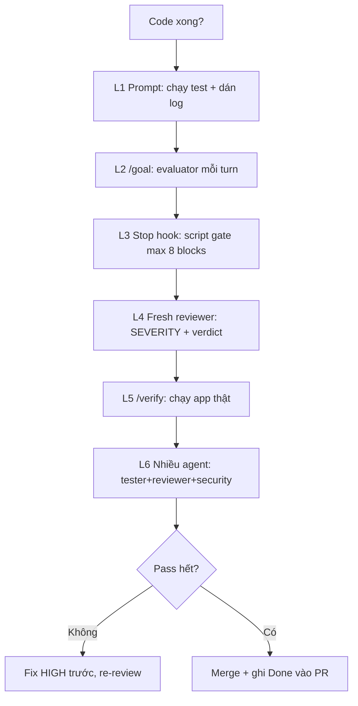

# Tips 04 — Verification: bắt Claude chứng minh "done thật"

> **Bài này cho ai:** dev hay nhận câu "xong rồi" của Claude rồi để QA bắt bug sau merge, hoặc tech lead chuẩn hóa done criteria + vòng review cho team.
> **Cần gì trước:** đã cài và đăng nhập Claude Code ([bài 01](../01-huong-dan-su-dung/01-cai-dat-va-xac-thuc.md)); nên đọc [Tips 03 — Plan trước khi code](./03-plan-first-workflow.md) trước vì phần đi từng bước ở mục 7 xây trên flow plan 3 phases của Tips 03.
> **Đọc xong bạn làm được:**
> - Chọn đúng 1 trong 6 mức verify (rẻ → đắt) theo mức quan trọng của task, kèm lệnh/config copy-paste cho từng mức.
> - Viết done criteria check được (lệnh + phạm vi diff + bằng chứng) và copy-paste 3 ví dụ cho bug / feature / session dài.
> - Chạy review phản biện bằng reviewer fresh, tự chỉnh độ khó reviewer khi quá dễ hoặc quá khắt.
> - Tránh 9 bẫy (pitfall) + 3 hiểu nhầm, chốt bằng checklist verify trước khi báo done.
> **Thời gian:** ~45 phút

## Thuật ngữ dùng trong bài này

Đọc bảng này trước khi vào mục 1 — mọi thuật ngữ Anh trong bài đều được giải thích ở đây.

| Thuật ngữ | Hiểu nôm na là gì | Ví dụ thấy ngay |
|---|---|---|
| Verification | Bắt Claude đưa bằng chứng (log, diff, screenshot) thay vì lời hứa "xong rồi" | Dán log test xanh + `git diff --stat` vào PR |
| Done criteria | Định nghĩa "xong" bằng lệnh + con số, không bằng cảm giác | `Done = pnpm test auth xanh + lint 0 error` |
| Level (mức verify) | 1 trong 6 bậc kiểm chứng, từ rẻ (prompt) tới đắt (nhiều agent) | L1 dán log → L5 `/verify` chạy app thật |
| Evidence (bằng chứng) | Thứ kiểm tra được: log, diff, screenshot, file:line | Log 10 dòng cuối paste kèm câu báo done |
| Fresh reviewer | Người chấm khác người làm, review trên phiên context mới tinh | Subagent review `git diff` khi chưa thấy reasoning của writer |
| Adversarial review | Review phản biện: reviewer có nhiệm vụ tìm lỗi, không phải khen | Prompt "Finding = bug/correctness/security/test-gap" |
| Stop hook | Script chặn lượt kết thúc tới khi test xanh (tối đa 8 lần) | `hooks/test-gate.sh` chạy `pnpm test` mỗi turn-end |
| Gate | Cửa chặn: chưa pass thì không được đi tiếp | Test đỏ → hook chặn, không cho turn kết thúc |
| `/verify` | Build + chạy app thật + quan sát, không chỉ chạy test/typecheck | `/verify` → gọi refund 2 lần cùng idempotency-key |
| Flaky test | Test lúc xanh lúc đỏ — đoán bừa nguyên nhân càng làm code bẩn | Chạy 3 lần ra kết quả khác → ghi `FLAKY` và dừng |
| Calibration | Chỉnh độ khó của reviewer: không quá dễ, không quá khắt | Ép reviewer chấm 3 diff lịch sử trước khi tin kết luận |
| maxTurns | Giới hạn số lượt của `/loop` và `/goal` để không đốt tiền | `/loop "..." --max-turns 10` |

## Mục lục

- [1. Vì sao phải verify?](#1-vì-sao-phải-verify)
- [2. Thang verification 6 levels](#2-thang-verification-6-levels)
- [3. Viết done criteria sao cho check được](#3-viết-done-criteria-sao-cho-check-được)
- [4. Ví dụ copy-paste: 3 done criteria chuẩn](#4-ví-dụ-copy-paste-3-done-criteria-chuẩn)
- [5. Review phản biện đúng cách](#5-review-phản-biện-đúng-cách)
- [6. Chỉnh độ khó reviewer: khi quá dễ hoặc quá khắt](#6-chỉnh-độ-khó-reviewer-khi-quá-dễ-hoặc-quá-khắt)
- [7. Đi từng bước: verify feature refund từ đầu tới cuối](#7-đi-từng-bước-verify-feature-refund-từ-đầu-tới-cuối)
- [8. Flaky test và bằng chứng hơn lời hứa](#8-flaky-test-và-bằng-chứng-hơn-lời-hứa)
- [9. Loops dùng có ý thức (loop/goal/stop-hook)](#9-loops-dùng-có-ý-thức-loopgoalstop-hook)
- [10. Bảng chọn level theo task + checklist](#10-bảng-chọn-level-theo-task--checklist)
- [11. Pitfalls + fix](#11-pitfalls--fix)
- [12. Thuật ngữ mới: nôm na + analogie + ví dụ + verify](#12-thuật-ngữ-mới-nôm-na--analogie--ví-dụ--verify)
- [13. Sơ đồ: thang verify 6 mức](#13-sơ-đồ-thang-verify-6-mức)
- [14. Bảng nôm na + ví dụ cho 3 level chính](#14-bảng-nôm-na--ví-dụ-cho-3-level-chính)
- [15. Trước và sau khi viết done criteria](#15-trước-và-sau-khi-viết-done-criteria)
- [16. Hiểu nhầm thường gặp](#16-hiểu-nhầm-thường-gặp)
- [17. Bài tập](#17-bài-tập)
- [18. Tham khảo chéo](#18-tham-khảo-chéo)

---

## 1. Vì sao phải verify?

Mục này trả lời câu: vì sao câu "xong rồi" của Claude chưa phải bằng chứng, và để verify chậm hơn thì đắt đến mức nào?

### 1.1. Ba câu nói dối kinh điển của LLM

| Câu Claude nói | Sự thật | Cần đòi |
|---|---|---|
| "It should work" | Chưa chạy gì cả | Log chạy thật |
| "Logic có vẻ đúng" | Mới đọc, chưa test | Test xanh + diff |
| "Đã fix hết edge cases" | Mới fix 1 case bạn báo | Liệt kê cases + evidence từng cái |

Không phải model cố tình nói dối — model được train để "nghe có lý". Việc của bạn là **đổi hợp đồng từ "nghe có lý" sang "chứng minh được"**.

### 1.2. Cơ chế: verification là gate ngoài model

- Prompt verify (Level 1) vẫn tin LLM tự báo cáo → rẻ nhưng gian lận được.
- Stop hook (Level 3) + chạy app thật (Level 5) là gate **ngoài model**: script/test báo pass mới cho qua, model không tự "cho mình đậu".
- Rule: **cái gì càng quan trọng (tiền, auth, migrate) thì gate càng phải ngoài model.**

### 1.3. Verify sớm rẻ, verify muộn đắt

```text
Bắt ở prompt (thêm 1 câu verify): +30 giây
Bắt ở reviewer fresh (trước merge): +15 phút
Lọt ra production (bug tiền/auth): x100 lần + mất niềm tin
```

**Kiểm tra nhanh:**

- Hỏi Claude về 1 task nhỏ "xong chưa?" mà không kèm lệnh test → nếu nhận "should work" / "logic có vẻ đúng" / "đã fix hết edge cases" mà không có log đi kèm, bạn vừa thấy 1 trong 3 câu ở mục 1.1 — đòi lại log + diff.
- Bỏ thêm 1 câu verify vào prompt của task kế tiếp và bấm giờ: mục 1.3 nói mức giá chỉ ~30 giây, còn bug lọt production thì x100.

---

## 2. Thang verification 6 levels

Mục này trả lời câu: có những mức verify nào, mỗi mức tốn gì, và dùng lệnh/config nào cho từng mức?

| Level | Cách | Tốn gì | Khi dùng | Lệnh/config liên quan |
|---|---|---|---|---|
| 1. Prompt | "Chạy check X và iterate trong message này" | Vài K tokens | Mọi task, dùng ngay hôm nay | Prompt kèm lệnh test |
| 2. `/goal` | Đặt completion condition, evaluator check sau mỗi turn | Evaluator mỗi turn | Session dài không giám sát | `/goal` (cần ≥2.1.139), xem commands/goal |
| 3. Stop hook | Script gate, block turn-end tới khi pass (tối đa 8 blocks) | 0 tokens LLM, chỉ CPU chạy script | Rule phải đúng 100%, không tin LLM | `Stop` hook, xem [Tips 06](./06-hooks-recipes.md) |
| 4. Fresh reviewer | Subagent/`/code-review` review diff ở context mới | 1 subagent (~20K overhead — số ước tính cộng đồng) | Trước khi merge, chống định kiến | `/code-review` (từ w21/2026), subagent reviewer |
| 5. `/verify` | Build + **chạy app thật, quan sát** (không chỉ test/typecheck) | Thời gian chạy thật | Thay đổi user-visible (UI, API, refund) | `/verify` (cần ≥2.1.145) |
| 6. Nhiều agent verify chéo | Nhiều agent verify chéo các phát hiện (findings) | 3–4 agents | Task critical, cần đồng thuận | Agent teams, `/ultrareview` |

### 2.1. Level 1 — Prompt (nền của mọi thứ)

Thêm 1 câu vào mọi prompt code:

```text
"Sau khi sửa, chạy `pnpm --filter <pkg> test` và dán log pass/fail.
Nếu đỏ, fix tiếp trong message này tới khi xanh hoặc dừng sau 3 lần và báo blocker."
```

- Ưu: 0 setup, dùng ngay.
- Nhược: vẫn tin LLM báo cáo. Dùng cho task thường, không dùng cho tiền/auth/migrate.

### 2.2. Level 2 — `/goal` (người gác không ngủ)

```bash
/goal Done khi `pnpm --filter payments test` xanh + git diff chỉ chạm src/payments/**
# → evaluator check sau mỗi turn, chưa đạt thì bắt làm tiếp
```

- Cần Claude Code ≥2.1.139.
- Dùng cho session dài không ngồi canh (overnight, batch).
- Luôn kèm maxTurns / điều kiện dừng (xem mục 9), không thả trôi.

### 2.3. Level 3 — Stop hook (luật sắt)

Script chạy mỗi lần turn định kết thúc. Fail → block, bắt làm tiếp (tối đa 8 lần).

```json
{
  "hooks": {
    "Stop": [
      {
        "matcher": "",
        "hooks": [{ "type": "command", "command": "${CLAUDE_PROJECT_DIR}/hooks/test-gate.sh" }]
      }
    ]
  }
}
```

```bash
#!/usr/bin/env bash
# hooks/test-gate.sh — copy-paste, sửa lệnh test cho repo bạn
set -euo pipefail
pnpm --filter payments test 2>&1 | tail -n 30
```

- Dùng khi rule phải đúng 100% (lint, typecheck, test payments). Chi tiết ở [Tips 06](./06-hooks-recipes.md).

### 2.4. Level 4 — Fresh reviewer (chống thiên vị)

```text
Spawn reviewer subagent fresh (chưa thấy reasoning của writer).
Review git diff với plan.md. Finding = bug/correctness/security/test-gap.
Bỏ qua style. Trả về [SEVERITY] file:line — mô tả — gợi ý fix.
```

- Vì sao fresh? Writer tự bao biện chính code của mình ("chỗ này chắc đúng"). Reviewer fresh không có ký ức đó → bắt nhiều hơn.
- Mọi PR không đơn giản đều qua vòng này trước khi người thật duyệt.

### 2.5. Level 5 — `/verify` (chạy thật, không chỉ test)

```bash
/verify
# → build + chạy app thật, quan sát hành vi (click, gọi API, đọc log runtime)
```

- Cần Claude Code ≥2.1.145.
- Test xanh nhưng app vẫn có thể gãy (env, migrate, webhook, CORS). `/verify` bắt chứng minh bằng runtime.
- Bắt buộc cho thay đổi user-visible: UI, API, payments, auth flow.
- (Từ w34/2026) Viết 1 skill tên đúng `verify` → Claude tự chạy skill đó trước mỗi commit — verification thành pre-commit check, không cần ai nhắc.

### 2.6. Level 6 — Nhiều agent verify chéo (đồng thuận)

- 3+ agents verify chéo: 1 tester chạy, 1 reviewer đọc diff, 1 security soi, lead tổng hợp.
- Dùng cho task critical (migrate tiền, auth, infra). Đắt nên chỉ dùng khi đáng (xem [Tips 08](./08-tiet-kiem-cost-token.md)).

**Kiểm tra nhanh:**

- Gõ `/` trong session, tìm `/goal`, `/verify`, `/code-review`: thiếu lệnh nào thì bản của bạn chưa đủ (`/goal` cần ≥2.1.139, `/verify` cần ≥2.1.145 — chạy `claude update` trước, debug sau).
- Đặt 1 `/goal` với điều kiện 1 dòng cho task đang mở → thấy evaluator quay lại check sau mỗi turn thay vì bạn phải nhắc.
- Cài Stop hook (mục 2.3) rồi cố kết thúc turn khi test còn đỏ → hook chặn lại, tối đa 8 lần trước khi nhường cho người thật.

---

## 3. Viết done criteria sao cho check được

Mục này trả lời câu: viết thế nào để định nghĩa "xong" kiểm tra được bằng lệnh thay vì cảm giác?

Công thức: **lệnh + phạm vi diff + bằng chứng (evidence).**

```text
TỆ:  "làm cho sạch, đảm bảo không lỗi"
→ Không check được. "Sạch" là gì? "Không lỗi" đo bằng gì?

TỐT: "Done = `pnpm --filter auth test` xanh + `pnpm lint` 0 error +
      `git diff --stat` chỉ chạm apps/auth/** + demo log của flow Y paste ở cuối."
→ 4 checks, mỗi cái 10 giây là biết pass/fail.
```

Checklist done criteria:

- [ ] Có **lệnh** cụ thể (test/lint/typecheck/build)?
- [ ] Có **phạm vi diff** (`git diff --stat` chỉ chạm ...)?
- [ ] Có **bằng chứng** (log xanh, screenshot, demo log paste kèm)?
- [ ] Có **cấm** (không đụng ..., không thêm dep, không commit main)?
- [ ] Có **giới hạn** (thử tối đa N lần, đỏ thì dừng báo)?

---

## 4. Ví dụ copy-paste: 3 done criteria chuẩn

Mục này trả lời câu: 3 tình huống thật (bug nhỏ, feature tiền, session dài) viết done criteria trông ra sao?

### Ví dụ 1 — Bug auth (nhẹ, Level 1+4)

```text
Done = `pnpm --filter auth test login` xanh (dán log 10 dòng cuối)
+ `git diff --stat` chỉ chạm src/auth/**
+ 1 regression test mới cover email có dấu.
Sau đó spawn reviewer fresh review diff 1 vòng.
```

### Ví dụ 2 — Feature payments (nặng, Level 1+4+5)

```text
Done = `pnpm --filter payments test` xanh + `pnpm lint` 0 error
+ `git diff --stat` chỉ chạm src/payments/**
+ demo log gọi POST /api/payments/:id/refund (idempotency-key trùng trả cùng kết quả) paste ở cuối
+ `/verify` pass (app chạy thật, refund hiện trong dashboard).
```

### Ví dụ 3 — Session dài không giám sát (Level 2+3)

```bash
/goal Done khi pnpm --filter cart test xanh + git diff chỉ chạm src/cart/**, tối đa 15 turns, quá thì dừng và báo blocker.
```

```bash
# Kèm Stop hook test-gate.sh (mục 2.3) để block turn-end tới khi xanh (tối đa 8 blocks)
```

---

## 5. Review phản biện đúng cách

Mục này trả lời câu: làm sao để reviewer thực sự đi tìm lỗi thay vì khen, và chuẩn bị gì trước khi giao diff?

"Adversarial review" (review phản biện) = reviewer có nhiệm vụ **tìm lỗi**, không phải khen.

### Prompt reviewer chuẩn (copy-paste)

```text
Review diff này với plan trong plan.md.
Định nghĩa finding = bug/correctness/security/test-gap thực sự.
Bỏ qua style preferences (tên biến, format, import order không tính).
Trả về: [SEVERITY: HIGH/MED/LOW] file:line — mô tả 1 dòng — gợi ý fix 1 dòng.
Cuối cùng: verdict PASS / NEEDS-FIX + 3 gaps ưu tiên cao nhất.
Scope: chỉ review files trong `git diff --name-only`, không lan sang file khác.
```

### Quy trình writer/reviewer tách context

```text
1. Main (writer) implement → xong → `git diff > /tmp/diff.txt`
2. Spawn reviewer FRESH (chưa thấy reasoning của writer), đưa diff + plan.md
3. Reviewer trả gaps → writer fix → re-review nếu HIGH còn sót
4. Không HIGH mới merge (xem [Tips 09](./09-teamwork-chuan-hoa.md))
```

### Vì sao phải fresh?

- Tự review cùng context: writer nhớ "lúc đó nghĩ gì" → tự bao biện.
- Reviewer fresh: chỉ thấy code + plan → soi như người ngoài.
- Giữ vòng này cho mọi PR không đơn giản. Chi tiết fan-out ở [Tips 05](./05-parallel-agents.md).

**Kiểm tra nhanh:**

- Paste prompt reviewer trên cho 1 diff → nhận đúng khung `[SEVERITY: HIGH/MED/LOW] file:line — mô tả — fix` + kết luận PASS/NEEDS-FIX + 3 khoảng hở (gap) ưu tiên nhất.
- Nếu kết quả toàn lỗi style/tên biến → paste lại dòng "Bỏ qua style preferences..." trong prompt, hoặc thêm nhóm "không tính là finding" của mục 6.
- Đếm số HIGH bắt được so với vòng tự review trước đây của bạn (Bài 2, mục 17).

---

## 6. Chỉnh độ khó reviewer: khi quá dễ hoặc quá khắt

Mục này trả lời câu: reviewer PASS mọi thứ hoặc flag mọi thứ thì chỉnh độ khó bằng cách nào?

### Reviewer quá dễ dãi (toàn PASS)

Chỉnh độ khó bằng lịch sử repo:

```text
"Rate 3 diffs lịch sử này (đính kèm diff + biết trước 2 PASS 1 FAIL nhưng không nói cái nào).
Giải thích pass/fail từng cái. Sau đó review diff hiện tại với cùng độ khó tính."
```

→ Ép reviewer chứng minh mình phân biệt được tốt/xấu trước khi tin kết luận (verdict).

### Reviewer quá khắt (flag mọi thứ → thiết kế thừa)

Dặn explicit cái gì **không** tính:

```text
"Không tính là finding: style, tên biến, micro-perf (<5%), refactor 'cho đẹp',
thiếu comment ở code tự giải thích, test thiếu cho code 1 dòng log."
"Chỉ flag nếu: sai logic, mất tiền, lộ secret, gãy API, test-gap ở flow tiền/auth."
```

> Chuẩn team: khoảng ~15% báo sai (false positive) là chấp nhận được cho vòng tự review (thà ồn còn hơn lọt HIGH). Human review cuối sẽ lọc nốt.

**Kiểm tra nhanh:**

- Chạy prompt calibration (3 diff lịch sử, biết trước 2 PASS 1 FAIL) → reviewer phải nêu được lý do pass/fail từng cái, không nói chung chung, rồi mới tin kết luận cho diff hiện tại.
- Dặn nhóm "không tính là finding" (style, micro-perf <5%, refactor cho đẹp...) → reviewer hết flag việc lặt vặt, chỉ còn báo lỗi logic, lộ bí mật, gãy API, thiếu test ở luồng tiền/auth.

---

## 7. Đi từng bước: verify feature refund từ đầu tới cuối

Mục này trả lời câu: 1 feature refund đi từ prompt tới merge đã dùng những mức verify nào, mỗi bước gõ gì?

**Bối cảnh:** vừa implement `POST /api/payments/:id/refund` (theo plan 3 phases ở [Tips 03](./03-plan-first-workflow.md)).

**Bước 1 — Level 1 (prompt, mỗi phase):**

```text
"Xong Phase 2a chưa? Chạy `pnpm --filter payments test service` và dán log.
Đỏ thì fix tiếp trong message này."
→ Nhận log xanh 12 passed, dán kèm.
```

**Bước 2 — Level 3 (Stop hook, cả session):**

```bash
# hooks/test-gate.sh đã cài từ đầu session → mỗi turn-end tự chạy test
# Turn nào quên chạy test cũng bị hook chặn lại. Tối đa 8 blocks rồi cho dừng để human xem.
```

**Bước 3 — Level 4 (fresh reviewer, trước PR):**

```text
"Spawn reviewer fresh. Diff: `git diff main...HEAD -- src/payments/`.
Đối chiếu plan.md. Trả về [SEVERITY] file:line — mô tả — fix."
→ Nhận 1 HIGH (thiếu idempotency check khi retry), 2 MED. Fix HIGH, note MED.
```

**Bước 4 — Level 5 (`/verify`, trước merge):**

```bash
/verify
# → build staging, gọi refund thật 2 lần cùng idempotency-key, quan sát:
# lần 2 trả cùng kết quả lần 1, không trừ tiền 2 lần, dashboard hiện 1 refund.
# Paste demo log vào PR.
```

**Bước 5 — Ghi done vào PR:**

```markdown
## Done
- [x] `pnpm --filter payments test` xanh (log đính kèm)
- [x] Reviewer fresh: 1 HIGH đã fix, 2 MED noted
- [x] `/verify`: refund idempotent thật, log demo đính kèm
- [x] `git diff --stat` chỉ chạm src/payments/**
```

---

## 8. Flaky test và bằng chứng hơn lời hứa

Mục này trả lời câu: chứng cứ nào được chấp nhận khi báo done, và test lúc xanh lúc đỏ thì xử lý ra sao?

### Bằng chứng hay lời hứa

| Chấp nhận (bằng chứng) | Không chấp nhận (lời hứa) |
|---|---|
| Log test xanh paste kèm (10–20 dòng cuối) | "it should work" |
| `git diff --stat` cụ thể | "logic có vẻ đúng" |
| Screenshot/log chạy thật (`/verify`) | "đã fix hết edge cases" (liệt kê đâu?) |
| File:line + repro steps | "chỗ này chắc không ai đụng" |

### Flaky test: dặn tester dừng đoán

Lời đoán nguyên nhân gốc (root cause) của model cho flaky thường **tự tin nhưng sai**.

```text
Prompt tester subagent (copy-paste):
"Chạy `pnpm --filter <pkg> test <file>` 3 lần. Nếu pass/fail khác nhau giữa các lần,
ghi `FLAKY: <test name>` và dừng, không đoán root cause.
Chỉ báo: lần nào pass, lần nào fail, log khác nhau ở dòng nào."
```

→ Flaky thì người thật xem (timing, parallel, external service), không để model vá bừa làm bẩn code.

**Kiểm tra nhanh:**

- Chạy prompt tester ở trên với 1 test nghi flaky → nhận `FLAKY: <tên test>` kèm log 3 lần khác nhau ở dòng nào, không kèm lời hứa "đã fix".
- Đối chiếu bảng trên với 1 câu báo done gần nhất của bạn: câu nào nằm cột "lời hứa" thì viết lại thành cột "bằng chứng".

---

## 9. Loops dùng có ý thức (loop/goal/stop-hook)

Mục này trả lời câu: chạy lặp tự động bằng `/loop`, `/goal` và Stop hook thế nào mà không biến thành vòng lặp đốt tiền?

`/loop` + `/goal` + Stop-hook-gate đều "làm tới khi đạt". Không guard = vòng lặp vô hạn đốt tiền.

### Công thức loop an toàn (copy-paste)

```bash
/loop "Chạy pnpm --filter cart test, fix tới khi xanh" --max-turns 10
/goal Done khi pnpm --filter cart test xanh, tối đa 10 turns, quá thì dừng và báo blocker + dán log cuối.
```

Luôn có 3 guard:

1. **Điều kiện dừng rõ ràng:** test nào xanh? diff chạm đâu? log nào là pass?
2. **Giới hạn vòng:** `maxTurns` (vd 10), Stop hook tối đa 8 blocks.
3. **Reviewer độc lập cuối cùng:** loop xong vẫn qua reviewer fresh 1 vòng (loop chỉ đảm bảo "xanh", không đảm bảo "đúng").

### Bảng: khi nào loop vs làm tay

| Loop (`/loop`, `/goal`, Stop-gate) | Làm tay từng turn |
|---|---|
| Fix test đỏ rõ ràng, chạy lại là biết | Debug chưa rõ root cause |
| Lặp pattern (lint 20 files, migrate) | Quyết định kiến trúc, tradeoff |
| Chạy overnight không canh | Task tiền/auth cần mắt human mỗi bước |

**Kiểm tra nhanh:**

- Chạy `/loop "..." --max-turns 10` → session tự dừng ở lượt 10 kể cả khi test chưa xanh, báo blocker + dán log cuối.
- Chạy 1 turn khi test đang đỏ (đã cài Stop hook mục 2.3) → turn không kết thúc được, tối đa 8 blocks.
- Loop xong → vẫn spawn reviewer fresh 1 vòng: loop chỉ đảm bảo "xanh", reviewer mới đảm bảo "đúng".

---

## 10. Bảng chọn level theo task + checklist

Mục này trả lời câu: task của bạn cần mức verify nào, và đã đủ trước khi báo done chưa?

### Bảng chọn nhanh

| Task | Levels dùng | Ví dụ done |
|---|---|---|
| Đổi text, thêm log | L1 | Chạy 1 lệnh + dán log |
| Bug 1 module | L1 + L4 | Test xanh + reviewer fresh 1 vòng |
| Feature payments/auth | L1 + L3 + L4 + L5 | Test-gate + reviewer + `/verify` chạy thật |
| Migrate/schema/tiền | L1–L6 full | Thêm multi-agent + human review bắt buộc |
| Session overnight | L2 + L3 + L4 cuối | Goal + gate + sáng dậy review diff |

### Checklist verify trước khi báo done

- [ ] Done criteria viết bằng lệnh + phạm vi diff + bằng chứng?
- [ ] Đã chạy (không phải "chắc chạy được") và dán log?
- [ ] Diff có lan ngoài phạm vi không (`git diff --stat`)?
- [ ] Reviewer fresh đã soi (nếu task không đơn giản)?
- [ ] User-visible → đã `/verify` chạy thật?
- [ ] Flaky → đã ghi FLAKY và dừng đoán?
- [ ] Loop có maxTurns + reviewer cuối?

---

## 11. Pitfalls + fix

Mục này trả lời câu: 9 bẫy khi verify có triệu chứng gì và cách fix từng cái là gì?

Đọc bảng này khi plan, PR hoặc câu báo done của bạn vừa dính 1 trong các triệu chứng dưới đây.

| Pitfall | Triệu chứng | Fix |
|---|---|---|
| Tin "should work" | Merge xong QA bắt 3 bugs | Đòi log/diff/`/verify`, không nhận lời hứa |
| Done criteria mơ hồ ("cho sạch") | Cãi nhau "thế nào là xong" | Viết lại bằng lệnh + diff + bằng chứng (mục 3) |
| Reviewer = writer | Toàn PASS mù | Luôn fresh reviewer, chưa thấy reasoning |
| Reviewer không định nghĩa finding | Flag style, bỏ sót security | Paste prompt mục 5, liệt kê cái gì KHÔNG tính |
| Loop không giới hạn | Chạy 50 turns đốt tiền | maxTurns + Stop 8 blocks + reviewer cuối |
| Flaky bắt model đoán | Vá bừa, bẩn code, vẫn flaky | Dặn ghi FLAKY và dừng (mục 8) |
| Chỉ test, không chạy thật | Test xanh, production gãy env/webhook | User-visible → `/verify` bắt buộc |
| Verify xong không ghi vào PR | Lần sau lại cãi "hôm đó test chưa?" | Template Done 5 dòng (mục 7, bước 5) |
| Gate quá chặt cho task nhỏ | Mất 30 phút setup hook cho việc 5 phút | Task nhỏ chỉ L1; hook/gate để task tiền/auth |

---

## 12. Thuật ngữ mới: nôm na + analogie + ví dụ + verify

Mục này trả lời câu: 3 thuật ngữ trung tâm của bài — done criteria, fresh reviewer, flaky test — hiểu nôm na, ví von, ví dụ thật và cách tự kiểm chứng là gì?

Đọc bảng này khi gặp lại 3 thuật ngữ ở các mục sau — mỗi dòng gồm cách hình dung đời thường + ví dụ thật + cách tự kiểm chứng.

| Thuật ngữ | Nôm na 1 câu | Analogie | Ví dụ kỹ thuật thật | Cách verify |
|---|---|---|---|---|
| Done criteria check được | Định nghĩa xong bằng lệnh+số, không bằng cảm giác. | Như nghiệm thu nhà: đo điện/nước chạy thật thay vì nghe thợ hứa. | `Done = pnpm test auth xanh + lint 0 error + diff chỉ chạm apps/auth/**` | Chạy 4 checks mỗi cái 10s biết pass/fail. |
| Fresh reviewer | Người chấm khác người làm để chống thiên vị. | Như thi đấu có trọng tài ngoài, không để cầu thủ tự thổi còi. | Spawn subagent chưa thấy reasoning writer, trả `[SEVERITY] file:line` | Bắt thêm 30-50% HIGH so với vòng tự review. |
| Flaky test | Test lúc xanh lúc đỏ, đoán bừa càng bẩn. | Như xe lúc nổ lúc tắt: ghi lại lúc nào tắt, đừng đoán mò thay máy. | Chạy 3 lần pass/fail khác nhau → ghi `FLAKY` + dừng | Log 3 lần + dòng khác nhau, không vá code. |

---

## 13. Sơ đồ: thang verify 6 mức

Mục này trả lời câu: 6 mức verify nối tiếp nhau theo thứ tự nào, và chỗ nào phải dừng lại khi chưa pass?



Giải thích:

1. **A→L1:** mọi task thêm 1 câu verify + iterate 3 lần.
2. **L2→L3:** session dài không canh → `/goal` + `maxTurns` + Stop gate ngoài model.
3. **L3→L4:** gate đảm bảo xanh, reviewer đảm bảo đúng (fresh, bỏ style).
4. **L4→L5:** user-visible (UI/API/refund) phải chạy thật, không chỉ test.
5. **L6→D:** tiền/auth/migrate → 3 agents verify chéo + human.

---

## 14. Bảng nôm na + ví dụ cho 3 level chính

Mục này trả lời câu: 3 mức hay nhắc nhất (L1, L3, L5) hình dung nôm na là gì, và chạy thử sẽ thấy gì?

Đọc bảng này khi muốn nhớ nhanh cách hình dung 3 level chính, thay vì bảng chi tiết ở mục 2.

| Level | Hiểu nôm na | Ví dụ |
|---|---|---|
| L1 Prompt | Bắt thợ tự chạy thử trước khi gọi xong | `Chạy pnpm test payments và dán log, đỏ thì fix tiếp` |
| L3 Stop hook | Khóa cửa sắt: chưa xanh không cho về | `hooks/test-gate.sh` block turn-end tới khi xanh |
| L5 `/verify` | Lái thử xe thật thay vì đọc thông số | Gọi refund thật 2 lần cùng key, chỉ trừ 1 lần |

**Ví dụ chạy thử (copy-paste):**

```bash
/goal Done khi pnpm --filter payments test xanh + diff chỉ chạm src/payments/**, tối đa 15 turns.
# + reviewer:
# "Review diff với plan.md. Finding = bug/correctness/security/test-gap. [SEVERITY] file:line — fix. Verdict PASS/NEEDS-FIX."
```

**Kiểm tra nhanh:**

- Chạy lệnh `/goal` + prompt reviewer ở trên → evaluator check mỗi turn; reviewer trả 1 HIGH (thiếu idempotency) + 2 MED + kết luận; PR có 5 dòng Done được tick + log xanh đính kèm.

---

## 15. Trước và sau khi viết done criteria

Mục này trả lời câu: cùng 1 câu "xong chưa?", cách hỏi dở và cách hỏi tốt cho 2 kết quả gì?

**Trước:** `"Fix xong chưa?" → "Xong rồi (chắc vậy)"` → Kết quả dở: merge xong QA bắt 3 bugs, cãi nhau thế nào là xong.

**Sau:**

```text
"Done = pnpm --filter payments test xanh (dán 10 dòng cuối) + diff chỉ chạm src/payments/** + demo log refund idempotent + /verify pass. Spawn reviewer fresh 1 vòng."
```

**Kiểm tra nhanh:**

- Chạy prompt "Sau" → log xanh + diff gọn + log demo + reviewer PASS mới cho merge; test flaky thì ghi `FLAKY` + dừng đoán thay vì vá bừa.

---

## 16. Hiểu nhầm thường gặp

Mục này trả lời câu: những lầm tưởng nào khiến bạn tin rằng mình đã verify rồi?

| Hiểu nhầm | Sự thật |
|---|---|
| `Should work` là xong | Phải log/diff/`/verify`, không nhận lời hứa |
| Loop càng lâu càng kỹ | Loop không maxTurns đốt 50 turns; phải maxTurns + reviewer cuối |
| Test xanh là chạy thật | Test xanh mà prod gãy env/webhook; user-visible phải `/verify` |

---

## 17. Bài tập

Mục này trả lời câu: làm bài nào để verify thành thói quen tay thay vì lý thuyết?

**Bài 1 (10 phút — viết done criteria):**

- Lấy 1 task đang làm, viết done criteria cũ ("cho xong") thành bản check được (lệnh + diff + bằng chứng).
- Hỏi Claude: "done criteria này còn lỗ hổng verify nào?" — bổ sung 1 ý.

**Bài 2 (25 phút — review phản biện):**

- Lấy 1 diff gần nhất, chạy prompt reviewer mục 5 bằng subagent fresh.
- Đếm findings HIGH/MED/LOW. Fix HIGH, note MED. So với tự review trước đây: bắt thêm được mấy cái?

**Bài 3 (20 phút — chỉnh độ khó + flaky):**

- Lấy 3 diffs lịch sử (1 có bug đã biết), bắt reviewer rate + giải thích (mục 6).
- Tìm 1 test hay flaky trong repo, dặn tester theo mẫu mục 8 (chạy 3 lần, ghi FLAKY). Ghi lại: model có còn đoán bừa không?

> Đạt: sau 2 tuần, 100% PR không đơn giản của bạn có log xanh + reviewer fresh + phạm vi diff trong mô tả PR.

---

## 18. Tham khảo chéo

Mục này trả lời câu: muốn đi sâu từng lệnh hoặc từng chủ đề liên quan thì mở link nào?

- Lệnh verify:
  - [../01-huong-dan-su-dung/commands/model-mode/goal/README.md](../01-huong-dan-su-dung/commands/model-mode/goal/README.md) — đặt completion condition
  - [../01-huong-dan-su-dung/commands/code-repo/loop/README.md](../01-huong-dan-su-dung/commands/code-repo/loop/README.md) — lặp tới khi đúng
  - [../01-huong-dan-su-dung/commands/code-repo/verify/README.md](../01-huong-dan-su-dung/commands/code-repo/verify/README.md) — chạy app thật
  - [../01-huong-dan-su-dung/commands/code-repo/code-review/README.md](../01-huong-dan-su-dung/commands/code-repo/code-review/README.md) — review diff
  - [../01-huong-dan-su-dung/commands/code-repo/ultrareview/README.md](../01-huong-dan-su-dung/commands/code-repo/ultrareview/README.md) — multi-agent review nặng
  - [../01-huong-dan-su-dung/commands/knowledge-system/hooks/README.md](../01-huong-dan-su-dung/commands/knowledge-system/hooks/README.md) — kiểm tra Stop gate
- Bài tips liên quan:
  - [Tips 02](./02-prompt-engineering.md) — viết verify ngay trong prompt
  - [Tips 03](./03-plan-first-workflow.md) — phase-gate từng phase
  - [Tips 05](./05-parallel-agents.md) — reviewer/tester subagents
  - [Tips 06](./06-hooks-recipes.md) — code Stop test-gate + lint/branch-protect
  - [Tips 09](./09-teamwork-chuan-hoa.md) — PR flow + review chuẩn team

> Mẹo 1 dòng: _không nhận "should work" — nhận log xanh, diff gọn, và app chạy thật._
