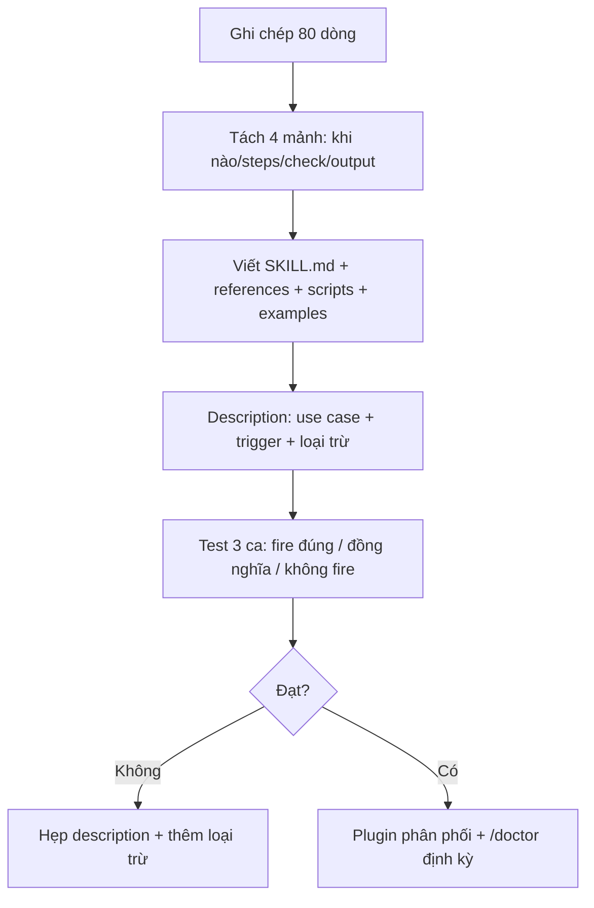

# Tips 07 — Thiết kế skills đáng tiền: chuẩn SOP, không phải ghi chép

> **Bài này cho ai:** dev đã viết skill cho Claude Code nhưng kết quả hay là "ghi chép không ai gọi", hoặc tech lead muốn chuẩn hóa skill cho team.
> **Cần gì trước:** đã cài và đăng nhập Claude Code ([bài 01](../01-huong-dan-su-dung/01-cai-dat-va-xac-thuc.md)); nên đọc [bài 05 — Skills](../01-huong-dan-su-dung/05-skills-custom-commands.md) trước vì bài đó nói skill sống ở đâu, còn bài này nói viết skill nào đáng tiền.
> **Đọc xong bạn làm được:**
> - Đặt tên + viết description đúng cách — 2 thứ quyết định 50% skill có được Claude gọi hay không.
> - Tự viết SKILL.md theo cấu trúc chuẩn team, chép được khung mẫu + 3 skills đầy đủ (`/plan`, `/deploy`, `/issues`).
> - Biến file ghi chép 80 dòng thành skill chạy được trong 25 phút, và có sẵn danh sách 5 skills mọi team nên có.
> - Nhận diện skill hỏng dần (skill-rot) và dọn định kỳ bằng `/usage`, `/doctor`, `/skill-doctor`.
> **Thời gian:** ~40 phút

## Thuật ngữ dùng trong bài này

Đọc bảng này trước khi vào mục 1 — mọi thuật ngữ Anh trong bài đều được giải thích ở đây.

| Thuật ngữ | Hiểu nôm na là gì | Ví dụ thấy ngay |
|---|---|---|
| Skill | Quy trình chuẩn (SOP) viết cho Claude: mở ra 30 giây là biết khi nào dùng, làm bước nào, check gì | `.claude/skills/deploy/SKILL.md` |
| SKILL.md | File khai báo 1 skill: khối `---` config ở đầu + phần thân hướng dẫn | `skills/deploy/SKILL.md` |
| Frontmatter | Khối config đóng khung bằng `---` đặt ngay đầu SKILL.md | `name`, `description`, `tools` |
| Description | 1–2 câu mô tả skill — thứ quyết định Claude có tự gọi skill hay không | `Dùng khi user nói deploy/release/ship.` |
| Trigger (từ kích hoạt) | Từ khóa nằm trong description khiến Claude tự khớp ngữ cảnh rồi gọi skill | `deploy`, `ship`, `plan` |
| references / scripts | File phụ skill chỉ đọc khi cần / script chạy thay việc máy làm tốt hơn | `references/migrate-checklist.md`, `scripts/migrate-dry-run.sh` |
| `disable-model-invocation` | Cờ trong frontmatter: `true` = chỉ gọi tay, Claude không tự fire | deploy/ship/release |
| Skill-rot | Skill hỏng dần theo thời gian: không ai gọi hoặc Claude gọi sai lúc | Skill 1 tháng không ai mở |
| SOP | Quy trình chuẩn — ai làm, làm lúc nào cũng ra cùng kết quả | Checklist 5 bước của `/deploy` |

## Mục lục

1. [Vì sao skills? (cơ chế load)](#1-vì-sao-skills-cơ-chế-load)
2. [Quy tắc 30 giây: SOP 4 mảnh](#2-quy-tắc-30-giây-sop-4-mảnh)
3. [Đặt tên + description (50% skill có được dùng)](#3-đặt-tên--description-50-skill-có-được-dùng)
4. [Cấu trúc SKILL.md chuẩn team (copy-paste)](#4-cấu-trúc-skillmd-chuẩn-team-copy-paste)
5. [Ví dụ: 3 skills mẫu đầy đủ](#5-ví-dụ-3-skills-mẫu-đầy-đủ)
6. [Walkthrough: biến ghi chép thành skill trong 25 phút](#6-walkthrough-biến-ghi-chép-thành-skill-trong-25-phút)
7. [Bộ 5 skills mọi team nên có](#7-bộ-5-skills-mọi-team-nên-có)
8. [Bảng so sánh: skill vs hook vs subagent vs CLAUDE.md](#8-bảng-so-sánh-skill-vs-hook-vs-subagent-vs-claudemd)
9. [Chống skill hỏng dần (skill-rot)](#9-chống-skill-hỏng-dần-skill-rot)
10. [Checklist + pitfalls](#10-checklist--pitfalls)
11. [Thuật ngữ nâng cao: nôm na, hình ảnh, ví dụ, verify](#11-thuật-ngữ-nâng-cao-nôm-na-hình-ảnh-ví-dụ-verify)
12. [Mermaid: từ ghi chép tới skill sống](#12-mermaid-từ-ghi-chép-tới-skill-sống)
13. [Bảng so sánh nôm na cho 4 cơ chế](#13-bảng-so-sánh-nôm-na-cho-4-cơ-chế)
14. [Trước và sau: cùng việc deploy, skill dở và skill tốt](#14-trước-và-sau-cùng-việc-deploy-skill-dở-và-skill-tốt)
15. [Hiểu nhầm thường gặp](#15-hiểu-nhầm-thường-gặp)
16. [Bài tập](#16-bài-tập)
17. [Tham khảo chéo](#17-tham-khảo-chéo)

---

## 1. Vì sao skills? (cơ chế load)

Mục này trả lời câu: vì sao không nhét mọi thứ vào `CLAUDE.md` mà phải viết skill, và skill được nạp theo kiểu nào để bạn không trả tiền khi không dùng?

### 1.1. Cơ chế: rẻ lúc start, đắt khi cần mới trả

```text
Startup: chỉ load tên + description (~100 tokens/skill) → 20 skills ≈ 2K tokens, rẻ.
Trigger: khi user nói "deploy" hoặc Claude thấy khớp use-case → load body SKILL.md + references/scripts.
```

So với nhét tất cả vào `CLAUDE.md` (trả thuế mọi turn) thì skills **trả tiền khi dùng**, không trả tiền khi không dùng ([Tips 01](./01-context-hygiene.md), [Tips 08](./08-tiet-kiem-cost-token.md)).

### 1.2. Skills theo Agent Skills standard

- Cùng file `SKILL.md` chạy được ở Codex/Gemini/Copilot (đổi tool không phải viết lại) — tránh syntax Claude-only nếu team multi-tool.
- Cấu trúc: `SKILL.md` (frontmatter + body) + `references/*.md` (đọc khi cần) + `scripts/*.sh` (máy làm tốt hơn) + `examples/` (input/output mẫu).
- Ký hiệu `${CLAUDE_SKILL_DIR}` để script tự tìm đường (không hardcode path).

### 1.3. Khi nào skill là đáp án đúng?

- Quy trình lặp lại ≥3 lần/tháng, cần người phán đoán (deploy, review, ship, tạo issue).
- Muốn phân phối team bằng plugin ([Tips 09](./09-teamwork-chuan-hoa.md)).
- Không phải đáp án khi: rule máy check được 100% → hook ([Tips 06](./06-hooks-recipes.md)); việc 1 lần → prompt ([Tips 02](./02-prompt-engineering.md)).

---

## 2. Quy tắc 30 giây: SOP 4 mảnh

Mục này trả lời câu: 1 skill đạt chuẩn phải đủ 4 mảnh nào, để người mới (hoặc Claude fresh) mở ra 30 giây là làm theo được?

**Khung chuẩn của bài:** skill tốt = SOP mà người mới đọc 30 giây là làm được: khi nào dùng + steps nào + check gì + output mẫu nào.

Người mới (hoặc Claude fresh) mở skill 30 giây phải trả lời được:

1. **Khi nào dùng** (trigger): "Dùng khi user nói deploy/release/ship. Không dùng cho ...".
2. **Steps nào** (đánh số, mỗi step có lệnh + check): 1. Preconditions → 2. Migrate dry-run → 3. Deploy → 4. Smoke → 5. Rollback nếu fail.
3. **Check gì** (constraints): NEVER... / ALWAYS... (vd NEVER deploy khi test đỏ, ALWAYS dry-run migrate).
4. **Output mẫu nào** (copy từ `examples/output.md`): checklist đã tick, changelog, PR link.

Thiếu 1 trong 4 → skill yếu: hoặc không ai gọi (thiếu 1), hoặc gọi xong vẫn sai (thiếu 2/3), hoặc output mỗi lần 1 kiểu (thiếu 4).

**Kiểm tra nhanh:**

- Mở 1 skill bất kỳ trong `.claude/skills/` của bạn, đếm 4 mảnh: khi nào dùng / steps có lệnh+check / constraints / output mẫu.
- Thiếu mảnh nào → ghi tên mảnh đó ra, sửa theo mục 3 (description), mục 4 (khung) hoặc mục 5 (ví dụ).

---

## 3. Đặt tên + description (50% skill có được dùng)

Mục này trả lời câu: đặt tên và viết description thế nào để skill thực sự được Claude gọi đúng lúc, đúng việc?

### 3.1. Đặt tên: động từ + đối tượng

- Tên tốt: `deploy`, `add-table`, `review-pr`. Thư mục = command (`/deploy` gọi skill `deploy`).
- Tên tệ: `helper`, `utils`, `my-skill-v2`, `stuff` (không ai biết khi nào gọi, Claude cũng không trigger được).

### 3.2. Description: câu đầu = use case chính

```markdown
---
name: deploy
description: Deploy staging/prod với checklist migrate, smoke, rollback. Dùng khi user nói deploy/release/ship. Không dùng cho local dev.
disable-model-invocation: false
---
```

- Listing truncate ~1536 ký tự — dồn quan trọng lên đầu (câu 1 = use case + từ trigger).
- Gồm các từ trigger user hay nói (`deploy/release/ship`) để Claude tự khớp.
- Mặc định để Claude tự trigger. Chỉ thêm `disable-model-invocation: true` khi muốn gọi tay (deploy/ship/release — việc nguy hiểm). Nhớ: từ bản ≥2.1.196, skill này cũng không fire từ scheduled task.

**Ví dụ sửa description (copy-paste ý):**

```text
TỆ: "Skill hỗ trợ nhiều việc liên quan tới dự án, có thể dùng khi cần."
→ Không trigger từ nào, Claude không bao giờ gọi.

TỐT: "Sinh implementation plan chuẩn (deps, steps, verify). Dùng khi user nói plan/lên kế hoạch/chuẩn bị feature. Không dùng cho bug 1 dòng."
→ 3 trigger + 1 loại trừ, rõ như SOP.
```

### 3.3. Frontmatter đủ dùng (copy-paste)

```markdown
---
name: review-pr
description: Multi-layer review (correctness, security, arch drift, edge, tests). Dùng khi user nói review PR/check diff/duyệt code.
disable-model-invocation: false
tools: Read, Bash, Grep, Glob
---
```

- `tools`: khai báo hẹp (reviewer không cần `Write`, planner không cần đụng source) — xem [Tips 05](./05-parallel-agents.md).
- `model:` (nếu hỗ trợ): explorer/tester → haiku; reviewer/security → opus (xem [Tips 08](./08-tiet-kiem-cost-token.md)).

---

## 4. Cấu trúc SKILL.md chuẩn team (copy-paste)

Mục này trả lời câu: 1 file SKILL.md đạt chuẩn team gồm những mục nào, copy khung nào về dùng ngay?

````markdown
# <Tên> — 1 dòng mục đích, nhận $ARGUMENTS gì

> Dùng $ARGUMENTS thế nào: `/deploy staging` → $ARGUMENTS = "staging".

## Khi nào dùng / không dùng
- Dùng khi: ...
- Không dùng khi: ... (gọi skill X thay thế)

## Steps (numbered, mỗi step có lệnh + check)
1. Preconditions: `...` — check: ...
2. Thực hiện: `...` — check: ...
3. Verify: `...` — evidence: ...

## Constraints (NEVER... / ALWAYS...)
- NEVER ...
- ALWAYS ...

## Output mẫu (copy từ examples/output.md)
```text
<dán 1 output đã duyệt, để Claude bắt chước format>
```

## Tham khảo (references/*.md, scripts/*.sh với ${CLAUDE_SKILL_DIR})
- Chi tiết: `references/<ten>.md` (chỉ đọc khi cần)
- Script: `${CLAUDE_SKILL_DIR}/scripts/<ten>.sh` (máy làm tốt hơn)
- Data tươi: `` !`git branch --show-current` ``
````

Kèm theo trong thư mục skill:

```text
skills/deploy/
  SKILL.md
  references/migrate-checklist.md
  scripts/migrate-dry-run.sh
  examples/output.md
```

- 1 example input/output thật (đã duyệt) — không ví dụ bịa.
- 1 script cho bước máy làm tốt hơn (migrate dry-run, gen changelog, check smoke).
- Dynamic line `` !`...` `` nếu cần data tươi (branch, status) mà không cần hook.

---

## 5. Ví dụ: 3 skills mẫu đầy đủ

Mục này trả lời câu: 3 skill mẫu đầy đủ (frontmatter + steps + constraints + output) trông ra sao để bạn chép làm nguồn?

### Ví dụ 1 — `/plan` (sinh plan chuẩn)

````markdown
---
name: plan
description: Sinh implementation plan chuẩn (deps, steps, verify). Dùng khi user nói plan/lên kế hoạch/chuẩn bị feature. Không dùng cho fix 1 dòng.
tools: Read, Grep, Glob, Write
---

# Plan — sinh plan cho $ARGUMENTS, chờ duyệt mới implement

## Khi nào dùng / không dùng
- Dùng: feature/refactor >1 file hoặc >2 steps.
- Không dùng: typo, đổi text, thêm log (làm luôn).

## Steps
1. Đọc files user chỉ định + `docs/architecture.md` — check: liệt kê đường dẫn đã đọc.
2. Sinh plan theo khung: files sửa | steps | risks | KHÔNG đụng | verify từng phase + gate.
3. Lưu `plan.md`, hỏi duyệt. Không code trong skill này.

## Constraints
- NEVER code khi chưa duyệt. NEVER plan 15 steps không gate (chia ≤4 phases).
- ALWAYS có verify lệnh + diff scope mỗi phase.

## Output mẫu
```markdown
# Plan: refund payments
## Files sửa
| File | Việc |
|---|---|
| `src/payments/service.ts` | refund() idempotent |
## Phase 1 — ... — verify: `pnpm --filter payments test` xanh mới sang Phase 2
```
````

### Ví dụ 2 — `/deploy` (checklist + rollback)

```markdown
---
name: deploy
description: Deploy staging/prod với checklist migrate, smoke, rollback. Dùng khi user nói deploy/release/ship. Không dùng cho local dev.
disable-model-invocation: true
tools: Read, Bash
---

# Deploy $ARGUMENTS (staging|prod) — gọi tay, chờ bạn duyệt từng bước

## Khi nào dùng / không dùng
- Dùng: ship staging/prod. Không dùng: chạy local (`pnpm dev` là đủ).

## Steps
1. Preconditions: `git status` sạch + test xanh `${CLAUDE_SKILL_DIR}/scripts/preflight.sh $ARGUMENTS`.
2. Migrate dry-run: `${CLAUDE_SKILL_DIR}/scripts/migrate-dry-run.sh $ARGUMENTS` — check output "DRY-RUN OK".
3. Deploy: `...` — check: version mới hiện trong `/health`.
4. Smoke: `${CLAUDE_SKILL_DIR}/scripts/smoke.sh $ARGUMENTS` — 5 checks phải pass.
5. Fail bước nào → rollback plan trong `references/rollback.md`, không cố tiến.

## Constraints
- NEVER deploy prod khi staging chưa pass. NEVER `disable-model-invocation: false` cho skill này.
- ALWAYS dry-run migrate + smoke có evidence.

## Output mẫu
- Xem `examples/output.md` (checklist đã tick + link release).
```

### Ví dụ 3 — `/issues` (biến ý thô thành ticket chuẩn)

````markdown
---
name: issues
description: Biến ý thô thành issue/ticket chuẩn (repro, scope, acceptance). Dùng khi user nói tạo issue/ticket/log bug.
tools: Read, Write
---

# Issues — biến "$ARGUMENTS" thành ticket chuẩn

## Steps
1. Hỏi thiếu: repro steps? scope files? acceptance criteria?
2. Sinh ticket theo khung: Tiêu đề | Repro | Scope | Acceptance (check được) | Risks.
3. Lưu `issues/<slug>.md`, hỏi duyệt trước khi post lên tracker.

## Constraints
- NEVER post tracker khi chưa duyệt. ALWAYS có acceptance check được bằng lệnh/số.

## Output mẫu
```markdown
## [BUG] Refund trùng trừ tiền 2 lần
Repro: refund 2 lần cùng idempotency-key → trừ 2 lần.
Acceptance: refund 2 lần cùng key chỉ trừ 1 lần (`pnpm --filter payments test idempotency` xanh).
```
````

**Kiểm tra nhanh:**

- Sau khi tạo đủ 3 thư mục skill, gõ `/` trong session → tìm `/plan`, `/deploy`, `/issues`.
- Không thấy lệnh nào → kiểm tra lại tên thư mục (thư mục = command) + frontmatter `name`/`description`, sửa rồi `/restart`.

---

## 6. Walkthrough: biến ghi chép thành skill trong 25 phút

Mục này trả lời câu: từ file ghi chép 80 dòng, 25 phút chia thành mấy bước và mỗi bước làm gì?

**Bối cảnh:** team có file `docs/deploy-notes.md` dài 80 dòng, mỗi lần deploy 1 người làm 1 kiểu.

**Phút 0–5 — Tách 4 mảnh:**

```bash
# Đọc deploy-notes.md, highlight:
# - Khi nào: 2 dòng → mục "Khi nào dùng"
# - Steps: đánh số 1..5, mỗi step thêm lệnh + check
# - Constraints: tìm 3 "đừng" (đừng deploy khi test đỏ...) → NEVER/ALWAYS
# - Output: lấy 1 lần deploy thành công → examples/output.md
```

**Phút 5–15 — Viết SKILL.md + script:**

```bash
mkdir -p skills/deploy/{references,scripts,examples}
# Viết SKILL.md theo khung mục 4 (dùng Ví dụ 2 làm base)
# Tách checklist migrate dài → references/migrate-checklist.md
# Bước máy làm tốt hơn (dry-run) → scripts/migrate-dry-run.sh (chmod +x)
```

**Phút 15–20 — Description + frontmatter:**

```text
Câu đầu: "Deploy staging/prod với checklist migrate, smoke, rollback. Dùng khi user nói deploy/release/ship."
Thêm disable-model-invocation: true (deploy nguy hiểm, gọi tay).
```

**Phút 20–25 — Test 3 ca:**

```bash
# Ca 1: "/deploy staging" → skill có fire đúng không? Steps có đủ lệnh+check?
# Ca 2: nói "ship bản này" → có fire không (trigger word)? Không fire thì thêm từ vào description.
# Ca 3: nói "chạy local" → phải KHÔNG fire (loại trừ đúng).
```

Xong: ghi chép 80 dòng thành SOP gọi 1 lệnh. Phân phối bằng plugin ở [Tips 09](./09-teamwork-chuan-hoa.md).

---

## 7. Bộ 5 skills mọi team nên có

Mục này trả lời câu: 5 skill nào mọi team đều nên có, mỗi cái nội dung gì và gọi khi nào?

| Skill | Nội dung | Gọi khi nào |
|---|---|---|
| `/plan` | Sinh implementation plan chuẩn (deps, steps, verify) | Trước mọi feature đủ lớn (không phải sửa 1 dòng) |
| `/review` | Review nhiều lớp: correctness, security, arch drift, edge, tests | Mọi PR quan trọng, reviewer chưa từng thấy code |
| `/deploy` | Checklist deploy: preconditions → migrate dry-run → deploy → smoke → rollback | Ship staging/prod (gọi tay) |
| `/ship` | Toàn trình (end-to-end): merge base → test → review diff → bump version → changelog → commit → push → PR | Đóng feature thành PR |
| `/issues` | Biến ý thô thành issue/ticket chuẩn (repro, scope, acceptance) | Log bug, ghi backlog |

Mỗi skill 1 thư mục, có example + script riêng. Đừng gộp 5 thành 1 "super-skill" (trigger loạn, body phình).

**Khung `/ship` (tóm tắt, chi tiết tự viết theo mục 4):**

```text
Steps: merge base mới nhất → focused test xanh → reviewer fresh → bump version →
changelog (scripts/gen-changelog.sh) → commit chuẩn → push feature branch → mở PR.
NEVER push main, NEVER ship khi test đỏ. Output: PR link + diff stat + log xanh.
```

**Khung `/review` (nhiều lớp):**

```text
Layers: 1 correctness (logic sai?) → 2 security (secret/injection/auth?) →
3 arch drift (lệch architecture.md?) → 4 edge (null/empty/unicode/concurrent?) →
5 tests (đủ cover flow tiền/auth?).
Trả về [SEVERITY] file:line — mô tả — fix. Verdict PASS/NEEDS-FIX.
```

**Kiểm tra nhanh:**

- Đối chiếu bảng trên với `.claude/skills/` của team: thiếu skill nào trong 5 → viết trước skill thiếu đó (mục 4 + mục 5).
- Skill đã có mà không ai gọi 1 tháng → chuyển sang mục 9 dọn.

---

## 8. Bảng so sánh: skill vs hook vs subagent vs CLAUDE.md

Mục này trả lời câu: chọn giữa `CLAUDE.md`, skill, hook, subagent theo tiêu chí nào, nhét sai chỗ thì tốn gì?

| Cơ chế | Trigger | Tốn tokens | Dùng khi nào |
|---|---|---|---|
| `CLAUDE.md` | Mọi turn | Mọi turn (đắt nếu dài) | Luật chung <200 dòng, lệnh hay dùng |
| Skill | User nói / Claude thấy khớp | ~100 lúc start, body khi gọi | Quy trình cần người quyết, lặp lại |
| Hook | Event (Pre/Post/Stop/Start) | 0 (chạy ngoài model) | Rule máy check được, phải đúng 100% |
| Subagent | Main spawn | ~20K overhead/con | Việc hẹp độc lập, cần fresh context |

> Viết sai chỗ là tốn: quy trình trong `CLAUDE.md` (thuế mọi turn), việc cần người quyết đặt vào hook (máy không quyết được), skill cho việc 1 lần (setup đắt hơn lợi) — xem pitfalls [Tips 10](./10-debugging-power-moves.md).

---

## 9. Chống skill hỏng dần (skill-rot)

Mục này trả lời câu: nhận ra skill đang hỏng dần (không ai gọi, gọi sai lúc, mô tả lỗi thời) bằng cách nào, và xử lý từng kiểu hỏng ra sao?

Skill-rot = skills đống thành rác: không ai gọi, gọi sai lúc, description lỗi thời.

1. **Skill 1 tháng không ai gọi → xóa hoặc merge.** Check bằng `/usage` (breakdown per-skill) + `/doctor` và `/skill-doctor` (cần ≥2.1.252 — báo skill không dùng + chi phí context).
2. **Skill load sai lúc → sửa description/`when_to_use` cho hẹp lại.** Thêm loại trừ ("Không dùng cho ..."), bớt từ trigger chung chung.
3. **`skillOverrides` để tắt auto skill người khác mà bạn không muốn:**

```json
{
  "skillOverrides": {
    "legacy-deploy": { "enabled": false }
  }
}
```

4. **Review định kỳ cùng `/doctor` và `/skill-doctor` (cần ≥2.1.252):** hàng tháng, cả team lướt list skills: cái nào giữ, gộp, xóa. Ghi version Claude đã test (frontmatter/tools schema đổi theo version).
5. **Test đổi tool:** cùng file chạy được Codex/Gemini/Copilot → tránh syntax Claude-only (nếu team multi-tool). Script dùng `${CLAUDE_SKILL_DIR}` / relative path, không hardcode.

**Kiểm tra nhanh:**

- Chạy `/usage` + `/skill-doctor` (cần ≥2.1.252) ngay hôm nay, ghi ra danh sách skill 1 tháng chưa được gọi.
- Danh sách có dòng nào → xử lý theo đúng bước 1–2 ở trên trước khi viết skill mới.

---

## 10. Checklist + pitfalls

Mục này trả lời câu: trước khi commit 1 skill mới, phải tick đủ những gì, và 9 bẫy thường gặp là gì?

**Checklist skill mới:**

- [ ] 30 giây đọc xong biết khi nào/steps/check/output?
- [ ] Tên động từ + đối tượng, thư mục = command?
- [ ] Description câu đầu = use case + từ trigger, ≤1536 ký tự quan trọng lên đầu?
- [ ] Steps đánh số, mỗi step có lệnh + check?
- [ ] Constraints NEVER/ALWAYS explicit?
- [ ] Có example input/output thật (không bịa)?
- [ ] Có script cho bước máy tốt hơn + `chmod +x` + `${CLAUDE_SKILL_DIR}`?
- [ ] `tools:` hẹp, `disable-model-invocation` đúng (nguy hiểm → true)?
- [ ] Test 3 ca: fire đúng / fire theo từ đồng nghĩa / KHÔNG fire khi loại trừ?
- [ ] Biết phân phối thế nào (plugin, [Tips 09](./09-teamwork-chuan-hoa.md))?

**Pitfalls:**

Đọc bảng này trước khi commit skill mới — 9 bẫy hay gặp nhất và cách fix từng cái.

| Pitfall | Fix |
|---|---|
| Skill như ghi chép (văn xuôi dài, không steps) | Viết lại 4 mảnh (mục 2) + steps có lệnh+check |
| Description chung chung | Câu đầu use case + từ trigger + loại trừ (mục 3) |
| Body phình (200 dòng trong SKILL.md) | Tách references/scripts, SKILL.md giữ khung + link |
| Super-skill 5 trong 1 | Tách 5 skills (mục 7), mỗi cái 1 việc |
| Skill nguy hiểm auto-fire | `disable-model-invocation: true` (deploy/ship) |
| Skill load sai lúc | Hẹp description, thêm "Không dùng khi" |
| Script hardcode path | `${CLAUDE_SKILL_DIR}` + relative |
| Không example | Thêm 1 input/output đã duyệt vào examples/ |
| Để procedure trong CLAUDE.md | Chuyển sang skill (load khi cần) |

---

## 11. Thuật ngữ nâng cao: nôm na, hình ảnh, ví dụ, verify

Mục này trả lời câu: 3 thuật ngữ trung tâm của bài (skill, description, skill-rot) được giải thích nôm na + hình ảnh + ví dụ thật + verify là gì?

Bản mở rộng của bảng thuật ngữ đầu bài — thêm hình ảnh so sánh và cột verify.

| Thuật ngữ | Nôm na 1 câu | Hình ảnh đời thường | Ví dụ kỹ thuật thật | Cách verify |
|---|---|---|---|---|
| Skill (SOP 30s) | Tờ hướng dẫn ai đọc 30s cũng làm được. | Như công thức nấu ăn: nguyên liệu + steps + thành phẩm mẫu. | `skills/deploy/SKILL.md` + `scripts/migrate-dry-run.sh` + `examples/output.md` | Người mới `/deploy staging` làm được không hỏi thêm. |
| Description trigger | Câu giới thiệu quyết định skill có được gọi đúng lúc. | Như tiêu đề sách trong thư viện: sai tiêu đề là không ai mượn. | `Deploy staging/prod... Dùng khi deploy/release/ship. Không dùng local` | Nói `ship bản này` fire; nói `chạy local` không fire. |
| Skill-rot | Đống skill thành rác: không ai gọi hoặc gọi sai. | Như tủ thuốc hết hạn: giữ chỉ chật tủ. | Skill 1 tháng không gọi, description lỗi thời | `/usage` + `/skill-doctor` (cần ≥2.1.252) báo skill ế; xóa/gộp/hẹp lại. |

---

## 12. Mermaid: từ ghi chép tới skill sống

Mục này trả lời câu: toàn bộ hành trình biến 1 file ghi chép thành skill sống đi theo vòng nào?



Giải thích:

1. **A→B:** highlight khi nào/steps/constraints/output từ docs cũ.
2. **B→C:** SKILL.md giữ khung, chi tiết dài → `references/`, máy làm → `scripts/` + `${CLAUDE_SKILL_DIR}`.
3. **C→D:** câu đầu use case + từ trigger, nguy hiểm thì `disable-model-invocation: true`.
4. **D→E:** test fire đúng, từ đồng nghĩa, và KHÔNG fire khi loại trừ.
5. **→H:** phân phối plugin, mỗi tháng dọn skill-rot.

---

## 13. Bảng so sánh nôm na cho 4 cơ chế

Mục này trả lời câu: 4 cơ chế `CLAUDE.md`/skill/hook/subagent nhìn bằng hình ảnh đời thường là gì?

Đọc bảng này khi muốn nhớ nôm na 4 cơ chế ở mục 8 thay vì bảng kỹ thuật kia.

| Cơ chế | Hiểu nôm na | Ví dụ |
|---|---|---|
| CLAUDE.md | Nội quy dán tường, ngày nào cũng đọc (thuế mọi turn) | <200 dòng + `@import`, đặt rule hay sai lên đầu |
| Skill | Sổ tay lấy ra khi cần, xong cất (trả khi dùng) | `/deploy` chỉ load body khi nói deploy |
| Hook | Chuông báo cháy tự kêu, không cần gọi | Lint sau edit, cấm push main |
| Subagent | Nhờ người khác làm hộ việc hẹp | Explorer đọc hộ 30 files trả summary |

---

## 14. Trước và sau: cùng việc deploy, skill dở và skill tốt

Mục này trả lời câu: cùng 1 việc deploy, bản skill viết dở và bản skill viết tốt khác nhau ở đâu, rồi tự chấm thế nào?

**Trước (Before):** Skill ghi chép văn xuôi 80 dòng `deploy-notes.md`, description `Hỗ trợ nhiều việc` → kết quả dở: không ai gọi, mỗi lần deploy 1 kiểu, Claude không trigger.

**Sau (After):** `name: deploy` + `Deploy staging/prod với checklist... Dùng khi deploy/release/ship. Không dùng local`  + steps đánh số + NEVER/ALWAYS + example thật → kết quả tốt: `/deploy staging` chạy preflight → dry-run `DRY-RUN OK` → smoke 5 checks pass, fail thì rollback.

**Kiểm tra nhanh:**

```bash
# Ca 1: "/deploy staging" -> skill fire, steps đủ lệnh+check
# Ca 2: "ship bản này" -> vẫn fire (trigger word)
# Ca 3: "chạy local" -> KHÔNG fire
```

- Mong đợi: 2 ca fire đúng + 1 ca không fire; output có checklist tick + link release như `examples/output.md`.
- Fire sai → quay lại mục 3 hẹp description.

---

## 15. Hiểu nhầm thường gặp

Mục này trả lời câu: 3 lầm tưởng nào khiến bạn thiết kế skill sai, và sự thật là gì?

Đọc bảng này khi cần giải thích nhanh cho đồng nghiệp — bản kỹ thuật + cách fix nằm ở bảng pitfalls mục 10.

| Hiểu nhầm | Sự thật |
|---|---|
| Body càng dài càng xịn | Body phình 200 dòng không ai đọc; tách references/scripts, SKILL.md giữ khung |
| Gộp 5 skills thành super-skill cho gọn | Trigger loạn; tách 5 skills (`/plan/review/deploy/ship/issues`) mỗi cái 1 việc |
| Skill nguy hiểm để auto-fire cho tiện | Deploy/ship phải `disable-model-invocation: true`, gọi tay |

---

## 16. Bài tập

Mục này trả lời câu: luyện 3 bài nào để tự mình viết được skill và audit được bộ skill team đang có?

**Bài 1 (15 phút — audit skills hiện tại):**

1. Chạy `/usage` + `/doctor`, liệt kê skills đang có: cái nào 1 tháng chưa gọi?
2. Lấy 1 skill hay fire sai, viết lại description theo mục 3 (use case + trigger + loại trừ).
3. Test 3 ca (fire đúng / đồng nghĩa / không fire). Ghi lại trước/sau.

**Bài 2 (25 phút — biến ghi chép thành skill):**

1. Lấy 1 file docs quy trình 50+ dòng trong repo, làm theo walkthrough mục 6.
2. Tách references + script + example. Đặt tên động từ + đối tượng.
3. Nhờ 1 đồng nghiệp chưa biết quy trình dùng skill 1 lần — họ có làm được không cần hỏi thêm?

**Bài 3 (20 phút — 5 skills team):**

1. Đối chiếu team bạn với bảng mục 7: thiếu skill nào trong 5?
2. Viết khung skill thiếu nhất (dùng Ví dụ 1–3 làm base, điền paths/lệnh repo bạn).
3. Lên kế hoạch plugin phân phối (xem [Tips 09](./09-teamwork-chuan-hoa.md)): ai review, ai approve, version thế nào?

> Đạt: sau 1 tháng, team bạn có 5 skills mục 7 + 0 skill "không ai nhớ để làm gì".

---

## 17. Tham khảo chéo

Mục này trả lời câu: muốn đi sâu từng lệnh, từng khái niệm hoặc muốn đưa skill vào team thì mở link nào?

- Lệnh skills/plugins:
  - [../01-huong-dan-su-dung/05-skills-custom-commands.md](../01-huong-dan-su-dung/05-skills-custom-commands.md) (nếu có) — quản lý skills
  - [../01-huong-dan-su-dung/commands/knowledge-system/plugin/README.md](../01-huong-dan-su-dung/commands/knowledge-system/plugin/README.md) — đóng plugin phân phối
  - [../01-huong-dan-su-dung/commands/knowledge-system/doctor/README.md](../01-huong-dan-su-dung/commands/knowledge-system/doctor/README.md) — báo skill không dùng
  - [../01-huong-dan-su-dung/commands/knowledge-system/skill-doctor/README.md](../01-huong-dan-su-dung/commands/knowledge-system/skill-doctor/README.md) — báo skill ế + chi phí context (cần ≥2.1.252)
  - [../01-huong-dan-su-dung/commands/session-context/usage/README.md](../01-huong-dan-su-dung/commands/session-context/usage/README.md) — per-skill cost
  - [../01-huong-dan-su-dung/commands/model-mode/plan/README.md](../01-huong-dan-su-dung/commands/model-mode/plan/README.md) — skill `/plan`
  - [../01-huong-dan-su-dung/commands/code-repo/code-review/README.md](../01-huong-dan-su-dung/commands/code-repo/code-review/README.md) — skill `/review`
- Bài tips liên quan:
  - [Tips 01](./01-context-hygiene.md) — vì sao procedures vào skills, không vào CLAUDE.md
  - [Tips 05](./05-parallel-agents.md) — tools/model route cho subagents từ skills
  - [Tips 06](./06-hooks-recipes.md) — skill vs hook
  - [Tips 08](./08-tiet-kiem-cost-token.md) — `disable-model-invocation` + route model
  - [Tips 09](./09-teamwork-chuan-hoa.md) — plugin + commit skills team

> Mẹo 1 dòng: _skill tốt là SOP 30 giây: mở ra biết khi nào dùng, làm steps nào, check gì, output trông thế nào._
