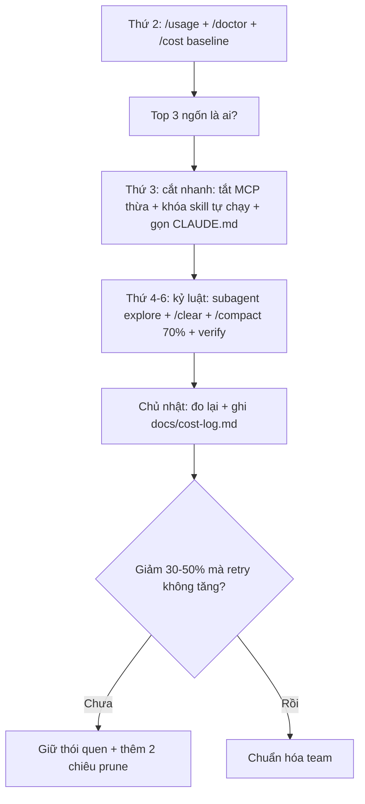

# Tips 08 — Tiết kiệm cost & token (dùng Opus khi đáng, Haiku khi đủ)

> **Bài này cho ai:** dev muốn đọc được `/cost` + `/usage`, route model theo việc và cắt bill Claude Code mà không cắt verify; tech lead chuẩn hóa cách tiết kiệm token cho team.
> **Cần gì trước:** đã cài và đăng nhập ([bài 01](../01-huong-dan-su-dung/01-cai-dat-va-xac-thuc.md)); nên đọc [Tips 01 — Vệ sinh context](./01-context-hygiene.md) trước vì 3 thuế ở mục 1 chính là hóa đơn của context bẩn.
> **Đọc xong bạn làm được:**
> - Đọc đúng `/cost` + `/usage`: biết session tốn bao nhiêu, ai ngốn nhất và tắt gì ngay hôm nay.
> - Route model theo việc (Haiku/Sonnet/Opus) theo bảng giá thật, kể cả khi gán model cho subagent trong frontmatter.
> - Áp 10 chiêu tiết kiệm + walkthrough 1 tuần để giảm 30–50% bill mà retry/rewind không tăng.
> - Chỉ ra 4 chỗ ĐỪNG tiết kiệm (verify, bảo mật, migrate, plan) để không cắt nhầm.
> **Thời gian:** ~40 phút

## Thuật ngữ dùng trong bài này

Đọc bảng này trước khi vào mục 1 — mọi thuật ngữ Anh trong bài đều được giải thích ở đây.

| Thuật ngữ | Hiểu nôm na là gì | Ví dụ thấy ngay |
|---|---|---|
| Token | Đơn vị đo văn bản model đọc và ghi, tính tiền theo triệu token | Session 180K input + 25K output |
| Cost | Tiền của session hiện tại, xem bằng lệnh `/cost` | `/cost` → session này tốn bao nhiêu đô |
| Input / output token | Input là cái model đọc (context, file, kết quả tool), output là cái model viết | Input gánh lại mọi turn sau |
| Cache (đọc lại) | Token cũ model đọc lại với giá rẻ hơn nhiều (Opus 5.5: $0.20 so với $4 input) | `CLAUDE.md` nạp lại mỗi turn nhưng trả giá cache |
| `/usage` | Bảng phân bổ token theo skill / subagent / MCP kèm hạn mức còn lại | `/usage` → explorer 45K (25%) |
| Route model | Chọn model đúng việc: rẻ khi đủ, đắt khi đáng | Explore → haiku, review khó → opus |
| Subagent | Agent con có context riêng, chỉ trả tóm tắt về session chính | Explorer đọc 40 files → trả 10 bullet |
| `/clear` | Xóa hội thoại, token về gần 0, file trên đĩa giữ nguyên | 1 task 1 session |
| `/compact` | Nén hội thoại, dặn model giữ gì bỏ gì | `/compact Giữ plan + decisions, bỏ log` |
| maxTurns | Trần số turn của 1 goal/loop, hết là tự dừng — chống loop đốt tiền qua đêm | Goal với `maxTurns 30` |
| Effort | Mức suy nghĩ của model: `low` nhanh gọn, `max` sâu nhưng đắt | `/effort medium` cho việc hằng ngày |

## Mục lục

- [1. Vì sao cost phình?](#1-vì-sao-cost-phình)
- [2. Hiểu tiền đi đâu: /cost + /usage đọc gì](#2-hiểu-tiền-đi-đâu-cost--usage-đọc-gì)
- [3. Route model theo việc (đừng Opus mọi thứ)](#3-route-model-theo-việc-đừng-opus-mọi-thứ)
- [4. Ví dụ copy-paste: route cho 3 repo mẫu](#4-ví-dụ-copy-paste-route-cho-3-repo-mẫu)
- [5. Mười chiêu tiết kiệm cụ thể](#5-mười-chiêu-tiết-kiệm-cụ-thể)
- [6. Walkthrough: giảm 50% bill 1 tuần](#6-walkthrough-giảm-50-bill-1-tuần)
- [7. Bảng so sánh: tốn nhiều vs tốn ít](#7-bảng-so-sánh-tốn-nhiều-vs-tốn-ít)
- [8. Khi nào ĐỪNG tiết kiệm](#8-khi-nào-đừng-tiết-kiệm)
- [9. Checklist + pitfalls](#9-checklist--pitfalls)
- [10. Bài tập](#10-bài-tập)
- [11. Thuật ngữ chi tiết: nôm na + analogie + ví dụ + verify](#11-thuật-ngữ-chi-tiết-nôm-na--analogie--ví-dụ--verify)
- [12. Mermaid: giảm 50% bill 1 tuần](#12-mermaid-giảm-50-bill-1-tuần)
- [13. Bảng so sánh có cột Hiểu nôm na + Ví dụ](#13-bảng-so-sánh-có-cột-hiểu-nôm-na--ví-dụ)
- [14. Before/After](#14-beforeafter)
- [15. Hiểu nhầm thường gặp](#15-hiểu-nhầm-thường-gặp)
- [16. Tham khảo chéo](#16-tham-khảo-chéo)

---

## 1. Vì sao cost phình?

Mục này trả lời câu: tiền của bạn đi đâu, tính theo công thức nào, và giá thật của từng model/gói hiện tại là bao nhiêu?

### 1.1. Bốn kẻ ngốn nhất (theo thứ tự thường gặp)

1. **CLAUDE.md phình** — trả thuế mọi turn. 600 dòng × 100 turns = 60K tokens chỉ để "nhớ luật".
2. **Subagents spawn bừa** — ~20K tokens overhead mỗi con (số ước tính cộng đồng, không phải số chính thức). 5 con/ngày × 20 ngày = 2M tokens/tháng cho overhead.
3. **Multi-agent ×3–4 thay vì single-thread** — việc 1 người làm được mà giao 4 agents verify chéo.
4. **MCP tools visible quá nhiều** — chọn sai tool → retry 2–3 vòng, mỗi vòng gánh thêm context.

### 1.2. Cơ chế: thuế input + thuế retry + thuế overhead

Mục này trả lời câu: 3 loại thuế trong bill tính ra sao, và vì sao chỉ "chọn model rẻ" là chưa đủ?

```text
Bill = (input tokens × giá input) + (output × giá output) + (retry vì sai) + (overhead agents/MCP)

- Thuế input: context bẩn (log 1000 dòng, 40 files) gánh mọi turn sau.
- Thuế retry: prompt ẩu → sai → sửa 5 turns, mỗi turn đắt hơn turn trước (vì context to dần).
- Thuế overhead: subagent/MCP/plugin dù không dùng vẫn tốn lúc startup.
```

→ Tiết kiệm = đánh cả 3 thuế cùng lúc, không phải chỉ "chọn model rẻ".

### 1.3. Bảng giá làm căn cứ (07/10/2026)

Mục này trả lời câu: mỗi triệu token và mỗi gói tháng giá bao nhiêu, để đọc bill và route model không bị nhầm giá?

Giá model API (USD / 1 triệu tokens):

| Model | Input | Output | Cache read | Context | Ghi chú |
|---|---|---|---|---|---|
| Claude Fable 5.1 | $10 | $50 | $0.25 | 1M | Alias `fable`; cần Claude Code ≥2.1.257; mạnh nhất, chậm nhất |
| Claude Opus 5.5 | $4 | $20 | $0.20 | 1M | Cần ≥2.1.280; mặc định ở hầu hết gói (từ 22/09/2026) |
| Claude Opus 5.5 — fast mode | $8 | $40 | — | 1M | Gấp đôi giá thường, đổi lấy ~2.5× tốc độ |
| Claude Sonnet 5.5 | $2 | $10 | $0.20 | 1M | Việc hằng ngày — cân bằng chất lượng/giá |
| Claude Haiku 4.5 | $1 | $5 | $0.10 | 200K | Nhanh nhất, rẻ nhất; không hỗ trợ effort |

Gói subscription (claude.com/pricing):

| Gói | Giá | Claude Code? | Ghi chú |
|---|---|---|---|
| Free | $0 | ❌ | Không có Claude Code |
| Pro | $17/tháng (trả trước năm) hoặc $20/tháng | ✅ | Ít nhất 5× Free theo phiên 5 giờ |
| Max 5x | $100/tháng | ✅ | 5× Pro theo phiên 5 giờ |
| Max 20x | $200/tháng | ✅ | 20× Pro theo phiên 5 giờ |
| Team (Standard) | $20/tháng năm, $25/tháng | ✅ | Tối thiểu 2 ghế, tối đa 150 |
| Team (Premium) | $100/tháng năm, $125/tháng | ✅ | 5× Standard |

- Hạn mức tính theo **phiên 5 giờ cuộn** + **hạn tuần**; chat web + Claude Code dùng chung 1 hạn mức.
- Hết hạn mức → chờ reset, nâng gói, hoặc bật **usage credits** (trả theo giá API).
- Nguồn: platform.claude.com/docs/en/about-claude/pricing + claude.com/pricing (tra 07/10/2026).

---

## 2. Hiểu tiền đi đâu: /cost + /usage đọc gì

Mục này trả lời câu: 2 lệnh đọc bill cho bạn biết gì, và mỗi lệnh nên tra câu hỏi gì?

### 2.1. `/cost`: session hiện tại tốn bao nhiêu

Mục này trả lời câu: session vừa chạy tốn bao nhiêu, và có bất thường so với hôm qua không?

```bash
/cost
# → input/output tokens session này + quy ra đô (theo giá model đang dùng)
```

Đọc gì:

- Session này bao nhiêu? So với hôm qua (cùng loại task) tăng/giảm?
- Turn nào vọt? (thường là turn paste log lớn hoặc fan-out 5 agents).
- Nếu 1 session >2x trung bình → xem lại: có gộp 3 việc 1 session không? ([Tips 01](./01-context-hygiene.md)).

### 2.2. `/usage`: ai đang ngốn token + hạn mức còn bao nhiêu

Mục này trả lời câu: token của session bị ai nuốt và hạn mức còn bao nhiêu, để quyết định làm tiếp hay để mai?

```bash
/usage
# → phân bổ theo skill / subagent / plugin / từng MCP server + hạn mức
```

Đọc gì (copy checklist):

```text
- Top 2 ngốn nhất là gì? (thường: 1 subagent explore rộng + 1 MCP server nặng)
- Skill nào tốn mà 1 tháng không gọi? → tắt (skillOverrides) hoặc xóa.
- MCP server nào ngốn >10K mà tuần này không cần? → tắt tạm (/mcp).
- Subagent descriptions tổng bao nhiêu? (>15K → warning, rút gọn — xem Tips 01)
- Hạn mức còn bao nhiêu? (để quyết định có nên /batch overnight hay để mai)
```

### 2.3. Ví dụ đọc `/usage` (minh họa)

Mục này trả lời câu: 1 báo cáo `/usage` thật trông ra sao và hành động gì đi kèm?

```text
Session hôm nay: 180K input, 25K output
- subagent explorer-auth: 45K (25%) — explore không scope, đọc 40 files
- mcp github: 30K (17%) — bật sẵn nhưng tuần này chỉ làm local
- skill heavy-report: 20K (11%) — tự chạy sai 2 lần
→ Hành động: scope explorer hẹp lại, tắt mcp github, disable-model-invocation cho heavy-report.
→ Dự kiến tiết kiệm ~50% ngày mai.
```

---

## 3. Route model theo việc (đừng Opus mọi thứ)

Mục này trả lời câu: việc nào nên giao cho model nào theo giá thật, đổi model/effort bằng lệnh gì, và gán model cho subagent ra sao?

### 3.1. Bảng chọn model theo việc

Mục này trả lời câu: 4 nhóm việc phổ biến nên giao cho model nào theo giá thật?

| Việc | Model | Vì sao |
|---|---|---|
| Research/explore rộng, phân loại, viết lại đơn giản | Haiku 4.5 ($1/$5) | Rẻ, nhanh, đủ — sai thì retry rẻ |
| Implement feature, refactor, debug thường | Sonnet 5.5 ($2/$10) | Cân bằng chất lượng/giá, mặc định hằng ngày |
| Kiến trúc khó, security review, bug hiểm production | Opus 5.5 ($4/$20) | Đáng tiền — sai ở đây đắt gấp 100 lần |
| Cần Opus mà muốn nhanh (fast mode) | `/fast` + `/extra-usage` → Opus 5.5 fast mode ($8/$40, ~2.5× nhanh) | Khi deadline dí, chấp nhận trả thêm cho tốc độ |

### 3.2. Đổi model + effort trong session

Mục này trả lời câu: đổi model và chỉnh effort giữa chừng bằng lệnh gì?

```bash
/model
# → picker: haiku / sonnet / opus

/effort low|medium|high|xhigh|max|auto
# → low: trả lời nhanh gọn; max: suy nghĩ sâu (đắt); auto: để Claude tự chọn
```

### 3.3. Route model cho subagent (frontmatter)

Mục này trả lời câu: gán model riêng cho từng agent con ở đâu?

```markdown
# .claude/agents/explorer-payments.md
---
name: explorer-payments
model: haiku
---

# .claude/agents/reviewer-security.md
---
name: reviewer-security
model: opus
---
```

- Explorer/tester → haiku (đọc + chạy, ít cần suy luận sâu).
- Reviewer/security/kiến trúc → opus (cần judgment, bắt lỗi hiểm).
- Implement thường → sonnet.

### 3.4. Bảng route nhanh (dán vào CLAUDE.md team)

Mục này trả lời câu: dán đoạn ngắn nào vào `CLAUDE.md` để cả team route cùng một cách?

```markdown
## Route model
- Explore/phân loại/viết lại đơn giản → haiku.
- Implement/refactor/debug thường → sonnet (mặc định).
- Security/kiến trúc/bug đụng tiền → opus + reviewer fresh.
- Đổi: `/model`, effort: `/effort medium` (thường), `high` (khó).
```

**Kiểm tra nhanh:**

- Gõ `/model` trong session → model hiện tại khớp bảng 3.1 với việc bạn đang làm.
- Chạy 1 lượt explore bằng haiku (subagent), rồi `/cost` → session rẻ hơn lần chạy cùng loại task trước đó.

---

## 4. Ví dụ copy-paste: route cho 3 repo mẫu

Mục này trả lời câu: route model áp vào 3 loại repo thật trông ra sao, copy lệnh nào?

### 4.1. Repo side-project (tiền ít, việc vừa)

Mục này trả lời câu: repo cá nhân ít rủi ro thì setup model thế nào?

```bash
/model sonnet
/effort medium
# Default mọi việc. Chỉ lên opus khi: bug 2 lần chưa ra + đã rewind.
# Explorer/tester subagents: model haiku (frontmatter).
```

```text
Prompt mẫu: "Dùng haiku explorer đọc src/utils/*.ts, trả summary 10 bullet. Main (sonnet) quyết định refactor."
```

### 4.2. Repo SaaS có khách trả tiền (cân bằng)

Mục này trả lời câu: repo có khách trả tiền thì chia model giữa implement và review thế nào?

```bash
/model sonnet
/effort medium
# Implement: sonnet. Reviewer payments/security: opus.
# /fast khi hotfix production (chấp nhận extra-usage cho tốc độ).
```

```text
"Implement bằng sonnet theo plan.md. Xong spawn reviewer opus fresh soi diff
payments (finding = bug/security/test-gap). Không opus cho explore."
```

### 4.3. Repo fintech/auth (sai là mất tiền)

Mục này trả lời câu: repo đụng tiền thì chỗ nào được giữ model đắt, chỗ nào cắt?

```bash
/model opus
/effort high
# Không tiết kiệm ở: security review, migrate, refund. Tiết kiệm ở: explore (haiku), lint (hook 0 tokens).
```

```text
"Explore bằng haiku subagents (rẻ). Plan + implement + review bằng opus.
Mọi PR qua reviewer opus fresh + /verify chạy thật. Cost-cap hook bật (xem Tips 06)."
```

**Kiểm tra nhanh:**

- Sau khi chạy 1 trong 3 setup: `/cost` → con số session khớp kỳ vọng của loại repo đó (side-project thấp nhất, fintech cao nhất nhưng không vọt bất thường).
- `/usage` → subagent explore hiện model haiku, reviewer hiện model opus/sonnet đúng frontmatter bạn vừa gán.

---

## 5. Mười chiêu tiết kiệm cụ thể

Mục này trả lời câu: 10 thao tác cụ thể nào cắt được cả 3 thuế cùng lúc?

1. **CLAUDE.md <200 dòng; quy trình → skills.** Thuế mọi turn → trả khi dùng. Đặt rule hay sai nhất lên đầu, còn lại `@import`.
2. **1 task 1 session `/clear`; đừng nuôi conversation 200 turns.** Rác turn 10 gánh tới turn 200. Đổi task là đổi session ([Tips 01](./01-context-hygiene.md)).
3. **Nghiên cứu ồn ào → subagent (session chính chỉ nhận tóm tắt).** 30K kết quả đọc thô → 1.5K tóm tắt. Prompt hẹp + thỏa thuận đầu ra ([Tips 05](./05-parallel-agents.md)).
4. **`/compact` sớm (khi ~70–80%), kèm focus.** Đừng đợi auto-compact 90% tóm tắt mất quyết định. Focus giữ plan + quyết định, bỏ log.
5. **`disable-model-invocation: true` cho skills nặng chỉ gọi tay.** Deploy/ship/report nặng mà tự chạy 2 lần/tuần = đốt tiền. Gọi tay khi cần ([Tips 07](./07-thiet-ke-skills.md)).
6. **MCP ≤6 servers thực dùng; prune hàng tuần.** Server 2 tuần không dùng → tắt. Check `/mcp` + `/usage` theo từng server.
7. **Subagent descriptions ngắn (tổng >15K bị warning).** Description 1–2 câu nêu trường hợp dùng; chi tiết vào phần thân. Xóa agents không gọi 1 tháng.
8. **`/goal` + Stop-gate cho runs dài không giám sát (luôn maxTurns).** Tránh loop vô hạn đốt tiền: goal có maxTurns, Stop tối đa 8 blocks, sáng dậy reviewer check ([Tips 04](./04-verification-done-that.md)).
9. **Cost-cap hook (Stop → ledger → Slack khi quá cap).** Code đầy đủ ở [Tips 06](./06-hooks-recipes.md). Bảo hiểm rẻ nhất, cài sớm.
10. **`/doctor` hàng tháng: rà soát skill/MCP/plugin không dùng + hooks chậm + version mới.** Xóa cái không dùng, tối ưu hook >5s, update Claude.

---

## 6. Walkthrough: giảm 50% bill 1 tuần

Mục này trả lời câu: trong 7 ngày, mỗi ngày làm gì (15–30 phút) để cắt bill mà không đụng verify?

**Thứ Hai — Đo (15 phút):**

```bash
/usage
# → ghi: tổng tuần trước, top 3 ngốn (vd explorer 40%, github-mcp 20%, heavy-skill 15%)
/doctor
# → ghi: 2 skills unused, 1 hook chậm 8s, có version mới
/cost
# → baseline session hôm nay
```

**Thứ Ba — Cắt 3 nhát nhanh (30 phút):**

```bash
# 1. Tắt github-mcp (tuần này local only)
/mcp
# → disable github

# 2. Khóa skill nặng tự chạy
# settings.json: "skillOverrides": {"heavy-report": {"enabled": false}}

# 3. Rút gọn CLAUDE.md 450 → 150 dòng (quy trình → skills)
# + rút gọn 3 subagent descriptions dài nhất còn 2 câu mỗi cái
```

**Thứ Tư–Sáu — Đổi thói quen (0 cấu hình, chỉ kỷ luật):**

```text
- Mọi explore >3 files → haiku subagent (không main đọc trực tiếp).
- /compact ở 70% (kèm focus), /clear giữa task (1 task 1 session).
- Prompt nào cũng có verify 1 dòng (đỡ retry 5 turns).
- Loop/goal nào cũng có maxTurns.
```

**Chủ Nhật — Đo lại:**

```bash
/usage
# → so với Thứ Hai: tổng giảm? top 3 còn là ai? Có kẻ ngốn mới không?
# Ghi vào file team (vd docs/cost-log.md): tuần này làm gì, tiết kiệm bao nhiêu, giữ gìn gì tuần sau.
```

Kết quả điển hình team 3 người: **-40–60% input tokens**, retry giảm một nửa, tốc độ trả lời nhanh hơn (context gọn).

---

## 7. Bảng so sánh: tốn nhiều vs tốn ít

Mục này trả lời câu: thói quen nào đang đốt tiền và đổi sang thói quen nào thì cắt được bao nhiêu?

Đọc bảng này khi cần giải thích nhanh cho team vì sao đổi thói quen lại đáng giá.

| Thói quen tốn | Thói quen rẻ | Tiết kiệm |
|---|---|---|
| Opus mọi thứ (kể cả explore) | Haiku explore, Sonnet implement, Opus review khó | 50–70% cho explore |
| 1 session 200 turns 5 việc | 1 task 1 session + `/clear` | ~95% rác (mục 1.2 Tips 01) |
| Main đọc 40 files trực tiếp | Subagent đọc, main nhận summary | ~90% input explore |
| CLAUDE.md 600 dòng | <200 dòng + skills | Thuế mọi turn giảm 3–4x |
| 12 MCP servers bật sẵn | ≤6 servers, tắt khi không cần | 10–30K mỗi session |
| Loop không giới hạn | maxTurns + Stop 8 blocks | Tránh bill "trên trời" overnight |
| Prompt ẩu → retry 5 turns | Prompt có scope + verify (đỡ retry) | Mỗi retry tránh được = 1–2x turn |
| Skill nặng tự chạy | Gọi tay (`disable-model-invocation`) | 10–20K mỗi lần chạy oan |

---

## 8. Khi nào ĐỪNG tiết kiệm

Mục này trả lời câu: những chỗ nào cắt tiết kiệm là tự hại, và quy tắc chung khi chọn model là gì?

- **Review bảo mật, quyết định kiến trúc, debug production → Opus + reviewer fresh.** Tiết kiệm ở đây đắt hơn gấp 100 lần khi sự cố (mất tiền, lộ secret, sập prod).
- **Verification (`/verify`, test-gate) không bao giờ cắt để "đỡ tốn".** Test-gate 0 tokens LLM (chạy CPU), `/verify` là runtime thật — cắt là mù.
- **Migrate/schema/refund (đụng tiền) → full levels L1–L6 ([Tips 04](./04-verification-done-that.md)).** Đắt 1 lần còn hơn đền 100 lần.
- **Onboarding/plan-first ([Tips 03](./03-plan-first-workflow.md)):** 1 turn plan Opus rẻ hơn 10 turns code sai Sonnet.

> Quy tắc: **tiết kiệm ở explore/lặp vặt, chi ở quyết định khó + verify.** Đừng làm ngược.

**Kiểm tra nhanh:**

- Liệt kê 3 việc hôm qua bạn đã làm: việc nào rơi vào 4 dòng trên mà bạn đang cắt tiết kiệm? → trả lại model Opus + `/verify` cho chỗ đó ngay.

---

## 9. Checklist + pitfalls

Mục này trả lời câu: tự chấm hằng ngày/hằng tuần bằng bộ checklist nào, và 7 bẫy (pitfalls) thường gặp chỉnh ra sao?

**Checklist hàng ngày:**

- [ ] Model mặc định đúng việc hôm nay (sonnet thường, opus khi khó)?
- [ ] Explorer/tester đang là haiku?
- [ ] 1 task 1 session, `/clear` giữa việc?
- [ ] `/compact` ở 70% (có focus)?
- [ ] Mọi loop/goal có maxTurns?
- [ ] Không paste log 1000 dòng vào main (ghi file + subagent tóm)?

**Checklist hàng tuần/tháng:**

- [ ] `/usage`: top ngốn là ai? Có tắt được không?
- [ ] `/doctor`: unused skills/MCP/hooks chậm?
- [ ] CLAUDE.md còn <200 dòng? Descriptions còn gọn?
- [ ] Cost-cap ledger có vượt cap ngày nào? Vì sao?

**Pitfalls:**

| Pitfall | Fix |
|---|---|
| Haiku cho việc cần Opus (kiến trúc/bảo mật) → sai hiểm | Route đúng bảng mục 3; đừng "rẻ" ở chỗ hiểm |
| Opus cho explore rộng → bill vọt | Haiku explore, Opus quyết định |
| Quên maxTurns overnight | Mọi goal/loop đều có giới hạn + reviewer sáng sau |
| Tắt verify để đỡ tốn | Không bao giờ cắt test-gate/`/verify` |
| Prune MCP quá tay → thiếu tool lúc cần | Tắt tạm (disable), không xóa hẳn; bật lại 10 giây |
| Skill nặng tự chạy | `disable-model-invocation: true`, gọi tay |
| Nuôi session 200 turns "cho tiện" | `/clear` + plan.md (rẻ hơn nhiều) |

**Kiểm tra nhanh:**

- Tự chấm 10 checkbox ở trên trong 1 phút: chỗ nào chưa tick thì mở đúng mục tương ứng (mục 3 route, mục 5 chiêu, mục 7 so sánh) và sửa trong hôm nay.

---

## 10. Bài tập

Mục này trả lời câu: luyện tay bằng 3 bài nào để tự thấy bill giảm mà không cắt nhầm verify?

**Bài 1 (15 phút — đọc bill):**

1. Chạy `/cost` + `/usage` + `/doctor` trong repo hay làm nhất.
2. Ghi top 3 ngốn + 1 thứ tắt ngay được (MCP/skill/agent).
3. Đặt `DAILY_CAP_USD` cho mình (bằng 1.2x trung bình ngày thường) + gắn cost-cap hook ([Tips 06](./06-hooks-recipes.md)).

**Bài 2 (20 phút — route lại models):**

1. Liệt kê 5 việc hay làm, gán Haiku/Sonnet/Opus theo bảng mục 3.
2. Sửa frontmatter 2 subagents (explorer/tester → haiku, reviewer → opus/sonnet).
3. Chạy thử 1 explore haiku + 1 review opus, so bill với trước.

**Bài 3 (30 phút — 10 chiêu):**

1. Áp 3 chiêu rẻ nhất (CLAUDE.md gọn, 1 task 1 session, compact sớm) trong 3 ngày.
2. Đo `/cost` trung bình/ngày trước/sau. Ghi vào `docs/cost-log.md`.
3. Chọn thêm 2 chiêu (prune MCP, khóa skill nặng) tuần sau.

**Kiểm tra nhanh:**

- Sau 2 tuần: bill/ngày giảm 30–50% mà số retry + rewind không tăng → tiết kiệm đúng chỗ; nếu retry/rewind tăng là bạn đã cắt nhầm chỗ.

---

## 11. Thuật ngữ chi tiết: nôm na + analogie + ví dụ + verify

Mục này trả lời câu: 3 khái niệm cốt lõi của bài này hiểu nôm na, mượn hình ảnh đời thường và verify ra sao?

| Thuật ngữ | Nôm na 1 câu | Analogie | Ví dụ kỹ thuật thật | Cách verify |
|---|---|---|---|---|
| `/cost` vs `/usage` | Hóa đơn bữa này vs sao kê ai ăn nhiều. | Như bill quán (tổng) + bill chi tiết (ai gọi gì). | `/cost` tổng session; `/usage` phân bổ explorer 45K/github-mcp 30K | Top 2 ngốn lộ mặt → tắt/scope lại, mai đo giảm. |
| Route model | Việc nào não nấy: rẻ khi đủ, đắt khi đáng. | Như đi xe: đi chợ xe máy (Haiku), đi tỉnh ô tô (Sonnet), cứu thương xe ưu tiên (Opus). | Explore Haiku, implement Sonnet, security Opus + reviewer fresh | Bill explore giảm 50-70% mà retry không tăng. |
| Cost-cap hook | Bảo hiểm tự kêu khi tiêu quá mức ngày. | Như hạn mức thẻ: quá là tin nhắn báo ngay. | `Stop → cost-cap.sh → ledger + Slack khi >DAILY_CAP_USD` | `DAILY_CAP_USD=0.01` test → ledger append + Slack ping. |

---

## 12. Mermaid: giảm 50% bill 1 tuần

Mục này trả lời câu: cả lộ trình 1 tuần trong mục 6 nối với nhau theo đồ thị nào?



Giải thích:

1. **A→B:** ghi tổng + top 3 (thường explorer rộng + MCP nặng + skill tự chạy).
2. **B→C:** 30 phút cắt 3 nhát (disable MCP, `skillOverrides`, CLAUDE.md 450→150).
3. **C→D:** đổi thói quen 0 cấu hình (Haiku explore, 1 task 1 session, maxTurns).
4. **D→E:** đo lại, ghi log team.
5. **F→H:** retry không tăng mới là tiết kiệm đúng chỗ.

---

## 13. Bảng so sánh có cột Hiểu nôm na + Ví dụ

Mục này trả lời câu: thói quen tốn vs thói quen rẻ nhìn bằng hình ảnh đời thường là gì?

| Thói quen | Hiểu nôm na | Ví dụ |
|---|---|---|
| Tốn (Opus mọi thứ) | Thuê giáo sư trông xe | Explore rộng bằng Opus → bill vọt |
| Rẻ (route đúng) | Việc nào người nấy | Haiku explore, Sonnet implement, Opus review khó → tiết kiệm 50-70% explore |
| Tốn (nuôi session) | Ăn 1 nồi lẩu 5 bữa liền | 1 session 200 turns 5 việc → rác 95% |
| Rẻ (1 task 1 session) | Ăn bữa nào nấu bữa đó | `/clear` giữa việc + `plan.md` |

**Kiểm tra nhanh:**

```bash
/cost
/usage
# sau cắt MCP + gọn CLAUDE.md, chạy lại:
/cost
```

- `/usage` top ngốn đổi chủ (không còn github-mcp 30K khi local-only); `/cost` mỗi ngày giảm 30-50% sau 3 ngày kỷ luật. Bill giảm mà rewind tăng là cắt nhầm verify.

---

## 14. Before/After

Mục này trả lời câu: trước và sau khi route model + dọn context, cảnh bill và tốc độ trả lời thay đổi thế nào?

**Before:** `Default Opus, main đọc 40 files, 1 session 5 việc, 12 MCP bật sẵn` → Kết quả dở: 180K input (explorer 45K + mcp 30K + skill 20K), bill vọt, trả lời chậm.

**After:**

```bash
/model sonnet
# explorer/tester frontmatter model: haiku, reviewer: opus
"Dùng haiku explorer đọc src/utils/*.ts trả 10 bullet. Main sonnet quyết định."
```

**Kiểm tra nhanh:**

- Input giảm ~50%, retry giảm một nửa, tốc độ nhanh hơn vì context gọn; tiền hiểm (security/migrate) vẫn Opus + `/verify`, không cắt.

---

## 15. Hiểu nhầm thường gặp

Mục này trả lời câu: những lầm tưởng nào khiến người ta "tiết kiệm" sai và bill vẫn cao?

| Hiểu nhầm | Sự thật |
|---|---|
| Rẻ = chọn model rẻ là xong | Phải đánh 3 thuế: input (context sạch) + retry (prompt có verify) + overhead (MCP/agents) |
| Tắt verify để đỡ tốn | Test-gate 0 tokens LLM + `/verify` runtime thật; cắt là mù, sự cố gấp 100 lần |
| Prune MCP xóa hẳn cho gọn | Tắt tạm (disable), không xóa; cần bật lại 10s |

**Kiểm tra nhanh:**

- Kể lại được 3 hiểu nhầm trên cho đồng nghiệp mà không nhìn bảng, kèm 1 ví dụ bill thật của repo bạn.

---

## 16. Tham khảo chéo

Mục này trả lời câu: đọc tiếp lệnh nào và bài tips nào nối với nội dung ở trên?

- Lệnh cost/model:
  - [../01-huong-dan-su-dung/commands/session-context/cost/README.md](../01-huong-dan-su-dung/commands/session-context/cost/README.md) — session này tốn bao nhiêu
  - [../01-huong-dan-su-dung/commands/session-context/usage/README.md](../01-huong-dan-su-dung/commands/session-context/usage/README.md) — phân bổ ai ngốn
  - [../01-huong-dan-su-dung/commands/model-mode/model/README.md](../01-huong-dan-su-dung/commands/model-mode/model/README.md) (nếu có) — đổi model
  - [../01-huong-dan-su-dung/commands/model-mode/effort/README.md](../01-huong-dan-su-dung/commands/model-mode/effort/README.md) (nếu có) — low/medium/high/max
  - [../01-huong-dan-su-dung/commands/model-mode/fast/README.md](../01-huong-dan-su-dung/commands/model-mode/fast/README.md) (nếu có) — fast mode
  - [../01-huong-dan-su-dung/commands/knowledge-system/doctor/README.md](../01-huong-dan-su-dung/commands/knowledge-system/doctor/README.md) — audit setup
  - [../01-huong-dan-su-dung/commands/knowledge-system/mcp/README.md](../01-huong-dan-su-dung/commands/knowledge-system/mcp/README.md) — prune servers
  - [../01-huong-dan-su-dung/commands/session-context/compact/README.md](../01-huong-dan-su-dung/commands/session-context/compact/README.md) — compact sớm
  - [../01-huong-dan-su-dung/commands/session-context/clear/README.md](../01-huong-dan-su-dung/commands/session-context/clear/README.md) — 1 task 1 session
- Bài tips liên quan:
  - [Tips 01](./01-context-hygiene.md) — trần context + session sạch
  - [Tips 05](./05-parallel-agents.md) — overhead subagents + route model
  - [Tips 06](./06-hooks-recipes.md) — cost-cap code đầy đủ
  - [Tips 07](./07-thiet-ke-skills.md) — skills gọn + disable auto

> Mẹo 1 dòng: _Haiku khi đủ, Sonnet khi cần, Opus khi đáng — và không bao giờ cắt tiền verify._
