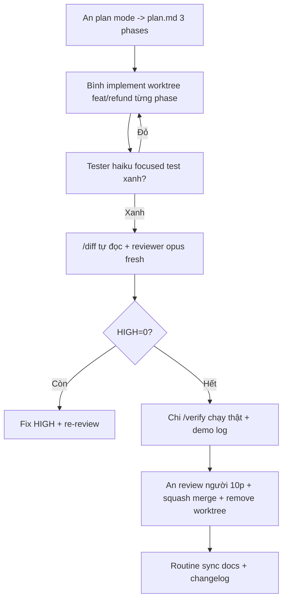

# Tips 09 — Teamwork: chuẩn hóa Claude Code cho cả team

> **Bài này cho ai:** dev và tech lead muốn cả team dùng Claude Code giống nhau — commit gì, phân phối plugin thế nào, chạy PR flow + review + đo lường ra sao.
> **Cần gì trước:** đã cài và đăng nhập ([bài 01](../01-huong-dan-su-dung/01-cai-dat-va-xac-thuc.md)); nên đọc [Tips 06 — Hooks](./06-hooks-recipes.md) trước vì 3 hook mẫu ở mục 3 lấy đúng recipes của Tips 06.
> **Đọc xong bạn làm được:**
> - Chọn đúng cái gì commit vào git chung, cái gì để riêng từng máy, kèm `settings.json` + `CLAUDE.md` + `.mcp.json` copy-paste ngay cho team.
> - Đóng gói skills/hooks/agents/MCP thành plugin, cài 1 phát là cả team + mọi repo đồng bộ.
> - Chạy đủ flow PR từ plan tới merge (plan → phase → diff → reviewer fresh → verify → ship) kèm checklist dán thẳng vào PR.
> - Đo 4 chỉ số + chống lệch chuẩn (drift) để quy tắc không thành giấy.
> **Thời gian:** ~35 phút

## Thuật ngữ dùng trong bài này

Đọc bảng này trước khi vào mục 1 — mọi thuật ngữ Anh trong bài đều được giải thích ở đây.

| Thuật ngữ | Hiểu nôm na là gì | Ví dụ thấy ngay |
|---|---|---|
| `settings.json` | File cấu hình của repo (model, hooks, quyền) — commit là cả team giống nhau | Khung `hooks` ở mục 3 |
| `CLAUDE.md` | Sổ tay dự án, model đọc lại mỗi turn, giữ <200 dòng | Mục "Luật hay sai nhất (≤10 dòng)" |
| `AGENTS.md` | Nội quy chéo công cụ (Cursor, Codex...); từ w34/2026 Claude Code đọc trực tiếp | File nằm ở repo root, commit chung |
| Hook | Lệnh tự chạy ngoài model: 0 token, không bị thuyết phục, không mệt | `hooks/branch-protect.sh` chặn push thẳng main |
| Plugin | Gói skills + hooks + agents + MCP đóng lại, cài 1 lần là dùng ở mọi repo | `/plugin` → Browse → cài `team-claude-standard` |
| Dotfiles | File cấu hình cá nhân hay copy tay giữa các máy | `settings.local.json` để riêng, không commit |
| Reviewer fresh | Lượt review của session/subagent chưa thấy phần code người viết làm | Spawn subagent đọc `git diff` trước khi bạn tự duyệt |
| Worktree | Bản copy song song của repo để làm task riêng, không đụng `main` | `git worktree add ../repo-worktrees/refund -b feat/refund` |
| Walkthrough | Mục đi theo thời gian: ai làm gì, ngày nào, gặp gì | Mục 6: ngày 1 An plan, ngày 2 Bình code |
| Drift (lệch chuẩn) | Quy tắc vẫn nằm đó nhưng mỗi máy/mỗi người một kiểu | Máy A có hook, máy B không → push thẳng main |
| Calibration (chỉnh chuẩn) | Cho reviewer chấm lại diff đã biết đáp án để biết mức độ có ổn không | Chấm 3 diff lịch sử trước khi tin kết luận |
| Routine | Việc giao agent chạy định kỳ rồi báo lại, khác hook chặn ngay tại chỗ | Rà soát phụ thuộc 1 lần/tuần |

## Mục lục

- [1. Vì sao phải chuẩn hóa?](#1-vì-sao-phải-chuẩn-hóa)
- [2. Cái gì commit, cái gì không](#2-cái-gì-commit-cái-gì-không)
- [3. Ví dụ: settings + CLAUDE.md + MCP chuẩn team](#3-ví-dụ-settings--claudemd--mcp-chuẩn-team)
- [4. Gói phân phối: plugin hay hơn copy-paste dotfiles](#4-gói-phân-phối-plugin-hay-hơn-copy-paste-dotfiles)
- [5. Quy trình PR với Claude (đề xuất)](#5-quy-trình-pr-với-claude-đề-xuất)
- [6. Walkthrough: từ feature tới merge trong team 3 người](#6-walkthrough-từ-feature-tới-merge-trong-team-3-người)
- [7. Review code theo chuẩn của team](#7-review-code-theo-chuẩn-của-team)
- [8. Bảng vai trò + checklist PR](#8-bảng-vai-trò--checklist-pr)
- [9. Chống lệch chuẩn (drift) & đo lường](#9-chống-lệch-chuẩn-drift--đo-lường)
- [10. Bẫy thường gặp + cách sửa](#10-bẫy-thường-gặp--cách-sửa)
- [11. Thuật ngữ mới (nôm na + analogie + ví dụ + verify)](#11-thuật-ngữ-mới-nôm-na--analogie--ví-dụ--verify)
- [12. Mermaid: PR flow team 3 người](#12-mermaid-pr-flow-team-3-người)
- [13. Bảng so sánh có cột Hiểu nôm na + Ví dụ](#13-bảng-so-sánh-có-cột-hiểu-nôm-na--ví-dụ)
- [14. Trước và sau khi chuẩn hóa cho team](#14-trước-và-sau-khi-chuẩn-hóa-cho-team)
- [15. Hiểu nhầm thường gặp](#15-hiểu-nhầm-thường-gặp)
- [16. Bài tập](#16-bài-tập)
- [17. Tham khảo chéo](#17-tham-khảo-chéo)

---

## 1. Vì sao phải chuẩn hóa?

Một người dùng giỏi là kỹ năng, cả team dùng giống nhau là hệ thống. Mục này trả lời câu: không chuẩn hóa thì team mất gì, và chuẩn hóa gồm mấy lớp?

### 1.1. Không chuẩn hóa thì sao?

- Người A `CLAUDE.md` 50 dòng, người B 600 dòng → cùng prompt, output khác nhau, mỗi người khăng khăng "Claude của mình đúng".
- Hooks branch-protect chỉ máy A có → máy B push thẳng main, sập prod.
- Skills `/deploy` 3 bản khác nhau → deploy staging 3 kiểu, rollback không ai biết.
- MCP tokens hardcode máy 1 người → người khác pull về chạy gãy.

### 1.2. Chuẩn hóa = 3 lớp

```text
Lớp 1 (repo): settings.json + .claude/ + .mcp.json + CLAUDE.md — commit, mọi người giống nhau.
Lớp 2 (phân phối): plugin (skills+hooks+agents+MCP) — cài 1 phát đồng bộ ≥2 repo.
Lớp 3 (tổ chức): cấu hình quản lý server + chính sách (policy) Team/Enterprise — khóa cái không được đổi.
```

Bài này đi từ lớp 1 → 3, kèm PR flow + đo lường để giữ chuẩn sống (không thành giấy).

---

## 2. Cái gì commit, cái gì không

Mục này trả lời câu: file nào đưa vào git chung, file nào để riêng từng máy, và đổi config theo quy tắc gì?

| Commit (`settings.json`, `.claude/`, `.mcp.json`, `CLAUDE.md`) | Không commit (`settings.local.json`, `~/.claude/`, secrets) |
|---|---|
| Lệnh đã kiểm chứng, phong cách code, luật kiến trúc | Sở thích cá nhân, cấu hình ghi đè riêng từng người |
| Skills/agents/hooks chuẩn team (đã test) | API tokens (chỉ qua env vars) |
| MCP servers project-scope (URL không secret) | Tokens/headers bí mật, webhook URL có secret |
| `CLAUDE.md` gọn <200 dòng + `@import` docs | Ghi chép cá nhân, plan nháp chưa duyệt |
| Hook scripts (`hooks/*.sh`, `chmod +x`) | Sổ chi phí cá nhân (`.claude/ledger/` — gitignore) |

> (w34/2026) Claude Code đọc trực tiếp `AGENTS.md`, không cần `CLAUDE.md` trỏ sang — team dùng chung Cursor/Codex thì để nội quy chung ở `AGENTS.md` (commit), `CLAUDE.md` chỉ giữ notes riêng của Claude ([bài 03 — CLAUDE.md & AGENTS.md](../01-huong-dan-su-dung/03-claude-md-memory-rules.md)).

### Quy tắc branch cho config

- Config chuẩn team đổi → PR riêng, 1 reviewer, ghi rõ version Claude đã test.
- Không sửa `settings.json` trực tiếp trên main khi đang hotfix (dễ gãy hooks cả team).
- Secrets xoay → báo team + update env, không commit "fix token" lên git.

---

## 3. Ví dụ: settings + CLAUDE.md + MCP chuẩn team

Mục này trả lời câu: 3 file chuẩn của team gồm những gì, copy vào đâu và kiểm tra ra sao?

### Ví dụ 1 — `settings.json` team (copy-paste khung)

```json
{
  "model": "sonnet",
  "effort": "medium",
  "hooks": {
    "PostToolUse": [
      { "matcher": "Edit|Write", "hooks": [{ "type": "command", "command": "${CLAUDE_PROJECT_DIR}/hooks/lint-on-write.sh" }] }
    ],
    "PreToolUse": [
      { "matcher": "Bash", "hooks": [{ "type": "command", "command": "${CLAUDE_PROJECT_DIR}/hooks/branch-protect.sh" }] }
    ],
    "Stop": [
      { "matcher": "", "hooks": [{ "type": "command", "command": "${CLAUDE_PROJECT_DIR}/hooks/cost-cap.sh" }] }
    ]
  },
  "skillOverrides": {
    "legacy-report": { "enabled": false }
  }
}
```

### Ví dụ 2 — `CLAUDE.md` team (<100 dòng khung)

```markdown
# Project X — 1 đoạn mô tả + stack

## Route model
- Explore → haiku. Implement → sonnet. Security/arch → opus + reviewer fresh.

## Luật hay sai nhất (≤10 dòng)
- Test: `pnpm --filter <pkg> test` xanh mới done. Lint: `pnpm lint` 0 error.
- NEVER push main, NEVER force-push, NEVER sửa generated/schema khi chưa duyệt.

## Workflow
- >1 file → plan mode + plan.md trước. Mỗi phase verify + gate.
- PR nontrivial → reviewer fresh + /verify (user-visible).

## Đọc thêm
- Kiến trúc: @docs/architecture.md
- DB: @docs/db-conventions.md
- Hooks: xem hooks/README.md
```

### Ví dụ 3 — `.mcp.json` project-scope (không secret)

```json
{
  "mcpServers": {
    "repo-docs": { "url": "https://docs.internal/mcp", "transport": "http" },
    "ci": { "url": "https://ci.internal/mcp", "transport": "http" }
  }
}
```

```bash
# Secrets qua env, không commit:
export CI_MCP_TOKEN="..."       # mỗi người tự export
export SLACK_WEBHOOK_URL="..."  # cost-cap hook đọc env này
```

---

## 4. Gói phân phối: plugin hay hơn copy-paste dotfiles

Mục này trả lời câu: bộ setup chuẩn đã dùng cho ≥2 repo thì đóng gói và phát hành thế nào?

Bộ setup chuẩn (skills + hooks + agents + MCP) dùng ≥2 repo → đóng **plugin** (trình quản lý là `/plugin`). Đồng nghiệp cài 1 phát là đồng bộ.

```bash
/plugin
# → Browse hiện trước commands/knowledge-system/agents/skills/hooks/MCP để soát rồi mới cài
# → cài plugin team (vd team-claude-standard), mọi repo hưởng cùng bộ
```

### Cấu trúc plugin team (khung)

```text
team-claude-standard/
  commands/ (plan, review, ship, deploy, issues)
  agents/ (explorer, planner, reviewer, tester — mô tả gọn)
  skills/ (5 skills ở Tips 07)
  hooks/ (lint-on-write, branch-protect, cost-cap + README version)
  .mcp.json (servers không secret)
  README.md (cài sao, version Claude nào, ai duyệt)
```

### Quy trình phát hành plugin

```text
1. PR vào repo plugin: thêm/sửa skill/hook + bằng chứng test (3 ca lint, 4 ca push...).
2. 1 người bảo trì review + ghi version (vd v1.4.0) + changelog.
3. Cả team update plugin (`/plugin update`), chạy /doctor xác nhận.
4. Ghi vào team log: ai update, có gãy gì không.
```

Tổ chức lớn: cấu hình quản lý server + chính sách (Team/Enterprise) — khóa `bypass`, khóa push main, pin model cho CI.

---

## 5. Quy trình PR với Claude (đề xuất)

Mục này trả lời câu: từ lúc nhận task tới khi merge, bạn chạy những lệnh nào theo thứ tự nào?

```text
Dev: plan mode → implement theo phase → /verify → /diff tự đọc
  → spawn reviewer subagent fresh (hoặc /code-review) → fix HIGH
  → /ship (merge base, test, bump, changelog, commit, push, PR)
CI: job claude -p review (scope hẹp, permission-mode dontAsk) + review người
Merge: squash, remove worktrees, sync docs (routine)
```

### Chi tiết từng bước (lệnh thật)

```bash
# 1. Plan (Session A)
/plan
# → duyệt plan.md, commit plan

# 2. Implement (Session B fresh, từng phase)
# "Đọc plan.md, chỉ làm Phase 1, verify rồi dừng"

# 3. Tự đọc diff trước khi nhờ review
/diff
git diff --stat
# → tự bắt lỗi hiển nhiên (debug log quên xóa, file lọt ngoài scope)

# 4. Reviewer fresh
# prompt reviewer ở Tips 04 (SEVERITY + kết luận). Fix HIGH.

# 5. Verify chạy thật (nếu user-visible)
/verify

# 6. Ship thành PR
/ship
# → merge base → test → review diff → bump → changelog → commit → push → PR link

# 7. CI: review job hẹp
claude -p "Review diff trong PR này, scope src/payments/**. Finding = bug/security/test-gap. Verdict PASS/NEEDS-FIX." --permission-mode dontAsk
```

---

## 6. Walkthrough: từ feature tới merge trong team 3 người

Mục này trả lời câu: team 3 người đi từ feature tới merge trong 3 ngày cụ thể ra sao và tốn bao nhiêu cuộc họp?

**Nhân sự:** An (senior, plan + review), Bình (dev, implement), Chi (QA, verify). Feature refund 3 phases.

**Ngày 1 — An plan (30 phút):**

```text
An: /plan → plan.md 3 phases + gate → commit plan.md → mở draft PR "plan: refund".
Bình + Chi góp ý 1 vòng (nhận xét qua lại, không họp): "thêm idempotency edge", "webhook timeout?".
An chốt plan v2.
```

**Ngày 2 — Bình implement (3 sessions fresh):**

```bash
# Sáng: Phase 1 (types) → tester haiku chạy → xanh → push worktree feat/refund
# Chiều: Phase 2a (service) → tester → xanh → push
# Tối: Phase 2b+3 → tester → xanh
```

```bash
git worktree add ../repo-worktrees/refund -b feat/refund
# → Bình làm trong worktree, main sạch, An/Chi không bị ảnh hưởng
```

**Ngày 3 — Review + merge:**

```text
Bình: /diff tự đọc → spawn reviewer opus fresh → 1 HIGH (thiếu idempotency) → fix → re-review PASS.
Chi: /verify (gọi refund thật 2 lần cùng key, chỉ trừ 1 lần) → dán demo log vào PR.
An: review của người thật 10 phút (chỉ đọc HIGH đã fix + demo log) → squash merge → remove worktree.
Routine: sync docs (API.md + changelog) — routine tự chạy sau merge.
```

Tổng số cuộc họp trực tiếp: 0. Góp ý qua lại: ~5. Không lần nào phải `/rewind` vì gate mỗi phase bắt sớm.

---

## 7. Review code theo chuẩn của team

Mục này trả lời câu: team chốt thế nào là review đạt, và review bằng lệnh nào?

- **Mọi PR không đơn giản (nontrivial) đều qua reviewer fresh-context trước khi người thật vào.** Người viết không tự duyệt bài của mình ([Tips 04](./04-verification-done-that.md), [Tips 05](./05-parallel-agents.md)).
- **PR lớn/rủi ro cao → `/ultrareview`** (nhiều agent, sandbox trên cloud): 3+ agent soi độ đúng-lỗi/bảo mật/hiệu năng, lead tổng hợp.
- **Chỉnh chuẩn (calibration) reviewer bằng 3 diff lịch sử repo** để biết chuẩn "độ khó tính" có ổn không (nhầm lẫn false-positive ~15% là chấp nhận được cho review tự làm; người thật lọc nốt).

```bash
/code-review
# → review chuẩn 1 agent (default, nhanh)

/ultrareview
# → multi-agent nặng (chậm, đắt, chỉ PR lớn/rủi ro cao)
```

### Mẫu kết luận review (paste vào PR)

```markdown
## Review
- Reviewer: fresh subagent opus (prompt chuẩn team) + người thật @an
- Phát hiện: 1 HIGH (đã fix), 2 MED (đã ghi nhận), 0 LOW
- Chỉnh chuẩn: reviewer đã chấm đúng 3/3 diff lịch sử
- Demo: /verify log đính kèm (refund idempotent)
```

---

## 8. Bảng vai trò + checklist PR

Mục này trả lời câu: ai làm gì với Claude trong team, và phải tick đủ ô nào trước khi mở PR?

### Bảng vai trò (team 3–5 người)

| Vai | Làm gì với Claude | Không làm gì |
|---|---|---|
| Planner (senior) | `/plan`, duyệt plan.md, chỉnh chuẩn reviewer | Không implement hộ (mất tách context) |
| Implementer | Session fresh từng phase, tester haiku | Không tự review bài mình |
| Reviewer (agent + người thật) | Fresh subagent soi + người thật chốt HIGH | Không coi style là HIGH |
| QA/Verifier | `/verify` chạy thật, test chập chờn (flaky) ghi `FLAKY` | Không đoán nguyên nhân flaky bừa |
| Maintainer config | Duyệt plugin/settings/hooks PR, pin version | Không sửa config thẳng main |

### Checklist PR (copy vào mẫu PR)

```markdown
- [ ] plan.md đã duyệt (nếu >1 file)?
- [ ] `pnpm test <scope>` xanh (log đính kèm)?
- [ ] `git diff --stat` chỉ chạm scope cho phép?
- [ ] Reviewer fresh: HIGH = 0 (hoặc đã fix + re-review)?
- [ ] User-visible → `/verify` pass (demo log/screenshot)?
- [ ] Changelog + docs sync (routine)?
- [ ] Worktree đã remove sau merge?
```

---

## 9. Chống lệch chuẩn (drift) & đo lường

Mục này trả lời câu: giữ quy tắc không thành giấy bằng cách nào, và biết chuẩn hóa có hiệu quả nhờ số nào?

### Chống lệch chuẩn (drift) — chuẩn sống, không thành giấy

- **Routine sync docs sau merge:** rule sau merge tự nhắc sync `docs/` + `CLAUDE.md` nếu API/luật đổi (chạy định kỳ, không phải hook chặn ngay).
- **Rà soát phụ thuộc hàng tuần:** 1 lần/tuần, agent đọc lockfile + danh sách lỗ hổng, mở PR nâng version (người thật duyệt).
- **Phân tích CI fail qua đêm:** job `claude -p` đọc log CI fail đêm qua, tóm tắt 5 gạch đầu dòng + nghi ngờ nguyên nhân gốc (người thật quyết cách sửa).

### Đo lường (biết team có tiến không)

```bash
/insights
# → báo cáo HTML thói quen coding (ai hay bỏ verify? ai hay gộp việc?)

/stats
# → usage/streaks cá nhân
```

- Bảng phân tích (Team/Enterprise): bill theo người/repo, tỉ lệ thử lại (retry), tỉ lệ review đạt.
- Hàng tháng: `/doctor` toàn team + prune skills/MCP + xem hiệu năng hook (>5s thì tối ưu).
- Ghi `docs/team-log.md`: tháng này bill bao nhiêu, retry bao nhiêu, 1 cải tiến quy trình.

### Bảng chỉ số đề xuất (đơn giản, 4 số)

Đọc bảng này khi cần chốt 4 số theo dõi sau mỗi quý.

| Chỉ số | Đo bằng gì | Mục tiêu |
|---|---|---|
| Tỉ lệ thử lại (retry — số turn mới xong) | Bản ghi hội thoại + comment PR | Giảm 30%/quý |
| HIGH lọt production | Sự cố (incident) | = 0 |
| Bill/người/tuần | `/usage` + bảng phân tích | Giảm 20% sau chuẩn hóa |
| Thời gian review (mở PR → merge) | Mở PR → merge | <24h (nhờ reviewer agent trước) |

---

## 10. Bẫy thường gặp + cách sửa

Mục này trả lời câu: 9 bẫy hay làm hỏng chuẩn hóa team, và sửa từng cái ra sao?

| Bẫy | Triệu chứng | Cách sửa |
|---|---|---|
| Config mỗi máy 1 kiểu | Cùng repo, 2 máy ra 2 kết quả | Commit settings/.claude/.mcp.json + plugin |
| Commit secret lên git | Token trong history | Env vars + prompt hook check secret ([Tips 06](./06-hooks-recipes.md)) |
| Tự review bài mình | HIGH lọt | Bắt buộc reviewer fresh + người thứ 2 cho PR tiền/auth |
| PR 50 files không ai review nổi | Review qua loa, lọt bug | Chia phase/PR nhỏ, `/ultrareview` cho PR lớn |
| Worktree quên remove | 10 worktrees rác, disk đầy | Checklist PR có "remove worktree" + cron nhắc |
| Plugin không version | Update gãy cả team | Version + changelog + `/doctor` sau update |
| Không đo lường | Chuẩn hóa 3 tháng không biết hiệu quả | 4 chỉ số ở mục 9, review hàng tháng |
| Docs sau merge không sync | Docs lệch code 2 versions | Routine docs-sync + checklist PR |
| Pin model cứng nhắc | Task nhỏ cũng opus, bill vọt | Route theo việc ([Tips 08](./08-tiet-kiem-cost-token.md)), pin chỉ CI |

---

## 11. Thuật ngữ mới (nôm na + analogie + ví dụ + verify)

Mục này trả lời câu: 3 khái niệm trung tâm của bài — chuẩn hóa 3 lớp, plugin phân phối, reviewer fresh — hiểu nôm na, mượn hình ảnh đời thường và tự kiểm chứng ra sao?

Đọc bảng này khi gặp lại 3 thuật ngữ ở các mục sau — mỗi dòng gồm cách hình dung đời thường + ví dụ thật + cách tự kiểm chứng.

| Thuật ngữ | Nôm na 1 câu | Analogie | Ví dụ kỹ thuật thật | Cách verify |
|---|---|---|---|---|
| Chuẩn hóa 3 lớp | Repo giống nhau + plugin đồng bộ + tổ chức khóa cái cấm. | Như đồng phục (repo) + vali đồ nghề chung (plugin) + nội quy trường (chính sách tổ chức). | `settings.json/.claude/.mcp.json` commit + `team-claude-standard` plugin + managed settings khóa bypass | Pull về máy mới chạy `/doctor` xanh, không còn cảnh mỗi máy 1 kiểu. |
| Plugin phân phối | Gói đồ nghề cài 1 phát cho ≥2 repo. | Như combo bếp: mua 1 thùng có đủ dao/thớt/gia vị cho mọi bếp. | `team-claude-standard/commands/agents/skills/hooks/.mcp.json` version `v1.4.0` | Đồng nghiệp `/plugin` Browse để soát rồi cài, mọi repo cùng bộ. |
| Reviewer fresh bắt buộc | Mọi PR không đơn giản đều qua mắt ngoài trước mắt trong. | Như kiểm toán: kế toán làm sổ, kiểm toán độc lập soi trước sếp ký. | Fresh subagent opus + người thật, `HIGH=0` mới merge | PR có `Review: fresh opus + @an, 1 HIGH fixed, /verify log`. |

---

## 12. Mermaid: PR flow team 3 người

Mục này trả lời câu: các bước trong walkthrough ở mục 6 nối với nhau theo đồ thị nào?



Giải thích:

1. **A→B:** senior lập plan, commit plan, góp ý qua lại chứ không họp.
2. **B→C:** mỗi phase 1 session fresh + tester haiku.
3. **C→D:** tự đọc diff bắt lỗi hiển nhiên trước khi nhờ review.
4. **D→F:** reviewer fresh SEVERITY + kết luận; HIGH fix hết.
5. **G→I:** QA chạy thật, người thật chốt nhanh, routine sync docs.

---

## 13. Bảng so sánh có cột Hiểu nôm na + Ví dụ

Mục này trả lời câu: 3 cách chuẩn hóa (copy dotfiles, plugin, không chuẩn) hình dung nôm na là gì và ví dụ thật ra sao?

Đọc bảng này khi cần giải thích cho team vì sao phải đóng plugin thay vì copy tay.

| Cách | Hiểu nôm na | Ví dụ |
|---|---|---|
| Copy dotfiles | Photo tài liệu chuyền tay, mỗi bản 1 kiểu | Skills `/deploy` 3 bản khác nhau → deploy 3 kiểu |
| Plugin | Phát sách giáo khoa cả trường học 1 bản | `/plugin` cài `team-claude-standard v1.4.0` + changelog |
| Không chuẩn | Mỗi nhà nấu 1 vị, cãi nhau nhà ai đúng | A 50 dòng CLAUDE.md, B 600 dòng → cùng prompt khác output |

**Kiểm tra nhanh:**

```bash
git ls-files | grep -E 'settings|CLAUDE|mcp|hooks'
/doctor
```

- `settings.json` / `.claude/` / `hooks/*.sh` / `.mcp.json` / `CLAUDE.md` đều tracked; `/doctor` không báo lệch setup giữa 2 máy. Thiếu file chuẩn là chưa commit.

---

## 14. Trước và sau khi chuẩn hóa cho team

Mục này trả lời câu: trước và sau khi chuẩn hóa, cảnh config + review của team đổi như thế nào?

**Trước:** `Mỗi máy 1 config, hook chỉ máy A, token hardcode, PR tự review` → Kết quả dở: máy B push main sập prod, deploy 3 kiểu, HIGH lọt.

**Sau:**

```bash
/plan
# implement từng phase fresh + tester haiku
/diff
# reviewer fresh opus + fix HIGH
/verify
/ship
```

**Kiểm tra nhanh:**

- Checklist PR đủ 7 tick (plan/test/diff/HIGH=0/verify/changelog/worktree removed) + review người thật <15 phút + merge không cần họp.

---

## 15. Hiểu nhầm thường gặp

Mục này trả lời câu: những lầm tưởng nào khiến team chuẩn hóa sai?

| Hiểu nhầm | Sự thật |
|---|---|
| Commit secret cho tiện pull là chạy | Token vào history là lộ; env vars + prompt hook check secret |
| PR 50 files review 1 lượt cho nhanh | Không ai review kỹ được; chia PR nhỏ, PR lớn dùng `/ultrareview` |
| Pin model cứng mọi task là chuẩn | Task nhỏ cũng opus là bill vọt; route theo việc, pin chỉ CI |

---

## 16. Bài tập

Mục này trả lời câu: làm bài nào để biến chuẩn hóa thành thói quen tay của team thay vì lý thuyết?

**Bài 1 (20 phút — rà soát commit):**

1. Chạy `git status` + `git ls-files | grep -E 'settings|CLAUDE|mcp|hooks'`: cái gì chuẩn team mà chưa commit?
2. So `settings.local.json` vs `settings.json`: có gì đáng lên chuẩn team (hook hay, skill hay)?
3. Xoay 1 secret (nếu có trong history): revoke + chuyển env + thêm prompt hook check.

**Bài 2 (30 phút — plugin thử nghiệm):**

1. Đóng 1 plugin mini (2 skills + 1 hook lint) theo khung mục 4.
2. Nhờ 1 đồng nghiệp cài qua `/plugin` Browse + soát trước khi cài.
3. Cả 2 chạy `/doctor`: có gì lệch nhau? Gộp thành 1 README cài đặt.

**Bài 3 (45 phút — chạy PR flow 1 vòng):**

1. Lấy 1 task nhỏ, chạy đủ flow mục 5 (plan → phase → diff → reviewer fresh → verify → ship).
2. Điền checklist PR mục 8 + mẫu kết luận review mục 7.
3. Đo: thời gian review của người thật (mục tiêu <15 phút cho PR nhỏ nhờ agent review trước).

> Đạt: sau 1 quý, 100% PR không đơn giản (nontrivial) qua reviewer fresh + 0 sự cố HIGH + bill/người giảm mà tốc độ merge tăng.

---

## 17. Tham khảo chéo

Mục này trả lời câu: muốn đi sâu từng lệnh hoặc từng chủ đề liên quan thì mở link nào?

- Lệnh team/plugin/review:
  - [../01-huong-dan-su-dung/commands/knowledge-system/plugin/README.md](../01-huong-dan-su-dung/commands/knowledge-system/plugin/README.md) — trình quản lý + Browse để soát
  - [../01-huong-dan-su-dung/commands/code-repo/code-review/README.md](../01-huong-dan-su-dung/commands/code-repo/code-review/README.md) — review chuẩn
  - [../01-huong-dan-su-dung/commands/code-repo/ultrareview/README.md](../01-huong-dan-su-dung/commands/code-repo/ultrareview/README.md) — multi-agent PR lớn
  - [../01-huong-dan-su-dung/commands/code-repo/batch/README.md](../01-huong-dan-su-dung/commands/code-repo/batch/README.md) (nếu có) — đóng PR
  - [../01-huong-dan-su-dung/commands/code-repo/diff/README.md](../01-huong-dan-su-dung/commands/code-repo/diff/README.md) — tự đọc diff
  - [../01-huong-dan-su-dung/commands/code-repo/verify/README.md](../01-huong-dan-su-dung/commands/code-repo/verify/README.md) — QA chạy thật
  - [../01-huong-dan-su-dung/commands/knowledge-system/insights/README.md](../01-huong-dan-su-dung/commands/knowledge-system/insights/README.md) (nếu có) — báo cáo thói quen
  - [../01-huong-dan-su-dung/commands/knowledge-system/stats/README.md](../01-huong-dan-su-dung/commands/knowledge-system/stats/README.md) (nếu có) — mức dùng + streaks
  - [../01-huong-dan-su-dung/commands/knowledge-system/doctor/README.md](../01-huong-dan-su-dung/commands/knowledge-system/doctor/README.md) — rà soát team hàng tháng
- Bài tips liên quan:
  - [Tips 04](./04-verification-done-that.md) — reviewer + các mức verify
  - [Tips 05](./05-parallel-agents.md) — reviewer/tester + worktrees/batch
  - [Tips 06](./06-hooks-recipes.md) — commit hooks team
  - [Tips 07](./07-thiet-ke-skills.md) — 5 skills + plugin
  - [Tips 08](./08-tiet-kiem-cost-token.md) — bill team + route model

> Mẹo 1 dòng: _chuẩn hóa = commit cái đáng commit, plugin cái dùng chung, review mọi PR không đơn giản bằng reviewer fresh trước người thật._
