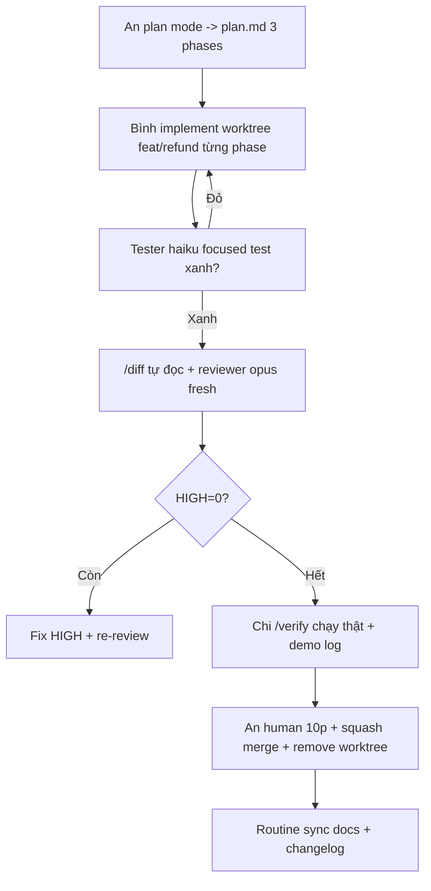

# Tips 09 — Teamwork: Chuẩn Hóa Claude Code Cho Cả Team

> Một người dùng giỏi là kỹ năng. Cả team dùng giống nhau là hệ thống. Bài này: commit gì/không commit gì, plugin phân phối, PR flow với Claude, review chuẩn, chống drift + đo lường.

## Mục lục

- [1. Vì sao phải chuẩn hóa?](#1-vì-sao-phải-chuẩn-hóa)
- [2. Cái gì commit, cái gì không](#2-cái-gì-commit-cái-gì-không)
- [3. Ví dụ: settings + CLAUDE.md + MCP chuẩn team](#3-ví-dụ-settings--claudemd--mcp-chuẩn-team)
- [4. Gói phân phối: plugin > copy-paste dotfiles](#4-gói-phân-phối-plugin--copy-paste-dotfiles)
- [5. Quy trình PR với Claude (đề xuất)](#5-quy-trình-pr-với-claude-đề-xuất)
- [6. Walkthrough: từ feature tới merge trong team 3 người](#6-walkthrough-từ-feature-tới-merge-trong-team-3-người)
- [7. Code review chuẩn team](#7-code-review-chuẩn-team)
- [8. Bảng vai trò + checklist PR](#8-bảng-vai-trò--checklist-pr)
- [9. Chống drift & đo lường](#9-chống-drift--đo-lường)
- [10. Pitfalls + fix](#10-pitfalls--fix)
- [11. Bài tập](#11-bài-tập)
- [12. Tham khảo chéo](#12-tham-khảo-chéo)

---

## 1. Vì sao phải chuẩn hóa?

### 1.1. Không chuẩn hóa thì sao?

- Người A `CLAUDE.md` 50 dòng, người B 600 dòng → cùng prompt, output khác nhau, cãi nhau "Claude nhà tao đúng".
- Hooks branch-protect chỉ máy A có → máy B push thẳng main, sập prod.
- Skills `/deploy` 3 bản khác nhau → deploy staging 3 kiểu, rollback không ai biết.
- MCP tokens hardcode máy 1 người → người khác pull về chạy gãy.

### 1.2. Chuẩn hóa = 3 lớp

```text
Lớp 1 (repo): settings.json + .claude/ + .mcp.json + CLAUDE.md — commit, mọi người giống nhau.
Lớp 2 (phân phối): plugin (skills+hooks+agents+MCP) — cài 1 phát đồng bộ ≥2 repo.
Lớp 3 (org): server-managed settings + policy (Team/Enterprise) — khóa cái không được đổi.
```

Bài này đi từ lớp 1 → 3, kèm PR flow + đo lường để giữ chuẩn sống (không thành giấy).

---

## 2. Cái gì commit, cái gì không

| Commit (`settings.json`, `.claude/`, `.mcp.json`, `CLAUDE.md`) | Không commit (`settings.local.json`, `~/.claude/`, secrets) |
|---|---|
| Verified commands, code style, architecture rules | Preferences cá nhân, project overrides riêng |
| Skills/agents/hooks chuẩn team (đã test) | API tokens (chỉ qua env vars) |
| MCP servers project-scope (URL không secret) | Tokens/headers bí mật, webhook URL có secret |
| `CLAUDE.md` gọn <200 dòng + `@import` docs | Ghi chép cá nhân, plans nháp chưa duyệt |
| Hooks scripts (`hooks/*.sh`, `chmod +x`) | Ledger cost cá nhân (`.claude/ledger/` — gitignore) |

### Quy tắc branch cho config

- Config chuẩn team đổi → PR riêng, 1 reviewer, ghi rõ version Claude đã test.
- Không sửa `settings.json` trực tiếp trên main khi đang hotfix (dễ gãy hooks cả team).
- Secrets xoay → báo team + update env, không commit "fix token" lên git.

---

## 3. Ví dụ: settings + CLAUDE.md + MCP chuẩn team

### Ví dụ 1 — `settings.json` team (copy-paste khung)

```json
{
  "model": "sonnet",
  "effort": "medium",
  "hooks": {
    "PostToolUse": [
      { "matcher": "Edit|Write", "hooks": [{ "type": "command", "command": "${CLAUDE_PROJECT_DIR}/hooks/lint-on-write.sh" }] }
    ],
    "PreToolUse": [
      { "matcher": "Bash", "hooks": [{ "type": "command", "command": "${CLAUDE_PROJECT_DIR}/hooks/branch-protect.sh" }] }
    ],
    "Stop": [
      { "matcher": "", "hooks": [{ "type": "command", "command": "${CLAUDE_PROJECT_DIR}/hooks/cost-cap.sh" }] }
    ]
  },
  "skillOverrides": {
    "legacy-report": { "enabled": false }
  }
}
```

### Ví dụ 2 — `CLAUDE.md` team (<100 dòng khung)

```markdown
# Project X — 1 đoạn mô tả + stack

## Route model
- Explore → haiku. Implement → sonnet. Security/arch → opus + reviewer fresh.

## Luật hay sai nhất (≤10 dòng)
- Test: `pnpm --filter <pkg> test` xanh mới done. Lint: `pnpm lint` 0 error.
- NEVER push main, NEVER force-push, NEVER sửa generated/schema khi chưa duyệt.

## Workflow
- >1 file → plan mode + plan.md trước. Mỗi phase verify + gate.
- PR nontrivial → reviewer fresh + /verify (user-visible).

## Đọc thêm
- Kiến trúc: @docs/architecture.md
- DB: @docs/db-conventions.md
- Hooks: xem hooks/README.md
```

### Ví dụ 3 — `.mcp.json` project-scope (không secret)

```json
{
  "mcpServers": {
    "repo-docs": { "url": "https://docs.internal/mcp", "transport": "http" },
    "ci": { "url": "https://ci.internal/mcp", "transport": "http" }
  }
}
```

```bash
# Secrets qua env, không commit:
export CI_MCP_TOKEN="..."       # mỗi người tự export
export SLACK_WEBHOOK_URL="..."  # cost-cap hook đọc env này
```

---

## 4. Gói phân phối: plugin > copy-paste dotfiles

Bộ setup chuẩn (skills + hooks + agents + MCP) dùng ≥2 repo → đóng **plugin** (`/plugin` manager). Teammate cài 1 phát đồng bộ.

```bash
/plugin
# → Browse hiện trước commands/knowledge-system/agents/skills/hooks/MCP để audit rồi mới cài
# → cài plugin team (vd team-claude-standard), mọi repo hưởng cùng bộ
```

### Cấu trúc plugin team (khung)

```text
team-claude-standard/
  commands/ (plan, review, ship, deploy, issues)
  agents/ (explorer, planner, reviewer, tester — descriptions gọn)
  skills/ (5 skills ở Tips 07)
  hooks/ (lint-on-write, branch-protect, cost-cap + README version)
  .mcp.json (servers không secret)
  README.md (cài sao, version Claude nào, ai approve)
```

### Quy trình release plugin

```text
1. PR vào repo plugin: thêm/sửa skill/hook + test evidence (3 ca lint, 4 ca push...).
2. 1 maintainer review + ghi version (vd v1.4.0) + changelog.
3. Team update plugin (`/plugin update`), chạy /doctor xác nhận.
4. Ghi vào team log: ai update, có gãy gì không.
```

Org lớn: server-managed settings + policy (Team/Enterprise) — khóa `bypass`, khóa push main, pin model cho CI.

---

## 5. Quy trình PR với Claude (đề xuất)

```text
Dev: plan mode → implement theo phase → /verify → /diff tự đọc
  → spawn reviewer subagent fresh (hoặc /code-review) → fix HIGH
  → /ship (merge base, test, bump, changelog, commit, push, PR)
CI: claude -p review job (scope hẹp, dontAsk) + human review
Merge: squash, remove worktrees, sync docs (routine)
```

### Chi tiết từng bước (lệnh thật)

```bash
# 1. Plan (Session A)
/plan
# → duyệt plan.md, commit plan

# 2. Implement (Session B fresh, từng phase)
# "Đọc plan.md, chỉ làm Phase 1, verify rồi dừng"

# 3. Tự đọc diff trước khi nhờ review
/diff
git diff --stat
# → tự bắt lỗi hiển nhiên (debug log quên xóa, file lọt ngoài scope)

# 4. Reviewer fresh
# prompt reviewer ở Tips 04 (SEVERITY + verdict). Fix HIGH.

# 5. Verify chạy thật (nếu user-visible)
/verify

# 6. Ship thành PR
/ship
# → merge base → test → review diff → bump → changelog → commit → push → PR link

# 7. CI: review job hẹp
claude -p "Review diff trong PR này, scope src/payments/**. Finding = bug/security/test-gap. Verdict PASS/NEEDS-FIX." --dontAsk
```

---

## 6. Walkthrough: từ feature tới merge trong team 3 người

**Nhân sự:** An (senior, plan+review), Bình (dev, implement), Chi (QA, verify). Feature refund 3 phases.

**Ngày 1 — An plan (30 phút):**

```text
An: /plan → plan.md 3 phases + gate → commit plan.md → mở draft PR "plan: refund".
Bình + Chi comment 1 vòng (async, không họp): "thêm idempotency edge", "webhook timeout?".
An chốt plan v2.
```

**Ngày 2 — Bình implement (3 sessions fresh):**

```bash
# Sáng: Phase 1 (types) → tester haiku chạy → xanh → push worktree feat/refund
# Chiều: Phase 2a (service) → tester → xanh → push
# Tối: Phase 2b+3 → tester → xanh
```

```bash
git worktree add ../repo-worktrees/refund -b feat/refund
# → Bình làm trong worktree, main sạch, An/Chi không bị ảnh hưởng
```

**Ngày 3 — Review + merge:**

```text
Bình: /diff tự đọc → spawn reviewer opus fresh → 1 HIGH (thiếu idempotency) → fix → re-review PASS.
Chi: /verify (gọi refund thật 2 lần cùng key, chỉ trừ 1 lần) → dán demo log vào PR.
An: human review 10 phút (chỉ đọc HIGH đã fix + demo log) → squash merge → remove worktree.
Routine: sync docs (API.md + changelog) — routine tự chạy sau merge.
```

Tổng human meetings: 0. Async comments: ~5. Rewind: 0 (phase-gate bắt sớm).

---

## 7. Code review chuẩn team

- **Mọi PR nontrivial qua reviewer fresh-context trước human.** Writer không tự duyệt bài mình ([Tips 04](./04-verification-done-that.md), [Tips 05](./05-parallel-agents.md)).
- **PR lớn/rủi ro cao → `/ultrareview`** (multi-agent, cloud sandbox): 3+ agents soi correctness/security/perf, lead tổng hợp.
- **Calibration reviewer bằng 3 diffs lịch sử repo** để chuẩn "độ khó tính" (false-positive ~15% là ok cho self-review; human lọc nốt).

```bash
/code-review
# → review chuẩn 1 agent (default, nhanh)

/ultrareview
# → multi-agent nặng (chậm, đắt, chỉ PR lớn/rủi ro cao)
```

### Template verdict team (paste vào PR)

```markdown
## Review
- Reviewer: fresh subagent opus (prompt chuẩn team) + human @an
- Findings: 1 HIGH (fixed), 2 MED (noted), 0 LOW
- Calibration: reviewer đã rate đúng 3/3 diffs lịch sử
- Demo: /verify log đính kèm (refund idempotent)
```

---

## 8. Bảng vai trò + checklist PR

### Bảng vai trò (team 3–5 người)

| Vai | Làm gì với Claude | Không làm gì |
|---|---|---|
| Planner (senior) | `/plan`, duyệt plan.md, calibration reviewer | Không implement hộ (mất tách context) |
| Implementer | Session fresh từng phase, tester haiku | Không tự review bài mình |
| Reviewer (agent + human) | Fresh subagent soi + human chốt HIGH | Không flag style thành HIGH |
| QA/Verifier | `/verify` chạy thật, flaky ghi FLAKY | Không đoán root cause flaky bừa |
| Maintainer config | Duyệt plugin/settings/hooks PR, pin version | Không sửa config thẳng main |

### Checklist PR (copy vào PR template)

```markdown
- [ ] plan.md đã duyệt (nếu >1 file)?
- [ ] `pnpm test <scope>` xanh (log đính kèm)?
- [ ] `git diff --stat` chỉ chạm scope cho phép?
- [ ] Reviewer fresh: HIGH = 0 (hoặc đã fix + re-review)?
- [ ] User-visible → `/verify` pass (demo log/screenshot)?
- [ ] Changelog + docs sync (routine)?
- [ ] Worktree đã remove sau merge?
```

---

## 9. Chống drift & đo lường

### Chống drift (chuẩn sống, không thành giấy)

- **Routine Docs-sync sau merge:** rule merge xong tự nhắc sync `docs/` + `CLAUDE.md` nếu API/luật đổi (routine, không phải hook chặn).
- **Weekly dep audit:** 1 lần/tuần, agent đọc lockfile + advisories, báo PR bump (human approve).
- **Overnight CI failure analysis:** job `claude -p` đọc log CI fail đêm qua, tóm tắt 5 bullet + nghi ngờ root (human quyết fix).

### Đo lường (biết team có tiến không)

```bash
/insights
# → HTML report thói quen coding (ai hay bỏ verify? ai hay gộp việc?)

/stats
# → usage/streaks cá nhân
```

- Analytics dashboard (Team/Enterprise): bill theo người/repo, retry rate, review pass rate.
- Monthly: `/doctor` toàn team + prune skills/MCP + review hook performance (>5s thì tối ưu).
- Ghi `docs/team-log.md`: tháng này bill bao nhiêu, retry bao nhiêu, 1 cải tiến quy trình.

### Bảng metrics đề xuất (đơn giản, 4 số)

| Metric | Đo bằng gì | Mục tiêu |
|---|---|---|
| Retry rate (turns tới done) | Transcript/PR comments | Giảm 30%/quý |
| HIGH lọt production | Incidents | = 0 |
| Bill/người/tuần | `/usage` + dashboard | Giảm 20% sau chuẩn hóa |
| Review turnaround | PR open→merge | <24h (nhờ reviewer agent trước) |

---

## 10. Pitfalls + fix

| Pitfall | Triệu chứng | Fix |
|---|---|---|
| Config mỗi máy 1 kiểu | "Máy tao chạy được" | Commit settings/.claude/.mcp.json + plugin |
| Commit secret lên git | Token trong history | Env vars + prompt hook check secret ([Tips 06](./06-hooks-recipes.md)) |
| Tự review bài mình | HIGH lọt | Bắt buộc reviewer fresh + human thứ 2 cho PR tiền/auth |
| PR 50 files không ai review nổi | Review qua loa, lọt bug | Chia phase/PR nhỏ, `/ultrareview` cho PR lớn |
| Worktree quên remove | 10 worktrees rác, disk đầy | Checklist PR có "remove worktree" + cron nhắc |
| Plugin không version | Update gãy cả team | Version + changelog + `/doctor` sau update |
| Không đo lường | Chuẩn hóa 3 tháng không biết hiệu quả | 4 metrics mục 9, review monthly |
| Docs sau merge không sync | Docs lệch code 2 versions | Routine docs-sync + checklist PR |
| Pin model cứng nhắc | Task nhỏ cũng opus, bill vọt | Route theo việc ([Tips 08](./08-tiet-kiem-cost-token.md)), pin chỉ CI |

---

## 11. Bài tập

**Bài 1 (20 phút — audit commit):**

1. Chạy `git status` + `git ls-files | grep -E 'settings|CLAUDE|mcp|hooks'`: cái gì chuẩn team mà chưa commit?
2. So `settings.local.json` vs `settings.json`: có gì đáng lên chuẩn team (hook hay, skill hay)?
3. Xoay 1 secret (nếu có trong history): revoke + chuyển env + thêm prompt hook check.

**Bài 2 (30 phút — plugin thử nghiệm):**

1. Đóng 1 plugin mini (2 skills + 1 hook lint) theo khung mục 4.
2. Nhờ 1 đồng nghiệp cài via `/plugin` Browse + audit trước khi cài.
3. Cả 2 chạy `/doctor`: có gì lệch nhau? Gộp thành 1 README cài đặt.

**Bài 3 (45 phút — chạy PR flow 1 vòng):**

1. Lấy 1 task nhỏ, chạy đủ flow mục 5 (plan → phase → diff → reviewer fresh → verify → ship).
2. Điền checklist PR mục 8 + template review mục 7.
3. Đo: thời gian human review (mục tiêu <15 phút cho PR nhỏ nhờ agent review trước).

> Đạt: sau 1 quý, 100% PR nontrivial qua reviewer fresh + 0 incident HIGH + bill/người giảm mà tốc độ merge tăng.

---

### 11.5. Thuật ngữ mới (nôm na + analogie + ví dụ + verify)

| Thuật ngữ | Nôm na 1 câu | Analogie | Ví dụ kỹ thuật thật | Cách verify |
|---|---|---|---|---|
| Chuẩn hóa 3 lớp | Repo giống nhau + plugin đồng bộ + org khóa cái cấm. | Như đồng phục (repo) + vali đồ nghề chung (plugin) + nội quy trường (org policy). | `settings.json/.claude/.mcp.json` commit + `team-claude-standard` plugin + managed settings khóa bypass | Pull về máy mới chạy `/doctor` xanh, không `máy tao chạy được`. |
| Plugin phân phối | Gói đồ nghề cài 1 phát cho ≥2 repo. | Như combo bếp: mua 1 thùng có đủ dao/thớt/gia vị cho mọi bếp. | `team-claude-standard/commands/agents/skills/hooks/.mcp.json` version `v1.4.0` | Teammate `/plugin` Browse audit rồi cài, mọi repo cùng bộ. |
| Reviewer fresh bắt buộc | Mọi PR nontrivial phải qua mắt ngoài trước mắt trong. | Như kiểm toán: kế toán làm sổ, kiểm toán độc lập soi trước sếp ký. | Fresh subagent opus + human, `HIGH=0` mới merge | PR có `Review: fresh opus + @an, 1 HIGH fixed, /verify log`. |

### 11.6. Mermaid: PR flow team 3 người



Giải thích:

1. **A→B:** senior plan async, commit plan, không họp.
2. **B→C:** mỗi phase 1 session fresh + tester haiku.
3. **C→D:** tự đọc diff bắt lỗi hiển nhiên trước khi nhờ review.
4. **D→F:** reviewer fresh SEVERITY + verdict; HIGH fix hết.
5. **G→I:** QA chạy thật, human chốt nhanh, routine sync docs.

### 11.7. Bảng so sánh có cột Hiểu nôm na + Ví dụ

| Cách | Hiểu nôm na | Ví dụ |
|---|---|---|
| Copy dotfiles | Photo tài liệu chuyền tay, mỗi bản 1 kiểu | Skills `/deploy` 3 bản khác nhau → deploy 3 kiểu |
| Plugin | Phát sách giáo khoa cả trường học 1 bản | `/plugin` cài `team-claude-standard v1.4.0` + changelog |
| Không chuẩn | Mỗi nhà nấu 1 vị, cãi nhau nhà ai đúng | A 50 dòng CLAUDE.md, B 600 dòng → cùng prompt khác output |

**Kỳ vọng thấy gì:**

```bash
git ls-files | grep -E 'settings|CLAUDE|mcp|hooks'
/doctor
```

> Kỳ vọng thấy gì: `settings.json/.claude/hooks/*.sh/.mcp.json/CLAUDE.md` đều tracked; `/doctor` không báo lệch setup giữa 2 máy. Thiếu file chuẩn là chưa commit.

### 11.8. Before/After

**Before:** `Mỗi máy 1 config, hook chỉ máy A, token hardcode, PR tự review` → Kết quả dở: máy B push main sập prod, deploy 3 kiểu, HIGH lọt.

**After:**

```bash
/plan
# implement từng phase fresh + tester haiku
/diff
# reviewer fresh opus + fix HIGH
/verify
/ship
```

> Kết quả tốt + Kỳ vọng: checklist PR 7 ticks (plan/test/diff/HIGH=0/verify/changelog/worktree removed) + human review <15p + merge 0 meeting.

### 11.9. Hiểu nhầm thường gặp

| Hiểu nhầm | Sự thật |
|---|---|
| Commit secret cho tiện pull là chạy | Token vào history là lộ; env vars + prompt hook check secret |
| PR 50 files review 1 lượt cho nhanh | Không ai review kỹ được; chia PR nhỏ, PR lớn dùng `/ultrareview` |
| Pin model cứng mọi task là chuẩn | Task nhỏ cũng opus là bill vọt; route theo việc, pin chỉ CI |

## 12. Tham khảo chéo

- Lệnh team/plugin/review:
  - [../01-huong-dan-su-dung/commands/knowledge-system/plugin/README.md](../01-huong-dan-su-dung/commands/knowledge-system/plugin/README.md) — manager + Browse audit
  - [../01-huong-dan-su-dung/commands/code-repo/code-review/README.md](../01-huong-dan-su-dung/commands/code-repo/code-review/README.md) — review chuẩn
  - [../01-huong-dan-su-dung/commands/code-repo/ultrareview/README.md](../01-huong-dan-su-dung/commands/code-repo/ultrareview/README.md) — multi-agent PR lớn
  - [../01-huong-dan-su-dung/commands/code-repo/batch/README.md](../01-huong-dan-su-dung/commands/code-repo/batch/README.md) (nếu có) — đóng PR
  - [../01-huong-dan-su-dung/commands/code-repo/diff/README.md](../01-huong-dan-su-dung/commands/code-repo/diff/README.md) — tự đọc diff
  - [../01-huong-dan-su-dung/commands/code-repo/verify/README.md](../01-huong-dan-su-dung/commands/code-repo/verify/README.md) — QA chạy thật
  - [../01-huong-dan-su-dung/commands/knowledge-system/insights/README.md](../01-huong-dan-su-dung/commands/knowledge-system/insights/README.md) (nếu có) — report thói quen
  - [../01-huong-dan-su-dung/commands/knowledge-system/stats/README.md](../01-huong-dan-su-dung/commands/knowledge-system/stats/README.md) (nếu có) — usage/streaks
  - [../01-huong-dan-su-dung/commands/knowledge-system/doctor/README.md](../01-huong-dan-su-dung/commands/knowledge-system/doctor/README.md) — audit team monthly
- Bài tips liên quan:
  - [Tips 04](./04-verification-done-that.md) — reviewer + verify levels
  - [Tips 05](./05-parallel-agents.md) — reviewer/tester + worktrees/batch
  - [Tips 06](./06-hooks-recipes.md) — commit hooks team
  - [Tips 07](./07-thiet-ke-skills.md) — 5 skills + plugin
  - [Tips 08](./08-tiet-kiem-cost-token.md) — bill team + route model

> Mẹo 1 dòng: _chuẩn hóa = commit cái đáng commit, plugin cái dùng chung, review mọi PR nontrivial bằng reviewer fresh trước human._
