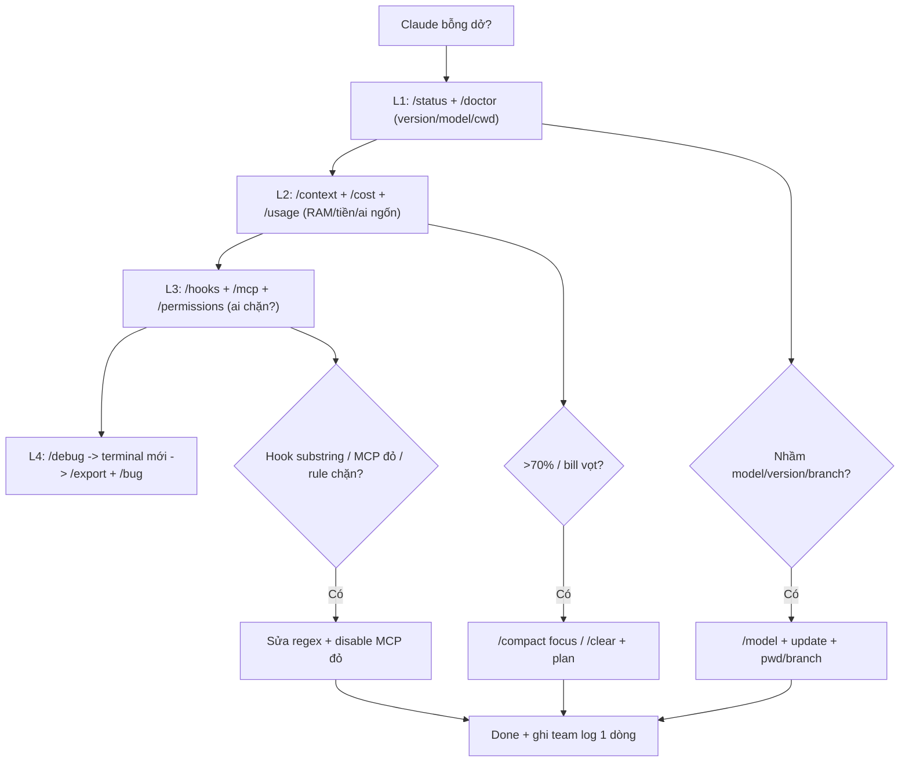

# Tips 10 — Debugging & Phím Tắt Power-User (Ít Người Biết)

> Kẹt thì debug theo lớp (L1→L4), không đoán mò. Bài này: 4 lớp debug (status/doctor → context/cost/usage → hooks/mcp/permissions → debug/bug), full phím tắt + micro-features, và 9 pitfalls power-user vẫn dính.

## Mục lục

- [1. Tư duy debug theo lớp](#1-tư-duy-debug-theo-lớp)
- [2. L1: setup (status/doctor)](#2-l1-setup-statusdoctor)
- [3. L2: context + tiền (context/cost/usage)](#3-l2-context--tiền-contextcostusage)
- [4. L3: hooks + MCP + permissions (cái gì chặn?)](#4-l3-hooks--mcp--permissions-cái-gì-chặn)
- [5. L4: debug session + gửi bug](#5-l4-debug-session--gửi-bug)
- [6. Ví dụ copy-paste: 3 ca cứu nhanh](#6-ví-dụ-copy-paste-3-ca-cứu-nhanh)
- [7. Walkthrough: "Claude bỗng dở đi" trong 10 phút](#7-walkthrough-claude-bỗng-dở-đi-trong-10-phút)
- [8. Phím tắt & micro-features đáng tiền](#8-phím-tắt--micro-features-đáng-tiền)
- [9. Bảng tra nhanh: triệu chứng → lớp → lệnh](#9-bảng-tra-nhanh-triệu-chứng--lớp--lệnh)
- [10. 9 pitfalls power-user vẫn dính (+ checklist)](#10-9-pitfalls-power-user-vẫn-dính--checklist)
- [11. Bài tập](#11-bài-tập)
- [12. Tham khảo chéo](#12-tham-khảo-chéo)

---

## 1. Tư duy debug theo lớp

Đừng hỏi "sao Claude ngu đi?" — hỏi "tắc ở lớp nào?" Đi từ ngoài vào trong, rẻ trước đắt sau:

```text
L1: /status (version/model/account) → /doctor (setup) → claude doctor (ngoài terminal)
L2: /context + /cost + /usage (context? tiền? ai ngốn?)
L3: /hooks + /mcp + /permissions (hook/mcp/rule nào chặn?)
L4: /debug (troubleshoot session) → /bug (gửi Anthropic)
```

> Quy tắc: **chưa qua L1–L3 thì chưa được kết luận "model dở".** 80% ca "model dở" là context bẩn, hook chặn nhầm, hoặc nhầm model/effort.

---

## 2. L1: setup (status/doctor)

### `/status`: mình đang là ai, ở đâu?

```bash
/status
# → version Claude Code, model (haiku/sonnet/opus), account/plan, session, cwd, branch
```

Check:

- Version quá cũ → lệnh mới (`/batch`, `/ultrareview`) báo unknown. Update: `npm i -g @anthropic-ai/claude-code`.
- Model nhầm (tưởng opus mà đang haiku) → chất lượng khác hẳn. Đổi: `/model`.
- Cwd/branch nhầm (tưởng repo A mà đang repo B) → mọi đọc file sai. `pwd` + `git branch --show-current`.

### `/doctor` + `claude doctor`: khám tổng quát

```bash
/do upto
/doctor
# → skills/MCP/plugins cài mà không dùng vs context cost + hooks chậm + version mới + permissions lạ

claude doctor
# → chạy ngoài terminal khi /doctor báo setup lỗi (quyền file, PATH, MCP binary, hooks exec)
```

Copy-paste khám định kỳ:

```bash
/status
/doctor
claude doctor
# → chụp 3 outputs, sửa theo thứ tự doctor báo (đỏ trước, vàng sau)
```

---

## 3. L2: context + tiền (context/cost/usage)

### `/context`: RAM còn bao nhiêu?

```bash
/context
# → grid usage %, ai ngốn (skills, subagents, MCP, history)
```

- >70% → `/compact` có focus hoặc `/clear` + nạp `plan.md` ([Tips 01](./01-context-hygiene.md)).
- Ngốn vì 1 subagent explore 40 files → lần sau scope hẹp + output contract ([Tips 05](./05-parallel-agents.md)).

### `/cost` + `/usage`: tiền + kẻ ngốn

```bash
/cost
# → session này tốn bao nhiêu (input/output + $)

/usage
# → breakdown skills/subagents/plugins/per-MCP-server + rate limits
```

- Bill vọt sau fan-out → kiểm tra spawn lồng (subagent spawn subagent).
- 1 MCP ngốn 20K mà tuần này không cần → `/mcp` tắt tạm ([Tips 08](./08-tiet-kiem-cost-token.md)).

---

## 4. L3: hooks + MCP + permissions (cái gì chặn?)

Khi tool "lặng lẽ không chạy" hoặc bị block oan, 90% ở lớp này.

```bash
/hooks
# → list hooks: matcher (case-sensitive!), event (Pre/Post/Stop/Start), command path
# → kiểm tra: sai event? overlap updatedInput? script có +x không?

/mcp
# → servers nào bật? tools nào visible? server nào fail (đỏ)?
# → quá ~10 tools visible là accuracy giảm — prune server không dùng

/permissions
# → rules cho phép/chặn gì? Có rule nào chặn lệnh bạn cần?
# → đừng `--dangerously-skip-permissions` trên máy dev (chỉ CI sandbox)
```

### Copy-paste debug hook chặn nhầm

```bash
# 1. Xem hooks nào match Bash/Write
/hooks

# 2. Chạy script tay với stdin JSON mẫu (thấy ngay regex sai)
echo '{"tool_input":{"command":"git push origin feat/my-main-fix"}}' | ./hooks/branch-protect.sh; echo "exit=$?"
# → phải exit=0. Nếu exit=2 là substring match bừa (xem Tips 06).

# 3. Đo hook chậm
time ./hooks/test-gate.sh
# → >5s thì focus scope (TEST_SCOPE) hoặc cache
```

### Copy-paste debug MCP

```bash
/mcp
# → server nào đỏ? disable từng cái, thử lại lệnh fail
/usage
# → per-MCP-server tokens: server nào ngốn mà không dùng → tắt
```

---

## 5. L4: debug session + gửi bug

```bash
/debug
# → troubleshoot session hiện tại (transcript, checkpoints, tasks kẹt, subagents nền)

/export
# → xuất conversation ra text để share/debug (gửi đồng đội hoặc đính kèm /bug)

/bug
# → gửi bug cho Anthropic (kèm mô tả + steps + /export nếu cần)
```

Khi nào lên L4:

- Đã qua L1–L3, mọi thứ "trông đúng" mà vẫn fail → `/debug`.
- Nghi bug của Claude Code (không phải repo bạn) → `/export` + `/bug` với repro tối thiểu.
- Trước khi `/bug`: thử terminal mới + session mới có còn fail không (loại trừ context bẩn).

---

## 6. Ví dụ copy-paste: 3 ca cứu nhanh

### Ca 1 — Push bị block oan (`feat/my-main-fix` không push được)

```bash
# Triệu chứng: mọi git push đều "BLOCKED", kể cả branch thường
/hooks
echo '{"tool_input":{"command":"git push origin feat/my-main-fix"}}' | ./hooks/branch-protect.sh; echo "exit=$?"
# → exit=2: hook substring "main" bừa. Fix: thay bằng regex intent ở Tips 06 mục 2b.
# Test lại 4 ca push force + HEAD:main (phải blocked) + feat/my-main-fix (phải pass).
```

### Ca 2 — Session bỗng chậm + trả lời lan man

```bash
/context
# → 82%, history toàn log test cũ + 3 explorers
/compact Giữ plan.md + decisions 1-5, bỏ log test và files đã đọc không liên quan.
# Nếu vẫn >60%:
/export
/clear
# → paste plan.md + "làm phase hiện tại, verify rồi dừng"
```

### Ca 3 — Subagent chạy mãi không về

```bash
/agents
/tasks
# → thấy explorer-auth chạy 20 phút, không output
# Ping 1 lần, không trả → kill:
# Ctrl+X Ctrl+K ×2 trong 3s
# Spawn lại hẹp hơn: "chỉ đọc src/auth/login*.ts, ≤8 files, ≤15 bullet, không dump log"
```

---

## 7. Walkthrough: "Claude bỗng dở đi" trong 10 phút

**Phút 0–2 (L1):**

```bash
/status
# → phát hiện đang haiku (hôm qua opus) — do /model nhầm sau update
/model sonnet
/effort medium
# → 30% ca tới đây là xong.
```

**Phút 2–5 (L2):**

```bash
/context
# → 76%, ngốn vì paste 2 logs 800 dòng hôm qua
/usage
# → explorer hôm qua 45K vẫn nằm trong history
/compact Giữ plan.md phase hiện tại, bỏ 2 logs cũ.
/cost
# → xác nhận session nhẹ lại
```

**Phút 5–8 (L3):**

```bash
/hooks
# → test-gate.sh chạy full suite 4 phút mỗi turn-end → mọi thứ "chậm"
TEST_SCOPE=auth ./hooks/test-gate.sh
# → sửa gate thành focused scope, full suite để CI
/mcp
# → github-mcp đỏ (token hết hạn) → disable tạm, mọi gọi tool hết treo
```

**Phút 8–10 (L4 nếu còn fail):**

```bash
/debug
# → không thấy gì lạ → terminal mới + session mới, paste plan gọn
# → hết dở: kết luận context bẩn, không phải model dở
# → vẫn dở: /export + /bug kèm repro tối thiểu
```

> Ghi lại ca này vào team log (1 dòng: nguyên nhân + fix) — lần sau 2 phút là ra.

---

## 8. Phím tắt & micro-features đáng tiền

| Phím/lệnh | Tác dụng | Khi dùng |
|---|---|---|
| `Shift+Tab` | Xoay default → acceptEdits → plan → auto → bypass | Vào plan mode không cần `/plan` |
| `Double-Esc` (prompt rỗng) | Rewind menu (code + conversation) | Correct 2 lần vẫn sai → rewind, đừng cãi |
| `Ctrl+X Ctrl+K` ×2/3s | Kill all background subagents | Fan-out sai, con nền loop |
| `/btw <q>` | Hỏi nhanh, full context + no tools, không pollute history | Thắc mắc giữa implement |
| `/fork`, `/branch` | Thử what-if không mất mạch chính | 2 hướng, giữ bản gốc |
| `/teleport` | Resume remote (claude.ai) session | Chuyển máy/về nhà làm tiếp |
| `/export` | Xuất conversation ra text để share/debug | Trước `/clear`, trước `/bug` |
| `/terminal-setup` | Fix Shift+Enter newline (iTerm2/VSCode/Kitty/Alacritty/Zed/Warp/WezTerm) | Shift+Tab/Enter không ăn |
| `/vim`, `/theme`, `/keybindings`, `/statusline` | Vim mode, theme, phím custom, status line | Cá nhân hóa, status hiện model/% context |
| `/resume` | Mở lại session cũ (picker) | Clear nhầm, hôm sau làm tiếp |
| `/rewind` | Quay checkpoint (bản lệnh của Double-Esc) | Terminal không có Esc tiện |
| `/clear` / `/compact` | Reset trắng / nén giữ tóm tắt | Đổi task / cùng task đầy RAM |
| `/context` / `/cost` / `/usage` | RAM / tiền session / ai ngốn | Khám L2 hàng ngày |
| `/agents` / `/tasks` | Agents running/library + tasks nền | Giám sát fan-out |
| `/doctor` / `/debug` / `/bug` | Khám setup / troubleshoot / gửi Anthropic | L1/L4 |

**2 micro-features ít người biết:**

```bash
# 1. Status line hiện model + % context (khỏi /context mỗi lần)
/statusline
# → config 1 dòng hiện `sonnet · 42%` ngay prompt

# 2. Rewind bằng lệnh (khi Double-Esc không tiện trong SSH/tmux)
/rewind
# → tương đương menu rewind, chọn checkpoint bằng list
```

---

## 9. Bảng tra nhanh: triệu chứng → lớp → lệnh

| Triệu chứng | Lớp | Lệnh / fix |
|---|---|---|
| `unknown command` | L1 version | `claude --version`, update `npm i -g @anthropic-ai/claude-code` |
| Model trả lời khác hẳn hôm qua | L1 model | `/status` xem model, `/model` đổi lại |
| Đang repo/branch khác tưởng | L1 cwd | `pwd`, `git branch --show-current`, `/status` |
| Trả lời lan man, quên rule | L2 context | `/context` → `/compact` focus hoặc `/clear` + plan |
| Bill vọt 1 ngày | L2 cost | `/usage` tìm kẻ ngốn, `/cost` so baseline |
| Push/edit bị BLOCKED oan | L3 hooks | `/hooks` + chạy script tay (mục 4) |
| Tool MCP treo/fail | L3 MCP | `/mcp` disable server đỏ, `/usage` per-server |
| Lệnh cần quyền bị từ chối | L3 permissions | `/permissions` xem rule, không skip-permissions trên dev |
| Subagent mất tích | L3/L4 agents | `/agents`, `/tasks`, kill `Ctrl+X Ctrl+K` |
| Session kẹt không rõ | L4 session | `/debug`, terminal mới thử lại, `/export` + `/bug` |
| Shift+Tab/Enter không ăn | Terminal | `/terminal-setup` theo terminal (iTerm2/VSCode/Kitty...) |

---

## 10. 9 pitfalls power-user vẫn dính (+ checklist)

1. **Infinite exploration ("investigate" không scope).** Đọc 300 files, bill vọt. Fix: scope hẹp + subagent + output contract ([Tips 01](./01-context-hygiene.md)).
2. **Reviewer tự chấm bài mình.** Toàn PASS mù. Fix: luôn fresh reviewer ([Tips 04](./04-verification-done-that.md)).
3. **Hook chặn nhầm vì substring (`main`).** `feat/my-main-fix` oan. Fix: match intent + test 4 ca push ([Tips 06](./06-hooks-recipes.md)).
4. **Tin "should work".** Không log/diff/test. Fix: đòi evidence (L2 verify, [Tips 04](./04-verification-done-that.md)).
5. **Dùng subagent cho việc skill làm được.** Tốn 20K overhead cho việc 500 tokens. Fix: skill trước, subagent sau ([Tips 07](./07-thiet-ke-skills.md)).
6. **Dùng hook cho việc làm 1 lần.** Setup hook 30 phút cho việc nhắc 1 câu là xong. Fix: hook chỉ cho rule lặp + phải đúng 100%.
7. **Thêm MCP khi data đã ở local repo.** Nặng context, chậm. Fix: `Read`/`Grep` local trước, thiếu mới bật MCP.
8. **Skills pile-up: skill load sai lúc.** 20 skills trigger loạn. Fix: thu hẹp description + `skillOverrides` + `/doctor` ([Tips 07](./07-thiet-ke-skills.md)).
9. **Quên cloud ≠ local.** Config/hooks/MCP local không lên cloud (claude.ai). Fix: cái gì cần trên cloud thì cấu hình cloud-scope + test trên cloud trước khi tin.
10. **Bonus: `--dangerously-skip-permissions` trên máy dev.** Tiện 10 giây, rủi ro xóa/push bừa. Fix: chỉ dùng trong CI sandbox, máy dev dùng `/permissions` duyệt.

**Checklist power-user mỗi tuần:**

- [ ] `Shift+Tab` xoay modes thuộc tay (không cần nhìn)?
- [ ] Double-Esc rewind thay vì cãi quá 2 turns?
- [ ] `Ctrl+X Ctrl+K` kill switch nhớ như reflex?
- [ ] `/btw` cho hỏi phụ, subagent cho explore ồn?
- [ ] `/context` + `/cost` mỗi 30–45 phút task dài?
- [ ] Hook nào chặn oan tuần này? Sửa regex + thêm ca test?
- [ ] MCP nào không dùng? Tắt. Skill nào fire sai? Hẹp description.
- [ ] Cloud vs local: có gì test local mà tưởng cloud có?

---

## 11. Bài tập

**Bài 1 (15 phút — thuộc phím tắt):**

1. Xoay `Shift+Tab` hết vòng modes, chụp nhớ vị trí `plan`.
2. Thử Double-Esc rewind ở 1 session nháp (sửa 1 file rồi rewind về).
3. Thử `Ctrl+X Ctrl+K` sau khi spawn 1 subagent test. Chạy `/terminal-setup` nếu phím không ăn.

**Bài 2 (20 phút — debug 4 lớp):**

1. Cố tình gây 3 lỗi: (a) branch sai, (b) context 70%+ (paste log lớn), (c) hook block 1 lệnh legit.
2. Debug theo L1→L4, ghi mỗi lỗi mất bao lâu + lệnh nào tìm ra.
3. Viết 1 dòng team log mỗi lỗi (nguyên nhân + fix) để lần sau 2 phút.

**Bài 3 (20 phút — audit 9 pitfalls):**

1. Đối chiếu 9 pitfalls với tuần vừa rồi: bạn dính mấy cái? (thành thật).
2. Fix 2 cái dễ nhất (vd hẹp 1 skill description, sửa 1 hook substring).
3. Đặt statusline hiện model + % context (khỏi quên `/context`).

> Đạt: sau 1 tháng, 80% "Claude dở" bạn tự debug L1–L3 trong 10 phút mà không cần hỏi ai.

---

### 11.5. Thuật ngữ mới (nôm na + analogie + ví dụ + verify)

| Thuật ngữ | Nôm na 1 câu | Analogie | Ví dụ kỹ thuật thật | Cách verify |
|---|---|---|---|---|
| Debug theo lớp L1→L4 | Khám từ ngoài vào trong, rẻ trước đắt sau. | Như khám bệnh: hỏi triệu chứng (L1) → đo huyết áp (L2) → X-quang (L3) → hội chẩn (L4). | L1 `/status//doctor`, L2 `/context//cost//usage`, L3 `/hooks//mcp//permissions`, L4 `/debug//bug` | 80% ca xong ở L1-L3 trong 10p, chưa cần `/bug`. |
| Kill switch subagents | Nút ngắt điện khi fan-out chập. | Như aptomat: chập là sập cả dàn, rồi bật lại từng cái. | `Ctrl+X Ctrl+K ×2 trong 3s` | `/agents` hết job nền; `/usage` ngừng vọt. |
| Statusline + `/btw` | Bảng đồng hồ + hỏi thầm không ghi sổ. | Như đồng hồ xăng (statusline) + hỏi đường không ghi biên bản (`/btw`). | `/statusline` hiện `sonnet · 42%`; `/btw hàm X làm gì?` | Không cần `/context` mỗi lần; history không dài thêm. |

### 11.6. Mermaid: debug L1→L4 trong 10 phút



Giải thích:

1. **A→L1:** version cũ (`unknown command`), nhầm model, nhầm cwd/branch.
2. **L1→L2:** RAM còn bao nhiêu, ai ngốn (explorer 45K, log 800 dòng).
3. **L2→L3:** tool lặng lẽ không chạy → hook/MCP/permissions (90% ở đây).
4. **L3→L4:** trông đúng mà vẫn fail → `/debug`, thử session mới loại trừ context bẩn.
5. **→D:** ghi 1 dòng log để lần sau 2 phút.

### 11.7. Bảng so sánh có cột Hiểu nôm na + Ví dụ

| Lớp | Hiểu nôm na | Ví dụ |
|---|---|---|
| L1 setup | Coi giấy tờ xe trước khi chê xe yếu | `/status` phát hiện đang haiku tưởng opus → `/model sonnet` |
| L2 context/tiền | Coi xăng + hành lý có quá tải không | `/context` 82% toàn log cũ → `/compact` giữ plan, bỏ log |
| L3 chặn | Coi có ai kéo thắng tay không | `feat/my-main-fix` bị block → hook substring `main` → sửa regex intent |

**Kỳ vọng thấy gì:**

```bash
/status
/context
/hooks
echo '{"tool_input":{"command":"git push origin feat/my-main-fix"}}' | ./hooks/branch-protect.sh; echo "exit=$?"
```

> Kỳ vọng thấy gì: `/status` đúng model/branch; `/context` <70% sau compact; hook test `exit=0` (cho qua). `exit=2` là chặn oan → sửa theo Tips 06.

### 11.8. Before/After

**Before:** `"Sao Claude ngu đi?" → đoán mò đổi model, cãi 5 turns` → Kết quả dở: context 82% + hook chặn nhầm + MCP đỏ vẫn y nguyên, bill vọt.

**After:**

```bash
/status        # phát hiện haiku -> /model sonnet
/context       # 76% -> /compact giữ plan, bỏ 2 logs
/hooks         # test-gate full 4p -> TEST_SCOPE=auth
/mcp           # github đỏ -> disable tạm
```

> Kết quả tốt + Kỳ vọng: 10 phút xong 80% ca, session nhẹ, hết treo; còn fail mới `/debug` + session mới + `/export + /bug` kèm repro tối thiểu.

### 11.9. Hiểu nhầm thường gặp

| Hiểu nhầm | Sự thật |
|---|---|
| Chưa qua L1-L3 đã kết luận model dở | 80% là context bẩn/hook chặn/nhầm model; phải đi lớp rẻ trước |
| `--dangerously-skip-permissions` trên dev cho nhanh | Tiện 10s, rủi xóa/push bừa; chỉ CI sandbox, dev dùng `/permissions` duyệt |
| Thêm MCP khi data đã local là xịn | Nặng context + chậm; `Read/Grep` local trước, thiếu mới bật MCP |

## 12. Tham khảo chéo

- Lệnh debug & sessions:
  - [../01-huong-dan-su-dung/commands/auth-settings/status/README.md](../01-huong-dan-su-dung/commands/auth-settings/status/README.md) — mình là ai, ở đâu
  - [../01-huong-dan-su-dung/commands/knowledge-system/doctor/README.md](../01-huong-dan-su-dung/commands/knowledge-system/doctor/README.md) — khám setup
  - [../01-huong-dan-su-dung/commands/session-context/context/README.md](../01-huong-dan-su-dung/commands/session-context/context/README.md) — RAM còn bao nhiêu
  - [../01-huong-dan-su-dung/commands/session-context/cost/README.md](../01-huong-dan-su-dung/commands/session-context/cost/README.md) — tiền session
  - [../01-huong-dan-su-dung/commands/session-context/usage/README.md](../01-huong-dan-su-dung/commands/session-context/usage/README.md) — ai ngốn
  - [../01-huong-dan-su-dung/commands/knowledge-system/hooks/README.md](../01-huong-dan-su-dung/commands/knowledge-system/hooks/README.md) — hook nào chặn
  - [../01-huong-dan-su-dung/commands/knowledge-system/mcp/README.md](../01-huong-dan-su-dung/commands/knowledge-system/mcp/README.md) — MCP nào fail
  - [../01-huong-dan-su-dung/commands/model-mode/permissions/README.md](../01-huong-dan-su-dung/commands/model-mode/permissions/README.md) — rule nào chặn
  - [../01-huong-dan-su-dung/commands/knowledge-system/debug/README.md](../01-huong-dan-su-dung/commands/knowledge-system/debug/README.md) — troubleshoot session
  - [../01-huong-dan-su-dung/commands/knowledge-system/bug/README.md](../01-huong-dan-su-dung/commands/knowledge-system/bug/README.md) — gửi Anthropic
  - [../01-huong-dan-su-dung/commands/session-context/export/README.md](../01-huong-dan-su-dung/commands/session-context/export/README.md) — xuất transcript
  - [../01-huong-dan-su-dung/commands/session-context/rewind/README.md](../01-huong-dan-su-dung/commands/session-context/rewind/README.md) — quay checkpoint
  - [../01-huong-dan-su-dung/commands/session-context/clear/README.md](../01-huong-dan-su-dung/commands/session-context/clear/README.md) — reset trắng
  - [../01-huong-dan-su-dung/commands/session-context/compact/README.md](../01-huong-dan-su-dung/commands/session-context/compact/README.md) — nén giữ tóm tắt
  - [../01-huong-dan-su-dung/commands/auth-settings/terminal-setup/README.md](../01-huong-dan-su-dung/commands/auth-settings/terminal-setup/README.md) — fix phím
  - [../01-huong-dan-su-dung/commands/knowledge-system/agents/README.md](../01-huong-dan-su-dung/commands/knowledge-system/agents/README.md) — agents nền
  - [../01-huong-dan-su-dung/commands/auth-settings/teleport/README.md](../01-huong-dan-su-dung/commands/auth-settings/teleport/README.md) — resume remote
- Bài tips liên quan:
  - [Tips 01](./01-context-hygiene.md) — context bẩn (L2)
  - [Tips 06](./06-hooks-recipes.md) — hooks chặn nhầm (L3)
  - [Tips 08](./08-tiet-kiem-cost-token.md) — bill vọt (L2)

> Mẹo 1 dòng: _kẹt thì đi L1→L4 (setup → context/tiền → hooks/MCP/permissions → debug/bug) — đừng đoán, đừng cãi, đừng tin "should work"._
