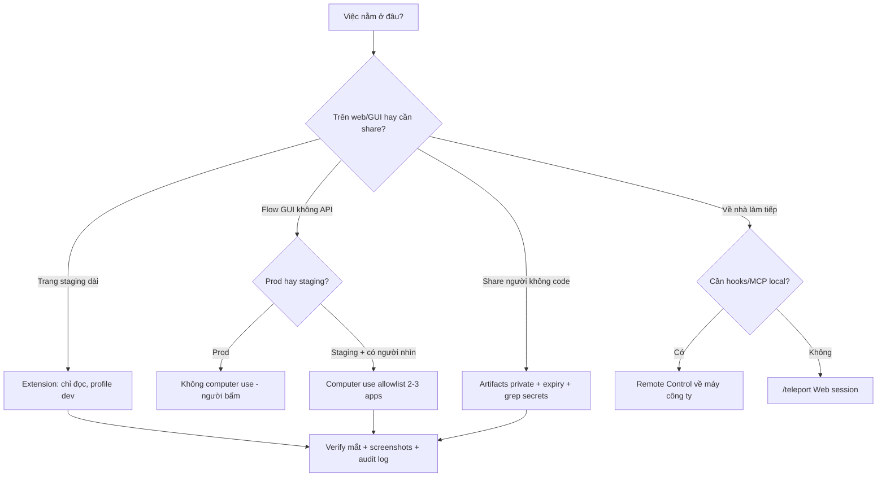

# Tips 11 — Nâng Cao Desktop & Web: Extension, Computer Use, Artifacts, Remote, Voice

> Chrome extension nối browser với session, computer use cho Claude bấm máy hộ (Pro/Max + guardrails),
> artifacts publish output thành trang web private interactive, remote control vs web sessions khác nhau ở đâu,
> voice dictation nói thành prompt. Mỗi mục: cần plan gì, bật ở đâu, rủi ro & giới hạn.

## Mục lục

- [1. Bản đồ 5 tính năng (plan + bật ở đâu + rủi ro 1 dòng)](#1-bản-đồ-5-tính-năng-plan--bật-ở-đâu--rủi-ro-1-dòng)
- [2. Chrome extension: browser nối session](#2-chrome-extension-browser-nối-session)
- [3. Computer use: Claude bấm máy hộ (Pro/Max + guardrails)](#3-computer-use-claude-bấm-máy-hộ-promax--guardrails)
- [4. Artifacts: publish output thành trang web private interactive](#4-artifacts-publish-output-thành-trang-web-private-interactive)
- [5. Remote Control vs Web sessions](#5-remote-control-vs-web-sessions)
- [6. Voice dictation: nói thành prompt](#6-voice-dictation-nói-thành-prompt)
- [7. Ví dụ copy-paste: 3 ca dùng thật](#7-ví-dụ-copy-paste-3-ca-dùng-thật)
- [8. Walkthrough: incident timeline từ log tới trang share (30 phút)](#8-walkthrough-incident-timeline-từ-log-tới-trang-share-30-phút)
- [9. Bảng tra nhanh: việc → tính năng → plan → rủi ro](#9-bảng-tra-nhanh-việc--tính-năng--plan--rủi-ro)
- [10. 7 pitfalls desktop/web vẫn dính](#10-7-pitfalls-desktopweb-vẫn-dính)
- [11. Bài tập](#11-bài-tập)
- [12. Tham khảo chéo](#12-tham-khảo-chéo)

---

## 1. Bản đồ 5 tính năng (plan + bật ở đâu + rủi ro 1 dòng)

| Tính năng | Cần plan gì | Bật ở đâu | Rủi ro 1 dòng |
|---|---|---|---|
| Chrome extension | Pro/Max/Console (tùy bản) | Chrome Web Store → nối session | Đọc nhầm tab banking/mail → chỉ bật ở profile dev |
| Computer use | Pro/Max (không có ở API-only/Bedrock) | Desktop app settings → permissions | Bấm nhầm nút xóa/deploy → allowlist app + giám sát |
| Artifacts publish | Pro/Max/Console | Session → Share/Publish private | Link lọt ra ngoài → private + expiry + không secrets |
| Remote Control / Web sessions | Subscription (cloud) | claude.ai sessions / `/teleport` | Cloud ≠ local (hooks/MCP không theo) |
| Voice dictation | Mọi plan (mic máy) | OS + session mic button | Transcript sai từ khóa → gõ lại tên file/hàm |

> Quy tắc: **chưa rõ plan + chỗ bật thì gõ `/` trong session và mở settings — đừng tin memory.**

---

## 2. Chrome extension: browser nối session

### Là gì, khi nào dùng?

Extension nối tab browser với Claude session: đọc trang đang mở, trích form/log, thao tác web lặp (fill form test,
so sánh UI sau deploy). Dùng khi việc nằm trên web (dashboard, docs nội bộ, trang staging) mà copy-paste tay thì lâu.

```bash
# Bật (3 bước):
# 1. Cài extension từ Chrome Web Store (profile Chrome dev riêng — không phải profile banking)
# 2. Mở extension → Connect → đăng nhập đúng tài khoản Claude (Pro/Max/Console)
# 3. Trong Claude Code session: gõ /ide hoặc settings → thấy browser-tab connected
```

### 3 việc hợp + 3 việc cấm

- Hợp: đọc trang staging dài → tóm tắt; fill form test lặp 20 lần; so sánh UI trước/sau deploy (kèm screenshot).
- Cấm: tab banking/mail/private; trang có secrets (token hiện trên màn hình); bấm nút thanh toán/xóa production.

```bash
# Prompt mẫu (copy-paste):
"Đọc tab staging đang mở (orders page), liệt kê 5 orders fail sáng nay: id + lỗi + 1 dòng guess. Không bấm nút gì, chỉ đọc."
# → verify: đối chiếu 2 orders đầu bằng mắt trước khi tin cả 5
```

### Rủi ro & giới hạn

- Tab nhầm: extension đọc đúng tab đang focus — focus nhầm tab mail là lộ. Fix: profile Chrome dev riêng, chỉ mở tabs việc.
- Trang dynamic (infinite scroll, auth hết hạn): đọc thiếu. Fix: scroll/load xong mới hỏi, auth lại rồi mới trích.
- Không thay `curl`/Playwright MCP cho scrape định kỳ — extension cho việc tay, pipeline thì dùng MCP/CI.

---

## 3. Computer use: Claude bấm máy hộ (Pro/Max + guardrails)

### Là gì, cần gì?

Computer use cho Claude nhìn màn hình + bấm chuột/gõ phím hộ: mở app, click qua flow, chụp lỗi GUI.
Cần **Pro/Max** (không có ở API-key-only, Bedrock/AWS/GCP thường vắng), bật trong **Desktop app settings**,
chạy tốt nhất trên máy phụ/máy ảo — không phải máy đang chứa secrets production.

```bash
# Bật:
# Desktop app → Settings → Computer use → Enable → cấp Accessibility/Screen Recording (macOS)
# → allowlist: chỉ cho 2-3 apps việc (Terminal staging, Chrome dev) — cấm Finder banking, password manager

# Kiểm tra trong session:
/
# → thấy computer-use commands mới dùng (không thấy = plan/provider bạn vắng)
```

### Guardrails bắt buộc (4 lớp)

```text
1. Máy: chạy trên máy ảo/phụ hoặc user riêng — không phải máy chính chứa SSH prod.
2. Allowlist app: chỉ Chrome-dev + Terminal-staging. Cấm click ngoài allowlist.
3. Giám sát: bạn nhìn màn hình khi nó bấm (không đi cà phê khi nó đang bấm).
4. Phạm vi: chỉ môi trường staging/test. Production thì xem thôi, bấm thì người bấm.
```

```bash
# Prompt mẫu có guardrails (copy-paste):
"Mở Chrome-dev, vào staging.acme.test/orders, chụp screenshot 5 orders fail. Chỉ đọc + chụp, KHÔNG bấm nút Refund/Delete/Cancel. Xong dừng và báo."
# → verify: xem screenshots có đủ 5 không, có nút nào bị bấm nhầm không (check audit log staging)
```

### Rủi ro & giới hạn

- Bấm nhầm không undo được (xóa, refund, deploy). Fix: staging-only + allowlist + người giám sát.
- App update UI là flow gãy (nút đổi chỗ). Fix: viết steps theo intent ("nút Refund trong row order") + screenshot verify mỗi bước.
- Chậm + tốn tokens (mỗi step 1 screenshot). Fix: chỉ dùng khi không còn API/CLI nào làm được (API > CLI > computer use).

---

## 4. Artifacts: publish output thành trang web private interactive

### Là gì, khi nào dùng?

Artifacts biến output (code, doc, chart, timeline) thành **trang web private interactive** share được: người nhận mở link,
bấm/lọc/tìm mà không cần chạy repo. Dùng khi cần share cho người không code (PM, on-call, khách): incident timeline,
audit report, prototype UI, dashboard mini.

```bash
# Publish (trong session hỗ trợ artifacts):
# 1. Nhờ Claude render artifact (html/react single-file, data inline, không gọi backend lạ)
# 2. Bấm Share/Publish → chế độ Private + đặt expiry (7 ngày) → copy link
# 3. Gửi link + ghi chú "data tới 10:00 04/10, không chứa secrets"
```

### Ví dụ copy-paste: incident timeline (ca dùng thật)

```bash
# Prompt mẫu (copy-paste):
"Từ deploy.log + alerts.txt, render artifact incident timeline 02/10: trục giờ 14:00-16:00, mỗi event 1 card (giờ + service + lỗi + link run), filter theo service, không hiện secrets/token. Publish private, expiry 7 ngày."
```

```html
<!-- Khung artifact timeline (Claude sinh — bạn duyệt trước khi publish): -->
<!-- timeline.html: <header>Incident 02/10 (14:00-16:00)</header> -->
<!-- <filters> service: [api|worker|db] </filters> -->
<!-- <cards> mỗi card: time + service + error + run link </cards> -->
<!-- <footer>Data tới 16:05 · Không secrets · Expiry 7 ngày</footer> -->
```

> Kết quả: on-call mở link thấy ngay deploy 14:32 → api 5xx 14:35 → rollback 15:50. Không ai phải grep log 2000 dòng.

### Rủi ro & giới hạn

- Link lọt ra ngoài + chứa secrets = lộ. Fix: private + expiry ngắn + grep secrets trước publish (`grep -ri "sk-\|token\|password"`).
- Data cũ (publish 1 lần, log chạy tiếp). Fix: ghi rõ "data tới giờ X" + republish khi có diễn biến.
- Artifact interactive nặng (chart 10K rows inline). Fix: tổng hợp trước (top 20), raw log để link, không inline hết.

---

## 5. Remote Control vs Web sessions

### Khác nhau ở đâu?

| Khía cạnh | Remote Control (điều khiển máy mình từ xa) | Web sessions (session chạy trên cloud) |
|---|---|---|
| Chạy ở đâu | Máy bạn (local), bạn điều khiển từ xa (điện thoại/máy khác) | Cloud claude.ai, không phải máy bạn |
| Thấy gì | Thấy đúng repo/hooks/MCP local | Chỉ thấy những gì sync lên cloud |
| Bật ở đâu | Desktop/mobile app → Remote Control → pair | claude.ai → sessions/new hoặc `/teleport` từ local |
| Cần plan | Pro/Max (tùy bản) | Subscription (không phải API-only) |
| Hợp khi | Về nhà làm tiếp máy công ty, ra quán check job | Việc nhẹ, không cần hooks/MCP local, share link |
| Rủi ro | Mất điện thoại = mất điều khiển → khóa + revoke | Quên cloud ≠ local: hooks/MCP local không theo |

```bash
# Remote Control (về nhà làm tiếp):
# Desktop công ty: Enable Remote Control → pair với điện thoại
# → từ nhà: mở app → thấy đúng session/repo công ty (hooks/MCP còn nguyên)

# Web session (việc nhẹ, share):
# Local: /teleport (đẩy session lên cloud) → về nhà mở claude.ai tiếp
# → check trước: việc này có cần hooks/MCP local không? Cần thì ở lại Remote, không thì Web đủ
```

### Rủi ro & giới hạn chung

- Cloud ≠ local (pitfall #9 Tips 10): config/hooks/MCP/secrets local không tự lên cloud. Cái gì cần trên cloud thì cấu hình cloud-scope + test trên cloud trước.
- Pair/device lạ: revoke ngay khi mất máy, kiểm tra sessions đang mở (`/teleport` list) rồi kill cái lạ.
- Web session không thay CI: việc định kỳ thì routines/schedule, việc nặng thì local + computer use.

---

## 6. Voice dictation: nói thành prompt

### Là gì, khi nào dùng?

Nói → thành text prompt trong session (mic button hoặc phím OS). Hợp khi đang đi bộ, tay bận, hoặc brainstorm dài
nói nhanh hơn gõ. Không phải kênh discuss như `/radio` — đây là **nhập liệu**.

```bash
# Bật:
# macOS: System Settings → Keyboard → Dictation → Enable (bấm Fn×2 để nói)
# Session: bấm mic button trong input → nói → kiểm tra transcript → Enter

# Prompt nói mẫu (ngắn, 1 ý 1 lần):
"compact giữ plan chấm md phase hai, bỏ log test cũ"
# → kiểm tra transcript ra đúng "plan.md phase 2" mới Enter (mục pitfalls)
```

### Rủi ro & giới hạn

- Transcript sai từ khóa (plan.md → "plan chấm md", `feat/my-main-fix` → "fit my main fix"). Fix: tên file/hàm/branch luôn gõ tay, chỉ nói phần tiếng Việt mô tả.
- Ồn + mic mở = lệnh nhầm. Fix: nói ở chỗ yên, transcript hiện ra đọc lại 3 giây mới Enter.
- Voice không thay review: nói nhanh thì càng phải verify (`/diff` + test) vì prompt nói thường lỏng hơn prompt gõ.

---

## 7. Ví dụ copy-paste: 3 ca dùng thật

### Ca 1 — Extension + artifacts: staging fail → trang share cho PM (15 phút)

```bash
# 1. Extension đọc staging (chỉ đọc):
"Đọc tab staging orders, liệt kê 5 fail sáng nay: id + lỗi."
# 2. Render + publish private:
"Render artifact timeline 5 orders này (giờ + id + lỗi + link), publish private expiry 7 ngày."
# 3. Gửi PM link + 3 dòng tóm tắt. Verify: mở link ở chế độ ẩn danh (phải hỏi login/không public).
```

### Ca 2 — Computer use staging-only có giám sát (20 phút)

```bash
"Mở Chrome-dev staging.acme.test, chụp 3 screenshots flow checkout (cart → pay → success). Chỉ đọc/chụp, không bấm Pay thật. Mỗi bước dừng 2s cho tôi nhìn."
# → ngồi nhìn nó bấm. Xong: screenshots đủ 3? Có click lạ không? Audit log staging sạch?
```

### Ca 3 — Voice + teleport: về nhà làm tiếp không mất mạch (10 phút)

```bash
# Ở công ty (nói, kiểm tra transcript):
"export conversation ra file, tóm tắt 5 bullets phase hiện tại"
# → /export + kiểm tra file
# Đẩy lên cloud:
/teleport
# → về nhà mở claude.ai: việc nhẹ làm trên web, việc cần hooks local thì remote về máy công ty
```

---

## 8. Walkthrough: incident timeline từ log tới trang share (30 phút)

**Phút 0–5 (thu log gọn):**

```bash
# Extension hoặc local: lấy deploy.log + alerts.txt 02/10 14:00-16:00
grep -h "ERROR\|FAIL\|5xx\|rollback\|deploy" deploy.log alerts.txt | head -50
# → 50 dòng core, không paste 2000 dòng vào session
```

**Phút 5–15 (render artifact):**

```bash
"Từ 50 dòng này, render artifact timeline: trục giờ, filter service, mỗi card giờ+service+lỗi+link run, không secrets."
# → duyệt artifact: giờ đúng? service đủ 3? grep secrets trước publish
grep -ri "sk-\|Bearer\|password" artifact.html; echo "secrets=$?"
```

**Phút 15–20 (publish private):**

```bash
# Share → Private → expiry 7 ngày → copy link
# Mở link ở trình duyệt ẩn danh: phải private (không public), data ghi "tới 16:05"
```

**Phút 20–30 (share + retro):**

```bash
# Gửi on-call: link + 3 bullets (root cause guess + rollback 15:50 + action tiếp)
# Retro 1 dòng team log: "incident 02/10: deploy 14:32 → 5xx 14:35 → rollback 15:50 (link artifact)"
```

> Ghi lại link + expiry vào incident doc — hết 7 ngày mà cần thì republish, không để link chết trôi.

---

## 9. Bảng tra nhanh: việc → tính năng → plan → rủi ro

| Việc | Tính năng | Plan/bật | Rủi ro nhớ 1 dòng |
|---|---|---|---|
| Đọc/tóm tắt trang staging | Chrome extension | Pro/Max, Chrome dev profile | Tab nhầm → profile dev riêng |
| Bấm flow GUI không có API | Computer use | Pro/Max, Desktop allowlist | Bấm nhầm prod → staging-only + giám sát |
| Share timeline/report cho người không code | Artifacts publish | Pro/Max/Console, private+expiry | Lộ secrets/link → grep + expiry |
| Về nhà làm tiếp máy công ty | Remote Control | Pro/Max, pair device | Mất máy → revoke + kill session lạ |
| Việc nhẹ, share link, không cần local | Web sessions/`/teleport` | Subscription cloud | Cloud ≠ local → test cloud trước |
| Nói thay gõ khi bận tay | Voice dictation | Mọi plan, mic OS | Sai từ khóa → tên file gõ tay |
| Hỏi nhanh không bẩn mạch | `/radio`/`/btw` | Tùy provider (radio gated) | Radio vắng → fallback btw |

---

## 10. 7 pitfalls desktop/web vẫn dính

1. **Extension ở profile chính (lẫn banking/mail).** Đọc nhầm tab private. Fix: profile Chrome dev riêng.
2. **Computer use thẳng production.** 1 click refund/xóa không undo. Fix: staging-only + allowlist + ngồi nhìn.
3. **Artifact public + chứa secrets.** Link share + token inline. Fix: private + expiry + grep secrets trước publish.
4. **Quên cloud ≠ local.** Web session thiếu hooks/MCP, tưởng bug. Fix: test cloud trước, cần local thì Remote.
5. **Voice transcript sai mà Enter luôn.** "plan chấm md" thành prompt rác. Fix: đọc transcript 3s, tên file gõ tay.
6. **Computer use không verify (tin screenshots).** Bấm thiếu bước mà không biết. Fix: screenshot mỗi bước + audit log.
7. **Remote session treo không kill.** Máy mất + session mở. Fix: list sessions (`/teleport`), kill lạ, revoke device.

**Checklist desktop/web mỗi tháng:**

- [ ] Extension còn ở profile dev? Tabs việc gọn?
- [ ] Computer use allowlist còn đúng 2–3 apps? Lần bấm prod nào suýt xảy ra?
- [ ] Artifacts links nào hết expiry? Secrets nào lọt? (grep 1 lần)
- [ ] Cloud sessions nào còn mở? Kill cái không dùng, revoke device lạ.
- [ ] Voice: tuần này transcript sai mấy lần? Từ khóa nào phải gõ tay?

---

## 11. Bài tập

**Bài 1 (15 phút — extension):**

1. Tạo profile Chrome dev riêng, cài extension, connect đúng tài khoản.
2. Đọc 1 trang staging dài, nhờ tóm tắt 5 bullets. Đối chiếu 2 bullets đầu bằng mắt.
3. Thử 1 trang auth hết hạn — ghi lại hành vi (đọc thiếu ở đâu?) để lần sau biết.

**Bài 2 (20 phút — artifacts):**

1. Lấy 1 log/report thật, render artifact timeline/table (private, expiry 7 ngày).
2. Grep secrets trước publish. Mở link ở ẩn danh kiểm tra private.
3. Gửi 1 đồng nghiệp không code — họ hiểu trong 2 phút không? Sửa tới khi hiểu.

**Bài 3 (20 phút — computer use + voice + remote):**

1. Computer use staging-only 1 flow 3 bước có giám sát (mục 7 ca 2). Ghi lại 1 chỗ suýt bấm nhầm.
2. Nói 3 prompts bằng voice, đếm transcript sai mấy lần. Quy ước: từ khóa nào luôn gõ tay?
3. `/teleport` 1 session lên cloud, liệt kê cái gì thiếu (hooks/MCP nào không theo?) — viết 3 dòng note cloud-vs-local.

> Đạt: sau 1 tháng, share incident/report bằng link private thay vì paste log 2000 dòng + không có cú bấm nhầm prod nào.

---

### 11.5. Thuật ngữ mới (nôm na + analogie + ví dụ + verify)

| Thuật ngữ | Nôm na 1 câu | Analogie | Ví dụ kỹ thuật thật | Cách verify |
|---|---|---|---|---|
| Chrome extension nối tab | Cho Claude đọc tab đang mở thay vì copy-paste. | Như mời thợ tới tận bếp xem nồi thay vì tả bằng miệng. | `Đọc tab staging orders, liệt kê 5 fail: id + lỗi. Chỉ đọc, không bấm` | Đối chiếu 2 orders đầu bằng mắt; tab focus đúng, profile dev riêng. |
| Computer use (bấm hộ) | Claude nhìn màn hình + bấm chuột hộ việc không API. | Như nhờ người bấm thang máy hộ khi tay xách đồ — phải đứng nhìn. | Staging-only, allowlist Chrome-dev + Terminal-staging, ngồi nhìn từng bước | Screenshots đủ 3 bước + audit log staging không có click lạ. |
| Artifacts private + Remote/Web | Biến output thành trang share riêng; remote là khiển máy mình, web là máy cloud. | Như in báo cáo (artifacts) + điều khiển TV từ xa (remote) vs xem TV ở quán (web). | Publish private expiry 7 ngày; `/teleport` lên cloud vs Remote Control về máy công ty | Mở link ẩn danh phải private; web thiếu hooks/MCP → cần local thì dùng Remote. |

### 11.6. Mermaid: chọn tính năng desktop/web



Giải thích:

1. **A→B:** việc trên web/GUI/share/xa nhà thì mới cần desktop/web.
2. **B→C:** đọc/tóm tắt/so sánh UI → extension, cấm tab banking/mail + nút thanh toán/xóa.
3. **D→F:** computer use chỉ staging, allowlist, giám sát, steps theo intent + screenshot mỗi bước.
4. **B→G:** timeline/report → artifacts private + expiry 7 ngày + `grep sk-/Bearer/password` trước publish.
5. **H→I/J:** cần local → Remote; việc nhẹ → Web; test cloud trước vì cloud ≠ local.

### 11.7. Bảng so sánh có cột Hiểu nôm na + Ví dụ

| Tính năng | Hiểu nôm na | Ví dụ |
|---|---|---|
| Extension | Kính lúp đọc trang hộ | Đọc staging orders dài → 5 bullets id+lỗi |
| Computer use | Tay giả bấm hộ khi không còn API/CLI | Chụp 3 screenshots checkout staging, không bấm Pay thật |
| Artifacts | In poster share cho người không code | Timeline 14:00-16:00 filter service, data tới 16:05 |
| Remote vs Web | Điều khiển bếp nhà mình từ xa vs nấu bếp quán | Remote giữ hooks/MCP; Web nhẹ + share link |

**Kỳ vọng thấy gì:**

```bash
grep -h "ERROR\|FAIL\|5xx\|rollback\|deploy" deploy.log alerts.txt | head -50
grep -ri "sk-\|Bearer\|password" artifact.html; echo "secrets=$?"
```

> Kỳ vọng thấy gì: 50 dòng core thay vì 2000 dòng; `secrets=1` (không match, an toàn publish); mở link ẩn danh phải private + ghi `data tới 16:05 + expiry 7 ngày`.

### 11.8. Before/After

**Before:** `Copy-paste log 2000 dòng vào chat + bấm prod trực tiếp + share link public chứa token` → Kết quả dở: context nổ, bấm nhầm không undo, lộ secrets.

**After:**

```bash
# 1. Extension chỉ đọc:
"Đọc tab staging orders, liệt kê 5 fail: id + lỗi. Không bấm gì."
# 2. Render + publish:
"Render timeline 5 orders (giờ+id+lỗi+link), publish private expiry 7 ngày, không secrets."
```

> Kết quả tốt + Kỳ vọng: PM mở link 2 phút hiểu (deploy 14:32 → 5xx 14:35 → rollback 15:50); voice nói thì transcript check 3s, tên file gõ tay.

### 11.9. Hiểu nhầm thường gặp

| Hiểu nhầm | Sự thật |
|---|---|
| Extension thay được `curl`/Playwright pipeline | Extension cho việc tay; scrape định kỳ phải MCP/CI |
| Computer use tin screenshots là đủ | Bấm thiếu bước không biết; phải screenshot mỗi bước + audit log |
| Cloud = local | Hooks/MCP/secrets local không lên cloud; cấu hình cloud-scope + test trước |

## 12. Tham khảo chéo

- Lệnh & bài liên quan:
  - [../01-huong-dan-su-dung/commands/auth-settings/ide/README.md](../01-huong-dan-su-dung/commands/auth-settings/ide/README.md) — nối IDE/browser với session
  - [../01-huong-dan-su-dung/commands/auth-settings/teleport/README.md](../01-huong-dan-su-dung/commands/auth-settings/teleport/README.md) — đẩy session lên cloud
  - [../01-huong-dan-su-dung/commands/code-repo/radio/README.md](../01-huong-dan-su-dung/commands/code-repo/radio/README.md) — kênh discuss realtime
  - [../01-huong-dan-su-dung/commands/auth-settings/mobile/README.md](../01-huong-dan-su-dung/commands/auth-settings/mobile/README.md) — điều khiển từ điện thoại
  - [../01-huong-dan-su-dung/commands/session-context/export/README.md](../01-huong-dan-su-dung/commands/session-context/export/README.md) — xuất conversation trước teleport/clear
  - [../01-huong-dan-su-dung/04-slash-commands-toan-tap.md](../01-huong-dan-su-dung/04-slash-commands-toan-tap.md) — index 64 lệnh, gõ `/` kiểm tra availability
  - [../01-huong-dan-su-dung/10-permissions-modes-availability.md](../01-huong-dan-su-dung/10-permissions-modes-availability.md) — availability theo plan/provider
  - [Tips 10](./10-debugging-power-moves.md) — cloud ≠ local, debug L1→L4 khi desktop/web lỗi

> Mẹo 1 dòng: _extension profile dev riêng, computer use staging-only có người nhìn, artifacts private + expiry + không secrets, cloud thì test trước khi tin._
