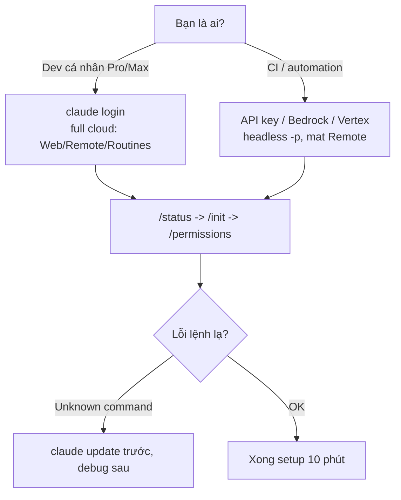

# FAQ 01 — Tài khoản, pricing & cài đặt

> **Bài này cho ai:** bạn cần trả lời 3 câu về Claude Code — cần tài khoản gì, tốn bao nhiêu, cài đặt sao cho sạch (hoặc đang phải dọn 2 bản cài song song).
> **Cần gì trước:** mở được terminal; máy có `gh` CLI thì làm luôn bước `/web-setup`, không có thì bỏ qua.
> **Đọc xong bạn làm được:**
> - Chọn đúng đường vào (subscription hay API key), biết gói nào có Claude Code và giá từng gói.
> - Cài đúng 1 bản, phát hiện và dọn duplicate install bằng 4 lệnh.
> - Fix `Unknown command` theo thứ tự update trước, debug sau, tra được từng lệnh cần bản nào.
> - Setup 5 lệnh đầu cho repo mới, biết lúc nào `/init` lúc nào copy `templates/CLAUDE.md`.
> **Thời gian:** ~15 phút

## Thuật ngữ dùng trong bài này

Đọc bảng này trước khi vào mục 1 — mọi thuật ngữ Anh trong bài đều được giải thích ở đây.

| Thuật ngữ | Hiểu nôm na là gì | Ví dụ thấy ngay |
|---|---|---|
| Subscription | Gói trả tiền tháng của claude.ai (Pro/Max/Team) — đăng nhập bằng tài khoản, không dán key | `claude login` → browser mở trang đăng nhập |
| API key | Chuỗi `sk-ant-...` của Anthropic Console, trả tiền theo tokens thật dùng | `export ANTHROPIC_API_KEY="sk-ant-xxxx"` |
| Provider | Nơi model chạy: Anthropic trực tiếp (Sub/Console) hay qua cloud khác (Bedrock, GCP, Foundry) | `/status` hiện provider đang dùng |
| Native binary | Bản cài chính chủ tải thẳng từ Anthropic, update bằng `claude update` | `curl -fsSL https://claude.ai/install.sh \| bash` |
| Version floor | Bản tối thiểu phải có để lệnh tồn tại — bản cũ gõ vào là `Unknown command` | `/cd` cần ≥2.1.169 |
| Headless | Chạy Claude không cần người ngồi gõ, dành cho CI/scripts | `claude -p "hi"` |

## Mục lục

- [Sơ đồ nhanh (nhìn 30 giây là nhớ)](#sơ-đồ-nhanh-nhìn-30-giây-là-nhớ)
- [Bảng tổng hợp: chọn đường vào nhanh](#bảng-tổng-hợp-chọn-đường-vào-nhanh)
- [1. Cần tài khoản gì để dùng Claude Code?](#1-cần-tài-khoản-gì-để-dùng-claude-code)
- [2. Provider: Sub / Console / Bedrock / GCP / Foundry khác nhau gì?](#2-provider-sub--console--bedrock--gcp--foundry-khác-nhau-gì)
- [3. Các mặt Web / Mobile / Slack / Routines / Remote vì sao bắt buộc claude.ai sign-in?](#3-các-mặt-web--mobile--slack--routines--remote-vì-sao-bắt-buộc-claudeai-sign-in)
- [4. Cài đặt thế nào cho sạch: native binary vs Homebrew vs npm?](#4-cài-đặt-thế-nào-cho-sạch-native-binary-vs-homebrew-vs-npm)
- [5. Duplicate install (2 bản Claude song song) — phát hiện và dọn?](#5-duplicate-install-2-bản-claude-song-song--phát-hiện-và-dọn)
- [6. claude login/logout vs /login, /logout, /status — dùng cái nào?](#6-claude-loginlogout-vs-login-logout-status--dùng-cái-nào)
- [7. claude update và version floor: lệnh lạ 90% là version cũ](#7-claude-update-và-version-floor-lệnh-lạ-90-là-version-cũ)
- [8. Bắt đầu repo mới: 5 lệnh setup đầu repo là gì?](#8-bắt-đầu-repo-mới-5-lệnh-setup-đầu-repo-là-gì)
- [9. Project mới tinh thì copy templates/CLAUDE.md thế nào?](#9-project-mới-tinh-thì-copy-templatesclaudemd-thế-nào)
- [10. Báo lỗi cho Anthropic thế nào (/bug)?](#10-báo-lỗi-cho-anthropic-thế-nào-bug)
- [Vẫn lỗi thì sao? (thứ tự debug chuẩn)](#vẫn-lỗi-thì-sao-thứ-tự-debug-chuẩn)
- [Tham khảo chéo](#tham-khảo-chéo)

---

## Sơ đồ nhanh (nhìn 30 giây là nhớ)



## Bảng tổng hợp: chọn đường vào nhanh

| Bạn là ai | Tài khoản cần | Cài thế nào | Lệnh đầu tiên |
|---|---|---|---|
| Dev cá nhân có Pro/Max | Subscription Claude (Pro/Max) | Native binary + `claude login` | `claude`, rồi `/status` |
| Dev công ty dùng API | Anthropic Console API key | Native binary + env `ANTHROPIC_API_KEY` | `claude -p "hi"` test |
| Team AWS (Bedrock) | AWS creds + model access | Native + config provider Bedrock | `/status` check provider |
| Team GCP (Vertex) | GCP project + Agent Platform | Native + config GCP | `/status` check provider |
| Dùng Web/Mobile/Slack/Routines/Remote/Chrome | Bắt buộc `claude.ai` sign-in | Không dùng API-key-only | `/web-setup` rồi `claude --cloud` |
| Repo mới tinh | Bất kỳ loại trên | `cd repo && claude` | `/init → /memory → /mcp → /permissions` |

---

## 1. Cần tài khoản gì để dùng Claude Code?

> **Hỏi ngắn gọn:** cài Claude Code thì phải mua gói gì, hay tài khoản thường cũng dùng được?
>
> **Trả lời 1 câu:** Không bắt buộc mua gói — dùng tài khoản claude.ai (Pro/Max/Team/Enterprise) hoặc API key Anthropic Console; gói Free thì không có Claude Code.

**Giải thích:** Hai đường vào khác nhau ở cách trả tiền và tính năng:

- **Subscription (Pro / Max / Team / Enterprise):** đăng nhập bằng tài khoản `claude.ai`. Dùng chung quota subscription. Hợp cho dev cá nhân và team đã mua gói Claude.
- **API key (Anthropic Console):** `sk-ant-...` trả theo usage. Hợp cho CI, automation, team muốn tách bill theo key.

Terminal CLI + VS Code extension hỗ trợ thêm **third-party providers**: Bedrock, GCP Agent Platform (Vertex), Foundry... — model chạy qua cloud của bạn thay vì trực tiếp Anthropic.

Giá gói subscription (tra 07/10/2026, nguồn [WRITING-STYLE — Phần B](../WRITING-STYLE.md#phần-b--dữ-kiện-chuẩn-làm-tròn-thời-gian-07102026)):

| Gói | Giá /tháng | Claude Code? | Ghi chú |
|---|---|---|---|
| Free | $0 | ❌ | Không có Claude Code |
| Pro | $17 (trả trước năm) hoặc $20 | ✅ | Ít nhất 5× Free theo phiên 5 giờ |
| Max 5x | $100 | ✅ | 5× Pro theo phiên 5 giờ |
| Max 20x | $200 | ✅ | 20× Pro theo phiên 5 giờ |
| Team (Standard) | $20 (trả trước năm) hoặc $25 | ✅ | Tối thiểu 2 ghế, tối đa 150 ghế |
| Team (Premium) | $100 (trả trước năm) hoặc $125 | ✅ | 5× Standard |

Hạn mức tính theo **phiên 5 giờ cuộn** + hạn tuần; chat web và Claude Code dùng chung 1 hạn mức.

Trả theo API key thì giá tính theo model (USD / 1 triệu tokens): **Fable 5.1** $10/$50 · **Opus 5.5** $4/$20 (đọc cache $0.20) · **Sonnet 5.5** $2/$10 · **Haiku 4.5** $1/$5 với context 200K.

**Kiểm tra nhanh:**

```bash
# Cách 1: subscription (khuyên dùng cho dev tay)
claude login
# → mở browser, sign-in claude.ai, quay lại terminal

# Cách 2: API key (khuyên dùng cho CI/máy phụ)
export ANTHROPIC_API_KEY="sk-ant-xxxx"
claude -p "ping" --output-format json
```

Bạn có Pro cá nhân + công ty cấp Bedrock → máy dev `claude login` (Pro), CI dùng Bedrock creds — tách 2 môi trường, không lẫn bill.

**Khi nào áp dụng:** luôn quyết định NGAY từ đầu, vì nó khóa luôn câu 3 (có dùng được Web/Routines không).

**Đào sâu:** [Bài 01 — cài đặt và xác thực](../01-huong-dan-su-dung/01-cai-dat-va-xac-thuc.md) · [FAQ 10 — CI, SDK, routines, Web](10-ci-sdk-routines-web.md) · [thứ tự debug cuối file](#vẫn-lỗi-thì-sao-thứ-tự-debug-chuẩn)

---

## 2. Provider: Sub / Console / Bedrock / GCP / Foundry khác nhau gì?

> **Hỏi ngắn gọn:** bên mình đang chạy AWS hay GCP, Claude Code dùng được không và thiếu gì so với trả tiền thẳng Anthropic?
>
> **Trả lời 1 câu:** Xài được — mọi provider đều chạy đủ terminal + IDE, nhưng chỉ subscription claude.ai mới có Web/Routines/Remote.

**Giải thích:** Không phải provider nào cũng có đủ tính năng. Bảng dưới là bản đồ "đường nào đi được tới đâu":

| Tính năng | Sub (claude.ai) | Console API | Bedrock | GCP/Vertex | Foundry |
|---|---|---|---|---|---|
| Terminal + IDE cơ bản | ✅ | ✅ | ✅ | ✅ | ✅ (giới hạn) |
| Web / Mobile / Desktop-cloud | ✅ | ❌ (cần sign-in) | ❌ | ❌ | ❌ |
| Slack / Chrome ext / Computer use / Artifacts | ✅ | ❌ | ❌ | ❌ | ❌ |
| Routines (`/schedule`) | ✅ | ❌ | ❌ | ❌ | ❌ |
| Remote (`--cloud`, teleport) | ✅ | ❌ | ❌ | ❌ | ❌ |
| CI `-p` headless | ✅ | ✅ | ✅ | ✅ | ❌ |
| ZDR (zero retention) | Enterprise qualified | Qualified accounts | Mặc định tắt gửi về Anthropic* | Mặc định tắt* | Theo MS contract |
| Telemetry gửi về Anthropic | Theo cài đặt | Theo cài đặt | Tắt mặc định | Tắt mặc định | Theo MS |

\* Xem provider docs của bạn để xác nhận; hỏi admin/contract trước khi cam kết với khách hàng (chi tiết [FAQ 09](09-bao-mat-quyen-rieng-tu.md)).

**Kiểm tra nhanh:**

```bash
/status    # dòng Provider hiện Bedrock / GCP / Anthropic — đừng đoán
```

Máy công ty có AWS creds → `/status` hiện provider `Bedrock`, session chạy bình thường; tới lúc cần `/schedule` (Routines) thì báo thiếu quyền → quay lại đường Sub ở câu 1.

**Khi nào áp dụng:** team enterprise chọn Bedrock/GCP vì compliance → chấp nhận mất Routines/Remote. Dev indie chọn Sub → được full tính năng cloud.

**Đào sâu:** [Bài 02 — từng bề mặt dùng](../01-huong-dan-su-dung/02-cac-be-mat-terminal-ide-web-desktop.md) · [FAQ 09 — bảo mật & riêng tư](09-bao-mat-quyen-rieng-tu.md) · [thứ tự debug cuối file](#vẫn-lỗi-thì-sao-thứ-tự-debug-chuẩn)

---

## 3. Các mặt Web / Mobile / Slack / Routines / Remote vì sao bắt buộc claude.ai sign-in?

> **Hỏi ngắn gọn:** mình có API key rồi mà sao mở Web hay gõ `/schedule` vẫn bảo phải đăng nhập?
>
> **Trả lời 1 câu:** Vì đó là cloud service của Anthropic — muốn dùng phải đăng nhập `claude.ai`, API key không đủ.

**Giải thích:** Các mặt Web / Mobile / Desktop-cloud / Slack / Chrome extension / Computer use / Artifacts / Routines (`/schedule`) / Remote (`--cloud`, teleport) chạy trên hạ tầng cloud của Anthropic (session persist cross-device, push branch, schedule...), nên phải gắn với identity `claude.ai`, không thể chỉ cầm API key gọi vào. API-key-only = cục model trần, thiếu lớp "session cloud".

**Kiểm tra nhanh:**

```bash
# Trong terminal đã login Sub:
claude login        # đảm bảo đã sign-in claude.ai
/status             # xem account hiện tại
/web-setup          # sync token + tạo cloud environment (cần gh CLI)
/teleport           # thử chuyển session lên cloud
```

Bạn dùng API key Console, gõ `/schedule` → báo thiếu quyền. Fix: `claude login` sang Sub rồi thử lại.

**Khi nào áp dụng:** ngay khi ai đó hỏi "sao không thấy nút cloud" — 99% là đang dùng API-key-only. Chi tiết xem [FAQ 10](10-ci-sdk-routines-web.md).

**Đào sâu:** [FAQ 10 — routines, Web, CI](10-ci-sdk-routines-web.md) · [Bài 02 — terminal/IDE/web/desktop](../01-huong-dan-su-dung/02-cac-be-mat-terminal-ide-web-desktop.md) · [thứ tự debug cuối file](#vẫn-lỗi-thì-sao-thứ-tự-debug-chuẩn)

---

## 4. Cài đặt thế nào cho sạch: native binary vs Homebrew vs npm?

> **Hỏi ngắn gọn:** nên cài Claude Code bằng cách nào, dùng brew với npm song song được không?
>
> **Trả lời 1 câu:** Có 3 đường cài nhưng chỉ nên giữ **1** — native binary.

**Giải thích:** Mỗi cách có trade-off khác nhau:

- **Native binary (khuyên dùng):** `curl .../install.sh | bash` — binary chính chủ, update nhanh, ít lỗi PATH nhất.
- **Homebrew cask:** tiện cho macOS (`brew install --cask claude-code`), nhưng version có thể chậm hơn native nửa nhịp.
- **npm (`npm i -g @anthropic-ai/claude-code`):** chỉ khi kẹt môi trường không cài được binary (VD container lạ). Dễ dính duplicate install nhất.

**Kiểm tra nhanh:**

```bash
# Cách khuyên dùng (native):
curl -fsSL https://claude.ai/install.sh | bash
claude --version

# macOS brew (thay thế, không dùng song song với native):
brew install --cask claude-code

# IDE: cài extension "Claude Code" trong VS Code / JetBrains rồi login
```

**Khi nào áp dụng:** máy mới → native. Đừng bao giờ `npm install` thêm khi đã có native.

**Đào sâu:** [Bài 01 — cài đặt và xác thực](../01-huong-dan-su-dung/01-cai-dat-va-xac-thuc.md) · [lệnh `doctor`](../01-huong-dan-su-dung/commands/knowledge-system/doctor/README.md) · [thứ tự debug cuối file](#vẫn-lỗi-thì-sao-thứ-tự-debug-chuẩn)

---

## 5. Duplicate install (2 bản Claude song song) — phát hiện và dọn?

> **Hỏi ngắn gọn:** update hoài mà lệnh mới vẫn báo `Unknown command`, kiểm tra kiểu gì?
>
> **Trả lời 1 câu:** Máy bạn đang có 2 bản Claude chạy song song — soi bằng `which -a claude` và `claude doctor`.

**Giải thích:** Triệu chứng: `which -a claude` ra 2 đường, `/status` báo version khác `claude --version`, update hoài không lên. Nguyên nhân 90% là vừa cài native vừa `npm i -g`.

**Kiểm tra nhanh:**

```bash
which -a claude
claude --version
npm ls -g @anthropic-ai/claude-code 2>/dev/null
claude doctor   # phát hiện duplicate install

# Dọn: giữ native, gỡ npm
npm uninstall -g @anthropic-ai/claude-code
hash -r
which claude    # giờ chỉ còn 1
claude update
```

`which -a` ra `/opt/homebrew/bin/claude` + `~/.nvm/.../claude` → gỡ bản npm, giữ brew/native, PATH sạch lại.

**Khi nào áp dụng:** mỗi khi update không có tác dụng hoặc lệnh mới (VD `/cd`) báo `Unknown command` dù đã update.

**Đào sâu:** [lệnh `doctor`](../01-huong-dan-su-dung/commands/knowledge-system/doctor/README.md) · [Bài 01 — cài đặt và xác thực](../01-huong-dan-su-dung/01-cai-dat-va-xac-thuc.md) · [thứ tự debug cuối file](#vẫn-lỗi-thì-sao-thứ-tự-debug-chuẩn)

---

## 6. `claude login/logout` vs `/login`, `/logout`, `/status` — dùng cái nào?

> **Hỏi ngắn gọn:** lệnh ngoài terminal với trong session khác nhau chỗ nào, đang chat thì đổi account bằng cái nào?
>
> **Trả lời 1 câu:** Ngoài terminal thì `claude login/logout`; đang trong session thì `/login`, `/logout`, `/status` — khỏi thoát ra.

**Giải thích:**

- **Ngoài terminal (shell):** `claude login` / `claude logout` — xác thực account cho CLI.
- **Trong session (đang chat với Claude):** `/login` / `/logout` / `/status` — xem và đổi account ngay trong phiên.

`/status` là lệnh "soi gương": hiện account, provider, model, version, working dirs.

**Kiểm tra nhanh:**

```bash
# Ngoài terminal:
claude login
claude logout

# Trong session:
/status
/login
/logout
```

Đang làm mà nghi sai account (bill vào key công ty thay vì Pro cá nhân) → gõ `/status`, thấy sai thì `/logout` → `/login` lại, không mất session.

**Khi nào áp dụng:** đầu mỗi máy mới, đầu mỗi session lạ, và mỗi khi bill có gì sai sai.

**Đào sâu:** [lệnh `status`](../01-huong-dan-su-dung/commands/auth-settings/status/README.md) · [lệnh `login`](../01-huong-dan-su-dung/commands/auth-settings/login/README.md) · [thứ tự debug cuối file](#vẫn-lỗi-thì-sao-thứ-tự-debug-chuẩn)

---

## 7. `claude update` và version floor: lệnh lạ 90% là version cũ

> **Hỏi ngắn gọn:** gõ `/cd` mà bị trả `Unknown command` thì phải làm sao, có nên cài đè thêm không?
>
> **Trả lời 1 câu:** Đừng cài thêm — chạy `claude update` rồi mở session mới: 90% "lệnh lạ" là do bản cũ.

**Giải thích:** Claude Code phát triển nhanh (2025–2026 đổi API liên tục). Gõ lệnh mới trên bản cũ → `Unknown command`. Quy tắc: **update trước, debug sau**. Bản mới nhất tại thời điểm viết: **v2.1.292** (phát hành 06/10/2026).

Bảng version floor hay gặp — đọc khi cần biết 1 lệnh/tính năng đòi bản nào (kiểm tra bằng `/status` + release notes); bảng đầy đủ tra ở [WRITING-STYLE — B6](../WRITING-STYLE.md#phần-b--dữ-kiện-chuẩn-làm-tròn-thời-gian-07102026):

| Lệnh / tính năng | Cần bản tối thiểu | Ghi chú |
|---|---|---|
| `/cd` | ≥2.1.169 | Bản cũ không có |
| `/verify` | ≥2.1.145 | Chạy app thật |
| `/goal` | ≥2.1.139 | Đặt mục tiêu session |
| Nút `trim` CLAUDE.md trong `/doctor` | ≥2.1.206 | Cũ hơn chỉ báo dài |
| `disable-model-invocation` chặn scheduled fire | ≥2.1.196 | Trước đó chỉ chặn tay |
| `/mcp` no-arg in text trong `-p` | ≥2.1.205 | Headless mới có |
| Full `/doctor` 6 mục | v2.x | Bản 1.x chỉ 2 mục |
| `/skill-doctor` | ≥2.1.252 | Tìm skill không dùng |
| `fable` → Fable 5.1 | ≥2.1.257 | Model mạnh nhất, chậm nhất |
| Opus 5.5 (mặc định ở hầu hết gói) | ≥2.1.280 | Từ 22/09/2026 |

**Kiểm tra nhanh:**

```bash
claude update
claude --version
# Trong session:
/status    # xem version đang chạy
```

Gõ `/cd web` → `Unknown command: /cd`. Đừng sửa config gì cả: `claude update` lên ≥2.1.169, mở session mới, gõ lại → chạy.

**Khi nào áp dụng:** mọi lỗi "lệnh không tồn tại" — luôn là bước 1 trong thứ tự debug (xem [FAQ 08](08-loi-thuong-gap-troubleshooting.md)).

**Đào sâu:** [Bài 04 — slash commands toàn tập](../01-huong-dan-su-dung/04-slash-commands-toan-tap.md) · [WRITING-STYLE — B6 lệnh theo bản](../WRITING-STYLE.md#phần-b--dữ-kiện-chuẩn-làm-tròn-thời-gian-07102026) · [FAQ 08 — lỗi thường gặp](08-loi-thuong-gap-troubleshooting.md) · [thứ tự debug cuối file](#vẫn-lỗi-thì-sao-thứ-tự-debug-chuẩn)

---

## 8. Bắt đầu repo mới: 5 lệnh setup đầu repo là gì?

> **Hỏi ngắn gọn:** vừa clone repo về, gõ `claude` xong thì làm gì tiếp?
>
> **Trả lời 1 câu:** Làm 1 lần theo thứ tự: `/init` → `/memory` → `/mcp` → tạo subagents → `/permissions`.

**Giải thích:** 5 bước theo đúng thứ tự:

1. `/init` — sinh CLAUDE.md từ codebase thật (đừng viết tay từ đầu).
2. `/memory` — tách sở thích cá nhân ra khỏi CLAUDE.md.
3. `/mcp` — gắn data ngoài repo (DB, tickets, docs...). Không có thì bỏ qua.
4. Tạo subagents — tách việc đọc ồn sang worker (xem [FAQ 07](07-subagents-teams-workflows.md)).
5. `/permissions` — dựng phanh allow/ask/deny baseline (xem [FAQ 03](03-permissions-modes.md)).

**Kiểm tra nhanh:**

```bash
cd ~/code/my-repo && claude
```

```bash
# Trong session, theo thứ tự:
/init
/memory
/mcp
/permissions
/doctor   # khám lại xem còn đỏ gì
```

Repo mới tinh (chưa có code): không có gì để `/init` quét → copy `templates/CLAUDE.md` trong tutorial này rồi sửa cho hợp stack, sau đó chạy 5 lệnh trên từ bước 2.

**Khi nào áp dụng:** mọi repo chưa từng dùng Claude Code. Team thì commit `.claude/` + `CLAUDE.md` sau bước 5 để người sau khỏi setup lại.

**Đào sâu:** [FAQ 03 — permissions & modes](03-permissions-modes.md) · [FAQ 07 — subagents & teams](07-subagents-teams-workflows.md) · [lệnh `init`](../01-huong-dan-su-dung/commands/code-repo/init/README.md) · [thứ tự debug cuối file](#vẫn-lỗi-thì-sao-thứ-tự-debug-chuẩn)

---

## 9. Project mới tinh thì copy `templates/CLAUDE.md` thế nào?

> **Hỏi ngắn gọn:** repo trống chưa có code thì `/init` ra được gì không, hay phải tự viết CLAUDE.md?
>
> **Trả lời 1 câu:** Repo trống thì `/init` chỉ sinh file chung chung — hãy copy `templates/CLAUDE.md` rồi sửa.

**Giải thích:** `/init` cần code để quét. Repo trống → nó sinh ra file chung chung. Cách ngon hơn: copy template theo stack rồi sửa 20%.

**Kiểm tra nhanh:**

```bash
ls templates/
cp templates/CLAUDE.md ./CLAUDE.md
# Mở CLAUDE.md, sửa: stack, lệnh test/lint/build, cấu trúc thư mục, quy ước branch
```

Template Node ghi `npm test`; bạn dùng `pnpm` → sửa ngay dòng đó. Sai 1 dòng này, model chạy sai lệnh cả tháng.

**Khi nào áp dụng:** `git init` vừa xong, chưa có file nào. Sau khi code lên hình (vài trăm dòng), chạy `/init` lại để nó bổ sung kiến trúc thật.

**Đào sâu:** [Bài 03 — CLAUDE.md & memory](../01-huong-dan-su-dung/03-claude-md-memory-rules.md) · [templates/](../templates/) · [thứ tự debug cuối file](#vẫn-lỗi-thì-sao-thứ-tự-debug-chuẩn)

---

## 10. Báo lỗi cho Anthropic thế nào (`/bug`)?

> **Hỏi ngắn gọn:** lỗi này chắc do Claude Code chứ không phải do mình — báo ở đâu, báo gì để họ tái hiện được?
>
> **Trả lời 1 câu:** `/bug` gói conversation thành bug report, nhưng phải kèm `/status` + `claude doctor` thì họ mới tái hiện nổi.

**Giải thích:** Gửi mỗi conversation thì team Anthropic khó tái hiện — thêm 2 thứ nữa: `/status` (account/provider/version/model) và `claude doctor` (sức khoẻ máy).

**Kiểm tra nhanh:**

```bash
# Trong session đang lỗi:
/status
/bug
```

```bash
# Ngoài terminal (paste kèm vào issue):
claude doctor
claude --version
```

```text
Tiêu đề: /mcp reconnect treo sau sleep (macOS, v2.1.x)
Mô tả: reconnect GitHub server quay 60s rồi timeout, hôm qua còn chạy.
Kèm: /status output + claude doctor output + steps (sleep → wake → /mcp → treo).
```

**Khi nào áp dụng:** khi đã đi hết thứ tự debug ([FAQ 08](08-loi-thuong-gap-troubleshooting.md)) mà vẫn lỗi, và nghi lỗi của chính Claude Code chứ không phải config của bạn.

**Đào sâu:** [lệnh `bug`](../01-huong-dan-su-dung/commands/knowledge-system/bug/README.md) · [FAQ 08 — lỗi thường gặp](08-loi-thuong-gap-troubleshooting.md) · [thứ tự debug cuối file](#vẫn-lỗi-thì-sao-thứ-tự-debug-chuẩn)

---

## Vẫn lỗi thì sao? (thứ tự debug chuẩn)

1. `/status` — xem version + account + provider (cũ → `claude update`).
2. `claude doctor` — phát hiện duplicate install, settings parse lỗi, PATH lỗi.
3. `/permissions` — xem merged rules (lỗi lạ có thể do deny ẩn).
4. `/debug` — chẩn đoán session hiện tại.
5. `/bug` — gói report gửi Anthropic (kèm `/status` + `claude doctor`).

**Kiểm tra nhanh:**

```bash
claude update && claude doctor
```

---

## Tham khảo chéo

- Lệnh liên quan:
  - [../01-huong-dan-su-dung/commands/auth-settings/status/README.md](../01-huong-dan-su-dung/commands/auth-settings/status/README.md) — soi version/account/provider
  - [../01-huong-dan-su-dung/commands/knowledge-system/doctor/README.md](../01-huong-dan-su-dung/commands/knowledge-system/doctor/README.md) — khám duplicate install, settings lỗi
  - [../01-huong-dan-su-dung/commands/auth-settings/login/README.md](../01-huong-dan-su-dung/commands/auth-settings/login/README.md) — đăng nhập trong session
  - [../01-huong-dan-su-dung/commands/knowledge-system/bug/README.md](../01-huong-dan-su-dung/commands/knowledge-system/bug/README.md) — gửi bug report
  - [../01-huong-dan-su-dung/commands/code-repo/init/README.md](../01-huong-dan-su-dung/commands/code-repo/init/README.md) — setup repo mới
  - [../01-huong-dan-su-dung/commands/model-mode/permissions/README.md](../01-huong-dan-su-dung/commands/model-mode/permissions/README.md) — dựng phanh baseline
  - [../01-huong-dan-su-dung/02-cac-be-mat-terminal-ide-web-desktop.md](../01-huong-dan-su-dung/02-cac-be-mat-terminal-ide-web-desktop.md) — lên cloud (cần sign-in)
  - [../01-huong-dan-su-dung/commands/auth-settings/teleport/README.md](../01-huong-dan-su-dung/commands/auth-settings/teleport/README.md) — chuyển session lên cloud
- Bài tổng quan:
  - [../01-huong-dan-su-dung/01-cai-dat-va-xac-thuc.md](../01-huong-dan-su-dung/01-cai-dat-va-xac-thuc.md) — cài đặt + xác thực chi tiết
  - [../01-huong-dan-su-dung/04-slash-commands-toan-tap.md](../01-huong-dan-su-dung/04-slash-commands-toan-tap.md) — tra cứu lệnh theo version
  - [../02-tips-thuc-chien/10-debugging-power-moves.md](../02-tips-thuc-chien/10-debugging-power-moves.md) — thứ tự debug chuẩn
- FAQ tiếp theo: [02-model-context-token.md](02-model-context-token.md) (chọn model + giữ context), [FAQ 08](08-loi-thuong-gap-troubleshooting.md) (bảng lỗi full).

> Mẹo 1 dòng: _update trước debug sau, giữ đúng 1 bản cài, và 5 lệnh đầu repo là init → memory → mcp → subagents → permissions._
