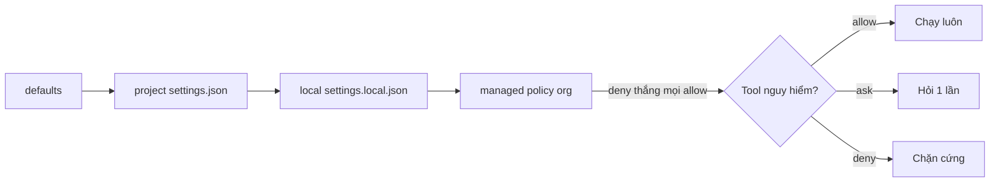

# FAQ 03 — Permissions & modes (quyền hạn, chế độ & headless)

> **Bài này cho ai:** bạn cần dựng phanh cho Claude Code, chọn permission mode đúng việc, hoặc đang kẹt deny lúc headless mà không hiểu vì sao.
> **Cần gì trước:** đã cài và đăng nhập Claude Code ([FAQ 01](01-tai-khoan-pricing-cai-dat.md)); đọc qua [bài 10 — permissions & modes](../01-huong-dan-su-dung/10-permissions-modes-availability.md) càng tốt, không bắt buộc.
> **Đọc xong bạn làm được:**
> - Dựng phanh 3 lớp allow / ask / deny ở đúng file settings và xem bản merged bằng `/permissions`.
> - Xoay 5 permission mode bằng Shift+Tab, biết lúc nào giữ `plan`, lúc nào nới `auto`, lúc nào không bao giờ mở `bypassPermissions`.
> - Chạy headless `-p` với allowlist không bị kẹt deny, viết `PreToolUse` hook deny thắng cả `bypassPermissions`.
> **Thời gian:** ~20 phút

## Thuật ngữ dùng trong bài này

Đọc bảng này trước khi vào câu 1 — mọi thuật ngữ Anh trong bài đều được giải thích ở đây.

| Thuật ngữ | Hiểu nôm na là gì | Ví dụ thấy ngay |
|---|---|---|
| Permission | Quyền Claude được tự làm việc gì mà không phải hỏi bạn | `/permissions` hiện bảng allow/ask/deny của session |
| allow / ask / deny | 3 mức quyền: tự chạy luôn / hỏi 1 câu rồi chạy / cấm hẳn | `"deny": ["Bash(rm -rf:*)"]` trong settings.json |
| Permission mode | Mức "tin tưởng" của cả session, xoay bằng Shift+Tab | `plan` chỉ đọc, `bypassPermissions` bỏ hết câu hỏi |
| Merged view | Bản rule sau khi ghép mọi file settings lại — thứ thật sự có hiệu lực | `/permissions` hiện bản merged, không hiện từng file lẻ |
| Settings file | Nơi ghi rule: `.claude/settings.json` (team), `.claude/settings.local.json` (bạn) | `cat .claude/settings.json` |
| Managed policy | Quy tắc admin công ty ép từ xa, ở nhà không gỡ được | công ty cấm `curl ... \| bash` |
| Hook | Script do chính CLI chạy khi sắp gọi tool — model không nhìn thấy nên không thể "quên" | `PreToolUse` hook chặn lệnh push lên `main` |
| Headless | Chế độ `-p` cho CI/scripts: không ai bấm Yes → mọi `ask` thành deny | `claude -p "review PR"` |
| Trust | Sự tin tưởng dành cho folder, cấp lúc mở repo; chưa tin thì hooks trong project bị bỏ qua | dialog "trust this folder" |
| Frontmatter hook | Hook khai ngay trong file subagent `.claude/agents/x.md`, ở phần đầu file | `hooks:` trong frontmatter của agent `reviewer` |

## Mục lục

- [Sơ đồ nhanh (nhìn 30 giây là nhớ)](#sơ-đồ-nhanh-nhìn-30-giây-là-nhớ)
- [Chọn đường vào nhanh](#chọn-đường-vào-nhanh)
- [Bảng tổng hợp: allow / ask / deny + 3 files + 5 modes](#bảng-tổng-hợp-allow--ask--deny--3-files--5-modes)
- [1. allow / ask / deny viết ở đâu? (/permissions alias /allowed-tools)](#1-allow--ask--deny-viết-ở-đâu-permissions-alias-allowed-tools)
- [2. Shift+Tab xoay modes thế nào? (5 modes: default → acceptEdits → plan → auto → bypass)](#2-shifttab-xoay-modes-thế-nào-5-modes-default--acceptedits--plan--auto--bypass)
- [3. Cloud có bypassPermissions không? (chỉ acceptEdits / plan, auto tùy bản, không bypass)](#3-cloud-có-bypasspermissions-không-chỉ-acceptedits--plan-auto-tùy-bản-không-bypass)
- [4. Hook vs permission rule — ai thắng? (PreToolUse deny thắng cả bypassPermissions)](#4-hook-vs-permission-rule--ai-thắng-pretooluse-deny-thắng-cả-bypasspermissions)
- [5. Rules (permission strings) có chặn được lệnh lách (binary khác, đường dẫn khác) không?](#5-rules-permission-strings-có-chặn-được-lệnh-lách-binary-khác-đường-dẫn-khác-không)
- [6. Background subagent bị deny trong -p (headless) — vì sao và fix?](#6-background-subagent-bị-deny-trong--p-headless--vì-sao-và-fix)
- [7. Frontmatter hooks của project subagent không chạy — vì sao? (trust)](#7-frontmatter-hooks-của-project-subagent-không-chạy--vì-sao-trust)
- [8. Thiết kế allowlist cho headless (-p) thế nào cho không kẹt?](#8-thiết-kế-allowlist-cho-headless--p-thế-nào-cho-không-kẹt)
- [9. 3 settings files merge thế nào? (xem merged, đừng đoán)](#9-3-settings-files-merge-thế-nào-xem-merged-đừng-đoán)
- [10. Khi nào dùng --dangerously-skip-permissions? (gần như không)](#10-khi-nào-dùng---dangerously-skip-permissions-gần-như-không)
- [Vẫn lỗi thì sao? (permissions/modes)](#vẫn-lỗi-thì-sao-permissionsmodes)
- [Tham khảo chéo](#tham-khảo-chéo)

---

## Sơ đồ nhanh (nhìn 30 giây là nhớ)



## Chọn đường vào nhanh

Đọc bảng này khi cần nhảy thẳng tới câu đúng với việc đang mắc — mỗi dòng 1 tình huống.

| Tình huống của bạn | Nhảy tới |
|---|---|
| Không biết ghi allow / deny vào file nào | [Câu 1](#1-allow--ask--deny-viết-ở-đâu-permissions-alias-allowed-tools) |
| Bấm Shift+Tab thấy hiện plan / acceptEdits mà không hiểu | [Câu 2](#2-shifttab-xoay-modes-thế-nào-5-modes-default--acceptedits--plan--auto--bypass) |
| Dùng Claude Code trên bản Web/cloud, muốn biết có bypass không | [Câu 3](#3-cloud-có-bypasspermissions-không-chỉ-acceptedits--plan-auto-tùy-bản-không-bypass) |
| Không rõ hook hay permission rule mới là thứ chặn được Claude | [Câu 4](#4-hook-vs-permission-rule--ai-thắng-pretooluse-deny-thắng-cả-bypasspermissions) |
| Đã deny `rm -rf` mà vẫn sợ model lách bằng lệnh khác | [Câu 5](#5-rules-permission-strings-có-chặn-được-lệnh-lách-binary-khác-đường-dẫn-khác-không) |
| Chạy `-p` / CI mà subagent nào cũng bị deny | [Câu 6](#6-background-subagent-bị-deny-trong--p-headless--vì-sao-và-fix) |
| Đã khai hooks trong file subagent mà nó không chịu chạy | [Câu 7](#7-frontmatter-hooks-của-project-subagent-không-chạy--vì-sao-trust) |
| Viết allowlist cho script headless sao cho không kẹt | [Câu 8](#8-thiết-kế-allowlist-cho-headless--p-thế-nào-cho-không-kẹt) |
| "Allow rồi mà sao vẫn hỏi / vẫn deny" | [Câu 9](#9-3-settings-files-merge-thế-nào-xem-merged-đừng-đoán) |
| Đang định xài `--dangerously-skip-permissions` cho máy dev | [Câu 10](#10-khi-nào-dùng---dangerously-skip-permissions-gần-như-không) |

## Bảng tổng hợp: allow / ask / deny + 3 files + 5 modes

Đọc bảng này khi cần tra nhanh 1 khái niệm: mức quyền nào, ghi ở file nào, hay mode nào đang chạy.

| Khái niệm | Tóm tắt 1 dòng | Xem ở đâu |
|---|---|---|
| `allow` | Được chạy luôn, không hỏi | `/permissions` |
| `ask` | Hỏi từng lần (mặc định cho sửa/xoá/chạy) | `/permissions` |
| `deny` | Cấm luôn, hook allow cũng không nới được | `/permissions` merged |
| Project settings `.claude/settings.json` | Share team, commit git | Team baseline |
| Local settings `.claude/settings.local.json` | Cá nhân, không commit | Sở thích + allowlist riêng |
| Managed policy (org) | Admin ép, thắng mọi cái local | Team/Enterprise |
| `default` | Hỏi như thường | Shift+Tab lần 1 |
| `acceptEdits` | Tự sửa file, lệnh vẫn hỏi | Việc sửa nhiều, chạy ít |
| `plan` | Chỉ đọc + trình plan, không sửa | Task lớn, duyệt trước |
| `auto` | Tự chạy nhiều hơn (tùy bản) | Cloud + task tin cậy |
| `bypassPermissions` | Bỏ hỏi (chỉ CI sandbox) | Không dùng máy dev |

Thứ tự merge (thắng dần): **defaults < project < local < managed**. Managed deny mà local allow → allow vô ích.

---

## 1. allow / ask / deny viết ở đâu? (`/permissions` alias `/allowed-tools`)

> **Câu hỏi:** Muốn cấm Claude chạy `rm -rf`, hay cho phép tự chạy test không cần hỏi, thì ghi rule vào đâu?
> **Trả lời 1 câu:** Ghi vào 3 chỗ (settings file + policy của org) rồi mở `/permissions` xem bản merged — đừng đoán file nào đang thắng.

**Giải thích:** Lệnh `/permissions` (alias cũ `/allowed-tools` vẫn chạy) gom rule từ 3 nơi và hiện bản merged:

- `.claude/settings.json` — team baseline, commit git (VD: deny `rm -rf`, deny `.env`).
- `.claude/settings.local.json` — cá nhân (VD: bạn hay dùng `pnpm`, allow thêm), không commit.
- Managed policy — org ép từ xa (VD: cấm `curl ... | bash`), local không gỡ được.

Ba chỗ này được ghép theo thứ tự nào thì xem [câu 9](#9-3-settings-files-merge-thế-nào-xem-merged-đừng-đoán).

**Khi nào áp dụng:** setup repo mới + mỗi khi permission deny liên tục mà không hiểu vì sao → `/permissions` trước.

**Ví dụ:** Config copy-paste (baseline Node, team dùng chung):

```json
{
  "permissions": {
    "allow": ["Read", "Glob", "Grep", "Bash(npm test:*)", "Bash(npm run lint:*)", "Bash(git status:*)", "Bash(git diff:*)"],
    "ask": ["Edit", "Write", "Bash(npm install:*)", "Bash(git push:*)"],
    "deny": ["Bash(rm -rf:*)", "Bash(sudo:*)", "Read(.env)", "Read(.env.*)", "Bash(curl * | bash:*)"]
  }
}
```

PR nào xóa mất rule `deny rm -rf` khỏi `.claude/settings.json` → `/doctor` (mục permissions) báo đỏ, CI của team chặn merge (setup 5 lệnh đầu repo xem [FAQ 01 câu 8](01-tai-khoan-pricing-cai-dat.md#8-bắt-đầu-repo-mới-5-lệnh-setup-đầu-repo-là-gì)).

**Đào sâu:** [lệnh `/permissions`](../01-huong-dan-su-dung/commands/model-mode/permissions/README.md) · [câu 9 — 3 settings files merge thế nào](#9-3-settings-files-merge-thế-nào-xem-merged-đừng-đoán) · [thứ tự debug cuối file](#vẫn-lỗi-thì-sao-permissionsmodes)

---

## 2. Shift+Tab xoay modes thế nào? (5 modes: default → acceptEdits → plan → auto → bypass)

> **Câu hỏi:** Bấm Shift+Tab thấy hiện chữ plan rồi acceptEdits gì đó — mấy chế độ đó là gì và khi nào dùng?
> **Trả lời 1 câu:** Shift+Tab xoay vòng 5 permission mode, mỗi mode là 1 mức tin tưởng — không cần nhớ lệnh.

**Giải thích:** Mỗi mode là 1 "mức tin tưởng":

```text
default ── hỏi như thường (làm task lạ)
acceptEdits ── tự sửa file, lệnh nguy hiểm vẫn hỏi (refactor nhiều file)
plan ── chỉ đọc + trình plan, KHÔNG sửa (task lớn, muốn duyệt trước)
auto ── tự chạy nhiều hơn (task tin cậy; cloud hay dùng)
bypassPermissions ── bỏ hỏi TẤT CẢ (CHỈ CI sandbox, KHÔNG máy dev)
```

**Khi nào áp dụng:** task càng lớn/càng lạ → mode càng chặt (plan). Task nhỏ/quen → nới dần.

**Ví dụ:**

```bash
# Trong session: bấm Shift+Tab để xoay, hoặc gõ:
/plan    # vào plan mode (đọc + trình plan)
```

Task "refactor auth 20 files" → vào `plan` trước, duyệt plan 5 phút, rồi sang `acceptEdits` cho chạy. Đừng vào `acceptEdits` ngay với task chưa hiểu.

**Đào sâu:** [lệnh `/plan`](../01-huong-dan-su-dung/commands/model-mode/plan/README.md) · [bài 10 — permissions & modes theo provider](../01-huong-dan-su-dung/10-permissions-modes-availability.md) · [thứ tự debug cuối file](#vẫn-lỗi-thì-sao-permissionsmodes)

---

## 3. Cloud có `bypassPermissions` không? (chỉ `acceptEdits` / `plan`, `auto` tùy bản, không bypass)

> **Câu hỏi:** Dùng Claude Code trên bản Web/cloud thì có bật bypassPermissions cho nhanh được không?
> **Trả lời 1 câu:** Không — cloud session chỉ có `acceptEdits`, `plan` (và `auto` tùy bản), không có `bypassPermissions`.

**Giải thích:** Cloud chỉ có `acceptEdits` (tự sửa + push branch) và `plan` (chờ duyệt), `auto` tùy bản. Đây là thiết kế an toàn: cloud chạy xa tay bạn, bypass là tự sát.

**Khi nào áp dụng:** viết CI/cloud script mà định dùng `--permission-mode bypassPermissions` → đổi sang `dontAsk` + allowlist rõ (xem [FAQ 10](10-ci-sdk-routines-web.md)). Đừng cố bypass trên cloud, không có đâu.

**Ví dụ:**

```text
Máy dev:  default → acceptEdits → plan → auto → bypass (đủ 5)
Cloud:    acceptEdits / plan (/auto tùy bản). KHÔNG bypass.
```

**Đào sâu:** [FAQ 10 — CI, SDK, routines, Web](10-ci-sdk-routines-web.md) · [bài 10 — availability theo provider](../01-huong-dan-su-dung/10-permissions-modes-availability.md) · [thứ tự debug cuối file](#vẫn-lỗi-thì-sao-permissionsmodes)

---

## 4. Hook vs permission rule — ai thắng? (`PreToolUse` deny thắng cả `bypassPermissions`)

> **Câu hỏi:** Mình viết hook deny mà permission lại allow — cái nào chặn được Claude thật sự?
> **Trả lời 1 câu:** Hook `PreToolUse` deny thắng mọi thứ kể cả `bypassPermissions`; ngược lại hook allow không nới được gì cả.

**Giải thích:** Đây là câu quan trọng nhất file này:

- **`PreToolUse` hook deny THẮNG TẤT CẢ**, kể cả `bypassPermissions`. Hook là phanh tay độc lập.
- **Hook allow KHÔNG nới được** deny của settings hay `ask` của org. Hooks chỉ siết thêm, không nới lỏng.
- Permission rule deny cũng thắng bypass? Không — bypass bỏ qua permission hỏi, nhưng KHÔNG bỏ qua hook deny và org `ask` cho connectors/MCP nhạy cảm.

Bảng ai thắng ai:

| Cặp đấu | Ai thắng? |
|---|---|
| Hook deny vs `bypassPermissions` | Hook deny thắng |
| Hook allow vs settings deny | Settings deny thắng (allow vô ích) |
| Hook allow vs org `ask` | Org `ask` thắng |
| Managed deny vs local allow | Managed thắng |
| Permission allow vs `ask` mặc định | Allow thắng (trong cùng level) |

**Khi nào áp dụng:** việc critical (push main, xóa DB, gửi tiền) → hook deny + settings deny cả hai. Đừng tin mỗi permission rule.

**Ví dụ:** Config copy-paste (phanh không bypass được):

```bash
# scripts/guard-no-push-main.sh — chặn push main dù bypass
#!/bin/bash
input=$(cat)
echo "$input" | grep -q '"command": *"git push.*main' && echo '{"decision":"block","reason":"Cấm push main"}' && exit 0
echo '{"decision":"approve"}'
```

```json
{ "hooks": { "PreToolUse": [{ "matcher": "Bash", "hooks": [{ "type": "command", "command": "./scripts/guard-no-push-main.sh" }] }] } }
```

**Đào sâu:** [bài 07 — hooks tự động hóa](../01-huong-dan-su-dung/07-hooks-tu-dong-hoa.md) · [FAQ 05 — hooks](05-hooks-faq.md) · [lệnh `/hooks`](../01-huong-dan-su-dung/commands/knowledge-system/hooks/README.md)

---

## 5. Rules (permission strings) có chặn được lệnh lách (binary khác, đường dẫn khác) không?

> **Câu hỏi:** Mình đã deny `rm -rf` rồi — model có cách nào chạy lệnh tương tự mà vẫn lọt qua rule không?
> **Trả lời 1 câu:** Không chắc — rule permission chỉ match chuỗi lệnh, không phải bộ phân tích bảo mật của shell.

**Giải thích:** Rule hoạt động bằng cách so chuỗi lệnh với pattern bạn viết — nó không hiểu ngữ cảnh shell. Kẻ cố tình (hoặc model ngáo) có thể lách bằng binary khác, đường dẫn khác, encode khác:

```text
deny "Bash(rm -rf:*)"  →  lách bằng `rm -R -f`, `python -c 'shutil.rmtree(...)'`, `./my-rm.sh`
deny "Read(.env)"      →  lách bằng `cat .env` qua Bash, `cp .env /tmp/x`
```

**Khi nào áp dụng:** rule chặn "người ngay" (model làm đúng nhưng hỏi cho chắc). Chặn "kẻ gian" (lách cố ý) → hook + sandbox.

**Ví dụ:**

**Fix:** việc critical → hook kiểm tra sâu + OS sandbox (container, user riêng, filesystem read-only), không trông chờ mỗi rule chuỗi.

```json
{
  "permissions": {
    "deny": ["Bash(rm -rf:*)", "Bash(sudo:*)", "Read(.env)", "Read(.env.*)", "Read(*secret*)", "Read(*credential*)"]
  }
}
```

```bash
# + sandbox OS cho CI (song song với rules):
# chạy agent trong container không có quyền sudo, mount secrets read-only-off
```

**Đào sâu:** [lệnh `sandbox`](../01-huong-dan-su-dung/commands/auth-settings/sandbox/README.md) · [bài 06 tips — công thức hook](../02-tips-thuc-chien/06-hooks-recipes.md) · [FAQ 09 — bảo mật & riêng tư](09-bao-mat-quyen-rieng-tu.md)

---

## 6. Background subagent bị deny trong `-p` (headless) — vì sao và fix?

> **Câu hỏi:** Chạy `claude -p` trên CI thấy subagent nào cũng bị deny hết — vì sao và fix thế nào?
> **Trả lời 1 câu:** `-p` (non-interactive) không hiện prompt hỏi → mọi `ask` thành deny.

**Giải thích:** Ở chế độ thường, lệnh bị `ask` sẽ hiện hộp thoại cho bạn bấm Yes/No. Chạy `-p` thì không có ai ngồi đó: hook vẫn chạy cho tool call của subagent, nhưng không có hộp thoại ai bấm Yes thay bạn. Kết quả: subagent kẹt deny hàng loạt.

**Khi nào áp dụng:** mọi `-p` / background / CI — luôn chạy thử với allowlist rõ trước khi schedule.

**Ví dụ:** Fix — thiết kế hooks + allowlist headless-friendly:

```bash
# Chạy CI: pre-approve read-only + lệnh hẹp, mode dontAsk
claude -p "review PR" --permission-mode dontAsk \
  --allowedTools "Read,Grep,Glob,Bash" \
  --output-format json
```

```json
{
  "permissions": {
    "allow": ["Read", "Glob", "Grep", "Bash(git status:*)", "Bash(git diff:*)", "Bash(npm test:*)"],
    "deny": ["Bash(rm -rf:*)", "Bash(sudo:*)", "Read(.env)"]
  }
}
```

Background agent cần `git push` → headless deny (vì `ask`). Fix: hoặc allow rõ `Bash(git push origin feat/*:*)`, hoặc tách bước push ra cho người bấm tay.

**Đào sâu:** [FAQ 10 — CI, SDK, routines, Web](10-ci-sdk-routines-web.md) · [FAQ 08 — lỗi thường gặp](08-loi-thuong-gap-troubleshooting.md) · [thứ tự debug cuối file](#vẫn-lỗi-thì-sao-permissionsmodes)

---

## 7. Frontmatter hooks của project subagent không chạy — vì sao? (trust)

> **Câu hỏi:** Đã khai hooks trong file `.claude/agents/x.md` rồi mà sao chạy hoài không thấy fire?
> **Trả lời 1 câu:** Vì workspace chưa được trust — hooks trong frontmatter của project subagent chỉ chạy khi folder đã tin.

**Giải thích:** Subagent file trong project (`.claude/agents/x.md`) có thể kèm frontmatter hooks. Nhưng hooks đó chỉ chạy khi **workspace được trust** (dialog "trust this folder" lúc mở). `-p` không tính là trusted → skip + log, không báo ầm ĩ nên dễ tưởng "hook hỏng".

Ngoại lệ chạy luôn:

- User-level agents (`~/.claude/agents/`) — máy bạn, tin sẵn.
- `--agents` inline JSON — bạn gõ tay, tin luôn.

**Khi nào áp dụng:** hook agent "lúc chạy lúc không" → check trust đầu tiên (xem thêm [FAQ 05](05-hooks-faq.md)).

**Ví dụ:**

```bash
/agents        # xem agents + hooks kèm theo
# Mở lại folder trong IDE/terminal → hiện dialog trust → Accept
# Chạy lại, check log xem hook đã lửa chưa
```

Hook format của agent `reviewer` chạy ngon trên máy bạn (đã trust) nhưng im re trên CI (`-p`) → đúng thiết kế. CI thì viết hook ở settings CI, đừng trông chờ frontmatter hooks project.

**Đào sâu:** [FAQ 05 — hooks](05-hooks-faq.md) · [bài 07 — hooks tự động hóa](../01-huong-dan-su-dung/07-hooks-tu-dong-hoa.md) · [thứ tự debug cuối file](#vẫn-lỗi-thì-sao-permissionsmodes)

---

## 8. Thiết kế allowlist cho headless (`-p`) thế nào cho không kẹt?

> **Câu hỏi:** Viết allowlist cho script `-p` sao cho agent không bị kẹt deny giữa chừng?
> **Trả lời 1 câu:** Allow rõ từng lệnh cần, deny rõ từng cái cấm, còn lại để hỏi — mà headless thì "hỏi" là "deny".

**Giải thích:** Đừng `allow Bash(*)` cho gọn — đó là mở toang. Thay vào đó viết allowlist hẹp đúng việc script cần.

**Khi nào áp dụng:** mọi script `-p`. Test tay 1 lần với đúng allowlist đó trước khi gắn vào cron/CI.

**Ví dụ:** Config copy-paste (CI review an toàn):

```bash
claude -p "review diff" \
  --permission-mode dontAsk \
  --allowedTools "Read Grep Glob Bash(git diff:*) Bash(git log:*) Bash(npm test:*)" \
  --output-format json
```

```bash
# Background subagent research (read-only tuyệt đối):
claude -p "quét auth flow" \
  --permission-mode dontAsk \
  --allowedTools "Read Grep Glob" \
  --output-format json
```

**Đào sâu:** [FAQ 10 — CI, SDK, routines, Web](10-ci-sdk-routines-web.md) · [FAQ 09 — bảo mật & riêng tư](09-bao-mat-quyen-rieng-tu.md) · [lệnh `/permissions`](../01-huong-dan-su-dung/commands/model-mode/permissions/README.md)

---

## 9. 3 settings files merge thế nào? (xem merged, đừng đoán)

> **Câu hỏi:** Đã allow rồi mà sao nó vẫn hỏi / vẫn deny — có khi rule ở chỗ khác thắng không?
> **Trả lời 1 câu:** Có — merge theo thứ tự defaults → project → local → managed, cùng key thì file đứng sau thắng, nhưng managed deny / org `ask` luôn thắng local allow.

**Giải thích:** Ba settings file + policy org được ghép thành 1 bản merged, và bản đó mới là thứ chạy thật. Xem nó tại `/permissions`, đừng mở từng file đoán.

**Khi nào áp dụng:** mỗi khi "allow rồi mà vẫn deny" — 90% là managed/org thắng.

**Ví dụ:**

```bash
/permissions    # XEM MERGED TẠI ĐÂY, đừng mở từng file đoán
cat .claude/settings.json
cat .claude/settings.local.json 2>/dev/null
```

Local bạn `allow Bash(curl:*)` nhưng managed deny → `/permissions` hiện deny → đừng mất 30 phút debug "sao allow rồi vẫn hỏi". Hỏi admin org.

**Đào sâu:** [lệnh `/permissions`](../01-huong-dan-su-dung/commands/model-mode/permissions/README.md) · [lệnh `/status`](../01-huong-dan-su-dung/commands/auth-settings/status/README.md) · [FAQ 09 — bảo mật & riêng tư](09-bao-mat-quyen-rieng-tu.md)

---

## 10. Khi nào dùng `--dangerously-skip-permissions`? (gần như không)

> **Câu hỏi:** Có bao giờ an toàn khi chạy `--dangerously-skip-permissions` trên máy mình không?
> **Trả lời 1 câu:** Gần như không — chỉ CI sandbox cô lập: container dùng 1 lần, không secrets thật, không network ra ngoài.

**Giải thích:** Trên máy dev và cloud session bình thường: KHÔNG. Hook deny vẫn thắng flag này, nhưng permission hỏi thì bỏ hết — 1 lệnh `rm -rf` ngáo là đi cả máy.

**Khi nào áp dụng:** mỗi khi định thêm flag này vào script local hay docker dev thường trực → đó là dấu hiệu cần viết allowlist thay vì bỏ qua hỏi (xem [câu 8](#8-thiết-kế-allowlist-cho-headless--p-thế-nào-cho-không-kẹt)).

**Ví dụ:**

```bash
# ✅ CI sandbox dùng 1 lần:
claude -p "migrate test" --dangerously-skip-permissions

# ❌ Máy dev / cloud session: KHÔNG BAO GIỜ
```

**Đào sâu:** [FAQ 09 — bảo mật & riêng tư](09-bao-mat-quyen-rieng-tu.md) · [bài 10 — permissions & modes theo provider](../01-huong-dan-su-dung/10-permissions-modes-availability.md) · [thứ tự debug cuối file](#vẫn-lỗi-thì-sao-permissionsmodes)

---

## Vẫn lỗi thì sao? (permissions/modes)

1. `/permissions` — xem merged rules (deny ẩn? managed thắng?).
2. `/hooks` — có hook deny nào chặn không (hook thắng bypass).
3. `claude doctor` + `/status` — version cũ? duplicate install? provider nào? (mode `auto` có tùy bản).
4. Trust dialog — frontmatter hooks project cần trust folder.
5. `/debug` — session vẫn lạ → chẩn đoán sâu.
6. `/bug` — đi hết 5 bước trên mà vẫn lỗi thì nghi của chính Claude Code: gói report kèm `/status` + `claude doctor`, chạy hết thứ tự [FAQ 08](08-loi-thuong-gap-troubleshooting.md).

```bash
/permissions
/hooks
/debug
```

---

## Tham khảo chéo

- Lệnh liên quan:
  - [../01-huong-dan-su-dung/commands/model-mode/permissions/README.md](../01-huong-dan-su-dung/commands/model-mode/permissions/README.md) — xem/sửa merged rules
  - [../01-huong-dan-su-dung/commands/knowledge-system/hooks/README.md](../01-huong-dan-su-dung/commands/knowledge-system/hooks/README.md) — xem hooks đang chặn gì
  - [../01-huong-dan-su-dung/commands/model-mode/plan/README.md](../01-huong-dan-su-dung/commands/model-mode/plan/README.md) — vào plan mode
  - [../01-huong-dan-su-dung/commands/auth-settings/status/README.md](../01-huong-dan-su-dung/commands/auth-settings/status/README.md) — xem version/provider
  - [../01-huong-dan-su-dung/commands/knowledge-system/debug/README.md](../01-huong-dan-su-dung/commands/knowledge-system/debug/README.md) — chẩn đoán session lạ
  - [../01-huong-dan-su-dung/commands/auth-settings/sandbox/README.md](../01-huong-dan-su-dung/commands/auth-settings/sandbox/README.md) — sandbox OS cho việc nguy hiểm
- Bài tổng quan:
  - [../01-huong-dan-su-dung/10-permissions-modes-availability.md](../01-huong-dan-su-dung/10-permissions-modes-availability.md) — modes + availability theo provider
  - [../01-huong-dan-su-dung/07-hooks-tu-dong-hoa.md](../01-huong-dan-su-dung/07-hooks-tu-dong-hoa.md) — hook deny thắng bypass
  - [../02-tips-thuc-chien/06-hooks-recipes.md](../02-tips-thuc-chien/06-hooks-recipes.md) — công thức guard thực tế
- FAQ liên quan: [FAQ 05](05-hooks-faq.md) (hooks debug), [FAQ 09](09-bao-mat-quyen-rieng-tu.md) (bảo mật), [FAQ 10](10-ci-sdk-routines-web.md) (CI headless).

> Mẹo 1 dòng: _merged xem ở /permissions, hook deny thắng bypass, và bypass chỉ sống trong CI sandbox._
