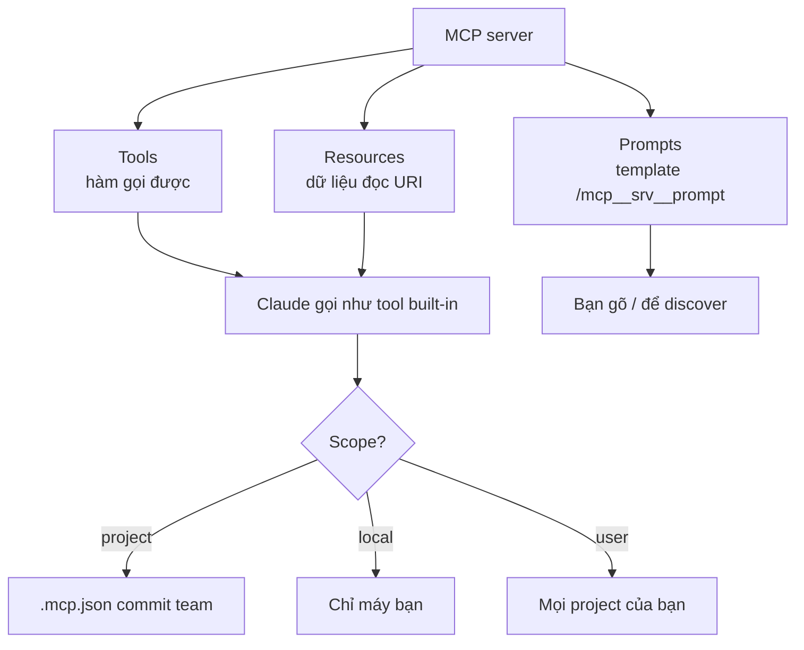

# FAQ 04 — MCP: kết nối & sự cố

> **Bài này cho ai:** bạn muốn cắm thêm công cụ ngoài (database, GitHub, tickets, browser) cho Claude Code, hoặc server MCP đang chết mà chưa biết check gì trước.
> **Cần gì trước:** đã cài và đăng nhập Claude Code ([FAQ 01](01-tai-khoan-pricing-cai-dat.md)); đọc [bài 08 — kết nối công cụ ngoài](../01-huong-dan-su-dung/08-mcp-ket-noi-cong-cu-ngoai.md) càng tốt, không bắt buộc.
> **Đọc xong bạn làm được:**
> - Thêm server đúng ngay lần đầu: chọn transport (stdio/sse/http) và scope (project/local/user) hợp với việc cần làm.
> - Giấu token trong `.mcp.json` bằng `${VAR}` và tự check bằng lệnh `git grep` trước khi commit.
> - Sửa server disconnected theo đúng thứ tự token → URL → OAuth, reconnect sau sleep mà không panic.
> - Giữ 3–6 servers thực dùng, cấu hình lại MCP khi lên cloud, viết skill kèm khi team dùng chung 1 MCP.
> **Thời gian:** ~15 phút

## Thuật ngữ dùng trong bài này

Đọc bảng này trước khi vào câu 0 — mọi thuật ngữ Anh trong bài đều được giải thích ở đây.

| Thuật ngữ | Hiểu nôm na là gì | Ví dụ thấy ngay |
|---|---|---|
| MCP (Model Context Protocol) | Chuẩn kết nối chung để tool ngoài nói chuyện được với AI — 1 chuẩn cho mọi tool, khỏi viết code nối riêng | `claude mcp add --transport stdio github -- npx -y @modelcontextprotocol/server-github` |
| Transport | Loại "dây nối": `stdio` là server chạy ngay trên máy bạn, `sse`/`http` là server ở xa qua URL | `--transport stdio` (local) vs `--transport http` (URL + token) |
| Scope | Nơi server được ghi nhớ: project (commit git), local (chỉ máy bạn), user (mọi project của bạn) | `claude mcp add --scope local ...` |
| Tools / Resources / Prompts | 3 thứ MCP server phơi ra: hàm gọi được, dữ liệu đọc theo URI, mẫu việc | `/mcp` hiện tools count; gõ `/` thấy `mcp__...` |
| OAuth | Cách server cho bạn đăng nhập bằng tài khoản thay vì tự dán token | `/mcp` hiện `auth required` → bấm hoàn tất trong browser |
| `.mcp.json` | File config MCP của project, commit lên git để cả team dùng chung | `cat .mcp.json` xem có token nào lọt vào không |

## Mục lục

- [Sơ đồ nhanh (nhìn 30 giây là nhớ)](#sơ-đồ-nhanh-nhìn-30-giây-là-nhớ)
- [Chọn đường vào nhanh](#chọn-đường-vào-nhanh)
- [Bảng tổng hợp: vòng đời 1 MCP server](#bảng-tổng-hợp-vòng-đời-1-mcp-server)
- [0. MCP server có 3 thành phần gì? (đồng bộ với bài 08)](#0-mcp-server-có-3-thành-phần-gì-đồng-bộ-với-bài-08)
- [1. Thêm server thế nào? (`add --transport stdio|sse|http`)](#1-thêm-server-thế-nào-add---transport-stdiossehttp)
- [2. Scope project / local / user — chọn sao cho đúng?](#2-scope-project--local--user--chọn-sao-cho-đúng)
- [3. Secrets trong MCP: env vars, không commit token](#3-secrets-trong-mcp-env-vars-không-commit-token)
- [4. Xem / sửa connections (`/mcp`, `reconnect`, `enable/disable`, CLI)](#4-xem--sửa-connections-mcp-reconnect-enabledisable-cli)
- [5. Server disconnected — check gì? (token / URL / OAuth)](#5-server-disconnected--check-gì-token--url--oauth)
- [6. MCP prompts là gì? (`/mcp__<server>__<prompt>`)](#6-mcp-prompts-là-gì-mcp__server__prompt)
- [7. Khi nào cần MCP vs đọc repo trực tiếp?](#7-khi-nào-cần-mcp-vs-đọc-repo-trực-tiếp)
- [8. Bao nhiêu server là đủ? (3–6 thực dùng, >10 tools visible thì loãng)](#8-bao-nhiêu-server-là-đủ-36-thực-dùng-10-tools-visible-thì-loãng)
- [9. Lên cloud mất MCP local — xử lý sao? (`/web-setup` + environment)](#9-lên-cloud-mất-mcp-local--xử-lý-sao-web-setup--environment)
- [10. Skill vs MCP — khi nào viết skill kèm? (MCP = kết nối, skill = cách dùng đúng)](#10-skill-vs-mcp--khi-nào-viết-skill-kèm-mcp--kết-nối-skill--cách-dùng-đúng)
- [Vẫn lỗi thì sao? (MCP)](#vẫn-lỗi-thì-sao-mcp)
- [Tham khảo chéo](#tham-khảo-chéo)

---

## Sơ đồ nhanh (nhìn 30 giây là nhớ)



## Chọn đường vào nhanh

Đọc bảng này khi cần nhảy thẳng tới câu đúng với việc đang mắc — mỗi dòng 1 tình huống.

| Tình huống của bạn | Nhảy tới |
|---|---|
| Chưa rõ MCP server phơi ra thứ gì cho Claude dùng | [Câu 0](#0-mcp-server-có-3-thành-phần-gì-đồng-bộ-với-bài-08) |
| Thêm server mới mà không biết chọn stdio / sse / http | [Câu 1](#1-thêm-server-thế-nào-add---transport-stdiossehttp) |
| Không biết server sẽ commit git hay chỉ máy mình thấy | [Câu 2](#2-scope-project--local--user--chọn-sao-cho-đúng) |
| Sợ token / secret lọt vào `.mcp.json` | [Câu 3](#3-secrets-trong-mcp-env-vars-không-commit-token) |
| Muốn xem, reconnect, bật/tắt server đang có | [Câu 4](#4-xem--sửa-connections-mcp-reconnect-enabledisable-cli) |
| Server báo disconnected, `auth required` | [Câu 5](#5-server-disconnected--check-gì-token--url--oauth) |
| Không biết server có prompts (lệnh động) hay không | [Câu 6](#6-mcp-prompts-là-gì-mcp__server__prompt) |
| Đang băn khoăn việc này có cần MCP không | [Câu 7](#7-khi-nào-cần-mcp-vs-đọc-repo-trực-tiếp) |
| Cắm nhiều server rồi model chọn sai tool, gọi thừa | [Câu 8](#8-bao-nhiêu-server-là-đủ-36-thực-dùng-10-tools-visible-thì-loãng) |
| Lên cloud (Web / remote) rồi MCP local biến mất | [Câu 9](#9-lên-cloud-mất-mcp-local--xử-lý-sao-web-setup--environment) |
| Team dùng chung 1 MCP mà mỗi người gọi 1 kiểu, sai schema | [Câu 10](#10-skill-vs-mcp--khi-nào-viết-skill-kèm-mcp--kết-nối-skill--cách-dùng-đúng) |

## Bảng tổng hợp: vòng đời 1 MCP server

Đọc bảng này khi cần tra nhanh đúng 1 lệnh cho chặng việc đang mắc — add, xem, reconnect, bật/tắt, giấu secrets.

| Bước | Lệnh | Ghi chú |
|---|---|---|
| Add (stdio/sse/http) | `claude mcp add --transport <t> <name> ...` | Chọn scope project/local/user |
| List / xem | `/mcp` | Xem tools count + trạng thái |
| Reconnect | `/mcp reconnect <name>` | Token hết hạn, sleep dậy, OAuth |
| Enable / disable | `/mcp enable\|disable [name\|all]` | Server ít dùng thì disable |
| CLI quản lý | `claude mcp list\|get\|remove\|reset-project-choices` | Dọn approvals cũ |
| Secrets | env vars `${TOKEN}`, không commit | Đỏ nếu hardcode token |
| Prompts | `/mcp__<server>__<prompt>` | Gõ `/` để discover |
| Cloud | Cấu hình lại servers/vars/setup trong environment | Local không tự lên cloud |

---

## 0. MCP server có 3 thành phần gì? (đồng bộ với bài 08)

> **Câu hỏi:** Tools / Resources / Prompts nghe giống nhau — khác nhau thế nào, đụng tới cái nào trước?
> **Trả lời 1 câu:** Tools là hàm gọi được, Resources là dữ liệu đọc theo URI, Prompts là template hiện thành lệnh `/mcp__...` — cả 3 đều do 1 MCP server phơi ra.

**Giải thích:** Cùng 1 server nhưng phơi ra 3 thứ, phân biệt nhanh bằng cột "thấy ở đâu":

| Thành phần | Là gì (theo bài 08) | Ví dụ cụ thể | Thấy ở đâu |
|---|---|---|---|
| **Tools** | Hàm Claude gọi được (có input/output schema) | `github.create_pr(title, body, base)` · `postgres.query("SELECT * FROM users LIMIT 5")` · `playwright.navigate(url)` | `/mcp` hiện tools count; Claude tự gọi khi cần |
| **Resources** | Dữ liệu chỉ-đọc, địa chỉ bằng URI | `github://repos/acme/api/issues/123` · `postgres://db/users/schema` · `notion://pages/abc123` | Claude đọc như file, không tốn 1 call chạy |
| **Prompts** | Template việc chuẩn team, hiện thành slash command động | `/mcp__github__review_pr` · `/mcp__linear__create-issue` · `/mcp__db__query-template` | Gõ `/` trong session để discover, không cần nhớ tên |

**Khi nào áp dụng:** lần đầu onboard 1 server mới — ngồi liệt kê nó phơi ra tools gì, resources gì, prompts gì, trước khi gõ lệnh gọi.

**Ví dụ:**

```bash
# Thử ngay trong session để phân biệt 3 loại:
/mcp                        # xem server nào có bao nhiêu tools
# gõ "/" rồi tìm mcp__ : đó là Prompts
# hỏi "Resources của server github là gì?" : Claude liệt kê URI đọc được
```

Scopes quyết định server lưu ở đâu (chọn sai là lộ token) — bảng 3 scope đã gộp ở [câu 2](#2-scope-project--local--user--chọn-sao-cho-đúng); ở đây chỉ cần nhớ 2 cách add nhanh theo scope:

```bash
claude mcp add --scope project --transport http linear --url https://mcp.linear.app/mcp --headers "Authorization: Bearer ${LINEAR_TOKEN}"
claude mcp add --scope local --transport stdio db -- npx -y @db/mcp
```

**Nếu vẫn lỗi thì:** `/mcp` xem tools count có hiện không → `claude mcp get <name>` soi transport/scope → đọc bài 08 mục scope precedence.

**Đào sâu:** [bài 08 — kết nối công cụ ngoài](../01-huong-dan-su-dung/08-mcp-ket-noi-cong-cu-ngoai.md) · [lệnh `/mcp`](../01-huong-dan-su-dung/commands/knowledge-system/mcp/README.md) · [thứ tự debug cuối file](#vẫn-lỗi-thì-sao-mcp)

---

## 1. Thêm server thế nào? (`add --transport stdio|sse|http`)

> **Câu hỏi:** Thêm MCP server vào Claude Code thì gõ lệnh gì, và khi nào chọn stdio, khi nào chọn http?
> **Trả lời 1 câu:** Gõ `claude mcp add --transport <stdio|sse|http> <tên> ...` — stdio cho server chạy trên máy bạn, http/sse cho server ở xa (cần URL + token).

**Giải thích:** 3 transports:

- **stdio:** server chạy local (npx/uvx/binary). Nhanh, hợp DB local, CLI tools, browser.
- **sse (legacy) / http (streamable):** server remote (URL + token). Hợp GitHub, tickets, docs SaaS.

Version theo [WRITING-STYLE — Phần B](../WRITING-STYLE.md#phần-b--dữ-kiện-chuẩn-làm-tròn-thời-gian-07102026): từ Claude Code **≥2.1.292** (06/10/2026), MCP mặc định negotiate protocol `2026-07-28` — tương tác MCP mới hơn với mọi provider.

**Khi nào áp dụng:** setup repo mới (bước `/mcp`) + mỗi khi cần data ngoài repo.

**Ví dụ:**

```bash
# stdio (chạy local):
claude mcp add --transport stdio github -- npx -y @modelcontextprotocol/server-github

# http remote (SaaS):
claude mcp add --transport http linear --url https://mcp.linear.app/mcp --headers "Authorization: Bearer ${LINEAR_TOKEN}"

# sse legacy (nếu vendor chỉ cho sse):
claude mcp add --transport sse docs --url https://docs.internal/sse
```

Team dùng Linear + Postgres local → add Linear bằng http (token env), Postgres bằng stdio (socket local). 2 transports khác nhau trong 1 project là bình thường.

**Đào sâu:** [bài 08 — 3 transports & setup từng server](../01-huong-dan-su-dung/08-mcp-ket-noi-cong-cu-ngoai.md) · [lệnh `/mcp`](../01-huong-dan-su-dung/commands/knowledge-system/mcp/README.md) · [thứ tự debug cuối file](#vẫn-lỗi-thì-sao-mcp)

---

## 2. Scope project / local / user — chọn sao cho đúng?

> **Câu hỏi:** Thêm server mà không để ý `--scope` thì xảy ra gì, 3 scope khác nhau lúc nào?
> **Trả lời 1 câu:** Scope quyết định server lưu ở đâu và ai thấy — project thì cả team thấy (commit `.mcp.json`), local/user thì chỉ mình bạn.

**Giải thích:** Chọn sai scope là cách nhanh nhất để lọt token. Bảng dưới là bản đồ "lưu ở đâu → ai thấy → dùng khi nào":

| Scope | Lưu ở đâu | Ai thấy | Khi nào dùng |
|---|---|---|---|
| `--scope project` | `.mcp.json` (commit git) | Cả team | Server team dùng chung (tickets, docs); secrets qua `${VAR}` |
| `--scope local` | máy bạn (không commit) | Chỉ bạn | Token cá nhân, thử nghiệm |
| `--scope user` | `~/.claude/` | Mọi project của bạn | Server cá nhân đa project (fetch, search, browser) |

**Khi nào áp dụng:** mỗi lần add — dừng 5 giây hỏi "cái này team thấy được không".

**Ví dụ:**

```bash
claude mcp add --scope project --transport stdio db -- npx -y @db/mcp
claude mcp add --scope local --transport http staging --url https://staging.internal/mcp
claude mcp add --scope user --transport stdio fetch -- npx -y @fetch/mcp
```

Add server test với token cá nhân mà quên `--scope local` → token vào `.mcp.json` commit lên git → lộ. Quy tắc: có secret cá nhân → local/user; share team → project + secrets qua env.

**Đào sâu:** [bài 08 — scope precedence](../01-huong-dan-su-dung/08-mcp-ket-noi-cong-cu-ngoai.md) · [FAQ 09 — bảo mật & riêng tư](09-bao-mat-quyen-rieng-tu.md) · [thứ tự debug cuối file](#vẫn-lỗi-thì-sao-mcp)

---

## 3. Secrets trong MCP: env vars, không commit token

> **Câu hỏi:** Token của tôi có dính vào git cùng `.mcp.json` không?
> **Trả lời 1 câu:** Có thể bị — `.mcp.json` được commit git, nên token phải nằm ở env `${VAR}`, không ghi thẳng vào file.

**Giải thích:** `.mcp.json` commit git → hardcode token trong đó là lộ cho cả thế giới (`claude doctor` báo đỏ). Chuẩn: dùng `${VAR}` + export từ shell/env manager.

**Khi nào áp dụng:** luôn. Thêm check CI: `git grep -E 'ghp_|sk-ant_|lin_' -- .mcp.json` phải rỗng.

**Ví dụ:**

```json
{
  "mcpServers": {
    "github": { "command": "npx", "args": ["-y", "@modelcontextprotocol/server-github"], "env": { "GITHUB_TOKEN": "${GITHUB_TOKEN}" } },
    "linear": { "transport": "http", "url": "https://mcp.linear.app/mcp", "headers": { "Authorization": "Bearer ${LINEAR_TOKEN}" } }
  }
}
```

```bash
export GITHUB_TOKEN="ghp_xxx"
export LINEAR_TOKEN="lin_xxx"
claude mcp list   # check connected
```

Onboard member mới → họ chỉ cần `export 2 VAR` là chạy, không cần xin token của bạn. Đổi token → đổi env, không sửa file.

**Đào sâu:** [FAQ 09 — bảo mật & riêng tư](09-bao-mat-quyen-rieng-tu.md) · [lệnh `doctor`](../01-huong-dan-su-dung/commands/knowledge-system/doctor/README.md) · [thứ tự debug cuối file](#vẫn-lỗi-thì-sao-mcp)

---

## 4. Xem / sửa connections (`/mcp`, `reconnect`, `enable/disable`, CLI)

> **Câu hỏi:** Muốn xem server nào đang sống, nối lại, hoặc tắt/bật thì gõ gì?
> **Trả lời 1 câu:** Trong session thì `/mcp` kèm `reconnect` / `enable` / `disable`; ngoài terminal thì `claude mcp list|get|remove|reset-project-choices`.

**Giải thích:** Bộ lệnh quản lý hàng ngày chia 2 nơi — trong session quản lý trạng thái, ngoài terminal quản lý config. Lưu ý version: `-p` ≥2.1.205 mới có `/mcp` no-arg in text (headless); cũ hơn thì dùng CLI `claude mcp list`.

**Khi nào áp dụng:** đầu tuần `/mcp` 1 lần; sau sleep/reconnect mạng thì reconnect ngay.

**Ví dụ:**

```bash
/mcp                        # list + trạng thái + tools count
/mcp reconnect github       # nối lại 1 server
/mcp disable playwright     # tắt server nặng khi không cần
/mcp enable playwright      # bật lại
/mcp enable all
```

```bash
# CLI (ngoài session):
claude mcp list
claude mcp get github
claude mcp remove old-server
claude mcp reset-project-choices   # xóa approvals project cũ khi đổi policy
```

Sáng mở máy thấy 2 servers vàng → `/mcp reconnect github` + `/mcp reconnect linear` → xanh lại trong 30s.

**Đào sâu:** [lệnh `/mcp`](../01-huong-dan-su-dung/commands/knowledge-system/mcp/README.md) · [lệnh `usage`](../01-huong-dan-su-dung/commands/session-context/usage/README.md) · [thứ tự debug cuối file](#vẫn-lỗi-thì-sao-mcp)

---

## 5. Server disconnected — check gì? (token / URL / OAuth)

> **Câu hỏi:** Server MCP tự nhiên báo disconnected thì check gì trước, reconnect liên tục có được không?
> **Trả lời 1 câu:** Check lần lượt: token env hết hạn/sai → URL sai hoặc server chết → OAuth chưa xong; hết cả 3 mới tính chuyện khác.

**Giải thích:** 3 nguyên nhân theo thứ tự hay gặp:

1. **Token hết hạn / sai env:** `echo ${GITHUB_TOKEN:+set}` — rỗng là mất env (mở terminal mới quên export).
2. **URL sai / server chết:** curl thử URL remote; stdio thì check binary còn không (`npx -y ... --help`).
3. **OAuth chưa xong:** 1 số servers (Google, Notion...) cần hoàn OAuth trong browser — `/mcp` hiện `auth required` → bấm hoàn tất rồi reconnect.

**Khi nào áp dụng:** disconnected → token → URL → OAuth → reconnect, đừng xóa server vội.

**Ví dụ:**

```bash
echo ${GITHUB_TOKEN:+token-set}
curl -sI https://mcp.linear.app/mcp | head -3
/mcp reconnect linear
claude mcp get linear   # soi config sai chỗ nào
```

Laptop sleep dậy → stdio servers chết (process bị kill) → `/mcp reconnect all` hoặc restart session. Đây là bệnh kinh niên của stdio, không phải config sai.

**Đào sâu:** [FAQ 08 — lỗi MCP disconnected](08-loi-thuong-gap-troubleshooting.md) · [lệnh `/mcp`](../01-huong-dan-su-dung/commands/knowledge-system/mcp/README.md) · [thứ tự debug cuối file](#vẫn-lỗi-thì-sao-mcp)

---

## 6. MCP prompts là gì? (`/mcp__<server>__<prompt>`)

> **Câu hỏi:** Việc lặp đi lặp lại với 1 server phải gõ y chang nhau hoài — có cách nào lưu sẵn không?
> **Trả lời 1 câu:** Có — server nào có prompt thì tự hiện thành lệnh động `/mcp__<server>__<prompt>`, gõ `/` là thấy danh sách.

**Giải thích:** Prompt là template việc chuẩn do server đăng ký — mỗi lần gọi, nó đưa sẵn 1 kịch bản việc vào session thay cho bạn tự gõ. 1 số servers expose **prompts** (template tác vụ) bên cạnh tools; chúng hiện thành slash command động `/mcp__<server>__<prompt>`. Gõ `/` trong session để discover — không cần nhớ tên.

**Khi nào áp dụng:** onboard server mới → gõ `/` xem nó có prompts gì, thử từng cái 1 lần.

**Ví dụ:**

```bash
# Gõ / rồi tìm:
# /mcp__github__pr-review
# /mcp__linear__create-issue
# /mcp__db__query-template
```

Server DB expose prompt `query-template` → gõ `/mcp__db__query-template` ra form query chuẩn team (đúng schema, đúng limit), khỏi viết SQL từ đầu.

**Đào sâu:** [bài 08 — MCP prompts → slash commands động](../01-huong-dan-su-dung/08-mcp-ket-noi-cong-cu-ngoai.md) · [FAQ 06 — skills & commands](06-skills-commands-claude-md.md) · [thứ tự debug cuối file](#vẫn-lỗi-thì-sao-mcp)

---

## 7. Khi nào cần MCP vs đọc repo trực tiếp?

> **Câu hỏi:** Repo đã có sẵn code và README thì có cần cắm MCP thêm không?
> **Trả lời 1 câu:** Không cần cho data trong repo — MCP chỉ dành cho data ngoài repo: DB, tickets, docs SaaS, browser, API internal, CI logs.

**Giải thích:** Quy tắc vàng:

- **Data NGOÀI repo → MCP:** DB, tickets, docs SaaS, browser, API internal, CI logs. Không có MCP là mù.
- **Data ĐÃ TRONG repo → đọc trực tiếp:** code, README, migrations. Thêm MCP vào chỉ tốn maintenance + context.

```text
Cần biết ticket LIN-123 đang nói gì? → MCP Linear (ngoài repo)
Cần biết hàm login viết sao? → Read trực tiếp (trong repo)
```

**Khi nào áp dụng:** trước khi add server mới, hỏi "data này có trong repo không". Có → đừng add.

**Ví dụ:** gắn MCP GitHub chỉ để đọc file trong repo đã clone → tốn 2k tokens/session vô ích (**ví dụ sai**). Đúng: dùng MCP GitHub để xem PR comments, CI status (ngoài repo).

**Đào sâu:** [bài 08 — skill + MCP cặp bài trùng](../01-huong-dan-su-dung/08-mcp-ket-noi-cong-cu-ngoai.md) · [FAQ 02 — MCP nhiều có sao không](02-model-context-token.md) · [thứ tự debug cuối file](#vẫn-lỗi-thì-sao-mcp)

---

## 8. Bao nhiêu server là đủ? (3–6 thực dùng, >10 tools visible thì loãng)

> **Câu hỏi:** Cắm bao nhiêu MCP server thì vừa, nhiều hơn có tốt hơn không?
> **Trả lời 1 câu:** 3–6 servers thực dùng là vừa — quá ~10 tools visible thì model chọn sai tool, bỏ sót tool.

**Giải thích:** Mỗi server thêm tools vào context ngay cả khi bạn không gọi tới, nên cắm thêm không phải lúc nào cũng mạnh hơn: vượt ngưỡng ~10 tools visible là model bắt đầu gọi nhầm, bỏ sót (xem số liệu [FAQ 02](02-model-context-token.md)). Sweet spot team thực tế:

```text
3–6 servers: GitHub + Playwright + DB + search + tickets (+ docs)
```

Server 30+ tools mà tuần dùng 1 lần → disable tạm thời, enable khi cần.

**Khi nào áp dụng:** mỗi tháng rà 1 lần. Quy tắc: server 3 tháng không gọi → remove.

**Ví dụ:**

```bash
/mcp                    # đếm servers + tools
/mcp disable heavy-one  # tắt cái ít dùng
/usage                  # xem MCP nào ngốn nhất tuần
```

12 servers (120 tools) → `/usage` thấy 5 cái chiếm 90% calls → disable 7 cái còn lại → accuracy lên, bill xuống.

**Đào sâu:** [FAQ 02 — MCP nhiều có sao không](02-model-context-token.md) · [lệnh `usage`](../01-huong-dan-su-dung/commands/session-context/usage/README.md) · [thứ tự debug cuối file](#vẫn-lỗi-thì-sao-mcp)

---

## 9. Lên cloud mất MCP local — xử lý sao? (`/web-setup` + environment)

> **Câu hỏi:** Đang làm local ngon lành mà mở bản Web/remote lên thì MCP biến mất — sao vậy?
> **Trả lời 1 câu:** Đúng — cloud session chỉ thấy repo + cloud environment, nên MCP local của laptop (stdio + env vars) không đi theo; phải khai lại trong environment.

**Giải thích:** Cloud session không thấy process local: stdio chết (không có binary trên môi trường cloud), env vars trên laptop cũng không tồn tại ở đó. Phải cấu hình lại servers/vars/setup script trong environment.

**Khi nào áp dụng:** trước lần `--cloud` đầu tiên của repo. Checklist: servers → vars → setup script → chạy thử.

**Ví dụ:**

```bash
# Trong terminal đã login Sub:
/web-setup    # sync token, tạo cloud environment từ repo
# → khai báo lại: MCP servers cần, env vars, setup script (npm ci, migrate...)
claude --cloud "task"   # chạy thử trên cloud
```

Local có Postgres stdio → cloud không có → trong environment khai DB URL cloud/staging + add MCP http tương ứng. Đừng mong "teleport lên là chạy y chang".

**Đào sâu:** [FAQ 10 — routines, Web, CI](10-ci-sdk-routines-web.md) · [bài 02 — từng bề mặt dùng](../01-huong-dan-su-dung/02-cac-be-mat-terminal-ide-web-desktop.md) · [thứ tự debug cuối file](#vẫn-lỗi-thì-sao-mcp)

---

## 10. Skill vs MCP — khi nào viết skill kèm? (MCP = kết nối, skill = cách dùng đúng)

> **Câu hỏi:** Team dùng chung 1 MCP mà mỗi người gọi 1 kiểu, sai schema hoài — làm sao cho đồng nhất?
> **Trả lời 1 câu:** Viết kèm 1 skill — MCP cho bạn *kết nối* (gọi được API), skill dạy model gọi đúng chuẩn.

**Giải thích:** Team dùng sâu 1 MCP mà không có skill kèm thì mỗi người gọi 1 kiểu, sai schema liên tục. Skill ghi rõ schema nào, format nào, limit nào, lỗi nào bỏ qua — model đọc 1 lần là khỏi đoán.

**Khi nào áp dụng:** MCP nào team gọi >5 lần/tuần + hay sai schema → viết skill. MCP dùng 1 lần/tháng → khỏi.

**Ví dụ:** skill `linear-triage` (kèm MCP Linear):

```markdown
---
name: linear-triage
description: Lấy ticket Linear về tóm tắt + tạo branch đúng chuẩn. Dùng khi bắt đầu task từ ticket.
---
1. Gọi MCP linear lấy issue (chỉ fields: title, desc, labels, priority).
2. Đặt branch `feat/LIN-<id>-<slug>`.
3. Không tự đổi priority khi chưa hỏi.
```

**Đào sâu:** [bài 05 — skills & custom commands](../01-huong-dan-su-dung/05-skills-custom-commands.md) · [bài 07 tips — thiết kế skills](../02-tips-thuc-chien/07-thiet-ke-skills.md) · [FAQ 06 — skills & commands](06-skills-commands-claude-md.md) · [thứ tự debug cuối file](#vẫn-lỗi-thì-sao-mcp)

---

## Vẫn lỗi thì sao? (MCP)

Section này trả lời câu: đi hết 10 câu trên mà server vẫn không lên thì check theo thứ tự nào?

1. `/mcp` — xem trạng thái + tools count (dead? auth expired?).
2. `/mcp reconnect <name>` — nối lại (nhất là sau sleep).
3. `claude mcp get <name>` — soi config (URL? env? transport?).
4. `claude doctor` — quét `.mcp.json` hardcode secret, tools thừa.
5. `/debug` — session vẫn lạ → chẩn đoán; `/bug` nếu nghi lỗi core.

Thứ tự debug chung cho mọi lỗi (không chỉ lỗi MCP): `/status` → `claude doctor` → `/permissions` → `/debug` → `/bug` — chi tiết ở [FAQ 08 — lỗi thường gặp](08-loi-thuong-gap-troubleshooting.md).

```bash
/mcp
/mcp reconnect github
claude mcp get github
```

---

## Tham khảo chéo

- Lệnh liên quan:
  - [../01-huong-dan-su-dung/commands/knowledge-system/mcp/README.md](../01-huong-dan-su-dung/commands/knowledge-system/mcp/README.md) — add/list/reconnect/enable chi tiết
  - [../01-huong-dan-su-dung/02-cac-be-mat-terminal-ide-web-desktop.md](../01-huong-dan-su-dung/02-cac-be-mat-terminal-ide-web-desktop.md) — dựng cloud environment
  - [../01-huong-dan-su-dung/commands/knowledge-system/doctor/README.md](../01-huong-dan-su-dung/commands/knowledge-system/doctor/README.md) — quét secret + tools thừa
  - [../01-huong-dan-su-dung/commands/session-context/usage/README.md](../01-huong-dan-su-dung/commands/session-context/usage/README.md) — MCP nào ngốn nhất
  - [../01-huong-dan-su-dung/commands/knowledge-system/debug/README.md](../01-huong-dan-su-dung/commands/knowledge-system/debug/README.md) — chẩn đoán khi reconnect hoài không được
- Bài tổng quan:
  - [../01-huong-dan-su-dung/08-mcp-ket-noi-cong-cu-ngoai.md](../01-huong-dan-su-dung/08-mcp-ket-noi-cong-cu-ngoai.md) — transports + scopes + secrets
  - [../01-huong-dan-su-dung/05-skills-custom-commands.md](../01-huong-dan-su-dung/05-skills-custom-commands.md) — viết skill kèm MCP
  - [../02-tips-thuc-chien/07-thiet-ke-skills.md](../02-tips-thuc-chien/07-thiet-ke-skills.md) — skill cho MCP dùng sâu
- FAQ liên quan: [FAQ 02](02-model-context-token.md) (tools visible), [FAQ 06](06-skills-commands-claude-md.md) (skill kèm), [FAQ 10](10-ci-sdk-routines-web.md) (cloud environment).

> Mẹo 1 dòng: _secrets qua env, server ít dùng thì disable, và lên cloud là cấu hình lại từ đầu._
