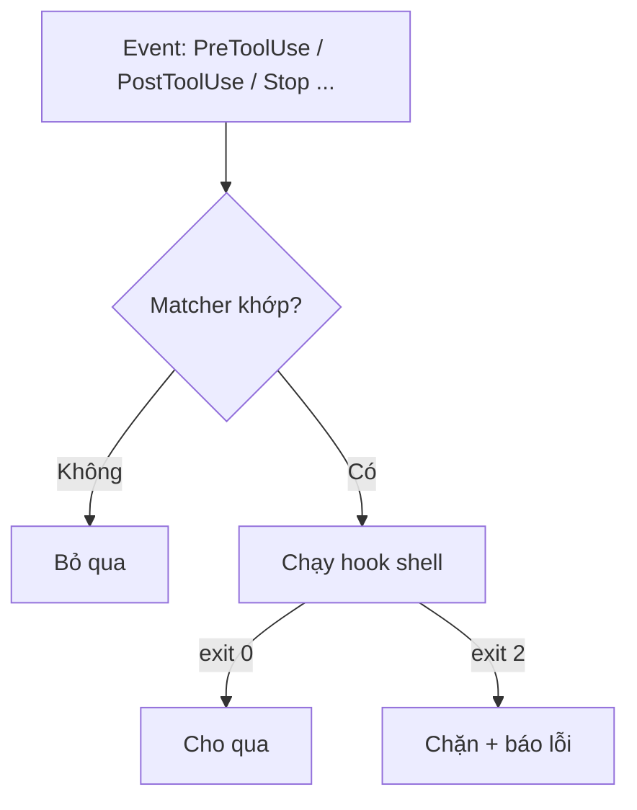

# FAQ 05 — Hooks: vì sao không chạy?

> **Bài này cho ai:** bạn đã gắn hook (PreToolUse, PostToolUse, Stop...) nhưng hook im re, chạy muộn, hoặc muốn biết nên viết loại hook nào cho an toàn.
> **Cần gì trước:** đã cài và đăng nhập Claude Code ([FAQ 01](01-tai-khoan-pricing-cai-dat.md)); biết sơ về event + schema hooks thì tốt, đọc [bài 07 — hooks & tự động hóa](../01-huong-dan-su-dung/07-hooks-tu-dong-hoa.md) là đủ.
> **Đọc xong bạn làm được:**
> - Tự debug 7 bệnh hook hay gặp theo đúng thứ tự: event → matcher → trust → headless → version.
> - Phân biệt 4 loại hook (command/prompt/agent/HTTP) và chọn đúng loại cho việc cần làm.
> - Viết hook chặn/sửa/verify đúng event, đúng matcher, không treo khi chạy `-p` hay CI.
> - Kiểm tra hook còn sống sau mỗi `claude update` bằng dry-run pipe stdin.
> **Thời gian:** ~15 phút

## Thuật ngữ dùng trong bài này

Đọc bảng này trước khi vào câu 1 — mọi thuật ngữ Anh trong bài đều được giải thích ở đây.

| Thuật ngữ | Hiểu nôm na là gì | Ví dụ thấy ngay |
|---|---|---|
| Hook | Đoạn script/tiến trình Claude Code tự chạy khi có sự kiện, **không** qua model nên không tốn token | `./scripts/guard-no-push-main.sh` chạy trước lệnh `Bash` |
| Event | Thời điểm hook được kích hoạt (PreToolUse, PostToolUse, Stop...) | `PreToolUse` chạy trước khi tool thực thi |
| Matcher | Bộ lọc chọn tool nào thì hook lửa; phân biệt cả chữ hoa/thường | `"matcher": "Edit\|Write"` |
| exit code | Mã thoát script: `0` cho qua, `2` chặn + báo lỗi | `exit 2` = block |
| stdin | Dữ liệu JSON Claude Code đẩy vào hook để script đọc | `echo '{"tool_name":"Bash",...}' \| ./hook.sh` |
| Headless | Chạy `-p`/background/CI, không có người bấm Yes/No | `claude -p "..."` |
| Trust | Xác nhận folder tin cậy — hook trong frontmatter mới chạy | dialog "trust this folder?" lúc mở folder |
| `updatedInput` | Hook `PreToolUse` sửa input tool trước khi chạy | `normalize-edit.sh` rewrite command |

## Mục lục

- [Sơ đồ nhanh (nhìn 30 giây là nhớ)](#sơ-đồ-nhanh-nhìn-30-giây-là-nhớ)
- [Chọn đường vào nhanh](#chọn-đường-vào-nhanh)
- [Bảng tổng hợp: 4 loại hook + debug nhanh](#bảng-tổng-hợp-4-loại-hook--debug-nhanh)
- [1. Xem hooks đang có ở đâu?](#1-xem-hooks-đang-có-ở-đâu)
- [2. Hook không lửa — kiểm tra event đúng chưa?](#2-hook-không-lửa--kiểm-tra-event-đúng-chưa)
- [3. Matcher đúng chữ hoa chưa?](#3-matcher-đúng-chữ-hoa-chưa)
- [4. Folder đã trust chưa?](#4-folder-đã-trust-chưa)
- [5. Chạy headless (`-p`/background) có gì cần prompt không?](#5-chạy-headless--pbackground-có-gì-cần-prompt-không)
- [6. Hai hook cùng sửa `updatedInput` — ai thắng?](#6-hai-hook-cùng-sửa-updatedinput--ai-thắng)
- [7. Stop hook có lửa khi user interrupt?](#7-stop-hook-có-lửa-khi-user-interrupt)
- [8. Stop-gate bị override sau 8 lần block — thiết kế sao cho hội tụ?](#8-stop-gate-bị-override-sau-8-lần-block--thiết-kế-sao-cho-hội-tụ)
- [9. Prompt-hook / agent-hook / command-hook — chọn loại nào?](#9-prompt-hook--agent-hook--command-hook--chọn-loại-nào)
- [10. Hook chạy với quyền gì?](#10-hook-chạy-với-quyền-gì)
- [11. Hook API đổi theo version — chống drift sao?](#11-hook-api-đổi-theo-version--chống-drift-sao)
- [Vẫn lỗi thì sao? (hooks)](#vẫn-lỗi-thì-sao-hooks)
- [Tham khảo chéo](#tham-khảo-chéo)

---

## Sơ đồ nhanh (nhìn 30 giây là nhớ)



## Chọn đường vào nhanh

Đọc bảng này khi cần nhảy thẳng tới câu đúng với triệu chứng đang gặp — mỗi dòng 1 tình huống.

| Triệu chứng của bạn | Nhảy tới |
|---|---|
| Không rõ máy đang cấu hình hook nào | [Câu 1](#1-xem-hooks-đang-có-ở-đâu) |
| Hook im re, không thấy chạy ở đâu cả | [Câu 1](#1-xem-hooks-đang-có-ở-đâu) → [câu 2](#2-hook-không-lửa--kiểm-tra-event-đúng-chưa) → [câu 3](#3-matcher-đúng-chữ-hoa-chưa) |
| Hook chạy nhưng không kịp chặn | [Câu 2](#2-hook-không-lửa--kiểm-tra-event-đúng-chưa) |
| Hook im re tuyệt đối (không log, không lỗi) | [Câu 3](#3-matcher-đúng-chữ-hoa-chưa) |
| Máy tôi chạy, máy đồng nghiệp clone về thì không | [Câu 4](#4-folder-đã-trust-chưa) |
| Hook treo/timeout khi chạy CI hoặc `-p` | [Câu 5](#5-chạy-headless--pbackground-có-gì-cần-prompt-không) |
| Hai hook giành sửa input, lúc đúng lúc sai | [Câu 6](#6-hai-hook-cùng-sửa-updatedinput--ai-thắng) |
| Stop hook không lửa khi bấm Esc | [Câu 7](#7-stop-hook-có-lửa-khi-user-interrupt) |
| Stop-gate tự nhiên bị bỏ qua sau vài lần block | [Câu 8](#8-stop-gate-bị-override-sau-8-lần-block--thiết-kế-sao-cho-hội-tụ) |
| Không biết nên viết command/prompt/agent hook | [Câu 9](#9-prompt-hook--agent-hook--command-hook--chọn-loại-nào) |
| Lo hook lạ chạy bằng quyền của mình | [Câu 10](#10-hook-chạy-với-quyền-gì) |
| Update xong hook đổi hành vi | [Câu 11](#11-hook-api-đổi-theo-version--chống-drift-sao) |

## Bảng tổng hợp: 4 loại hook + debug nhanh

Đọc bảng đầu khi cần chọn loại hook; đọc bảng sau khi hook không lửa mà chưa biết soi ở đâu.

| Loại hook | Chạy ở đâu | Tốn gì | Dùng khi nào |
|---|---|---|---|
| Command (shell script) | Máy bạn, chạy cố định | 0 model tokens, vài ms–s | Production ưu tiên (lint, guard, format) |
| Prompt (LLM 1-turn, Haiku default) | Model chấm 1 lượt | Ít tokens (Haiku) | Cần judgment từ input (prompt có risky?) |
| Agent (experimental, 60s/50 turns) | Subagent verify | Nhiều tokens | Verify cần đọc code/chạy lệnh |
| HTTP / MCP-tool | Ngoài (webhook/service) | Network | Tích hợp hệ ngoài (ticket, audit log) |

| Hook không lửa → check | Lệnh |
|---|---|
| Đúng event chưa? | `/hooks` xem theo tool events |
| Matcher đúng case chưa? | `Edit` ≠ `edit`, `Bash` ≠ `bash` |
| Folder trusted chưa? | Mở lại folder → trust dialog |
| Headless (`-p`) có cần prompt? | Thiết kế headless, không prompt |
| Version đổi schema? | `/status` + release notes |

---

## 1. Xem hooks đang có ở đâu?

> **Hỏi ngắn gọn:** làm sao biết máy đang cấu hình những hook nào, hook nào sắp chạy?
>
> **Trả lời 1 câu:** Gõ `/hooks` — lệnh liệt kê mọi hook theo từng tool event, kèm matcher + command.

**Giải thích:** `/hooks` là "bảng điện" của hệ hook — hook không lửa thì nhìn đây đầu tiên. Lệnh nhóm theo event, cho thấy matcher và lệnh shell của từng hook, nên bạn biết ngay config nào đang thực sự được nạp chứ không đoán theo trí nhớ.

**Kiểm tra nhanh:**

```bash
/hooks    # xem tất cả hooks theo events
```

Tưởng đã có guard push-main nhưng `/hooks` không hiện PreToolUse/Bash nào → config sai file (VD: viết vào `settings.local.json` mẫu khác) hoặc JSON parse lỗi.

**Khi nào áp dụng:** luôn là bước 1 khi debug hook — trước khi nghi script hỏng, xem hook có được nạp không.

**Đào sâu:** [lệnh `/hooks`](../01-huong-dan-su-dung/commands/knowledge-system/hooks/README.md) · [bài 07 — hooks & tự động hóa](../01-huong-dan-su-dung/07-hooks-tu-dong-hoa.md) · [thứ tự debug cuối file](#vẫn-lỗi-thì-sao-hooks)

---

## 2. Hook không lửa — kiểm tra event đúng chưa?

> **Hỏi ngắn gọn:** gắn hook rồi mà nó không chạy, hoặc chạy muộn — có phải mình chọn sai event?
>
> **Trả lời 1 câu:** Đúng, đây là bệnh #1 — hook gắn vào event không khớp thời điểm bạn cần chặn/kiểm tra.

**Giải thích:** Mỗi event lửa ở một thời điểm khác nhau trong vòng đời tool, nên gắn nhầm là hook không bao giờ chạy đúng lúc. Bản đồ nhanh:

| Muốn | Event đúng | Gắn nhầm hay gặp |
|---|---|---|
| Chặn trước khi chạy | `PreToolUse` | Gắn `PostToolUse` (chạy xong mới check = muộn) |
| Check/sửa sau khi chạy | `PostToolUse` | Gắn `PreToolUse` (chưa có output để check) |
| Gate khi Claude xong | `Stop` | Tưởng lửa khi user interrupt (không lửa) |
| Chạy đầu session | `SessionStart` | Tưởng lửa mỗi prompt (chỉ 1 lần) |
| Check prompt user | `UserPromptSubmit` | Tưởng chặn được tool (chỉ thấy prompt) |

**Khi nào áp dụng:** hook "chạy nhưng không kịp chặn" → 90% nhầm Pre/Post.

**Kiểm tra nhanh:** Config copy-paste (chặn push main — phải `PreToolUse`):

```json
{
  "hooks": {
    "PreToolUse": [{ "matcher": "Bash", "hooks": [{ "type": "command", "command": "./scripts/guard-no-push-main.sh" }] }]
  }
}
```

**Đào sâu:** [bài 07 — hooks & tự động hóa](../01-huong-dan-su-dung/07-hooks-tu-dong-hoa.md) · [FAQ 03 — permissions & modes](03-permissions-modes.md) · [thứ tự debug cuối file](#vẫn-lỗi-thì-sao-hooks)

---

## 3. Matcher đúng chữ hoa chưa?

> **Hỏi ngắn gọn:** hook viết đúng event rồi mà vẫn im re, không log lỗi gì — kiểm tra gì tiếp?
>
> **Trả lời 1 câu:** Kiểm tra chữ hoa/thường của matcher — tên tool phải viết hoa đúng, đây là bệnh #2, nhỏ mà hay gặp nhất.

**Giải thích:** Matcher khớp đúng tên tool viết hoa: `Edit`, `Write`, `Bash`, `Read`... Gõ `edit`, `bash` thường → không khớp → im re, không báo lỗi.

**Kiểm tra nhanh:**

```json
{
  "hooks": {
    "PreToolUse": [
      { "matcher": "Edit|Write", "hooks": [{ "type": "command", "command": "./scripts/guard-secret.sh" }] },
      { "matcher": "Bash", "hooks": [{ "type": "command", "command": "./scripts/guard-shell.sh" }] }
    ]
  }
}
```

Dry-run hook tay với stdin mẫu:

```bash
echo '{"tool_name":"Bash","tool_input":{"command":"git push origin main"}}' | ./scripts/guard-no-push-main.sh
# → phải ra {"decision":"block",...}. Không ra → script hỏng, không phải matcher.
```

**Khi nào áp dụng:** hook im re tuyệt đối (không log, không lỗi) → soi matcher trước.

**Đào sâu:** [bài 07 — hooks & tự động hóa](../01-huong-dan-su-dung/07-hooks-tu-dong-hoa.md) · [FAQ 08 — lỗi thường gặp](08-loi-thuong-gap-troubleshooting.md) · [thứ tự debug cuối file](#vẫn-lỗi-thì-sao-hooks)

---

## 4. Folder đã trust chưa?

> **Hỏi ngắn gọn:** máy tôi hook chạy ầm ầm, máy đồng nghiệp clone về thì im — do đâu?
>
> **Trả lời 1 câu:** Do folder chưa được trust — hook gắn trong project files (frontmatter của subagent/skill) chỉ chạy khi workspace đã xác nhận tin cậy.

**Giải thích:** Bệnh #3 — hooks kèm trong project files (frontmatter của subagent/skill) chỉ chạy khi workspace được **trust** (dialog lúc mở folder). Chưa trust → skip + log mờ, dễ tưởng hỏng. `-p` headless không tính trusted (xem [FAQ 03 — permissions & modes](03-permissions-modes.md), câu 7).

**Kiểm tra nhanh:**

```bash
/agents    # xem agents + hooks kèm
# Mở folder trong terminal/IDE → hiện "trust this folder?" → Accept → chạy lại
```

**Ví dụ:** hook format của agent chạy trên máy bạn (đã trust) nhưng im trên máy đồng nghiệp (bấm Deny trust lúc mở) → đúng 1 nguyên nhân này.

**Khi nào áp dụng:** hook "máy tôi chạy, máy khác không" → hỏi trust trước khi sửa code.

**Đào sâu:** [lệnh `/agents`](../01-huong-dan-su-dung/commands/knowledge-system/agents/README.md) · [FAQ 03 — permissions & modes](03-permissions-modes.md) · [thứ tự debug cuối file](#vẫn-lỗi-thì-sao-hooks)

---

## 5. Chạy headless (`-p`/background) có gì cần prompt không?

> **Hỏi ngắn gọn:** hook chạy ngon khi mình ngồi terminal, nhưng lên CI hoặc `-p` thì treo tới timeout — vì sao?
>
> **Trả lời 1 câu:** Vì headless không có người bấm Yes/No, nên hook nào chờ nhập liệu sẽ treo tới khi fail mờ.

**Giải thích:** Bệnh #4. Hook nào `read -p`, mở editor, gọi OAuth browser → treo tới timeout rồi fail mờ. Quy tắc hook headless-safe:

**Kiểm tra nhanh:**

```bash
#!/bin/bash
# ✅ Đọc stdin, in JSON, thoát. Không prompt, không mở UI.
input=$(cat)
echo "$input" | grep -q 'rm -rf' && echo '{"decision":"block","reason":"deny rm-rf"}' && exit 0
echo '{"decision":"approve"}'
```

```bash
# ❌ TRONG HOOK: read -p "chắc không?"; vim file; open browser...
```

**Khi nào áp dụng:** mọi hook sẽ chạy trong `-p`/background/CI → test bằng pipe stdin tay ([câu 3](#3-matcher-đúng-chữ-hoa-chưa)), không test bằng tay gõ.

**Đào sâu:** [bài 07 — hooks & tự động hóa](../01-huong-dan-su-dung/07-hooks-tu-dong-hoa.md) · [FAQ 10 — CI, SDK, routines, Web](10-ci-sdk-routines-web.md) · [thứ tự debug cuối file](#vẫn-lỗi-thì-sao-hooks)

---

## 6. Hai hook cùng sửa `updatedInput` — ai thắng?

> **Hỏi ngắn gọn:** hai hook cùng rewrite input của một tool — hook nào quyết định kết quả cuối?
>
> **Trả lời 1 câu:** Hook nào finish **cuối** thì thắng, mà thứ tự finish không đảm bảo — nên kết quả lúc đúng lúc sai.

**Giải thích:** Bệnh #5. `PreToolUse` hooks có thể trả `updatedInput` (sửa input tool trước khi chạy). 2 hooks cùng sửa → hook finish cuối thắng, hôm nay sửa đúng, mai sửa sai.

**Fix:** đừng để overlap. 1 matcher → 1 hook sửa input. Các hooks còn lại chỉ approve/block, không sửa.

**Kiểm tra nhanh:**

```json
{
  "hooks": {
    "PreToolUse": [
      { "matcher": "Edit", "hooks": [{ "type": "command", "command": "./scripts/normalize-edit.sh" }] }
    ]
  }
}
```

```text
✅ 1 hook sửa Edit-input + 1 hook block Bash-nguy-hiểm (khác matcher, không clash)
❌ 2 hooks cùng rewrite Bash command (clash, thắng thua hên xui)
```

**Khi nào áp dụng:** thiết kế hook rewrite input — luôn đếm "mỗi matcher có mấy hook sửa".

**Đào sâu:** [bài 07 — hooks & tự động hóa](../01-huong-dan-su-dung/07-hooks-tu-dong-hoa.md) · [tips 06 — công thức hooks](../02-tips-thuc-chien/06-hooks-recipes.md) · [thứ tự debug cuối file](#vẫn-lỗi-thì-sao-hooks)

---

## 7. Stop hook có lửa khi user interrupt?

> **Hỏi ngắn gọn:** mình viết Stop hook để gate "xong việc" mà bấm Esc là thoát được — hook có lửa khi interrupt không?
>
> **Trả lời 1 câu:** Không — interrupt (Esc/Ctrl-C) không lửa `Stop`; API error giữa chừng lửa event riêng `StopFailure`.

**Giải thích:** Bệnh #6 (hiểu nhầm lifecycle):

- `Stop` = Claude tự xong response → lửa.
- User bấm Esc/Ctrl-C (interrupt) → **không lửa** `Stop`. Muốn bắt interrupt thì dùng cơ chế khác (session-end/cleanup ngoài).
- API error giữa chừng → lửa `StopFailure` (event riêng), không phải `Stop`.

**Kiểm tra nhanh:**

```json
{
  "hooks": {
    "Stop": [{ "hooks": [{ "type": "command", "command": "./scripts/verify-done.sh" }] }],
    "StopFailure": [{ "hooks": [{ "type": "command", "command": "./scripts/report-failure.sh" }] }]
  }
}
```

**Ví dụ:** Stop-gate "chưa test xanh không được dừng" bị qua mặt bằng Esc → đúng thiết kế. Đừng trông chờ Stop-hook chống interrupt.

**Khi nào áp dụng:** viết gate "xong việc" — luôn handle cả `StopFailure` + chấp nhận interrupt là đường thoát của user.

**Đào sâu:** [bài 07 — hooks & tự động hóa](../01-huong-dan-su-dung/07-hooks-tu-dong-hoa.md) · [FAQ 08 — lỗi thường gặp](08-loi-thuong-gap-troubleshooting.md) · [thứ tự debug cuối file](#vẫn-lỗi-thì-sao-hooks)

---

## 8. Stop-gate bị override sau 8 lần block — thiết kế sao cho hội tụ?

> **Hỏi ngắn gọn:** Stop-gate chặn "không cho dừng" của mình tự nhiên bị bỏ qua sau vài lần — sao vậy?
>
> **Trả lời 1 câu:** Sau **8 lần block liên tiếp** Claude được override để thoát (chống treo vô hạn) — nên gate phải thiết kế hội tụ, đừng vô hạn.

**Giải thích:** Bệnh #7. Nếu gate "không bao giờ cho dừng trừ khi X" mà X không bao giờ đạt được → tới block thứ 8 là tuột. Thiết kế gate HỘI TỤ (fix được) thay vì gate VÔ HẠN:

**Kiểm tra nhanh:**

```bash
#!/bin/bash
# ✅ verify-done.sh: mỗi block kèm hướng fix cụ thể, đếm lần
# Lần 1-3: "test đỏ file X → chạy npm test -- X"
# Lần 4+: nới điều kiện (VD: cho dừng nếu chỉ còn style warnings)
```

```text
❌ "Chưa hoàn hảo thì block" (không bao giờ đạt → override ở block 8)
✅ "Test đỏ thì block + chỉ rõ file; quá 5 lần thì cho qua với warning" (hội tụ)
```

**Khi nào áp dụng:** mọi Stop-gate chặn CI push/merge — luôn có đường "cho qua có điều kiện" trước block 8.

**Đào sâu:** [tips 06 — công thức hooks](../02-tips-thuc-chien/06-hooks-recipes.md) · [bài 07 — hooks & tự động hóa](../01-huong-dan-su-dung/07-hooks-tu-dong-hoa.md) · [thứ tự debug cuối file](#vẫn-lỗi-thì-sao-hooks)

---

## 9. Prompt-hook / agent-hook / command-hook — chọn loại nào?

> **Hỏi ngắn gọn:** cùng 1 việc guard được mà có 4 loại hook — khi nào nên dùng loại nào?
>
> **Trả lời 1 câu:** Ưu tiên command (shell) trước; chỉ lên prompt/agent khi shell không diễn đạt nổi.

**Giải thích:** Thứ tự ưu tiên production:

1. **Command (shell) — ưu tiên #1:** chạy cố định, nhanh, 0 tokens, test được bằng pipe. Mọi guard/lint/format dùng loại này.
2. **Prompt (LLM 1-turn, Haiku default):** khi cần *judgment* từ input mà regex không viết nổi (VD: "prompt này có ý định xóa DB không?"). Tốn ít tokens.
3. **Agent (experimental, 60s/50 turns trần):** verify cần đọc code + chạy lệnh (VD: "đọc diff, chạy test liên quan, kết luận"). Đắt, chỉ gate quan trọng.
4. **HTTP/MCP-tool:** tích hợp ngoài (ghi audit log, gọi policy service).

**Kiểm tra nhanh:**

```json
{
  "hooks": {
    "PreToolUse": [{ "matcher": "Bash", "hooks": [{ "type": "command", "command": "./scripts/guard.sh" }] }],
    "UserPromptSubmit": [{ "hooks": [{ "type": "prompt", "prompt": "Prompt này có yêu cầu xóa/ghi đè không backup? Trả lời block/approve." }] }]
  }
}
```

**Khi nào áp dụng:** viết được bằng shell → command. Không viết nổi bằng regex → prompt. Cần đọc code/chạy lệnh → agent.

**Đào sâu:** [bài 07 — hooks & tự động hóa](../01-huong-dan-su-dung/07-hooks-tu-dong-hoa.md) · [tips 06 — công thức hooks](../02-tips-thuc-chien/06-hooks-recipes.md) · [thứ tự debug cuối file](#vẫn-lỗi-thì-sao-hooks)

---

## 10. Hook chạy với quyền gì?

> **Hỏi ngắn gọn:** cài plugin/skill lạ có hook — hook chạy với quyền gì, có nguy hiểm không?
>
> **Trả lời 1 câu:** Hook shell chạy với quyền user của bạn — đọc FS, gọi network, ghi disk; hook độc = RCE trá hình.

**Giải thích:** Vì chạy bằng quyền của bạn, chỉ cài từ nguồn tin cậy, đọc script trước khi enable, nhất là plugin community (bundle cả hooks + MCP + skills).

**Kiểm tra nhanh:**

```bash
# Trước khi cài plugin/skill lạ có hooks:
# 1. Đọc scripts hooks
ls .claude/hooks/ && cat .claude/hooks/*.sh
# 2. Check hook làm gì: curl? rm? ghi ngoài repo?
git grep -E 'curl|rm -rf|sudo|chmod \+x' -- .claude/hooks/
# 3. Chỉ trust nguồn quen
```

**Khi nào áp dụng:** mọi lần cài plugin/skill/agent lạ. Xem thêm [FAQ 09](09-bao-mat-quyen-rieng-tu.md).

**Đào sâu:** [FAQ 09 — bảo mật & riêng tư](09-bao-mat-quyen-rieng-tu.md) · [lệnh `/permissions`](../01-huong-dan-su-dung/commands/model-mode/permissions/README.md) · [bài 10 — permissions & modes](../01-huong-dan-su-dung/10-permissions-modes-availability.md) · [thứ tự debug cuối file](#vẫn-lỗi-thì-sao-hooks)

---

## 11. Hook API đổi theo version — chống drift sao?

> **Hỏi ngắn gọn:** update xong hook cũ parse sai — approve hết hoặc block hết, làm sao phát hiện sớm?
>
> **Trả lời 1 câu:** Hook API từng đổi (`tools` frontmatter, PreToolUse stdin schema...), nên sau mỗi `claude update` phải dry-run lại hook quan trọng.

**Giải thích:** Hook chặn CI push mà viết theo schema cũ → fail mờ sau update. Quy tắc: trước khi đặt hook chặn việc quan trọng, đối chiếu release notes với version đang chạy ([Phần B](../WRITING-STYLE.md#phần-b--dữ-kiện-chuẩn-làm-tròn-thời-gian-07102026) — bản mới nhất v2.1.292, 06/10/2026).

**Kiểm tra nhanh:**

```bash
# Trong session:
/status          # version đang chạy
/hooks           # hooks còn lửa không sau update
```

```bash
# Sau mỗi claude update:
claude update && claude --version
echo '{"tool_name":"Bash","tool_input":{"command":"ls"}}' | ./scripts/guard-shell.sh
```

**Ví dụ:** update lên bản đổi stdin schema → guard cũ parse sai → approve hết (mở toang) hoặc block hết (kẹt). Test dry-run sau update bắt được ngay.

**Khi nào áp dụng:** sau MỖI `claude update` + trước khi gắn hook vào CI gate.

**Đào sâu:** [lệnh `/status`](../01-huong-dan-su-dung/commands/auth-settings/status/README.md) · [WRITING-STYLE — Phần B](../WRITING-STYLE.md#phần-b--dữ-kiện-chuẩn-làm-tròn-thời-gian-07102026) · [thứ tự debug cuối file](#vẫn-lỗi-thì-sao-hooks)

---

## Vẫn lỗi thì sao? (hooks)

Section này trả lời câu: đi hết 11 câu trên mà hook vẫn không chạy đúng thì check theo thứ tự nào?

1. `/hooks` — hooks có listed không (config load chưa?).
2. Dry-run pipe stdin mẫu ([câu 3](#3-matcher-đúng-chữ-hoa-chưa)) — script sống không.
3. Check matcher case + event ([câu 2](#2-hook-không-lửa--kiểm-tra-event-đúng-chưa)–[3](#3-matcher-đúng-chữ-hoa-chưa)).
4. Check trust folder ([câu 4](#4-folder-đã-trust-chưa)) + headless-safe ([câu 5](#5-chạy-headless--pbackground-có-gì-cần-prompt-không)).
5. `/status` + release notes — version drift ([câu 11](#11-hook-api-đổi-theo-version--chống-drift-sao)).
6. `/debug` — session vẫn lạ → chẩn đoán sâu.

**Kiểm tra nhanh:**

```bash
/hooks
echo '{"tool_name":"Bash","tool_input":{"command":"git push origin main"}}' | ./scripts/guard-no-push-main.sh
```

Thứ tự debug chung cho mọi lỗi (không chỉ hook): `/status` → `claude doctor` → `/permissions` → `/debug` → `/bug` — chi tiết ở [FAQ 08 — lỗi thường gặp](08-loi-thuong-gap-troubleshooting.md).

---

## Tham khảo chéo

- Lệnh liên quan:
  - [../01-huong-dan-su-dung/commands/knowledge-system/hooks/README.md](../01-huong-dan-su-dung/commands/knowledge-system/hooks/README.md) — xem/sửa hooks theo events
  - [../01-huong-dan-su-dung/commands/auth-settings/status/README.md](../01-huong-dan-su-dung/commands/auth-settings/status/README.md) — version đang chạy (drift?)
  - [../01-huong-dan-su-dung/commands/model-mode/permissions/README.md](../01-huong-dan-su-dung/commands/model-mode/permissions/README.md) — hook deny vs permission ai thắng
  - [../01-huong-dan-su-dung/commands/knowledge-system/debug/README.md](../01-huong-dan-su-dung/commands/knowledge-system/debug/README.md) — chẩn đoán hook im re
  - [../01-huong-dan-su-dung/commands/knowledge-system/agents/README.md](../01-huong-dan-su-dung/commands/knowledge-system/agents/README.md) — frontmatter hooks của agents
- Bài tổng quan:
  - [../01-huong-dan-su-dung/07-hooks-tu-dong-hoa.md](../01-huong-dan-su-dung/07-hooks-tu-dong-hoa.md) — events + schema chi tiết
  - [../01-huong-dan-su-dung/10-permissions-modes-availability.md](../01-huong-dan-su-dung/10-permissions-modes-availability.md) — hook vs rule vs bypass
  - [../02-tips-thuc-chien/06-hooks-recipes.md](../02-tips-thuc-chien/06-hooks-recipes.md) — công thức guard/format/verify
- FAQ liên quan: [FAQ 03](03-permissions-modes.md) (hook vs rule), [FAQ 08](08-loi-thuong-gap-troubleshooting.md) (bảng lỗi full), [FAQ 09](09-bao-mat-quyen-rieng-tu.md) (review hooks lạ), [FAQ 10](10-ci-sdk-routines-web.md) (hook trên CI).

> Mẹo 1 dòng: _không lửa thì check event → matcher case → trust → headless → version, và Stop-gate luôn thiết kế để hội tụ trước block 8._
