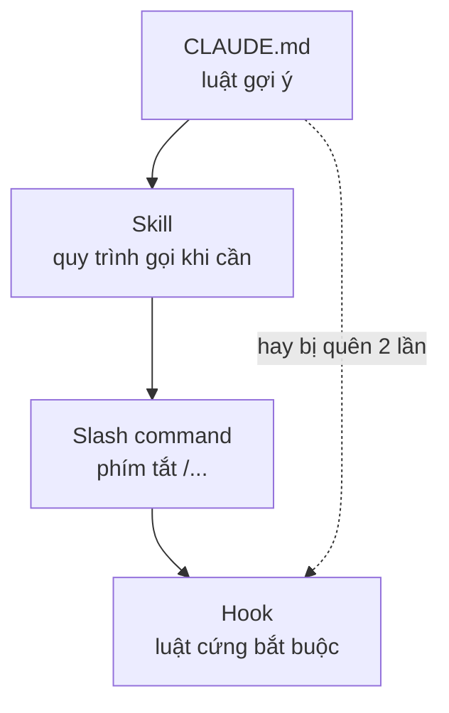

# FAQ 06 — Skill, command & CLAUDE.md

> **Bài này cho ai:** bạn đang rối giữa CLAUDE.md, rules, skill, slash command, hook — hoặc viết skill rồi mà nó không tự chạy (bài gồm 11 câu hỏi).
> **Cần gì trước:** đã dùng Claude Code vài lần và mở được terminal; đọc [FAQ 01](01-tai-khoan-pricing-cai-dat.md) nếu chưa rõ cài đặt (không bắt buộc).
> **Đọc xong bạn làm được:**
> - Phân biệt command vs skill vs CLAUDE.md vs rules vs hook, biết cái nào để ở đâu.
> - Viết 1 skill auto-trigger đúng: frontmatter, mô tả, `$ARGUMENTS`, `allowed-tools`, `context: fork`.
> - Giữ CLAUDE.md <200 dòng bằng cách tách sang skill/rules, biết lúc nào `/init` lúc nào copy template.
> - Debug skill không tự chạy, skill không hiện `/x`, headless bị deny, CLAUDE.md phình.
> **Thời gian:** ~15 phút

## Thuật ngữ dùng trong bài này

Đọc bảng này trước khi vào mục 1 — mọi thuật ngữ Anh trong bài đều được giải thích ở đây. Mỗi câu hỏi bên dưới theo 5 khối: câu hỏi → trả lời 1 câu → giải thích → ví dụ → đào sâu (kèm mục *Vẫn lỗi thì sao* cuối file).

| Thuật ngữ | Hiểu nôm na là gì | Ví dụ thấy ngay |
|---|---|---|
| CLAUDE.md | File luật gợi ý cho model, nạp lại mọi turn | `CLAUDE.md` ở gốc repo |
| AGENTS.md | Chuẩn chéo công cụ, Claude Code đọc trực tiếp không cần CLAUDE.md (w34/2026) | `AGENTS.md` ở gốc repo |
| Slash command | Phím tắt `/x` gõ trong session | `/deploy`, `/init` |
| Skill | Gói quy trình/tài liệu model tự gọi khi description khớp | `.claude/skills/deploy/SKILL.md` |
| Frontmatter | Khối `---` đầu file skill, chứa `name`, `description`... | `name: deploy` |
| Auto-trigger | Model tự gọi skill khi thấy việc khớp mô tả, không cần bạn gõ | Bạn nói "lên staging" → skill `deploy` tự chạy |
| Rules | Luật chỉ áp cho 1 thư mục, khai trong `.claude/rules/` + `paths` | `api/**` phải dùng ESM |
| Hook | Lệnh shell chạy ngoài model theo event, bắt buộc thực thi | `PreToolUse` chặn push main |

## Mục lục

- [Sơ đồ nhanh (nhìn 30 giây là nhớ)](#sơ-đồ-nhanh-nhìn-30-giây-là-nhớ)
- [Bảng tổng hợp: CLAUDE.md vs rules vs skill vs command vs hook](#bảng-tổng-hợp-claudemd-vs-rules-vs-skill-vs-command-vs-hook)
- [1. Custom command và skill có phải một thứ?](#1-custom-command-và-skill-có-phải-một-thứ)
- [2. Skill đặt ở đâu?](#2-skill-đặt-ở-đâu)
- [3. Frontmatter của skill gồm những gì?](#3-frontmatter-của-skill-gồm-những-gì)
- [4. `$ARGUMENTS`, `!cmd` và `${VARS}` dùng sao?](#4-arguments-cmd-và-vars-dùng-sao)
- [5. Skill không auto-trigger — debug sao?](#5-skill-không-auto-trigger--debug-sao)
- [6. Có skill nào đi kèm (bundled) đáng dùng?](#6-có-skill-nào-đi-kèm-bundled-đáng-dùng)
- [7. CLAUDE.md và skill — ranh giới ở đâu?](#7-claudemd-và-skill--ranh-giới-ở-đâu)
- [8. `/init` hay viết tay CLAUDE.md?](#8-init-hay-viết-tay-claudemd)
- [9. `context: fork` là gì?](#9-context-fork-là-gì)
- [10. `allowed-tools` trong skill để làm gì?](#10-allowed-tools-trong-skill-để-làm-gì)
- [11. `${CLAUDE_SKILL_DIR}` để làm gì?](#11-claude_skill_dir-để-làm-gì)
- [Vẫn lỗi thì sao? (skill/command)](#vẫn-lỗi-thì-sao-skillcommand)
- [Tham khảo chéo](#tham-khảo-chéo)

---

## Sơ đồ nhanh (nhìn 30 giây là nhớ)



## Bảng tổng hợp: CLAUDE.md vs rules vs skill vs command vs hook

Nhìn 30 giây là biết mỗi thứ load khi nào và tốn gì — đọc kỹ khi cần quyết định đặt nội dung vào đâu.

| Nơi | Load khi nào | Tốn bao nhiêu | Chứa gì |
|---|---|---|---|
| CLAUDE.md (<200 dòng) | Mọi turn | Đắt nhất (trả mãi mãi) | Dữ kiện luôn nạp: stack, lệnh, cấu trúc, quy ước bất di bất dịch |
| `.claude/rules/` + `paths` | Khi chạm path khớp | Rẻ (chỉ khi cần) | Luật theo thư mục (`api/**`, `web/**`) |
| Skills (auto-trigger) | Khi description khớp task | ~100 tokens lúc idle, body khi gọi | Quy trình, tài liệu dài |
| Custom commands (gọi tay `/x`) | Khi bạn gõ | 0 khi không gọi | Tác vụ gọi tay |
| Hooks | Khi event lửa | 0 model tokens | Luật bắt buộc (model hay miss) |
| `/memory` | Theo user | Nhẹ | Sở thích cá nhân, không phải luật team |

Quy tắc 1 dòng: **dữ kiện luôn nạp → CLAUDE.md, luật theo path → rules, quy trình → skills, gọi tay → commands, hay miss → hooks.**

---

## 1. Custom command và skill có phải một thứ?

> **Câu hỏi:** Em thấy `.claude/commands/x.md` với `.claude/skills/x/SKILL.md` — hai thứ này giống nhau hay khác, viết mới thì dùng cái nào?
> **Trả lời 1 câu:** Cùng tạo ra `/x`, nhưng nên viết mới bằng skill vì skill thêm được auto-trigger và support files.

**Giải thích:** `.claude/commands/x.md` ≡ `.claude/skills/x/SKILL.md` → cùng ra `/x`. File command cũ vẫn chạy, không vỡ. Nhưng skill mới hơn ở 3 điểm: frontmatter giàu hơn, mang được support files (scripts/references), và **auto-trigger** (model tự gọi khi description khớp, không cần bạn gõ).

```text
.claude/commands/deploy.md       -> /deploy (gọi tay, cũ, vẫn chạy)
.claude/skills/deploy/SKILL.md   -> /deploy (gọi tay + auto-trigger, mới, nên dùng)
```

**Khi nào áp dụng:** file cũ để yên. Viết mới → skill. Muốn gộp dần thì move nội dung sang `SKILL.md`, giữ nguyên tên → `/x` không đổi, user không phải học lại.

**Ví dụ:** đừng viết mới `.claude/commands/deploy.md`; tạo `.claude/skills/deploy/SKILL.md`, tên vẫn `deploy` nên ai quen gõ `/deploy` vẫn gọi được — thêm khả năng tự chạy khi bạn nói "release lên staging".

**Đào sâu:** [Bài 05 — skills & custom commands](../01-huong-dan-su-dung/05-skills-custom-commands.md) · [FAQ 05 — hooks](05-hooks-faq.md) · [thứ tự debug cuối file](#vẫn-lỗi-thì-sao-skillcommand)

---

## 2. Skill đặt ở đâu?

> **Câu hỏi:** Viết skill mới thì để ở đâu — máy em, trong repo, hay trong plugin?
> **Trả lời 1 câu:** 3 vị trí với phạm vi khác nhau: personal (máy bạn), project (cả team), plugin (ai cài plugin).

**Giải thích:** chọn chỗ theo "ai dùng":

| Vị trí | Đường dẫn | Ai thấy | Dùng khi nào |
|---|---|---|---|
| Personal | `~/.claude/skills/<tên>/` | Mọi project của bạn | Workflow cá nhân (review style của bạn) |
| Project | `.claude/skills/<tên>/` | Cả team (commit) | Chuẩn team (deploy, migrate, triage) |
| Plugin | `<plugin>/skills/<tên>/` | Ai cài plugin | Phân phối rộng, gọi theo namespace `/plugin:skill` |

```bash
ls ~/.claude/skills/
ls .claude/skills/
```

**Khi nào áp dụng:** viết skill mới → hỏi "ai dùng" trước khi chọn chỗ.

**Ví dụ:** skill `deploy` team dùng chung → project. Skill `my-review-style` chỉ bạn thích → personal. Skill kèm plugin bán cho nhiều team → plugin + namespace.

**Đào sâu:** [Bài 05 — skills & custom commands](../01-huong-dan-su-dung/05-skills-custom-commands.md) · [lệnh `plugin`](../01-huong-dan-su-dung/commands/knowledge-system/plugin/README.md) · [FAQ 07 — subagents & teams](07-subagents-teams-workflows.md)

---

## 3. Frontmatter của skill gồm những gì?

> **Câu hỏi:** Trong file `SKILL.md`, khối `---` ở đầu ghi được những field nào, field nào quan trọng nhất?
> **Trả lời 1 câu:** Frontmatter là "mặt tiền" model đọc để quyết định có gọi skill hay không; quan trọng nhất là `name` + `description`.

**Giải thích:** bảng field đầy đủ:

| Field | Ý nghĩa | Ví dụ |
|---|---|---|
| `name` | Tên skill (= `/tên`) | `deploy` |
| `description` | Khi nào gọi. **Câu đầu = use case**, truncate ~1536 ký tự | `Deploy staging/prod đúng chuẩn. Dùng khi release, rollback...` |
| `when_to_use` | Bổ sung trigger (1 số bản) | `Khi user nói "lên staging"` |
| `disable-model-invocation` | `true` = chỉ gọi tay, model không tự trigger (từ 2.1.196 cũng chặn scheduled fire) | `true` cho skill nguy hiểm |
| `allowed-tools` | Pre-approve tools trong lượt gọi | `Bash(npm run deploy:*)` |
| `context: fork` | Chạy cô lập trong subagent (không thấy history) | Skill research ồn |
| `agent:` / `model:` (kèm fork) | Ép agent/model khi fork | `model: haiku` cho rẻ |

**Ví dụ — template copy-paste:**

```markdown
---
name: deploy
description: Deploy staging/prod đúng chuẩn team (migrate + smoke + rollback). Dùng khi release, lên staging, rollback prod.
allowed-tools: Bash(npm run deploy:*), Bash(npm run migrate:*), Read
---
# Deploy
1. Chạy migrate trước (`npm run migrate`).
2. Deploy (`npm run deploy <env> $ARGUMENTS`).
3. Smoke test 3 endpoints. Đỏ → rollback ngay, không fix tiếp.
```

**Khi nào áp dụng:** mọi skill mới — điền đủ 3 cái `name/description/allowed-tools` trước, còn lại thêm khi cần.

**Đào sâu:** [Bài 05 — skills & custom commands](../01-huong-dan-su-dung/05-skills-custom-commands.md) · [templates/](../templates/) · [Tip 07 — thiết kế skills](../02-tips-thuc-chien/07-thiet-ke-skills.md)

---

## 4. `$ARGUMENTS`, `!cmd` và `${VARS}` dùng sao?

> **Câu hỏi:** Làm sao đưa input động vào skill — truyền tham số, nhét output lệnh, hay trỏ đường dẫn?
> **Trả lời 1 câu:** Ba cơ chế riêng: `$ARGUMENTS` nhận tham số khi gọi, `` !`cmd` `` nhét output shell thật, `${CLAUDE_SKILL_DIR}` / `${CLAUDE_PROJECT_DIR}` trỏ đường dẫn tuyệt đối.

**Giải thích:** 3 cơ chế đưa input động vào skill:

- **`$ARGUMENTS`:** input khi gọi (`/deploy staging` → `$ARGUMENTS` = `staging`).
- **`` !`cmd` ``:** chạy shell TRƯỚC, thay output thật vào prompt (dynamic inject). VD: nhét `git status` hiện tại vào.
- **`${CLAUDE_SKILL_DIR}` / `${CLAUDE_PROJECT_DIR}`:** đường dẫn tuyệt đối, dùng trong content + `allowed-tools` (skill đặt đâu cũng chạy).

**Ví dụ copy-paste:**

```markdown
---
name: deploy
description: Deploy đúng chuẩn. Dùng khi release.
---
# Deploy $ARGUMENTS
Env: $ARGUMENTS (VD: staging, prod).
Trạng thái hiện tại: !`git status --short`
Script: ${CLAUDE_SKILL_DIR}/scripts/smoke.sh
```

```bash
/deploy staging
# → $ARGUMENTS=staging, git status thật được nhét vào, smoke.sh chạy đúng path
```

**Khi nào áp dụng:** skill nào cũng nên có `$ARGUMENTS` (linh hoạt) + `` !`cmd` `` cho context tươi (tránh model đoán).

**Đào sâu:** [Bài 05 — skills & custom commands](../01-huong-dan-su-dung/05-skills-custom-commands.md) · [Tip 07 — thiết kế skills](../02-tips-thuc-chien/07-thiet-ke-skills.md) · [lệnh `verify`](../01-huong-dan-su-dung/commands/code-repo/verify/README.md)

---

## 5. Skill không auto-trigger — debug sao?

> **Câu hỏi:** Viết skill xong mà model không bao giờ tự gọi — bắt đầu kiểm từ đâu?
> **Trả lời 1 câu:** Kiểm 3 nguyên nhân theo thứ tự: description không khớp, `disable-model-invocation: true`, rồi `skillOverrides` tắt.

**Giải thích:** 3 nguyên nhân theo thứ tự:

1. **`description`/`when_to_use` không khớp cách bạn diễn đạt:** model match theo ngữ nghĩa. Bạn nói "lên hàng staging" mà description ghi "production release orchestration" → không khớp.
2. **`disable-model-invocation: true`:** bạn (hoặc ai đó) chặn model tự gọi → chỉ gọi tay được.
3. **`skillOverrides` tắt:** settings tắt skill đó → không trigger dù description đẹp.

**Ví dụ — fix copy-paste:**

```markdown
---
# ❌ MỜ: buzzwords, không ai nói thế
description: Orchestrate synergistic deployment workflows leveraging best practices.
---
---
# ✅ RÕ: khớp cách user nói + use case đầu câu
description: Deploy staging/prod và rollback. Dùng khi user nói "deploy", "lên staging", "rollback", "release".
when_to_use: Khi user nhắc deploy/staging/prod/release/rollback.
---
```

```bash
# Check 2 cái còn lại:
git grep -n 'disable-model-invocation' -- .claude/skills/<tên>/
git grep -n 'skillOverrides' -- .claude/settings*.json
```

**Ví dụ:** skill `triage` không bao giờ tự gọi → sửa description từ "Issue management optimization" thành "Lấy ticket Linear/Jira về tóm tắt + tạo branch. Dùng khi bắt đầu task từ ticket" → trigger ngay.

**Khi nào áp dụng:** skill mới viết mà 1 tuần không tự lửa lần nào → debug 3 bước này.

**Đào sâu:** [lệnh `skill-doctor`](../01-huong-dan-su-dung/commands/knowledge-system/skill-doctor/README.md) · [lệnh `debug`](../01-huong-dan-su-dung/commands/knowledge-system/debug/README.md) · [Tip 07 — thiết kế skills](../02-tips-thuc-chien/07-thiet-ke-skills.md)

---

## 6. Có skill nào đi kèm (bundled) đáng dùng?

> **Câu hỏi:** Claude Code có sẵn skill nào không phải cài, cái nào đáng thử trước?
> **Trả lời 1 câu:** Có — bộ skill bundled khỏi cài; mới onboard thì thử `/doctor` + `/verify` trước.

**Giải thích:** đọc bảng này khi cần biết gọi skill nào cho việc gì:

| Skill | Việc | Khi nào gọi |
|---|---|---|
| `/doctor` | Khám sức khoẻ repo/setup | Mỗi tháng, repo mới |
| `/code-review` | Review thường | Mọi PR vừa-tầm |
| `/ultrareview` | Review sâu (sandbox) | PR lớn, security-critical |
| `/batch` | Chia change lớn thành 5–30 worktree-subagents | Epic, migrate lớn |
| `/debug` | Chẩn đoán session lạ | Đang làm mà sai sai |
| `/loop` | Lặp task tới khi xanh | Flaky fix, migrate từng phần |
| `/claude-api [migrate\|managed-agents-onboard]` | Migrate/onboard agents | Đổi provider, onboard team |
| `/verify` | Chạy app thật kiểm chứng | Sau khi code xong (thay vì tin model nói) |
| `/simplify` | Rút gọn code | Sau implement, trước review |
| `/insights` | Thói quen team (HTML) | Cuối sprint |
| `/skill-doctor` | Tìm skill không dùng (cần ≥2.1.252) | Định kỳ dọn skill ế sau khi thêm nhiều skill |

```bash
/doctor
/code-review
/verify
```

**Khi nào áp dụng:** mới onboard → thử `/doctor` + `/verify` trước. PR lớn → `/code-review`, thấy chưa đủ sâu → `/ultrareview`.

**Đào sâu:** [lệnh `code-review`](../01-huong-dan-su-dung/commands/code-repo/code-review/README.md) · [lệnh `batch`](../01-huong-dan-su-dung/commands/code-repo/batch/README.md) · [lệnh `verify`](../01-huong-dan-su-dung/commands/code-repo/verify/README.md)

---

## 7. CLAUDE.md và skill — ranh giới ở đâu?

> **Câu hỏi:** Cái gì nên để trong CLAUDE.md, cái gì tách ra skill — làm sao biết file mình đã quá dài?
> **Trả lời 1 câu:** CLAUDE.md nạp lại mọi turn nên chỉ giữ dữ kiện luôn nạp; mọi thứ dài hơn đẩy sang skill/rules/hook.

**Giải thích:** CLAUDE.md load mọi turn → chỉ giữ dữ kiện luôn nạp (<200 dòng). Còn lại:

- Quy trình dài, tài liệu tham chiếu, checklist → **skill** (load khi cần).
- Luật chỉ đúng cho 1 thư mục → **`.claude/rules/` + `paths`** (VD: `api/**` dùng ESM, `migrations/**` không sửa tay).
- Luật nhắc 3 lần vẫn miss → **hook** (bắt buộc, 0 tokens).

Chuẩn chéo công cụ: `AGENTS.md` được Claude Code đọc trực tiếp, không cần `CLAUDE.md` (w34/2026) — chạy song song với Cursor, Codex... cùng một file luật.

**Kiểm tra nhanh:** dòng nào trong CLAUDE.md mà 10 turn gần nhất không dùng → chuyển ra skill/rules.

```bash
wc -l CLAUDE.md
/doctor claude-md
```

**Ví dụ:** CLAUDE.md có 80 dòng "quy trình deploy 12 bước" → chuyển sang skill `deploy`, CLAUDE.md giữ 1 dòng "deploy → /deploy". Tiết kiệm ~800 tokens/session.

**Khi nào áp dụng:** mỗi tháng `wc -l` + `/doctor claude-md` 1 lần.

**Đào sâu:** [Bài 03 — CLAUDE.md, memory & rules](../01-huong-dan-su-dung/03-claude-md-memory-rules.md) · [Tip 01 — context hygiene](../02-tips-thuc-chien/01-context-hygiene.md) · [lệnh `doctor`](../01-huong-dan-su-dung/commands/knowledge-system/doctor/README.md)

---

## 8. `/init` hay viết tay CLAUDE.md?

> **Câu hỏi:** Repo đã có code thì dùng `/init` hay tự viết CLAUDE.md, còn project trống thì sao?
> **Trả lời 1 câu:** Có code → `/init` để nó quét thật rồi cắt bớt; repo trống → copy `templates/CLAUDE.md`.

**Giải thích:**

- **Có sẵn codebase → `/init`:** quét code thật, sinh CLAUDE.md từ thực tế. Thử `CLAUDE_CODE_NEW_INIT=1` cho flow interactive (hỏi từng phần). Xong → **xóa 50%** (nó sinh thừa) + thêm verified commands (lệnh đã chạy thật).
- **Project mới (trống) → template:** copy `templates/CLAUDE.md` rồi sửa (xem [FAQ 01 câu 9](01-tai-khoan-pricing-cai-dat.md#9-project-mới-tinh-thì-copy-templatesclaudemd-thế-nào)). Không có gì để init quét.

**Ví dụ:**

```bash
# Có code:
/init
# Xong: đọc lại, xóa nửa, chạy thử từng lệnh trong file, giữ cái xanh

# Trống:
cp templates/CLAUDE.md ./CLAUDE.md
```

**Khi nào áp dụng:** repo chưa có CLAUDE.md. Đã có mà phình → không init lại, mà tách (câu 7).

**Đào sâu:** [lệnh `init`](../01-huong-dan-su-dung/commands/code-repo/init/README.md) · [Bài 03 — CLAUDE.md, memory & rules](../01-huong-dan-su-dung/03-claude-md-memory-rules.md) · [templates/](../templates/)

---

## 9. `context: fork` là gì?

> **Câu hỏi:** `context: fork` trong skill khác gì chạy bình thường, khi nào nên bật?
> **Trả lời 1 câu:** Skill `context: fork` chạy trong subagent cô lập, không thấy history của phiên chính.

**Giải thích:** Skill `context: fork` chạy trong subagent cô lập — không thấy history main. Agent `Explore`/`Plan` khi fork còn skip CLAUDE.md + git status để gọn. Hợp cho skill research ồn (quét 50 files, chỉ trả tóm tắt). Không hợp cho skill cần history (VD: tiếp tục implement đang dở).

**Ví dụ:**

```markdown
---
name: explore-auth
description: Quét auth flow trả tóm tắt. Dùng khi cần hiểu auth mà không muốn loãng context.
context: fork
agent: Explore
model: haiku
---
```

**Khi nào áp dụng:** skill đọc nhiều + trả ít (research, audit, quét) → fork. Skill viết/sửa tiếp mạch đang làm → không fork.

**Đào sâu:** [FAQ 07 — subagents & teams](07-subagents-teams-workflows.md) · [lệnh `fork`](../01-huong-dan-su-dung/commands/session-context/fork/README.md) · [Tip 07 — thiết kế skills](../02-tips-thuc-chien/07-thiet-ke-skills.md)

---

## 10. `allowed-tools` trong skill để làm gì?

> **Câu hỏi:** `allowed-tools` có phải để skill chạy lệnh không bị hỏi quyền không?
> **Trả lời 1 câu:** `allowed-tools` pre-approve sẵn tool skill cần, để trong lượt gọi model đỡ bị hỏi/deny.

**Giải thích:** `allowed-tools` pre-approve sẵn tools skill cần → trong lượt gọi skill, model đỡ bị hỏi/deny. Không phải bypass org — deny/managed vẫn thắng.

**Ví dụ:**

```markdown
---
name: triage
description: Lấy ticket về tóm tắt + tạo branch.
allowed-tools: Read, Glob, Grep, Bash(git checkout:*), Bash(gh issue:*)
---
```

Skill deploy cần `npm run migrate` mà không pre-approve → headless deny (xem [FAQ 03 câu 6](03-permissions-modes.md)). Thêm `allowed-tools` đúng → chạy mượt.

**Khi nào áp dụng:** skill nào chạy `-p`/background → điền `allowed-tools` hẹp-đúng, test 1 lần.

**Đào sâu:** [FAQ 03 — permissions & modes](03-permissions-modes.md) · [lệnh `permissions`](../01-huong-dan-su-dung/commands/model-mode/permissions/README.md) · [Bài 05 — skills & custom commands](../01-huong-dan-su-dung/05-skills-custom-commands.md)

---

## 11. `${CLAUDE_SKILL_DIR}` để làm gì?

> **Câu hỏi:** Skill có kèm script thì làm sao trỏ đúng chỗ dù skill nằm trên máy hay trong plugin?
> **Trả lời 1 câu:** Skill mang được support files; `${CLAUDE_SKILL_DIR}` trỏ đúng thư mục skill ở bất kỳ vị trí nào.

**Giải thích:** Skill có thể mang support files: `scripts/`, `references/`, `templates/`. `${CLAUDE_SKILL_DIR}` trỏ đúng folder skill dù nó đặt ở personal/project/plugin → scripts chạy đúng chỗ.

**Ví dụ:**

```text
.claude/skills/deploy/
  SKILL.md
  scripts/smoke.sh
  references/runbook.md
```

```markdown
Smoke: `${CLAUDE_SKILL_DIR}/scripts/smoke.sh $ARGUMENTS`
Chi tiết: xem `${CLAUDE_SKILL_DIR}/references/runbook.md`
```

**Khi nào áp dụng:** skill có script/checklist dùng lại → đóng gói chung, đừng để script lang thang ngoài repo.

**Đào sâu:** [Bài 05 — skills & custom commands](../01-huong-dan-su-dung/05-skills-custom-commands.md) · [templates/](../templates/) · [Tip 07 — thiết kế skills](../02-tips-thuc-chien/07-thiet-ke-skills.md)

---

## Vẫn lỗi thì sao? (skill/command)

Đi hết thứ tự chung trước: `/status` → `claude doctor` → `/permissions` → `/debug` → `/bug` (chi tiết [FAQ 08](08-loi-thuong-gap-troubleshooting.md)). Riêng skill/command thì kiểm thêm:

1. Skill không hiện `/x` → check tên folder + `name` + file `SKILL.md` đúng chỗ (câu 2).
2. Không auto-trigger → description → `disable-model-invocation` → `skillOverrides` (câu 5).
3. Headless deny → `allowed-tools` + test `-p` (câu 10).
4. CLAUDE.md phình → `/doctor claude-md` → tách (câu 7).
5. `/debug` → chẩn đoán session; `/bug` nếu nghi core.

```bash
ls .claude/skills/
git grep -n 'disable-model-invocation' -- .claude/skills/
wc -l CLAUDE.md
```

---

## Tham khảo chéo

- Lệnh liên quan:
  - [../01-huong-dan-su-dung/commands/knowledge-system/doctor/README.md](../01-huong-dan-su-dung/commands/knowledge-system/doctor/README.md) — khám CLAUDE.md phình
  - [../01-huong-dan-su-dung/commands/code-repo/init/README.md](../01-huong-dan-su-dung/commands/code-repo/init/README.md) — sinh CLAUDE.md từ code
  - [../01-huong-dan-su-dung/commands/knowledge-system/memory/README.md](../01-huong-dan-su-dung/commands/knowledge-system/memory/README.md) — tách sở thích cá nhân
  - [../01-huong-dan-su-dung/commands/knowledge-system/rules/README.md](../01-huong-dan-su-dung/commands/knowledge-system/rules/README.md) — luật theo path
  - [../01-huong-dan-su-dung/commands/code-repo/verify/README.md](../01-huong-dan-su-dung/commands/code-repo/verify/README.md) — kiểm chứng sau code
  - [../01-huong-dan-su-dung/commands/knowledge-system/debug/README.md](../01-huong-dan-su-dung/commands/knowledge-system/debug/README.md) — skill không trigger?
  - [../01-huong-dan-su-dung/commands/knowledge-system/skill-doctor/README.md](../01-huong-dan-su-dung/commands/knowledge-system/skill-doctor/README.md) — dọn skill không dùng
- Bài tổng quan:
  - [../01-huong-dan-su-dung/03-claude-md-memory-rules.md](../01-huong-dan-su-dung/03-claude-md-memory-rules.md) — ranh giới md/memory/rules
  - [../01-huong-dan-su-dung/05-skills-custom-commands.md](../01-huong-dan-su-dung/05-skills-custom-commands.md) — viết skill chuẩn
  - [../02-tips-thuc-chien/07-thiet-ke-skills.md](../02-tips-thuc-chien/07-thiet-ke-skills.md) — thiết kế skill auto-trigger
  - [../02-tips-thuc-chien/01-context-hygiene.md](../02-tips-thuc-chien/01-context-hygiene.md) — giữ context gọn
- FAQ liên quan: [FAQ 02](02-model-context-token.md) (token), [FAQ 05](05-hooks-faq.md) (rule hay miss → hook), [FAQ 07](07-subagents-teams-workflows.md) (fork skill).

> Mẹo 1 dòng: _dữ kiện vào CLAUDE.md, quy trình vào skills, và description viết bằng chính từ bạn sẽ nói._
