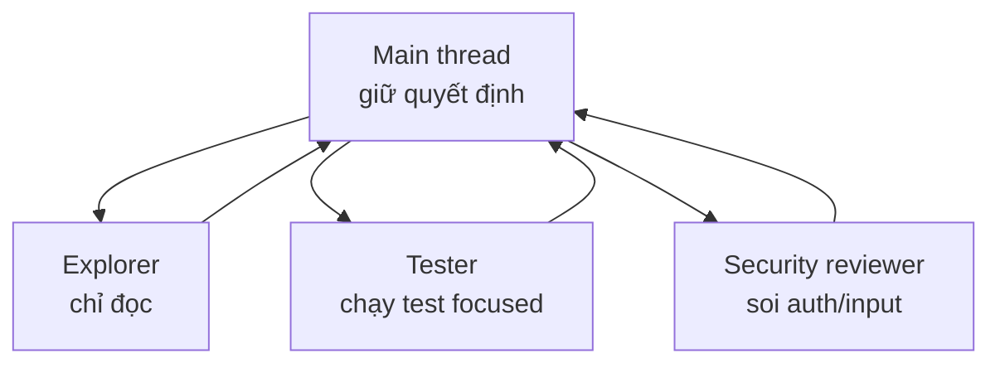

# FAQ 07 — Subagent, agent teams & quy trình làm việc

> **Bài này cho ai:** bạn đang phân vân khi nào nên tách việc sang subagent, và bối rối giữa fresh context, fork mode, agent teams, `/batch` và worktrees.
> **Cần gì trước:** đã chạy Claude Code vài session; đọc [FAQ 02](02-model-context-token.md) nếu chưa rõ overhead token (không bắt buộc).
> **Đọc xong bạn làm được:**
> - Quyết định đúng khi nào spawn subagent, khi nào để main làm, khi nào dùng skill.
> - Phân biệt fresh context vs fork mode (và tắt fork bằng `CLAUDE_CODE_FORK_SUBAGENT=0`), biết trần 5 cấp nested.
> - Chọn giữa agent teams, `/batch` và worktrees cho công việc song song.
> - Theo dõi, kill background agent và áp dụng workflow research → implement → verify.
> **Thời gian:** ~15 phút

## Thuật ngữ dùng trong bài này

Đọc bảng này trước khi vào câu 1 — mọi thuật ngữ Anh trong bài đều được giải thích ở đây. Mỗi câu hỏi bên dưới theo 5 khối: câu hỏi → trả lời 1 câu → giải thích → khi nào áp dụng → ví dụ (kèm mục *Vẫn lỗi thì sao* cuối file).

| Thuật ngữ | Hiểu nôm na là gì | Ví dụ thấy ngay |
|---|---|---|
| Subagent | Trợ lý con có context riêng, làm xong việc được giao rồi trả kết quả về main | "dùng subagent Explore quét auth flow, trả 10 dòng tóm tắt" |
| Main (thread) | Luồng chat chính của bạn, nơi giữ quyết định tổng | Bạn gõ prompt → main điều phối các worker |
| Fresh context | Subagent bắt đầu trắng, không thấy lịch sử chat chính | đặt `CLAUDE_CODE_FORK_SUBAGENT=0` rồi spawn |
| Fork mode | Subagent kế thừa nguyên context luồng chính, bật mặc định từ ≥2.1.232 | `CLAUDE_CODE_FORK_SUBAGENT=0` để tắt |
| `context: fork` | Khai trong frontmatter skill để skill chạy trong subagent cô lập | `context: fork` trong `SKILL.md` |
| Nested | Subagent gọi tiếp subagent con (agent đẻ agent) | trần 5 cấp (w24/2026) |
| Agent teams | Nhiều teammate + 1 lead điều phối (experimental, tắt mặc định) | lead chia feature auth cho 3 teammate |
| `/batch` | Biến 1 thay đổi lớn thành nhiều worktree + PR song song | `/batch` migrate 30 endpoints |
| Worktree | Bản checkout riêng của repo, để nhiều session không giẫm file | `git worktree add ../repo-wt/feat-auth -b feat/auth` |
| Overhead | Phần token tốn thêm chỉ vì công cụ, chưa tính việc thật | ~20k tokens mỗi lần spawn |

## Mục lục

- [Sơ đồ nhanh (nhìn 30 giây là nhớ)](#sơ-đồ-nhanh-nhìn-30-giây-là-nhớ)
- [Bảng tổng hợp: gọi trực tiếp vs subagent vs teams vs batch](#bảng-tổng-hợp-gọi-trực-tiếp-vs-subagent-vs-teams-vs-batch)
- [1. Khi nào dùng subagent thay vì để main làm?](#1-khi-nào-dùng-subagent-thay-vì-để-main-làm)
- [2. Subagent có thấy lịch sử chat chính không? (fresh vs forked)](#2-subagent-có-thấy-lịch-sử-chat-chính-không-fresh-vs-forked)
- [3. Skill `context: fork` là gì?](#3-skill-context-fork-là-gì)
- [4. Ba cách gọi subagent: auto / explicit / flags?](#4-ba-cách-gọi-subagent-auto--explicit--flags)
- [5. Subagent spawn subagent (nested) — giới hạn thế nào?](#5-subagent-spawn-subagent-nested--giới-hạn-thế-nào)
- [6. Agent teams là gì?](#6-agent-teams-là-gì)
- [7. Agent teams khác `/batch` ở đâu?](#7-agent-teams-khác-batch-ở-đâu)
- [8. Theo dõi và kill background agent thế nào?](#8-theo-dõi-và-kill-background-agent-thế-nào)
- [9. Worktrees để làm gì?](#9-worktrees-để-làm-gì)
- [10. Workflow chuẩn: research song song → implement → verify?](#10-workflow-chuẩn-research-song-song--implement--verify)
- [Vẫn lỗi thì sao? (subagent/teams)](#vẫn-lỗi-thì-sao-subagentteams)
- [Tham khảo chéo](#tham-khảo-chéo)

---

## Sơ đồ nhanh (nhìn 30 giây là nhớ)



## Bảng tổng hợp: gọi trực tiếp vs subagent vs teams vs batch

Đọc bảng này khi cần chọn nhanh cách chạy việc — mỗi dòng là một cách, kèm cái giá phải trả.

| Cách | Thấy history? | Overhead | Dùng khi nào |
|---|---|---|---|
| Làm trực tiếp (main) | Có (full) | 0 | Việc 1–3 file, 1–2 bước |
| Subagent fresh | Không (context mới + system prompt + tools riêng) | ~20k/spawn | Task phụ ồn, không cần nhớ |
| Subagent forked (mặc định ≥2.1.232) | Có (kế thừa full conversation) | ~20k + history | Tiếp mạch mà muốn cô lập rủi ro |
| Skill `context: fork` | Không | ~20k | Research ồn, trả tóm tắt |
| 3 cách gọi: auto / explicit / flags | Tùy loại | Tùy | Auto (khớp description), explicit (chỉ tên), flags (ép cả session) |
| Nested (agent đẻ agent) | Cháu không thấy ông | Cộng dồn | Tiết chế + `maxTurns`, trần 5 cấp (w24/2026) |
| Agent teams (experimental) | Lead + teammates, supervise | Lớn | Feature lớn, debug đa giả thuyết |
| `/batch` (worktree-subagents) | Mỗi đứa 1 worktree + PR | Lớn nhưng có script giữ | Epic 5–30 PR, migrate lớn |
| Kill switch `Ctrl+X Ctrl+K` ×2 | — | — | Background chạy loạn |

> Con số gốc: **~20k overhead mỗi lần spawn, ~3–4× token khi multi-agent, trần thực tế 3–5 agent chạy song song.** Số ~20k là ước tính cộng đồng, không phải số chính thức của Anthropic.

---

## 1. Khi nào dùng subagent thay vì để main làm?

> **Hỏi ngắn gọn:** Việc nào nên tách sang subagent, việc nào main tự làm cho rẻ hơn?
> **Trả lời 1 câu:** Chỉ spawn khi việc vừa ỒN (đọc nhiều, chỉ cần ít) vừa ĐỘC LẬP (xong là xong) — còn lại main làm hoặc dùng skill.

**Giải thích:** Hỏi 2 câu: (1) Việc có ỒN không (đọc >10 file mà chỉ cần tóm tắt)? (2) Có ĐỘC LẬP không (xong việc là xong, main không cần chi tiết)? Cả 2 Yes → subagent. Việc 1 bước ít file → main làm trực tiếp (đỡ ~20k). Việc phụ nhỏ mà không muốn cắt mạch chính → `/subtask` (≥2.1.212), nhẹ hơn cả subagent. Chuẩn "làm theo từng bước" → **skill**, không phải worker.

```text
✅ Subagent: "quét 50 files auth, trả 10 dòng + 5 file chính"
❌ Trực tiếp rẻ hơn: "sửa 2 dòng file login.ts"
❌ Dùng skill: "deploy theo 12 bước chuẩn" (quy trình, không phải worker)
```

**Kiểm tra nhanh:**

```bash
# Trước mỗi spawn, đếm lại: việc này đọc >10 files không? Có độc lập không?
# "Dùng subagent Explore quét auth flow, trả về 10 dòng tóm tắt + 5 file chính"
# → main nhận 15 dòng, context chính không bị ngập 50 files
```

**Khi nào áp dụng:** trước mỗi spawn — việc không đủ ồn/độc lập thì để main làm, giữ 20k cho việc đáng.

**Đào sâu:** [Bài 06 — subagent & agent teams](../01-huong-dan-su-dung/06-subagents-agent-teams-parallel.md) · [FAQ 02 — overhead token](02-model-context-token.md) · [Vẫn lỗi thì sao](#vẫn-lỗi-thì-sao-subagentteams)

---

## 2. Subagent có thấy lịch sử chat chính không? (fresh vs forked)

> **Hỏi ngắn gọn:** Subagent có "nhớ" được chat mình đang làm không, hay phải giải thích lại từ đầu?
> **Trả lời 1 câu:** Từ ≥2.1.232 fork mode bật mặc định nên subagent kế thừa nguyên context của main; muốn bản thật sự trắng thì tắt bằng `CLAUDE_CODE_FORK_SUBAGENT=0`.

**Giải thích:** "Forked" là *cách spawn* (worker nhận full conversation), không phải surface riêng — đừng tìm nút "fork" trong UI. Mặc định fresh: context mới + system prompt + tools riêng, KHÔNG thấy history main — sạch, rẻ, an toàn. Bật forked: kế thừa full conversation — hiểu mạch nhưng đắt và dễ loãng. Agent `Explore`/`Plan` khi fork còn skip CLAUDE.md + git status để gọn hơn nữa.

```text
Fresh (đặt CLAUDE_CODE_FORK_SUBAGENT=0):  main 100 turns → subagent thấy 0 (sạch, rẻ, an toàn)
Forked (mặc định ≥2.1.232):              main 100 turns → subagent thấy 100 (hiểu mạch, đắt, dễ loãng)
Skill fork:                              Explore/Plan khi fork còn skip CLAUDE.md + git status (gọn hơn nữa)
```

**Kiểm tra nhanh:**

```bash
export CLAUDE_CODE_FORK_SUBAGENT=0
# spawn subagent reviewer với câu hỏi nó CHƯA biết:
# "Review diff này, chỉ báo điểm security + bug"
# → reviewer không nhắc lại reasoning cũ của main = chạy đúng fresh
```

**Khi nào áp dụng:** research độc lập → fresh (đặt `CLAUDE_CODE_FORK_SUBAGENT=0` trước khi spawn); tiếp mạch dở dang mà sợ làm bẩn main → forked (mặc định).

**Ví dụ:** cần reviewer "mắt mới" cho diff → đặt `CLAUDE_CODE_FORK_SUBAGENT=0` rồi mới spawn, nếu không reviewer thấy luôn reasoning của người viết và dễ gật theo.

**Đào sâu:** [lệnh `fork`](../01-huong-dan-su-dung/commands/session-context/fork/README.md) · [FAQ 06 — `context: fork`](06-skills-commands-claude-md.md) · [Vẫn lỗi thì sao](#vẫn-lỗi-thì-sao-subagentteams)

---

## 3. Skill `context: fork` là gì?

> **Hỏi ngắn gọn:** Dòng `context: fork` trong skill nghĩa là gì, khác subagent thường thế nào?
> **Trả lời 1 câu:** Skill gắn `context: fork` chạy trong subagent cô lập (không thấy history) — hợp việc research đọc nhiều trả ít.

**Giải thích:** Skill gắn `context: fork` chạy trong subagent cô lập (không thấy history). Agent `Explore`/`Plan` khi fork còn skip CLAUDE.md + git status để gọn tối đa, và skill `context: fork` chạy background mặc định từ v2.1.218 (đặt `background: false` trong `SKILL.md` nếu muốn chờ trong turn). Hợp cho skill đọc nhiều-trả ít.

```markdown
---
name: explore-auth
description: Quét auth flow trả tóm tắt. Dùng khi cần hiểu auth mà không loãng context.
context: fork
agent: Explore
model: haiku
---
1. Quét, không sửa.
2. Trả: 10 dòng tóm tắt + 5 file chính + 3 hàm entry.
```

**Kiểm tra nhanh:**

```bash
/explore-auth
# → subagent chạy riêng, main nhận ~15 dòng tóm tắt
# → context chính không bị phình bằng log quét 50 files
```

**Khi nào áp dụng:** skill quét/audit/khảo sát → fork. Skill viết tiếp mạch → không fork.

**Ví dụ:** main đang implement dở (context 60%), cần hiểu thêm payment flow → gọi skill fork → main vẫn sạch, nhận tóm tắt 15 dòng.

**Đào sâu:** [FAQ 06 — `context: fork`](06-skills-commands-claude-md.md) · [Bài 05 — skills](../01-huong-dan-su-dung/05-skills-custom-commands.md) · [Vẫn lỗi thì sao](#vẫn-lỗi-thì-sao-subagentteams)

---

## 4. Ba cách gọi subagent: auto / explicit / flags?

> **Hỏi ngắn gọn:** Muốn gọi đúng subagent mình tạo thì gõ thế nào, có mấy cách?
> **Trả lời 1 câu:** Có 3 cách: auto (description khớp task), explicit (bạn chỉ tên), và flags `--agent` / `--agents`.

**Giải thích:**

1. **Tự động (auto):** description khớp task → model tự spawn. Cần description rõ (xem [FAQ 02](02-model-context-token.md) câu 4).
2. **Explicit:** bạn chỉ tên trong prompt — "dùng subagent X làm Y". Chắc ăn nhất.
3. **Flags:** `--agent <tên>` (ép cả session dùng agent đó) và `--agents '{...}'` (inline JSON định nghĩa agent tại chỗ, khỏi tạo file).

**Khi nào áp dụng:** hàng ngày → auto + explicit. CI/script chạy 1 lần → `--agents` inline (khỏi tạo file rác).

**Ví dụ:**

```bash
# 1. Auto: chỉ mô tả việc, model tự chọn
# "quét codebase tìm chỗ xử lý retry"

# 2. Explicit: chỉ tên
# "dùng subagent security-reviewer soi diff này"

# 3. Flags (ngoài terminal):
claude --agent explore "quét auth flow"
claude --agents '{"reviewer":{"description":"review PR","tools":["Read","Grep","Glob"]}}' -p "review diff"
# → mỗi cách chạy xong trả đúng output, flags không sinh file agent thừa
```

**Đào sâu:** [lệnh `agents`](../01-huong-dan-su-dung/commands/knowledge-system/agents/README.md) · [Bài 06 — subagent & agent teams](../01-huong-dan-su-dung/06-subagents-agent-teams-parallel.md) · [Vẫn lỗi thì sao](#vẫn-lỗi-thì-sao-subagentteams)

---

## 5. Subagent spawn subagent (nested) — giới hạn thế nào?

> **Hỏi ngắn gọn:** Subagent có được quyền tự sinh subagent con không, sâu nhất được bao nhiêu cấp?
> **Trả lời 1 câu:** Được, nhưng token CỘNG DỒN (cháu 20k + con 20k + main...) — giới hạn cấp mặc định 3, trần tối đa 5 cấp (w24/2026).

**Giải thích:** Được, nhưng token CỘNG DỒN (cháu 20k + con 20k + main...). Không giới hạn → cháy bill + loãng. Harness cho phép depth mặc định **3**, trần tối đa **5 cấp** (w24/2026); hạ về 1 bằng `CLAUDE_CODE_MAX_SUBAGENT_SPAWN_DEPTH=1`. Quy tắc thực dụng: tiết chế, luôn đặt `maxTurns`, dặn con "không tự đẻ thêm".

```text
main → con (Explore, maxTurns 10) → hết. Con không đẻ cháu.
❌ main → con → cháu → chắt (bill ×4, không ai đọc hết output)
```

**Khi nào áp dụng:** mọi agent file team dùng chung — luôn có `maxTurns` + "trả tối đa N dòng".

**Ví dụ:**

```markdown
---
name: researcher
description: Research độc lập, không đẻ thêm agents.
tools: Read, Glob, Grep
maxTurns: 10
---
1. Chỉ đọc, không sửa.
2. KHÔNG spawn thêm subagents.
3. Trả tối đa 20 dòng.
```

**Kiểm tra nhanh:**

```bash
# Grep agent file xem đã chặn nested chưa:
git grep -n 'maxTurns\|KHÔNG spawn' -- .claude/agents/
# → mọi agent đều có maxTurns; "KHÔNG spawn thêm" có mặt = nested được chặn
```

**Đào sâu:** [Bài 06 — nested agents](../01-huong-dan-su-dung/06-subagents-agent-teams-parallel.md) · [FAQ 02 — token](02-model-context-token.md) · [Vẫn lỗi thì sao](#vẫn-lỗi-thì-sao-subagentteams)

---

## 6. Agent teams là gì?

> **Hỏi ngắn gọn:** Agent teams là gì, khi nào nên dùng thay vì spawn vài subagent lẻ?
> **Trả lời 1 câu:** Agent teams là **lead plan + assign + supervise teammates** (experimental, tắt mặc định — phải bật mới có).

**Giải thích:** Agent teams: **lead plan + assign + supervise teammates** (experimental, tắt mặc định — phải bật mới có). Hợp cho: feature lớn đa mảng, debug đa giả thuyết song song, review song song (security/perf/tests mỗi đứa 1 góc). Task 1 người làm 30 phút xong thì teams overhead lớn, chậm hơn — chỉ đáng khi việc đủ lớn để chia.

```text
Lead: chia feature auth thành 3 mảnh → assign 3 teammates
Teammate 1: implement login
Teammate 2: implement refresh-token
Teammate 3: review security cả 2
Lead: gộp + verify cuối
```

**Khi nào áp dụng:** epic/feature đa mảng + đã bật experimental + chấp nhận token ~3–4x (xem [FAQ 02](02-model-context-token.md) câu 5). Không dùng cho task nhỏ 1 người làm mau xong.

**Ví dụ:** refactor 1 module nhỏ → đừng bật teams, main làm nhanh hơn. Thiết kế lại auth cần chia mảng + verify chéo → teams có lead điều phối mới đáng.

**Đào sâu:** [Bài 06 — agent teams](../01-huong-dan-su-dung/06-subagents-agent-teams-parallel.md) · [FAQ 02 — multi-agent token](02-model-context-token.md) · [Vẫn lỗi thì sao](#vẫn-lỗi-thì-sao-subagentteams)

---

## 7. Agent teams khác `/batch` ở đâu?

> **Hỏi ngắn gọn:** Agent teams và `/batch` nghe giống nhau — khác nhau chỗ nào, chọn cái nào?
> **Trả lời 1 câu:** Teams để lead supervise linh hoạt; `/batch` dùng script + worktree để mỗi worker ôm 1 PR riêng — khác ở cơ chế giữ mạch.

**Giải thích:** Dễ nhầm vì cả 2 đều "nhiều agents". Khác ở cơ chế giữ mạch:

| | Agent teams | `/batch` |
|---|---|---|
| Giữ plan bằng | Lead supervise (model) | Script + worktree-subagents |
| Mỗi worker | Task trong session | 1 worktree + 1 PR riêng |
| Verify | Lead check | Verify chéo giữa workers |
| Quy mô | Vài teammates | 5–30 worktree-subagents |
| Dùng khi | Feature lớn cần supervise linh hoạt | Epic/migrate chia PR được |

**Khi nào áp dụng:** chia PR được → batch. Cần supervise linh hoạt → teams.

**Ví dụ:**

```bash
# /batch: 1 change lớn → N PR
/batch
# → chia epic thành 5-30 worktree-subagents, mỗi đứa 1 PR, verify chéo
# → kiểm tra: git worktree list hiện mỗi PR một checkout riêng
```

Migrate 30 endpoints → `/batch` (mỗi endpoint 1 PR, review từng cái). Thiết kế lại auth (cần lead điều phối linh hoạt) → teams.

**Đào sâu:** [lệnh `batch`](../01-huong-dan-su-dung/commands/code-repo/batch/README.md) · [FAQ 02 — multi-agent token](02-model-context-token.md) · [Vẫn lỗi thì sao](#vẫn-lỗi-thì-sao-subagentteams)

---

## 8. Theo dõi và kill background agent thế nào?

> **Hỏi ngắn gọn:** Spawn nhiều agent chạy nền không kiểm soát nổi, muốn xem và tắt thì làm sao?
> **Trả lời 1 câu:** Xem bằng `/agents` và `/tasks`, tắt tất cả bằng `Ctrl+X Ctrl+K` nhấn 2 lần trong 3 giây.

**Giải thích:** Agents chạy nền cần quản lý như process:

```bash
/agents    # Running (đang chạy) + Library (có gì)
/tasks     # tasks đang chạy
```

**Kill switch:** `Ctrl+X Ctrl+K` **×2 trong 3s** → kill all background. Dùng khi agents chạy loạn (sửa lung tung, bill tăng).

**Kiểm tra nhanh:**

```text
Dấu hiệu kill: 3 agents cùng sửa 1 file / bill tăng mà không ra gì / output lạ
→ Ctrl+X Ctrl+K ×2 → /tasks xác nhận sạch → spawn lại với scope hẹp hơn
```

**Khi nào áp dụng:** mỗi khi spawn >2 background → mở `/tasks` để mắt. Thấy loạn → kill không tiếc (rẻ hơn để chúng chạy tiếp).

**Ví dụ:** đang chạy 3 agent review mà thấy chúng cùng sửa 1 file → `Ctrl+X Ctrl+K` ×2, `/tasks` xác nhận sạch, rồi spawn lại với scope hẹp hơn cho từng đứa.

**Đào sâu:** [lệnh `tasks`](../01-huong-dan-su-dung/commands/session-context/tasks/README.md) · [lệnh `agents`](../01-huong-dan-su-dung/commands/knowledge-system/agents/README.md) · [Vẫn lỗi thì sao](#vẫn-lỗi-thì-sao-subagentteams)

---

## 9. Worktrees để làm gì?

> **Hỏi ngắn gọn:** Nhiều agent cùng sửa code thì làm sao để không đụng file của nhau?
> **Trả lời 1 câu:** Cho mỗi session một worktree (bản checkout riêng) — song song mà không conflict.

**Giải thích:** Vấn đề: 3 agents cùng sửa 1 checkout → conflict/giẫm file. Fix: mỗi session 1 worktree (checkout riêng). Agent view/`/batch` tự tạo; làm tay thì:

```bash
git worktree add ../myrepo-worktrees/feat-auth -b feat/auth
git worktree list
# → thấy 2 dòng: checkout gốc + ../myrepo-worktrees/feat-auth (feature riêng)
# Xong việc:
git worktree remove ../myrepo-worktrees/feat-auth
# → danh sách về 1 dòng, không còn checkout thừa
```

**Khi nào áp dụng:** cứ >1 agent chạm code cùng lúc → worktrees. 1 agent đọc-only → khỏi.

**Ví dụ:** 3 việc song song — auth (worktree 1), payment (worktree 2), docs (worktree 3) → merge từng cái, không giẫm.

**Đào sâu:** [lệnh `branch`](../01-huong-dan-su-dung/commands/session-context/branch/README.md) · [Bài 11 — worktrees](../01-huong-dan-su-dung/11-git-worktrees-checkpoints.md) · [Vẫn lỗi thì sao](#vẫn-lỗi-thì-sao-subagentteams)

---

## 10. Workflow chuẩn: research song song → implement → verify?

> **Hỏi ngắn gọn:** Làm một feature vừa-to thì nên chia phase theo thứ tự nào?
> **Trả lời 1 câu:** Công thức team hay dùng: research song song (rẻ) → implement ở main → verify bằng fresh-reviewer + `/verify`.

**Giải thích:** Công thức team hay dùng (rẻ + an toàn):

```text
Phase 1 — Research song song (Haiku, fresh, worktree riêng nếu cần):
  agent A: quét auth · agent B: quét payment · agent C: quét tests
  → mỗi đứa trả 15 dòng
Phase 2 — Implement (Sonnet, main): gắt từng file theo tóm tắt
Phase 3 — Verify: fresh-reviewer + /verify (chạy app thật) + tests xanh
```

**Khi nào áp dụng:** mọi feature vừa-trở-lên. Task 5 phút thì khỏi (overhead không đáng).

**Ví dụ:**

```bash
# Phase 1: 3 research song song (rẻ)
/model haiku
# Phase 2: implement
/model sonnet
# Phase 3: review khó
/model opus
/verify
# → verify PASS + tests xanh = feature thực sự xong, không phải "model nói xong"
```

Chi tiết verify xem [../02-tips-thuc-chien/04-verification-done-that.md](../02-tips-thuc-chien/04-verification-done-that.md).

**Đào sâu:** [Bài tips 05 — parallel agents](../02-tips-thuc-chien/05-parallel-agents.md) · [Bài tips 04 — verification](../02-tips-thuc-chien/04-verification-done-that.md) · [lệnh `verify`](../01-huong-dan-su-dung/commands/code-repo/verify/README.md) · [Vẫn lỗi thì sao](#vẫn-lỗi-thì-sao-subagentteams)

---

## Vẫn lỗi thì sao? (subagent/teams)

1. Subagent không trigger → description quá dài/mờ (xem [FAQ 02](02-model-context-token.md) câu 4) + `/agents` check library.
2. Kẹt deny headless → allowlist + `allowed-tools` (xem [FAQ 03](03-permissions-modes.md) câu 6).
3. Bill tăng → `/usage` xem subagent nào ngốn + `/tasks` kill thừa.
4. Giẫm file → worktrees (câu 9).
5. `/debug` → chẩn đoán; `/bug` nếu nghi core.

```bash
/agents
/tasks
/usage
```

---

## Tham khảo chéo

- Lệnh liên quan:
  - [../01-huong-dan-su-dung/commands/knowledge-system/agents/README.md](../01-huong-dan-su-dung/commands/knowledge-system/agents/README.md) — quản lý Running/Library
  - [../01-huong-dan-su-dung/commands/session-context/tasks/README.md](../01-huong-dan-su-dung/commands/session-context/tasks/README.md) — theo dõi tasks nền
  - [../01-huong-dan-su-dung/commands/code-repo/batch/README.md](../01-huong-dan-su-dung/commands/code-repo/batch/README.md) — chia epic thành worktree-subagents
  - [../01-huong-dan-su-dung/commands/session-context/branch/README.md](../01-huong-dan-su-dung/commands/session-context/branch/README.md) — worktrees song song
  - [../01-huong-dan-su-dung/commands/model-mode/model/README.md](../01-huong-dan-su-dung/commands/model-mode/model/README.md) — route Haiku/Sonnet/Opus theo phase
  - [../01-huong-dan-su-dung/commands/code-repo/verify/README.md](../01-huong-dan-su-dung/commands/code-repo/verify/README.md) — verify sau implement
  - [../01-huong-dan-su-dung/commands/session-context/fork/README.md](../01-huong-dan-su-dung/commands/session-context/fork/README.md) — fork cô lập
- Bài tổng quan:
  - [../01-huong-dan-su-dung/06-subagents-agent-teams-parallel.md](../01-huong-dan-su-dung/06-subagents-agent-teams-parallel.md) — subagents + teams chi tiết
  - [../01-huong-dan-su-dung/11-git-worktrees-checkpoints.md](../01-huong-dan-su-dung/11-git-worktrees-checkpoints.md) — worktrees + checkpoints
  - [../02-tips-thuc-chien/05-parallel-agents.md](../02-tips-thuc-chien/05-parallel-agents.md) — chạy song song hiệu quả
  - [../02-tips-thuc-chien/04-verification-done-that.md](../02-tips-thuc-chien/04-verification-done-that.md) — verify sau implement
- FAQ liên quan: [FAQ 02](02-model-context-token.md) (overhead), [FAQ 03](03-permissions-modes.md) (headless deny), [FAQ 06](06-skills-commands-claude-md.md) (fork skill).

> Mẹo 1 dòng: _ồn + độc lập thì spawn, không thì main làm — và cứ >1 đứa chạm code là mỗi đứa 1 worktree._
