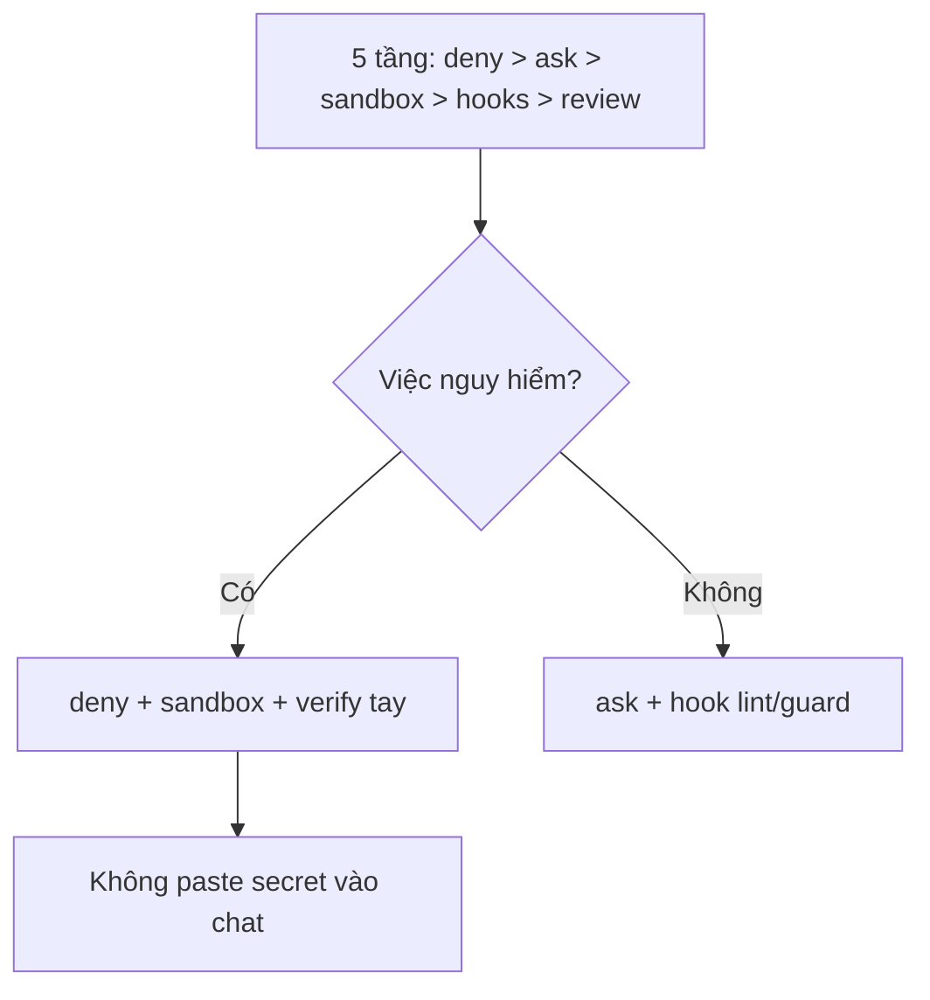

# FAQ 09 — Bảo mật & quyền riêng tư

> **Bài này cho ai:** bạn lo lộ code/secret, muốn chặn Claude chạm quá giới hạn đã cho phép, hoặc phải trả lời câu hỏi bảo mật/compliance (ZDR, telemetry, supply-chain).
> **Cần gì trước:** đã cài và đăng nhập Claude Code; hiểu sơ qua `/permissions`; chưa rõ deny/hook thì đọc [FAQ 03](03-permissions-modes.md) trước.
> **Đọc xong bạn làm được:**
> - Khóa working dirs và dựng các lớp chặn mà `--dangerously-skip-permissions` không vô hiệu hóa được.
> - Khai secret qua env vars, rà và xử lý secret bị lộ trong git đúng thứ tự.
> - Biết gói nào có ZDR, telemetry tắt ở đâu theo provider, và cách soát skill/plugin/hook trước khi cài.
> - Review code AI viết bằng 4 lớp, rồi chạy checklist bảo mật repo mới trong 5 phút.
> **Thời gian:** ~15 phút

## Thuật ngữ dùng trong bài này

Đọc bảng này trước khi vào mục 1 — mọi thuật ngữ Anh trong bài đều được giải thích ở đây.

| Thuật ngữ | Hiểu nôm na là gì | Ví dụ thấy ngay |
|---|---|---|
| Working dirs | Các thư mục Claude được phép đọc; nằm ngoài danh sách này nó không chạm tới | `/permissions` xem danh sách dirs hiện tại |
| Deny rule | Quy tắc chặn sẵn một lệnh hay file nguy hiểm trong settings | `deny: ["Bash(rm -rf:*)"]` |
| Hook | Script tự chạy trước/sau tool, nằm ngoài model nên bắt buộc thực thi | `PreToolUse` chặn lệnh critical ngay cả khi bypass |
| Bypass | Cờ bỏ qua mọi câu hỏi quyền, chỉ dùng trong sandbox cô lập | `--dangerously-skip-permissions` |
| ZDR | Cam kết không lưu giữ data của bạn sau khi xử lý | hợp đồng Enterprise qualified |
| Telemetry | Dữ liệu sử dụng và lỗi tự gửi về vendor | crash log gửi về Anthropic |
| Supply-chain | Rủi ro khi cài code từ bên ngoài vào máy mình | skill, plugin, hook từ cộng đồng |
| Secret | Chuỗi bí mật dùng để xác thực, phải giấu | API key, GitHub token, Slack token |

## Mục lục

- [Sơ đồ nhanh (nhìn 30 giây là nhớ)](#sơ-đồ-nhanh-nhìn-30-giây-là-nhớ)
- [Bảng tổng hợp: 7 lớp phòng thủ](#bảng-tổng-hợp-7-lớp-phòng-thủ)
- [1. Claude Code có đọc hết máy tôi không? (working dirs + --add-dir)](#1-claude-code-có-đọc-hết-máy-tôi-không-working-dirs---add-dir)
- [2. Deny nào không bypass được? (hook deny + deny rules + org ask)](#2-deny-nào-không-bypass-được-hook-deny-deny-rules-org-ask)
- [3. Secrets trong MCP/settings: env vars + reset-project-choices?](#3-secrets-trong-mcpsettings-env-vars-reset-project-choices)
- [4. Zero Data Retention (ZDR) — ai được, hỏi ai?](#4-zero-data-retention-zdr-ai-được-hỏi-ai)
- [5. Skill, plugin, hook có nguy hiểm không? (rủi ro supply-chain)](#5-skill-plugin-hook-có-nguy-hiểm-không-rủi-ro-supply-chain)
- [6. Review code AI viết thế nào? (fresh-reviewer + /code-review + human + tests)](#6-review-code-ai-viết-thế-nào-fresh-reviewer-code-review-human-tests)
- [7. Chỉ được dùng --dangerously-skip-permissions khi nào? (sandbox CI cô lập)](#7-chỉ-được-dùng---dangerously-skip-permissions-khi-nào-sandbox-ci-cô-lập)
- [8. Telemetry và error-reporting tắt ở đâu? (theo provider)](#8-telemetry-và-error-reporting-tắt-ở-đâu-theo-provider)
- [9. Lộ secret rồi — xử lý sao? (rotate + reset + rà git history)](#9-lộ-secret-rồi-xử-lý-sao-rotate-reset-rà-git-history)
- [10. Checklist bảo mật repo mới (5 phút)](#10-checklist-bảo-mật-repo-mới-5-phút)
- [Vẫn lỗi thì sao? (bảo mật)](#vẫn-lỗi-thì-sao-bảo-mật)
- [Tham khảo chéo](#tham-khảo-chéo)

---

## Sơ đồ nhanh (nhìn 30 giây là nhớ)

Sơ đồ này tóm tắt thứ tự ưu tiên các lớp phòng thủ khi gặp việc nguy hiểm — nhìn xong rồi mới vào từng câu hỏi.



## Bảng tổng hợp: 7 lớp phòng thủ

Đọc bảng này khi cần biết mỗi lớp phòng thủ chặn gì, cấu hình ở đâu, và có bị bypass vô hiệu hóa được không:

| Lớp | Chặn gì | Lệnh/config | Bypass được? |
|---|---|---|---|
| Working dirs (`--add-dir`) | Đọc ngoài thư mục cho phép | `/permissions` xem dirs | Không (không add thì không chạm) |
| Permission deny rules | Lệnh/file nguy hiểm | `deny` trong settings | Bypass bỏ qua (trừ org) |
| `PreToolUse` hook deny | Việc critical | Script guard | **KHÔNG — thắng cả bypass** |
| Org `ask` (connectors/MCP nhạy cảm) | Exfil qua MCP | Managed policy | **KHÔNG — hook allow không nới được** |
| Secrets qua env | Lộ token vào git | `${VAR}` + `git grep` check | — (kỷ luật + CI check) |
| ZDR / provider telemetry | Data gửi về vendor | Contract + provider docs | Hỏi admin, đừng đoán |
| Supply-chain (skills/plugins/hooks) | Code độc trá hình | Đọc trước khi cài | — (review tay) |
| Review AI code + tests | Code sai/độc lọt vào | fresh-reviewer + `/verify` + human | — (luôn làm) |

---

## 1. Claude Code có đọc hết máy tôi không? (working dirs + `--add-dir`)

> **Câu hỏi:** Claude Code có thấy và đọc được mọi file trên máy tôi không, hay nó bị giới hạn ở đâu đó?
> **Trả lời 1 câu:** Không — nó chỉ chạm được các thư mục nằm trong working dirs; ngoài danh sách đó nó không đọc được, muốn mở rộng thì phải thêm bằng `--add-dir`.

**Giải thích:** Danh sách working dirs được quản lý ở `/permissions` (mục working directories). Nguyên tắc an toàn là giữ danh sách hẹp nhất có thể: đừng `--add-dir` cả home chỉ để phục vụ một task nhỏ, và đừng `bypassPermissions` trên máy dev. Thêm dir thừa đúng bằng mở rộng vùng nổ (blast radius) khi có lệnh ngáo chạy trong session.

**Khi nào áp dụng:** mỗi khi mở session lạ hoặc repo lạ — mở `/permissions` kiểm tra dirs trước khi cho Claude chạy lệnh.

**Ví dụ:**

```bash
/permissions    # xem working dirs hiện tại
```

```bash
# Chỉ mở rộng khi cần, hẹp nhất có thể:
claude --add-dir ../shared-contracts
# ❌ claude --add-dir ~   (mở cả home cho 1 task nhỏ)
```

Task chỉ cần `api/` mà bạn mở cả repo + home → chỉ cần 1 lệnh ngáo `grep -r` là nó quét secrets khắp máy. Giữ dirs hẹp = giảm blast radius (vùng nổ khi có sự cố).

**Đào sâu:** [FAQ 03 — permissions & modes](03-permissions-modes.md) · [lệnh `permissions`](../01-huong-dan-su-dung/commands/model-mode/permissions/README.md) · [thứ tự debug cuối file](#vẫn-lỗi-thì-sao-bảo-mật)

---

## 2. Deny nào không bypass được? (hook deny + deny rules + org ask)

> **Câu hỏi:** Tôi muốn chạy CI không có ai ngồi bấm phím, mà dùng bypass thì mấy phanh allow/ask có bị vô hiệu hóa hết không?
> **Trả lời 1 câu:** Không phải hết — đúng 3 thứ sống sót qua `--dangerously-skip-permissions`: `PreToolUse` hook deny, deny rules + org `ask` cho connector/MCP nhạy cảm, và managed policy của org.

**Giải thích:** Deny rule thường trong settings vẫn bị bypass bỏ qua, nên đừng trông cậy vào nó khi đã bật bypass.

1. **`PreToolUse` hook deny** — thắng cả bypass (chi tiết FAQ 03 câu 4).
2. **Deny rules + org `ask` cho connectors/MCP nhạy cảm** — hooks/rules chỉ siết thêm, không nới được.
3. **Managed policy của org** — không gỡ được ở local.

**Khi nào áp dụng:** lúc thiết kế phanh cho CI/cloud — việc critical thì dùng hook, đừng tin mỗi rule.

**Ví dụ:**

```bash
# Guard mẫu sống qua bypass:
#!/bin/bash
input=$(cat)
echo "$input" | grep -qE 'rm -rf|sudo ' && echo '{"decision":"block","reason":"critical blocked even with bypass"}' && exit 0
echo '{"decision":"approve"}'
```

Muốn cấm `push main` kể cả khi CI chạy sandbox bypass → đặt hook deny (sống) chứ đừng chỉ đặt settings deny (chết khi bypass). Việc critical thì luôn đặt hook.

**Đào sâu:** [FAQ 05 — hooks](05-hooks-faq.md) · [lệnh `hooks`](../01-huong-dan-su-dung/commands/knowledge-system/hooks/README.md) · [FAQ 03 — deny & modes](03-permissions-modes.md) · [thứ tự debug cuối file](#vẫn-lỗi-thì-sao-bảo-mật)

---

## 3. Secrets trong MCP/settings: env vars + `reset-project-choices`?

> **Câu hỏi:** MCP server của tôi cần token API, tôi định bỏ thẳng vào `.mcp.json` rồi push lên git — nguy hiểm không?
> **Trả lời 1 câu:** Nguy hiểm — token chui thẳng vào git. Secret chỉ khai qua env vars kiểu `${TOKEN}`, giá trị thật đặt ngoài repo, không bao giờ commit vào `.mcp.json`/settings.

**Giải thích:** Khai qua biến môi trường nên file cấu hình commit lên git được mà không lộ token. Một việc hay quên nữa: khi đổi approvals hoặc policy của project, chạy `claude mcp reset-project-choices` để xóa lựa chọn cũ — nếu không, approvals cũ vẫn còn hiệu lực và người đến sau có thể dùng ké token của người cũ.

**Khi nào áp dụng:** mọi lần thêm server MCP, rotate token hay đổi policy. Gắn lệnh `git grep` dưới đây vào CI để tự chặn (xem [FAQ 10](10-ci-sdk-routines-web.md)).

**Ví dụ:**

```json
{
  "mcpServers": {
    "github": { "env": { "GITHUB_TOKEN": "${GITHUB_TOKEN}" } }
  }
}
```

```bash
export GITHUB_TOKEN="ghp_xxx"
git grep -E 'ghp_|sk-ant_|xoxb-|lin_' -- .mcp.json .claude/  # phải RỖNG
claude mcp reset-project-choices   # khi đổi approvals project
```

Onboard member mới → họ tự export env của họ rồi chạy `reset-project-choices` → không ai dùng ké token của người cũ.

**Đào sâu:** [lệnh `mcp`](../01-huong-dan-su-dung/commands/knowledge-system/mcp/README.md) · [FAQ 04 — MCP](04-mcp-faq.md) · [FAQ 10 — CI an toàn](10-ci-sdk-routines-web.md) · [thứ tự debug cuối file](#vẫn-lỗi-thì-sao-bảo-mật)

---

## 4. Zero Data Retention (ZDR) — ai được, hỏi ai?

> **Câu hỏi:** Khách hàng hỏi tôi "anh có đảm bảo không lưu dữ liệu của em không" — tôi trả lời sao, gói nào có ZDR?
> **Trả lời 1 câu:** ZDR có cho: **Enterprise qualified (Sub)** / **qualified Console accounts** / **AWS Platform qualified** — nhưng đừng tự suy ra từ blog, hỏi admin/contract của bạn để xác nhận scope.

**Giải thích:** Bên cạnh ZDR, telemetry và error-reporting mặc định khác nhau theo provider: với Bedrock/GCP/Foundry/AWS-Platform thì mặc định **tắt gửi về Anthropic**. Tuy nhiên đừng tin mặc định — hãy đọc provider docs để xác nhận, default có thể đổi theo version.

**Khi nào áp dụng:** hợp đồng yêu cầu "không lưu data" → xác nhận bằng văn bản với admin + đọc provider docs, đừng tin trí nhớ.

**Ví dụ:**

```bash
# Checklist trước khi cam kết với khách hàng:
# 1. Hỏi admin: contract có ZDR không? scope (prompts? outputs? errors?)
# 2. Đọc provider docs hiện tại (Bedrock/GCP/Foundry trang data-handling)
# 3. /status xem provider đang dùng thật là gì
/status
```

Team dùng Bedrock: mặc định không gửi về Anthropic, nhưng nếu error-reporting đang bật ở client thì vẫn gửi crash log → tắt đi khi contract yêu cầu.

**Đào sâu:** [FAQ 01 — provider](01-tai-khoan-pricing-cai-dat.md) · [Bài 02 — bề mặt dùng](../01-huong-dan-su-dung/02-cac-be-mat-terminal-ide-web-desktop.md) · [thứ tự debug cuối file](#vẫn-lỗi-thì-sao-bảo-mật)

---

## 5. Skill, plugin, hook có nguy hiểm không? (rủi ro supply-chain)

> **Câu hỏi:** Tải skill, plugin hay hook từ cộng đồng về dùng thì có bị dính mã độc không?
> **Trả lời 1 câu:** Có — skill, plugin, hook là code chạy thật trên máy bạn; cài bừa là mời rủi ro supply-chain vào máy.

**Giải thích:** Một plugin cộng đồng có thể xin cùng lúc quyền đọc file + chạy shell + gọi mạng = full access. Vì vậy chỉ cài nguồn tin cậy, và trước khi cài hãy mở `/plugin` đọc Browse (xem nó xin commands/agents/skills/hooks/MCP gì); review script của hook như code production.

**Khi nào áp dụng:** mọi lần cài plugin/skill/agent lấy từ ngoài team.

**Ví dụ:**

```bash
# Trước khi cài plugin lạ:
/plugin    # mở Browse, đọc: commands? agents? skills? hooks? MCP? permissions xin gì?
# Plugin xin (Read + Bash(*) + network) mà việc chỉ là "format" → KHÔNG CÀI
```

```bash
# Sau khi cài, rà nhanh:
ls .claude/hooks/ && cat .claude/hooks/*.sh
git grep -E 'curl|rm -rf|sudo|exfil|ngrok' -- .claude/
```

Plugin "theme đẹp" kèm hook `PostToolUse` âm thầm gửi các file đã sửa về một URL lạ → đúng kiểu supply-chain exfil (đánh cắp dữ liệu). Đọc Browse 2 phút là bắt được.

**Đào sâu:** [lệnh `plugin`](../01-huong-dan-su-dung/commands/knowledge-system/plugin/README.md) · [Bài 09 — plugin & marketplace](../01-huong-dan-su-dung/09-plugins-marketplaces.md) · [thứ tự debug cuối file](#vẫn-lỗi-thì-sao-bảo-mật)

---

## 6. Review code AI viết thế nào? (fresh-reviewer + `/code-review` + human + tests)

> **Câu hỏi:** Claude viết xong một loạt code, tôi merge thẳng lên main có ổn không?
> **Trả lời 1 câu:** Đừng merge thẳng — coi output của AI như code của intern giỏi nhưng cần giám sát, và chạy đủ 4 lớp review bên dưới.

**Giải thích:** Pipeline 4 lớp:

1. **Fresh-reviewer subagent** — không thấy history nên không bị "tự bênh" code chính nó vừa viết.
2. **`/code-review`** cho PR vừa, hoặc **`/ultrareview`** chạy trong sandbox cho PR lớn/nhạy cảm bảo mật.
3. **Human** đọc lại diff cuối — nhất là phần auth, tiền bạc, migrate.
4. **Tests xanh** — `/verify` chạy app thật, đừng tin lời model nói "xong rồi".

**Khi nào áp dụng:** mọi code AI viết trước khi merge; PR càng critical thì càng phải đủ 4 lớp.

**Ví dụ:**

```bash
# "Dùng fresh subagent review diff này, chỉ báo security + sai logic, bỏ qua style"
/code-review
/verify
npm test
```

Chạy đủ `/code-review` → `/verify` → `npm test` trước mỗi merge; nếu PR đụng tới auth hay migrate, bắt buộc thêm 1 lượt human đọc diff.

**Đào sâu:** [lệnh `code-review`](../01-huong-dan-su-dung/commands/code-repo/code-review/README.md) · [lệnh `verify`](../01-huong-dan-su-dung/commands/code-repo/verify/README.md) · [Bài 04 — verification thật](../02-tips-thuc-chien/04-verification-done-that.md) · [thứ tự debug cuối file](#vẫn-lỗi-thì-sao-bảo-mật)

---

## 7. Chỉ được dùng `--dangerously-skip-permissions` khi nào? (sandbox CI cô lập)

> **Câu hỏi:** Thấy người ta hay thêm `--dangerously-skip-permissions` vào lệnh cho chạy nhanh, tôi dùng trên máy dev được không?
> **Trả lời 1 câu:** Không — chỉ được dùng khi nơi chạy là CI sandbox cô lập thật sự: container dùng 1 lần, không secrets thật, không network ra ngoài.

**Giải thích:** Trên máy dev hay cloud session bình thường: không bao giờ. Nhớ rõ một điểm: hook deny vẫn thắng được flag này, nhưng mọi câu hỏi quyền khác đều bị bỏ qua — nghĩa là đúng kiểu "tắt toàn bộ phanh".

**Khi nào áp dụng:** gần như không khi nào. Cứ thấy mình định gõ flag này trên máy dev là dừng lại, chuyển sang allowlist hẹp.

**Ví dụ:**

```bash
# ✅ Sandbox dùng 1 lần, không secrets thật:
claude -p "migrate test" --dangerously-skip-permissions

# ❌ Máy dev / cloud / máy có .env thật: KHÔNG BAO GIỜ
# Thay bằng: --permission-mode dontAsk + allowlist hẹp (FAQ 10)
```

**Đào sâu:** [Bài 10 — permissions & modes](../01-huong-dan-su-dung/10-permissions-modes-availability.md) · [lệnh `sandbox`](../01-huong-dan-su-dung/commands/auth-settings/sandbox/README.md) · [FAQ 10 — CI an toàn](10-ci-sdk-routines-web.md) · [thứ tự debug cuối file](#vẫn-lỗi-thì-sao-bảo-mật)

---

## 8. Telemetry và error-reporting tắt ở đâu? (theo provider)

> **Câu hỏi:** Công ty tôi không muốn gửi data về Anthropic, tắt telemetry bằng lệnh gì?
> **Trả lời 1 câu:** Không có công tắc chung — mặc định telemetry/error-reporting theo provider đang dùng; với Bedrock/GCP/Foundry/AWS-Platform thì tắt gửi về Anthropic theo default.

**Giải thích:** Ngoài phần provider, bản thân client vẫn có telemetry/error-reporting riêng của nó — nên không có một lệnh tắt duy nhất. Việc của bạn: đọc provider docs + xem settings hiện tại, đừng đoán.

**Khi nào áp dụng:** mỗi lần onboard máy cho enterprise/compliance, và sau mỗi `claude update` (default có thể đổi theo version).

**Ví dụ:**

```bash
/status          # provider đang dùng?
/config          # xem telemetry/error-reporting settings
claude doctor    # có cảnh báo config lạ không
```

**Đào sâu:** [FAQ 01 — provider](01-tai-khoan-pricing-cai-dat.md) · [lệnh `doctor`](../01-huong-dan-su-dung/commands/knowledge-system/doctor/README.md) · [thứ tự debug cuối file](#vẫn-lỗi-thì-sao-bảo-mật)

---

## 9. Lộ secret rồi — xử lý sao? (rotate + reset + rà git history)

> **Câu hỏi:** Tôi lỡ commit token vào git rồi, giờ chỉ cần xóa file đi thôi đúng không?
> **Trả lời 1 câu:** Không — secret đã commit là coi như lộ, git history giữ mãi. Xử lý theo 4 bước: rotate token trước, xóa approvals cũ, rà còn sót, rồi mới dọn history.

**Giải thích:** Đừng chỉ ngồi xóa file. Thứ tự đúng là 4 bước trong block dưới — lưu ý bước 1 và 2 đảo ngược so với việc dọn git: vô hiệu token cũ càng sớm, thời gian token lộ càng ngắn.

**Khi nào áp dụng:** ngay khi phát hiện; quy tắc cố định: rotate trước, dọn sau, luôn luôn.

**Ví dụ:**

```bash
# 1. Rotate NGAY (vô hiệu token cũ) — làm trước, dọn sau
# 2. Xóa approvals/project choices cũ:
claude mcp reset-project-choices
# 3. Rà còn sót:
git grep -E 'ghp_|sk-ant_|xoxb-|AKIA' -- .mcp.json .claude/ .
# 4. Dọn history (nếu đã push): BFG/filter-repo + force-push + báo team rotate tiếp
```

Commit nhầm `GITHUB_TOKEN` vào `.mcp.json` → rotate token trên GitHub trước (30 giây), rồi mới dọn git. Làm ngược (dọn git trước) thì token sống thêm ~10 phút trong tay crawler.

**Đào sâu:** [lệnh `mcp`](../01-huong-dan-su-dung/commands/knowledge-system/mcp/README.md) · [FAQ 04 — MCP & secrets](04-mcp-faq.md) · [thứ tự debug cuối file](#vẫn-lỗi-thì-sao-bảo-mật)

---

## 10. Checklist bảo mật repo mới (5 phút)

> **Câu hỏi:** Repo mới sắp cho Claude vào làm, làm thế nào để nó không phá lung tung và không làm lộ secret?
> **Trả lời 1 câu:** Chạy checklist 5 bước này trong ~5 phút trước khi để Claude động tay — dirs hẹp, secrets sạch, mcp/hooks sạch, doctor xanh.

**Giải thích:** Ý nghĩa từng bước:

1. `/permissions` — dirs hẹp chưa, deny `rm -rf`/`sudo`/`.env` có chưa.
2. `git grep` — đảm bảo không secret lọt vào `.mcp.json`/`.claude`.
3. `/mcp` — server nào thừa thì tắt, chỉ giữ cái đang dùng.
4. `/hooks` — có hook lạ thì đọc script trước khi cho chạy.
5. `/doctor` — điểm security còn đỏ thì vá trước khi làm việc.

**Khi nào áp dụng:** mỗi lần setup repo mới, dọn mỗi tháng 1 lần, và trước khi onboard member mới.

**Ví dụ:**

```bash
/permissions              # 1. dirs hẹp? deny rm-rf/sudo/.env có?
git grep -E 'ghp_|sk-ant_' -- .mcp.json .claude/   # 2. secrets sạch?
/mcp                     # 3. servers thừa? tắt cái không dùng
/hooks                   # 4. hooks lạ? đọc scripts
/doctor                  # 5. điểm security? đỏ thì vá trước
```

```json
{
  "permissions": {
    "allow": ["Read", "Glob", "Grep", "Bash(npm test:*)", "Bash(npm run lint:*)", "Bash(git status:*)", "Bash(git diff:*)"],
    "ask": ["Edit", "Write", "Bash(npm install:*)", "Bash(git push:*)"],
    "deny": ["Bash(rm -rf:*)", "Bash(sudo:*)", "Read(.env)", "Read(.env.*)"]
  }
}
```

Chạy xong checklist mà `/doctor` không còn cảnh báo đỏ → mới cho Claude động tay; có cảnh báo thì vá trước.

**Đào sâu:** [FAQ 03 — permissions](03-permissions-modes.md) · [lệnh `permissions`](../01-huong-dan-su-dung/commands/model-mode/permissions/README.md) · [templates/](../templates/) · [thứ tự debug cuối file](#vẫn-lỗi-thì-sao-bảo-mật)

---

## Vẫn lỗi thì sao? (bảo mật)

1. Nghi lộ secret → **rotate trước, dọn sau** ([câu 9](#9-lộ-secret-rồi-xử-lý-sao-rotate-reset-rà-git-history)).
2. Deny không ăn → mở `/permissions` xem merged rules + `/hooks` (hook nào allow nhầm?).
3. Plugin/skill lạ → gỡ + rà `git grep` + `reset-project-choices`.
4. ZDR/compliance → hỏi admin + đọc provider docs, đừng tự kết luận.
5. Đã thử hết → `/debug` chẩn đoán session; `/bug` kèm `/status` + `claude doctor`.

```bash
git grep -E 'ghp_|sk-ant_|xoxb-|AKIA' -- . .
/permissions
/hooks
```

---

## Tham khảo chéo

- Lệnh liên quan:
  - [../01-huong-dan-su-dung/commands/model-mode/permissions/README.md](../01-huong-dan-su-dung/commands/model-mode/permissions/README.md) — working dirs + allow/ask/deny
  - [../01-huong-dan-su-dung/commands/knowledge-system/hooks/README.md](../01-huong-dan-su-dung/commands/knowledge-system/hooks/README.md) — hook deny không bypass được
  - [../01-huong-dan-su-dung/commands/knowledge-system/mcp/README.md](../01-huong-dan-su-dung/commands/knowledge-system/mcp/README.md) — secrets-env + `reset-project-choices`
  - [../01-huong-dan-su-dung/commands/knowledge-system/plugin/README.md](../01-huong-dan-su-dung/commands/knowledge-system/plugin/README.md) — đọc Browse trước khi cài
  - [../01-huong-dan-su-dung/commands/code-repo/code-review/README.md](../01-huong-dan-su-dung/commands/code-repo/code-review/README.md) — review code AI viết
  - [../01-huong-dan-su-dung/commands/code-repo/verify/README.md](../01-huong-dan-su-dung/commands/code-repo/verify/README.md) — chạy app thật kiểm chứng
  - [../01-huong-dan-su-dung/commands/auth-settings/sandbox/README.md](../01-huong-dan-su-dung/commands/auth-settings/sandbox/README.md) — sandbox OS cho việc nguy hiểm
- Bài tổng quan:
  - [../01-huong-dan-su-dung/10-permissions-modes-availability.md](../01-huong-dan-su-dung/10-permissions-modes-availability.md) — modes + unbypassable
  - [../01-huong-dan-su-dung/09-plugins-marketplaces.md](../01-huong-dan-su-dung/09-plugins-marketplaces.md) — supply-chain plugins
  - [../02-tips-thuc-chien/04-verification-done-that.md](../02-tips-thuc-chien/04-verification-done-that.md) — verify như production
- FAQ liên quan: [FAQ 03](03-permissions-modes.md) (phanh quyền), [FAQ 04](04-mcp-faq.md) (MCP & secrets), [FAQ 05](05-hooks-faq.md) (review hooks), [FAQ 10](10-ci-sdk-routines-web.md) (CI an toàn).

> Mẹo 1 dòng: _dirs hẹp, secrets qua env, critical thì hook deny, và bypass không bao giờ rời sandbox._