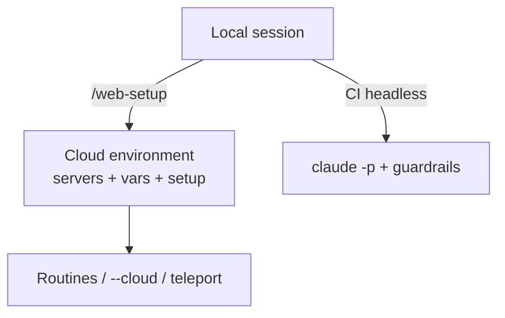

# FAQ 10 — CI, SDK, routines, web

> **Bài này cho ai:** bạn cần dùng Claude Code trong CI, đẩy task lên cloud, chạy routines định kỳ, hay nhúng SDK vào quy trình tự động.
> **Cần gì trước:** đã đọc [FAQ 01 — tài khoản, pricing & cài đặt](01-tai-khoan-pricing-cai-dat.md); biết `claude login` / `claude -p`; máy có terminal cơ bản.
> **Đọc xong bạn làm được:**
> - Chạy Claude trong CI an toàn với allowlist hẹp và secrets từ env.
> - Dùng `Setup` hook event đúng flag (`--init-only` / `--init` / `--maintenance`).
> - Tạo và chạy routines trên cloud, dùng `/web-setup` + `claude --cloud`, chuyển session bằng `/teleport`.
> - Biết khi nào dùng Agent SDK thay vì `claude -p`, dùng `claude mcp serve`, đọc analytics theo plan.
> - Áp dụng checklist an toàn trước khi bật bất kỳ automation nào.
> **Thời gian:** ~20 phút.

## Thuật ngữ dùng trong bài này

| Thuật ngữ | Hiểu nôm na là gì | Ví dụ thấy ngay |
|---|---|---|
| CI (continuous integration) | Tự động chạy kiểm tra/build khi code thay đổi | GitHub Actions chạy `claude -p` review PR |
| SDK (software development kit) | Bộ API để nhúng Claude vào app riêng | Agent SDK viết bot nội bộ |
| routines | Nhiệm vụ chạy định kỳ trên cloud Anthropic | `/schedule` chạy digest 8h sáng |
| web/cloud | Mặt web/cloud của Claude (cần sign-in claude.ai) | `/web-setup`, `claude --cloud`, `/teleport` |
| headless | Chạy không cần tương tác người dùng | `claude -p "ping"` trong CI |
| allowlist | Danh sách tool được phép dùng, giới hạn tối đa | `--allowedTools "Read Grep Glob"` |
| dontAsk | Chạy tự động, không hỏi xác nhận | `--permission-mode dontAsk` |
| Setup hook | Hook chạy 1 lần chuẩn bị môi trường trước task | `--init` / `--init-only` / `--maintenance` |
| teleport | Chuyển session giữa terminal ↔ cloud | `/teleport` tiếp tục task dở |
| MCP | Giao thức kết nối tool ngoài | `claude mcp serve` biến Claude thành MCP server |

## Mục lục

- [Sơ đồ nhanh (nhìn 30 giây là nhớ)](#sơ-đồ-nhanh-nhìn-30-giây-là-nhớ)
- [Bảng tổng hợp: chọn đường automation nào?](#bảng-tổng-hợp-chọn-đường-automation-nào)
- [1. Dùng Claude trong CI thế nào mà vẫn an toàn? (pattern + YAML)](#1-dùng-claude-trong-ci-thế-nào-mà-vẫn-an-toàn-pattern--yaml)
- [2. `Setup` hook event để làm gì?](#2-setup-hook-event-để-làm-gì)
- [3. Routines (`/schedule`) là gì?](#3-routines-schedule-là-gì)
- [4. Bắt đầu cloud session từ terminal?](#4-bắt-đầu-cloud-session-từ-terminal)
- [5. Teleport là gì?](#5-teleport-là-gì)
- [6. Agent SDK khi nào?](#6-agent-sdk-khi-nào)
- [7. `claude mcp serve` là gì?](#7-claude-mcp-serve-là-gì)
- [8. Analytics cho team?](#8-analytics-cho-team)
- [9. CI YAML hoàn chỉnh: doctor-gate + secret-check + review?](#9-ci-yaml-hoàn-chỉnh-doctor-gate--secret-check--review)
- [10. Checklist automation mới trước khi bật?](#10-checklist-automation-mới-trước-khi-bật)
- [Vẫn lỗi thì sao? (CI/SDK/web)](#vẫn-lỗi-thì-sao-cisdkweb)
- [Tham khảo chéo](#tham-khảo-chéo)

## Sơ đồ nhanh (nhìn 30 giây là nhớ)

Mục tiêu: thấy ngay 3 đường tự động hoá — CI headless, cloud environment, và routines.



## Bảng tổng hợp: chọn đường automation nào?

Mục tiêu: chọn đúng đường theo nơi chạy và cái bạn cần.

| Đường | Chạy ở đâu | Cần gì | Dùng khi nào |
|---|---|---|---|
| `claude -p` CI (dontAsk + allowlist) | Runner CI | Sub/Console/Bedrock/AWS/GCP (Foundry ✗) | Review, migrate, triage tự động |
| `Setup` hook event | CI/scripts 1 lần | `--init-only` / `--init` / `--maintenance` | Chuẩn bị môi trường trước task |
| Routines (`/schedule`) | Cloud Anthropic | Subscription (sign-in claude.ai) | Digest sáng, dep audit, docs sync |
| `claude --cloud` + `/web-setup` | Cloud | `gh` CLI + environment | Task nặng, không muốn chạy local |
| Teleport (`/teleport`) | Terminal ↔ cloud | Subscription (sign-in claude.ai), sessions persist | Đổi máy giữa chừng |
| Agent SDK | App của bạn | Build agent riêng (tools+permissions+orchestration) | Quy trình đặc thù / UI riêng / nhúng internal |
| `claude mcp serve` | Máy bạn (stdio) | Expose Claude thành MCP server | Hệ khác gọi Claude như tool |
| Analytics (`/insights`, dashboard) | Team/Enterprise | Plan tương ứng | Đo habits, contribution theo plan |

## 1. Dùng Claude trong CI thế nào mà vẫn an toàn? (pattern + YAML)

> **Hỏi ngắn gọn:** dùng Claude trong CI thế nào mà vẫn an toàn?
>
> **Trả lời 1 câu:** Pattern an toàn 5 điểm: `-p` + `--output-format json` + `--permission-mode dontAsk` + `--allowedTools` hẹp + secrets từ runner env.

**Giải thích:** Provider hỗ trợ CI headless gồm Sub/Console/Bedrock/AWS/GCP — **Foundry ✗**. Không dùng `--dangerously-skip-permissions` ngoài sandbox. Luôn giới hạn tool bằng allowlist hẹp và đọc secrets từ environment runner, không hardcode.

**Ví dụ:** chạy review diff an toàn.

```bash
claude -p "review diff origin/main...HEAD, chỉ báo security + sai logic, bỏ style. Trả JSON." \
  --output-format json \
  --permission-mode dontAsk \
  --allowedTools "Read Grep Glob Bash(git diff:*) Bash(git log:*) Bash(npm test:*)"
```

**YAML ví dụ (GitHub Actions — review PR):**

```yaml
name: claude-review
on: [pull_request]
jobs:
  review:
    runs-on: ubuntu-latest
    steps:
      - uses: actions/checkout@v4
        with: { fetch-depth: 0 }
      - run: curl -fsSL https://claude.ai/install.sh | bash
      - run: >
          claude -p "Review diff origin/main...HEAD, chỉ báo security + sai logic, bỏ qua style. Trả JSON."
          --output-format json
          --permission-mode dontAsk
          --allowedTools "Read Grep Glob Bash(git diff:*) Bash(git log:*)"
          > review.json
        env:
          ANTHROPIC_API_KEY: ${{ secrets.ANTHROPIC_API_KEY }}
      - run: python3 -c "import json; print(json.load(open('review.json'))['result'])"
```

**Kiểm tra nhanh:** chạy `claude -p "ping" --output-format json --permission-mode dontAsk --allowedTools "Read"` → JSON trả về ping, exit code 0 là xong.

**Đào sâu:** [FAQ 01 — tài khoản, pricing & cài đặt](01-tai-khoan-pricing-cai-dat.md) · [FAQ 03 — permissions & modes](03-permissions-modes.md) · [FAQ 09 — bảo mật & riêng tư](09-bao-mat-quyen-rieng-tu.md).

## 2. `Setup` hook event để làm gì?

> **Hỏi ngắn gọn:** `Setup` hook event để làm gì?
>
> **Trả lời 1 câu:** `Setup` chạy 1 lần để chuẩn bị môi trường cho CI/scripts — trước cả task chính.

**Giải thích:** 3 flag trong `-p`:

| Flag | Việc | Dùng khi nào |
|---|---|---|
| `--init-only` | Chỉ chạy Setup rồi thoát (không làm task) | Warm cache, check env trước giờ G |
| `--init` | Chạy Setup rồi làm task luôn | CI job chuẩn |
| `--maintenance` | Bảo trì (dọn cache, update index...) | Cron đêm |

**Ví dụ:** Setup script chạy `npm ci` + `migrate test` + kiểm tra `env` đủ, để task chính không kẹt vì thiếu đồ.

```bash
# CI job chuẩn: setup rồi review
claude -p "review diff" --init --output-format json --permission-mode dontAsk \
  --allowedTools "Read Grep Glob Bash(git diff:*)"

# Warm env đêm trước (không tốn task):
claude -p "" --init-only
```

**Kiểm tra nhanh:** `claude -p "" --init-only` exit 0 (env đủ, không tốn task) → chạy task thật với `--init` xanh là xong.

**Đào sâu:** [FAQ 05 — hooks](05-hooks-faq.md) · [FAQ 08 — lỗi thường gặp](08-loi-thuong-gap-troubleshooting.md).

## 3. Routines (`/schedule`) là gì?

> **Hỏi ngắn gọn:** Routines (`/schedule`) là gì?
>
> **Trả lời 1 câu:** Routines = task chạy định kỳ / gọi API / GitHub-event **trên cloud**: morning digest, CI analysis, dep audit, docs sync.

**Giải thích:** Routines cần **subscription** (sign-in, không API-key-only). Viết prompt như skill và gắn verify, nếu không nó "xong" mà không ai kiểm.

**Ví dụ:** tạo 3 routine trong session đã login Sub.

```bash
/schedule
# → tạo: morning digest 8h (tóm tắt PRs + CI đỏ + issues mới)
# → tạo: dep audit thứ 2 (list outdated + CVE, mở PR nếu patch)
# → tạo: docs sync (diff code vs docs, báo lệch)
```

Mẫu routine prompt (copy-paste):

```text
Mỗi sáng 8h: tóm tắt PRs mở + CI đỏ + issues mới (repo X).
Verify: mỗi mục kèm link. Không tự merge. Gửi digest về Slack #dev.
```

**Kiểm tra nhanh:** `/schedule` tạo xong → routine chạy đúng giờ theo prompt → digest ra đủ mục kèm link, không tự merge là xong.

**Đào sâu:** [FAQ 01 — tài khoản, pricing & cài đặt](01-tai-khoan-pricing-cai-dat.md) · [FAQ 09 — bảo mật & riêng tư](09-bao-mat-quyen-rieng-tu.md).

## 4. Bắt đầu cloud session từ terminal?

> **Hỏi ngắn gọn:** bắt đầu cloud session từ terminal thế nào?
>
> **Trả lời 1 câu:** 2 bước: `/web-setup` (cần `gh` CLI: sync token, tạo environment) rồi `claude --cloud "<task>"`.

**Giải thích:** Cloud environment lưu servers/env vars/setup script dùng chung. Mode cloud: **Accept edits** (tự sửa + push branch) / **Plan** (chờ duyệt). Không có Bypass.

**Ví dụ:** laptop yếu, task nặng (migrate 30 files) → đẩy lên cloud Accept edits, xong về check PR.

```bash
# 1. Chuẩn bị (1 lần/repo):
/web-setup
# → sync token qua gh, khai MCP servers + env vars + setup script cho cloud

# 2. Chạy:
claude --cloud "migrate endpoint X sang v2, mở PR"
# → cloud tự sửa + push branch (Accept edits) hoặc trình plan (Plan)
```

**Kiểm tra nhanh:** `/web-setup` tạo environment (token sync, MCP + vars khai xong) → `claude --cloud "task thử"` chạy xanh (không báo thiếu đồ) → chạy task thật là xong.

**Đào sâu:** [Bài 02 — các bề mặt: terminal/IDE/web/desktop](../01-huong-dan-su-dung/02-cac-be-mat-terminal-ide-web-desktop.md) · [FAQ 03 — permissions & modes](03-permissions-modes.md).

## 5. Teleport là gì?

> **Hỏi ngắn gọn:** Teleport là gì?
>
> **Trả lời 1 câu:** `/teleport` chuyển session đang làm dở giữa terminal ↔ cloud.

**Giải thích:** Sessions **persist cross-device** — bắt đầu ở công ty, tối về nhà resume tiếp. (`/teleport` cũng resume remote từ claude.ai.)

**Ví dụ:** chiều review PR ở terminal (30 turns), tối teleport lên cloud cho chạy tests nặng qua đêm, sáng resume lấy kết quả.

```bash
# Đang làm ở terminal, muốn lên cloud:
/teleport
# → session lên cloud, tiếp tục y mạch

# Ở nhà mở claude.ai → resume session sáng nay
/teleport
```

**Kiểm tra nhanh:** `/teleport` lên cloud → session hiện y mạch trên claude.ai (đủ context) → chạy tiếp xanh là xong.

**Đào sâu:** [lệnh `teleport`](../01-huong-dan-su-dung/commands/auth-settings/teleport/README.md) · [Bài 02 — các bề mặt](../01-huong-dan-su-dung/02-cac-be-mat-terminal-ide-web-desktop.md).

## 6. Agent SDK khi nào?

> **Hỏi ngắn gọn:** khi nào cần dùng Agent SDK?
>
> **Trả lời 1 câu:** Mặc định Claude Code đã đủ (load `.claude/` + `~/.claude/`); chỉ build SDK khi quy trình quá đặc thù.

**Giải thích:** Chỉ build SDK khi: pipeline riêng, cần UI riêng (dashboard nội bộ), nhúng internal (bot Slack/Teams riêng). Thu hẹp scope bằng `setting_sources` để không load hết config user. Khi nào **KHÔNG** dùng SDK: automation đơn giản thì `claude -p` trong CI là đủ (câu 1).

**Ví dụ (pseudocode — đọc SDK docs cho API thật):**

```python
agent = ClaudeAgent(
    tools=["Read", "Grep", "Glob"],       # hẹp nhất có thể
    permissions={...},                     # allowlist rõ
    setting_sources=["project"],           # chỉ .claude/, không ~/.claude/
)
result = agent.run("triage ticket X")
```

**Kiểm tra nhanh:** build agent SDK với `tools`/`permissions` hẹp + `setting_sources=["project"]` → agent chạy đúng scope config, không load `~/.claude/` là xong.

**Đào sâu:** [Bài 12 — Agent SDK, CI/CD](../01-huong-dan-su-dung/12-agent-sdk-ci-cd-automation.md) · [lệnh `claude-api`](../01-huong-dan-su-dung/commands/knowledge-system/claude-api/README.md).

## 7. `claude mcp serve` là gì?

> **Hỏi ngắn gọn:** `claude mcp serve` là gì?
>
> **Trả lời 1 câu:** `claude mcp serve` expose chính Claude Code thành **1 MCP stdio server** cho hệ khác gọi — đảo vai.

**Giải thích:** Thường Claude gọi MCP; lệnh này làm ngược lại — hệ khác gọi Claude như tool. Đa số trường hợp không cần chiều ngược này.

**Ví dụ:** bot Slack nội bộ cần "hỏi codebase" → add `claude mcp serve` làm backend.

```bash
# Expose Claude cho hệ khác (VD: IDE lạ, bot nội bộ):
claude mcp serve --transport stdio
# → hệ khác add như 1 MCP server stdio bình thường
```

**Kiểm tra nhanh:** chạy `claude mcp serve --transport stdio` → hệ khác add được như 1 MCP server stdio + gọi được tool là xong.

**Đào sâu:** [FAQ 04 — MCP](04-mcp-faq.md) · [lệnh `mcp-serve`](../01-huong-dan-su-dung/commands/knowledge-system/mcp-serve/README.md).

## 8. Analytics cho team?

> **Hỏi ngắn gọn:** đo lường usage cho team thế nào?
>
> **Trả lời 1 câu:** Đo theo plan (càng cao càng sâu):

**Giải thích:**

| Công cụ | Ra gì | Plan |
|---|---|---|
| `/stats` | Token/tiền cá nhân | Mọi plan |
| `/insights` | HTML habits (giờ nào tốn, skill nào dùng) | Sub+ |
| Dashboard | Contribution metrics team | Team/Enterprise |
| Enterprise Analytics API | Pull metrics về BI nội bộ | Enterprise |
| Server-managed settings / SSO / SCIM | Quản lý tập trung | Theo plan ([FAQ 01](01-tai-khoan-pricing-cai-dat.md)) |

**Ví dụ:** cuối sprint chạy `/insights` 1 lần (skill nào không ai dùng → xóa; ai tốn 3x → coaching).

```bash
/stats       # tôi tốn bao nhiêu
/insights    # thói quen team (HTML)
/extra-usage  # usage vượt gói?
```

**Kiểm tra nhanh:** `/stats` (token cá nhân) + `/insights` (habits HTML) + `/extra-usage` (vượt gói) → thấy đủ chỉ số theo plan là xong.

**Đào sâu:** [lệnh `insights`](../01-huong-dan-su-dung/commands/knowledge-system/insights/README.md) · [lệnh `stats`](../01-huong-dan-su-dung/commands/knowledge-system/stats/README.md) · [FAQ 09 — bảo mật & riêng tư](09-bao-mat-quyen-rieng-tu.md).

## 9. CI YAML hoàn chỉnh: doctor-gate + secret-check + review?

> **Hỏi ngắn gọn:** CI YAML hoàn chỉnh trông thế nào?
>
> **Trả lời 1 câu:** Gộp 3 jobs vào 1 workflow: (1) secret-check (rẻ, chạy trước), (2) doctor-gate (điểm <70 chặn merge), (3) review (đắt nhất, chạy sau cùng).

**Giải thích:** Thứ tự rẻ-trước-đắt-sau để fail nhanh. Phù hợp team ≥3 người.

**Ví dụ:**

```yaml
name: claude-ci
on: [pull_request]
jobs:
  secrets:
    runs-on: ubuntu-latest
    steps:
      - uses: actions/checkout@v4
      - run: git grep -E 'ghp_|sk-ant_|xoxb-|AKIA' -- .mcp.json .claude/ . && exit 1 || echo "secrets clean"
  doctor-gate:
    runs-on: ubuntu-latest
    needs: secrets
    steps:
      - uses: actions/checkout@v4
      - run: curl -fsSL https://claude.ai/install.sh | bash
      - run: claude /doctor --json > doctor.json
        env: { ANTHROPIC_API_KEY: ${{ secrets.ANTHROPIC_API_KEY }} }
      - run: python3 -c "import json,sys; d=json.load(open('doctor.json')); print(d['score']); sys.exit(1 if d['score']<70 else 0)"
  review:
    runs-on: ubuntu-latest
    needs: doctor-gate
    steps:
      - uses: actions/checkout@v4
        with: { fetch-depth: 0 }
      - run: curl -fsSL https://claude.ai/install.sh | bash
      - run: >
          claude -p "Review diff, chỉ security + sai logic."
          --output-format json --permission-mode dontAsk
          --allowedTools "Read Grep Glob Bash(git diff:*)" > review.json
        env: { ANTHROPIC_API_KEY: ${{ secrets.ANTHROPIC_API_KEY }} }
```

**Kiểm tra nhanh:** chạy workflow trên PR thật → job `secrets` ra "secrets clean" + `doctor-gate` ra điểm ≥70 + `review` ra `review.json` hợp lệ là xong.

**Đào sâu:** [lệnh `doctor`](../01-huong-dan-su-dung/commands/knowledge-system/doctor/README.md) · [FAQ 08 — lỗi thường gặp](08-loi-thuong-gap-troubleshooting.md) · [FAQ 03 — permissions & modes](03-permissions-modes.md).

## 10. Checklist automation mới trước khi bật?

> **Hỏi ngắn gọn:** cần kiểm gì trước khi bật một automation mới?
>
> **Trả lời 1 câu:** Chạy checklist này trước khi schedule/bật bất kỳ automation nào.

**Giải thích:** Checklist gồm 5 mục: allowlist hẹp, secrets từ env, chạy tay 1 lần xanh, headless-safe, verify đã gắn.

**Ví dụ:**

```bash
# 1. Allowlist hẹp? (không bypass ngoài sandbox)
/permissions
# 2. Secrets từ env? (git grep rỗng?)
git grep -E 'ghp_|sk-ant_' -- .mcp.json .claude/ .
# 3. Chạy tay 1 lần xanh với đúng flags CI?
claude -p "<task>" --output-format json --permission-mode dontAsk --allowedTools "Read Grep Glob ..."
# 4. Headless-safe? (hooks không prompt)
/hooks
# 5. Verify gắn chưa? (ai check output? tests? human?)
/verify
```

**Kiểm tra nhanh:** `/permissions` (allowlist hẹp, không bypass ngoài sandbox) → `git grep -E 'ghp_|sk-ant_' -- .mcp.json .claude/ .` ra rỗng → `claude -p` chạy tay 1 lần xanh → `/hooks` + `/verify` OK → bật được automation là xong.

**Đào sâu:** [FAQ 05 — hooks](05-hooks-faq.md) · [FAQ 03 — permissions & modes](03-permissions-modes.md) · [FAQ 08 — lỗi thường gặp](08-loi-thuong-gap-troubleshooting.md).

## Vẫn lỗi thì sao? (CI/SDK/web)

1. CI deny → allowlist hẹp-đúng + `dontAsk` (câu 1), không bypass.
2. Cloud thiếu đồ → `/web-setup` lại environment (câu 4, FAQ 04 câu 9).
3. Version lệnh lạ → `/status` + `claude update` ([FAQ 01 câu 7](01-tai-khoan-pricing-cai-dat.md#7-claude-update-và-version-floor-lệnh-lạ-90-là-version-cũ)).
4. Rate/provider → `/usage` + đổi key (Foundry không hỗ trợ `-p`).
5. `/debug` → chẩn đoán; `/bug` kèm `/status` + `doctor`.

```bash
claude -p "ping" --output-format json --permission-mode dontAsk --allowedTools "Read"
```

## Tham khảo chéo

- Lệnh liên quan:
  - [../01-huong-dan-su-dung/commands/auth-settings/teleport/README.md](../01-huong-dan-su-dung/commands/auth-settings/teleport/README.md) — chuyển session terminal ↔ cloud
  - [../01-huong-dan-su-dung/commands/knowledge-system/doctor/README.md](../01-huong-dan-su-dung/commands/knowledge-system/doctor/README.md) — doctor-gate trong CI
  - [../01-huong-dan-su-dung/commands/knowledge-system/insights/README.md](../01-huong-dan-su-dung/commands/knowledge-system/insights/README.md) — analytics habits
  - [../01-huong-dan-su-dung/commands/knowledge-system/stats/README.md](../01-huong-dan-su-dung/commands/knowledge-system/stats/README.md) — đo tiêu thụ
  - [../01-huong-dan-su-dung/commands/auth-settings/status/README.md](../01-huong-dan-su-dung/commands/auth-settings/status/README.md) — provider/version cho CI
  - [../01-huong-dan-su-dung/commands/knowledge-system/claude-api/README.md](../01-huong-dan-su-dung/commands/knowledge-system/claude-api/README.md) — migrate/onboard API
- Bài tổng quan:
  - [../01-huong-dan-su-dung/02-cac-be-mat-terminal-ide-web-desktop.md](../01-huong-dan-su-dung/02-cac-be-mat-terminal-ide-web-desktop.md) — dựng cloud environment
  - [../01-huong-dan-su-dung/12-agent-sdk-ci-cd-automation.md](../01-huong-dan-su-dung/12-agent-sdk-ci-cd-automation.md) — SDK + CI chi tiết
  - [../01-huong-dan-su-dung/01-cai-dat-va-xac-thuc.md](../01-huong-dan-su-dung/01-cai-dat-va-xac-thuc.md) — provider nào hỗ trợ CI
  - [../02-tips-thuc-chien/09-teamwork-chuan-hoa.md](../02-tips-thuc-chien/09-teamwork-chuan-hoa.md) — chuẩn hóa team + CI gates
- FAQ liên quan: [FAQ 01](01-tai-khoan-pricing-cai-dat.md) (provider), [FAQ 03](03-permissions-modes.md) (headless), [FAQ 04](04-mcp-faq.md) (MCP), [FAQ 05](05-hooks-faq.md) (hooks), [FAQ 09](09-bao-mat-quyen-rieng-tu.md) (CI an toàn).

> Mẹo 1 dòng: _CI thì dontAsk + allowlist hẹp + secrets từ env — và automation nào cũng phải có verify._
